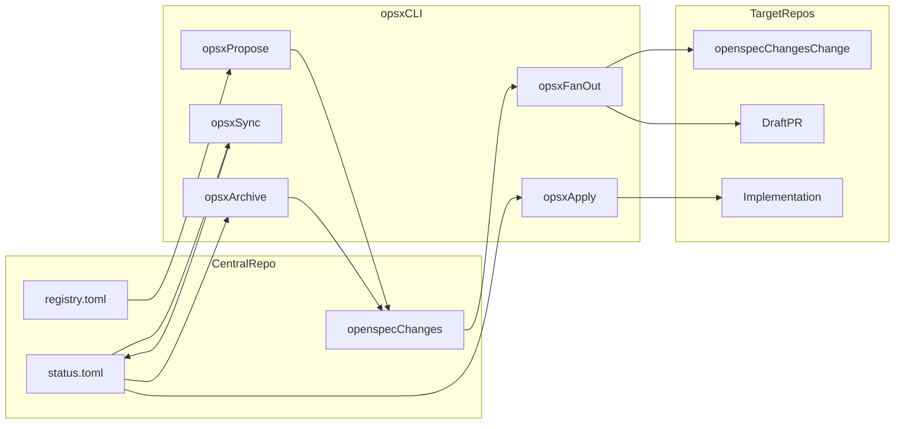

# OPSX Lifecycle

`opsx` is a Rust CLI for centralized planning and distributed execution of OpenSpec-driven changes across many repositories.

It combines:

- a central plan in this repo (`registry.toml`, `openspec/changes/<change>/pipeline.toml`, `status.toml`)
- a pluggable spec engine adapter (`SpecEngine`, currently `OpenSpecEngine`)
- automated fan-out, apply, and PR lifecycle synchronization

## How It Works



## Workspace Layout

```text
.
├── registry.toml
├── openspec/
│   ├── config.yaml
│   ├── schemas/
│   ├── templates/
│   └── changes/
│       └── <change>/
│           ├── current-state.md
│           ├── proposal.md
│           ├── specs/
│           ├── design.md
│           ├── manifest.md
│           ├── pipeline.toml
│           └── status.toml
└── src/
```

## Command Reference

### `opsx propose <change> --description "<text>"`

Generate central planning artifacts for a change:

- `current-state.md`
- `proposal.md`
- `specs/*/spec.md`
- `design.md`
- `manifest.md`
- `pipeline.toml`

The command invokes the configured agent backend in the workspace root and validates generated `pipeline.toml` against `registry.toml`.

### `opsx fan-out <change> [--dry-run]`

Distribute a central change to all affected repositories:

- clone target repos
- create branch `opsx/<change>`
- install schema/templates/config
- scaffold target change
- open draft PR per repo group
- set target states to `distributed`

### `opsx apply <change> [--target <id>]`

Execute implementation in dependency order:

- reads `pipeline.toml`
- applies topological ordering
- invokes agent command (`/opsx:apply <change>`) in each target repo
- commits and pushes on success
- updates target state to `implemented` or `failed`

### `opsx sync <change> [--mark-ready]`

Synchronize GitHub PR metadata into `status.toml`:

- `OPEN` + non-draft PR -> `reviewing` (from `implemented`)
- `MERGED` -> `merged`
- `CLOSED` (not merged) -> `failed`

`--mark-ready` promotes draft PRs to ready-for-review for implemented targets.

### `opsx status <change>`

Print status table across all targets and progress summary.

### `opsx archive <change>`

Archive a fully merged change:

- invokes archive command in target repos
- updates targets to `archived`
- moves central change folder to `openspec/changes/archive/<date>-<change>`

### Registry Commands

- `opsx registry list`
- `opsx registry query --domain <domain>`
- `opsx registry query --cap <capability>`

## Agent Backend

`opsx` supports configurable backends through `OPSX_AGENT_BACKEND`:

- `claude` (default): execute via `claude --message ... --yes`
- `dry-run`: print/log command and return success without executing

## End-to-End Workflow

```bash
# 1) Plan in central repo
opsx propose r9k-http --description "Migrate XML ingestion to HTTP/JSON and update downstream adapter"

# 2) Human review of planning artifacts

# 3) Distribute to impacted repos
opsx fan-out r9k-http

# 4) Implement in dependency order
opsx apply r9k-http

# 5) Sync PR state (optional mark-ready)
opsx sync r9k-http --mark-ready

# 6) Archive after all PRs are merged
opsx archive r9k-http
```

## Development

```bash
cargo test
cargo clippy --all-features
cargo fmt --all
```

For long-form design context, see `plan.md`.
