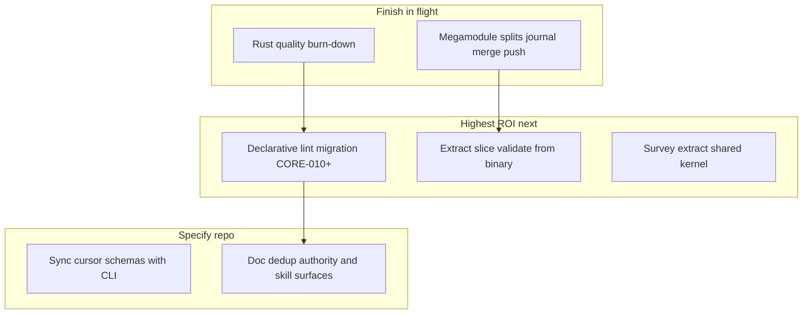

# Specify + Specify-CLI Review — Improve & Optimise

_Review date: 2026-06-03. Scope: [`augentic/specify`](https://github.com/augentic/specify) (docs/prompt repo) and [`augentic/specify-cli`](https://github.com/augentic/specify-cli) (Rust workspace). Mode: improve and optimise existing code — no new features._

Canonical cross-repo review. The CLI repo points here; do not maintain a second copy.

---

## Executive snapshot

| Repo | Size | Health |
| --- | --- | --- |
| `specify-cli` | ~530 Rust files, ~102k LOC (excl. `target/`). Largest prod modules: `journal.rs` (741), `adapter/core.rs` (744), `change/plan/core/propose.rs` (717), `slice/validate` handler (644), `framework/check/skill_body.rs` (675). | Strong conventions: typed errors, handler-shape docs, `#[expect]` over bare `#[allow]`, shared lint pipeline, schema embed parity CI. Debt is structural: imperative lint burn-down, megamodules, handler/domain split, integration-test mass. |
| `specify` | ~494 markdown files (skills, adapters, docs, schemas). 10 phase/capture/client `SKILL.md` files under `plugins/`. | Content is coherent post-reconciliation; remaining work is deduplication, schema mirror sync with CLI, and normalising a few skill outliers. `make lint` / `specdev lint` is the primary gate. |

### Where to focus first (highest ROI)

1. **Finish in-flight Rust quality burn-down** (`rust_source`, `rust_test_naming`, `docs/quality-debt.md`) — land the open CLI branch before larger refactors.
2. **Imperative → declarative lint (CORE-010..051)** — biggest lever for **specify** CI latency (`specdev lint` is the sole job, 15 min budget).
3. **Extract `slice/validate` out of the binary** — 644 LOC of domain logic still in `src/runtime/commands/`.
4. **Dedup `source/survey` + `source/extract` handlers** — parallel two-phase flows (~435 + ~416 LOC).
5. **Specify doc/schema hygiene** — `.cursor/schemas` mirror drift, authority link-only in adapters, collapse triple skill doc surfaces.

---

## Already addressed

Do not re-triage these; they were open in the 2026-06-02 review and are closed or superseded.

| Former item | Evidence |
| --- | --- |
| Uncached JSON Schema validators | `LazyLock` statics in [`specify-cli/crates/workflow/src/schema.rs`](https://github.com/augentic/specify-cli/blob/main/crates/workflow/src/schema.rs) (`SYNTHESIS_VALIDATOR`, `BUILD_REPORT_VALIDATOR`) |
| Swallowed `git fetch` in workspace sync | [`sync.rs`](https://github.com/augentic/specify-cli/blob/main/crates/workflow/src/registry/workspace/sync.rs) propagates fetch failure via `git::run` (no `.or(Ok(()))`) |
| Cache fingerprint `expect` panics | [`cache.rs`](https://github.com/augentic/specify-cli/blob/main/crates/workflow/src/adapter/cache.rs) — `unreachable!` on closed-shape `serde_json::to_vec` |
| Embedded schema byte parity | [`embedded_schemas_match_on_disk_sources`](https://github.com/augentic/specify-cli/blob/main/crates/schema/tests/schemas.rs) in `crates/schema/tests/schemas.rs` |
| Frontmatter splitter triplication | Unified [`frontmatter::split`](https://github.com/augentic/specify-cli/blob/main/crates/standards/src/lint/index/frontmatter.rs) in `lint/index/` |
| Dead `plugins/contract` in project rules | [`.cursor/rules/project.mdc`](.cursor/rules/project.mdc) layout lists `spec/`, `capture/`, `client/` only |
| Stale "~29 skills" count | [`docs/standards/skill-authoring.md`](docs/standards/skill-authoring.md) — "~10 skills" (matches 10 `SKILL.md` files) |
| Spec requirement template `Source:` vs `Sources:` | [`docs/reference/artifact-format.md`](docs/reference/artifact-format.md) — `ID:` / `Sources:` / `Status:` on requirements |
| `resolve-spec-conflicts` path drift | [`docs/how-to/resolve-spec-conflicts.md`](docs/how-to/resolve-spec-conflicts.md) — `.specify/slices/<name>/specs/<unit>/spec.md` |
| Omnia forked `review-team-protocol` | Single canonical [`docs/reference/review-team-protocol.md`](docs/reference/review-team-protocol.md); **CORE-008** enforces overlay digest |
| `delta-merge.md` orphan | File removed; merge skill uses `merge-runbook.md` |
| Lint double-pipeline drift | Shared [`lint/runner.rs`](https://github.com/augentic/specify-cli/blob/main/crates/standards/src/lint/runner.rs); fingerprint dedupe for CORE overlap |
| `clap` on `specify-model` | Removed — model crate has no CLI deps |
| `sha2` direct dep on `specify-tool` | Uses `specify-digest` instead |
| Static regex panic in `framework/check/tools.rs` | Retired / `LazyLock` pattern elsewhere (e.g. `skill_body.rs`, `links.rs`) |

### In progress (land before starting new structural work)

| Item | Status |
| --- | --- |
| Megamodule splits | `merge/engine`, `merge/slice/read`, `registry/workspace/push`, `journal/wire_shapes` — open branch |
| `journal.rs` | Down to **741** LOC (from ~1.3k) |
| `slice/validate.rs` | Down to **644** LOC (from ~922); still in the binary |
| Rust quality predicates | `RustTestNaming`, `RustSourceQuality`, `tests/rust_quality.rs`, [`specify-cli/docs/quality-debt.md`](https://github.com/augentic/specify-cli/blob/main/docs/quality-debt.md) |

---

## Part A — specify-cli (Rust)

### A1 — Imperative → declarative lint (structural, highest impact)

> **Implementation plan:** [`specify-cli/DIAGNOSTICS.md`](https://github.com/augentic/specify-cli/blob/main/DIAGNOSTICS.md) is the worked burn-down — predicate inventory, the per-rule parity-test invariant, Wave 0–7 sequencing, cross-repo touchpoints, and acceptance criteria. **Label mapping:** this item is **A16** there (the burn-down) plus its **A19** prerequisite (unify the `specdev` / `specrun lint` emit + dispatch path). Land A19 first, then A16 Wave 0 (retire the CORE-001..009 dupes) as a low-risk proof before the larger waves.

**Problem.** `specdev lint` composes one [`lint/runner`](https://github.com/augentic/specify-cli/blob/main/crates/standards/src/lint/runner.rs) envelope, but [`AuthoringProducer`](https://github.com/augentic/specify-cli/blob/main/src/authoring/commands/lint/run.rs) calls [`framework::check::run`](https://github.com/augentic/specify-cli/blob/main/crates/standards/src/framework/check.rs), which **re-walks the framework tree** and ignores the indexed [`WorkspaceModel`](https://github.com/augentic/specify-cli/blob/main/crates/standards/src/lint/model.rs). Declarative hints consume facts from a single index pass; imperative predicates do not.

**State.**

- **9** declarative CORE rules on disk: [`adapters/shared/rules/core/CORE-001`..`009`](adapters/shared/rules/core/) (in this repo).
- **43** imperative rule ids mapped in [`CORE_ID_TABLE`](https://github.com/augentic/specify-cli/blob/main/crates/standards/src/framework/builder.rs) (`CORE-010`..`051` and shared `CORE-009` for namespace ownership).
- **9** parity tests under `specify-cli/crates/standards/tests/core_parity_*.rs` guard CORE-001..008 against regression.

**Action.**

1. Migrate predicate clusters that already have parity tests or obvious `WorkspaceModel` facts (`skill_body`, `scenarios`, `links`, adapter manifest checks).
2. Add a parity test per migration (imperative vs declarative on fixtures).
3. Delete retired imperative bodies; shrink [`framework.rs`](https://github.com/augentic/specify-cli/blob/main/crates/standards/src/framework.rs) module `allow` (T2 in [`quality-debt.md`](https://github.com/augentic/specify-cli/blob/main/docs/quality-debt.md)).

**Payoff.** Cuts duplicate I/O on every `make lint` / specify CI run — the dominant cost for the plugin repo.

### A2 — Extract `slice/validate` from the binary

**Problem.** [`src/runtime/commands/slice/validate.rs`](https://github.com/augentic/specify-cli/blob/main/src/runtime/commands/slice/validate.rs) (~644 LOC) holds provenance scanning, model-drift gates, catalog drift, ID grammar, and journal emission. That violates [handler-shape.md](https://github.com/augentic/specify-cli/blob/main/docs/standards/handler-shape.md) ("no domain logic in the binary").

**Action.** Move validation kernel to `specify-validate` or `specify-workflow::slice::validate`; leave a thin handler (`ctx.write`, `validation_failed`, exit mapping). Add unit tests on extracted functions (today mostly covered only via integration goldens).

### A3 — Survey / extract handler dedup

**Problem.** [`src/runtime/commands/source/survey.rs`](https://github.com/augentic/specify-cli/blob/main/src/runtime/commands/source/survey.rs) (~435) and [`extract.rs`](https://github.com/augentic/specify-cli/blob/main/src/runtime/commands/source/extract.rs) (~416) duplicate two-phase agent/tool/cache/journal flows, handoff DTOs, fingerprinting, and formatters.

**Action.** Factor `source/op.rs` (or workflow-crate kernel) parameterised by `SourceOperation::Survey` vs `Extract`.

### Tier 1 — Quick wins

| # | Item | Action |
| --- | --- | --- |
| A4 | Cross-repo schema mirror | CI step (specify repo): diff `.cursor/schemas/*.json` against `specify-cli/schemas/**` for mirrored files. Today [`rule.schema.json`](.cursor/schemas/rule.schema.json) diverges from [`schemas/rules/rule.schema.json`](https://github.com/augentic/specify-cli/blob/main/schemas/rules/rule.schema.json) (hint `enum` vs `oneOf`, lint/review copy). |
| A5 | `validate_*` consolidation | ~14 near-identical validators in [`workflow/src/schema.rs`](https://github.com/augentic/specify-cli/blob/main/crates/workflow/src/schema.rs) → single `validate_parsed_json(schema, code, rule, content)`. |
| A6 | Rust quality burn-down | Run `cargo test --test rust_quality`; clear findings in `crates/`, `src/` per [`quality-debt.md`](https://github.com/augentic/specify-cli/blob/main/docs/quality-debt.md); rename long test fns; strip archaeology from `//!` / `///`. |

### Tier 2 — Dedup and test debt

| # | Item | Action |
| --- | --- | --- |
| A7 | Git subprocess layer | Unify `Command::new("git")` in `registry/branch`, `registry/workspace/git`, `init/git`, `push/remote` behind existing `CmdRunner`. |
| A8 | Adapter manifest dedup | `SourceAdapter` / `TargetAdapter` in [`adapter/core.rs`](https://github.com/augentic/specify-cli/blob/main/crates/workflow/src/adapter/core.rs) (~744 LOC) — shared base + axis-specific `briefs`. |
| A9 | Lint eval helpers | Dedup `set_coverage` / `set_eq` constants and brief iteration; shared path rendering in `lint/index/`. |
| A10 | Under-tested leaves | [`crates/model/src/atomic.rs`](https://github.com/augentic/specify-cli/blob/main/crates/model/src/atomic.rs) (atomic YAML — no dedicated tests); diagnostics render formatters; `validate` rule modules beyond goldens. |
| A11 | Golden brittleness | Decompose [`tests/slice.rs`](https://github.com/augentic/specify-cli/blob/main/tests/slice.rs) (1702), [`tests/plan_orchestrate/`](https://github.com/augentic/specify-cli/tree/main/tests/plan_orchestrate) (lifecycle 973, archive 872, propose 621) per [testing.md](https://github.com/augentic/specify-cli/blob/main/docs/standards/testing.md). |

### Tier 3 — Structural (multi-session)

| # | Item | Notes |
| --- | --- | --- |
| A12 | Megamodules (>650 LOC prod) | `journal.rs`, `change/plan/core/propose.rs`, `model/src/discovery/document.rs`, `adapter/core.rs`, `framework/check/skill_body.rs` — extract wire/taxonomy/tests submodules; journal wire taxonomy is contract-locked (see CLI `DECISIONS.md`). |
| A13 | Parallel finding types | `plan/core/model.rs::Finding`, `plan/doctor.rs::Diagnostic` vs `specify_diagnostics::Diagnostic` — adapter mappings to neutral currency. |
| A14 | Stringly-typed names | `plan_name` / `slice_name` / `source` as bare `String` — `PlanName` / `SliceName` newtypes at module boundaries. |
| A15 | Lint emit consistency | Both surfaces should route through [`emit_diagnostic_report`](https://github.com/augentic/specify-cli/blob/main/src/runtime/output.rs); specdev is largely there; verify specrun lint has no raw `println!` drift. |
| A16 | `propose.rs` project binding | Duplicate "explicit project vs sole project vs fail" in `bind_projects` and `resolve_target` — extract `resolve_project_binding`. |

### Deprioritize (out of optimise mode)

- `wasi-tools/*` carve-outs — self-contained; host discipline differs.
- `rfcs/future/*` in specify — not operational debt.

---

## Part B — specify (docs / skills / adapters)

### B1 — Schema and CI seam

- Add automated diff: `.cursor/schemas/` ↔ `specify-cli/schemas/` for embedded/mirrored schemas.
- Keep specify CI as [`specdev lint`](.github/workflows/ci.yaml) against live tree; finishing **A1** directly speeds this job.

### B2 — Reconciliation narrative

[`docs/explanation/reconciliation.md`](docs/explanation/reconciliation.md) is in [`docs/SUMMARY.md`](docs/SUMMARY.md). Finish cross-links from `concepts.md`, `augentic-specify-usage.md`, and adapter briefs so operators have one path: leads → evidence → `model.yaml` → `specs/<unit>/spec.md` (no persisted `provenance.yaml`).

### B3 — Captures fixture README

[`tests/fixtures/sources/captures/user-registration/README.md`](tests/fixtures/sources/captures/user-registration/README.md) — `expected/provenance.yaml` is a **projection golden** for `specrun slice provenance`, not a workflow artifact. Tighten the tree diagram so it cannot be read as stale 1.x layout.

### Tier 2 — Consolidation

| # | Item | Action |
| --- | --- | --- |
| B4 | Authority link-only | ~6+ adapter files still restate `intent > documentation > behaviour`; link [`plugins/spec/references/synthesis/authority.md`](plugins/spec/references/synthesis/authority.md) instead. |
| B5 | Trim `.cursor/rules/project.mdc` | Keep vocabulary and layout; link out workflow/artifact prose duplicated in `AGENTS.md` and `docs/explanation/*`. |
| B6 | Collapse triple skill docs | Canonical: `plugins/spec/skills/<phase>/SKILL.md`. Mirrors: `docs/reference/slice-skills/` (6 files), `docs/reference/change-skills/`. Pick one operator surface; others become index + links. |
| B7 | SKILL.md outliers | [`drop`](plugins/spec/skills/drop/SKILL.md), [`wiretapper`](plugins/capture/skills/wiretapper/SKILL.md), [`sow-writer`](plugins/client/skills/sow-writer/SKILL.md) — align to [`docs/standards/skill-authoring.md`](docs/standards/skill-authoring.md) (Critical Path, Guardrails, house headings). |

### Deprioritize

- Omnia/Vectis reference examples with intentional `TODO` markers — generation semantics, not repo hygiene.
- `rfcs/future/*` — informational.

---

## Part C — Cross-cutting

| Topic | specify | specify-cli |
| --- | --- | --- |
| CI | Single 15-min job: `cargo run … specdev lint --framework-root .` | Reusable org workflow → full [`cargo make ci`](https://github.com/augentic/specify-cli/blob/main/Makefile.toml) (fmt, clippy `-D warnings`, nextest, deny, vet, …) |
| Quality gates | Framework predicates + CORE-001..009 declarative | `cargo test --test rust_quality` + [`quality-debt.md`](https://github.com/augentic/specify-cli/blob/main/docs/quality-debt.md) |
| Schema authority | `.cursor/schemas` editor mirror | `schemas/` embedded via `specify-schema` |
| Standards split | Authoring: `specdev lint` / `make lint` | Engineering: `specrun lint` / rules under `adapters/**/rules/` |

**Process.** Land the open CLI branch (quality + megamodule splits) before **A2** or large **A1** migrations — keeps `git bisect` usable.

**Inline tests.** A large fraction of LOC in `workflow`, `standards`, and `model` lives in `#[cfg(test)]` modules inside prod files. Extracting to `tests/` or `*/tests.rs` improves navigation; do it when touching a megamodule anyway.

---

## Suggested sequencing

| Phase | Focus | Repos |
| --- | --- | --- |
| 1 | Land in-flight Rust quality + journal/merge/push splits; `cargo make ci` | cli |
| 2 | Schema mirror CI check; reconciliation cross-links; captures README clarity | specify |
| 3 | Survey/extract kernel (A3); git layer (A7) | cli |
| 4 | Extract `slice/validate` (A2); begin CORE-010+ migration with parity tests (A1, per [`DIAGNOSTICS.md`](https://github.com/augentic/specify-cli/blob/main/DIAGNOSTICS.md) waves) | cli |
| 5 | Megamodule splits (A12), golden decomposition (A11), doc dedup (B4–B7) | both |

Do correctness-adjacent quick wins (A4–A6) before moving modules, so behaviour stays pinned while files move.

---

## Reference — largest Rust files (prod + tests, specify-cli)

| LOC | Path |
| ---: | --- |
| 1702 | `tests/slice.rs` |
| 1192 | `crates/workflow/tests/workspace.rs` |
| 973 | `tests/plan_orchestrate/lifecycle.rs` |
| 899 | `crates/workflow/tests/registry.rs` |
| 872 | `tests/plan_orchestrate/archive.rs` |
| 744 | `crates/workflow/src/adapter/core.rs` |
| 741 | `crates/workflow/src/journal.rs` |
| 717 | `crates/workflow/src/change/plan/core/propose.rs` |
| 675 | `crates/standards/src/framework/check/skill_body.rs` |
| 644 | `src/runtime/commands/slice/validate.rs` |

_Use this table to pick the next split target after the in-flight journal/merge work lands._
