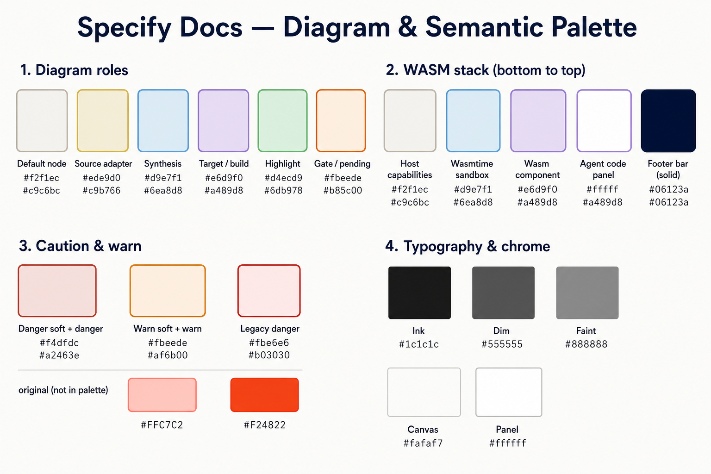

# Specify Docs — diagram & semantic palette

Light-theme colours for slides, SVG diagrams, and pitch assets aligned with the Specify developer guide. Standalone SVGs under `docs/assets/diagrams/` must use explicit hex from the **Diagram roles** table (see [`docs/assets/diagrams/_STYLE.md`](../docs/assets/diagrams/_STYLE.md)). Rendered mdBook content resolves the same hues via `--spec-*` tokens in [`docs/assets/theme/specify-docs.css`](../docs/assets/theme/specify-docs.css).

## 1. Diagram roles

Use fill + stroke pairs on rounded rects (`rx="8"`). Flow arrows and chevron markers: `#555555` at stroke-width `1.2`.

| Role | Fill | Stroke | Use for |
|------|------|--------|---------|
| Default node | `#f2f1ec` | `#c9c6bc` | Neutral steps, config, host capability tiles |
| Source adapter | `#ede9d0` | `#c9b766` | Input axis: enumerate, extract, bound sources |
| Synthesis / output | `#d9e7f1` | `#6ea8d8` | Core Specify workflow, artifacts, sandbox runtime |
| Target / build | `#e6d9f0` | `#a489d8` | Output axis: shape, build, merge, wasm32 deliverables |
| New / highlight | `#d4ecd9` | `#6db978` | Optional badges; stroke-width `1.5` |
| Gate / pending | `#fbeede` | `#b85c00` | Human gates (e.g. Gate 1); use sparingly |

### Typography (diagrams)

| Role | Hex |
|------|-----|
| Ink (titles) | `#1c1c1c` |
| Dim (mono subtitles) | `#555555` |
| Faint (pillar labels) | `#888888` |
| NEW badge text | `#2f7d3e` |

## 2. WASM stack (bottom → top)

Vertical runtime stack for Omnia / Wasmtime slides. Read bottom → top as platform in → artifact out.

| Layer | Fill | Stroke | Label |
|-------|------|--------|-------|
| Host capabilities | `#f2f1ec` | `#c9c6bc` | HTTP, Messaging, KeyValue, DocStore, … |
| Wasmtime sandbox | `#d9e7f1` | `#6ea8d8` | Wasm Runtime |
| Wasm component | `#e6d9f0` | `#a489d8` | wasm32-wasip2 outer box |
| Agent code panel | `#ffffff` | `#a489d8` | Inner business-logic box |
| Footer bar (solid) | `#06123a` | — | White type on this bar |
| Slide canvas | `#fafaf7` | — | Or `#ffffff` inside mdBook pipeline panels |

## 3. Caution & warn

Semantic pairs for errors, conflicts, gates, and admonitions. Prefer **danger** for conflict/error; **warn** for operator attention and pending gates.

| Pair | Soft fill | Accent / stroke | mdBook token (light) |
|------|-----------|-----------------|----------------------|
| Danger | `#f4dfdc` | `#a2463e` | `--spec-danger-soft` / `--spec-danger` |
| Warn | `#fbeede` | `#af6b00` | `--spec-warn-soft` / `--spec-warn` |
| Legacy danger | `#fbe6e6` | `#b03030` | Older `--spec-danger-*` before Augentic pass |
| Gate (diagrams) | `#fbeede` | `#b85c00` | Same soft as warn; stroke matches `_STYLE.md` gate |

### Slide colour replacements (not in palette)

| Original | Docs equivalent | Notes |
|----------|-----------------|-------|
| `#FFC7C2` | `#f4dfdc` | Danger soft fill; less saturated coral |
| `#F24822` | `#a2463e` | Danger accent; much less neon |
| `#FFC7C2` + `#F24822` (gate feel) | `#fbeede` + `#af6b00` | Use when the accent is warning, not error |

## 4. Typography & chrome

Augentic light docs theme (`html.light`, `html.rust` in mdBook).

| Role | Hex | mdBook token |
|------|-----|--------------|
| Ink | `#06123a` | `--spec-ink` |
| Ink (diagram baked) | `#1c1c1c` | Fixed in SVG `_STYLE.md` |
| Ink dim | `#30446f` | `--spec-ink-dim` |
| Ink muted | `#5b6f99` | `--spec-ink-muted` |
| Ink faint | `#8ca0c4` | `--spec-ink-faint` |
| Accent / links | `#005bea` | `--spec-accent` |
| Accent soft | `#eaf2ff` | `--spec-accent-soft` |
| Rule / border | `#d7e2f5` | `--spec-rule` |
| Canvas | `#fafaf7` or `#ffffff` | `--spec-bg` / `--spec-panel` |
| Panel alt | `#f1f6ff` | `--spec-panel-2` |

### Authority accents (HTML / CSS only)

Use as left borders or small tags on source-kind labels; keep diagram source boxes on **Source adapter** gold above.

| Authority kind | Hex (light) |
|----------------|-------------|
| Intent | `#006db0` |
| Documentation | `#005bea` |
| Behaviour | `#5546b8` |

## 5. Dark theme (mdBook navy / coal / ayu)

For screenshots or dark-mode chapters only — do not bake these into standalone light SVGs.

| Role | Hex |
|------|-----|
| Background | `#0d1218` |
| Panel | `#121b24` |
| Accent / links | `#7fd6ce` |
| Gold / intent highlight | `#f1d58a` |
| Danger | `#e58a7d` |
| Danger soft | `#321d1b` |
| Warn | `#d7a657` |
| Warn soft | `#302512` |
| Ink | `#e7ece7` |

## References

- Diagram contract: [`docs/assets/diagrams/_STYLE.md`](../docs/assets/diagrams/_STYLE.md)
- mdBook theme tokens: [`docs/assets/theme/specify-docs.css`](../docs/assets/theme/specify-docs.css)
- Canonical adapter-axis example: [`docs/assets/diagrams/adapter-anatomy/adapter-axes.svg`](../docs/assets/diagrams/adapter-anatomy/adapter-axes.svg)
