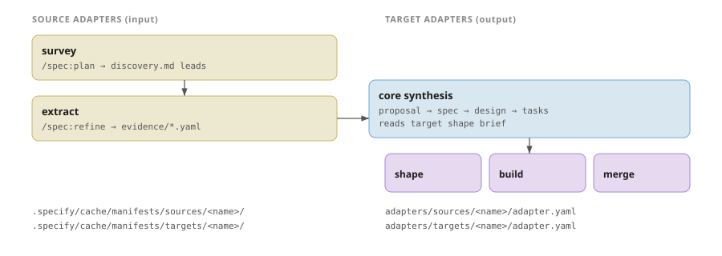

# Anatomy of an Adapter

Specify has two adapter roles with a shared shape. **Source adapters** turn external material (operator intent, written documentation, legacy code, screenshots) into structured `Evidence`. **Target adapters** turn that evidence into code by guiding core synthesis and driving build / merge. The role you are authoring decides which operations you implement; the on-disk shape is the same.

> [!NOTE]
> This page is the authoring contract — manifest fields, claim kinds, sandboxing, and authority resolution in detail. If you just want to understand *how an adapter fits into a change* (a legacy-code source surveys a lead, extracts evidence, and a target turns the resulting spec into code), read [From sources to slices](reconciliation.md) first. For the per-adapter field tables, see the [Source adapters](../reference/sources/index.md) and [Target adapters](../reference/targets/index.md) references.

<div class="audience-grid">
  <div class="audience">
    <div class="who">Source author</div>
    <div class="path"><a href="#source-adapter-contract">survey + extract</a> → <a href="#sandboxing">Sandboxing</a></div>
  </div>
  <div class="audience">
    <div class="who">Target author</div>
    <div class="path"><a href="#target-adapter-contract">shape + build + merge</a></div>
  </div>
  <div class="audience">
    <div class="who">Operator</div>
    <div class="path"><a href="#authority-resolution">Authority resolution</a> → <a href="../reference/cli/adapter.md">CLI resolve</a></div>
  </div>
</div>

## Two roles, one shared shape

| Axis     | Role         | Operations                  | Default examples                                 | Lives under              |
| -------- | ------------ | --------------------------- | ------------------------------------------------ | ------------------------ |
| `source` | input        | `survey`, `extract`      | `intent`, `documentation`, `code-typescript`, `screenshots` | `adapters/sources/<name>/`        |
| `target` | output       | `shape`, `build`, `merge`   | `omnia`, `vectis`, `contracts`                   | `adapters/targets/<name>/`        |

Both ship `adapter.yaml` validated by an axis-specific schema (`schemas/source.schema.json` or `schemas/target.schema.json` distributed with the CLI). The shared shape is the **plugin** (a vocabulary noun for the audience tag, not the Rust module name) — same manifest fields, same brief layout, same WASI tool sidecar story. The axis decides the operations.

Authority hierarchy is a property of the adapter, not of a slice. Source adapters declare which authority class they emit (`intent` > `documentation` > `behaviour`); core synthesis uses the class to resolve disagreements between two `Evidence` rows for the same claim. Operators override per-slice via `specify plan amend <entry> --authority-override <entry> <claim-kind>=<source>` and then re-run `/spec:refine`; the kernel-rendered `spec.md` provenance lines are never hand-edited (doing so trips `slice-spec-provenance-stale`). See [Authority resolution](#authority-resolution).

## Manifest shape

```yaml
# adapters/sources/<name>/adapter.yaml
name: code-typescript
version: 1
axis: source
execution: agent
briefs:
  survey: briefs/survey.md
  extract:   briefs/extract.md
```

```yaml
# adapters/targets/<name>/adapter.yaml
name: omnia
version: 1
axis: target
execution: agent
briefs:
  shape: briefs/shape.md
  build: briefs/build.md
  merge: briefs/merge.md
```

Shared rules: kebab-case `name` unique per axis; required closed `execution` mode (`agent` | `tool` — `agent` forces `cache: opt-out`); `briefs.keys()` is the canonical operation set (closed per axis by `source.schema.json` and `target.schema.json` — sources expose `survey` / `extract`, targets expose `shape` / `build` / `merge`); each declared key resolves to a brief markdown file; optional `tools[]` declaring WASI helpers that the host runs into the per-axis manifest cache at `.specify/.cache/manifests/{sources,targets}/<name>/`. Path-based `detect[]` auto-detection is deferred — operators bind sources explicitly (`source legacy=./repo`).

## Source adapter contract

A source adapter participates in two places in the lifecycle.

**`survey(Source) → Lead[]`** runs inside `/spec:plan`. It reads the operator-bound source path or value and emits one block per slice-sized **raw lead** under `## Lead inventory` in `discovery.md`. Each block carries a stable `lead` and the scalar `source` that surfaced it; identity is the `(source, lead)` pair. Re-surveying the same source replaces that source's blocks by `(source, lead)` and never merges across sources — cross-source unification is `/spec:plan`'s `propose` sub-step. The lead grammar:

```markdown
### legacy-monolith:user-registration

- lead: user-registration
- source: legacy-monolith
- synopsis: Registration endpoint accepting email + password with email-format validation.
```

**`extract(Lead, Source) → Evidence`** runs inside `/spec:refine`. It returns a structured document the CLI persists to `.specify/slices/<slice>/evidence/<source>.yaml`:

```yaml
authority: behaviour
lead: user-registration
claims:
  - kind: excerpt
    id: users.register.email-validation
    path: src/users/register.ts#L12-L87
```

Claims have a closed `kind` enum (`intent`, `requirement`, `criterion`, `decision`, `section`, `diagram`, `contract`, `excerpt`, `type`, `call`, `region`, `container`, `leaf`); new kinds require an RFC update. Top-level `authority:` is required per `Evidence`. The document's `(slice, source)` identity is path-borne (slice directory + `<source>.yaml` filename) and its adapter resolves from `plan.yaml.sources.<source>.adapter`, so neither is written in-document. `id` is required on `requirement` and `criterion` for deterministic reconciliation. Claim `path:` carries an optional GitHub-style anchor (`<path>`, `<path>#L<n>`, or `<path>#L<start>-L<end>`).

### Sandboxing

Source adapter operations run under the WASI Preview 2 posture: Wasm modules with directory preopens, no inherited host environment, no runtime network access, fixed working directory. The host pre-opens four runtime roots per call:

| Root              | Mode       | Contents                                                                            |
| ----------------- | ---------- | ----------------------------------------------------------------------------------- |
| `$SOURCE_DIR`     | read-only  | The operator-bound source path; absent for `value:`-style bindings.                 |
| `$CAPABILITY_DIR` | read-only  | `.specify/.cache/manifests/sources/<adapter>/` — adapter manifest cache (mirrored `adapter.yaml` + briefs). |
| `$SCRATCH_DIR`    | write-only | Per-operation scratch under the extraction tree, disjoint from the fingerprint result cache: `extract` → `.specify/.cache/extractions/<adapter>/<slice>/scratch/`; `survey` (plan-time, no slice) → `.specify/.cache/extractions/<adapter>/survey/scratch/`. |
| `$PROJECT_DIR`    | none       | Source adapters do not get the project root; lifecycle state stays off-limits.     |

Access outside these roots is denied. Symlinks are resolved during canonicalization; a symlink inside `$SOURCE_DIR` pointing outside it is denied even if its textual path looks contained. A denied access surfaces as structured error `source-extract-path-denied` (or `source-survey-path-denied`) and the slice stays `refining`. Resolution paths: rebind the source via `specify plan amend` to include the needed root, or drop the source.

Under `execution: agent` the runner dispatches the operation in two phases: `prepare` builds the sandbox above, scaffolds the output target, emits `source.execution.agent`, and prints a handoff envelope on stdout, then returns control; the agent runs the brief against the prepared directory; `finalize` validates the output before it becomes visible (lead set / Evidence schema), then merges it into `discovery.md` (`survey`) or persists `evidence/<source>.yaml` (`extract`) and writes the cache. Under `execution: tool` the operation is single-phase. The CLI never blocks on agent work.

## Target adapter contract

Target adapters do not own `spec.md` or `design.md` synthesis. They contribute three briefs:

- **`shape`** — idiom guidance consumed by core synthesis. The brief shapes how `proposal.md` / `spec.md` / `design.md` / `tasks.md` are written for slices that target this adapter. Empty `shape` is valid; the brief is read into context, not executed.
- **`build`** — implementation drive: consume **only** the build request's `inputs` manifest (the rendered `proposal.md` / `spec.md` / `design.md` / `tasks.md` plus the adapter's declared `inputs[]`), write code (and any target-specific structured manifests like Vectis `composition.yaml`), run target-local validation, and write the build report to `build/report.yaml`. `specify slice build` owns request assembly, report validation, and the `built` transition gate; the brief owns only code generation.
- **`merge`** — landing gate: requires lifecycle `built`, re-runs the target's validators per the merge brief, surfaces conflicts, and drives verification commands (e.g. `cargo build --target wasm32-wasip2 --release`). v1 adds **no** merge envelope — `specify slice merge` is the writer and `slice.merge.*` events fire on its validator outcome.

A target adapter MAY declare an optional `inputs[]` field — a flat list of `{ path, required }` entries naming the target-specific build inputs `build` consumes (e.g. Vectis `tokens.yaml` / `assets.yaml` / `components.yaml` or the contracts `contracts/` subtree). Paths are relative to the build request's `inputs.root` (the slice tree); the CLI resolves them into the request's `inputs.artifacts.additional[]`, and a missing `required` path aborts the build with `target-build-input-missing`. v1 keeps the declaration a flat path list — globs and conditional inputs are deferred. See the [target adapter reference](../reference/targets/index.md#manifest-shape) and [`specify slice build`](../reference/cli/slice.md#specify-slice-build).

Target-specific structured outputs are produced by `build` alongside the code they accompany; they are not Specify artifacts and do not need a fourth capability. Each slice binds a `project` in `plan.yaml`; the target adapter is resolved on demand from that project (it is not stored per slice). v1 supports one target per project.

## Resolver and cache

<div class="pipeline">



<p class="pipeline-caption">Sources survey/extract into evidence; core synthesis reads target shape; target build/merge lands code.</p>
</div>

The adapter loader (`crates/workflow/src/adapter/`) routes by axis. There is no `if name == "intent"` branch in core — the first-party adapters ship as in-repo manifests under `adapters/sources/intent/`, `adapters/sources/documentation/`, `adapters/sources/code-typescript/`, `adapters/sources/screenshots/`, `adapters/targets/omnia/`, `adapters/targets/vectis/`, `adapters/targets/contracts/`, and resolve through the same code path as a third-party adapter. Removing a manifest takes the adapter out of the resolver's set.

CLI entry points: `specify source resolve <name>` and `specify target resolve <value>` load and validate the manifest on first use. `specify plan add`, `specify plan amend <entry> --add-source / --remove-source`, and `specify plan propose --from` write slice bindings into `plan.yaml`.

## Authority resolution

When two claims of the same kind disagree, core synthesis walks three steps in order. Per-slice overrides land on `plan.yaml` at Gate 1 via `specify plan amend <entry> --authority-override <entry> <claim-kind>=<source>`. (A per-Evidence per-kind `authority-overrides:` surface on each `evidence/*.yaml` file is deferred to a future RFC.) Normative detail for skill authors lives in [`plugins/spec/references/synthesis/authority.md`](../../plugins/spec/references/synthesis/authority.md).

<div class="authority-widget">
  <h4>Resolution flow — click a scenario</h4>
  <p style="font-size: 13px; margin: 0 0 10px;">
    When two claims of the same kind disagree, synthesis walks three steps in order. Pick a scenario to see which step fires.
  </p>
  <div class="auth-controls" id="auth-ctl">
    <button type="button" class="on" data-scenario="slice">Per-slice override set</button>
    <button type="button" data-scenario="default">No override, classes differ</button>
    <button type="button" data-scenario="tied">All same authority class</button>
  </div>

  <div class="auth-flow" id="auth-flow">
    <div class="auth-step" data-step="1">
      <div class="n">1</div>
      <div class="label">
        <strong>Per-slice <code>authority-override.&lt;kind&gt;</code></strong>
        <div class="desc">Matches a contributing source key → that source wins.</div>
      </div>
      <div class="verdict">slice winner</div>
    </div>
    <div class="auth-step" data-step="2">
      <div class="n">2</div>
      <div class="label">
        <strong>Default ordering</strong>
        <div class="desc"><code>intent &gt; documentation &gt; behaviour</code> on document-level <code>authority:</code>.</div>
      </div>
      <div class="verdict">default winner</div>
    </div>
    <div class="auth-step" data-step="3">
      <div class="n">3</div>
      <div class="label">
        <strong>Still tied</strong>
        <div class="desc"><span class="pill conflict">conflict</span> Status: <code>conflict</code> + <code>[conflict]</code> inline tag.</div>
      </div>
      <div class="verdict">no winner</div>
    </div>
  </div>
  <p style="font-size: 12px; margin: 8px 0 0; font-family: ui-monospace, monospace;">
    Every step that does not fire is consulted and skipped; the chain is byte-stable. Inspect outcomes with <code>specify slice provenance</code> (projected on demand from <code>model.yaml</code>).
  </p>
</div>

## Authoring checklist

1. **Pick the axis.** Source if your adapter reads external material and writes `Evidence`; target if your adapter consumes `spec.md` + `design.md` and writes code.
2. **Create the directory.** `adapters/sources/<name>/` or `adapters/targets/<name>/` with `adapter.yaml` and a `briefs/` subdirectory.
3. **Declare the operations.** Populate `briefs.<operation>` for each operation the adapter implements; `briefs.keys()` is the operation set and is closed per axis by the schema.
4. **Write the briefs.** Each brief is a markdown file the host hands to the agent. Source `survey` writes `discovery.md` blocks; source `extract` returns `Evidence` content; target `shape` is idiom guidance read into synthesis context; target `build` and `merge` drive code generation and landing.
5. **Declare tools (optional).** WASI helpers in `tools[]` resolve into the per-axis manifest cache at `.specify/.cache/manifests/{sources,targets}/<name>/`.
6. **Validate.** `specify source resolve <name>` / `specify target resolve <name>` exercises manifest loading; `make lint` runs the documentation predicates and the schema validators.

## Adapter manifests vs Cursor plugin manifests

Cursor and `specify` are different runtimes. The repo's adapter directories happen to double as Cursor plugin roots, but the two manifest systems are independent — they share no fields, no loader, and no discovery path.

- **`.cursor-plugin/plugin.json`** is read by Cursor itself to register IDE surface area: skills, rules, and slash commands. It is invisible to the `specify` CLI.
- **`adapter.yaml`** is read by the `specify` CLI through `SourceAdapter::resolve(name, project_dir)` and `TargetAdapter::resolve(name, project_dir)` (the post-Task-E typed entry points). Cursor never consults it.

Neither manifest references the other, neither loader probes for the other, and neither cache is shared. If you are answering "is there a JSON config for adapters?": no — `adapter.yaml` is the only manifest the CLI consumes; `plugin.json` is Cursor's, not Specify's.
