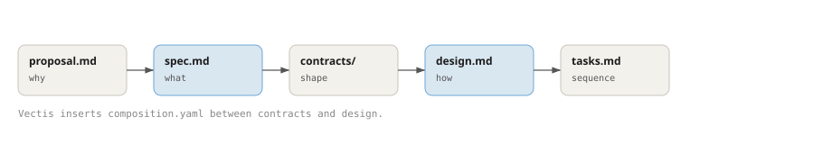

# Artifacts

Every Specify slice produces a set of interdependent artifacts. Together they form the contract between human intent and agent execution: durable, version-controlled files that outlive the chat session that created them.

This page explains *why* each artifact exists and *how they relate*. For the exact file formats, headings, and delta syntax, see the [Artifact format](../reference/artifact-format.md) reference.

## The dependency chain

The refine phase synthesizes artifacts in dependency order. Each one answers a different question and feeds the next:

proposal → spec → contracts → design → tasks; Vectis adds composition.yaml between contracts and design.

## The four core artifacts

Every slice produces these four, regardless of which target adapter it uses:

| Artifact | Question it answers | Location |
|----------|-------------------|----------|
| `proposal.md` | *Why* does this slice exist? What is in scope? | `.specify/slices/<name>/proposal.md` |
| `spec.md` | *What* must the system do? (behavioral requirements) | `.specify/slices/<name>/specs/<domain>/spec.md` |
| `design.md` | *How* will the behavior be implemented? | `.specify/slices/<name>/design.md` |
| `tasks.md` | In what *sequence* should it be built? | `.specify/slices/<name>/tasks.md` |

The split is deliberate: `proposal.md` and `spec.md` stay platform-neutral (the *why* and *what*), while `design.md` and `tasks.md` carry the project-specific *how*. Keeping behaviour separate from implementation is what lets the same spec drive different targets and survive a re-implementation.

A *domain* is one cohesive area of behaviour — typically a crate, module, or service. A slice that touches three domains produces three `specs/<domain>/spec.md` files.

## Contracts: the machine-readable shape

Where specs describe behaviour in prose, **contract artifacts** capture the machine-readable shape of the interfaces that behaviour relies on. They use three standard formats — JSON Schema for payloads, OpenAPI 3.1 for HTTP, and AsyncAPI 3.0 for messaging.

Contracts complement specs rather than replace them: specs say *what the system does*; contracts say *what the interfaces look like*. Both are needed for traceability and machine-readable integration.

Contracts are a *platform* concern — they describe interfaces *between* components, so they live at the repository root in `contracts/` (the baseline) with per-slice additions under `.specify/slices/<name>/contracts/`. See [Contract artifacts](../reference/artifact-format.md#contract-artifacts-api-shape) for the directory layout and naming rules.

## Composition: visual arrangement (Vectis only)

The Vectis target inserts a `composition.yaml` stage between contracts and design. It describes the spatial layout of each screen — regions, container structure, item placement, data bindings, and event wiring — so shell writers lay out screens deterministically rather than inferring structure. See [Composition document](../reference/artifact-format.md#composition-document-vectis-only) for the format.

## Decision Records: the durable "why"

A slice may also author **Decision Records** — the durable reasoning behind a design choice plus the alternatives it rejected. They store the *why*, never design *state* (domain models and API shapes stay in `design.md` and the code).

Unlike `design.md`, which is archived with its slice, accepted decisions accumulate into a reviewable, diffable baseline catalogue at `.specify/decisions/` — the design counterpart to what `.specify/specs/` is for behaviour. They are opt-in; most slices author none. See [Decision Records](../reference/artifact-format.md#decision-records-design-why) for the format and promotion rules.

## How artifacts move through their lifecycle

Artifacts live in three places over their lifetime:

1. **Working slice** — `.specify/slices/<name>/` holds the active slice and its artifacts while it is being refined and built.
2. **Baseline** — `.specify/specs/` holds the merged specs that represent the current known state of the system; `.specify/decisions/` holds the accepted Decision Records.
3. **Archive** — `.specify/archive/YYYY-MM-DD-<name>/` holds finalized slices (merged or dropped) as a prunable convenience cache.

When you run `/spec:merge`, the slice's spec deltas (`ADDED`, `MODIFIED`, `REMOVED`, `RENAMED` blocks keyed by stable `REQ-XXX` ids) are applied to the baseline. For Vectis slices, composition deltas are also merged into the baseline `composition.yaml` alongside spec files. Contract files are replaced wholesale at the root-level `contracts/` directory. Any Decision Records the slice authored are promoted into `.specify/decisions/` by the same opaque-add strategy — whole-file add with an engine-assigned `DEC-NNNN` id, never a prose delta-merge — and a newer record's `supersedes:` flips its named targets to `status: superseded`. The slice itself is then archived. The baseline grows over time, giving future slices a consistent foundation to build on. Accepted decisions also sharpen the project's routing identity at plan time (a third axis beside *what the project does* and *what recently changed*).

<strong>See also</strong>

- [Artifact format](../reference/artifact-format.md) — definitive structure, headings, and delta syntax
- [From sources to slices](reconciliation.md) — how evidence becomes a spec
- [Core concepts](concepts.md) — the vocabulary behind these artifacts

