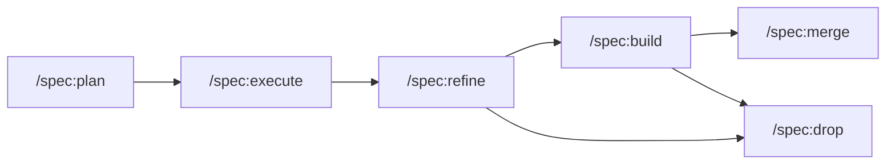

# Specify Guidance Supplement

This repository uses stock Specify as the executable workflow contract. This document is a repository-specific supplement describing how Augentic specialists use `proposal.md`, `spec.md`, `design.md`, and `tasks.md` during `/spec:plan -> /spec:execute` (which itself drives `/spec:refine -> /spec:build -> /spec:merge` per slice), with `/spec:drop` available when a slice should be discarded instead of merged. Artifact validation is performed automatically by `/spec:build` before implementation begins.

## Overview

Specify artifacts split change intent into four human-facing layers:

| Artifact | Purpose |
| --- | --- |
| `proposal.md` | Why the slice exists, what is in scope, and which adapters are affected |
| `specs/*/spec.md` | Behavioral requirements only: what the system must do |
| `design.md` | Technical shape and decisions needed to implement the behavior |
| `tasks.md` | Implementation sequencing and checkpoints |

Specialist skills in this repo consume those artifacts, but they should not redefine the Specify runtime contract.

## Artifact Lifecycle

Artifacts move through the normal Specify lifecycle:

1. `.specify/slices/<change>/` holds the working slice.
2. `.specify/specs/` holds the merged baseline specs.
3. `.specify/slices/archive/` holds finalized changes, including merged and dropped changes.

The human workflow is:



`/spec:execute` drives the per-slice loop (`/spec:refine` -> `/spec:build` -> `/spec:merge`); `/spec:drop` is the rollback exit from either `/spec:refine` or `/spec:build`.

## Artifact Locations

```text
$PROJECT_DIR      = <workspace root>
$SLICE_DIR       = $PROJECT_DIR/.specify/slices/<slice-name>
$SPECS_DIR        = $SLICE_DIR/specs
$DESIGN_PATH      = $SLICE_DIR/design.md
$PROPOSAL_PATH    = $SLICE_DIR/proposal.md
$TASKS_PATH       = $SLICE_DIR/tasks.md
$BASELINE_SPECS   = $PROJECT_DIR/.specify/specs
```

## Spec Files (Behavioral "What")

One spec file per adapter or crate, at `specs/<name>/spec.md`.

Specs are behavioral. They should not encode Omnia trait bindings, WASM implementation details, or generator-specific instructions.

### Spec File Format (Baseline / New Crate)

New crate specs and merged baselines use a flat requirement format. The hard-coded spec format (`plugins/spec/references/spec-format.md`) defines the requirement, scenario, and delta-operation headings used by all downstream skills.

```markdown
# <Crate Name> Specification

## Purpose

<1-2 sentence description of what this crate or adapter does>

### Requirement: <Behavior Name>

ID: REQ-001

The system SHALL <behavioral description>.
Source: <source function or design section>

#### Scenario: <Happy Path>

- **WHEN** <trigger or input>
- **THEN** <expected behavior>

#### Scenario: <Error Case>

- **WHEN** <invalid input or failing condition>
- **THEN** <expected error behavior>

## Error Conditions

- <error type>: <description and trigger conditions>

## Metrics

- `<metric_name>` — type: <counter|gauge|histogram>; emitted: <when>
```

### Delta Spec Format (Modified Crate)

When modifying an existing crate, delta specs use the operation headers defined in the spec format (`## ADDED Requirements`, `## MODIFIED Requirements`, `## REMOVED Requirements`, `## RENAMED Requirements`). Requirement blocks still use `### Requirement:` and `#### Scenario:` headings, but the stable merge key is the `ID: REQ-XXX` line rather than the display name. See the adapter's `briefs/specs.md` for the full delta structure and the merge skill for how deltas merge into the baseline.

### Deriving Specs From Source Code (extract)

Create a consolidated spec file from the source behavior:

1. Purpose from the role of the handler or function.
2. Requirements from distinct business rules, assigning stable IDs in spec order (`REQ-001`, `REQ-002`, ...).
3. Scenarios from happy paths, edge cases, and failures.
4. Error conditions from observed failure behavior.
5. Metrics only when they are explicit in the source.

## Design Document (Technical "How")

`design.md` carries the technical shape needed to implement the slice. It may reference constraints relevant to generation, but it should not hardcode target-specific bindings as part of the behavioral contract. When design sections refer to behavior from specs, cite the stable requirement IDs (for example, `REQ-003`) rather than relying on requirement titles staying unchanged.

### Design Document Format

````markdown
# Technical Design

## Context

- Source: <TypeScript component path | design document>
- Purpose: <component or change summary>
- Source paths: <analyzed files, if applicable>

## Domain Model

## API Contracts

## External Services

## Constants & Configuration

## Business Logic

## Publication & Timing Patterns

## Implementation Constraints

## Source Capabilities Summary

## Dependencies

## Risks / Open Questions

## Notes
````

### When To Create A Full Design

Create a full design if any of the following apply:

- Cross-cutting change (multiple services/modules) or new architectural pattern
- New external dependency or significant data model changes
- Security, performance, or migration complexity
- Ambiguity that benefits from technical decisions before coding

If none apply, create a minimal design.md noting that a full design is not warranted and referencing the proposal and specs.

For multi-crate changes, structure the document with crate-specific sections (`## Crate: <crate-name>`) each containing the relevant subsections.

Focus on the technical shape needed for implementation. Reference the proposal for motivation and specs for behavioral requirements. Use mermaid diagrams for entity relationships and flows.

### Design Ownership

`design.md` is where Augentic-specific technical detail belongs:

- domain models and type shapes
- API contracts and message shapes
- business logic pseudocode
- external integrations
- configuration
- risks, trade-offs, and migration notes

Generator-owned binding decisions such as Omnia trait composition remain in specialist skills and references.

## Proposal Document

Use `proposal.md` to capture why the slice exists and what is in scope. The adapter's brief file (`briefs/proposal.md`) provides the full output template.

The **Crates** section creates the contract between proposal and specs phases. Each crate listed will need a corresponding spec file at `specs/<name>/spec.md`. For repository sources, the analyzer discovers crates automatically.

Keep proposals concise (1-2 pages). Focus on the "why" not the "how" — implementation details belong in design.md.

## Tasks Document

Use `tasks.md` as an implementation checklist, not as another requirements or design document.

```markdown
## 1. Implementation

- [ ] 1.1 Refine proposal/spec/design artifacts
- [ ] 1.2 Implement code changes via `/spec:build`
- [ ] 1.3 Verify and review output
```

Tasks should describe sequencing, checkpoints, and ownership. They should not introduce new behavioral requirements.

**IMPORTANT: Follow the checkbox format exactly.** The build phase parses checkbox format to track progress. Tasks not using `- [ ]` won't be tracked.

Guidelines:

- Group related tasks under `##` numbered headings
- Each task MUST be a checkbox: `- [ ] X.Y Task description`
- Tasks should be small enough to complete in one session
- Order tasks by dependency (what must be done first?)
- Reference specs for what needs to be built, design for how to build it
- Each task MUST be agent-completable: a coding agent can perform the action and verify completion through code, local tooling, mocks, fixtures, contract validators, build commands, or reviewer skills
- Never generate tasks that require human-only action or judgement, such as manual app testing, visual inspection, real-world API credentials, production services, physical-device-only checks, app store review, or asking the user to verify behavior
- When behavior appears to require manual validation, write the equivalent agent-verifiable task instead (for example, a mocked API test, fixture replay, simulator/build check, contract test, or scripted smoke test)
- Before handing `tasks.md` off, the generating agent re-reads every checkbox and rewrites any task whose action requires human-only judgement or whose meaning could be misread out of context. For `tasks.md`, `specify slice validate` checks checkbox/grouping shape only (checkbox format, group headings); it does not inspect task intent, so agent-completability is judged here at write-time and re-checked by `/spec:build` as a preflight

### Skill Directive Tags

Tasks may optionally include a skill directive as an HTML comment. The build phase parses these tags and delegates the task to the named specialist skill instead of following the default build instruction.

```markdown
- [ ] 2.1 Generate the domain crate <!-- skill: omnia:crate-writer -->
- [ ] 2.2 Generate test suites <!-- skill: omnia:test-writer -->
- [ ] 2.3 Add fixture-backed integration tests for API behavior <!-- skill: omnia:test-writer -->
```

Tasks without a skill tag are implemented via the adapter's default build instruction (mode detection, verification loop, etc.). Use skill tags when a task maps directly to a single specialist skill invocation.

## Tags Reference

Tags are used in `design.md` business logic blocks.

| Tag | Use Case | Example |
| --- | --- | --- |
| `[domain]` | Business rules and validation | Validate order total matches line items |
| `[infrastructure]` | External calls or persistence | Fetch data from API or publish to queue |
| `[mechanical]` | Data transformations | Parse JSON or map fields |
| `[unknown]` | Explicit unresolved detail | Dependency behavior not specified |

## Unknown Tokens Reference

Use explicit unknown markers instead of guessing.

| Token | When to Use |
| --- | --- |
| `unknown — not specified in source` | The source material does not say |
| `unknown — ambiguous requirement` | The requirement is unclear or conflicting |
| `unknown — inferred from context` | Best effort summary, not explicitly stated |
| `unknown — open question` | The design material marks it as unresolved |

## Validation Checklists

### Behavioral Specs

- [ ] One spec file per adapter or crate
- [ ] Each spec has Purpose, flat Requirement blocks, stable `ID: REQ-XXX` lines, Scenarios, and Error Conditions
- [ ] Specs stay behavioral and avoid platform-binding detail
- [ ] Traceability is present for each requirement and can refer to its stable ID

### Technical Design

- [ ] `design.md` captures the domain model, APIs, business logic, integrations, and configuration
- [ ] Unknowns are marked explicitly
- [ ] Technical decisions live in design, not in specs

### Tasks

- [ ] `tasks.md` exists when `/spec:build` depends on it
- [ ] Tasks are implementation steps and checkpoints only
