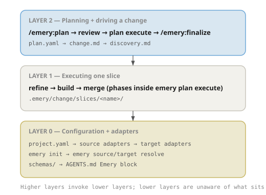

# The Layered Stack

Specify 2.0 is organised in three layers above the `specify` CLI substrate. Each layer is independently useful, and each builds on the one below it. The CLI is not itself a layer; it is the deterministic medium through which every layer enforces correctness.

Layer 2 plans and drives a change; Layer 1 executes one slice; Layer 0 holds configuration and adapters.

## Layer 0: Configuration and adapters

Layer 0 is the static project configuration plus the adapter manifests every higher layer reads. It declares **what** a project is — which target adapter receives its slices, which source adapters supply evidence, what schemas are in scope, what tools are available — without describing **how** any change is planned or executed.

The configuration surfaces:

- **`.specify/project.yaml`** — per-project manifest: `target:` (or `workspace: true` for a registry-only workspace), `specify-version`, `sources:` list of available adapters.
- **`adapters/sources/<name>/adapter.yaml`** — source adapter manifest (`axis: source`, `operations: [survey, extract]`).
- **`adapters/targets/<name>/adapter.yaml`** — target adapter manifest (`axis: target`, `operations: [shape, build, merge]`).
- **`schemas/`** — JSON Schema files distributed with the binary: `source.schema.json`, `target.schema.json`, `evidence.schema.json`, `discovery/lead.schema.json`, and the `plan.yaml` schema.
- **`AGENTS.md` Specify-owned block** — generated guidance the framework owns inside an otherwise operator-owned file.

The CLI verbs that read or change Layer 0 state:

- **`specrun init <target>`** / **`specrun init --hub`** — one-time scaffold of `.specify/`, writes `project.yaml`.
- **`specrun source resolve <name>`** / **`specrun target resolve <value>`** — load and validate an adapter manifest. The adapter loader (`crates/workflow/src/adapter/`) routes by axis.

Layer 0 settles before any change starts. Once `project.yaml` exists and the relevant adapters resolve, Layer 1 and Layer 2 can run.

## Layer 1: Executing one slice

Layer 1 is the per-slice `refine → build → merge` loop. It operates on **one slice** inside `.specify/slices/<name>/` and is the breakout surface every operator reaches when execute parks or when they want to drive a slice by hand.

Breakouts /spec:refine, /spec:build, /spec:merge share the same skill bodies as /spec:execute.

Each skill is an agent-driven orchestrator. It reads the brief pipeline declared by the active adapter (resolved from Layer 0), writes artifacts, invokes specialist plugin skills (e.g. `/omnia:crate-writer`), and renders summaries. Deterministic work is delegated to the `specify` CLI underneath.

The full set of Layer 1 skills:

| Skill          | Role                                                                                       |
| -------------- | ------------------------------------------------------------------------------------------ |
| `/spec:refine` | Run `extract` per bound source, synthesize artifacts, validate, transition to `refined`    |
| `/spec:build`  | Validate artifacts and implement tasks                                                     |
| `/spec:merge`  | Apply spec deltas to the baseline and archive the slice; only writer of per-entry `done`   |
| `/spec:drop`   | Discard a slice without merging                                                            |

The matching CLI surface is the **`specrun slice ...`** family: `slice create`, `slice transition`, `slice validate`, `slice merge`. Operators rarely call these directly; the skills wrap them.

## Layer 2: Planning and driving a change

Layer 2 carries every change through one rhythm: plan, Gate 1, execute, finalize. There is no separate "single-slice mode" — N=1 uses the same rhythm as N=12, with `intent.survey` producing one lead.

| Skill            | Role                                                                                                |
| ---------------- | --------------------------------------------------------------------------------------------------- |
| `/spec:plan`     | Survey each bound source, propose `slices[]` rows in `plan.yaml`, validate; exit at `pending`    |
| `/spec:execute`  | Drive the plan through the Layer 1 loop; refuses unless plan is `approved`                          |
| `/spec:finalize` | Push branches, observe PR state, archive once every PR is `MERGED`                                  |

The plan is the change's table of contents. `/spec:plan` produces it by surveying each source, reconciling leads across sources at `propose`, and halting at `plan.lifecycle: pending`. It prints the literal `specrun plan transition <name> approved` command in its closing hint. The operator stamps Gate 1 explicitly — `/spec:plan` never writes `approved` itself.

`/spec:execute` consumes the approved plan by picking the next eligible slice (`specrun plan next`), running the Layer 1 loop, and updating per-entry status. `/spec:finalize` closes the change once execution drains by pushing branches, confirming each PR is `MERGED`, and archiving `plan.yaml`.

The matching CLI surface spans **`specrun plan {create, add, amend, transition, next, finalize}`**, **`specrun workspace {sync, push, prepare}`** for multi-repo changes, and **`specrun tool run`** for declared WASI helpers.

### Gate 1: the operator review seam

The pause between `/spec:plan` and `/spec:execute` is the only review seam Specify 2.0 ships. `/spec:plan` writes `pending`; the operator writes `approved`. `/spec:execute` refuses on anything other than `approved`. This gives operators a deliberate point to inspect `plan.yaml`, read `change.md`, and curate entries with `specrun plan propose --from`, `specrun plan add`, `specrun plan remove`, or `specrun plan amend <entry>` before any per-slice work runs.

The framework does not ship a single "do everything" command. Teams that want one-command flow compose the three skills in their own shell wrapper, accepting that the wrapper opts out of Gate 1. The seam is observable on disk (`plan.lifecycle == approved`) so automation can opt-in cleanly.

## The layers compose

A key design principle: higher layers invoke lower layers, but lower layers are unaware of what sits above them. `/spec:execute` calls `/spec:refine`, `/spec:build`, and `/spec:merge` — the same skills you would invoke manually. The phase skills themselves do not know whether they are running inside `/spec:execute` or being driven by a human.

This means you can always drop down a layer:

- If `/spec:plan` produces a plan you want to adjust, use **re-propose** or `specrun plan add` / `specrun plan remove` for grouping and deferral, and `specrun plan amend <entry>` for divergence stamps, authority overrides, and single-source fixes — then stamp `approved` when ready.
- If `/spec:execute` parks on a slice, finish it manually with `/spec:build` and `/spec:merge`, then re-run `/spec:execute` to pick up the next entry.
- If `/spec:finalize` halts on an unmerged PR, merge through the forge UI and re-run.
- If a skill does something unexpected, inspect the underlying state by reading `plan.yaml` and `.specify/slices/<name>/.metadata.yaml` directly — they are plain YAML files.
