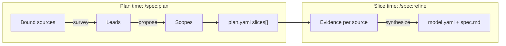

<div class="hero">
<div class="eyebrow">Understanding Specify</div>
<h1 class="hero-title">From sources to slices</h1>

Specify turns raw inputs — operator intent, written documentation, legacy code, screenshots, runtime captures — into behavioral specs. This page explains the two moments where that transformation happens, and how Specify keeps a clear trail back to where every requirement came from.

<div class="meta-row">

<span class="meta-chip"><strong>Read time</strong> ~10 min</span>

<span class="meta-chip"><strong>Depth</strong> Conceptual</span>

</div>

</div>

There are two distinct reconciliation moments, and they answer different questions:

- **Plan time — what work exists?** `/spec:plan` surveys each bound source for *leads* and reconciles them into the *slices* that make up the change.
- **Slice time — what must each unit do?** `/spec:refine` extracts *evidence* from each source and synthesizes it into the unit's `specs/<unit>/spec.md`, recording exactly which source contributed each requirement.



## Plan time: leads become slices

### A lead is a unit of work a source can see

When you run `/spec:plan`, each bound source runs its `survey` operation and emits **leads** — one block per slice-sized unit of work it can identify, written under `## Lead inventory` in `discovery.md`. A lead is identified by its `(source, lead)` pair, because the same lead name can appear in more than one source.

For example, a legacy-code source and a design-notes source might each surface a `user-registration` lead. They are describing the same feature, but `survey` does not yet know that — it only reports what each source sees on its own.

### Propose reconciles leads across sources

The cross-source matching happens in the **propose** sub-step of `/spec:plan`. The agent reads every lead and judges which ones describe the same piece of work. Each reconciled group is a **scope**: the set of leads — *at most one per source* — that belong together.

Two rules keep this predictable:

- **One lead per source, per scope.** A scope never fuses two leads from the *same* source. Re-sizing same-source work is an operator action at Gate 1, not something the agent does silently.
- **Uncertain matches are surfaced, not hidden.** When the agent is unsure whether two leads are the same work, it records the pair under `## Tentative merges` in `change.md` so you can confirm or split them. When two matched leads materially disagree, the slice is flagged `divergence: likely`.

Each scope becomes one or more `slices[]` rows in `plan.yaml`. (A single scope can fan out to several rows when its work lands in more than one project.) This is why a one-source, one-lead change and a twelve-slice migration use exactly the same machinery — the only difference is how many leads `survey` produced.

You review and adjust the proposed slices at **Gate 1** before stamping the plan `approved`. See [Amend a plan at Gate 1](../how-to/amend-plan-at-gate-1.md).

## Slice time: evidence becomes a spec

### Extract gathers evidence per source

When `/spec:refine` runs for a slice, each bound source runs its `extract` operation against its matched lead and returns an **Evidence** document, persisted to `.specify/slices/<slice>/evidence/<source>.yaml`. Evidence is structured: a list of `claims` (requirements, criteria, decisions, code excerpts, and so on) plus a top-level `authority` that records how much weight the source carries.

### Synthesize reconciles evidence into one spec

The slice then runs **synthesize**, which reconciles every source's Evidence into a single set of requirements. Two artifacts come out of this step:

- `specs/<unit>/spec.md` — the human-readable behavioral spec, one file per unit.
- `model.yaml` — a structured, machine-readable record of the same requirements, carrying provenance inline.

Each requirement in the spec carries three provenance lines:

```markdown
ID: REQ-001
Sources: [identity-design-notes, legacy-monolith]
Status: agreed
```

- **`ID:`** is a stable `REQ-XXX` identifier — the merge key that survives renames and lets later slices modify this requirement precisely.
- **`Sources:`** is the **provenance**: which sources contributed the requirement, highest authority first.
- **`Status:`** is a closed enum — `agreed`, `unknown`, `conflict`, or `divergence`.

## How disagreements are resolved

Two sources can disagree about the same requirement. Specify resolves this with **authority**, a closed ranking declared per source: `intent` > `documentation` > `behaviour`. (Operator intent outranks written docs, which outrank behaviour reverse-engineered from code.)

Synthesis walks three steps in order:

1. **Per-slice override.** If the operator set an authority override for this claim kind at Gate 1, the named source wins.
2. **Default ordering.** Otherwise the higher authority class wins. The losing claim survives as inline commentary, the requirement is tagged `[divergence]`, and `Status:` becomes `divergence`.
3. **Still tied.** If both claims sit at the same authority class and disagree, neither wins: the requirement is tagged `[conflict]` and `Status:` becomes `conflict`.

> [!IMPORTANT]
> Tags never park the slice. Synthesis tags the requirement and proceeds. The operator reconciles a `[conflict]` or `[divergence]` by hand-editing `spec.md` or amending the plan to drop a source. See [Resolve spec conflicts](../how-to/resolve-spec-conflicts.md).

## model.yaml and the provenance trail

`model.yaml` (at `.specify/slices/<slice>/model.yaml`) is the single structured record of a refined slice. It holds the requirement set with **inline provenance** — for each requirement, which claims contributed and which one won — plus the task list and a small header. It is the artifact `specrun slice validate` checks for drift, and it is what later steps read instead of re-parsing the markdown.

There is no separate `provenance.yaml` on disk. The full audit view is *projected on demand* from `model.yaml` and the Evidence files by `specrun slice provenance`, so the trail can never drift out of sync with the spec.

<div class="see-also">
<strong>See also</strong>

- [Core concepts](concepts.md) — the vocabulary used here
- [Anatomy of an adapter](adapter-anatomy.md) — how sources emit leads and evidence
- [Bind multiple sources](../how-to/bind-multiple-sources.md) — reconcile legacy code and docs at plan time
- [Resolve spec conflicts](../how-to/resolve-spec-conflicts.md) — clear `[conflict]` and `[divergence]` tags
</div>
