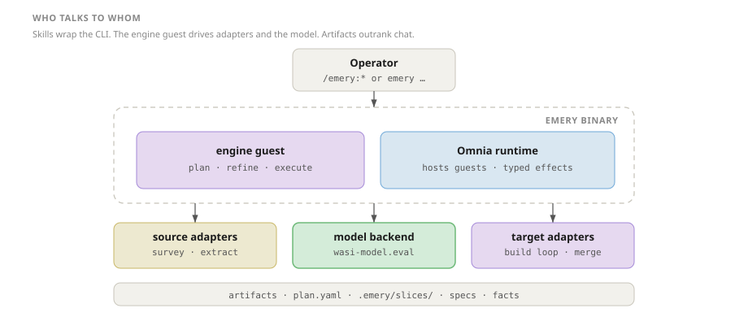
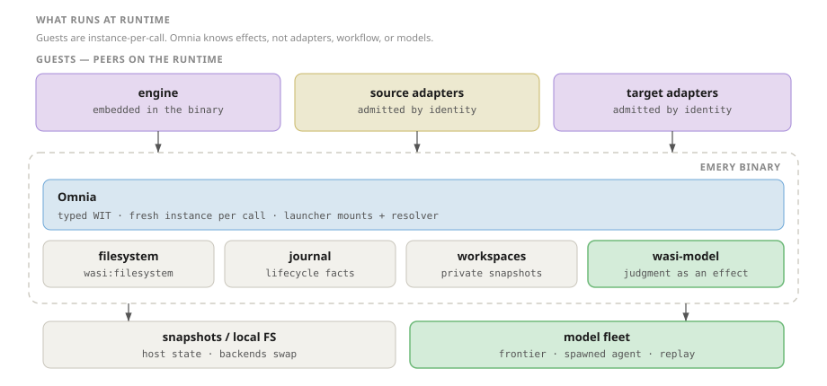
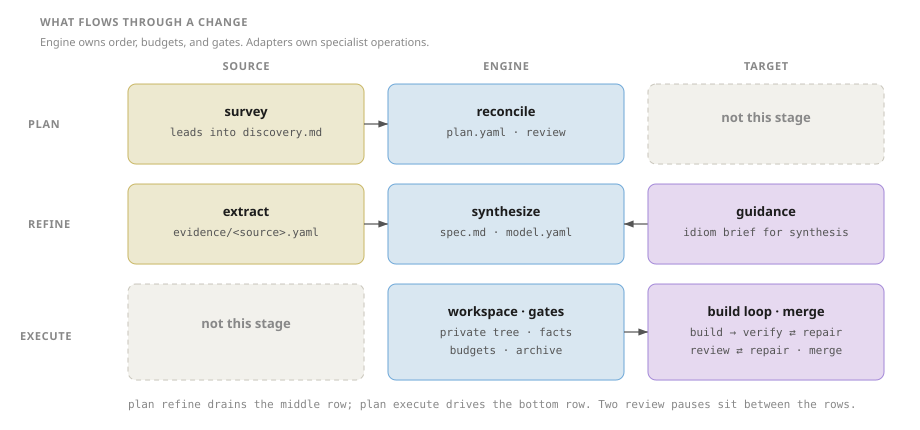
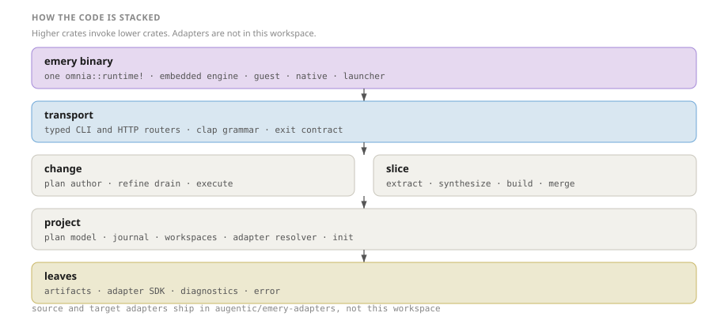

Understanding Emery

<h1 class="hero-title">Shape of the system</h1>

Four pictures of what Emery is. The runtime hosts guests and satisfies typed effects. Source adapters, target adapters, and the engine are peers on that runtime. Durable artifacts outrank chat.

<strong>Read time</strong> ~6 min

<strong>Depth</strong> Map

  
Operator

  

<a href="#who-talks-to-whom">Context</a> → <a href="#what-flows-through-a-change">Change flow</a> → <a href="concepts.md">Concepts</a>
  

  
Adapter author

  

<a href="#what-runs-at-runtime">Runtime</a> → <a href="#what-flows-through-a-change">Change flow</a> → <a href="adapter-anatomy.md">Anatomy</a>
  

  
Contributor

  

<a href="#what-runs-at-runtime">Runtime</a> → <a href="#how-the-code-is-stacked">Crates</a> → <a href="../contributing/cli-architecture.md">CLI architecture</a>
  

This page is a map. It does not teach you to plan, refine, or execute a change, or to author an adapter. Those live in [Core concepts](concepts.md), [The layered stack](layered-stack.md), and [Anatomy of an adapter](adapter-anatomy.md).

The standing thesis, compressed:

> Typed boundaries. The runtime knows only effects. Control is deterministic; judgment is a typed call. Handles cross the seam, not corpora.

## Who talks to whom

Operator → emery binary → engine guest → source adapters, target adapters, and the model. Artifacts persist on disk.

`/emery:*` skills are thin wrappers: each invokes one `emery` command and relays its output. The binary is Omnia compiled with Emery-specific guests. The engine guest owns workflow. Adapters own specialist operations. The model backend is a host effect (`wasi-model.eval`), not a conversational partner with lifecycle authority.

## What runs at runtime

Engine and adapter guests are peers. Omnia instantiates a fresh guest per call and satisfies filesystem, journal, workspace, and model effects.

The engine guest is embedded in the binary. Source and target adapters are admitted by identity on first dispatch. Guests hold no memory between calls. Persistent state lives in host services — the snapshot store, the journal, the private workspace — so the same guests can run against local files or swapped cloud backends.

Guest-to-guest calls are host-mediated: the engine names an adapter id, the host instantiates that guest, and typed WIT records cross. There is no ahead-of-time composition of engine plus adapters into one module.

## What flows through a change

Plan surveys sources into a topology. Refine extracts evidence and synthesizes specs. Execute builds in a private workspace and merges. Empty cells are intentional: that role is silent in that stage.

Read the grid as three stages and three roles. Source adapters speak at plan and refine (`survey`, `extract`). Target adapters speak at refine and execute (`guidance`, then the engine-driven build loop, then `merge`). The engine is in every row: it reconciles leads, synthesizes specs, and owns order, repair budgets, and gates.

Two review pauses sit between the rows — topology after plan, specifications after refine. Invoking `emery plan execute` opens the authorization epoch. An automation may run the stages back to back; the pauses are opportunities, not attestations.

## How the code is stacked

Binary and transport on top; change and slice in the middle; project then the leaf crates. Adapters ship in augentic/emery-adapters.

`change` owns the plan loop. `slice` owns extract, synthesis, build, and merge. Both sit on `project` (plan model, journal, workspaces, adapter resolver). `transport` is the typed CLI and HTTP surface. `guest` and `native` are two providers over the same engine crates; `launcher` is native-only deployment policy.

This is the same layering as [The layered stack](layered-stack.md), cut by crate instead of by invocation. Contributor rules for that layering live in [Architecture standards](../standards/architecture.md).

> [!NOTE]
> **Not on this map.** How to run a change, how to author an adapter, the RFC-104 definition home (architecture of a *surveyed client system*), and crate coding standards. Diagram Mermaid sources sit beside each SVG under `docs/assets/diagrams/system-shape/`.

<strong>See also</strong>

- [Core concepts](concepts.md) — vocabulary and the change rhythm
- [The layered stack](layered-stack.md) — invocation layers 0–2
- [Anatomy of an adapter](adapter-anatomy.md) — source and target roles
- [CLI architecture](../contributing/cli-architecture.md) — binary, launcher, dispatch
- [Emery on Omnia](../../rfcs/architecture.md) — standing runtime thesis

