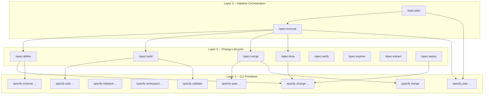

# The Three-Layer Stack

Specify is organised in three layers. Each layer is independently useful, and each builds on the one below it.



## Layer 1: CLI primitives

The `specify` CLI is the foundation. It owns every deterministic operation: creating and transitioning changes, validating artifacts, parsing tasks, merging specs, managing plans. Skills never hand-edit `.metadata.yaml`, never `mkdir -p .specify/...`, and never `mv` anything into the archive. All writes flow through the CLI.

The primary command families are:

- **`specify change ...`** -- create, inspect, transition, and archive individual changes.
- **`specify plan ...`** -- scaffold, populate, validate, transition, and archive an initiative plan.
- **`specify initiative ...`** -- manage the initiative brief and platform registry.
- **`specify workspace ...`** -- materialise, inspect, and push workspace clones for multi-repo initiatives.

**Who uses it:** Power users who want fine-grained control, CI pipelines, and anyone debugging the state of `.specify/`. Layer 1 is always available as a manual fallback beneath the higher layers.

## Layer 2: Change lifecycle

Layer 2 skills operate on a **single change** inside `.specify/changes/<name>/`. They form the define-build-merge loop:

```text
/spec:define  -->  /spec:build  -->  /spec:merge
```

Each skill is an agent-driven orchestrator. It elicits intent from the user, reads brief pipelines declared by the active schema, writes artifacts, invokes specialist plugin skills (e.g. `/omnia:crate-writer`), and renders summaries. Deterministic work is delegated to the Layer 1 CLI underneath.

The full set of Layer 2 skills:

| Skill | Role |
|-------|------|
| `/spec:init` | One-time project setup |
| `/spec:define` | Generate all artifacts for a new change |
| `/spec:build` | Implement tasks from a defined change |
| `/spec:merge` | Merge completed change into baseline |
| `/spec:drop` | Discard a change without merging |
| `/spec:status` | Inspect active changes and progress |
| `/spec:verify` | Detect drift between code and baseline specs |
| `/spec:explore` | Thinking partner -- no fixed workflow |
| `/spec:extract` | Produce specs and design from existing source code |

**Who uses it:** Every Specify operator, every day. This is the primary interaction layer.

## Layer 3: Initiative orchestration

Layer 3 skills coordinate **multi-change programs** through `.specify/plan.yaml` -- an ordered, dependency-aware list of changes with status tracking.

| Skill | Role |
|-------|------|
| `/spec:plan` | Author `plan.yaml` from inputs (legacy code, docs, or both) |
| `/spec:execute` | Drive the plan through the define-build-merge loop |
| `/spec:analyze` | Plan-time capability inference (used internally by plan) |

The plan is the initiative's table of contents. `/spec:plan` produces it by analysing inputs and proposing changes. `/spec:execute` consumes it by picking the next eligible change, running define-build-merge, and updating the plan's status.

```text
/spec:plan <name> --source legacy=./path  -->  /spec:execute --loop
```

**Who uses it:** Initiative leads coordinating multi-change programs -- greenfield builds, legacy migrations, platform modernisations.

## The layers compose

A key design principle: higher layers invoke lower layers, but lower layers are unaware of what sits above them. `/spec:execute` calls `/spec:define`, `/spec:build`, and `/spec:merge` -- the same skills you would invoke manually. The phase skills themselves do not know whether they are running inside an automated loop or being driven by a human.

This means you can always drop down a layer:

- If `/spec:execute` fails on a change, you can finish it manually with `/spec:build` and `/spec:merge`.
- If `/spec:plan` produces a plan you want to adjust, you can edit it with `specify plan amend` and drive it yourself with `specify plan next`.
- If a skill does something unexpected, you can inspect the underlying state with `specify change status` or `specify plan status`.
