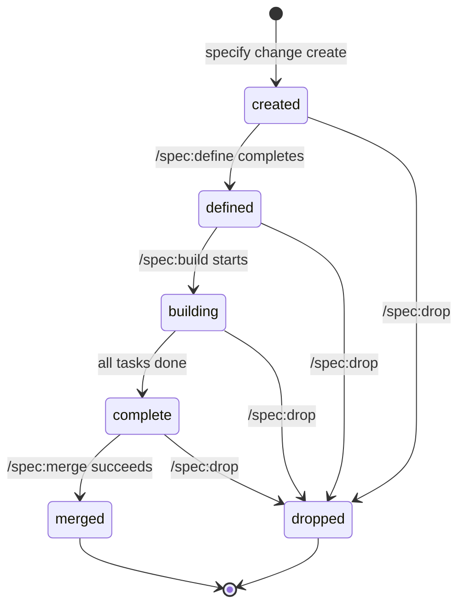
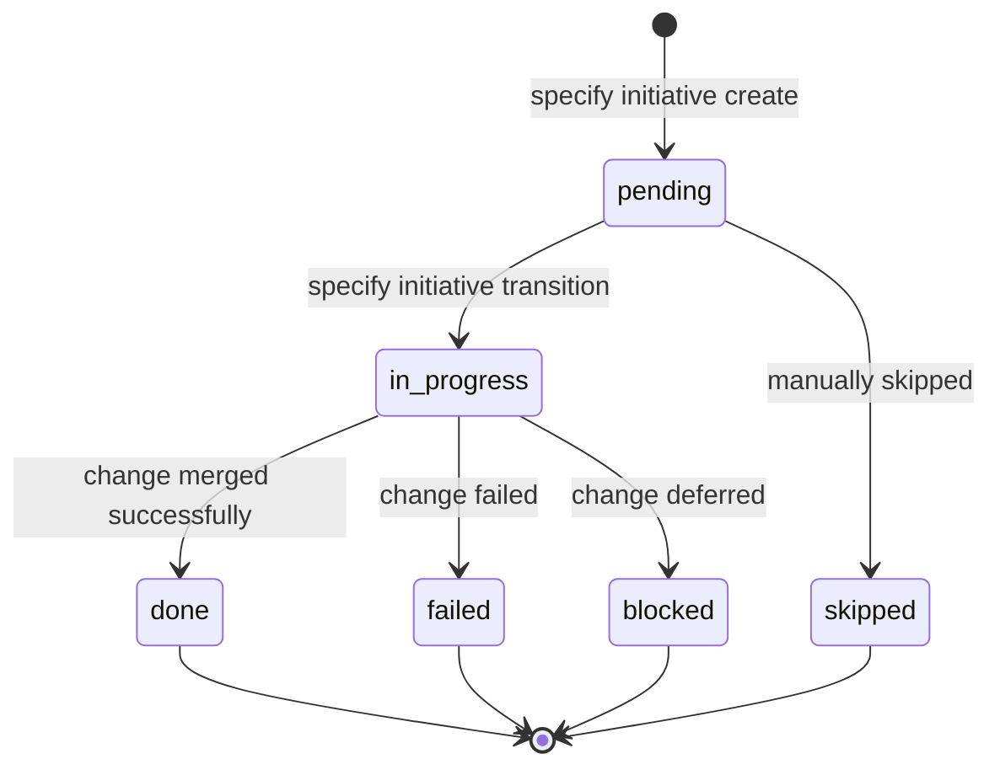

# Lifecycle

Every Specify change moves through a sequence of lifecycle states. Transitions are enforced by the `specify` CLI -- skills never write state directly.

## State diagram



## States

| State | Meaning | Next states |
|-------|---------|-------------|
| `created` | Change directory exists, artifacts not yet generated | `defined`, `dropped` |
| `defined` | All artifacts generated, ready for implementation | `building`, `dropped` |
| `building` | Implementation in progress, tasks being completed | `complete`, `dropped` |
| `complete` | All tasks done, ready for merge | `merged`, `dropped` |
| `merged` | Specs merged into baseline, change archived | (terminal) |
| `dropped` | Change discarded, archived without merging | (terminal) |

## Transitions

Transitions are performed by `specify change transition <name> <target>`. The CLI enforces which transitions are legal from each state and records timestamps in `.metadata.yaml`.

The phase skills trigger transitions at well-defined points:

| Trigger | Transition | Performed by |
|---------|------------|-------------|
| `/spec:define` starts | `created` (initial) | `specify change create` |
| `/spec:define` completes all artifacts | `created --> defined` | `specify change transition` |
| `/spec:build` starts implementation | `defined --> building` | `specify change transition` |
| All tasks marked complete | `building --> complete` | `specify change transition` |
| `/spec:merge` succeeds | `complete --> merged` | `specify merge` |
| `/spec:drop` invoked | `* --> dropped` | `specify change drop` |

## `.metadata.yaml`

Each change directory contains a `.metadata.yaml` file managed exclusively by the CLI. It records:

- **`status`** -- the current lifecycle state.
- **`created_at`** / **`updated_at`** -- ISO 8601 timestamps.
- **`outcome`** -- phase outcome (`success`, `failure`, `deferred`) written by `specify change phase-outcome`. Used by `/spec:execute` to determine whether to transition a plan entry to `done`, `failed`, or `blocked`.
- **`schema`** -- the schema URL used for this change.
- **`touched_specs`** -- the list of spec files this change affects.

Never hand-edit `.metadata.yaml`. All writes flow through the CLI.

## Plan entry states

When a change is part of an initiative plan, the plan entry has its own status tracked in `plan.yaml`:



| State | Meaning |
|-------|---------|
| `pending` | Not yet started; waiting for dependencies |
| `in-progress` | Currently being executed (at most one at a time) |
| `done` | Change merged successfully |
| `failed` | Change failed during define, build, or merge |
| `blocked` | Change deferred -- dependency issue or external blocker |
| `skipped` | Manually skipped by operator |

Plan entry transitions are performed by `specify initiative transition <name> <target>`.

## Archiving

Both terminal states (`merged` and `dropped`) result in the change directory being moved to the archive:

```
.specify/archive/YYYY-MM-DD-<change-name>/
```

The full change directory is preserved, including all artifacts and `.metadata.yaml`. This provides an audit trail of every change the project has been through.

For plans, `specify initiative archive` moves a completed `plan.yaml` and its working directory to `.specify/archive/plans/<YYYYMMDD>-<name>/`.
