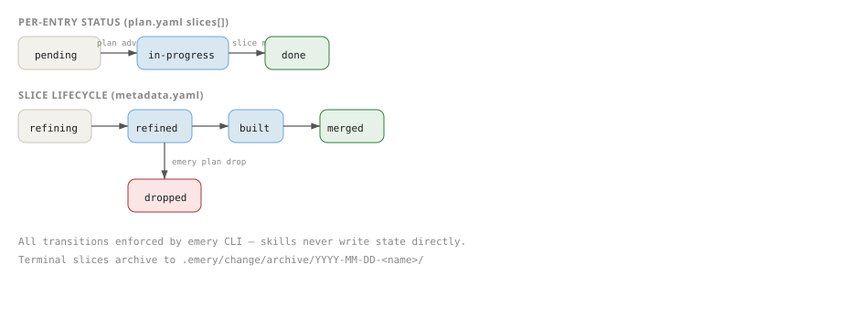

# Lifecycle

Emery projects two stacked ladders from artifacts and facts. The per-entry ladder drives the loop; the slice ladder names each per-slice phase. All transitions are enforced by the `emery` CLI — skills never write state directly. Neither ladder is a stored status field on `plan.yaml` or `metadata.yaml` (RFC-86 D2).

<div class="pipeline">



<p class="pipeline-caption">Per-entry pending→in-progress→done; slice refining→refined→built→merged (or dropped).</p>
</div>

Emery's layered design is explained in [The Layered Stack](../explanation/layered-stack.md).

## Plan review and authorization

The plan itself carries no stored lifecycle and no projected `approved` rung. The pause between `/emery:plan` and `emery plan execute` is the human topology-review seam. Starting execute opens the `plan.execute.started` authorization epoch (typed `closed-plan` coverage) and drives privileged work under gap gates — there is no separate `plan approve` verb. "Currently executing", Ready / Authorized, and "drained" are computed from artifacts and the per-writer fact union.

## Per-entry ladder

Each row under `plan.yaml.slices[]` projects a ladder label:

- `pending` — default before claim facts.
- `in-progress` — projected from `plan.entry.advanced` / a live `slice.claimed` (written by the execute loop's claim step). Different slices may be in flight at once; a second journal writer claiming the same slice fails with `slice-claim-conflict`.
- `done` — projected from `slice.archive.created` / wave-commit facts (written by the execute loop's merge phase).
- Build failures and merge conflicts leave the active entry projecting `in-progress` — there is no per-entry `failed`, `blocked`, or `skipped` state in v1.

A plan is **drained** when no in-scope entry projects `pending` or `in-progress`; `/emery:finalize` becomes legal at that point.

## Slice ladder

Each slice's phase timestamps and artifacts project an independent lifecycle:

| State      | Meaning                                                                 | Next states                  |
| ---------- | ----------------------------------------------------------------------- | ---------------------------- |
| `refining` | Slice directory created; the refine phase in-flight (extract + synthesize) | `refined`, `dropped`         |
| `refined`  | Canonical artifacts present and validated; `base.yaml` pins recorded    | `built`, `dropped`           |
| `built`    | Fact-substrate build record + wave facts; ready for merge               | `merged`, `dropped`          |
| `merged`   | Wave committed; specs applied to baseline; slice archived               | (terminal)                   |
| `dropped`  | Slice discarded; archived without merging                               | (terminal)                   |

`refining` is the transient state used while the refine phase runs. If extract fails for any bound source, the slice stays projecting `refining` until the operator amends the plan (e.g. via `emery plan amend <entry> --remove-source <key>`) or fixes the source binding, then re-runs `emery plan execute`. Synthesis tags (`[unknown]`, `[conflict]`, `[divergence]`) never park the slice — refine still projects `refined`. Open gaps block **build** under execute's `strict` gap policy; a deferred gap (`emery plan defer`, or gate-time minting under an effective `defer` policy) leaves build scope and is carried as debt instead.

## Transitions

Every transition happens inside `emery plan execute` except the drop:

| Trigger                                          | Transition                       | Performed by                                     |
| ------------------------------------------------ | -------------------------------- | ------------------------------------------------ |
| The execute loop claims the next eligible row     | per-entry: `pending → in-progress` | the loop's claim step (claim facts)              |
| The refine phase creates the slice                 | slice: (none) → `refining`         | the refine orchestration                         |
| The refine phase completes synthesis               | slice: `refining → refined`        | the refine orchestration                         |
| The build phase completes                          | slice: `refined → built`           | the build orchestration                          |
| The merge phase succeeds                           | slice: `built → merged`; per-entry: `in-progress → done` | the merge orchestration (wave-commit + archive facts) |
| `emery plan drop` invoked                          | slice: `* → dropped`               | `emery plan drop <name> --reason "..."`        |

## `metadata.yaml`

Each slice directory contains a `metadata.yaml` file managed exclusively by the CLI. It records:

- **Phase timestamps** — `created_at` / `defined_at` / `completed_at` / `merged_at` / `dropped_at` (ISO 8601); lifecycle labels project from these plus artifacts.
- **`target`** — the target adapter identifier used for this slice.
- **`touched_specs`** — the list of spec files this slice affects.
- **`outcome`** — optional audit stamp written at merge; progress is projected from journal facts and artifacts, never from this field.

Never hand-edit `metadata.yaml`. All writes flow through the CLI.

## Archiving

Both terminal slice states (`merged` and `dropped`) result in the slice directory being moved to the archive:

```text
.emery/archive/YYYY-MM-DD-<slice-name>/
```

The full slice directory is preserved, including all artifacts and `metadata.yaml`. This is a **prunable convenience cache**, not the system of record: at merge time the CLI also appends a `slice.archive.created` entry to the per-writer **outcome ledger** (`.emery/events/<writer>.jsonl`) capturing the slice name, touched baseline specs, a one-line outcome summary, and the git SHA. The durable history is git of the committed `.emery/specs/` baseline plus that ledger, so archived folders can be reclaimed with `emery archive prune --keep <n>` / `--older-than <days>` without losing the audit trail.

For plans, `emery plan archive` moves a drained `plan.yaml` and its associated `change.md` / `discovery.md` to `.emery/archive/plans/<YYYYMMDD>-<name>/`.
