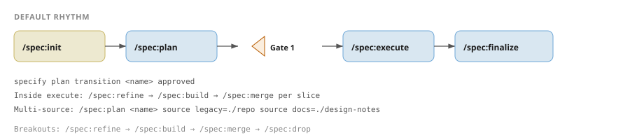

# Quick Reference

## The default rhythm

{{#template ../templates/pipeline-open.md}}



{{#template ../templates/pipeline-close.md caption=init → plan → Gate 1 → execute → finalize; breakouts available when execute parks.}}

The same rhythm runs at N=1 and N=12. For multi-source slices, bind additional sources at plan time:

```text
/spec:plan <name> source legacy=./vendor/monolith source docs=./design-notes
```

## All skills

| Skill                    | Purpose                                                                                        |
| ------------------------ | ---------------------------------------------------------------------------------------------- |
| `/spec:init`             | One-time project setup; run `specify init --workspace` for a registry-only workspace            |
| `/spec:plan`             | Enumerate sources, propose `slices[]`, exit at Gate 1                                          |
| `/spec:execute`          | Drive the per-slice refine → build → merge loop                                                |
| `/spec:finalize`         | Push branches, observe PR state, archive once every PR is `MERGED`                             |
| `/spec:refine`           | Breakout: extract per source, synthesize artifacts, transition slice to `refined`              |
| `/spec:build`            | Breakout: validate artifacts, implement tasks                                                  |
| `/spec:merge`            | Breakout: apply deltas to baseline, archive slice, stamp per-entry `done`                      |
| `/spec:drop`             | Discard a slice without merging                                                                |

## Artifacts

| Artifact            | Question                            | Location                                                          |
| ------------------- | ----------------------------------- | ----------------------------------------------------------------- |
| `change.md`         | Why is the change happening?        | `.specify/change.md` (workspace mode: at workspace root)          |
| `plan.yaml`         | Which slices, in what order?        | `.specify/plan.yaml`                                              |
| `discovery.md`      | What candidates did sources surface? | `.specify/discovery.md`                                           |
| `proposal.md`       | Why does this slice exist?          | `.specify/slices/<name>/proposal.md`                              |
| `spec.md`           | What must the system do?            | `.specify/slices/<name>/specs/<unit>/spec.md`                     |
| `design.md`         | How will it be implemented?         | `.specify/slices/<name>/design.md`                                |
| `tasks.md`          | In what sequence?                   | `.specify/slices/<name>/tasks.md`                                 |
| `evidence/<key>.yaml` | What did this source say?         | `.specify/slices/<name>/evidence/<source-key>.yaml`               |

## Lifecycle states

Plan lifecycle (two stored states):

```text
pending --(operator stamps Gate 1)--> reviewed
```

Per-entry status:

```text
pending --(plan next)--> in-progress --(slice merge)--> done
```

Slice lifecycle:

```text
refining --> refined --> built --> merged
                            \
                             `--> dropped (via slice transition --reason "...")
```

## Key CLI commands

```bash
# Project setup
specify init <target>                                    # single-project scaffold (positional target adapter)
specify init --workspace                                 # registry-only workspace
specify source resolve <name>                            # validate a source adapter manifest
specify target resolve <value>                           # validate a target adapter (name, path, or URL)

# Plan management
specify plan create <name> --source <key>=<adapter>:<path>     # or <adapter>:value:<literal>
specify plan add <name> --sources <key>=<candidate-id> --target <name> --project <name>
specify plan amend <name> --add-source <key>=<candidate-id> --remove-source <key> --divergence accepted
specify plan transition <name> reviewed                  # Gate 1; operator-only
specify plan next                                        # active in-progress, or pick next pending
specify plan finalize <name> --clean

# Slice management
specify slice create <name> --target <target>
specify slice transition <name> <refining|refined|built|dropped> [--reason "..."]
specify slice validate <name>
specify slice merge <name> [--dry-run|--check-only]

# Workspace (multi-repo)
specify workspace sync [<project>...]                    # materialise slots from registry.yaml
specify workspace prepare <project> --change <name>
specify workspace push [<project>...]                    # publish specify/<name> branch as PR

# Tools
specify tool run <name> [args...]                        # run a declared WASI tool
```

## Adapters

Target adapters live under `adapters/targets/<name>/`:

| Adapter   | URL                                                       | Target                |
| --------- | --------------------------------------------------------- | --------------------- |
| Omnia     | `https://github.com/augentic/specify/adapters/targets/omnia`       | Rust WASM             |
| Vectis    | `https://github.com/augentic/specify/adapters/targets/vectis`      | Crux cross-platform   |
| Contracts | `https://github.com/augentic/specify/adapters/targets/contracts`   | API contracts         |

First-party source adapters live under `adapters/sources/<name>/`: `intent`, `documentation`, `code-typescript`, `screenshots`.

## Directory structure

```text
<project-root>/
├── AGENTS.md             # generated agent guidance with operator-editable prose outside fences
├── registry.yaml         # workspace catalogue (workspace mode only)
├── contracts/            # baseline API contracts (schemas/, http/, messages/)
└── .specify/
    ├── project.yaml      # project config (target, sources, workspace, specify-version)
    ├── change.md         # operator brief (per active change)
    ├── plan.yaml         # change plan
    ├── discovery.md      # plan-time candidate inventory
    ├── plan.lock         # advisory file lock for /spec:execute and breakouts
    ├── .cache/           # cached adapter manifests + briefs ({sources,targets}/)
    ├── slices/           # active slices (proposal/spec/design/tasks + evidence/)
    ├── specs/            # merged baseline
    ├── workspace/        # workspace slots (workspace mode only)
    └── archive/          # finalized plans and merged or dropped slices
```

## Install

```bash
brew install augentic/tap/specify
```
