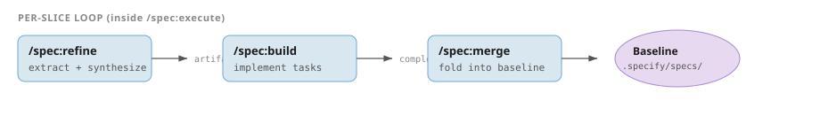

<div class="hero">
<div class="eyebrow">Tutorial</div>
<h1 class="hero-title">Quick start</h1>

Run a complete Emery change in one sitting: one slice, intent-only source, Omnia target. When you finish, merged specs live in your baseline and the plan is archived.

<div class="meta-row">

<span class="meta-chip"><strong>Time</strong> ~30 min</span>

<span class="meta-chip"><strong>Target</strong> Omnia</span>

<span class="meta-chip"><strong>Outcome</strong> First merged slice</span>

</div>

</div>


<section id="outcome" markdown="1">

<h2><span class="num">1</span> What you will build</h2>

A minimal Omnia project where Emery plans, specifies, implements, and merges a single slice driven entirely by operator intent — fixing a typo in `user.rs`. A one-slice change uses the same steps as a twelve-slice migration; only the plan row count differs.
</section>


<div class="prereq">
<strong>Prerequisites.</strong>

Complete [Prerequisites](../orientation/prerequisites.md):

- Cursor with Augentic plugins installed
- `emery` CLI (`emery --version` succeeds)
- Rust toolchain with `wasm32-wasip2` target for Omnia

Open your project in Cursor Agent chat. This tutorial assumes a fresh or disposable repo.
</div>


<section id="steps" markdown="1">

<h2><span class="num">2</span> Steps</h2>


<div class="tutorial-step" data-step="01">
<div class="step-label">01</div>
<h3 class="step-title">Initialise the project</h3>

Run once per project:

```text
/emery:init omnia
```

The skill runs `emery init omnia`, which scaffolds:

```text
.emery/
├── project.yaml
├── change/         ← in-place change home (plan.yaml, slices/, …)
├── specs/          ← baseline accumulates here after merge
└── archive/
AGENTS.md           ← generated when absent
```

See [Directory layout](../reference/directory-layout.md) for the full tree.
</div>


<div class="tutorial-step" data-step="02">
<div class="step-label">02</div>
<h3 class="step-title">Plan the change</h3>

Author from a reviewed definition home. Intent arrives through that handoff (reserved key `intent`); there is no `--intent` or `--source` flag. Until RFC-104's write surface lands, a colocated degenerate lives at `.emery/system/`:

```text
/emery:plan fix-typo --from .emery/system/ --wave deliver
```

`/emery:plan` writes three plan-time artifacts:

**`change.md`** — operator narrative:

```markdown
# Change — fix-typo

## Intent

fix typo in user.rs

## Scope

- One single-source slice driven by the operator's intent.
```

**`plan.yaml`** — slice table of contents:

```yaml
name: fix-typo
targets:
  default:
    adapter: emery:omnia@0.12.0
    locator: "."
    cid: sha256:…
sources:
  intent:
    adapter: emery:intent@0.12.0
    value: "fix typo in user.rs"
slices:
  - name: fix-typo
    target: default
    sources: [intent]
```

**`leads.md`** — what sources surveyed:

```markdown
## Lead inventory

### intent:fix-typo

- lead: fix-typo
- source: intent
- synopsis: fix typo in user.rs
```

The skill exits after authoring and prints:

```text
Plan `fix-typo` is authored. Review it, then run `emery plan refine` to generate every slice's specification bundle; `emery plan execute` builds the refined slices afterwards.
```

#### Topology review step

Before refinement runs, inspect `change.md` and `plan.yaml`. This pause is the first **operator review step**: `/emery:plan` never runs refinement or execution itself.

Learn more: [Amend a plan before executing](../how-to/amend-a-plan.md).
</div>


<div class="tutorial-step" data-step="03">
<div class="step-label">03</div>
<h3 class="step-title">Refine the slice</h3>

Drain refinement for the plan:

```text
emery plan refine
```

(`/emery:refine` runs this same drain.)

Refinement extracts evidence from each bound source, synthesizes the slice artifacts, and records the exact inputs and outputs in `refinement.yaml`. Under `.emery/change/slices/fix-typo/` you will find:

| File | Purpose |
| ---- | ------- |
| `proposal.md` | Why the slice exists |
| `specs/<domain>/spec.md` | Behavioral requirements (`ID:`, `Sources:`, `Status:`) |
| `design.md` | Technical approach |
| `tasks.md` | Implementation sequence |
| `evidence/intent.yaml` | What the intent source contributed |
| `refinement.yaml` | The refinement manifest — exact inputs and output bundle, digested |

Requirement blocks carry provenance, for example:

```markdown
### Requirement: User display typo corrected

ID: REQ-001
Sources: [intent]
Status: agreed
```

Exact wording varies with your intent; see refine fixtures for shape reference.

#### Specification review step

Refinement exits and prints the execute hint. This pause is the second **operator review step**: read the specs and design before authorizing the build. If you amend the plan or its sources here, re-run `emery plan refine` — the drain re-refines exactly the staled slices.
</div>


<div class="tutorial-step" data-step="04">
<div class="step-label">04</div>
<h3 class="step-title">Execute the slice</h3>

Drive the per-slice loop:

```text
emery plan execute
```

(`/emery:execute` runs this same loop.)

Invoking execute opens the authorization epoch (`plan.execute.started`) over the plan and refinement digests, then each slice runs **build → merge** — execute never refines; a missing or stale manifest stops it with `plan-refinement-required` before anything privileged runs:

<div class="pipeline">




<p class="pipeline-caption">refine synthesizes artifacts; build implements tasks; merge folds specs into the baseline.</p>
</div>


##### After build

Source code changes land in your project tree (not under `.emery/`). Task checkboxes in `tasks.md` flip to complete via the CLI.

##### After merge

- Spec deltas apply to `.emery/specs/`
- The slice directory moves to `.emery/change/archive/`
- Facts project the entry `done` (no stored status field on `plan.yaml`)

##### Watching progress

Check on the run at any time from a second terminal with `emery plan status` (read-only). Mid-run it names the current phase and the exact command that makes progress:

```text
plan: fix-typo
entries: 0 done / 1 in-progress / 0 pending
ready: false  authorized: true
next-action: build fix-typo
resume: emery plan execute
```

When the slice has merged, status projects the literal drained line:

```text
plan: fix-typo
entries: 1 done / 0 in-progress / 0 pending
ready: true  authorized: true
drained — run /emery:finalize fix-typo
```

If execute stops instead — say the build fails — the stop message names the reason and the resume command (`next-action: stop build-failed`, `resume: emery plan execute`). Fix the cause, then re-run execute; the loop resumes at the parked phase. See [Drop down a layer](../how-to/drop-down-a-layer.md).
</div>


<div class="tutorial-step" data-step="05">
<div class="step-label">05</div>
<h3 class="step-title">Finalize the change</h3>

When every plan entry is `done`, close the change:

```text
/emery:finalize fix-typo
```

Before finalizing, publish the completed repository changes through your normal Git and review workflow. Finalize confirms publication is complete and archives the drained plan; it performs no Git or forge operations.
</div>


</section>


> [!TIP]
> **Done.** You completed the full rhythm: `/emery:init` scaffolds once; `/emery:plan` exits for topology review; `emery plan refine` writes the specifications and exits for review; `emery plan execute` is your authorization and loops build → merge; `/emery:finalize` closes the change.

<div class="see-also">
<strong>See also</strong>

- [Core concepts](../explanation/concepts.md) — vocabulary tour
- [Your first multi-slice change](first-change.md) — three slices from documentation
- [Quick reference card](../reference/quick-reference.md) — command cheat sheet
- [Skills](../reference/skills/index.md) — `/emery:plan`, `/emery:refine`, `/emery:execute`, `/emery:finalize` reference
</div>

