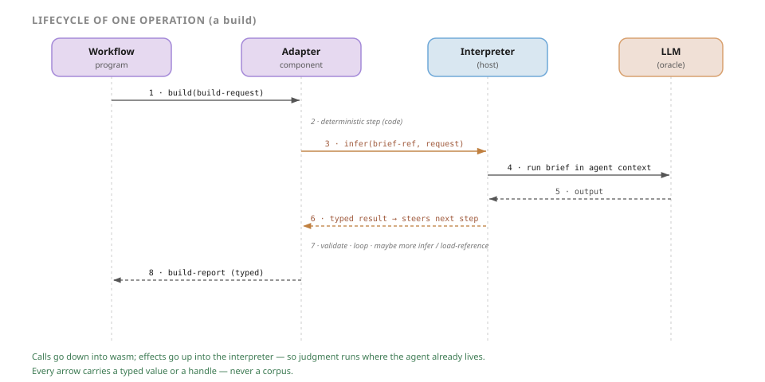
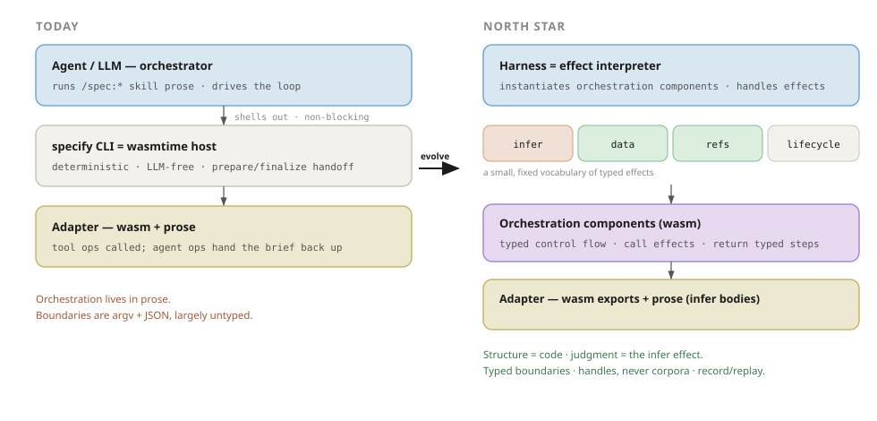

# The Effect-Oriented Harness (Architecture North Star)

> Status: Standing architecture (north star) — durable direction, not a change RFC; it does not land or get deleted · Implemented by: RFC-52 (effect interfaces), RFC-53 (orchestration components), RFC-54 (workflow as effects) · Foundation: RFC-51 (typed adapter contract), Stages 0–1 · Preserves: RFC-47 (identity), RFC-48 (packaging), RFC-50 (adapter-agnostic core) · Sibling to [roadmap.md](roadmap.md)

## The one idea

Specify is converging on a single architecture. This document names it, so future work aims at one shape instead of rediscovering it a decision at a time:

> **Specify is a typed effect system. The workflow is a program. Adapters are programs. The LLM is an effect. The harness is the interpreter that runs the programs and satisfies their effects.**

Everything below — the shape of the system, the four laws, the way a single operation flows, the deployment modes that fall out for free — is a consequence of taking that one sentence seriously. RFC-51's typed records, "wasm as the adapter surface," the tool-vs-agent split, and lazy reference discovery are not four features; they are four facets of this one model.

This is **not a new direction.** It is the completion of a split already present in the codebase: the deterministic skeleton (plan lifecycle, lock enforcement, `specify plan next` refusing illegal transitions, validation, merge) already lives in the CLI; the judgment (survey, extract, synthesis, review) already lives in briefs run by an LLM; the skills are glue between them. The architecture names that endpoint and makes the seam between the two **typed**.

## Why this is a standing document, not an RFC

Specify has accumulated point decisions — RFC-47 identity, RFC-48 packaging, RFC-50 adapter-agnostic core, RFC-51 typed contract — that each independently push toward the same structure without ever stating it. Leaving the destination implicit means every new decision is re-litigated from first principles, and the answers drift. This document fixes the north star and hands down a **decision rule** (below) that resolves the recurring questions — "prose or code?", "callable export or handoff?", "what does this function take?" — the same way every time.

It is deliberately **not** a numbered RFC. In this repo an RFC is a discrete, landable change proposal that is deleted once merged (RFC-47–50 already have been). This is the opposite: a durable framing document that must persist and that *sequences* the change RFCs rather than being one. It therefore lives alongside [roadmap.md](roadmap.md) as a standing strategic doc, and the change RFCs (RFC-52/53/54) cite it by name.

## The shape of the system

Three layers, one contract.

- **Programs sit on top.** There are two kinds, and they are the *same shape* — each (at the north star) a **Wasm component** (Component Model): the **workflow** (`/spec:plan`, `/spec:execute`, the slice loop) and the **adapters** (`survey` / `extract` / `shape` / `build` / `merge`). A program expresses deterministic control flow and, whenever it needs something it cannot compute — a judgment, a datum, a piece of prose — it requests a **typed effect** rather than doing the impure thing itself.
- **The host — the `specify` CLI, a Rust binary embedding Wasmtime — is the interpreter underneath.** It instantiates the programs and satisfies a small, fixed vocabulary of effects: `infer` (run a brief on the LLM), the host-data accessors, `load-reference`, and the lifecycle hooks. It knows *effects*, not adapters and not brains.
- **One typed contract is the boundary** between them. Every datum and every effect crosses it typed; nothing crosses untyped, and nothing crosses as a corpus — only handles.

The two program kinds differ only in *where they draw the line* between structure and judgment — adapters lean toward structure, the workflow toward judgment (developed below). They speak the same effects to the same interpreter, which is what lets one architecture serve both.

## The mental model: programs, effects, interpreters

The model borrows its discipline from **algebraic effects**: a program is mostly pure control flow; the messy, non-deterministic world is reached only through named, typed *effects*; and a separate *interpreter* (a "handler") decides how each effect is actually carried out. Swap an effect's handler and the same program runs interactively, headless, or against a recording — without the program changing. The vocabulary:

- **Effect** — a typed request a program makes for something it cannot compute itself (run a brief, read an artifact, fetch a reference, record a lifecycle event). The effect names *what* is needed; it does not say *how* to get it.
- **Interpreter** — the **host** (this document's *harness*): one runtime under three lenses — the wasm **host** that satisfies a guest's imports, the algebraic-effects **interpreter** that handles effects, the **harness** of the title. It owns the *how* of every effect and is the only place impurity lives; programs are deterministic between effects. It *performs* the data, reference, and lifecycle effects itself, and *dispatches* `infer` to a pluggable backend — so the host stays brain-agnostic.
- **`infer`** — the marquee effect. Prose is its *body*, the brief's typed request and report are its *signature*, and the LLM is its *backend* — the thing the host dispatches to. "Run this brief and give me back a typed answer" is a function call whose implementation happens to be a language model.
- **Oracle** — the LLM seen from the program's side: an opaque source of typed answers. The program trusts the *shape* of what comes back (validated at the boundary), never the runtime that produced it. The same thing seen from the host's side is the pluggable **`infer` backend** (informally, the *brain*); **agent** names only its *interactive* form — alongside the headless API and the CI replay stub, neither of which is an agent.
- **Handle** — a reference (`brief-ref`, artifact path, reference id) that *names* data without carrying it. Handles are how laziness becomes structural rather than aspirational.

Each model term names a durable abstraction; here is the concrete technology (shorthand) behind each, so the names and the stack read side by side:

| Model term | Technology (shorthand) |
| --- | --- |
| Program | a **Wasm component** (Component Model); adapters compiled to `wasm32-wasip2` |
| Host · interpreter · harness | the **`specify` CLI** — a **Rust** binary embedding **Wasmtime** (Component Model · Cranelift JIT · WASI Preview 2) |
| Effect | a **WIT** interface import |
| Typed contract · boundary | **WIT** — records for data, interfaces for effects (package `specify:adapter`) |
| Handle | a **WIT** handle / id — `brief-ref`, artifact path, reference id |
| `infer` backend | the **LLM** — a Cursor agent session or a headless API — or a **CI replay stub** |
| Oracle | the **LLM**, seen by the program as an opaque source of typed answers |
| `read-artifact` · `load-reference` | **WASI** host-data + preopens (RFC-51 `host-data`) |
| `journal` · `transition` | the **`specify` CLI** lifecycle owner |

What runs **today**: the wasm *exports* and deterministic `tool` ops go through Wasmtime; `infer`, the host-data accessors, and `load-reference` become typed **WIT imports** only at S2–S3 (until then `infer` is the agent prepare/finalize handoff). The model terms stay constant across that transition — only the technology behind a few of them changes.

The deep move is **directional**. Today a child process (the CLI) cannot reach up into its parent agent's context, so agent work is handed *back up* out of band via prepare/finalize. In the effect model the program calls *down* into wasm and the wasm calls *up* into the interpreter through an import — so the LLM step runs in the interpreter's context, where the agent already lives. The handoff stops being a workaround and becomes a typed function call.

## Lifecycle of one operation

Concretely, a `build` flows like this:

1. The **workflow** calls *down* into the adapter: `build(build-request)` — a typed value, not argv.
2. The adapter runs a **deterministic step** in its own code (assemble inputs, decide what comes next).
3. When it needs judgment, the adapter calls *up* into the interpreter: `infer(brief-ref, request)`. It passes a *handle* to the brief, not the brief's text.
4. The interpreter runs that brief on the LLM **in the agent's context**.
5. The LLM returns its output to the interpreter.
6. The interpreter hands the adapter a **typed result**, validated against the operation's report type — a value that *steers* the adapter's next deterministic step.
7. The adapter loops: validate, sequence, perhaps another `infer` or a lazy `load-reference`.
8. The adapter returns a typed `build-report` *up* to the workflow.

The shape to notice: control flows *down* into wasm; effects flow *up* into the interpreter; judgment runs where the agent already lives; and every arrow carries a typed value or a handle — never a corpus. The same skeleton describes `extract`, `merge`, and (optionally, one day) the workflow phases themselves.

## The four laws

These hold at **every** layer and **every** stage. A proposed change that violates one is wrong — this is the test that was missing.

1. **One typed contract is the currency of every boundary.** WIT records for data (RFC-51 stratum 1); WIT interfaces for effects. Nothing crosses a boundary untyped. This is the foundation, already in flight under RFC-51.
2. **The host knows effects, not adapters and not brains.** The host stays adapter-agnostic (RFC-50) and gains a fixed, small effect vocabulary. The "brain" becomes a *pluggable `infer` implementation*, not an assumption baked into prose — which *strengthens* RFC-50's agnosticism rather than weakening it.
3. **Determinism by default; judgment by exception — and judgment returns typed decisions that steer the deterministic skeleton.** The state machine (loops, gates, sequencing) is code. When a branch needs judgment, the code calls `infer` and gets back a *typed* value (`retry | abort | escalate`, a `build-report`, a reconciliation) that drives the next deterministic step. Control flow is never encoded in prose; the LLM never guesses at control flow.
4. **Laziness is law: handles cross boundaries, never corpora.** Every effect carries references; the executor pulls bodies on demand. This is RFC-51 §D/§G discipline promoted to a universal rule — it is what keeps the agent's context budget intact.

## What falls out for free

The harness becomes a thin **effect interpreter**: it instantiates orchestration components and satisfies a small, fixed set of imports.

| Effect (WIT import) | What it does | Who satisfies it |
| --- | --- | --- |
| `infer(brief-ref, request) -> output` | Run prose with the LLM, in context | Pluggable: Cursor session / headless API / **CI replay stub** |
| `read-artifact` / `get-asset` | Narrow, pull-based host/project data | Host (RFC-51 `host-data`) |
| `load-reference(id)` | Lazy adapter-bundle prose, on demand | Host, reading the adapter bundle |
| `journal` / `transition` | Lifecycle events + legal transitions | The CLI's existing lifecycle owner |

Because the brain is just the `infer` handler, **three deployment modes fall out of one architecture for free**:

- **Interactive** — Cursor satisfies `infer` with the live session.
- **Headless** — a CLI/API `infer` backend, no editor in the loop.
- **CI** — a record/replay `infer` stub, so an entire workflow run is deterministic and gradable.

Three properties come with them. **Agnosticism becomes a type, not a grep test** — "agent-runtime-agnostic" stops being a fragile property defended by lint and becomes the `infer` interface itself. **The system becomes replayable** — mock `infer` and the whole run is deterministic end-to-end, which is what turns evals from sampling into regression testing. **Context stays cheap** — laziness is structural, so depth of orchestration does not blow the budget. Skills thin to entry points; the orchestration that matters is typed.

## Where the structure / judgment line sits — per layer

The single most important guard against over-engineering: the deterministic-vs-judgment line sits in a **different place per layer**, and collapsing every layer into wasm is the main way this vision goes wrong.

- **Adapters lean toward orchestration components.** Their build / extract / merge flows are deep, repeatable, and benefit most from typed multi-step control flow + lazy refs + replay. This is where the `infer`-as-effect model earns its cost, and where it should be proven first.
- **The workflow leans toward an agent-driver over deterministic CLI guardrails.** The lifecycle skeleton is *already* deterministic in the CLI (lock, gates, `plan next`). Workflow-level recovery and operator intent are exactly where the LLM's adaptability is a feature, not a bug. The workflow therefore adopts the *effect interfaces* (typed `infer`, typed data, record/replay) but need not collapse into a monolithic orchestration component.

Both layers speak the same effects; they simply draw the structure / judgment line differently. Honouring that difference is the difference between a clean architecture and an over-built one.

## From today to the north star

The transformation is narrow because the bones are already in place. Today an agent runs `/spec:*` skill prose and drives the loop; it shells out to the LLM-free CLI host, which dispatches adapters and hands agent work back up through prepare/finalize; boundaries are argv + JSON, largely untyped. The north star keeps every one of those pieces and changes only two things: the boundaries become **typed**, and the agent handoff becomes a typed **`infer` effect** the program calls into. Nothing is rewritten; the seam is named and typed.

## The incremental path

The architecture lands in stages, each independently mergeable, independently valuable, and forward-compatible on the same typed contract. None requires the next.

- **S0–S1 · Typed contract** (RFC-51) — stratum-1 records kill the schema-drift surface; `tool` ops become callable through generated bindings. Near-pure wins on the contract already being built.
- **S2 · Name the effects** (RFC-52) — `infer` / data / refs / lifecycle become typed WIT imports, *initially backed by today's handoff + CLI*. The pivot: it makes the implicit boundary explicit and unlocks record/replay without changing behavior.
- **S3 · Orchestration components** (RFC-53) — adapters orchestrate their own multi-step operations and the `infer` effect calls the brief. This is where the vision first becomes visible, and the first stage that demands the async-ABI judgment call.
- **S4 · Workflow as effects** (RFC-54) — the workflow phases themselves run as effect-driven orchestration. A genuine bet that can be deferred for years.

There is a **coherent stopping point after S3**: adapters orchestrate over typed effects, the workflow stays agent-driven over deterministic guardrails, and nothing is half-built. The stage-by-stage detail lives in the change RFCs and [roadmap.md](roadmap.md); this document only fixes their direction.

## The bets

Commit with eyes open. The architecture rests on three calls that should be made deliberately, not by drift:

- **The async / effect ABI.** Streaming, concurrency, and cancellation for `infer` want the Component Model async path, whose ergonomics on the pinned wasmtime are unconfirmed. S0–S2 do not need it; S3+ increasingly do. *De-risk by confirming it before S3, not before S0.*
- **The LLM-required host.** The effect model means a host must satisfy `infer` to run a judgment step — "zero-LLM-config execution" is given up. The mitigation is that the replay stub *is* the zero-config path, and it is strictly better (deterministic). This trade is the price of the whole vision; accept it explicitly.
- **How far to push S4.** A real fork, decided with data from S3 — not now.

## The decision rule

Stop evaluating each change as an isolated point decision. Evaluate every future change against one sentence:

> **Push structure to code, judgment to the `infer` effect, and never let a corpus cross a boundary.**

When a design question arises — prose or code? a callable export or a handoff? what does this function take as an argument? — that rule answers it, and the four laws tell you whether you have drifted. This is what converts "iterative movement" into "deliberate convergence."

## Relationship to prior work

- **RFC-50 (adapter-agnostic core)** — preserved and strengthened: the host still holds zero adapter names/taxonomy, and now its LLM coupling is an explicit, swappable interface rather than an implicit assumption.
- **RFC-47 / RFC-48 (identity / packaging)** — unchanged: adapters remain composite extensions (wasm + prose) published to the registry; this architecture only changes what the wasm half *does* and how the prose half is *invoked*.
- **RFC-51 (typed contract)** — the foundation (Stages 0–1), kept and reframed, not disposed. Its `host-data` accessors (§D) are the seed of the first **data effect**, generalized by RFC-52; its brief-typing and lazy-discovery ideas (§F/§G) change owner once a brief is the *body of the `infer` effect*, and are re-evaluated under RFC-53. Lazy discovery (§G) is promoted to the fourth law.
