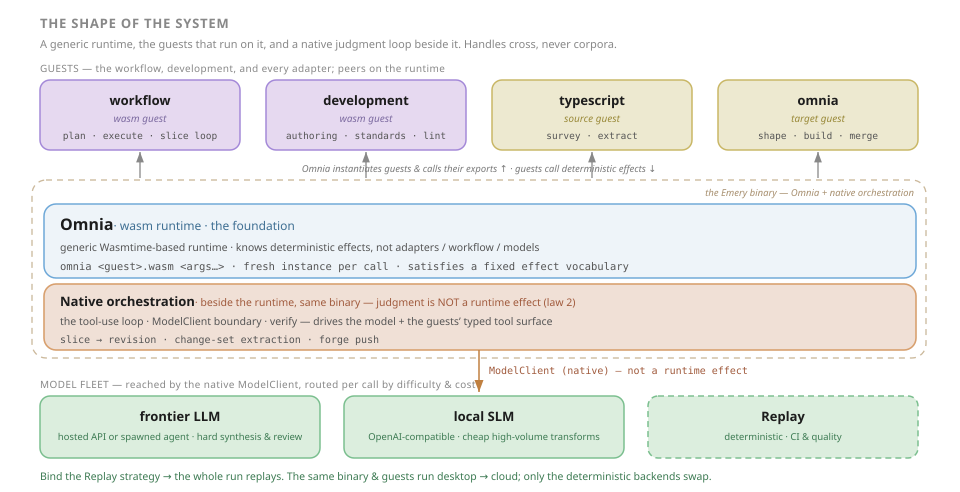
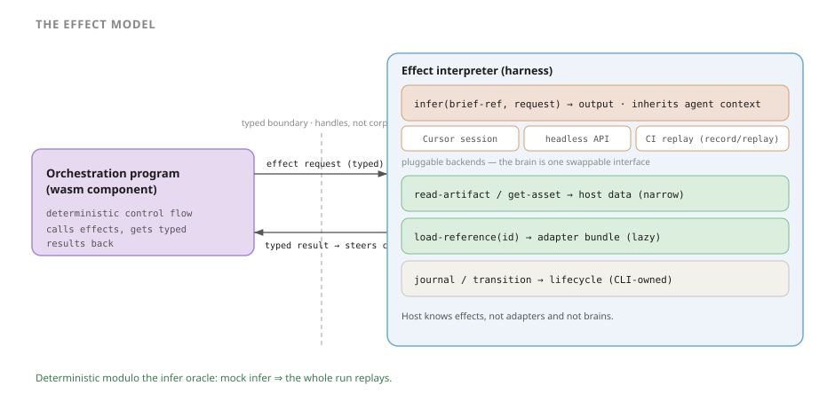
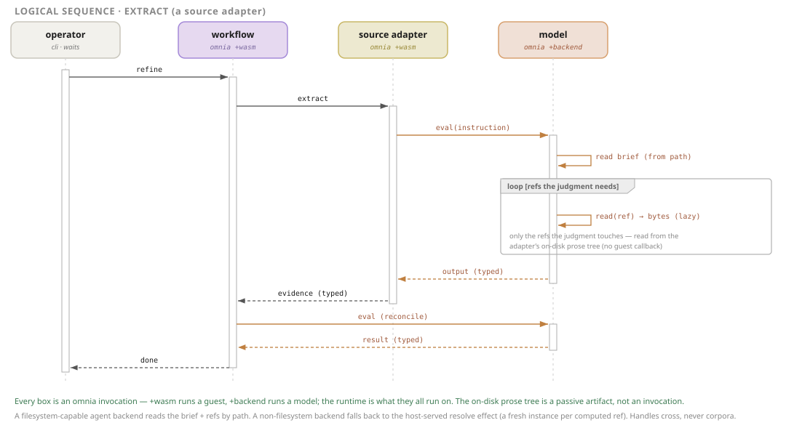
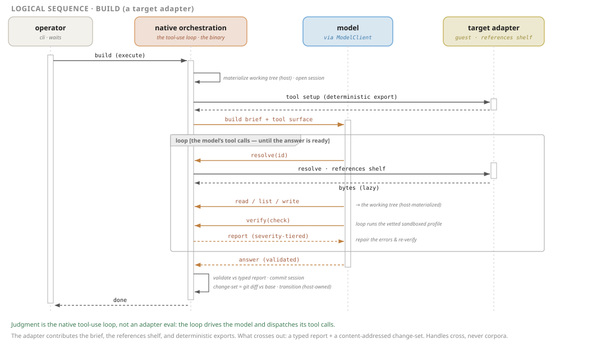
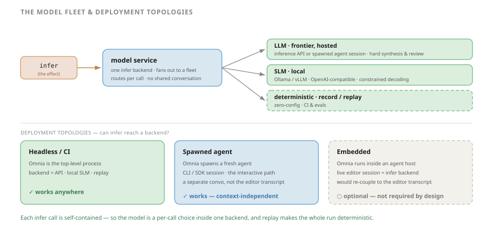
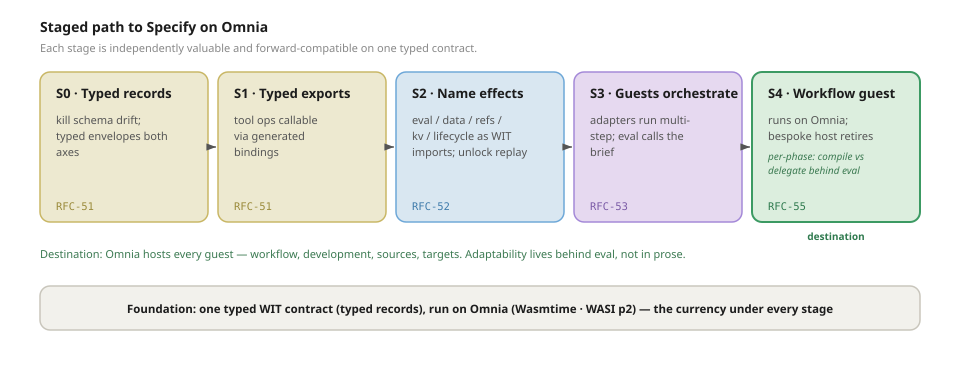

# Specify on Omnia — The Effect-Oriented Architecture

> Status: Standing architecture — the committed shape the work converges on. It sequences the work rather than landing as a single change, and persists alongside [roadmap.md](roadmap.md).

## The one idea

Specify has reconceived itself around a single sentence:

> **Specify is a family of wasm guests on a generic runtime. The workflow is a guest; every adapter is a guest. Judgment is an effect — `infer` — that the runtime satisfies from a pluggable fleet of models. [Omnia](https://github.com/augentic/omnia) is the runtime; "Specify" is the binary resulting from Omnia compiled with Specify-specific backends.**

Everything below — the shape of the system, the four laws, the way one operation flows, the deployment modes that fall out for free — is a consequence of taking that sentence seriously. The runtime owns no domain knowledge: it knows how to run wasm and how to satisfy a small, fixed vocabulary of effects. *All* Specify behaviour — orchestrating the workflow, surveying and extracting from sources, shaping and building and merging for targets, and the framework's own development tooling — lives in guests that run on it.

This completes a split already present in the codebase. The deterministic skeleton (plan lifecycle, lock enforcement, validation, merge) and the judgment (survey, extract, synthesis, review) were already separate concerns; the skeleton lived in a bespoke `specify` binary and the judgment in briefs run by a model, glued by skill prose. The reconceived architecture relocates *both* onto one generic runtime and makes the seam between structure and judgment **typed**.

A second sentence rides alongside the first, and it is the one the project learned the hard way: **context is artifact-borne, not conversational.** Every `infer` call is self-contained — it names a brief and a typed request over concrete artifacts (`spec.md`, evidence, a build request), never an accumulated transcript of prior turns. That is deliberate, not a limitation: bloated, overloaded context was the recurring failure, so the architecture refuses to depend on it. Two payoffs follow. The work becomes **scalable and auditable** — the same operation runs identically whether an operator triggers it from the editor or a CI job fires it at fleet scale. And it becomes **progressively cheaper**: once judgment is a typed call over concrete inputs, deterministic code can absorb the easy cases (survey already does) and small local models the narrow ones (a Qwen variant already generates Omnia-target code), shrinking the frontier-LLM share call by call without rewriting the workflow.

## Why name the architecture

Specify accumulated point decisions that each independently pushed toward this structure without ever stating it. Leaving the destination implicit means every new decision is re-litigated from first principles, and the answers drift. Naming the architecture ends that: it hands down a **decision rule** (below) that resolves the recurring questions — "prose or code?", "callable export or handoff?", "what does this function take?", "where does this run?" — the same way every time. This is a durable framing document; it persists and sequences the work rather than landing as a single change.

## The shape of the system

Two roles over one contract: a generic **runtime** and the **guests** that run on it.

- **Omnia is the runtime, and the foundation.** It ships as an executable invoked from the command line. Its only required argument is the guest to run — `omnia workflow.wasm plan …` — and every remaining argument is forwarded to the guest to interpret. The runtime instantiates the guest, satisfies a small, fixed vocabulary of effects, and otherwise knows nothing: not adapters, not the workflow, not brains. Everything stands on it.

- **Everything else is a guest.** The **workflow** (`plan`, `execute`, the slice loop) and **development** (the framework's own authoring and standards tooling) are first-party guests; the **adapters** are guests too — source guests (`typescript`, `documentation`, …) that `survey` and `extract`, and target guests (`omnia`, `vectis`, …) that `shape`, `build`, and `merge`. They are peers on the runtime, differing only in *where they draw the structure / judgment line* (developed below), not in kind.

- **The model fleet sits below.** When a guest needs judgment it requests the `infer` effect, and Omnia dispatches it *down* to a pluggable backend — a frontier LLM, a small local model (SLM), or a deterministic replay stub. The brain is a swappable implementation, never an assumption.

- **One typed contract is the boundary.** Every datum and every effect crosses it typed; nothing crosses untyped, and nothing crosses as a corpus — only handles.

Runtime and guest meet in both directions, as any wasm runtime and its guests do: Omnia instantiates a guest and **calls its exports** (`build`, `extract`) to invoke it; the guest **calls back into Omnia's host services** (`infer`, `load-reference`, `read-artifact`, `journal`) for everything impure. Neither "leads" — the runtime is the floor every guest stands on, and the guests are the code that runs on it.

> **A naming note.** "Omnia" names two things in this document: the **runtime** (the foundation), and the **`omnia` target guest** (the adapter that emits code *for* the Omnia runtime). Where ambiguity is possible the text says "Omnia (the runtime)" or "the `omnia` target guest" explicitly.

## The runtime: Omnia

Omnia is a Wasmtime-based wasm runtime whose entire design is **pluggable host services behind typed interfaces** — HTTP, key-value, SQL, messaging, observability, identity — swappable without changing guest code. Specify's effect vocabulary is just one more set of host services in that mould, with `infer` (the model service) as the marquee addition. Three runtime properties carry the architecture:

- **One binary, guest-selected behaviour.** There is no bespoke `specify` host anymore. The runtime is generic; `omnia <guest>.wasm <args…>` selects which guest interprets the invocation. The workflow guest interprets `plan` / `execute`; a source guest interprets `survey` / `extract`; a target guest interprets `build` / `merge`. The CLI surface *is* "pick a guest, forward the arguments."

- **Instance-per-call execution.** Every call to a guest instantiates a **fresh** guest instance — the standard wasm-serving model, because component instances are not re-entrant. This single fact removes a whole class of hazards: when a running judgment step needs to call back into a guest — the `load-reference` fallback that serves a *computed* reference (see *how the model reads a brief*) — it lands in a *new* instance, never re-entering the one already on the stack, so the loop closes on the synchronous ABI with no async machinery required.

- **Stateless guests, host-held state.** Because instances are per-call, guests hold no durable in-process state; what must persist lives in a host service — the KV store, with a filesystem backend for memoizing expensive-to-compute resources locally (and Redis / NATS backends when a fleet wants to share). Statelessness is not a constraint to work around; it is what makes instance-per-call correct and the runtime horizontally trivial.

The backends behind each host service are chosen per deployment — the same mechanism Omnia already uses to swap an in-memory KV for Redis selects the `infer` backend: the **model service** for real work, or a replay stub for CI. Omnia binds one backend per host, so the model service is itself that *single* backend — it fans out to the fleet internally (developed below), never requiring a second `infer` host.

## The mental model: programs, effects, interpreters

The model borrows its discipline from **algebraic effects**: a program is mostly pure control flow; the messy, non-deterministic world is reached only through named, typed *effects*; and a separate *interpreter* decides how each effect is actually carried out. Swap an effect's handler and the same program runs interactively, headless, or against a recording — without the program changing. The vocabulary:

- **Effect** — a typed request a guest makes for something it cannot compute itself (run a brief, read an artifact, fetch a reference, memoize a result, record a lifecycle event). The effect names *what* is needed; it does not say *how*.
- **Interpreter** — Omnia. It owns the *how* of every effect and is the only place impurity lives; guests are deterministic between effects. It *performs* the data, reference, memoization, and lifecycle effects through its host services, and *dispatches* `infer` to a pluggable backend — so the runtime stays brain-agnostic.
- **`infer`** — the marquee effect. Prose is its *body*, the brief's typed request and report are its *signature*, and a model is its *backend*. "Run this brief and give me back a typed answer" is a function call whose implementation happens to be a language model.
- **Oracle** — the model seen from the guest's side: an opaque source of typed answers. The guest trusts the *shape* of what comes back (validated at the boundary), never the runtime that produced it. The same thing seen from Omnia's side is the pluggable **`infer` backend** (informally, the *brain*).
- **Handle** — a reference (a brief **path**, artifact path, reference id) that *names* data without carrying it. Handles are how laziness becomes structural rather than aspirational.

Each model term names a durable abstraction; here is the concrete technology behind each, so the names and the stack read side by side:

| Model term | Technology (shorthand) |
| --- | --- |
| Program / guest | a **Wasm component** (`wasm32-wasip2`) — the workflow, development, and adapter guests |
| Runtime · interpreter | **Omnia** — a Wasmtime-based wasm runtime, shipped as a CLI binary (`omnia <guest>.wasm <args…>`) |
| Effect | a **WIT** interface import, satisfied by an Omnia **host service** |
| Typed contract · boundary | **WIT** — records for data, interfaces for effects |
| Handle | a **WIT** handle — a **brief path** (resolved on disk), an artifact path, a reference id |
| `infer` backend | the **model service** — a fleet: a hosted frontier **LLM**, a local **SLM**, or a **replay stub** |
| Oracle | the **model**, seen by the guest as an opaque source of typed answers |
| `load-reference(id)` | **fallback** for non-filesystem backends — Omnia resolves prose (a host file-read, or a fresh guest instance for *computed* refs), memoized in KV |
| `read-artifact` · data | Omnia **data host services** |
| `journal` · `transition` | the Omnia **lifecycle host service** |

## How the model reads a brief

`infer`'s first argument is a **handle**, not prose — and for the backends Specify leans on, that handle is a **brief path**. A frontier agent CLI (cursor-agent, Claude Code) or a local agent (qwen-code) runs with filesystem access, so Omnia hands it the absolute path to the brief inside the adapter's on-disk package; the agent reads the brief and follows its relative links — sub-briefs, supporting docs, examples — pulling only the bodies the judgment actually touches. The agent's own file reads *are* the lazy loading: no second hop, no callback into a guest. A reference tree of dozens of files contributes only the handful the judgment opens; the rest never enters context.

This is why an adapter stays a **wasm + prose hybrid**. The wasm half is the guest that orchestrates; the prose half is the brief-and-reference tree, materialised on disk and authored exactly as briefs already are — relative links, loaded on demand. The `brief-path` simplification asks nothing new of authors; it just lets a filesystem-capable model resolve those links itself instead of routing every one back through the runtime.

Two backends have no shared filesystem to read from — a raw inference API and an SLM completion endpoint — and for them Omnia resolves the brief and injects the references the model asks for. **`load-reference` is that fallback resolver**: the model-initiated (inbound) leg back into the runtime, the mirror of the guest-initiated `infer`. Instance-per-call keeps it safe — any *computed* reference is served by a *fresh* guest instance, never the operation instance suspended in `infer` — but it is a fallback, not the headline. Most references are static prose a host file-read satisfies; only computed references touch guest code at all; and the replay backend reads nothing, because its answers are recorded.

## Lifecycle of one operation

Concretely, a `build` flows like the sequence above. It is a **logical** view: Omnia is not drawn as a separate actor because *every box is an Omnia invocation* — `+wasm` runs a guest, `+backend` runs a model — and the runtime is simply what they all run on. The mechanics each arrow stands for:

1. The **workflow guest** drives the loop and invokes the **target adapter** (the `omnia` or `vectis` guest): `build(build-request)` — a typed value, not argv. (Each invocation is a fresh `omnia +wasm` instance.)
2. The target guest runs a **deterministic step** in its own code (assemble inputs, decide what comes next).
3. When it needs judgment, it requests `infer(brief-path, request)` — a *handle* (here, the brief's on-disk path), not the brief's text.
4. Omnia dispatches the request to the configured **model backend**, handing a filesystem-capable agent the brief path and resolving the brief itself only for a backend that cannot read disk.
5. As the model works the brief, it pulls supporting material lazily: an agent backend reads each relative reference from the on-disk package itself; a non-filesystem backend asks Omnia, which resolves it (a host file-read, or a **fresh guest instance** for *computed* refs) and memoizes the result in KV.
6. The model returns its answer to Omnia, which validates it against the operation's **report type** and hands the target guest a **typed result** that *steers* its next deterministic step.
7. The guest loops: validate, sequence, perhaps another `infer` or `load-reference`.
8. The guest returns a typed `build-report`, and Omnia owns the lifecycle transition.

The shape to notice: control flows *into* guests through exports; effects flow *up* into Omnia's host services; judgment runs on a swappable `+backend`; and references load lazily — read from the adapter's on-disk tree by an agent backend, or resolved by Omnia (a fresh instance per *computed* ref) for a backend that cannot. Every arrow carries a typed value or a handle — never a corpus. The same skeleton describes `extract` (its source-adapter dual is shown under *how the model reads a brief*), `merge`, and the workflow phases themselves.

## The four laws

These hold at **every** layer. A proposed change that violates one is wrong.

1. **One typed contract is the currency of every boundary.** WIT records for data; WIT interfaces for effects. Nothing crosses a boundary untyped, and nothing crosses as a corpus.
2. **The runtime knows effects — not adapters, not the workflow, not brains.** Omnia holds zero domain knowledge and a fixed, small effect vocabulary. The workflow is a guest like any other; the brain is a pluggable `infer` backend. Agnosticism is structural, not a property defended by lint.
3. **Determinism by default; judgment by exception — and judgment returns typed decisions that steer the deterministic skeleton.** The state machine (loops, gates, sequencing) is code in a guest. When a branch needs judgment, the code calls `infer` and gets back a *typed* value (`retry | abort | escalate`, a `build-report`, a reconciliation) that drives the next deterministic step. Control flow is never encoded in prose; the model never guesses at control flow.
4. **Laziness is law: handles cross boundaries, never corpora.** Every effect carries references; bodies load on demand. A `brief-path` lets a filesystem-capable model read the brief and follow its references itself, pulling only what the judgment touches; a backend that cannot read disk falls back to `load-reference`, with computed refs memoized in KV. Either way depth of orchestration never blows the context budget — and because each `infer` is self-contained, context comes from concrete artifacts, never an accumulated conversation.

## What falls out for free

Omnia is a thin **effect interpreter**: it instantiates guests and satisfies a small, fixed set of host services.

| Effect (WIT import) | What it does | Who satisfies it |
| --- | --- | --- |
| `infer(brief-path, request) -> output` | Run a brief (handed by path) on a model, get a typed answer | The **model service** — pluggable: frontier LLM / SLM / **replay stub** |
| `load-reference(id) -> bytes` | **Fallback** ref resolver for non-filesystem backends | Omnia (host file-read; a fresh guest instance for *computed* refs), memoized in KV |
| `read-artifact` / `get-asset` | Narrow, pull-based host/project data | Omnia data host service |
| `kv get/set` | Memoize expensive-to-compute resources | Omnia KV host service (filesystem · Redis · NATS) |
| `journal` / `transition` | Lifecycle events + legal transitions | Omnia lifecycle host service |

Because the brain is just the `infer` handler, **deployment modes fall out of one architecture**:

- **Interactive** — the operator triggers a phase from the editor (`/spec:plan` shells out to the runtime); `infer` is satisfied by a *spawned*, context-free agent session. Losing the editor conversation is the point — the call runs on concrete artifacts, not the transcript.
- **Headless** — `infer` is a hosted API or a local SLM, no editor in the loop; the same operation at fleet scale.
- **CI** — `infer` is a record/replay stub, so an entire run is deterministic and gradable.

Three properties come with them. **Agnosticism becomes a type, not a grep test** — "runtime-agnostic" *is* the `infer` interface. **The system becomes replayable** — mock `infer` and the whole run is deterministic end-to-end, which is what turns evals from sampling into regression testing. **Context stays cheap** — laziness is structural, so depth of orchestration does not blow the budget.

## The model fleet: LLM, SLM, deterministic

Because each `infer` call is **self-contained** — it carries its brief handle and typed request, pulls references lazily, and memoizes the expensive deterministic parts — no call depends on a long-lived shared conversation. That context-independence is the enabling property: it makes the `model` service a **router over a fleet**, choosing a backend per call by difficulty and cost.

This sits comfortably with Omnia's one-backend-per-host rule rather than straining it. The model service *is* that **single `infer` materialization**, and the fleet lives *inside* it: one service fans out to different models, deciding per call — so a second model is a new branch in the router, never a second host binding. The choice stays behind the interface, too — a guest hands over a brief and a typed request, never a model, and the service routes it to a fleet member. (How it keys that decision — on the `brief-path`, or on an abstract difficulty hint, never a vendor model id — is a router-level detail left to [RFC-56](rfc-56-infer-fleet.md).)

- **Frontier LLM** — hard synthesis and review. Hosted; reached either through an inference API or by spawning a headless agent CLI / SDK session.
- **SLM** — narrow, cheap, high-volume transforms. A local model (e.g. a Qwen variant served by Ollama or vLLM over an OpenAI-compatible endpoint), called directly by the runtime, with **constrained decoding** to keep its typed reports schema-valid.
- **Deterministic / replay** — the recorded stub. The zero-config, fully-deterministic path that backs CI and evals.

The fleet is not static; it is a **ratchet**. Because every `infer` is self-contained and typed, each call is independently substitutable: where a transform proves reliably verifiable, it migrates down the fleet — frontier LLM → SLM → deterministic code — without touching the guest that calls it. Reducing LLM dependence is therefore an ongoing program, not a rewrite; the seam stays put, only the backend behind a given call changes.

Three **deployment topologies** decide whether `infer` can reach a given backend:

- **Headless / CI** — Omnia is the top-level process; the backend is an API, a local SLM, or the replay stub. Works anywhere.
- **Spawned agent** — Omnia spawns a fresh agent CLI/SDK session as the backend. This is the **interactive** path too: an editor command shells out to the runtime, which spawns the session — a *separate* conversation, not the operator's editor transcript, which is exactly what context-independence wants.
- **Embedded** — Omnia runs *inside* an agent host that exposes its live session as the `infer` backend, so `infer` would run in the operator's actual editor conversation. The architecture deliberately **does not require** this: re-coupling to the live transcript is the dependency context-independence is built to shed. It stays possible if an editor ever exposes its session, but it is an option, not a gap.

## The incremental path

The end-state above is reached in stages, each independently mergeable, independently valuable, and forward-compatible on the same typed contract.

- **S0–S1 · Typed contract** — records kill the schema-drift surface; deterministic `tool` ops become callable through generated bindings.
- **S2 · Name the effects** — `infer` / data / refs / kv / lifecycle become typed WIT imports, initially backed by today's handoff. The pivot: it makes the implicit boundary explicit and unlocks record/replay without changing behaviour.
- **S3 · Guests orchestrate** — adapters run their own multi-step operations on the runtime and the `infer` effect calls the brief. The vision first becomes visible here.
- **S4 · Runtime move, then workflow as a guest** — the generic Omnia binary plus Specify backends replaces the bespoke `specify` host ([RFC-54](rfc-54-omnia-runtime-move.md), the keystone), and the workflow then runs on it like every adapter ([RFC-55](rfc-55-workflow-and-development-guests.md)). The reconception commits to that *runtime* move; *how much* of each phase compiles into the guest versus stays agent-driven behind `infer` is the per-phase call RFC-55 was written to gate — and either way the workflow's adaptability now lives **behind the `infer` effect**, not in prose. This supersedes the prior north star's coherent stop after S3.
- **Parallel · The model fleet** — turning the S2 `infer` seam into real backends (a frontier API, a spawned agent, the difficulty/cost router) is an independent track ([RFC-56](rfc-56-infer-fleet.md)) that lands alongside S3–S4: it needs only the seam, not the runtime move, and it is what makes the interactive and headless deployment modes real.

The stage-by-stage detail lives in [roadmap.md](roadmap.md); this document fixes the direction.

## The bets

Commit with eyes open. The architecture rests on a few calls that should be made deliberately, not by drift:

- **Omnia as the runtime — committed.** The bespoke `specify` host is retired in favour of a generic Omnia binary plus Specify guests. The payoff is that the effect vocabulary is *just* Omnia host services and the deployment modes are *just* backend swaps; the cost is a hard dependency on the runtime's host-service surface, which the WIT contract keeps swappable ([RFC-54](rfc-54-omnia-runtime-move.md)).
- **Context-independence over conversational convenience — committed.** Every `infer` runs on concrete artifacts, not the accumulated chat. The cost is that the editor's running context does not flow into the work; the payoff is that the same operation is reproducible, auditable, and substitutable backend-by-backend — the precondition for pushing work onto SLMs and deterministic code.
- **The async / effect ABI — narrowed.** Instance-per-call removes the re-entrancy that would have forced async on the reference loop, and a long-lived `infer` is a non-issue in a single-tenant CLI. The `brief-path` simplification narrows it again — the inbound reference leg is now a fallback for non-filesystem backends, so the common path makes no callback at all. The Component-Model async path is now needed only for **streaming** `infer` output and **concurrent** slices — confirm it before those, not before S3.
- **The model-required host — committed.** Running a judgment step requires a host that satisfies `infer`; "zero-model-config execution" is given up, with the replay stub as the strictly-better zero-config path. The **embedded** topology (`infer` in the operator's live editor session) is explicitly *not* a goal: it would re-couple judgment to the editor transcript, the dependency context-independence is built to shed. Interactive use is the *spawned* session — triggered from the editor, run context-free.
- **How much of the workflow compiles — gated.** Committing the workflow to a *guest* does not commit every phase to *compiled* orchestration. The workflow is exactly where model adaptability is a feature, so judgment-heavy phases stay agent-driven behind `infer`; the per-phase compile-vs-delegate split, and its operator-UX cost, stays an evidence-driven call ([RFC-55](rfc-55-workflow-and-development-guests.md)).
- **Vendor coupling stays behind the interface.** Any one brain (a hosted agent, a specific SLM) is one `infer` backend, never the interface. This is what protects the LLM/SLM/deterministic fleet.

## The decision rule

Stop evaluating each change as an isolated point decision. Evaluate every future change against one sentence:

> **Run everything as a guest on a runtime that knows only effects; push structure to guest code, judgment to the `infer` effect, and never let a corpus cross a boundary.**

When a design question arises — prose or code? a callable export or a handoff? what does this function take? which backend runs it? — that rule answers it, and the four laws tell you whether you have drifted.

## How this builds on what exists

The architecture preserves the foundations Specify already rests on and makes each one more explicit:

- **Adapter-agnostic core** — preserved and strengthened: the runtime holds zero adapter names or taxonomy, and now holds zero *workflow* knowledge too. Its model coupling is an explicit, swappable interface.
- **Identity and packaging** — adapters remain composite extensions (wasm + prose) published to the registry; the reconceived shape only changes what the wasm half *is* (a guest that orchestrates), how the prose half is reached (read by path on disk, host-resolved only as a fallback), and where both run (on Omnia).
- **The typed contract** — the foundation, kept and reframed. Its host-data accessors are the seed of the data effect; brief-typing and lazy discovery become the body and the fourth law once a brief is the body of `infer`.
