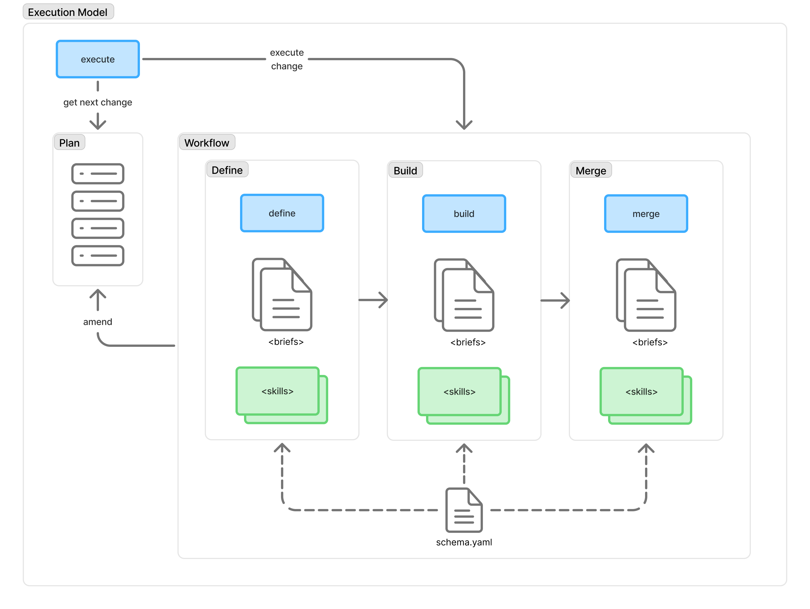

# RFC-2: Execution

> Note: CLI group renamed to `specify initiative` post-RFC-2; see `rfcs/rfc-2-cleanup-plan.md` §3.

> Status: Implemented · Depends: [RFC-1](rfc-1-cli.md)

## Abstract

Drive complex, multi-change initiatives through Specify's define-build-merge loop using a **Plan** (`plan.yaml`) — an ordered, dependency-aware list of changes with status tracking and progressive baseline accumulation. The plan format supports greenfield builds, legacy migrations, and platform modernisations; the only difference is where the input to `/spec:define` comes from.

This RFC is structured in three layers. **Layer 1** (the MVP) delivers the plan format and CLI commands — enough for a human to drive a plan-based initiative using the existing skill chain. **Layer 2** adds the `/spec:execute` driver skill that automates the execution loop. **Layer 3** adds the `/spec:plan` skill for assisted authoring of the initial plan. Each layer is independently useful: Layer 1 needs no automation; Layer 2 works against hand-authored plans; Layer 3 feeds plans into either Layer 1 or Layer 2. The manual Layer 1 commands remain available as fallback under both higher layers.

## Execution Model Overview



Specify at runtime is a three-phase loop (**define → build → merge**) driven by the `/spec:execute` skill over a long-lived **Plan** (`plan.yaml`). Per change, `/spec:execute` performs `get next change`, invokes the three phase skills in sequence, and updates `status` on the currently-active change entry. Each phase runs a *brief pipeline* declared by the active `schema.yaml`, and each brief delegates to one or more plugin skills.

The diagram is schema-agnostic: the `<briefs>` and `<skills>` stacks inside each phase box are placeholders that a schema fills in. Swapping the schema swaps the brief set and the plugin skills they delegate to; the surrounding structure — Plan, driver, phase skills, CLI — is invariant.

The diagram applies to Layers 1 and 2. In Layer 1 a human plays the `execute` role; in Layer 2, `/spec:execute` performs the same loop automatically. In both, plan *entry* writes go through `specify plan create` / `specify plan amend` (humans run the CLI in Layer 1, phase skills shell out to the same CLI in Layer 2) and plan *status* writes go through `specify plan transition`. No other code path writes `plan.yaml`. Layer 3 (`/spec:plan`) produces an initial plan and is covered separately.

Phase outcomes (`success`/`failure`/`deferred`) travel on disk via a `outcome` field in the change's `.metadata.yaml`; see [§Phase Outcome Contract](#phase-outcome-contract). Artifact flow between phases (define's outputs → build's inputs → merge's inputs) is covered in [§Context Threading](#context-threading).

### Diagram labels → skills and CLI

| Diagram label     | Skill                                          | CLI                                                                                       |
| ----------------- | ---------------------------------------------- | ----------------------------------------------------------------------------------------- |
| `get next change` | —                                              | `specify plan next`                                                                       |
| `execute`         | `/spec:execute`                                | — (Layer 1 humans run the phase skills manually)                                          |
| `execute change`  | `/spec:define` → `/spec:build` → `/spec:merge` | —                                                                                         |
| `create/amend`    | — (phases shell out to the CLI)                | `specify plan create`, `specify plan amend`; `specify plan transition` for status updates |
| Phase boxes       | `/spec:define`, `/spec:build`, `/spec:merge`   | —                                                                                         |
| `schema.yaml`     | —                                              | — (read by phase skills at load time)                                                     |
| (not drawn)       | `/spec:drop`                                   | — (invoked by humans in Layer 1, by `/spec:execute` in Layer 2)                           |

Briefs and plugin skills are schema-provided. The Omnia schema's instantiation:

| Phase  | Briefs (pipeline)                                  | Plugin skills invoked by the briefs                                                        |
| ------ | -------------------------------------------------- | ------------------------------------------------------------------------------------------ |
| define | `proposal.md`, `specs.md`, `design.md`, `tasks.md` | `/spec:extract` (when `sources` present; uses `git-cloner` and `analyze`)                  |
| build  | `build.md`                                         | `/omnia:guest-writer`, `/omnia:crate-writer`, `/omnia:test-writer`, `/omnia:code-reviewer` |
| merge  | `merge.md`                                         | — (brief body drives git operations directly)                                              |

> **Note on extract.** Extraction is not a fourth phase; it is work done inside define by a plugin skill when the plan entry has `sources`.

## Motivation

Complex initiatives — greenfield builds, legacy migrations, platform modernisations — lack a coordination artifact. The agent rediscovers scope, ordering, and dependencies on every iteration. There's no persistent plan that tracks what's done, what's next, and what's blocked.

The define-build-merge loop already works for individual changes. What's missing is the layer above: a plan that sequences changes, tracks dependencies between them, and lets progress accumulate in the baseline across iterations. Without it, every iteration starts from scratch — the agent doesn't know what came before, what's in flight, or what's blocked.

By expressing the initiative as an ordered list of changes with dependency constraints, the plan turns a sprawling effort into a series of self-contained Specify changes, each building on the baseline left by the last.

## Dependency on RFC-1

Plan parsing, validation, and status transitions are deterministic operations that belong in the CLI ([RFC-1](rfc-1-cli.md)). The skill-level loop (define → build → merge) already works today; what this RFC adds is the plan-driven coordination layer, implemented as `specify plan` subcommands on top of the CLI foundation.

---

## Layer 1: Plan Format + CLI (MVP)

### The Plan

A plan is an ordered list of the changes to implement, along with their dependencies and status. It is the initiative's table of contents: it tells the loop what to do next without requiring the agent to rediscover scope on every iteration.

```yaml
# .specify/plan.yaml
name: platform-v2

# Optional — only for migration/extraction use cases.
# Named source repositories. Changes reference these by key in their
# `sources` list. File-level scoping within a source is deferred to
# the define step (using extract skill).
# NOTE: source-aware execution is a Layer 2 capability. The Layer 1
# MVP parses and validates source references but does not wire them
# into the define step automatically; Layer 2's /spec:execute
# resolves the paths and hands them to /spec:define.
sources:
  monolith: /path/to/legacy-codebase
  orders: git@github.com:org/orders-service.git
  payments: git@github.com:org/payments-service.git
  frontend: git@github.com:org/web-app.git

changes:
  - name: user-registration
    sources: [monolith]              # which sources to analyze
    status: done                     # pending | in-progress | done | blocked | failed | skipped

  - name: email-verification
    sources: [monolith]
    depends-on: [user-registration]
    status: in-progress

  - name: registration-duplicate-email-crash
    affects: [user-registration]           # which changes/capabilities this touches
    description: >
      Duplicate email submission returns 500 instead of 409.
      Discovered during email-verification extraction.
    status: pending

  - name: notification-preferences
    depends-on: [user-registration]        # no sources → greenfield
    description: >
      Greenfield — user-facing notification channel and frequency settings.
    status: pending

  - name: extract-shared-validation
    affects: [user-registration, email-verification]
    description: >
      Pull duplicated input validation into a shared validation crate
      before building checkout-flow.
    depends-on: [email-verification]
    status: pending

  - name: product-catalog
    sources: [monolith]
    depends-on: [extract-shared-validation]
    status: pending

  - name: shopping-cart
    sources: [orders]
    depends-on: [product-catalog, user-registration]
    status: pending

  - name: checkout-api
    sources: [payments]
    depends-on: [shopping-cart]
    status: failed
    status-reason: >
      Type mismatch between cart line-item schema and payment gateway contract.
      Needs design revision after shopping-cart specs are updated.

  - name: checkout-ui
    sources: [frontend]
    depends-on: [checkout-api]
    status: pending
```

### Status State Machine

```
                            ┌─────────┐
              ┌── flag ────►│         │◄── defer ─── in-progress
              │             │ blocked │              (via /spec:drop)
              │    ┌────────┤         │
              │    │ unflag └─────────┘
              │    ▼
    ┌─────────┴────┐  select    ┌─────────────┐  merge   ┌──────┐
───►│   pending    ├───────────►│ in-progress ├─────────►│ done │
    └──────┬───────┘            └──────┬──────┘          └──────┘
           │  ▲                        │
           │  │ retry                  │ drop (failure)
           │  │                        ▼
           │  │                 ┌──────────┐
           │  └─────────────────┤  failed  │
           │                    └─────┬────┘
           │  exclude    abandon      │
           │  ┌───────────────────────┘
           ▼  ▼
    ┌───────────┐
    │  skipped  │──── re-include ────► pending
    └───────────┘
```

- **`pending`** — not started; eligible for selection by `plan next` if all `depends-on` entries are `done`
- **`in-progress`** — a Specify change has been created; define/build/merge is underway
- **`done`** — change merged successfully; specs are in baseline. **Terminal**: no transitions leave `done`. Corrections to merged behaviour are made by adding a new plan entry with `affects` referencing the `done` entry.
- **`blocked`** — manually flagged as unable to proceed (with a reason in `status-reason`). Dependency ordering is *not* modelled as `blocked` — `plan next` enforces `depends-on` at query time by only returning `pending` changes whose dependencies are all `done`
- **`failed`** — attempted but unsuccessful; the Specify change was dropped. Distinct from `skipped`, which is a deliberate exclusion
- **`skipped`** — deliberately excluded from this initiative (with a reason in `status-reason`); never attempted or no longer needed

#### Transition Rules


| Transition              | Trigger                                                                                                                                                    | Who                                                 |
| ----------------------- | ---------------------------------------------------------------------------------------------------------------------------------------------------------- | --------------------------------------------------- |
| `pending → in-progress` | Specify change directory created for this entry                                                                                                            | `specify plan transition` (user or `/spec:execute`) |
| `pending → blocked`     | Flagged with a reason — design uncertainty, external dependency, etc.                                                                                      | `specify plan transition` (manual)                  |
| `pending → skipped`     | Deliberately excluded before attempting                                                                                                                    | `specify plan transition` (manual)                  |
| `blocked → pending`     | Flag removed                                                                                                                                               | `specify plan transition` (manual)                  |
| `in-progress → done`    | Specify change reaches `merged` (`/spec:merge` completes)                                                                                                  | `specify plan transition` (user or `/spec:execute`) |
| `in-progress → failed`  | Build or test failure; Specify change is dropped (`/spec:drop`)                                                                                            | `specify plan transition` (user or `/spec:execute`) |
| `in-progress → blocked` | Needs human decision mid-change; Specify change is dropped (`/spec:drop`). Layer 1: human parks the change. Layer 2: `/spec:execute` defers automatically. | `specify plan transition` (user or `/spec:execute`) |
| `failed → pending`      | User decides to retry; a fresh Specify change will be created on next selection                                                                            | `specify plan transition` (manual)                  |
| `failed → skipped`      | User decides not to retry                                                                                                                                  | `specify plan transition` (manual)                  |
| `skipped → pending`     | Previously excluded change re-included                                                                                                                     | `specify plan transition` (manual)                  |


Only **one** change may be `in-progress` at a time per plan (single-threaded loop). `plan next` refuses to return a new change while one is already `in-progress`.

On failure, the Specify change is **dropped** via `/spec:drop`, cleaning up partial artifacts. On retry (`failed → pending`), a fresh change is created when the entry is next selected.

#### Mapping to Specify LifecycleStatus

The plan tracks coarse outcome; the Specify change tracks internal lifecycle (the `LifecycleStatus` enum defined in the `specify-change` crate — see [RFC-1](rfc-1-cli.md) §`lifecycle.rs` for the authoritative value list). When `/spec:execute` reads a change's `LifecycleStatus` to decide which loop step to run next, the plan only records whether the change is finished.


| Plan status           | Specify change state                                                                                                            |
| --------------------- | ------------------------------------------------------------------------------------------------------------------------------- |
| `pending` / `skipped` | No Specify change on disk                                                                                                       |
| `blocked` / `failed`  | No *active* Specify change — prior attempts (if any) live under `.specify/changes/archive/<name>-<timestamp>/` for human review |
| `in-progress`         | Change exists — `LifecycleStatus` ∈ {`defining`, `defined`, `building`, `complete`}                                             |
| `done`                | Change reached `merged` and was archived                                                                                        |

#### `affects` vs `depends-on`

- **`depends-on`** — ordering constraint. "Don't start this until those are `done`." Consumed by `specify plan next`.
- **`affects`** — impact annotation. "This change modifies behaviour defined by those changes." In the MVP, `affects` is parsed, validated (targets must exist as plan entries), and reported by `specify plan status`. Wiring `affects` into the define step as automatic delta-target resolution is a Layer 2 capability.

**Scope.** `affects` targets must resolve to entries in `changes`. Delta targeting against baseline capabilities that predate the current plan is deferred (see §Future Capabilities).

**Relationship to `.metadata.yaml:touched-specs`.** `affects` is a plan-level impact annotation; `touched-specs` is a per-change metadata field populated by define. The two are not automatically cross-checked in MVP; automatic seeding is a Layer 2 / Future concern.

#### Fields

| Field           | Required | Purpose                                                                                                                                                                                                                                     |
| --------------- | -------- | ------------------------------------------------------------------------------------------------------------------------------------------------------------------------------------------------------------------------------------------- |
| `name`          | Yes      | Kebab-case identifier; becomes the Specify change directory name. Must be unique across the entire plan.                                                                                                                                    |
| `status`        | Yes      | Current state in the status state machine                                                                                                                                                                                                   |
| `depends-on`    | No       | List of change names that must be `done` before this change is eligible                                                                                                                                                                     |
| `description`   | No       | Free-text scoping hint; guides the define step when scoping. Distinct from the operational `status-reason` field below.                                                                                                                     |
| `sources`       | No       | Which source repos to analyze; keys reference the top-level `sources` map. Absent or `[]` → greenfield (both forms are equivalent; validate does not distinguish them). Parsed and validated in Layer 1; source-aware execution in Layer 2. |
| `affects`       | No       | Which existing changes or capabilities are touched. Parsed and validated in Layer 1; automatic delta-target wiring in Layer 2.                                                                                                              |
| `status-reason` | No       | Why the change failed/is blocked/is skipped; populated when `status = failed`/`blocked`/`skipped`                                                                                                                                           |

`status-reason` holds the operational explanation for the current non-terminal/terminal status (`failed`, `blocked`, or `skipped`) and is overwritten on each status transition. `description` is kept exclusively for scoping intent so the define step has a stable hint that is not clobbered by operational bookkeeping. `specify plan transition --reason "..."` writes to `status-reason`.

### The Loop (Human-Driven)

In Layer 1, the human plays the `/spec:execute` driver role — running `specify plan create` / `specify plan amend` directly when a new entry is needed. The CLI provides the coordination primitives; the human drives the skill chain:

```text
specify plan status                              # where are we?
specify plan next                                # what's eligible?
specify plan transition <name> in-progress       # claim it

/spec:define <name>                              # existing skill
/spec:build <name>                               # existing skill
/spec:merge <name>                               # existing skill

specify plan transition <name> done              # record completion
```

On failure:

```text
/spec:drop <name>                                # existing skill
specify plan transition <name> failed --reason "..."
```

On deferral (the human hits an ambiguous requirement or design question mid-change and wants to park it for later resolution):

```text
/spec:drop <name>                                # same drop path as failure
specify plan transition <name> blocked --reason "Needs channel scope decision before spec is complete"
```

`blocked` differs from `failed` only in intent — a blocked change expects a human decision (then `blocked → pending` to retry), while `failed` expects remediation of an error (then `failed → pending`).

When a phase uncovers a neighbouring change that should be added to the plan (or an edit to an existing entry), the human runs the `specify plan create` / `specify plan amend` CLI commands directly — the same commands phase skills invoke under Layer 2:

```text
specify plan create registration-duplicate-email-crash \
    --affects user-registration \
    --description "Duplicate email submission returns 500 instead of 409."
```

Each iteration is a self-contained Specify change. The user runs the same `/spec:define` → `/spec:build` → `/spec:merge` chain they would run for any single change — the only difference is that the plan decides what to do next and progress is tracked across iterations. The diagram in §"Execution Model Overview" applies here as well: Layer 1 is simply the variant in which the human plays `execute` and runs the `create/amend` CLI commands manually.

When no plan exists, the loop runs in **ad-hoc mode**: the user picks the next change interactively at the start of each iteration, just like picking what to `/spec:define` next in normal development.

### Progressive Baseline Accumulation

The key mechanism is **baseline growth through merge**. After each iteration:

- The completed change's specs join `.specify/specs/` as baseline
- Subsequent iterations can reference these specs (e.g., the cart feature can reference the product-catalog specs that were merged in a prior iteration)
- The `touched-specs` conflict detection in `.metadata.yaml` prevents two in-flight changes from stomping on each other
- The archived changes in `.specify/changes/archive/` provide a complete audit trail

```text
Iteration 1:  baseline = {}
              define(user-registration) → build → merge
              baseline = { user-registration }

Iteration 2:  baseline = { user-registration }
              define(registration-duplicate-email-crash) → build → merge
              baseline = { user-registration (patched) }

Iteration 3:  baseline = { user-registration }
              define(notification-preferences) → build → merge
              baseline = { user-registration, notification-preferences }

Iteration 4:  baseline = { user-registration, notification-preferences }
              define(product-catalog) → build → merge
              baseline = { user-registration, notification-preferences, product-catalog }

...

Iteration N:  baseline = { all changes }
              Initiative complete. Every change under spec governance.
```

This works identically for all changes. New capabilities add specs to the baseline, while changes with `affects` produce delta specs against existing baseline entries. The baseline doesn't care where the specs originated — it only cares that they passed through the define-build-merge loop.

### CLI Commands

#### `specify plan validate`

Structural validation of `plan.yaml`. This command is the CLI surface over `Plan::validate` — it rolls both structural checks and plan-to-change consistency into a single pass.

- **Duplicate names** — every `name` must be unique
- **Cycle detection** — the `depends-on` graph must be a DAG (topological sort via `petgraph`)
- **Referential integrity** — every `depends-on` target, every `affects` target, and every `sources` key must reference an existing entry
- **Status values** — every `status` must be a valid state machine value
- **Single in-progress** — at most one change may have status `in-progress`
- **Plan-to-change consistency** — any `in-progress` entry must have a corresponding `.specify/changes/<name>/` directory; report orphaned changes (directories without plan entries) as warnings. Skipped automatically when `validate` is run without access to the workspace changes directory.

**Not validated by MVP:**

- Whether `sources` keys resolve to reachable paths (Layer 2 concern).
- Whether `affects` annotations agree with `.metadata.yaml:touched-specs` (Layer 2 concern).
- `done`/`failed`/`skipped`/`blocked` entries against their change directories; only `in-progress` is reconciled.

**Output.** Human-readable text. A stable JSON output format (and a published `plan-validate-output.schema.json`) is deferred until a CI consumer materialises.

**Plan schema.** A `plan.schema.json` for `.specify/plan.yaml` is published under `schemas/plan/` for editor integration (`# yaml-language-server: $schema=...`) and author-time validation.

#### `specify plan next`

Return the next eligible change: a `pending` change whose `depends-on` entries are all `done`. Selection among multiple eligible changes follows list order (first eligible wins).

- If a change is `in-progress`, refuse and report which change is active.
- If no changes are eligible, report whether this means "all done" or "remaining changes are blocked/failed/pending-on-dependencies."

#### `specify plan status`

Initiative progress report:

- Total changes, grouped by *every* status in the state machine (`done`, `in-progress`, `pending`, `blocked`, `failed`, `skipped`); zero-counts are shown so downstream consumers can rely on a fixed shape
- Current `in-progress` change (if any), with its Specify `LifecycleStatus` from `.metadata.yaml`
- Blocked/failed entries with their reasons
- Next eligible changes (what `plan next` would return)
- Impact report: which `done` changes are referenced by `affects` entries still pending
- Display in dependency order (topological sort), not list order

**Cycle handling.** `specify plan status` is a diagnostic tool and must work even when `specify plan validate` reports a cycle. When the `depends-on` graph is cyclic, `status` falls back to list order and prints a banner pointing at `specify plan validate` for detail. Any other structural error short-circuits with a clear pointer to `validate`.

**Output.** Human-readable text. A structured output format is deferred until a CI consumer materialises.

#### `specify plan create` and `specify plan amend`

```
specify plan create <name> [--depends-on <name>...] [--affects <name>...] \
    [--sources <key>...] [--description "..."]
specify plan amend  <name> [--depends-on <name>...] [--affects <name>...] \
    [--sources <key>...] [--description "..."]
```

The only commands (other than `specify plan transition`) that write *entries* to `plan.yaml`. `create` adds a new entry with `status: pending`; `amend` edits non-status fields on an existing entry. Both validate the resulting plan structurally before writing.

In Layer 1 humans invoke these directly; in Layer 2 phase skills invoke them the same way (see [§Phase Boundary → Rule 2](#rule-2--entry-writes-go-through-the-cli-status-transitions-go-through-specexecute)). No intermediate skill wraps them.

#### `specify plan transition`

```
specify plan transition <name> <target-status> [--reason "..."]
```

Validated status transitions. The command:

1. Reads `plan.yaml`
2. Validates the transition is legal per the state machine
3. Updates the entry's `status`
4. If `--reason` is provided, writes it to `status-reason` (valid when the target status is `failed`, `blocked`, or `skipped`). `description` is never touched by `transition`.
5. Writes the plan atomically
6. Outputs the new state

All plan *status* mutations go through this command, ensuring the state machine is always enforced. `/spec:execute` uses the same command (or the underlying `specify-change` crate function) rather than editing YAML directly.

#### `specify plan archive`

```
specify plan archive [--force]
```

Move the current `.specify/plan.yaml` to `.specify/archive/plans/<plan-name>-<YYYYMMDD>.yaml`. This closes out an initiative and leaves the workspace ready for a fresh plan to be authored by hand.

Refuses by default if the plan has any `pending`, `in-progress`, `blocked`, or `failed` entries — only `done` and `skipped` entries are considered terminal. Pass `--force` to archive a plan with outstanding work (the CLI still records the non-terminal entries in the archived copy; it does not rewrite them).

Symmetric with the per-change `specify change archive` call — both move completed work out of the active workspace under `.specify/archive/`.

### Library Implementation

The plan state machine is encoded in the `specify-change` crate (see [RFC-1](rfc-1-cli.md) `Workspace Layout`), alongside the existing `LifecycleStatus`:

```rust
#[derive(Debug, Clone, PartialEq, Deserialize, Serialize)]
#[serde(rename_all = "kebab-case")]
pub enum PlanStatus {
    Pending,
    InProgress,
    Done,
    Blocked,
    Failed,
    Skipped,
}

impl PlanStatus {
    pub fn can_transition_to(&self, target: &Self) -> bool {
        use PlanStatus::*;
        matches!(
            (self, target),
            (Pending, InProgress)
                | (Pending, Blocked)
                | (Pending, Skipped)
                | (InProgress, Done)
                | (InProgress, Failed)
                | (InProgress, Blocked)
                | (Blocked, Pending)
                | (Failed, Pending)
                | (Failed, Skipped)
                | (Skipped, Pending)
        )
    }

    pub fn transition(
        &self,
        target: PlanStatus,
    ) -> Result<PlanStatus, Error> {
        if self.can_transition_to(&target) {
            Ok(target)
        } else {
            Err(Error::PlanTransition {
                from: self.clone(),
                to: target,
            })
        }
    }
}
```

Dependency resolution uses `petgraph` for topological sort and cycle detection. The `plan.rs` module (in `specify-change`, alongside the lifecycle state machine) provides:

```rust
#[derive(Debug, Clone, Deserialize, Serialize)]
#[serde(rename_all = "kebab-case")]
pub struct Plan {
    pub name: String,
    #[serde(default)]
    pub sources: BTreeMap<String, String>,
    pub changes: Vec<PlanChange>,
}

#[derive(Debug, Clone, Deserialize, Serialize)]
#[serde(rename_all = "kebab-case")]
pub struct PlanChange {
    pub name: String,
    pub status: PlanStatus,
    #[serde(default)]
    pub depends_on: Vec<String>,
    #[serde(default)]
    pub affects: Vec<String>,
    #[serde(default)]
    pub sources: Vec<String>,
    #[serde(default)]
    pub description: Option<String>,
    /// Operational explanation for the current non-terminal/terminal
    /// status (`failed`, `blocked`, or `skipped`). Overwritten on each
    /// status transition; cleared when the entry returns to `pending`,
    /// `in-progress`, or `done`. See §Fields.
    #[serde(default)]
    pub status_reason: Option<String>,
}

/// Patch applied by `Plan::amend` to an existing entry. Every field is
/// `Option<T>`; `None` means "leave unchanged", `Some(v)` means "replace
/// with v". `status` and `status_reason` are deliberately absent — status
/// transitions are made via `Plan::transition`, never through `amend`,
/// and the reason field travels with the transition.
#[derive(Debug, Default, Clone)]
pub struct PlanChangePatch {
    pub depends_on: Option<Vec<String>>,
    pub affects: Option<Vec<String>>,
    pub sources: Option<Vec<String>>,
    pub description: Option<Option<String>>,
}

/// Severity of a validation finding. `Error` means the plan is ill-formed;
/// `Warning` means the plan is structurally valid but flags a known
/// transient or advisory condition (e.g. an orphan change directory).
#[derive(Debug, Clone, PartialEq)]
pub enum ValidationLevel { Error, Warning }

#[derive(Debug, Clone)]
pub struct ValidationResult {
    pub level: ValidationLevel,
    pub code: &'static str,
    pub message: String,
    pub entry: Option<String>,
}

impl Plan {
    pub fn load(path: &Path) -> Result<Self, Error>;
    pub fn save(&self, path: &Path) -> Result<(), Error>;

    /// Structural + optional consistency validation.
    ///
    /// When `changes_dir` is `Some`, plan-to-change consistency checks are
    /// run in addition to structural ones (orphan directories, missing
    /// directories for `in-progress` entries). When `None`, only
    /// structural checks are performed — this is the mode CI uses when
    /// only the plan file is available.
    pub fn validate(&self, changes_dir: Option<&Path>) -> Vec<ValidationResult>;

    pub fn next_eligible(&self) -> Option<&PlanChange>;
    pub fn transition(
        &mut self,
        name: &str,
        target: PlanStatus,
        reason: Option<&str>,
    ) -> Result<(), Error>;
    pub fn create(
        &mut self,
        change: PlanChange,
    ) -> Result<(), Error>;
    pub fn amend(
        &mut self,
        name: &str,
        patch: PlanChangePatch,
    ) -> Result<(), Error>;
    pub fn topological_order(&self) -> Result<Vec<&PlanChange>, Error>;

    /// Move the plan at `path` to `archive_dir/<plan-name>-<YYYYMMDD>.yaml`.
    /// Returns `Error::PlanHasOutstandingWork` if any entry is in a
    /// non-terminal state (`pending`, `in-progress`, `blocked`, `failed`)
    /// unless `force = true`. Returns the archived path on success.
    pub fn archive(
        path: &Path,
        archive_dir: &Path,
        force: bool,
    ) -> Result<PathBuf, Error>;
}
```

### Conventions

- **Location.** One *active* plan per project at `.specify/plan.yaml`. Multiple concurrent plans are a future concern.
- **Lifecycle.** When an initiative completes (`specify plan status` reports no eligible changes, all non-terminal entries resolved), the plan is archived to `.specify/archive/plans/<plan-name>-<YYYYMMDD>.yaml` by `specify plan archive` (see [§`specify plan archive`](#specify-plan-archive) below). Starting a new initiative while a previous `plan.yaml` still exists is *not* automatic — run `specify plan archive` first to move the current plan out of the way, then author a fresh `plan.yaml`.
- **Bootstrapping.** A fresh `plan.yaml` can be authored with the `/spec:plan` skill (see [§Layer 3: Plan Authoring](#layer-3-plan-authoring)) or by hand. In either case, `specify plan validate` is the recommended first command after authoring.
- **Name identity.** The plan entry `name` becomes the Specify change name (the directory under `.specify/changes/`). Names must be unique across the entire plan, including entries with terminal statuses (`done`, `skipped`).
- **Name format.** Same as Specify change names: kebab-case (lowercase letters, digits, hyphens).
- **List order.** YAML list order has **no effect** on the `pending → in-progress` transition whenever a single change is eligible — `depends-on` resolution is the primary ordering signal. It is used only as a deterministic tie-break when two or more changes are simultaneously eligible (in which case `plan next` returns the first in list order). Reordering entries with an unambiguous `depends-on` graph has no observable effect.
- **Adding changes mid-initiative.** Run `specify plan create` / `specify plan amend` — the same CLI commands in both layers. Layer 1 humans invoke them directly; Layer 2 phase skills shell out to them mid-run. No other code path writes change *entries* to the plan.
- **Initiative completion.** The initiative is complete when no eligible changes remain. `specify plan status` reports whether this means "all done" or "remaining changes are blocked/failed."
- **Plan-to-change linkage.** `specify plan validate` checks that `in-progress` entries have corresponding `.specify/changes/<name>/` directories and reports orphaned change directories (present on disk but absent from the plan) as warnings. An `in-progress` entry may briefly have no change directory during phase start-up or crash recovery; this is a warning, not an error.
- **Atomic writes.** `specify plan create`, `specify plan amend`, and `specify plan transition` write `plan.yaml` atomically (temp file + rename) so readers never observe a partial file. Cross-process locking is a Layer 2 concern — see [§Driver Concurrency](#driver-concurrency) under Layer 2.

---

## Layer 2: Automated Execution

Layer 2 adds the **`/spec:execute`** driver skill that automates the human-driven loop from Layer 1. It reads `plan.yaml`, selects the next eligible change, runs the phase sequence, and updates the currently-active entry's status — recording questions and failures rather than blocking on them. `/spec:execute` does not create or amend change entries; when a phase needs to add a new entry or edit an existing one, the phase shells out to `specify plan create` / `specify plan amend` — the same CLI that humans use under Layer 1.

`/spec:execute` is the first skill that programmatically invokes other skills. All existing skills (extract, define, build, merge, drop) remain unchanged; `/spec:execute` invokes the phase skills with arguments and interprets their outputs. Its contract is with the **phase skills** (`/spec:define`, `/spec:build`, `/spec:merge`) — not with the briefs inside each phase's pipeline or the plugin skills those briefs delegate to. See §"Execution Model Overview" above for the full skill layering.

### Invariants

| Invariant                                                        | Enforced by                                                                                                            |
| ---------------------------------------------------------------- | ---------------------------------------------------------------------------------------------------------------------- |
| Driver contracts with phases, not briefs                         | `/spec:execute` only invokes `/spec:define`, `/spec:build`, `/spec:merge`                                              |
| Phases own verify-repair loops                                   | Phase skills exhaust their repair budget before returning                                                              |
| Exactly one of `success`/`failure`/`deferred` per phase          | Phase writes `outcome` into `.metadata.yaml` before returning (see [§Phase Outcome Contract](#phase-outcome-contract)) |
| Change *entries* written only via `Plan::create` / `Plan::amend` | Phases and humans both run `specify plan create` / `specify plan amend`                                                |
| Change *status* updates written only via `Plan::transition`      | `/spec:execute` (Layer 2) or humans (Layer 1) run `specify plan transition`                                            |
| Single `in-progress` at a time                                   | `plan next` / `plan validate`                                                                                          |
| Single `/spec:execute` driver at a time                          | `.specify/plan.lock` advisory lock (see [§Driver Concurrency](#driver-concurrency))                                    |

### Invocation

```
/spec:execute [--dry-run] [--loop]
```

- No arguments: reads `.specify/plan.yaml`, processes a single change then stops (supervised mode)
- `--loop`: process changes one at a time until `specify plan next` reports no eligible change. A `blocked` or `failed` change is *not* an eligible change, so `--loop` naturally skips over them and continues with any still-eligible siblings; it stops only when no `pending` change has all its `depends-on` entries `done`. At that point, final output reports the remaining counts by status so the operator can see whether the initiative is complete or merely stuck.
- `--dry-run`: show what would run next without executing

The plan path is fixed at `.specify/plan.yaml` (see §Conventions → Location). Multi-plan support is a future capability and would add an optional path argument at that time.

### Driver Concurrency

`/spec:execute` (any mode, including `--dry-run`) acquires an exclusive advisory lock on `.specify/plan.lock` held for its entire lifetime. A second `/spec:execute` invocation refuses to start with `Error::DriverBusy`, naming the PID of the running driver. This prevents two drivers from racing on `get next change` and transitions. The lockfile is removed on normal exit; stale locks held by a dead PID are detected on startup and reclaimed. `flock` semantics are unreliable on network filesystems (NFS, SMB); Specify workspaces are expected to live on a local filesystem.

### Core Loop

The following is the normative expansion of the `execute` box on the framework diagram. For a single change, `/spec:execute` performs `get next change`, drives `execute change` through define → build → merge, and updates `status` on the currently-active entry. It does not create or amend change entries — phases shell out to `specify plan create` / `specify plan amend` directly when that is needed.

```text
  1. Read plan.yaml
  2. Select next eligible change (all depends-on are done, status is pending)
  3. If none eligible → stop (report blocked/remaining counts)
  4. Transition plan entry: pending → in-progress
  5. Run the phase sequence: invoke /spec:define, then /spec:build, then /spec:merge.
     Each phase internally runs its brief pipeline from the active schema.yaml,
     honouring per-brief `needs` edges. /spec:execute only pre-resolves arguments
     to the phase skill (with field-presence adjustments from the plan entry);
     it does not invoke individual briefs or plugin skills. Phases may shell out
     to `specify plan create` / `specify plan amend` mid-run to add or amend other
     change entries; those writes are synchronous and visible to every subsequent
     `get next change` call.
  6. On success: transition in-progress → done
  7. On failure: invoke /spec:drop, transition in-progress → failed, record status-reason
  8. On deferred question: invoke /spec:drop, transition in-progress → blocked, record status-reason
  9. If --loop: continue from step 1; otherwise stop
```

Step 4 transitions `pending → in-progress` *before* `/spec:define` creates the change directory, so between steps 4 and 5 the plan briefly shows an `in-progress` entry with no matching `.specify/changes/<name>/` directory. `specify plan validate` reports this as a warning, not an error. Crash recovery is covered in §Plan Mutation and Crash Safety.

### Non-Interactive Execution

The existing skills use `AskQuestion` for confirmations, disambiguation, and warnings; an automated loop cannot stop on every change. `/spec:execute` resolves deterministic decisions by passing CLI flags and reading structured JSON from the `specify` CLI — lifecycle bookkeeping, overlap reports, merge preview, conflict detection, and the like are already non-interactive by construction. What remains are genuine human-judgement questions: an ambiguous task during build, an unresolved design issue, an unexpected baseline merge conflict at merge-time. On these, the phase defers the change rather than guessing; `/spec:execute` transitions the plan entry to `blocked` with the question copied into `status-reason`.

#### Question Recording

When a step encounters a situation requiring human input, `/spec:execute` writes a structured entry to a journal file at `.specify/changes/<name>/journal.yaml`:

```yaml
entries:
  - timestamp: 2026-04-16T14:30:00Z
    step: build
    type: question
    summary: "Task 3/7 unclear — payment gateway contract references undefined type PaymentIntent"
    context: |
      Working on task: Implement checkout payment processing
      The spec references PaymentIntent but no type definition exists in
      design.md or upstream specs.
```

The phase writes `outcome: deferred` into `.metadata.yaml` with a `summary` that captures the question the human needs to answer. `/spec:execute` copies that `summary` into the plan entry's `status-reason` when it records the `in-progress → blocked` transition. If a phase recorded multiple questions before deferring, the phase chooses which one is the load-bearing question; the full list remains in `journal.yaml` for human review. This reuses the existing `blocked` status and its manual `blocked → pending` transition — a human reviews the journal, resolves the question (perhaps by updating the plan description via `specify plan amend`, adding to the spec, or refining the design), and unflags the change.

### Failure and Resumption

#### Problem

A change can fail mid-build (tests don't pass, extraction produces garbage, merge conflicts). What happens to the half-created Specify change?

#### Design

Mark as `failed` with the reason and move on to the next eligible change. The failure signal always arrives at the phase boundary — a brief-level problem (e.g. a failed `cargo test` inside the Omnia `build.md` verify-repair loop) does not surface to `/spec:execute` until the phase skill has exhausted its own repair budget (see §"Phase Boundary" below).

```text
on failure at any phase:
  1. Phase records `type: failure` details in journal.yaml as it hits them
     (timestamp, phase, summary, context — stderr, test output, etc.)
  2. Phase stamps `outcome: failure` in .metadata.yaml with a
     rolled-up summary before returning
  3. /spec:execute drops the Specify change via /spec:drop (archives partial artifacts)
  4. /spec:execute transitions plan entry: in-progress → failed
  5. /spec:execute copies the outcome summary into status-reason
  6. Continue to next eligible change
```

**Retry**: A human reviews the failure, optionally updates the plan entry's description or dependencies (via `specify plan amend`), then transitions `failed → pending`. On the next `/spec:execute` run, a fresh Specify change is created for that entry.

Archived attempts remain on disk under `.specify/changes/archive/<name>-<timestamp>/` for humans who want to audit what went wrong before retrying; automatically feeding the previous attempt's outcome back into `/spec:define` as a "things to avoid" hint is deferred (see §Future Capabilities).

#### Failure vs Deferral

Failure means the step ran and produced an error. Deferral means the step couldn't proceed without human input. Both result in the Specify change being dropped and archived, but the distinction matters for triage:

|          | Plan status | Reason field    | Cause                                                         | Resolution                                        |
| -------- | ----------- | --------------- | ------------------------------------------------------------- | ------------------------------------------------- |
| Failure  | `failed`    | `status-reason` | Step error (tests, merge conflict, bad extraction)            | Fix the issue, retry (`failed → pending`)         |
| Deferral | `blocked`   | `status-reason` | Needs human decision (ambiguous requirement, design question) | Answer the question, unflag (`blocked → pending`) |

### Phase Boundary

`/spec:execute` only communicates with phase skills (`/spec:define`, `/spec:build`, `/spec:merge`); it does not invoke individual briefs or plugin skills. Two rules pin down that contract precisely.

#### Rule 1 — Phases own their verify-repair loops

A phase skill is responsible for all recovery that lives inside its brief pipeline. When a brief encounters a brief-level failure (compilation error, failed test, lint violation, reviewer finding, etc.), the phase skill runs its documented repair strategy (for example, the 3-iteration verify-repair loop defined in the Omnia `build.md` brief, which re-enters `crate-writer` or `test-writer` based on the failure classification). `/spec:execute` is not involved.

A phase returns one of exactly three outcomes to `/spec:execute`:

| Outcome    | Meaning                                                                                                                                                                                                                                                                                 | `/spec:execute` reaction                                                                                      |
| ---------- | --------------------------------------------------------------------------------------------------------------------------------------------------------------------------------------------------------------------------------------------------------------------------------------- | ------------------------------------------------------------------------------------------------------------- |
| `success`  | Phase stamps `outcome: success` in `.metadata.yaml`; all briefs produced their `generates` artifacts and any verify-repair loops converged.                                                                                                                                             | Proceed to the next phase (or, after merge, transition plan entry to `done`).                                 |
| `failure`  | Phase stamps `outcome: failure` in `.metadata.yaml` after exhausting its internal repair budget, with a `summary` naming which brief failed and the final stderr/test output. The phase has already appended `type: failure` entries to `journal.yaml` along the way.                   | Drop the Specify change, transition plan entry to `failed`, copy the outcome `summary` into `status-reason`.  |
| `deferred` | Phase stamps `outcome: deferred` in `.metadata.yaml` because it needs human judgement (ambiguous requirement, design question, baseline merge conflict), with a `summary` naming the question. The phase has already appended `type: question` entries to `journal.yaml` along the way. | Drop the Specify change, transition plan entry to `blocked`, copy the outcome `summary` into `status-reason`. |

This keeps `/spec:execute` free of brief-specific knowledge and avoids double-booked repair logic.

#### Rule 2 — Entry writes go through the CLI; status transitions go through `/spec:execute`

Phases shell out to `specify plan create` / `specify plan amend` when they need to add or modify change entries; these commands (surfacing `Plan::create` / `Plan::amend`) are the only code path that writes change entries to `plan.yaml`. State updates on the currently-active entry (e.g. `in-progress → done`) are performed by `/spec:execute` via `specify plan transition`. No other code path writes `plan.yaml`.

A phase may discover a new neighbouring change (extraction finds `registration-duplicate-email-crash`), notice that an existing entry needs an added dependency, or flag a neighbouring change as touched. The phase calls `specify plan create` or `specify plan amend` directly during its run, and the CLI writes `plan.yaml` synchronously — there is no payload, no propose/apply split, and no buffered-mutation list. The new or updated entry is visible to every subsequent `get next change` call, including the next iteration of the same `--loop` run.

Because the CLI writes during the phase run, any mutations a phase made before it deferred or failed are already in the Plan; mutations it had not yet made are simply not made. There is no "apply on `deferred`" edge case and no mid-apply crash window.

**`specify plan amend` may target the currently-active entry.** A phase is allowed to amend non-status fields on its own `in-progress` entry (e.g. to add a newly discovered `depends-on` edge or update `description` with refined scope). Only the `status` field is off-limits to `amend` — transitions remain `/spec:execute`'s sole prerogative via `specify plan transition`. `PlanChangePatch` in the library reflects this: it has no `status` field.

Consequences:

- Exactly two classes of writes touch `plan.yaml`: entry writes (`Plan::create`/`amend`, surfaced as `specify plan create` / `specify plan amend`) and status writes (`Plan::transition`, surfaced as `specify plan transition`). Both route through the same library functions regardless of whether the caller is a human (Layer 1) or a phase skill (Layer 2). `specify plan validate` has exactly those two classes of writes to reason about.
- Phase skills need no plan-mutation logic of their own — they run the same CLI commands a human would run. This makes phase skills easier to test (no plan fixture required) and leaves legacy/human-driven use of the same skills unaffected.
- There is no dedicated plan-mutation *skill*. Introducing one would wrap a single CLI call in an extra skill-invocation contract without adding semantics; the RFC deliberately avoids that indirection.
- The `registration-duplicate-email-crash` example below is the canonical end-to-end worked example of this flow.

#### Phase Outcome Contract

Every phase skill (`/spec:define`, `/spec:build`, `/spec:merge`) returns exactly one of `success`, `failure`, or `deferred` to `/spec:execute`. The transport is the **`outcome` field** in the change's `.specify/changes/<name>/.metadata.yaml`, written atomically as the phase's last action before returning control:

```yaml
# .specify/changes/<name>/.metadata.yaml (fragment)
status: complete          # existing LifecycleStatus
outcome:
  phase: build            # define | build | merge
  outcome: success        # success | failure | deferred
  at: 2026-04-18T09:14:22Z
  summary: "5/5 tasks complete; all verify-repair loops converged"
  context: |
    (optional; present on failure/deferred — stderr, failing test name,
    ambiguous-requirement text, etc. Rendered verbatim into the plan's
    status-reason when /spec:execute records the transition.)
```

`/spec:execute` reads `outcome` on phase return, classifies the outcome, and reacts per the table in Rule 1. If the field is missing, malformed, or contradicts the lifecycle status, `/spec:execute` treats the phase as `deferred` with a diagnostic summary — this matches the unclassifiable-crash-window behaviour at the end of [§Plan Mutation and Crash Safety](#plan-mutation-and-crash-safety) and keeps the driver self-consistent.

Putting the outcome in `.metadata.yaml` — the same file that already carries `LifecycleStatus` — means change state and phase state live in one place. `journal.yaml` remains a pure append-only audit log of `type: question`, `type: failure`, and `type: recovery` entries; `/spec:execute` never consumes journal entries as a signalling channel. Humans auditing a run can read both files without worrying about which one is authoritative: `.metadata.yaml` is the source of truth for what *state* the change is in, `journal.yaml` is the source of truth for *why*.

The CLI writes this field: phases do not hand-edit `.metadata.yaml`. A new `specify change phase-outcome <name> <phase> <outcome> [--summary ...] [--context ...]` subcommand (analogous to `specify change transition`) stamps the field and writes atomically. This transport is normative for Layer 2. Per-invocation return values (structured tool responses, etc.) remain an open design question for how one skill *invokes* another — that is the subject of [§Skill Invocation Model](#skill-invocation-model) — but the *outcome* a phase communicates is always mirrored on disk in `.metadata.yaml` so `/spec:execute` can read it deterministically.

### Context Threading

#### Problem

How does `/spec:execute` pass context between define → build → merge for a single change?

#### Design

The artifacts are the context. There is no separate context object or state bag. Each phase reads what the previous phase wrote:

```text
┌──────────────────────────────────────────────────────────────────┐
│                                                                  │
│  plan.yaml             ← /spec:execute reads: name, description, │
│                          sources, affects, depends-on            │
│                                                                  │
│  /spec:define  (runs its brief pipeline; when the plan entry     │
│                 has `sources`, one of define's briefs invokes    │
│                 the /spec:extract plugin skill)                  │
│    reads: source repos (from plan sources map, via extract)      │
│           or creates from description                            │
│    writes: proposal, specs, design, tasks per schema pipeline    │
│                                                                  │
│  /spec:build                                                     │
│    reads: all define artifacts + baseline specs                  │
│    writes: code, marks tasks complete                            │
│                                                                  │
│  /spec:merge                                                     │
│    reads: completed change artifacts + baseline                  │
│    writes: merged baseline specs, archives change                │
│                                                                  │
│  plan.yaml             ← /spec:execute writes: status → done     │
│                                                                  │
└──────────────────────────────────────────────────────────────────┘
```

`/spec:execute`'s responsibility is limited to:

1. **Supplying initial arguments** to each phase skill invocation — derived from the plan entry (name, source paths, description)
2. **Checking preconditions** between phases — reading `.metadata.yaml` to confirm the previous phase completed (status progressed to the expected value)
3. **Deciding what to run next** — field presence (`sources`, `affects`) determines what context to pass to define; the Specify `LifecycleStatus` determines where to resume if re-entering a partially-completed change

#### Resumption Within a Change

The existing `LifecycleStatus` values (defined in the `specify-change` crate — see [RFC-1](rfc-1-cli.md) §`lifecycle.rs`) already encode which step ran last. `/spec:execute` uses this for resumption:

```text
match change.lifecycle_status:
  None           → start from the beginning (define, which invokes extract via one of its briefs if sources present)
  defining       → resume/restart define
  defined        → start build
  building       → resume build
  complete       → run merge
```

If `/spec:execute` crashes mid-change and is restarted, it picks up where it left off by reading the plan (which change is `in-progress`) and the Specify change's `.metadata.yaml` (which step was last completed).

### Step Sequence by Field Presence

The loop is always define → build → merge. `/spec:execute` adjusts what it passes to define based on which fields are present on the plan entry:

```text
change with sources:    define (extract is invoked via one of define's briefs) → build → merge
change with affects:    define (delta against affected specs) → build → merge
change (greenfield):    define → build → merge
```

These are not mutually exclusive — a change could have both `sources` and `affects`. `/spec:execute` passes both signals to define:

- **`sources`** present: `/spec:execute` resolves source paths from the top-level `sources` map and passes them to define, which forwards them to whichever of its briefs invokes `/spec:extract`.
- **`affects`** present: `/spec:execute` passes the list of affected capability names to define for delta targeting against the corresponding baseline specs.

### Plan Mutation and Crash Safety

`plan.yaml` has two library-level writers, each with a narrow scope:

1. **`Plan::create` / `Plan::amend`** write change *entries*. Surfaced as `specify plan create` / `specify plan amend` on the CLI. Humans invoke the CLI in Layer 1; phase skills invoke the same CLI in Layer 2. Both callers funnel into the same library functions.
2. **`Plan::transition`** writes `status` updates on the currently-active entry. Surfaced as `specify plan transition` and used by humans (Layer 1) and `/spec:execute` (Layer 2). In Layer 2, transitions happen at well-defined points:
    1. `pending → in-progress`: **before** the first phase invocation for that change
    2. `in-progress → done`: **after** `/spec:merge` completes successfully
    3. `in-progress → failed`: **after** `/spec:drop` completes
    4. `in-progress → blocked`: **after** `/spec:drop` completes and question is journaled

On every run, before `get next change`, `/spec:execute` self-heals any `in-progress` entry from a prior run by reading `outcome` from the most recent on-disk `.metadata.yaml` (active change dir or archive). If it's `success`/`failure`/`deferred`, the driver applies the matching plan transition (`done`/`failed`/`blocked`), copying the outcome `summary` into `status-reason` for the non-success cases, and appends a `type: recovery` entry to the journal. If an active change directory exists with no terminal outcome yet, resumption is per §[Context Threading → Resumption Within a Change](#resumption-within-a-change) using `LifecycleStatus` — no plan transition is needed.

If the on-disk state is ambiguous (no `outcome`, malformed, or contradicts the lifecycle status), the driver stops with a non-zero exit and leaves the plan entry as `in-progress` for human triage. No speculative transition is made.

Because `specify plan create` / `specify plan amend` write synchronously and atomically during a phase run, no mutations are ever "in flight": on crash, any entry the phase already wrote is in the plan, and any entry it had not yet written is simply absent.

### Skill Invocation Model

> **Open Design (Layer 2).** The outcome-on-disk protocol is pinned down by the [§Phase Outcome Contract](#phase-outcome-contract); what remains open is how one skill *invokes* another and how per-invocation arguments are passed.

`/spec:execute` runs within the same agent session and invokes other skills by their standard mechanism (e.g., `/spec:define change-name`). By default it processes a single change and stops, keeping the human in the loop. With `--loop`, it holds the agent for the duration of the initiative (or until all eligible changes are processed).

Under the skill layering established in §"Execution Model Overview", the caller/callee pairs that need a concrete invocation contract are:

- `/spec:execute → /spec:define | /spec:build | /spec:merge` (driver invokes phase skills)
- `phase skill → plugin skill` (phase invokes its brief-selected plugin skills)
- `/spec:execute → /spec:drop` (driver invokes drop on failure/deferral)

Plan mutation is deliberately *not* in this list: phases shell out to `specify plan create` / `specify plan amend` the same way every skill already shells out to the `specify` CLI for deterministic bookkeeping, so it doesn't need a dedicated skill-invocation contract.

Resolved for Layer 2 (already specified elsewhere in this RFC):

- **Phase → `/spec:execute` outcome transport** is the `outcome` field in the change's `.metadata.yaml` (see [§Phase Outcome Contract](#phase-outcome-contract)). `/spec:execute` reads this deterministically on phase return; humans auditing a run see the same data.
- **Plan entry writes** are synchronous to the library (`Plan::create`/`amend`) via `specify plan create` / `specify plan amend`, and visible to every subsequent reader immediately after return.

Open questions applying to all four pairs:

- How are arguments passed across the `/spec:<x>` boundary (slash-command text, tool-call parameters, on-disk argument files)?
- How does the caller read the callee's per-invocation return value (distinct from the on-disk outcome, which is resolved)?
- What's the tool-call shape that makes this deterministic and resumable?

These are design work for the Layer 2 build, not Layer 1 scope. The answer must preserve the outcome-on-disk protocol so self-heal remains correct even when a crash interrupts the invocation-level transport.

### Output and Observability

`/spec:execute` produces structured output at each transition. The step counter reflects the three-phase loop (define → build → merge); extract work appears as a sub-step inside define and is not counted separately.

```text
## /spec:execute — platform-v2

### Initiative: platform-v2
Progress: done 1, in-progress 1, pending 6, blocked 0, failed 1, skipped 0 (total 9)

---

### Processing: email-verification (sources: [monolith])

Step 1/3: define
  - extract sub-step (via /spec:extract)
      Source: /path/to/legacy-codebase
      Artifacts: specs/email-verification/spec.md, design.md ✓
  Artifacts: proposal.md, specs, design.md, tasks.md ✓

Step 2/3: build
  Tasks: 5/5 complete ✓

Step 3/3: merge
  Baseline updated: .specify/specs/email-verification/spec.md ✓
  Status: done

---

### Next: registration-duplicate-email-crash (affects: [user-registration])
```

The progress line enumerates *every* status in the state machine so the output shape is stable even when some statuses have zero entries.

For deferred changes:

```text
### Processing: notification-preferences (greenfield)

Step 1/3: define
  ⚠ Question recorded — change deferred to blocked

  Question: The description says "notification channel and frequency settings"
  but doesn't specify which channels are in scope. The baseline has no
  notification infrastructure to reference.

  Journal: .specify/changes/notification-preferences/journal.yaml
  Action needed: Update the plan description (specify plan amend …) with channel
  scope, then unflag (blocked → pending) to retry.

### Skipping to next eligible change...
```

When `--loop` terminates (whether successfully, after a failure chain, or on unrecoverable deadlock), `/spec:execute` emits a terminal summary:

```text
## /spec:execute — platform-v2 — terminated

### Final state
Progress: done 6, in-progress 0, pending 2, blocked 1, failed 0, skipped 0 (total 9)

Completion: stuck (2 pending changes remain but their dependencies are not all done; 1 change is blocked)

Blocked:
  - notification-preferences (status-reason: "Channel scope not specified in description.")

Pending (dependencies not satisfied):
  - product-catalog (waits on: extract-shared-validation)
  - extract-shared-validation (waits on: email-verification)

Next action: resolve blocked changes (specify plan amend + specify plan transition notification-preferences blocked → pending) or wait for their dependencies to complete.
```

The `Completion:` line is one of `all-done`, `stuck` (pending changes with unmet dependencies), `halted` (a failure or deferral stopped the loop), or `driver-interrupted` (SIGINT/SIGTERM).

### Worked Example: Phase-invoked Plan Mutation

This trace makes the `create/amend` blue box on the framework diagram load-bearing. The `registration-duplicate-email-crash` entry in the plan example above is introduced to the Plan by a phase-invoked `specify plan create` call during another change's define phase.

1. `/spec:execute` picks up `email-verification`, transitions its entry to `in-progress` via `specify plan transition`.
2. `/spec:execute` invokes `/spec:define email-verification`.
3. During define, the `/spec:extract` plugin skill (invoked by one of define's briefs, since `email-verification` has `sources`) discovers a defect in `user-registration` (duplicate email submission returns 500 instead of 409).
4. The define phase shells out to the CLI:
    ```bash
    specify plan create registration-duplicate-email-crash \
        --affects user-registration \
        --description "Duplicate email submission returns 500 instead of 409. Discovered during email-verification extraction."
    ```
    The CLI writes the new entry into `plan.yaml` synchronously — the same code path a human would use in Layer 1.
5. Define continues, completes its own briefs, returns `success`.
6. `/spec:execute` invokes `/spec:build email-verification`, then `/spec:merge email-verification`.
7. On success, `/spec:execute` transitions `email-verification` to `done` via `specify plan transition`.
8. The next `/spec:execute` iteration picks up `registration-duplicate-email-crash` (or a higher-priority sibling, depending on dependencies).

There is no buffered mutation, no `plan-mutations` payload, no deferred-apply edge case, and no intermediate plan-mutation skill: the new entry was written by a direct CLI call during the define phase, and it is visible to every subsequent `get next change` call.

### Layer 2 Concerns Summary

| Concern                 | Resolution                                                                                                                                                                                                                       |
| ----------------------- | -------------------------------------------------------------------------------------------------------------------------------------------------------------------------------------------------------------------------------- |
| Interactive skills      | `/spec:execute` pre-resolves arguments; genuine questions defer the change                                                                                                                                                       |
| Failure                 | `/spec:drop` the Specify change, mark `failed` with `status-reason`, advance                                                                                                                                                     |
| Resumption              | Plan `in-progress` + Specify `LifecycleStatus` encode exactly where to resume                                                                                                                                                    |
| Context threading       | Artifacts written by each phase are read by the next; plan supplies initial args                                                                                                                                                 |
| Crash safety            | `/spec:execute` reads `outcome` on restart and self-heals to `done`/`failed`/`blocked`, or stops for triage if the on-disk state is ambiguous                                                                                    |
| Observability           | Structured per-phase output + terminal summary on loop exit + `journal.yaml` for questions/failures/recoveries                                                                                                                   |
| Brief-level errors      | Phase skills own their verify-repair loops; only phase-level outcomes cross the boundary                                                                                                                                         |
| Phase outcome transport | `outcome` field in `.metadata.yaml` (see [§Phase Outcome Contract](#phase-outcome-contract)); `journal.yaml` is a pure audit log                                                                                                 |
| Plan entry writes       | Phases shell out to `specify plan create` / `specify plan amend` directly (same CLI humans use in Layer 1); `/spec:execute` only writes `status` transitions via `specify plan transition`. No intermediate plan-mutation skill. |
| Driver concurrency      | `.specify/plan.lock` PID-level advisory lock prevents two `/spec:execute` processes running simultaneously                                                                                                                       |

Layer 2 adds one new file (`journal.yaml` per change), one new lockfile (`.specify/plan.lock`), one new field on the existing `.metadata.yaml` (`outcome`), and no new plan statuses — it works entirely within the existing status state machine and Specify lifecycle.

---

## Layer 3: Plan Authoring

Layer 3 adds the **`/spec:plan`** skill that produces the initial `plan.yaml` for an initiative — closing the gap left by "author by hand" in §Conventions → Bootstrapping. `/spec:plan` is the authoring counterpart to `/spec:execute`: one *writes* the Plan, the other *runs* it. Both honour the single-writer invariant by shelling out to the same `specify plan create` / `specify plan amend` CLI — no new writer of `plan.yaml` is introduced.

Like the phase skills, `/spec:plan` runs a brief pipeline declared by the active `schema.yaml` (a new `pipeline.plan`). The pipeline is schema-specific — a migration authoring run for Omnia uses different slice heuristics than one for Vectis — but the artifact it produces (`.specify/plan.yaml`) is schema-invariant, so Layer 1 tooling and `/spec:execute` consume it identically.

Layer 3 depends only on Layer 1 (the plan format and the `specify plan` CLI). It is independently useful without Layer 2: a plan authored by `/spec:plan` can be executed by a human via the Layer 1 CLI, by `/spec:execute` under Layer 2, or by any combination.

### Invocation

```
/spec:plan <initiative-name>
    [--from <path>...]              # artefact files or directories
    [--against <path>]              # existing codebase (for delta / refactor work)
    [--source <key>=<path-or-url>]  # named source(s), for migration from legacy repos
    [--focus <area>]                # optional scoping hint
    [--extend]                      # add to an existing plan.yaml instead of refusing
    [--dry-run]                     # draft to stdout, do not write
```

The input flags together describe the initiative. A greenfield build supplies only `--from`; a legacy migration supplies `--source` (with optional `--from` for target shape); a delta or refactor against a current system supplies `--against`. At least one of `--from`, `--against`, or `--source` is required. The inferred shape selects the prompt emphasis for the propose brief; the output format is identical regardless.

Constraints:

- Refuses by default if `.specify/plan.yaml` already exists. `--extend` opts into adding entries to the existing plan — the skill calls `specify plan create` for each new entry; existing entries are not touched.
- `--dry-run` emits the proposed plan to stdout and writes nothing. Useful for reviewing the decomposition before committing.
- `<initiative-name>` is validated as a kebab-case identifier (same rules as change names) and becomes the plan's `name` field.

### Core loop

```text
  1. Parse inputs; resolve source paths; assert plan.yaml absent (or --extend).
  2. Scaffold plan: `specify plan init <initiative-name>` writes an empty plan
     with just `name` and (for --source arguments) the top-level `sources` map.
  3. Run the plan brief pipeline from schema.yaml:
      a. discovery  — read artefacts and/or analyse codebases; write
                      .specify/plans/<name>/discovery.md
      b. propose    — decompose into changes with dependencies, materialise a
                      draft, iterate with the human, and call
                      `specify plan create` per accepted slice
  4. Run `specify plan validate` as the final gate; report findings.
  5. Exit with a summary pointing the human at `specify plan status` and
     `/spec:execute`.
```

Step 3(b) is the single-writer edge: `/spec:plan` never edits `plan.yaml` directly. Every entry is added via `specify plan create`, the same code path `/spec:execute` (Layer 2) and hand-authoring (Layer 1) use. The invariant established in Rule 2 of §"Phase Boundary" is preserved without a new exception.

### Plan pipeline briefs

A new `pipeline.plan` declaration in `schema.yaml` names the briefs the authoring skill runs. Layer 3 ships with two briefs per schema:

| Brief          | `needs`        | `generates`                                                                  | Responsibility                                                                                                                                                                                                                                                                                                                                                                                             |
| -------------- | -------------- | ---------------------------------------------------------------------------- | ---------------------------------------------------------------------------------------------------------------------------------------------------------------------------------------------------------------------------------------------------------------------------------------------------------------------------------------------------------------------------------------------------------- |
| `discovery.md` | —              | `.specify/plans/<name>/discovery.md`                                         | Read `--from` artefacts; invoke `/spec:extract` (via `git-cloner` + `analyze`) on any `--source` / `--against` codebase; emit a neutral capability inventory.                                                                                                                                                                                                                                              |
| `propose.md`   | `discovery.md` | `.specify/plans/<name>/proposal.md` and (via CLI) new entries in `plan.yaml` | Decompose the inventory into change slices with `depends-on` edges using schema-specific heuristics (e.g. "one WASM crate per change" for Omnia, "leaf-service-first for migrations"). Present the draft to the human for accept/edit/reject review; for each accepted slice, shell out to `specify plan create` with the appropriate `--sources`, `--affects`, `--depends-on`, and `--description` flags. |

Two briefs (rather than four) keeps the pipeline close in shape to `build.md` / `merge.md` while still separating analysis (read-only, no plan writes) from proposal (interactive, authorised to write). Schemas that want finer granularity may split `propose.md` further without any API change; Layer 3 does not prescribe a minimum count beyond the two.

An Omnia instantiation of `pipeline.plan`:

| Brief          | Plugin skills invoked                                                                                      |
| -------------- | ---------------------------------------------------------------------------------------------------------- |
| `discovery.md` | `/spec:extract` (when `--source` or `--against` is present), which in turn uses `git-cloner` and `analyze` |
| `propose.md`   | — (prompt-driven; a future `decomposer` plugin skill could be added)                                       |

Other schemas declare their own `pipeline.plan` briefs — e.g. Vectis's `propose.md` would apply Crux-specific slice heuristics (shared-core-first, per-shell-last). The skill and CLI are unchanged; only the brief bodies differ.

### Working directory

Authoring artefacts live under `.specify/plans/<name>/` during authoring, mirroring the `.specify/changes/<name>/` pattern:

```text
.specify/
├── plan.yaml                       # the authored plan
└── plans/
    └── <initiative-name>/
        ├── discovery.md            # from discovery brief
        └── proposal.md             # from propose brief
```

Persisting these artefacts provides three benefits:

1. **Auditability** — a human (or a later reviewer) can read *why* the plan looks the way it does, not just what it says.
2. **Resumption** — if `/spec:plan` crashes between briefs, a restarted run with `--extend` picks up from the last completed brief by reading `.specify/plans/<name>/` rather than re-doing discovery against freshly-cloned sources.
3. **Consistency** — the `.specify/<artifact-kind>/<name>/` layout is already used for changes; Layer 3 reuses the convention rather than inventing a new one.

The cost is a second directory tree; the tree is swept by `specify plan archive` alongside `plan.yaml` (see §"Archive integration" below) and is otherwise inert between authoring runs.

### CLI support

One new Layer 3 CLI command:

```
specify plan init <initiative-name> [--source <key>=<path-or-url>...]
```

Writes a minimal `.specify/plan.yaml`:

```yaml
name: <initiative-name>
sources: {}
changes: []
```

Refuses if `.specify/plan.yaml` already exists (no `--force`; humans run `specify plan archive` first, as today). Called by step 2 of `/spec:plan`'s core loop; also usable directly by humans who prefer hand-authoring from an empty plan.

This promotes `specify plan init` from Layer 1's §Future Capabilities ("deferred") into Layer 3's scaffolding primitive.

### Integration with `/spec:execute`

`/spec:plan` and `/spec:execute` are strictly ordered: authoring produces `plan.yaml`, execution consumes it. There is no runtime interaction between them beyond the file. Consequences:

- `/spec:plan` holds no locks that `/spec:execute` observes; the `.specify/plan.lock` driver lock is only relevant to the execute side.
- `/spec:plan` writes entries via atomic `specify plan create` calls (same as any other CLI writer), so a human concurrently running `specify plan transition` during authoring cannot corrupt state.
- `/spec:execute --loop` can be started immediately after `/spec:plan` exits; no hand-off step is required beyond `specify plan validate` (which `/spec:plan` already runs as its final step).

### Iteration and revision

Authoring is not one-shot. The `propose.md` brief presents the draft to the human and supports three actions per slice:

- **accept** — call `specify plan create` with the proposed flags
- **edit** — adjust the slice (name, dependencies, scope) and re-present
- **reject** — drop the slice entirely

After the initial authoring run, further revisions use the existing Layer 1 primitives:

- Adding a missed change: re-run `/spec:plan --extend` (reopens the propose loop against the existing plan), or call `specify plan create` by hand.
- Editing non-status fields on an existing entry: `specify plan amend`.
- Changing status: `specify plan transition`.

Layer 3 intentionally does not introduce a `specify plan delete` — removal of a pending entry is done via `specify plan transition <name> skipped --reason ...` to preserve audit history, consistent with how failed/unwanted work is already handled.

### Crash safety

Because every entry write goes through `specify plan create` (atomic, synchronous), `/spec:plan` inherits Layer 1's crash semantics: on crash mid-authoring, `plan.yaml` contains exactly those entries the skill had finished writing before the crash. The intermediate artefacts under `.specify/plans/<name>/` record progress through the brief pipeline, so a restarted `/spec:plan --extend` run resumes from the last completed brief (rather than re-running discovery against freshly-cloned sources).

No new lockfile is required and no new self-heal rule is needed; Layer 1's atomic writes plus `specify plan validate` cover Layer 3.

### Archive integration

When `specify plan archive` moves `.specify/plan.yaml` to `.specify/archive/plans/<name>-<YYYYMMDD>.yaml`, it also moves the `.specify/plans/<name>/` working directory (if present) to `.specify/archive/plans/<name>-<YYYYMMDD>/`, preserving the authoring trail alongside the plan it produced. This is a small extension to the existing `Plan::archive` library function.

### Worked example: migration authoring

A user wants to migrate a legacy Rails monolith and two peripheral services into an Omnia stack.

1. **Invocation.**
    ```bash
    /spec:plan platform-v2 \
        --source monolith=/path/to/legacy-codebase \
        --source orders=git@github.com:org/orders-service.git \
        --source payments=git@github.com:org/payments-service.git
    ```
2. **Scaffolding.** `/spec:plan` runs `specify plan init platform-v2 --source monolith=... --source orders=... --source payments=...`. `.specify/plan.yaml` now exists with the three sources and `changes: []`.
3. **Discovery.** `discovery.md` invokes `/spec:extract` against each source (cloning the git URLs via `git-cloner`), emitting a neutral capability inventory to `.specify/plans/platform-v2/discovery.md`.
4. **Propose.** `propose.md` decomposes the inventory into a leaf-first slice: `user-registration` (monolith) → `email-verification` (monolith) → `product-catalog` (monolith) → `shopping-cart` (orders) → `checkout-api` (payments). For each slice the brief presents the proposed entry to the human; on accept it calls `specify plan create <name> --sources <key> --depends-on <preceding> --description "..."`. The full proposal is captured in `.specify/plans/platform-v2/proposal.md`.
5. **Validate.** `/spec:plan` runs `specify plan validate`; no errors.
6. **Hand-off.** Output: *"Plan authored. Run `specify plan status` to review, or `/spec:execute --loop` to start executing."*

The resulting `plan.yaml` is identical in shape to the sample plan in §"The Plan" — Layer 3 produced it automatically, but Layer 1/2 treat it as they would a hand-authored file.

### CLI namespace note

`/spec:plan` (the skill) and `specify plan` (the CLI subcommand group) share the word "plan". This parallels `/spec:define` ~ `specify change` in Layer 1, but it reads less cleanly. Renaming the `specify plan` CLI group to avoid the namespace collision is worth considering before release and is tracked as a follow-up under §Future Capabilities.

### New capabilities required (Layer 3)

| Capability                       | Type   | Notes                                                                                                       |
| -------------------------------- | ------ | ----------------------------------------------------------------------------------------------------------- |
| `/spec:plan`                     | Skill  | Plan authoring driver; runs the `pipeline.plan` brief pipeline and writes entries via `specify plan create` |
| `pipeline.plan` in `schema.yaml` | Schema | Declares the brief pipeline for authoring (`discovery.md` and `propose.md` at minimum)                      |
| Schema `plan` briefs             | Schema | Per-schema authoring briefs (Omnia + Vectis at launch; future schemas ship their own)                       |
| `specify plan init`              | CLI    | Scaffolds an empty `.specify/plan.yaml`; promoted from Layer 1's §Future Capabilities                       |
| `.specify/plans/<name>/`         | Schema | Working directory for authoring artefacts; archived alongside the plan by `specify plan archive`            |
| `Plan::archive` co-move          | Lib    | Small extension to sweep the working directory when archiving the plan                                      |

---

## Future Capabilities

These are supported by the plan format but not part of the initial implementation:

### Migration Mode (beyond Layer 2)

Source-aware define (the basic `sources` → `/spec:extract` wiring) is part of Layer 2 above and not repeated here. Migration Mode in this section refers to capabilities that build *on top of* Layer 2 but are not yet scoped for it:

**Fixture-backed verification.** For changes where the `wiretapper` has captured runtime request/response fixtures from the legacy system, the `replay-writer` generates tests from the captured fixtures and the build phase verifies the new implementation against them. This creates a behavioural regression safety net.

**Slice strategy.** Good early migration candidates are leaf services with few dependents, clear API boundaries, existing test coverage, and low cross-boundary coupling. The `depends-on` field encodes these ordering decisions. Documenting a recommended slice-selection heuristic (automated or advisory) is deferred.

### Multi-Repo Initiatives

The plan format supports multi-repo initiatives on both the source and target sides. What is *in scope* for Layer 2 is cloning and extracting from git-remote sources — a change's `sources` list may name git URLs, which `/spec:extract`'s `git-cloner` plugin resolves during the define phase. What is deferred here is *cross-repo spec references* (e.g. `@peer:capability`), which belong to RFC-3's federation model.

- **Multi-source extraction.** A change's `sources` list declares which repos to extract from; a change may reference multiple sources. In scope for Layer 2.
- **Multi-target implementation.** Features spanning multiple build targets are decomposed into separate changes with `depends-on` edges. In scope today.
- **Cross-repo spec resolution.** Cross-repo spec references (distinct from cloning source repos) are resolved through the federation model defined in [RFC-3](../rfc-3-multi-repo.md). Deferred.

### Other Deferred Capabilities


| Capability                          | Rationale for deferral                                                                                                                                                                                                                                                                                     |
| ----------------------------------- | ---------------------------------------------------------------------------------------------------------------------------------------------------------------------------------------------------------------------------------------------------------------------------------------------------------- |
| `specify plan doctor`               | Extended cross-check surface beyond `validate`: `affects` ↔ `.metadata.yaml:touched-specs` agreement, prior-attempt archive presence, orphan journal files. Deferred because the checks depend on Layer 2 behaviours.                                                                                      |
| Prior-attempt context on retry      | On `failed → pending` retry, feed the most recent archive's `outcome` and trailing journal entries into `/spec:define` as a "things to avoid" hint. Deferred: valuable but orthogonal to the main loop, and an operator can pass the same context by editing the plan entry's description.                 |
| Pre-plan baseline delta targeting   | Allow `affects` to reference baseline capabilities that predate the current plan. Today, `affects` resolves only to plan entries.                                                                                                                                                                          |
| Multiple concurrent plans           | Requires a path argument on every `specify plan` subcommand plus a way to pick a default. Deferred until a use case appears; today, archive-then-create is the recommended pattern.                                                                                                                        |
| Rename `specify plan` CLI namespace | `/spec:plan` (Layer 3) and `specify plan` (Layer 1) share the word "plan". Renaming the CLI group to something distinct (e.g. `specify initiative`) would eliminate the collision. Deferred because it ripples through every Layer 1 CLI reference and is cosmetic; worth revisiting before a 1.0 release. |
| Change recommender                  | LLM-assisted refinement of auto-generated plans beyond what `/spec:plan --extend` already offers. Depends on `/spec:plan`.                                                                                                                                                                                 |
| Behavioural diff                    | Undesigned. The existing `replay-writer` already provides fixture-backed verification for migration use cases.                                                                                                                                                                                             |
| Cross-stack define                  | A mode of `/spec:define`, not a plan concern. Can be added to define independently.                                                                                                                                                                                                                        |


## Existing Infrastructure


| Capability                      | Status | Notes                                                                                                                                                                                                                                                                                                                                                                                                                                                                                                                  |
| ------------------------------- | ------ | ---------------------------------------------------------------------------------------------------------------------------------------------------------------------------------------------------------------------------------------------------------------------------------------------------------------------------------------------------------------------------------------------------------------------------------------------------------------------------------------------------------------------- |
| Source code analysis for define | Exists | `/spec:extract` (invoked inside define by a brief when change has `sources`)                                                                                                                                                                                                                                                                                                                                                                                                                                           |
| Capture runtime fixtures        | Exists | `wiretapper`                                                                                                                                                                                                                                                                                                                                                                                                                                                                                                           |
| Generate replay tests           | Exists | `replay-writer`                                                                                                                                                                                                                                                                                                                                                                                                                                                                                                        |
| Define → Build → Merge chain    | Exists | `/spec:define`, `/spec:build`, `/spec:merge` — agent-side orchestrators. All deterministic work (status transitions, `.metadata.yaml` writes, schema + pipeline resolution, spec merge preview + coherence validation, baseline drift detection, archive move) is delegated to `specify change {create, transition, touched-specs, overlap, archive, drop}`, `specify schema {resolve, pipeline}`, `specify spec {preview, conflict-check}`, `specify validate`, `specify task {progress, mark}`, and `specify merge`. |
| Drop partial change             | Exists | `/spec:drop` → `specify change drop <name> --reason` (Layer 1: invoked by humans on failure/deferral; Layer 2: invoked by `/spec:execute`)                                                                                                                                                                                                                                                                                                                                                                             |


## New Capabilities Required

### Layer 1 (MVP)


| Capability                    | Type   | Notes                                                                                                       |
| ----------------------------- | ------ | ----------------------------------------------------------------------------------------------------------- |
| Plan format (`plan.yaml`)     | Schema | Ordered change list with dependencies and per-change status                                                 |
| `plan.schema.json`            | Schema | JSON Schema for `.specify/plan.yaml` (editor integration + author-time validation)                          |
| `plan.rs` in `specify-change` | Lib    | Parsing, validation, state machine, dependency graph, consistency checks, atomic writes                     |
| `specify plan validate`       | CLI    | Cycle detection, referential integrity, duplicate names, consistency check                                  |
| `specify plan next`           | CLI    | Return the next pending change (respecting `depends-on`, single in-progress)                                |
| `specify plan status`         | CLI    | Initiative progress in dependency order: counts, blockers, next eligible; cycle-safe fallback to list order |
| `specify plan create`         | CLI    | Add a new change entry (state machine enforced; plan validated before write)                                |
| `specify plan amend`          | CLI    | Edit non-status fields on an existing entry                                                                 |
| `specify plan transition`     | CLI    | Validated status transitions; the optional `--reason` writes to the unified `status-reason` field           |
| `specify plan archive`        | CLI    | Move a completed plan to `.specify/archive/plans/<name>-<YYYYMMDD>.yaml`                                    |


### Layer 2 (Automated Execution)


| Capability                 | Type   | Notes                                                                                                                                                                                                                                                                                               |
| -------------------------- | ------ | --------------------------------------------------------------------------------------------------------------------------------------------------------------------------------------------------------------------------------------------------------------------------------------------------- |
| `/spec:execute`            | Skill  | Driver skill: automated define → build → merge loop. See §"Layer 2: Automated Execution" above                                                                                                                                                                                                      |
| Skill invocation model     | Design | How one skill programmatically invokes another and passes arguments (per-invocation return values remain open; outcome-on-disk is resolved by the Phase Outcome Contract). Plan mutation is deliberately *not* a skill — phases shell out to `specify plan create` / `specify plan amend` directly. |
| Phase outcome contract     | Design | Phases return exactly one of `success`/`failure`/`deferred`; mirrored as the `outcome` field in the change's `.metadata.yaml`; brief-level errors stay inside the phase                                                                                                                             |
| `sources` execution wiring | Skill  | `/spec:execute` resolves source paths and passes them through define to extract                                                                                                                                                                                                                     |
| `affects` execution wiring | Skill  | `/spec:execute` passes affected capability names to define for delta targeting                                                                                                                                                                                                                      |
| `outcome` field            | Schema | New field in `.specify/changes/<name>/.metadata.yaml` carrying `success`/`failure`/`deferred`; written atomically by phase skills via a new `specify change phase-outcome` subcommand                                                                                                               |
| `journal.yaml`             | Schema | Structured `type: question` / `type: failure` / `type: recovery` recording per change — pure audit log, never consumed as a signalling channel                                                                                                                                                      |
| `.specify/plan.lock`       | Schema | PID-level advisory lockfile preventing concurrent `/spec:execute` drivers                                                                                                                                                                                                                           |


### Layer 3 (Plan Authoring)


| Capability                       | Type   | Notes                                                                                                                                              |
| -------------------------------- | ------ | -------------------------------------------------------------------------------------------------------------------------------------------------- |
| `/spec:plan`                     | Skill  | Plan authoring driver: runs the `pipeline.plan` brief pipeline and writes entries via `specify plan create`. See §"Layer 3: Plan Authoring" above. |
| `pipeline.plan` in `schema.yaml` | Schema | Declares the authoring brief pipeline (`discovery.md` and `propose.md` at minimum)                                                                 |
| Schema `plan` briefs             | Schema | Per-schema authoring briefs (Omnia + Vectis at launch; future schemas ship their own)                                                              |
| `specify plan init`              | CLI    | Scaffolds an empty `.specify/plan.yaml`; promoted from Layer 1's §Future Capabilities                                                              |
| `.specify/plans/<name>/`         | Schema | Working directory for authoring artefacts; archived alongside the plan by `specify plan archive`                                                   |
| `Plan::archive` co-move          | Lib    | Small extension to sweep `.specify/plans/<name>/` when archiving the plan                                                                          |


## References

- [RFC-1: `specify` CLI](rfc-1-cli.md) — prerequisite; `specify plan` subcommands extend the CLI
- [RFC-3: Multi-Repo Coordination](../rfc-3-multi-repo.md) — provides federation resolution for plans that span repositories
