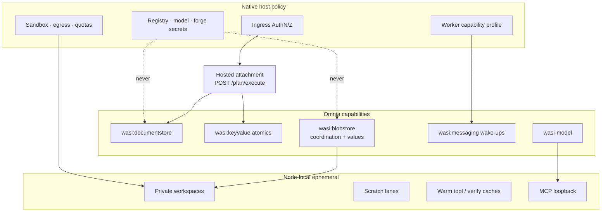

# RFC-101: Platform Readiness

> Status: **Parked.** Reopen only after RFC-100 is activated by a real multi-node deployment or a contracted client requirement demands hosted tenancy, authenticated fleet ingress, or sealed shared audit storage. Small desktop projections such as OpenTelemetry export do not by themselves activate this RFC.
>
> Owns: the gap taxonomy between today's desktop-shaped deployment and a multi-tenant hosted fleet; the four storage/locality classes every host concern must land in; adapter and change-home readiness; worker capability profiles; hosted bindings for model, secret, [RFC-93](rfc-93-operator-boundary.md) operator-grant, and ingress policy; authenticated/sealed audit storage; fleet integration of [RM-30](roadmap.md#rm-30-journal-opentelemetry-projection); multi-tenancy of deployment roots; and the landing sequence that makes RFC-100's distributed contract operable without inventing a second Emery.
>
> Does not own: workflow lifecycle, claim/ownership/convergence semantics ([RFC-100](rfc-100-distributed-execution.md)), native verification profiles ([RFC-97](rfc-97-native-verification.md)), forge publication providers ([roadmap.md](roadmap.md) RM-17), or scheduling heuristics beyond the minimum needed for capability-scoped claims.
>
> Depends on completed [RFC-100](rfc-100-distributed-execution.md). [RFC-97](rfc-97-native-verification.md) joins the sequence where native toolchain attestation becomes a worker capability.
>
> Runtime dependency: Omnia backend conformance named by RFC-100 D10 (create-only documentstore, native keyvalue compare-exchange, digest-safe blobstore namespaces, durable HTTP-trigger supervision). Where a required guarantee is missing, improve the Omnia capability rather than add an Emery-specific transport API.

## Intent

*Make the desktop the degenerate hosted deployment — same binary, same guests, same lifecycle — by retiring every `$HOME`-shaped authority that a fleet cannot share.*

Emery already runs as one Omnia runtime with an embedded engine guest ([architecture.md](architecture.md)). Snapshots already speak `wasi:blobstore` locally. RFC-100 distributes facts, claims, and values without a shared filesystem. What remains is the host surface that still assumes one operator machine: adapter install under `$EMERY_HOME`, bare-name local-first resolution, a writable project preopen as the change home, process-local MCP and Cursor model credentials, homogeneous toolchains, and a single-tenant home for store / cache / snapshots / workspaces.

This RFC does not redefine execution. It classifies every remaining host concern, decides which Omnia capability or host-policy surface owns it, and sequences the work so a hosted attachment can claim, materialize, build, verify, and resume without reading the operator's laptop.

## Gap taxonomy

Every desktop assumption maps to exactly one class:

| Class | Role | Crosses nodes as | Examples today |
| ----- | ---- | ---------------- | -------------- |
| **Value** | Self-certifying immutable bytes | Content digest | Snapshot objects (already `wasi:blobstore`); adapter component bytes + digest sidecars; verification attestations (RFC-97) |
| **Coordination** | Authority-bearing linearizable state | Hosted CAS / ordered docs | Authenticated writer events and audit checkpoints; slice ownership; operation claims; resolved adapter locks for a fleet execute |
| **Node-local ephemeral** | Disposable execution machinery | Never | Private workspaces; scratch lanes; warm toolchain / verification-lineage caches; MCP loopback; `guest.lock` stand-ins |
| **Host policy** | Credentials, tenancy, sandbox, ingress | Never enters guests or change homes; only policy identities/digests enter facts | GHCR / model / forge identities; policy bundle; operator grants; profile→command maps; network allowlists; HTTP AuthN/Z; tenant root isolation |

Correctness fails when (3) or (4) leaks into authority, or when (1) is treated as node-local mutable state. Desktop convenience (bare-name newest-local, `$EMERY_HOME` as the universe) is legal only as a degenerate binding of these classes onto one filesystem backend.



## Existing contracts this RFC preserves

- One binary, guest-selected behaviour; deployment differences live in providers and the launcher ([architecture.md](architecture.md)).
- Per-writer facts and projected status ([RFC-86](rfc-86-change-facts.md)); private `prepare` / `capture` / `discard` ([RFC-87](rfc-87-working-trees.md)).
- Claim-based placement, coordination/value split, hosted attach/resume ([RFC-100](rfc-100-distributed-execution.md)).
- Adapters remain locally resolved on the claiming node; live workspace paths, WIT resources, and filesystem mounts never cross the wire.
- Backend endpoints, credentials, bucket names, and tenant roots remain native host policy.

## Decisions

### D1 — Four classes, no fifth

Every host concern lands in Value, Coordination, Node-local ephemeral, or Host policy. A design that needs a shared mutable filesystem, ambient process environment as workflow authority, or credentials inside `.emery/` is rejected. Desktop `$EMERY_HOME` is a single-node binding of all four classes onto one directory tree — not a fifth abstraction to preserve in the cloud.

### D2 — Adapter bytes are values; adapter settlement is coordination

Adapter `.wasm` bytes and their digest/OCI provenance sidecars move to a `wasi:blobstore` values namespace (filesystem backend on desktop; object store or equivalent in the fleet). Admission stays verify-on-read.

Version settlement is not a local `readdir` of `$EMERY_HOME/store`. In fleet mode:

- pinned `emery:<name>@<semver>` package refs are the default reproducibility path;
- an execute epoch may carry a **resolved adapter lock** — the exact `(axis, name, version, content digest)` set admitted for that authorization — published on the coordination plane before offers that require those guests;
- bare-name local-first / newest-installed remains desktop-only convenience and is refused for hosted attachments.

Custom / seeded components (`adapter add`) become a tenant-scoped value admission with host policy (signature or digest allowlist). They never silently shadow a fleet lock.

### D3 — Change homes are host-allocated; journals are not files

Hosted ingress allocates the change home server-side (RFC-100 D9). The operator never supplies a client-local path that is meaningful only on their machine.

Writer events use `wasi:documentstore` as RFC-100 requires. Local `.emery/events/<writer>.jsonl` remains the desktop backend binding of that contract, not the cloud shape. Process-exclusive markers such as `guest.lock` become lease/claim fencing on the coordination plane; they are not ported as create-exclusive files across attachments.

Hosted writer append is authenticated to a workload or operator identity and returns an immutable storage receipt. The coordination backend periodically seals each writer's ordered prefix and the projected union frontier into a signed or host-attested checkpoint. Events retain RFC-86's semantic shape; the envelope and checkpoint provide tamper evidence without making a signature part of lifecycle projection. Desktop JSONL remains honestly unattested unless bound to an equivalent local sealing provider.

Scratch lanes stay node-local ephemeral with aggressive GC and zero authority.

### D4 — Objects may be remote; materialization stays node-local

Snapshot and adapter objects may live in a shared blobstore. `prepare` still materializes a private workspace on the claiming node (RFC-87). Fleet readiness therefore owns:

- closure fetch with digest verify-on-read and locality/caching;
- separation of **node-local workspace GC** from **shared object GC** rooted by live claims, open attachments, and unpublished CIDs;
- transfer economics behind the value capability (central store and optional peer verified streaming), without changing guest contracts.

`emery:exec-mode` remains required wherever native tools execute inside a materialized tree (RFC-97). Blobstore does not replace a materialization root.

### D5 — Workers advertise capability profiles; offers are capability-scoped

A worker joins the fleet with a host-declared **capability profile**: platforms, toolchains, RFC-97 verification profiles, resource class, and egress class. Operation offers announce only on matching capability topics (RFC-100 D7). A node that cannot satisfy the profile must not claim; preflight `unavailable` (RFC-97) is a scheduling signal before model spend, not a late surprise.

Homogeneous “this laptop can do Vectis iOS and Omnia” is the desktop degenerate case of one profile that happens to include everything installed.

### D6 — Model, MCP, and secrets are host policy

The shipped `WasiModel: Cursor` binding and process-local `HTTP_ADDR` MCP loopback are desktop bindings. Hosted deployments bind a credentialed, quota-aware model backend and host-mediated reference/MCP grants. Guests see typed `wasi-model` and adapter interfaces only.

Three secret classes stay host-only and never enter change homes, events, or adapter stdout retained as authority:

| Class | Desktop today | Fleet binding |
| ----- | ------------- | ------------- |
| Adapter registry | operator / anonymous GHCR pull | workload identity, optional mirror, air-gap allowlist |
| Model provider | `CURSOR_API_KEY` / agent session | per-tenant credentials, budget envelopes, cancellation |
| Forge | operator git credentials | app install / scoped tokens for discovery and RFC-95 publication |

Source material that is not yet in the value plane (private repos, large binaries, design assets) enters through an authorized host ingest that produces digest-named objects.

### D7 — Operator ingress authenticates and authorizes before dispatch

CLI process lifetime remains a valid interactive attachment. Hosted attachments use authenticated HTTP control: submit, status, event follow, graceful detach, and the non-interactive form of every confirmation gate (`--force`, ownership recovery, amendment apply). AuthN/Z binds the hosted principal to RFC-93's operator grant over exact act, tenant, product, target, change, expiry, and any external-approval requirement before guest dispatch. The resolved actor and grant records enter invocation context and resulting facts; credentials and policy bodies do not. Skills and Cursor plugins stay an IDE distribution surface; they are not the hosted control plane.

### D8 — Multi-tenancy splits the former `EMERY_HOME`

Today one home holds `store/`, `cache/`, `snapshots/`, and `workspaces/`. Fleet deployments isolate at least:

- **tenant / org** — adapter admission policy, secrets, quotas;
- **change / attachment** — managed change home and coordination session;
- **node ephemeral** — workspaces, scratch, warm caches.

Shared value namespaces may serve many tenants only when object names are digest-keyed and access is host-enforced. A cache hit never crosses a tenant allowlist.

### D9 — Scheduling policy stays outside workflow authority

RFC-100's first-claim-wins with capability topics remains the execution contract. Product-level fair-share, priority, sticky warm-cache placement, and hard spend caps are host/scheduler policy. They may influence which eligible node claims first; they must not alter ownership generations, result digests, or lifecycle projection. Telemetry (judgment vs claim-wait vs transfer vs publish latency; model route and cost when reported) stays observational per RFC-100 evaluation and RFC-97 D9.

### D10 — Omnia conformance gates fleet mode

A deployment may open a distributed session only when its bound documentstore, keyvalue, and blobstore backends prove the RFC-100 D10 contract. Lossy, racy, or process-local development defaults remain desktop-only. Messaging stays wake-up-weak. This RFC tracks the Emery-side refusal and the desktop↔fleet matrix; Omnia owns the backend implementations.

### D11 — Audit export is a projection, not another authority

The hosted journal may project facts and operation timings into OpenTelemetry spans, events, and metrics for enterprise observability. Projection is asynchronous and failure-tolerant: exporter loss, sampling, backpressure, or retention never changes a fact, claim, gate, or lifecycle result.

The projection uses bounded-cardinality operation, adapter, target, profile, actor-class, and outcome attributes. Digests are links or sampled event attributes rather than metric labels. Prompts, source bodies, protected corpus data, credentials, continuations, raw tool output, and free-form reasons are excluded by default; a deployment may export message content only under an explicit redaction and retention policy to a customer-controlled collector.

OpenTelemetry answers operational questions. Authenticated documentstore events and their sealed checkpoints remain the semantic and tamper-evident audit record.

## Sequencing

Delivery order after the RFC-86…RFC-91 stem. Steps may staff in parallel where noted; acceptance of a later step must not redefine an earlier contract.

```text
RFC-86…RFC-91     (landed stem)
RFC-88, 95, 96    (local product + scale — in flight)
RFC-100           (distributed contract)
       │
       ▼
RFC-101 Phase A ──► Phase B ──► Phase C ──► Phase D ──► Phase E
       │              │           │           │           │
       │              │           │           │           └─ multi-tenant ops
       │              │           │           └─ model · secrets · ingress
       │              │           └─ worker capabilities · RFC-97 join
       │              └─ adapter values + fleet locks
       └─ Omnia conformance · change-home / journal bindings
```

| Phase | Name | Delivers | Depends on | Parallel with |
| ----- | ---- | -------- | ---------- | ------------- |
| **A** | Conformance & homes | Refuse non-conforming backends for `--distributed` / hosted execute; host-allocated change homes; documentstore-backed writer log binding; replace `guest.lock` exclusivity with coordination-plane fencing for hosted attachments | RFC-100 contract; Omnia backend work | RFC-88/95 completion |
| **B** | Adapter values & locks | Adapter store/cache as blobstore values; verify-on-read admission on every worker; fleet resolved-adapter lock on the execute epoch; bare-name newest-local confined to desktop; tenant-scoped custom component admission | Phase A; existing launcher install/digest path | RFC-95 |
| **C** | Worker capabilities | Host capability profiles; capability-scoped offer topics as the only fleet placement path; materialization/fetch SLOs; workspace vs shared-object GC split; RFC-97 profile preflight as claim eligibility | Phase B; RFC-97 profile registry (may land stub `unavailable` first) | RFC-97 implementation |
| **D** | Hosted judgment & ingress | Non-Cursor model backend binding with quotas; host-mediated MCP/reference grants; hosted RFC-93 AuthN/Z binding on submit/status/follow/detach; non-interactive confirmation gates; secret classes host-only | Phase A (ingress), Phase C (for verify-backed builds) | RM-17 forge providers |
| **E** | Tenancy & operations | Tenant/org isolation of policy and caches; authenticated writer receipts and sealed audit checkpoints; attachment/change quotas; fleet binding of RM-30 OpenTelemetry projection; eval matrix: desktop degenerate ≡ two-node ≡ hosted attachment on the same fixtures | Phases A–D | Roadmap evidence triggers |

### Staffing sketch

| Track | Owner | Sequence | Notes |
| ----- | ----- | -------- | ----- |
| Omnia backends | Platform / Omnia | A (blocker) | CAS, create-only docs, durable ordered replay — without this, Phases B–E are desktop theater |
| Launcher / locations | Emery deployment | A → B → E | Collapse `$EMERY_HOME` assumptions into class-tagged roots |
| Adapter admission | Emery deployment | B | Lock format rides execute-epoch facts; guests unchanged |
| Worker runtime | Emery + RFC-97 | C | Capability ads, materialization, sandbox |
| Control plane | Emery host | D → E | HTTP attachment, AuthN/Z, budgets |

### Explicit non-goals in the first cut

- Push placement / central scheduler inventory (rejected by RFC-100).
- Shared writable product trees or network filesystems as coordination.
- Making Cursor plugins or `/emery:*` skills the hosted API.
- Third-party adapter ecosystem operating model ([roadmap.md](roadmap.md) RM-21) — readiness here is first-party + tenant-seeded components only.
- Changing artifact authority, slice lifecycle, or repair budgets.

## Implementation requirements

### Phase A

- Gate distributed/hosted session open on backend conformance probes; emit typed refusal naming the failed guarantee.
- Host-allocate managed change homes for HTTP execute; keep CLI `--project-dir` as the interactive binding of the same operation.
- Bind writer append/read to `wasi:documentstore` with the desktop filesystem log as one backend; projection remains the RFC-86 union.
- Retire process-file exclusivity for hosted multi-attachment; use claim/lease fencing.

### Phase B

- Store adapter components and digest/OCI sidecars in a blobstore values namespace; filesystem under `$EMERY_HOME/store` remains the desktop backend.
- Publish a resolved adapter lock with `plan.execute.started` (or an immediately subordinate coordination record) for fleet executes; workers admit only lock digests.
- Refuse bare-name newest-local settlement when the attachment is hosted/distributed.
- Keep pull-on-miss and verify-on-read as host resolver behaviour; guests still dispatch by routed id.

### Phase C

- Define the host capability-profile record and its topic encoding; require it on worker start.
- Implement closure fetch + verify + prepare path metrics; separate ephemeral workspace GC from shared object sweep roots.
- Integrate RFC-97 preflight: missing toolchain/profile → typed `unavailable`, no claim (or immediate claim release) before judgment spend.

### Phase D

- Bind at least one non-interactive model backend suitable for fleet credentials.
- Mediate MCP/reference URLs so guests never observe another tenant's network topology.
- Authenticate attachment control; map every interactive confirmation to an explicit API/CLI flag already used in automation.
- Bind authenticated hosted principals to RFC-93 operator grants before dispatch; reject missing, malformed, expired, or insufficient grants and carry only actor/grant records into facts.
- Document the three secret classes and enforce “never in journal / change home / guest env” in integration tests.

### Phase E

- Introduce tenant keys in host policy and cache admission; prove cross-tenant cache negative tests.
- Authenticate writer append, retain immutable storage receipts, and seal ordered writer prefixes plus union frontiers under deployment identity.
- Retain RFC-100/97 latency and usage projections with redaction; add bounded-cardinality OpenTelemetry export whose failure has no workflow effect.
- Ship a readiness matrix job: same fixtures on desktop, two-node distributed, and hosted attachment — equal target-wave CIDs and slice statuses given equal accepted facts.

## Acceptance criteria

1. A hosted `POST /plan/execute` against a conforming backend set attaches, resumes on a second node into a server-allocated empty home, and produces the same projected slice statuses as a desktop `emery plan execute --distributed` on the same authored inputs — without any client-local path, `$HOME` adapter store, or Cursor session on the workers.
2. Fleet execute admits adapters only by pin or published resolved lock; two workers cannot settle different bytes for the same locked identity; digest mismatch fails closed.
3. Bare-name newest-local still works on a single-node desktop binding and is refused for hosted attachments.
4. Writer events survive process loss through documentstore replay; no hosted path depends on `.jsonl` files or `guest.lock` on a particular node.
5. A Vectis-class offer requiring an iOS toolchain is claimable only by a worker whose capability profile includes that toolchain; others never win the claim.
6. Model and registry credentials never appear in journals, change homes, offers, or adapter-visible environment; integration tests fail the build if they do.
7. Shared object GC never deletes a CID still referenced by a live claim, open attachment, or unreaped coordination record; node workspace GC never deletes another node's materialization.
8. Non-conforming Omnia backends cannot open a fleet session; desktop filesystem backends continue to satisfy the degenerate single-node case.
9. Phases A–E each have a crate-level or deployment integration fixture named in the readiness matrix; `cargo make ci` stays green in every touched repository.
10. A caller whose operator grant excludes the verb, tenant, product, target, change, or required external approval is refused before guest dispatch; no guest-visible declaration can widen the grant.
11. Editing or deleting a hosted event beneath a sealed checkpoint is detectable, and every projected actor attestation names the host identity that authenticated the append. Desktop logs without a sealing provider remain explicitly unattested.
12. OpenTelemetry exporter loss, backpressure, or sampling changes no journal projection or lifecycle result; default export contains no prompts, source bodies, protected corpus data, credentials, continuations, raw tool output, or free-form reasons.

## Relationship to other RFCs

| Document | Boundary |
| -------- | -------- |
| [platform.md](platform.md) / active RFC programme | Product, evidence, and scale semantics; this RFC makes the parked host/fleet option operable |
| [RFC-100](rfc-100-distributed-execution.md) | Owns claims, fencing, attach/resume, coordination/value split — readiness implements host bindings and conformance gates |
| [RFC-97](rfc-97-native-verification.md) | Owns profile execution and attestations — readiness places them on capability-scoped workers and attestation value transport |
| [RFC-93](rfc-93-operator-boundary.md) | Owns actor/grant contracts and desktop enforcement — readiness binds authenticated hosted principals |
| [architecture.md](architecture.md) | Standing Omnia boundary — readiness is how desktop→cloud stays a backend swap |
| [roadmap.md](roadmap.md) RM-17 / RM-21 / RM-30 | Forge providers, third-party adapter ecosystem, and desktop OTel projection — triggered separately |

## Rejected alternatives

- **“Just put `$EMERY_HOME` on a network volume.”** Couples failure domains, invites shared-writable authority, and fights RFC-87/96's snapshot model.
- **Central adapter push into every worker image.** Useful as a cache hint; cannot replace digest-locked admission or verify-on-read.
- **Fleet-wide bare-name newest.** Nondeterministic across workers; breaks epoch reproducibility.
- **Emery-specific distributed filesystem or custom RPC bus.** Violates the Omnia capability rule already set by RFC-100 D1/D10.
- **Scheduler as workflow authority.** Placement may be biased by host policy; ownership, digests, and lifecycle stay with facts and claims.
