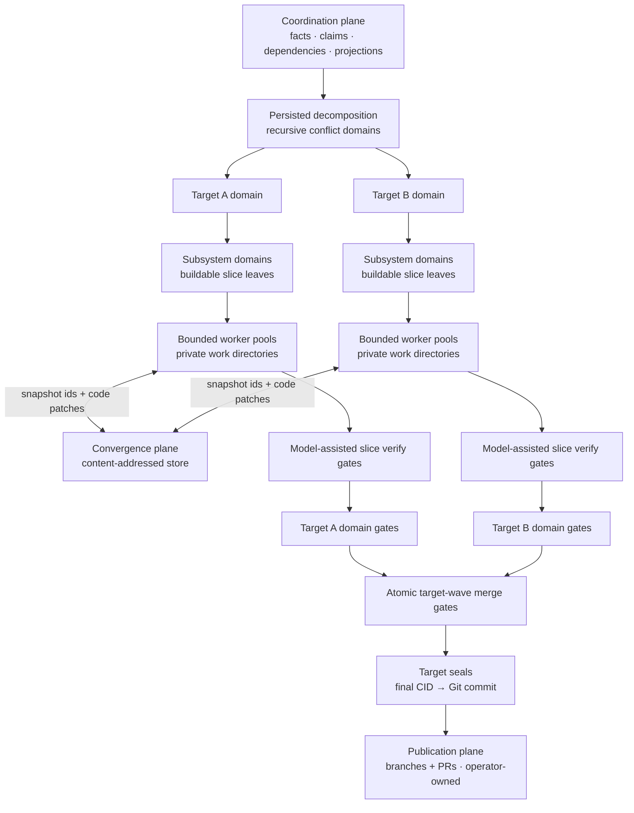

# Next Stage: Platform-Scale Migration

> Status: Planning spine for the RFC-86…RFC-92 series — each RFC owns its own decisions; this document owns the sequence and the fit. RFC numbers follow implementation order.
>
> Audience: contributors starting work on the series; operators evaluating what Emery is becoming

## The vision

Point Emery at a legacy system — a mobile app, a realtime platform, any estate of repositories that together comprise one product — and have it migrate that system: discover the repositories, profile them, survey every source, recursively decompose the result into bounded conflict domains, and execute the buildable leaves with a **swarm of concurrent agents** working across **multiple repositories** on **multiple nodes**, converging on verified, published changes.

Then keep changing that platform the same way, from a disposable change directory — prior context intentionally thin (forge authentication and organisation plus source material), creating member repositories when the change needs ones that do not exist yet.

Concretely, the exemplar workload is a migration the size of AT's mobile app or AT's realtime platform: tens of repositories, hundreds of slices, weeks of wall-clock — infeasible as today's serial, single-repo, operator-tended loop, and exactly what the series below makes routine.

And do all of it with one Emery: the same binary, verbs, artifacts, and lifecycle on a single desktop and across a multi-node fleet — the engine guest is location-neutral by construction (a Wasm component whose deployment differences live in providers and the launcher), and [RFC-86](rfc-86-change-facts.md) makes the workflow state location-neutral to match. A desktop is the deployment with one actor and no remote, not a separate mode.

Everything Emery already is stays load-bearing: the slice loop (`refine → build → merge`), artifact authority, the journal's closed event taxonomy as the audit trail, adapter seams over WIT, operator-owned publication. The series scales those invariants out; it does not replace them.

## Where we are

Today one change runs in one repository (or a hand-tended workspace of them), serially: one model call at a time, one working tree the operator prepared, verify as prompt text inside the agent loop, publication tracked in the operator's head. The measured walls (RFC-78's `wasm-omnia-r9k` runs): a ~30-minute serialized build with an unobservable nested review team, an 11–54 minute synthesis call, and no way to run two of anything at once.

## Target architecture

The architecture makes five related shifts:

1. **State becomes facts.** A change is a self-contained, version-control-neutral fact tree. Workflow status is projected from those facts, so a hosted service never becomes lifecycle authority.
2. **Trees become values.** Every operation starts from an immutable snapshot in a private workspace and captures another snapshot. A code patch is the relation between the two; no shared working directory crosses an operation.
3. **Location becomes disposable.** Plan authoring can begin in an empty directory, discover the participating repositories, and record their exact revisions. Execution creates private workspaces on demand. Archive leaves only merged baselines and forge history.
4. **Build repair becomes engine-owned.** Generation, model-assisted verification, repair, and review become separate target WIT operations in a bounded engine loop rather than retries hidden in adapter prose. Deterministic native verification follows when WASI can execute host toolchains safely.
5. **Model work becomes explicit.** Plan authoring surveys the pinned source set and recursively partitions it until every terminal scope is a buildable slice. During the singular slice build, `target.decompose` proposes one complete task graph and the engine validates it before dispatch.

### Scaling invariant

Emery scales by repeating one bounded pattern:

1. start from immutable inputs;
2. partition a scope into children;
3. run independent children concurrently;
4. converge their results before leaving the parent scope.

A **conflict domain** is one such parent scope: child results may interact inside it, so the domain owns their dependency graph, ownership envelope, concurrency bound, and local convergence gate. A domain either partitions again or terminates as one buildable slice. Inside that slice, one target-provided `decompose` operation proposes a complete graph of path-owned agent tasks for engine validation and execution.

This gives Emery recursive planning and graph-shaped build execution without introducing nested workflows:

- **Planning recursion** turns the surveyed estate into conflict domains and buildable slice leaves.
- **Build decomposition** turns one slice into a complete graph of focused agent tasks through one target-provided operation, then converges them into one explicitly gated slice result.

Internal domains and agent tasks have no slice lifecycle, claim, or nested plan. They only describe containment and convergence.

#### Planning: hierarchy first, executable leaves second

Plan authoring persists the full hierarchy in `decomposition.yaml`. The executable `plan.yaml` is its deterministic leaf projection:

- `slices[]` contains exactly the terminal domains;
- domain dependencies compile into leaf `depends-on` edges;
- `decomposition-digest` binds the flat executable graph to the reviewed hierarchy.

The engine owns the loop: **partition → validate → recurse → project**. Judgment may propose a typed `split` or `leaf`, but the engine accepts a split only when it preserves source-lead coverage, reduces a deterministic scope measure, stays within depth and node budgets, and resolves sibling interaction through disjoint ownership, an explicit dependency, or a fan-in leaf. Uncertain boundaries remain review findings.

#### Execution: bounded waves, bottom-up convergence

Ready leaves run in private workspaces. Results move upward through their recorded domain ancestry:

- task results compose before passing the slice's engine-owned model-assisted verification gate;
- same-target child patches compose at their nearest domain;
- multi-target domains aggregate target results and dependency health without mixing repository trees;
- every completed gate writes an immutable domain-round record for retry or remote resume.

One target wave consumes one accepted CID and commits the next. Independent, disjoint leaves may share a wave; dependent leaves run in later waves. Shared paths become an explicit dependency or fan-in leaf—never an implicit text merge. One atomic committed fact records the complete member set and final CID, so no partial wave becomes authoritative. The one-member case is the ordinary slice merge.

A failure blocks only its domain and dependants. Runtime overlap produces an inert amendment proposal; only an operator-invoked compare-and-set may revise the decomposition and leaf projection. When a target drains, one project seal turns its final CID into a Git commit for operator-owned publication.

#### Authority: grant, claim, and input fence

Three records answer three different questions:

- `plan.execute.started` records what the operator authorized;
- a live claim records which actor owns a leaf;
- build, domain, and merge facts record the exact inputs and results consumed.

A wave manifest names its build authorization. Its committed fact separately names closed-plan commit authorization. The first cut uses one reviewed epoch for both. Keeping them separate permits a future streaming epoch to refine and build ready leaves while surveying continues, without allowing accepted-CID mutation before the resulting plan is reviewed. A claim or projected `in-progress` status never grants execution authority.




## The series

The tables list each RFC's hard dependencies and what it delivers. Step numbers are a **product-ownership / reading order** (fact substrate → workspace stem → product path, then scale), not a claim about landing chronology and not a single serial queue. [RFC-87](rfc-87-working-trees.md) has **already landed** with interim stand-ins for [RFC-86](rfc-86-change-facts.md)'s recorded pins, build records, and wave-shaped merge facts; completing RFC-86 (especially Phase B) retires those stand-ins. After the shared stem, RFC-88's recursive authoring contract and RFC-90's verification work can proceed in parallel; RFC-91 joins them for a complete local engine-orchestrated swarm, and RFC-92 distributes that settled shape — see [Working in parallel](#working-in-parallel). Every later RFC still depends only on the contracts earlier steps own, owns one deployable path, and has no acceptance criterion or phase gated on a later RFC.

Authorization for the series follows [RFC-86](rfc-86-change-facts.md) D6 / D17: starting `emery plan execute` appends `plan.execute.started` with typed coverage; there is no separate `approve` verb, no projected `approved` rung, and no silent auto-waive of gaps. Historical “running execute is the approval” / “auto-approve” wording means that execute gesture (with gap gates), not a second mint path.

### Product critical path — migrate and change a platform


| Step | RFC                                  | Title              | Delivers                                                                                                                                                                                                                                                                                       | Depends on                                      |
| ---- | ------------------------------------ | ------------------ | ---------------------------------------------------------------------------------------------------------------------------------------------------------------------------------------------------------------------------------------------------------------------------------------------- | ----------------------------------------------- |
| 1    | [RFC-86](rfc-86-change-facts.md)     | Change Facts       | The substrate: the change as a version-control-neutral fact tree, projected status, per-actor event logs, explicit execution-authorization epochs, pinned per-leaf inputs, immutable one-member target-wave commit, merge-finalized requirement identity, desktop as the degenerate deployment | —                                               |
| 2    | [RFC-87](rfc-87-working-trees.md)    | Private Workspaces | Immutable snapshots, disposable private workspaces, `prepare` / `capture` / `discard`, code patches as base/result relations, and separate writable-code/read-only-artifact access                                                                                                             | 86 pin/epoch/wave facts (landed with stand-ins) |
| 3    | [RFC-88](rfc-88-detached-changes.md) | Detached Changes   | Complete single-node migrate/change loop: generated source identities, deterministic selection, an ordinary directory as the disposable change home, GitHub discovery, capability-profile-bound conflict-domain decomposition, refinement feedback through focused child leads, a buildable leaf projection, and operation-local workspaces | completed 86; landed 87                         |
| 4    | [RFC-89](rfc-89-publication-sets.md) | Publication Sets   | Project seal: each final project snapshot becomes one local commit; publication identity binds those commits, branches, and PRs across repositories with ordered landing and archive verification                                                                                              | 88 (member derivation)                          |


### Scale track — concurrency (build orchestration separates after 87; joins recursive authoring at 91)


| Step | RFC                                      | Title                | Delivers                                                                                                                                                                                                                                                                                                               | Depends on                   |
| ---- | ---------------------------------------- | -------------------- | ---------------------------------------------------------------------------------------------------------------------------------------------------------------------------------------------------------------------------------------------------------------------------------------------------------------------- | ---------------------------- |
| 5    | [RFC-90](rfc-90-build-verification.md)   | Build Verification   | Engine-owned build loop over separate `build` / `repair` / `verify` / `review` WIT ops; bounded repair policy; durable intermediate reports; final report assembly; deterministic native verification explicitly deferred                                                                                                  | completed 87                 |
| 6    | [RFC-91](rfc-91-concurrent-execution.md) | Concurrent Execution | Complete single-node engine-orchestrated swarm: profile-sized target tasks, at most one target decomposition per slice attempt (model-assisted for Omnia), engine-owned graph validation and execution, write ownership, local pool, concurrent leaf scheduling and refinement feedback, deterministic code-patch composition, durable domain rounds, bottom-up convergence, multi-member target waves, and synthesis payload restructuring | completed 86, 87, 88, 90     |
| 7    | [RFC-92](rfc-92-node-sync.md)            | Node Sync            | Distribution of the completed RFC-91 model: fact, artifact, and value transport between nodes; fenced claims; hosted trees; and remote pools — no new scheduler, convergence, acceptance, authority, or lifecycle semantics                                                                                            | completed 86, 87, 88, 90, 91 |


Sequencing notes:

- **RFC-86 is product-ownership step 1** — the fact substrate every later step consumes (projected status, per-actor logs, `plan.execute.started`, recorded pins, one-member waves). Completing it deletes the mechanics later steps would otherwise have to synchronize (stored status, the single journal file, synthesis-time identity, unrecorded execute starts) and delivers the shift-left refine / gap-gate flow.
- **RFC-87 is the shared workspace stem and has already landed** with interim stand-ins (build-time base self-freeze, slice-local `build/patch.yaml`, merge-time `apply`). Private workspaces do **not** wait on “completed 86”; RFC-86 Phase B retires the freeze / `patch.yaml` stand-ins against the landed `SnapshotId` / `prepare` / `capture` / `discard` contract. Do not re-litigate whether workspaces “depend on finished 86.”
- **After the stem, the series is a braid, not two independent pipelines:** RFC-88 settles recursive authoring while RFC-90 settles engine-owned build verification and repair orchestration; RFC-89 may follow 88 independently, while **RFC-91 joins 88 and 90** to make the recursive shape concurrent on one node. RFC-92 then distributes that completed local model. RFC-89 (publication) and RFC-92 (multi-node execution) remain orthogonal — 92 does not wait on 89.

```text
RFC-86  (fact substrate — product ownership step 1; landing)
   ↕    stand-in seam: 87 landed; 86 Phase B retires freeze / patch.yaml
RFC-87  (workspace stem — landed; both tracks need it)
   │
   ├─────────────────────┐
   ▼                     ▼
RFC-88 → RFC-89          RFC-90
   │                       │
   └────────► RFC-91 ◄─────┘
                  │
                  ▼
                RFC-92
```

## Working in parallel

Product-ownership edges stay as the tables and diagram above; landing chronology already split the stem (87 ahead of 86). Both product authoring and verification need the workspace stem; after it, RFC-88 and RFC-90 can proceed in parallel. RFC-91 starts only when RFC-88's decomposition artifacts and RFC-90's gate are stable, because its completion fixture exercises both.

**Staffing after the stem.** RFC-87's workspace contract is already stable enough for the fan-out:


| Track                      | Owner          | Sequence | Notes                                                                                                     |
| -------------------------- | -------------- | -------- | --------------------------------------------------------------------------------------------------------- |
| Location / product         | Team A         | 88 → 89  | Detached change home, recursive decomposition, leaf/member bindings, then project seal / publication sets |
| Verification               | Team B         | 90       | Staged build WIT contract, engine phase machine, and prompt-loop removal, parallel with RFC-88             |
| Concurrency / distribution | Team C (later) | 91 → 92  | Start 91 when **both** 88 and 90 are complete; distribute only the completed local recursive model        |


**RFC-86 ∥ RFC-87 — narrowing the stem.** The code coupling was always narrower than “completed 86 before any 87 work,” and landing confirmed it: 87 shipped with stand-ins while 86 continues. RFC-86 lives in the state layer: `crates/project/src/journal.rs` (single file → per-actor logs), the status ladders in `crates/project/src/plan/model/state.rs` and `crates/project/src/slice/lifecycle.rs` (deleted in favour of the projection kernel), `IdAllocator` in `crates/slice/src/synthesis/project.rs`, and the execute-start / claim surfaces in `crates/change`. RFC-87 lives in the tree/value layer: `prepare` / `capture` / `discard`, private workspaces, and a snapshot store (replacing the former `WorkingTree::live()` dispatch sites). The tracks meet at exactly two seams:

1. **Snapshot and result identity** — RFC-86 records snapshot pins and result facts; RFC-87 consumes the pins and returns `{ base snapshot, result snapshot, touched paths }`.
2. **Pin authorship timing** — source snapshots close at plan authoring or detached discovery; refine adds the baseline digest; build reads a recorded target-base pin before `prepare` (today’s interim freeze-at-build is the stand-in RFC-86 Phase B retires).

**Within RFC-86**, Phase A (per-actor logs, projection kernel, claim/retraction facts) is journal-and-plan territory in `crates/project`; Phase B's identity work (slice-scoped requirement ids, `MODIFIED` base digests, merge-time finalization) plus stand-in retirement (recorded pins, fact-substrate build records, one-member waves) is synthesis-and-merge-engine territory in `crates/slice`; the one shared contract is the merge / wave fact that records the identity map. Phase C (`plan.execute.started`, gap gate, multi-actor) sits on top of A.

**Slack absorbers** — real work with no ordering constraint on the critical edge: RFC-90's `build` / `repair` / `verify` / `review` WIT types, phase-report persistence, engine phase machine, and adapter prompt split (buildable against a plain directory before 87's disposable workspaces land; the vertical cut still waits on 87); RFC-86's multi-actor fixtures in `crates/mock` (two actors, disjoint slices, merged change trees, claim-conflict and base-drift injections); RFC-89's record design (its implementation genuinely needs RFC-88's member bindings).

**Collision points** — sequence explicitly, don't parallelize: the merge orchestration (`crates/slice/src/orchestrate/merge/` — RFC-86 adds identity finalization and the wave/merge fact over the landed workspace tree; rebase as Phase B lands), and RFC-88 itself — the convergence point needing the fact tree as the change home *and* operation-local workspaces.

## Two operator jobs, one loop

Both jobs run the same three-command loop once the critical path lands; they differ only in `plan author` scope. **Migrate** criteria fingerprint shallow source trees through RFC-88's exact-one source selector and propose bindings onto discovered targets (new forge repos are operator-created with `product:` so discovery can see them). **Change** criteria survey the organisation for repositories whose `.emery/project.yaml` declares `product:` membership ids (the build set is `platforms:`, not the membership key).

```text
emery plan author     →  initialize the detached home when needed; discover and pin
                         targets/sources; recursively decompose surveyed leads;
                         project buildable leaves into plan.yaml
emery plan execute    →  append plan.execute.started (sole authorization gesture);
                         enforce gap/status gates before build (explicit --waive only);
                         prepare private workspaces on demand (RFC-87); execute leaves;
                         commit target waves (RFC-88);
                         converge domains and extend waves across ready leaves (RFC-91);
                         seal each drained target's final CID (RFC-89)
operator publishes    →  push sealed branches; open and merge PRs
emery plan archive    →  verify the publication set (RFC-89); archive
rm -rf <dir>
```

Starting execute is the operator authorization gesture ([RFC-86](rfc-86-change-facts.md) D6): it records `plan.execute.started` with typed coverage. There is no separate `approve` verb and no interactive auto-waive of gaps (D17). Once the scale track lands, execute gains concurrent build tasks, concurrent plan entries, and multi-node execution — same loop, higher throughput. Shift-left refinement distributes the same way: separate operators or nodes refine claimed slices against the same pinned bases and exchange facts through RFC-92's coordination plane.

## Outside the series

Unchanged and orthogonal — not part of this arc, not blocked by it:

- **[RFC-71 Self-Assembling Wasm Deployment](rfc-71-deployment.md)** — largely landed; Stage 2 diagnostics remain draft.
- **[RFC-77 Release Process](rfc-77-release-process.md)** — operational policy for releasing Emery itself; its WIT-breaking shape becomes RFC-89's first in-house publication set.
- **[RFC-18 Specialized SLM Code Generation](future/rfc-18-slm.md)** (future) — an optional cost lever behind RFC-91's per-task model-selection hook; a ratchet rung, not a stage.
- **[RFC-46a Web Asset Materialization](future/rfc-46a-web-asset.md)** (future) — content-triggered vectis work, independent of this series.

Known external reference: `augentic/remedium` RFC-81 cites "RFC-82" for what is now RFC-89's publication-set record; update that citation when next touching that repo.