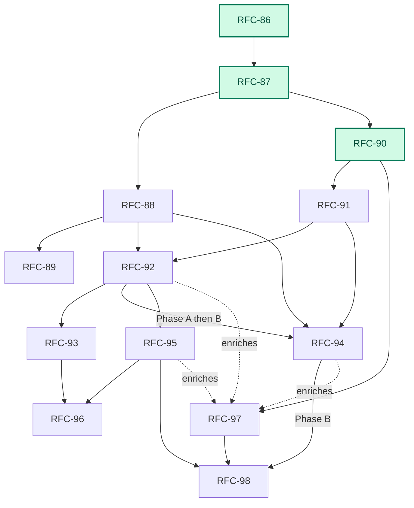

# Platform-Scale Migration

> Status: Planning spine for the RFC-86…RFC-94 platform series and the post-series verification, fleet, learning, and autonomy tracks ([RFC-95](rfc-95-native-verification.md) through [RFC-98](rfc-98-policy-gated-autonomy.md)). Each RFC owns its decisions; this document owns sequence and fit.
>
> Audience: contributors starting work on the series; operators evaluating what Emery is becoming

## The vision

Point Emery at a legacy system — a mobile app, a realtime platform, any estate of repositories that together comprise one product — and have it migrate that system: discover the repositories, profile them, survey every source, recursively decompose the result into bounded conflict domains, and execute the buildable leaves with a **swarm of concurrent agents** working across **multiple repositories** on **multiple nodes**, converging on verified, published changes.

Then keep changing that platform the same way, from a disposable change directory. Operators choose policy rather than another workflow: pause after topology, progressively refine while discovery continues, produce an unattended verified candidate, or authorize a fully policy-gated merge.

Do all of it with one Emery: the same binary, verbs, artifacts, and lifecycle on a single desktop and across a multi-node fleet. A desktop is the deployment with one journal writer and no remote, not a separate mode.

## Where we are

**Implemented:** RFC-86 (Change Facts), RFC-87 (Private Workspaces), RFC-90 (Build Verification), and RFC-91 (Refinement Stage). The engine now runs a fact-based workflow over private workspaces with an engine-owned build phase machine and a standalone refinement stage between plan authoring and execution.

**Remaining:** Product detach (RFC-88/89), progressive refinement (RFC-94 Phase A), concurrent candidate execution (RFC-92/94 Phase B), trustworthy verification (RFC-95), and governed learning/autonomy (RFC-97/98).

### Dependency map




## Target architecture

The architecture makes eight shifts to enable platform scale:

1. **State becomes facts.** A change is a self-contained, version-control-neutral fact tree.
2. **Trees become values.** Every operation starts from an immutable snapshot in a private workspace and captures another snapshot. No shared working directory crosses an operation.
3. **Location becomes disposable.** Plan authoring discovers and pins participating repositories; execution creates private workspaces on demand. Archive leaves only merged baselines and forge history.
4. **Build repair becomes engine-owned.** Generation, verification, repair, and review are separate target WIT operations in a bounded engine loop.
5. **Model work becomes explicit.** Plan authoring recursively partitions the scope until every leaf is buildable. During the build, targets propose a complete task graph for the engine to validate.
6. **Refinement becomes a fenced stage.** Serial plan-wide refinement covers reviewable bundles, moving to concurrent work items and frontiers.
7. **Progress is a policy, not a new workflow.** Branches are published and progressively refined, optionally building non-authoritative candidate frontiers. Unattended build uses exact policy admission.
8. **Learning is offline and versioned.** Retained outcomes become inert proposals and promoted future versions. In-flight work never rewrites its own instructions.


### Scaling invariant

Emery scales by repeating one bounded pattern:

1. Start from immutable inputs.
2. Partition a scope into children.
3. Run independent children concurrently.
4. Converge their results before leaving the parent scope.

A **conflict domain** owns the dependency graph, concurrency bound, and local convergence gate for its children. It either partitions again or terminates as one buildable **slice**. Internal domains and agent tasks have no slice lifecycle; they only describe containment and convergence.

### Authority and records

Six records answer different questions to decouple state from lifecycle:

- `plan.execute.started`: Records exact closed-plan authorization.
- `plan.run.started`: Records a progressive run's scope, bound, and policy.
- **Member admission**: Records the exact refinement and gap state allowed to build.
- **Live claim**: Records which journal writer owns a leaf.
- **Build and domain facts**: Record the exact inputs and results consumed.
- **Commit admission**: Records why one closed wave may advance the accepted CID.


## The series

These tables list each RFC's hard dependencies and deliverables. Step numbers indicate a logical reading/product order, not a strict chronological queue.

### Product critical path — migrate and change a platform


| Step | RFC                                  | Title              | Delivers                                                                                      | Depends on |
| ---- | ------------------------------------ | ------------------ | --------------------------------------------------------------------------------------------- | ---------- |
| 1    | [RFC-86](rfc-86-change-facts.md)     | Change Facts       | **Implemented:** Fact substrate, per-writer logs, pinned inputs.                              | —          |
| 2    | [RFC-87](rfc-87-working-trees.md)    | Private Workspaces | **Implemented:** Immutable snapshots, private workspaces.                                     | 86         |
| 3    | [RFC-88](rfc-88-detached-changes.md) | Detached Changes   | Complete single-node loop, detached home, recursive decomposition, buildable leaf projection. | 87         |
| 4    | [RFC-89](rfc-89-publication-sets.md) | Publication Sets   | Project seal, publication identity across repositories with ordered landing.                  | 88         |


### Scale track — staged and concurrent execution


| Step | RFC                                            | Title                 | Delivers                                                                                       | Depends on            |
| ---- | ---------------------------------------------- | --------------------- | ---------------------------------------------------------------------------------------------- | --------------------- |
| 5    | [RFC-90](rfc-90-build-verification.md)         | Build Verification    | **Implemented:** Engine-owned build loop, bounded repair policy, durable reports.              | 87                    |
| 6    | [RFC-91](rfc-91-refinement-stage.md)           | Refinement Stage      | **Implemented:** Serial plan-wide refinement (`plan refine`), reviewable refinement manifests, wave-time target bases, execute-time coverage. | 90                    |
| 7    | [RFC-92](rfc-92-concurrent-execution.md)       | Concurrent Execution  | Work item scheduling, concurrent frontiers, bottom-up convergence, multi-member target waves.  | 88, 91                |
| 8    | [RFC-93](rfc-93-distributed-execution.md)      | Distributed Execution | Distribution of completed RFC-92 model between nodes via operation offers and remote pools.    | 92                    |
| 9    | [RFC-94](future/rfc-94-streaming-execution.md) | Streaming Execution   | Phase A: publish/refine closed branches. Phase B: unattended candidate build, deferred commit. | A: 88, 91, 92A B: 92B |


### Verification, learning, and autonomy follow-ons


| RFC                                       | Title                        | Delivers                                                                | Depends on                  |
| ----------------------------------------- | ---------------------------- | ----------------------------------------------------------------------- | --------------------------- |
| [RFC-95](rfc-95-native-verification.md)   | Native Verification Profiles | Host-attested semantic checks, denied-by-default tool execution.        | 90, 92                      |
| [RFC-96](rfc-96-platform-readiness.md)    | Platform Readiness           | Hosted/fleet conformance, tenancy, capability-scoped workers.           | 93, 95                      |
| [RFC-97](rfc-97-outcome-learning.md)      | Outcome Learning             | Outcome records, inert improvement proposals, promoted future versions. | 90 (enriched by 92, 94, 95) |
| [RFC-98](rfc-98-policy-gated-autonomy.md) | Policy-Gated Autonomy        | Unattended merge under promoted policy, exact commit admission.         | 94B, 95, 97                 |


## Working in parallel

With the foundational substrate (86/87/90) landed, independent tracks can proceed concurrently.


| Track                          | Sequence  | Status                             |
| ------------------------------ | --------- | ---------------------------------- |
| **Location / product**         | 88 → 89   | Ready to start                     |
| **Refinement**                 | 91        | Ready to start                     |
| **Concurrency / distribution** | 92 → 93   | 92A can start when 88/91 stabilize |
| **Progressive execution**      | 94A → 94B | 94A follows 88/91/92A              |
| **Learning / autonomy**        | 97 → 98   | 97 can start now                   |
| **Verification & Readiness**   | 95, 96    | Follows 92 / 93 respectively       |


*Note:* Collision points exist in the merge orchestration (which RFC-88 significantly impacts). Sequence these integrations explicitly rather than attempting to merge parallel structural changes.

## Orchestration policies

Emery uses distinct policies, not separate lifecycles, to govern how work progresses. 

**Migrate** and **change** differ only in authoring scope (discovering repositories via fingerprint vs explicit project membership). Both feed the same policy paths:

### 1. Reviewed policy

```text
emery plan author     → initialize detached home, discover, pin, project buildable leaves
operator review       → inspect and amend topology
emery plan refine     → serially extract and synthesize every leaf; stop before product code
operator review       → read specs and gaps; correct inputs
emery plan execute    → cover manifests, execute leaves, commit waves, seal CIDs
operator publishes    → push sealed branches, open PRs
emery plan archive    → verify publication set, archive change
```


### 2. Progressive specs-only policy

```text
emery plan run --publication progressive --through refined
  → publish validated closed branches while surveys continue
  → refine ready leaves through the concurrent pool
  → close final plan, stop before any product workspace or code grant
```


### 3. Unattended candidate policy

```text
emery plan run --publication progressive --through built --policy <run-profile>
  → author and refine progressively
  → admit exact clean manifests under recorded policy
  → build leaves through candidate frontiers with engine-owned verification
  → stop with non-authoritative candidates; accepted CIDs unchanged
```


### 4. Policy-gated autonomy

```text
emery plan run --publication progressive --through merged --policy <autonomy-profile>
  → require final closure, no unknowns/conflicts, protected assurance
  → write exact commit admission for each wave
  → merge and seal locally; forge publication remains operator-owned
```


## Outside the series

Unchanged and orthogonal — not part of this arc, not blocked by it:

- **[CLI architecture](../docs/contributing/cli-architecture.md)** / `crates/launcher/` — shipped deployment.
- **[Release process](../docs/release.md)** — operational policy for releasing Emery.
- **[RFC-18 Specialized SLM Code Generation](future/rfc-18-slm.md)** — optional cost lever.
- **[RFC-46a Web Asset Materialization](future/rfc-46a-web-asset.md)** — content-triggered vectis work.

