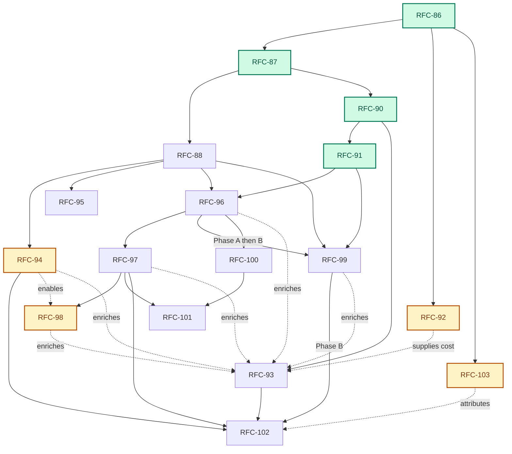

# Platform-Scale Migration

> Status: Planning spine for the RFC-86…RFC-102 platform series — the implemented 86–91 stem, the product and scale tracks, and the economics, learning, readiness, verification, conservation, fleet, and autonomy tracks interleaved with them in delivery order. Each RFC owns its decisions; this document owns sequence and fit.
>
> Audience: contributors starting work on the series; operators evaluating what Emery is becoming

## The vision

Point Emery at a legacy system — a mobile app, a realtime platform, any estate of repositories that together comprise one product — and have it migrate that system: discover the repositories, profile them, survey every source, recursively decompose the result into bounded conflict domains, and execute the buildable leaves with a **swarm of concurrent agents** working across **multiple repositories** on **multiple nodes**, converging on verified, published changes.

Then keep changing that platform the same way, from a disposable change directory. Operators choose policy rather than another workflow: pause after topology, progressively refine while discovery continues, produce an unattended verified candidate, or authorize a fully policy-gated merge.

Do all of it with one Emery: the same binary, verbs, artifacts, and lifecycle on a single desktop and across a multi-node fleet. A desktop is the deployment with one journal writer and no remote, not a separate mode.

## Where we are

**Implemented:** RFC-86 (Change Facts), RFC-87 (Private Workspaces), RFC-90 (Build Verification), and RFC-91 (Refinement Stage). The engine now runs a fact-based workflow over private workspaces with an engine-owned build phase machine and a standalone refinement stage between plan authoring and execution.

**Remaining:** Product detach (RFC-88/95), progressive refinement (RFC-99 Phase A), concurrent candidate execution (RFC-96/99 Phase B), trustworthy verification (RFC-97), and governed learning/autonomy (RFC-93/102).

**Assumed but unmeasured:** four properties the series depends on are asserted rather than assessed. Whether a given target can support the loop at all is assumed at authoring time and discovered at build time ([RFC-94](rfc-94-target-readiness.md)). Whether a migration preserved the behaviour it recovered is reviewed rather than replayed, even though the `captures` corpus that recorded it is retained ([RFC-98](rfc-98-behavioural-conservation.md)). What the loop costs per slice is unattributed, which leaves RFC-93's `cost` field structurally empty ([RFC-92](rfc-92-operation-model-policy.md)). And *who acted* is assumed to be a person and never recorded, which an agent-driven run makes unrecoverable ([RFC-103](rfc-103-operator-attribution.md)). Each is small, independent of the scale track, and answerable on the implemented substrate.

### Dependency map



Amber nodes are the evidence track: each closes a gap between what the series asserts and what it can demonstrate, and none of them blocks the scale track.


## Target architecture

The architecture makes eight shifts to enable platform scale:

1. **State becomes facts.** A change is a self-contained, version-control-neutral fact tree.
2. **Trees become values.** Every operation starts from an immutable snapshot in a private workspace and captures another snapshot. No shared working directory crosses an operation.
3. **Location becomes disposable.** Plan authoring discovers and pins participating repositories; execution creates private workspaces on demand. Archive leaves only merged baselines and forge history.
4. **Build repair becomes engine-owned.** Generation, verification, repair, and review are separate target WIT operations in a bounded engine loop.
5. **Model work becomes explicit.** Plan authoring recursively partitions the scope until every leaf is buildable. During the build, targets propose a complete task graph for the engine to validate.
6. **Refinement becomes a fenced stage.** Serial plan-wide refinement covers reviewable bundles, moving to concurrent work items and frontiers.
7. **Progress is a policy, not a new workflow.** Branches are published and progressively refined, optionally building non-authoritative candidate frontiers. Unattended build uses exact policy admission.
8. **Learning is offline and versioned.** Retained outcomes become inert proposals and promoted future versions. In-flight work never rewrites its own instructions.


1. **State becomes facts.** A change is a self-contained, version-control-neutral fact tree. Workflow status is projected from those facts, so a hosted service never becomes lifecycle authority.
2. **Trees become values.** Every operation starts from an immutable snapshot in a private workspace and captures another snapshot. A code patch is the relation between the two; no shared working directory crosses an operation.
3. **Location becomes disposable.** Plan authoring can begin in an empty directory, discover the participating repositories, and record their exact revisions. Execution creates private workspaces on demand. Archive leaves only merged baselines and forge history.
4. **Build repair becomes engine-owned.** Generation, model-assisted verification, repair, and review become separate target WIT operations in a bounded engine loop rather than retries hidden in adapter prose. [RFC-97](rfc-97-native-verification.md) follows with deterministic native verification on the trusted host.
5. **Model work becomes explicit.** Plan authoring surveys the pinned source set and recursively partitions it until every terminal scope is a buildable slice. During the singular slice build, `target.decompose` proposes one complete task graph and the engine validates it before dispatch.
6. **Refinement becomes a fenced stage.** [RFC-91](rfc-91-refinement-stage.md) adds serial plan-wide refinement, covers complete reviewable refinement bundles, and moves target-base selection to wave open. [RFC-96](rfc-96-concurrent-execution.md) turns the serial loops into `(slice, phase, input-digest)` work items and concurrent frontiers.
7. **Progress is a policy, not another workflow.** [RFC-99](future/rfc-99-streaming-execution.md) publishes closed branches, progressively refines them, and optionally builds non-authoritative candidate frontiers. Manual review remains available; unattended build uses exact policy admission; accepted-CID mutation remains separate.
8. **Learning is offline and versioned.** [RFC-93](rfc-93-outcome-learning.md) turns retained outcomes into inert proposals and promoted future versions. [RFC-102](rfc-102-policy-gated-autonomy.md) permits unattended merge only under a pinned policy, protected evidence, native verification, exact commit admission, and bounded recovery.

### Scaling invariant

Emery scales by repeating one bounded pattern:

1. Start from immutable inputs.
2. Partition a scope into children.
3. Run independent children concurrently.
4. Converge their results before leaving the parent scope.

A **conflict domain** owns the dependency graph, concurrency bound, and local convergence gate for its children. It either partitions again or terminates as one buildable **slice**. Internal domains and agent tasks have no slice lifecycle; they only describe containment and convergence.

### Authority and records

Six records answer different questions to decouple state from lifecycle:

- `plan.execute.started`: Records exact closed-plan authorization.
- `plan.run.started`: Records a progressive run's scope, bound, and policy.
- **Member admission**: Records the exact refinement and gap state allowed to build.
- **Live claim**: Records which journal writer owns a leaf.
- **Build and domain facts**: Record the exact inputs and results consumed.
- **Commit admission**: Records why one closed wave may advance the accepted CID.

Each answers *what was authorized over which inputs*, and none answers *who asked* — the journal writer is a claim-ownership and log-partitioning key, not an identity. [RFC-103](rfc-103-operator-attribution.md) adds the acting operator's class and attestation as a field on every fact, which matters because the operator need not be a person (see [Operator identity](#operator-identity-an-agent-may-drive-the-engine)).


## The series

The tables list each RFC's hard dependencies and what it delivers. **RFC numbers are the delivery sequence.** Numbers ascend in dependency order, with work that can start on the implemented substrate pulled forward, so a lower number is either already landed or unblocked earlier. The sequence is not a serial queue — several tracks proceed concurrently, as [Working in parallel](#working-in-parallel) sets out — but no RFC depends on a higher-numbered one.

Numbers 86 through 91 are frozen history and do not follow that rule: [RFC-86](rfc-86-change-facts.md), [RFC-87](rfc-87-working-trees.md), [RFC-90](rfc-90-build-verification.md), and [RFC-91](rfc-91-refinement-stage.md) are **implemented** — the fact and workspace stem plus the engine-owned build phase machine and the serial refinement stage — and [RFC-88](rfc-88-detached-changes.md) is the contract under implementation now. Those five are cited across the WIT wire contract, engine crates, and the adapter repository, so they keep the numbers those citations name. Everything from 92 up is unstarted and numbered by sequence.

**Letter suffixes are closed.** [RFC-86a](rfc-86a-gap-deferral.md) (gap deferral) is a fix-up that shares RFC-86's number because it was cut alongside it. Now that 86–91 are frozen — implemented or under implementation, and cited across the WIT contract, engine crates, and the adapter repository — no further suffix is added there: attaching a new draft to a landed number would blur what "implemented" means. Amending a landed RFC does not require sharing its number, which [RFC-102](rfc-102-policy-gated-autonomy.md) already demonstrates by amending RFC-88 D7 / D8 from its own number.

**A high number is not always a late one.** Numbers assigned after the renumber append rather than insert, because 92 upward are cited outside this directory and re-cutting them costs more than the ordering signal is worth. [RFC-103](rfc-103-operator-attribution.md) (operator attribution) is the case in point: it depends only on implemented RFC-86 and is unblocked today. Where a number and a dependency disagree, the **Depends on** column is authoritative — the ascending-order rule guarantees only that no RFC depends on a higher-numbered one, which RFC-103 satisfies.

**89 is permanently vacant.** It named Publication Sets, which is now [RFC-95](rfc-95-publication-sets.md). Do not reuse the number: git history and pre-renumber commits still associate it with publication work, and the same rule applies to any number retired below 86.

The remaining workspace stand-in is merge-time `apply` (deleted by RFC-88). RFC-88's recursive authoring contract remains the product branch; RFC-91 adds the serial review boundary and wave-time base, RFC-96 owns concurrent phase scheduling, RFC-99 pipelines closed branches through that scheduler, and RFC-100 optionally distributes it. Every RFC owns an independently testable delivery; later steps extend rather than predeclare its wire contract.

The landed authorization contract follows [RFC-86](rfc-86-change-facts.md) D6 / D17 as amended by [RFC-86a](rfc-86a-gap-deferral.md): starting `emery plan execute` appends `plan.execute.started` with typed coverage; there is no separate `approve` verb, no projected `approved` rung, and no silent skip of gaps — every open row is auto-deferred at the build gate as a durable, journaled `gap.deferred` fact (the `strict | defer` policy knob and the `plan defer` verb were deleted after RFC-86a landed). RFC-91 preserves that event, replaces spec-only coverage with complete refinement-manifest digests, and removes `refine-under-epoch`; `plan refine` creates no code-work grant. RFC-99 adds progressive run and member admission for unattended candidate work. RFC-102 alone extends policy admission to accepted-CID mutation.

### Product critical path — migrate and change a platform


| RFC                                  | Title              | Delivers                                                                                                                                                                                                                                                                                       | Depends on                                      |
| ------------------------------------ | ------------------ | ---------------------------------------------------------------------------------------------------------------------------------------------------------------------------------------------------------------------------------------------------------------------------------------------- | ----------------------------------------------- |
| [RFC-86](rfc-86-change-facts.md)     | Change Facts       | The substrate: the change as a version-control-neutral fact tree, projected status, per-writer event logs, explicit execution-authorization epochs, pinned per-leaf inputs, immutable one-member target-wave commit, merge-finalized requirement identity, desktop as the degenerate deployment | —                                               |
| [RFC-87](rfc-87-working-trees.md)    | Private Workspaces | Immutable snapshots, disposable private workspaces, `prepare` / `capture` / `discard`, code patches as base/result relations, and separate writable-code/read-only-artifact access                                                                                                             | implemented 86 pin/epoch/wave facts; interim `apply` until 88 |
| [RFC-88](rfc-88-detached-changes.md) | Detached Changes   | Complete single-node migrate/change loop: generated source identities, deterministic selection, an ordinary directory as the disposable change home, GitHub discovery, capability-profile-bound conflict-domain decomposition, refinement feedback through focused child leads, a buildable leaf projection, and operation-local workspaces | implemented 86; implemented 87                  |
| [RFC-95](rfc-95-publication-sets.md) | Publication Sets   | Project seal: each final project snapshot becomes one local commit; publication identity binds those commits, branches, and PRs across repositories with ordered landing and archive verification                                                                                              | 88 (member derivation)                          |


### Scale track — staged and concurrent execution


| RFC                                            | Title                 | Delivers                                                                                       | Depends on            |
| ---------------------------------------------- | --------------------- | ---------------------------------------------------------------------------------------------- | --------------------- |
| [RFC-90](rfc-90-build-verification.md)         | Build Verification    | **Implemented:** Engine-owned build loop, bounded repair policy, durable reports.              | 87                    |
| [RFC-91](rfc-91-refinement-stage.md)           | Refinement Stage      | **Implemented:** Serial plan-wide refinement (`plan refine`), reviewable refinement manifests, wave-time target bases, execute-time coverage. | 90                    |
| [RFC-96](rfc-96-concurrent-execution.md)       | Concurrent Execution  | Work item scheduling, concurrent frontiers, bottom-up convergence, multi-member target waves.  | 88, 91                |
| [RFC-99](future/rfc-99-streaming-execution.md) | Streaming Execution   | Phase A: publish/refine closed branches. Phase B: unattended candidate build, deferred commit. | A: 88, 91, 96A; B: 96B |
| [RFC-100](rfc-100-distributed-execution.md)    | Distributed Execution | Distribution of completed RFC-96 model between nodes via operation offers and remote pools.    | 96                    |


### Verification, learning, and autonomy follow-ons


| RFC                                         | Title                        | Delivers                                                                | Depends on                    |
| ------------------------------------------- | ---------------------------- | ----------------------------------------------------------------------- | ----------------------------- |
| [RFC-93](rfc-93-outcome-learning.md)        | Outcome Learning             | Outcome records, inert improvement proposals, promoted future versions. | implemented 90 (enriched by 96, 99, 97) |
| [RFC-97](rfc-97-native-verification.md)     | Native Verification Profiles | Host-attested semantic checks, denied-by-default tool execution.        | 90, 96                        |
| [RFC-101](rfc-101-platform-readiness.md)    | Platform Readiness           | Hosted/fleet conformance, tenancy, capability-scoped workers.           | 100, 97                       |
| [RFC-102](rfc-102-policy-gated-autonomy.md) | Policy-Gated Autonomy        | Unattended merge under promoted policy, exact commit admission.         | 99B, 97, 93                   |


### Evidence track — what the series asserts but cannot yet show


| RFC                                          | Title                     | Delivers                                                                                          | Depends on                |
| -------------------------------------------- | ------------------------- | -------------------------------------------------------------------------------------------------- | ------------------------- |
| [RFC-92](rfc-92-operation-model-policy.md)   | Operation Model Policy    | Per-operation model routes on the pinned capability profile, usage facts, cost attribution.        | implemented 86, 90        |
| [RFC-94](rfc-94-target-readiness.md)         | Target Readiness Profiles | Discovery-time target assessment over a closed dimension set; band-gated execution-policy eligibility. | 88 (enriches 93, 102)     |
| [RFC-98](rfc-98-behavioural-conservation.md) | Behavioural Conservation  | The `captures` corpus as a protected replay oracle, the `conserve` profile, per-requirement conservation coverage. | 97 (enabled by 94)        |
| [RFC-103](rfc-103-operator-attribution.md)   | Operator Attribution      | The actor record on every fact — closed actor class, declared driver identity, honest attestation level, and the projections that surface it. | implemented 86 (informs 102) |

**Two things are called readiness.** [RFC-101](rfc-101-platform-readiness.md) *platform* readiness is about Emery's own deployment: whether a fleet can host tenanted, capability-scoped workers. [RFC-94](rfc-94-target-readiness.md) *target* readiness is about the client's estate: whether a pinned repository can support the loop. They share a word and nothing else, and neither depends on the other.


- **Implemented and in-flight RFCs stay frozen.** RFC-86 and RFC-90 are implemented substrates, and RFC-88 is the current implementation contract. RFC-91, RFC-99, RFC-93, and RFC-102 carry their changes as explicit forward patches; they do not revise those predecessor texts.
- **RFC-86 is the base of the series and is implemented** — the fact substrate every later step consumes (projected status, per-writer logs, `plan.execute.started`, recorded pins, one-member waves, `builds/<digest>.yaml`). Product acceptance closeout (S23) is complete. It deleted the mechanics later steps would otherwise have synchronized (stored status, the single journal file, synthesis-time identity, unrecorded execute starts) and delivered the shift-left refine / gap-gate flow.
- **RFC-87 is the shared workspace stem and has already landed.** Phase B retired build-time ambient freeze and `build/patch.yaml` against the `SnapshotId` / `prepare` / `capture` / `discard` contract. The remaining interim is merge-time `apply` (RFC-88 deletes it). Do not re-litigate whether workspaces “depend on finished 86.”
- **After the stem, the series is a braid, not two independent pipelines:** RFC-90's engine-owned build verification and repair orchestration is implemented; RFC-88 settles recursive authoring, while RFC-91 follows the 86/87/90 substrate with a serial specs-first stage, complete refinement coverage, and wave-time target bases. RFC-96 joins 88, 90, and 91 in two deliveries: Phase A replaces serial model-work cursors with a bounded scheduler and pool; Phase B adds target task graphs, composition, convergence, and waves. RFC-100 distributes the completed local model. RFC-95 publication and RFC-100 multi-node execution remain orthogonal.
- **RFC-91 is the staged-refinement prerequisite.** It owns the complete-plan review seam and exact manifest contract. It adds no approval state, so an automation may invoke refine and execute back to back over the same artifacts.
- **RFC-96 Phase A is an early reusable substrate.** It owns work-item identity, cancellation, the bounded pool, and concurrent survey/extract/refine before target decomposition or multi-member waves land.
- **RFC-99 is phased.** Phase A combines RFC-88 branch revisions, RFC-91 manifests, and RFC-96A to refine while authoring continues without code authority. Phase B waits for completed RFC-96 and adds policy-admitted candidate build, candidate dependency frontiers, and deferred commit. Neither phase waits on RFC-100.
- **RFC-97 is the native-verification follow-on.** It depends on 87, 90, and 96, may land beside 99/100, and supplies the host-attested assurance RFC-102 requires.
- **RFC-101 is the hosted/fleet readiness spine.** It consumes RFC-100 and worker capabilities including RFC-97; its own phase table remains authoritative.
- **RFC-93 can start from implemented RFC-90.** Outcome projection and diagnostic recurrence need no concurrent or hosted runtime; RFC-96, RFC-99, and RFC-97 enrich the same record as they land.
- **RFC-102 is last on the autonomy path.** It requires progressive candidates, host/protected verification, and promoted policy generations. It extends `plan run` through merge but leaves forge publication to RFC-95 and the operator.
- **RFC-94 decides which policy a target is eligible for.** The four orchestration policies below are offered uniformly today, which means an unattended policy can be pointed at a target with nothing to verify against. Readiness moves that judgment from the operator's intuition to a recorded, digest-bound assessment of the pinned CID, checked before the epoch opens. It follows RFC-88 discovery and blocks nothing else.
- **RFC-98 supplies the assurance the migration case actually rests on.** RFC-97 can attest that a candidate passes its own checks; it cannot attest that the candidate still behaves like the system it replaced. The `captures` corpus is already retained and is the only input in a change that no writer can reach, which makes it the protected oracle the estate actually has. It follows RFC-97 and is worth more on a low-readiness estate than another concurrency increment.
- **RFC-92 can start on the implemented substrate.** RFC-93 already declares a `cost` field it cannot populate and a `model-route-change` proposal kind for an object no RFC defines. Routes and usage facts need neither concurrency nor a hosted runtime, and once they exist every later RFC's telemetry gains a spend dimension for free.

## Working in parallel

With the foundational substrate (86/87/90) landed, independent tracks can proceed concurrently.


| Track                          | Sequence  | Status                             |
| ------------------------------ | --------- | ---------------------------------- |
| **Location / product**         | 88 → 95   | Ready to start                     |
| **Refinement**                 | 91        | Implemented                        |
| **Concurrency / distribution** | 96 → 100  | 96A can start when 88/91 stabilize |
| **Progressive execution**      | 99A → 99B | 99A follows 88/91/96A              |
| **Learning / autonomy**        | 93 → 102  | 93 can start now                   |
| **Verification & fleet**       | 97, 101   | Follows 96 / 100 respectively      |
| **Evidence**                   | 92, 94, 98 | 92 can start now; 94 follows 88; 98 follows 97 |


*Note:* Collision points exist in the merge orchestration (which RFC-88 significantly impacts). Sequence these integrations explicitly rather than attempting to merge parallel structural changes.

The evidence track ascends in the order it becomes cheapest, and three of its four members are genuinely independent of the scale track: RFC-92 and RFC-103 touch the implemented substrate and nothing else, and RFC-94 needs only RFC-88 discovery. All three can land while concurrency work proceeds, and all three change what the scale track's results *mean* — which is the argument for not deferring them behind it.

**RFC-98 is the exception, and the dependency is worth revisiting.** Conservation needs RFC-97's protected-oracle machinery, and RFC-97 as written depends on RFC-96, so the most valuable assurance instrument for legacy work currently sits behind the concurrent scheduler. RFC-97 cites RFC-96 for three things: immutable candidate composition, fresh verification workspaces, and the `frontier-domain` / `complete-domain` verification contexts. The first two are RFC-87, which is implemented; only the domain contexts and D11's protected-input closure genuinely need concurrency. A serial-first cut restricted to `slice-attempt` context would therefore depend on 87 and 90 alone and would carry conservation with it.

That split is **not** decided here and RFC-97's stated dependency stands. It is recorded because the alternative is rediscovering the question after committing to the scale track, and because the sequencing argument in [Evidence and iteration posture](#evidence-and-iteration-posture) applies to this series' own claims as much as to the estate's.

## Evidence and iteration posture

Several RFCs in this series cite this section for how their claims should be judged. The posture is one rule with three consequences.

**Prefer a measurement to an assumption whenever the measurement is cheap.** The architecture is unusually well placed to measure itself: every operation is typed, every input is digest-bound, and every result is a durable fact. That makes it tempting to treat internal coherence as evidence. It is not. A design that is consistent with the rest of the series can still be wrong about the estate it will meet.

- **Scale is justified by measurement, not by assumption.** RFC-96 and RFC-100 buy throughput, and throughput is only valuable if model-work latency is the binding constraint. On a target with a slow build, an unreliable environment, or heavy repair rounds, it is not; concurrency then multiplies spend without moving the completion date. RFC-92's usage facts and RFC-97 D9's per-profile timing make that question answerable before the concurrency work is committed rather than after.
- **Assurance is claimed at the level it was earned.** `assurance: candidate`, `protected`, and `mixed` exist so that a passing check cannot be quoted as more than it is. The same discipline applies to prose: an RFC that says a change is "verified" should name which profile, over which oracle, at which assurance. RFC-98 exists because the honest answer for most legacy work today is "model-reviewed", and that is not the same claim.
- **A number that looks measured must be measured.** RFC-92 D3 records `unknown` rather than a locally estimated cost for this reason, and RFC-94 D6 sends its weighting hypothesis to RFC-93 rather than defending it in prose. Where the series states a threshold, budget, or weight, treat it as a starting value with a route to being revised by outcome records — not as a settled constant.

Iteration follows the same rule. Land the smallest thing that produces a fact, read the facts, and let RFC-93's offline loop propose the next value. The alternative — tuning constants from intuition and recording nothing — is the failure this architecture was built to avoid, and it is entirely possible to commit it one layer up, in the RFCs themselves.

## Orchestration policies

**Within RFC-86** (implemented): Phase A (per-writer logs, projection kernel, claim/retraction facts) in `crates/project`; Phase B (slice-scoped requirement ids, `MODIFIED` base digests, merge-time finalization, recorded pins, `BuildRecord`, one-member waves) in `crates/slice`; Phase C (`plan.execute.started`, gap gate, multi-writer) on top of A. The shared contract is the merge / wave fact that records the identity map. Remaining series stand-ins live outside this stem: flat `.emery/` change home (RFC-88 moves it) and merge-time `apply` (RFC-88 deletes it).

**Migrate** and **change** differ only in authoring scope (discovering repositories via fingerprint vs explicit project membership). Both feed the same policy paths:

### 1. Reviewed policy

```text
emery plan author     →  initialize the detached home when needed; discover and pin
                         targets/sources; recursively decompose surveyed leads;
                         project buildable leaves into plan.yaml
operator may review   →  inspect and amend topology
emery plan refine     →  serially extract and synthesize every leaf in topological order;
                         persist complete refinement manifests; stop before product code
operator may review   →  read specs and gaps; correct inputs and re-refine as needed
emery plan execute    →  cover the exact refinement manifests;
                         enforce gap/status gates before build (open gaps auto-defer at
                         the gate as durable gap.deferred facts — RFC-86a as amended);
                         prepare private workspaces on demand (RFC-87); execute leaves;
                         commit target waves (RFC-88);
                         converge domains and extend waves across ready leaves (RFC-96);
                         seal each drained target's final CID (RFC-95)
operator publishes    →  push sealed branches; open and merge PRs
emery plan archive    →  verify the publication set (RFC-95); archive
rm -rf <dir>
```


### 2. Progressive specs-only policy

```text
emery plan run --publication progressive --through refined
  → publish validated closed branches while surveys continue
  → refine ready leaves through the concurrent pool
  → close final plan, stop before any product workspace or code grant
```


### 3. Unattended candidate policy

```text
emery plan run --publication progressive --through built --policy <run-profile>
  → author and refine progressively
  → admit exact clean manifests under recorded policy
  → build leaves through candidate frontiers with engine-owned verification
  → stop with non-authoritative candidates; accepted CIDs unchanged
```


### 4. Policy-gated autonomy

```text
emery plan run --publication progressive --through merged --policy <autonomy-profile>
  → require final closure, no unknowns/conflicts, protected assurance
  → write exact commit admission for each wave
  → merge and seal locally; forge publication remains operator-owned
```


## Outside the series

Unchanged and orthogonal — not part of this arc, not blocked by it:

- **[CLI architecture](../docs/contributing/cli-architecture.md)** / `crates/launcher/` — shipped deployment.
- **[Release process](../docs/release.md)** — operational policy for releasing Emery.
- **[RFC-18 Specialized SLM Code Generation](future/rfc-18-slm.md)** — optional cost lever.
- **[RFC-46a Web Asset Materialization](future/rfc-46a-web-asset.md)** — content-triggered vectis work.

## Operator identity: an agent may drive the engine

The engine is a deterministic state machine over a fact log, and the operator sits outside it as a caller. Operator identity is therefore **orthogonal to the architecture**: substituting an autonomous driver for a person is a change at the call site, not a change to the design. This is already true in practice — there are no TTY prompts anywhere, `--force` is a flag rather than a confirmation, `--format json` is global, `plan status` projects a closed next-action enum, and the eval case runner drives a full change end to end with no human gesture.

The principle is one line: **an agent may drive the engine; an agent may not be the engine.**

Two consequences follow, and they are the reason the distinction is worth stating rather than assuming.

The first is that the substitution is safe, because the engine does not trust its caller. Authority comes from digests, gates, and the fact log — never from who invoked a command or what they intended. An agent operator cannot skip the gap gate, forge epoch coverage, write product code into the operator's checkout, or self-approve, because there is no approve verb and every disposition is a digest-bound fact carrying a reason. The audit trail is invariant under operator substitution, which is precisely what an agent-orchestrated design cannot offer: there, replacing the human changes what is knowable, because the orchestrator's reasoning is in-context and unreplayable.

The second is that invariance cuts both ways. A trail that is identical whoever produced it cannot say who produced it, and the engine's guarantee is legibility rather than prevention — an agent operator can drop, override authority, and force — and every gap it leaves open is auto-deferred at the build gate — all journaled and none blocked. [RFC-103](rfc-103-operator-attribution.md) closes that by attributing the act; [RFC-102](rfc-102-policy-gated-autonomy.md) keeps operator verbs out of policy scope for the same reason RFC-86a removed per-epoch waivers. As the operator becomes an agent, the read-only projections stop being the operator's dashboard and become the human's audit surface over the agent operator — which is what moves [RM-24, RM-27, and RM-28](roadmap.md) from ergonomics to assurance.

## Absorbed lessons (not the opposite bet)

Comparable products — notably Factory Missions — put a conversational agent in the seat that plans, schedules, and invents follow-up work. That shape is rejected below. Several of their *supporting* disciplines are already Emery-shaped or belong at the call site; this section records what to take so the rejection is not read as indifference.

| Absorb | Where it lands |
| ------ | -------------- |
| Conversational planning and driving | An outer agent (or human) over the CLI and projections — [Operator identity](#operator-identity-an-agent-may-drive-the-engine), not an in-engine chat |
| Validation contract before implementation | Refine-before-build (RFC-91); protected oracles and conservation ([RFC-97](rfc-97-native-verification.md), [RFC-98](rfc-98-behavioural-conservation.md)) as the stronger form of “done” |
| Fresh context and separated incentives | Private workspaces (RFC-87); engine-owned build → verify ⇄ repair → review (RFC-90) — implementers do not choose the next phase or judge their own terminal success |
| Model specialization by role | Per-operation routes and cost facts ([RFC-92](rfc-92-operation-model-policy.md)), not an orchestrator-agent model tier |
| Fix work invented from validation gaps | Bounded recovery ladder and standing amendments only ([RFC-102](rfc-102-policy-gated-autonomy.md)); never free-form mid-run re-plan in model context |
| Forgiving “unstick” UX | Typed stop → exact next verb and inputs → re-run ([RM-28](roadmap.md#rm-28-agent-operator-stop-and-resume-surface)), with topology and proposal review as the human audit surface ([RM-24](roadmap.md#rm-24-topology-review-projections), [RM-27](roadmap.md#rm-27-amendment-proposal-review-ergonomics)) |

The commercial reading of the same comparison lives in [brand/strategy.md](../brand/strategy.md).

## Deliberately rejected

These are recorded because they are perennial suggestions, each plausible on its own terms, and because the reasoning against them is not obvious from any single RFC. Rejection here is a decision, not an omission; reopening one needs an argument against the reason given, not a restatement of the benefit.

- **An agent as the orchestration layer.** The most common shape in comparable products: the thing that plans and schedules is itself conversational, so a stuck run is unstuck by telling it that it seems stuck. It is genuinely more forgiving to operate. It is also incompatible with everything the fact substrate buys — a projectable state model, digest-bound authorization, and replay. The ability to converse with a stalled orchestrator is a symptom of having no projection to read, not a capability Emery lacks. Recovery stays: stop, read the typed reason, fix the inputs, re-run the stage. This rejects an agent *inside* the orchestrator, not an agent *driving* it — the permitted form is [Operator identity](#operator-identity-an-agent-may-drive-the-engine) above; the lessons to take without adopting that shape are in [Absorbed lessons](#absorbed-lessons-not-the-opposite-bet).
- **Loosening determinism to buy orchestrator flexibility.** The general form of the above, and the one most likely to arrive disguised as a small exception — an unrecorded retry, an in-run model upgrade, a silently widened budget. Each one converts the epoch's coverage from a description of what was authorized into an approximation of it. [RFC-92](rfc-92-operation-model-policy.md) D5 works through the concrete case.
- **An SDLC-wide automation surface.** Triage, release gates, incident response, coverage dashboards. This is a product-company play: it exists to make a platform sticky across many customers, which is not what Emery is for. It also fails the trace test — none of it delivers an engagement.
- **Managed persistent cloud compute for agents.** Emery ships as a single binary with a fact log and runs on the operator's node or a client's own infrastructure. Owning long-lived remote machines adds a tenancy, billing, and data-residency surface that directly undercuts the deployment posture regulated clients buy. [RFC-101](rfc-101-platform-readiness.md) covers fleet execution without Emery owning the fleet.
- **An adapter marketplace.** Distribution, discovery, ratings, and trust for third-party adapters. The versioned `emery:adapter` WIT contract is the right seam and it already exists; the marketplace around it is deferred to [RM-21](roadmap.md) and starts at the first external author, not before.
- **A generic repository maturity score.** Rejected in [RFC-94](rfc-94-target-readiness.md) rather than here, but it belongs on this list: scoring organisational practice measures something other than whether this engine can build this tree.

