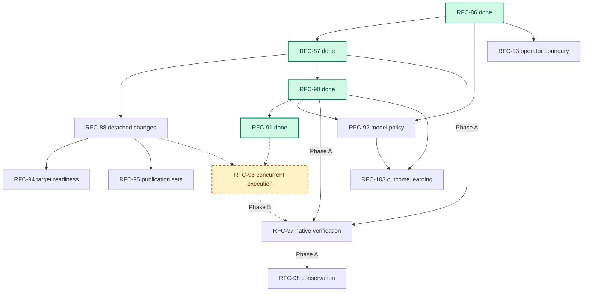

# Services Delivery Programme

> Status: Planning spine for the active RFC-86…RFC-98 / RFC-103 programme. RFC-99 through RFC-102 are parked and deliberately excluded from the active dependency map. RFC-96 is evidence-gated and is not on the default staffing plan. Each RFC owns its decisions; this document owns delivery sequence, programme state, and fit.
>
> Business authority: [Registry & Open-Source Strategy § What the services business needs](../brand/strategy.md#what-the-services-business-needs).
>
> Audience: contributors choosing what to build next and operators evaluating what Emery is becoming.

## Direction

Propellerhead exists to build and change critical software without losing the behaviour, knowledge, and trust the organisation depends on. The programme supports one services promise:

> **Establish or recover what a critical system must do, deliver it in bounded, reviewable waves, and preserve the result as the basis for future change.**

Modernization remains the commercial wedge. A new system is the simpler evidence case: authoritative intent and constraints establish the initial baseline rather than system archaeology recovering one from existing behaviour.

Emery is the delivery system behind that promise, not the product strategy. Its immediate goal is the smallest single-node system that can reconcile evidence with stakeholder intent, expose uncertainty, price work honestly, prove the delivered candidate against the assurance available, deliver across the repositories one programme actually touches, and leave a living baseline. Services expertise may supply topology and exception judgment. Concurrency, streaming, distribution, hosted fleets, and unattended merge are not prerequisites for that offer.

The north-star architecture remains capable of scaling beyond one node and one reviewed run. It is no longer the default implementation queue. Scale is activated by measured engagement pull, not by architectural completeness.

## Where we are

**Implemented foundation:** RFC-86 (Change Facts), RFC-87 (Private Workspaces), RFC-90 (Build Verification), and RFC-91 (Refinement Stage). The engine runs a fact-based workflow over private workspaces with an engine-owned build phase machine and a fenced specification-refinement stage.

**Current product gap:** RFC-88 must retire merge-time `apply`, establish accepted-CID execution, and deliver the detached multi-repository change loop. RFC-95 then seals results for publication. This is the programme's critical path.

**Current evidence gap:** properties material to services delivery that are asserted rather than demonstrated, and that can proceed beside or after the product cut:

- What model route and spend produced an operation is unrecorded ([RFC-92](rfc-92-model-policy.md)) — startable on the implemented substrate.
- Whether model traffic can use a client-owned endpoint is unverified ([RM-26](roadmap.md#rm-26-client-controlled-model-endpoint)) — a regulated quoting gate.
- Who requested an act (and, when needed, which host grant admitted it) is unrecoverable ([RFC-93](rfc-93-operator-boundary.md)) — parallel assurance, not the product critical path.
- Whether a target can support the promised loop is discovered too late ([RFC-94](rfc-94-target-readiness.md)) — follows RFC-88 discovery.
- Whether a migration preserved recovered behaviour is model-reviewed rather than replayed against a protected oracle ([RFC-97](rfc-97-native-verification.md), [RFC-98](rfc-98-behavioural-conservation.md)).

None requires streaming, distribution, a hosted fleet, or autonomous merge.

## Active dependency map

Only hard dependencies appear here. Enrichment relationships belong in prose and outcome schemas, not in the graph. Green = done; dashed = evidence-gated (designed, not default staffing).



RFC-92 patches the model-capability profile shape owned by RFC-88, but it does not wait for RFC-88 to finish: routes and usage facts land on the implemented substrate and fold into the profile when that cut lands.

## Programme states

Every item is in exactly one state:

- **Implemented** — landed contract; retained as history, not active roadmap work.
- **Active** — accepted direction with an observed services need or an immediate evidence gap; eligible for default staffing.
- **Evidence-gated** — accepted architecture whose implementation starts only when its stated measurement or engagement trigger fires; not on the default staffing plan.
- **Parked** — preserved design option, excluded from the active dependency map and staffing plan.

An RFC number is a stable design identity, not a promise that every lower number must be implemented first. Numbers already assigned (including the RFC-93 / RFC-103 swap while both were unimplemented) stay put — do not renumber again. Delivery order is the track plan below. RFC-99 through RFC-102 retain their identities while parked and are never reused.

## Delivery tracks

Independent tracks proceed in parallel. Staffing follows the critical path first; parallel work starts when it does not displace that path.

### Critical path — finish the engagement-shaped product loop

[RFC-88 Detached Changes](rfc-88-detached-changes.md) is the active product contract and the programme's immediate priority. Implement it in internal cuts rather than creating more RFCs:

1. accepted-CID merge and deletion of interim `apply`;
2. detached change home with explicit pinned targets and sources;
3. bounded discovery and deterministic adapter selection;
4. capability-profile-bound conflict-domain decomposition and refinement feedback.

The complete RFC remains the contract. The cuts control implementation risk; they are not partial public lifecycle variants. Complete-tree publication stays the reference policy.

[RFC-95 Publication Sets](rfc-95-publication-sets.md) follows RFC-88 member derivation and supplies local project seals, publication identity, ordered landing, and archive verification. Forge writes remain operator-owned; [RM-17](roadmap.md#rm-17-forge-publication-providers) starts only when manual publication is a measured bottleneck.

### Parallel — measure and quote honestly

[RFC-92 Model Policy](rfc-92-model-policy.md) starts on implemented RFC-86/90. It adds pinned per-operation routes, a minimal closed engine-triggered escalation ladder, usage facts, and cost attribution. It makes engagements measurable before concurrency or learning work is justified. Prefer offline route promotion via RFC-103 once signal exists; do not grow the ladder into readiness-, spend-, or classifier-driven rerouting.

[RM-26 Client-controlled model endpoint](roadmap.md#rm-26-client-controlled-model-endpoint) traces whether regulated model egress can use a client-owned gateway, proxy, or endpoint before quoting government, banking, insurance, or health work. It is a potential engagement blocker, not a product feature queue.

### Next — readiness and trustworthy outcomes

[RFC-94 Target Readiness](rfc-94-target-readiness.md) follows RFC-88 discovery. It makes readiness deterministic-first:

- structural criteria and approved host probes produce authority;
- model judgment explains gaps but cannot grant a band;
- bands select eligible named policies, never mutate mechanics in flight;
- findings carry remediation intent but perform no privileged write.

Readiness is both a gate and a paid services entry point: assess the estate, turn findings into ordinary change inputs, then reassess the resulting CID.

[RFC-97 Native Verification](rfc-97-native-verification.md) remains one RFC with two phases:

- **Phase A** depends only on implemented RFC-87/90 and supplies host-attested `slice-attempt` verification. It may proceed beside RFC-88 once product staffing allows.
- **Phase B** remains attached to evidence-gated RFC-96 with `frontier-domain | complete-domain` contexts, protected-input closure, and distributed placement.

[RFC-98 Behavioural Conservation](rfc-98-behavioural-conservation.md) follows RFC-97 Phase A. It turns retained `captures` into a protected replay oracle, keeps execution assurance separate from oracle assurance, and adds the data-governance contract required for regulated capture material.

### Parallel assurance — attribution and operability

[RFC-93 Operator Boundary](rfc-93-operator-boundary.md) records actor identity and, when an engagement needs it, enforces a deployment-owned operator grant before guest dispatch. Attribution answers who acted; grants answer whether that caller may request an otherwise legal act. Neither is lifecycle authority, and neither displaces RFC-88 on the staffing plan. Actor class is not a permission bit; a grant cannot waive an engine gate.

[RM-24 Operator control surface](roadmap.md#rm-24-operator-control-surface) makes topology, proposals, and typed stops reviewable and actionable without in-engine conversation. Start it when an agent-driven run or operator review friction actually burns time — not as programme step one.

### Later — learn from real outcomes

[RFC-103 Outcome Learning](rfc-103-outcome-learning.md) follows RFC-92 and the blind current-versus-candidate evaluation harness. Its first useful cut is outcome projection and recurrence analysis. Prompt, route, rule, and policy promotion remains offline, reviewed, versioned, and available only to future runs.

RFC-94, RFC-97, and RFC-98 enrich the same outcome record as they land. They are not hard prerequisites for creating the record. Private `probe` practice improvement is ordinary engineering hygiene; a public competitive evaluation asset is [RM-29](roadmap.md#rm-29-governed-model-evaluation-asset) and starts only when a lighthouse sale needs published evidence.

### Evidence-gated — concurrency

[RFC-96 Concurrent Execution](rfc-96-concurrent-execution.md) is **evidence-gated**, not active default work. It follows stable RFC-88/91 contracts and owns work-item scheduling, task graphs, deterministic composition, domain convergence, and multi-member waves.

Start it only when RFC-92/RFC-97 timing shows model work or serial refinement is a material programme bottleneck, or when a contracted engagement requires the task-graph and domain-convergence semantics directly. A concurrency cap of one remains the reference mode. RFC-97 Phase B remains attached to RFC-96 exactly as specified in RFC-97.

## Why this sequence

The services trace test resolves the ordering:

1. **Finish the engagement-shaped product loop.** RFC-88/95 deliver multi-repository change and handoff without requiring fleet infrastructure.
2. **Measure and quote in parallel.** RFC-92 establishes cost facts on the implemented substrate; RM-26 clears regulated egress before commitment.
3. **Earn the assurance claim.** RFC-94/97/98 turn readiness and “model-reviewed” into digest-bound eligibility and host-attested execution against protected behavioural evidence.
4. **Attribute when agents drive; do not front-load grants.** RFC-93 and RM-24 are assurance work beside the product path, not prerequisites for the first wave.
5. **Learn only after signal producers exist.** RFC-103 without RFC-92 and blind evaluation archives outcomes but cannot promote an improvement honestly.
6. **Scale only when scale is the bottleneck.** RFC-96 stays designed and evidence-gated; later platform modes remain parked.

## RFC-88 scope discipline

RFC-88 is the programme's largest judgment-heavy product cut. Its implementation must preserve these boundaries:

- explicit targets and sources may deliver value before broad forge discovery;
- complete-tree publication remains the only initial policy;
- source survey and refinement feedback may propose boundaries, but the engine owns recursion, budgets, validation, and projection;
- inert amendment proposals never apply themselves;
- services practitioners may supply topology and exception judgment rather than forcing every consultative act into automation;
- authoring duration, time to first reviewable leaf, amendment rate, and decomposition staleness are measured before streaming is reconsidered.

Do not split the implementation cuts into new lifecycle RFCs. Do not pre-implement parked RFC-99 branch publication inside RFC-88.

## Evidence and iteration posture

**Prefer a measurement to an assumption whenever the measurement is cheap.** Every operation is typed, every input is digest-bound, and every result is a durable fact. Internal coherence is still not evidence that the design works on a client estate.

- **Scale is justified by measurement.** RFC-96 buys throughput only when serial model work or refinement is the binding constraint. Slow builds, unreliable environments, or repair-heavy targets can make concurrency multiply spend without moving completion.
- **Assurance is claimed on both axes at the level earned.** RFC-97 projects `execution-assurance: model-assisted | host-attested | hybrid`; `oracle-assurance: candidate | protected | mixed` says whether the correctness input was independent of the writer. “Verified” must name the profile and both assurances.
- **A number that looks measured must be measured.** Unknown cost remains `unknown`; thresholds and weights are starting values with an outcome-backed route to revision.
- **Land the smallest thing that produces a useful fact.** Read those facts before introducing another execution mode.

## Reviewed services workflow

The active operator rhythm stays:

```text
emery plan author     → discover/pin the explicit estate; survey and decompose;
                         write the reviewable topology
operator may review   → inspect and amend topology
emery plan refine     → extract and synthesize every leaf;
                         persist complete refinement manifests
operator may review   → inspect specifications, gaps, and conservation inputs
emery plan execute    → cover exact refinements; defer open gaps out of build scope;
                         build, verify/review, and commit target waves
operator publishes    → push sealed branches; open and merge PRs
emery plan archive    → verify publication, project outcome, archive
```

The four stages are implemented today, with two qualifications: verification is currently model-assisted, and the flow shown for `plan author` (estate discovery and pinning) and the publication legs (sealed branches, `plan archive` publication verification) land with RFC-88 and RFC-95 respectively. RFC-94 adds readiness admission, RFC-97 Phase A adds host-attested verification, and RFC-98 adds protected conservation without changing the four stages.

An automation may invoke stages back to back. Review seams are opportunities, not inferred attestations. When RFC-93 lands, it governs whether the caller may request each act; the engine applies identical artifact and result gates whoever called.

## Parked programme

RFC-99 through RFC-102 are preserved design options, not active dependencies or implementation commitments. They do not appear in the active map.

### RFC-99 — Streaming Execution

Parked until complete-plan authoring or refinement latency is measured as a material engagement bottleneck. Phase B additionally requires completed RFC-96 and a real need for unattended candidate build before final closure.

### RFC-100 — Distributed Execution

Parked until one production change must execute across multiple nodes. More client work or another independent machine is not the trigger; RFC-96's one-change workload must exceed a node or a deployment constraint must require remote placement.

### RFC-101 — Platform Readiness

Parked until RFC-100 is activated or a contracted requirement needs hosted tenancy, authenticated fleet ingress, or sealed shared audit storage. Small desktop capabilities such as a read-only OpenTelemetry projection may be delivered as roadmap items without activating the fleet programme.

### RFC-102 — Policy-Gated Autonomy

Parked until RFC-99 Phase B, RFC-97 Phase B, RFC-103 promoted policies, RFC-94 readiness, and RFC-93 operator grants have landed and a client requires unattended accepted-CID mutation. Reviewed execution and agent-driven operation do not require this RFC.

Parking means:

- no active RFC depends on the parked item;
- no active implementation predeclares its wire shape unless an already-active seam requires an opaque extension point;
- the document may receive correctness fixes but not roadmap elaboration;
- reopening requires the stated evidence or contracted need and an explicit programme decision.

## Operator identity: an agent may drive the engine

The engine is a deterministic state machine over a fact log, and the operator sits outside it as a caller. Substituting an autonomous driver for a person does not change artifact authority: authority comes from digests, gates, and facts, never from who invoked a command or what they intended.

The principle is:

> **An agent may plan, drive, and propose recovery; only facts and policy authorize progression and accepted-state mutation.**

Lifecycle integrity is not caller authorization. [RFC-93](rfc-93-operator-boundary.md) records actor identity and may enforce a separate deployment-owned operator grant before guest dispatch. Actor class is not a permission bit; a grant cannot waive an engine gate.

As the operator becomes an agent, read-only topology, proposal, gap, and stop projections become the human audit surface over that driver. [RM-24](roadmap.md#rm-24-operator-control-surface) is therefore assurance work, not merely ergonomics — and still not a substitute for finishing RFC-88.

## Design principles at the call site

These are Emery's own principles, not a competitive backlog:

- **Conversational planning belongs at the call site.** An outer agent may clarify intent and drive typed commands; its context is disposable and never lifecycle authority.
- **Validation is defined before implementation.** RFC-91 refines specifications first; RFC-97/98 add host execution and protected behavioural oracles.
- **Fresh contexts and separated incentives matter.** RFC-87 lends private workspaces; RFC-90 prevents implementers from choosing terminal success.
- **Model specialization is local to operations.** RFC-92 routes survey, extraction, synthesis, build, repair, and review independently under one pinned policy.
- **Validation may discover legitimate new work.** When RFC-96 is activated it supports bounded graph replacement; RFC-88 keeps structural amendments inert and reviewable. Free-form in-context re-planning never gains authority directly.
- **Recovery must be actionable.** Typed stops name the exact next verb, inputs, and proposal diff; re-running the stopped stage remains the resume path.

The commercial interpretation and a short competitive note live in [brand/strategy.md](../brand/strategy.md).

## Deliberately rejected

- **Emery as a product-company platform.** An SDLC-wide automation surface, managed agent cloud, marketplace, and adoption-led roadmap fail the services trace test.
- **An agent as lifecycle authority.** Conversational reasoning may propose actions but cannot replace projectable state, digest-bound authorization, or replay.
- **Loosening determinism for flexibility.** Unrecorded retries, undeclared route changes, silently widened budgets, and hidden scope expansion make coverage an approximation.
- **Scale before measurement.** Concurrency, streaming, distribution, and hosted tenancy are not badges of completeness.
- **Front-loading governance over the product loop.** Operator grants, control-surface polish, and public benchmark programmes do not deliver a modernization wave.
- **A generic repository maturity score.** RFC-94 assesses whether Emery can deliver against this pinned target, not whether the organization follows generic practice.

## Outside the programme

Unchanged and orthogonal:

- [CLI architecture](../docs/contributing/cli-architecture.md) and `crates/launcher/`.
- [Release process](../docs/release.md).
- [RFC-18 Specialized SLM Code Generation](future/rfc-18-slm.md), an optional cost lever.
- [RFC-46a Web Asset Materialization](future/rfc-46a-web-asset.md), content-triggered Vectis work.
