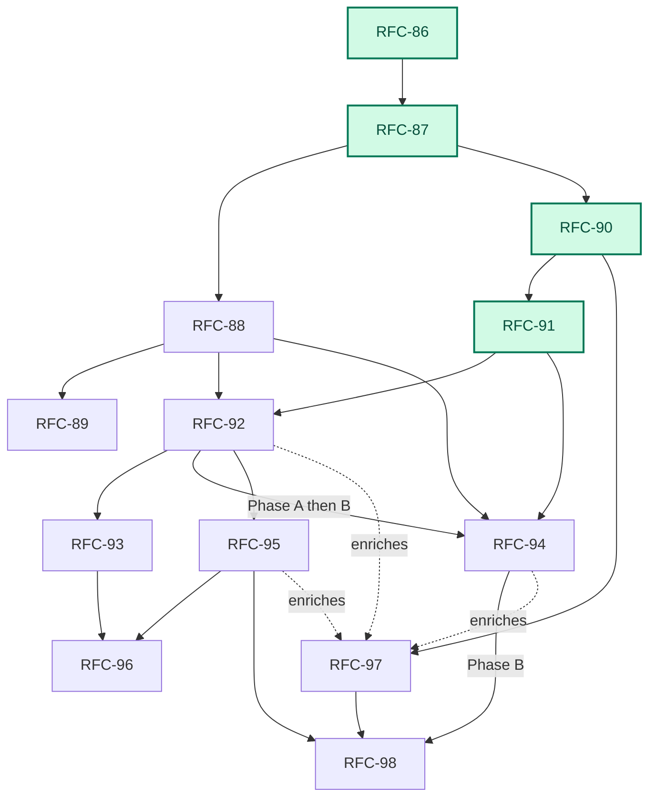

# Platform-Scale Migration

> Status: Planning spine for the RFC-86…RFC-94 platform series and the post-series verification, fleet, learning, and autonomy tracks ([RFC-95](rfc-95-native-verification.md) through [RFC-98](rfc-98-policy-gated-autonomy.md)). Each RFC owns its decisions; this document owns sequence and fit.
>
> Audience: contributors starting work on the series; operators evaluating what Emery is becoming

## The vision

Point Emery at a legacy system — a mobile app, a realtime platform, any estate of repositories that together comprise one product — and have it migrate that system: discover the repositories, profile them, survey every source, recursively decompose the result into bounded conflict domains, and execute the buildable leaves with a **swarm of concurrent agents** working across **multiple repositories** on **multiple nodes**, converging on verified, published changes.

Then keep changing that platform the same way, from a disposable change directory. Operators choose policy rather than another workflow: pause after topology, progressively refine while discovery continues, produce an unattended verified candidate, or authorize a fully policy-gated merge.

Do all of it with one Emery: the same binary, verbs, artifacts, and lifecycle on a single desktop and across a multi-node fleet. A desktop is the deployment with one journal writer and no remote, not a separate mode.

## Where we are

**Implemented:** RFC-86 (Change Facts), RFC-87 (Private Workspaces), RFC-90 (Build Verification), and RFC-91 (Refinement Stage). The engine now runs a fact-based workflow over private workspaces with an engine-owned build phase machine and a standalone refinement stage between plan authoring and execution.

**Remaining:** Product detach (RFC-88/89), progressive refinement (RFC-94 Phase A), concurrent candidate execution (RFC-92/94 Phase B), trustworthy verification (RFC-95), and governed learning/autonomy (RFC-97/98).

### Dependency map




## Target architecture

The architecture makes eight shifts to enable platform scale:

1. **State becomes facts.** A change is a self-contained, version-control-neutral fact tree.
2. **Trees become values.** Every operation starts from an immutable snapshot in a private workspace and captures another snapshot. No shared working directory crosses an operation.
3. **Location becomes disposable.** Plan authoring discovers and pins participating repositories; execution creates private workspaces on demand. Archive leaves only merged baselines and forge history.
4. **Build repair becomes engine-owned.** Generation, verification, repair, and review are separate target WIT operations in a bounded engine loop.
5. **Model work becomes explicit.** Plan authoring recursively partitions the scope until every leaf is buildable. During the build, targets propose a complete task graph for the engine to validate.
6. **Refinement becomes a fenced stage.** Serial plan-wide refinement covers reviewable bundles, moving to concurrent work items and frontiers.
7. **Progress is a policy, not a new workflow.** Branches are published and progressively refined, optionally building non-authoritative candidate frontiers. Unattended build uses exact policy admission.
8. **Learning is offline and versioned.** Retained outcomes become inert proposals and promoted future versions. In-flight work never rewrites its own instructions.


1. **State becomes facts.** A change is a self-contained, version-control-neutral fact tree. Workflow status is projected from those facts, so a hosted service never becomes lifecycle authority.
2. **Trees become values.** Every operation starts from an immutable snapshot in a private workspace and captures another snapshot. A code patch is the relation between the two; no shared working directory crosses an operation.
3. **Location becomes disposable.** Plan authoring can begin in an empty directory, discover the participating repositories, and record their exact revisions. Execution creates private workspaces on demand. Archive leaves only merged baselines and forge history.
4. **Build repair becomes engine-owned.** Generation, model-assisted verification, repair, and review become separate target WIT operations in a bounded engine loop rather than retries hidden in adapter prose. [RFC-95](rfc-95-native-verification.md) follows with deterministic native verification on the trusted host.
5. **Model work becomes explicit.** Plan authoring surveys the pinned source set and recursively partitions it until every terminal scope is a buildable slice. During the singular slice build, `target.decompose` proposes one complete task graph and the engine validates it before dispatch.
6. **Refinement becomes a fenced stage.** [RFC-91](rfc-91-refinement-stage.md) adds serial plan-wide refinement, covers complete reviewable refinement bundles, and moves target-base selection to wave open. [RFC-92](rfc-92-concurrent-execution.md) turns the serial loops into `(slice, phase, input-digest)` work items and concurrent frontiers.
7. **Progress is a policy, not another workflow.** [RFC-94](future/rfc-94-streaming-execution.md) publishes closed branches, progressively refines them, and optionally builds non-authoritative candidate frontiers. Manual review remains available; unattended build uses exact policy admission; accepted-CID mutation remains separate.
8. **Learning is offline and versioned.** [RFC-97](rfc-97-outcome-learning.md) turns retained outcomes into inert proposals and promoted future versions. [RFC-98](rfc-98-policy-gated-autonomy.md) permits unattended merge only under a pinned policy, protected evidence, native verification, exact commit admission, and bounded recovery.

### Scaling invariant

Emery scales by repeating one bounded pattern:

1. Start from immutable inputs.
2. Partition a scope into children.
3. Run independent children concurrently.
4. Converge their results before leaving the parent scope.

A **conflict domain** owns the dependency graph, concurrency bound, and local convergence gate for its children. It either partitions again or terminates as one buildable **slice**. Internal domains and agent tasks have no slice lifecycle; they only describe containment and convergence.

### Authority and records

Six records answer different questions to decouple state from lifecycle:

- `plan.execute.started`: Records exact closed-plan authorization.
- `plan.run.started`: Records a progressive run's scope, bound, and policy.
- **Member admission**: Records the exact refinement and gap state allowed to build.
- **Live claim**: Records which journal writer owns a leaf.
- **Build and domain facts**: Record the exact inputs and results consumed.
- **Commit admission**: Records why one closed wave may advance the accepted CID.


## The series

The tables list each RFC's hard dependencies and what it delivers. Step numbers are a **product-ownership / reading order** (fact substrate → workspace stem → product path, then scale), not a claim about landing chronology and not a single serial queue. [RFC-86](rfc-86-change-facts.md), [RFC-87](rfc-87-working-trees.md), and [RFC-90](rfc-90-build-verification.md) are **implemented**: the fact and workspace stem plus the engine-owned build phase machine. The remaining workspace stand-in is merge-time `apply` (deleted by [RFC-88](rfc-88-detached-changes.md)). RFC-88's recursive authoring contract remains the product branch; RFC-91 adds the serial review boundary and wave-time base, RFC-92 owns concurrent phase scheduling, RFC-94 pipelines closed branches through that scheduler, and RFC-93 optionally distributes it — see [Working in parallel](#working-in-parallel). Every RFC owns an independently testable delivery; later steps extend rather than predeclare its wire contract.

The landed authorization contract follows [RFC-86](rfc-86-change-facts.md) D6 / D17 as amended by [RFC-86a](rfc-86a-gap-deferral.md): starting `emery plan execute` appends `plan.execute.started` with typed coverage; there is no separate `approve` verb, no projected `approved` rung, and no silent skip of gaps — every open row is auto-deferred at the build gate as a durable, journaled `gap.deferred` fact (the `strict | defer` policy knob and the `plan defer` verb were deleted after RFC-86a landed). RFC-91 preserves that event, replaces spec-only coverage with complete refinement-manifest digests, and removes `refine-under-epoch`; `plan refine` creates no code-work grant. RFC-94 adds progressive run and member admission for unattended candidate work. RFC-98 alone extends policy admission to accepted-CID mutation.

### Product critical path — migrate and change a platform


| Step | RFC                                  | Title              | Delivers                                                                                                                                                                                                                                                                                       | Depends on                                      |
| ---- | ------------------------------------ | ------------------ | ---------------------------------------------------------------------------------------------------------------------------------------------------------------------------------------------------------------------------------------------------------------------------------------------- | ----------------------------------------------- |
| 1    | [RFC-86](rfc-86-change-facts.md)     | Change Facts       | The substrate: the change as a version-control-neutral fact tree, projected status, per-writer event logs, explicit execution-authorization epochs, pinned per-leaf inputs, immutable one-member target-wave commit, merge-finalized requirement identity, desktop as the degenerate deployment | —                                               |
| 2    | [RFC-87](rfc-87-working-trees.md)    | Private Workspaces | Immutable snapshots, disposable private workspaces, `prepare` / `capture` / `discard`, code patches as base/result relations, and separate writable-code/read-only-artifact access                                                                                                             | implemented 86 pin/epoch/wave facts; interim `apply` until 88 |
| 3    | [RFC-88](rfc-88-detached-changes.md) | Detached Changes   | Complete single-node migrate/change loop: generated source identities, deterministic selection, an ordinary directory as the disposable change home, GitHub discovery, capability-profile-bound conflict-domain decomposition, refinement feedback through focused child leads, a buildable leaf projection, and operation-local workspaces | implemented 86; implemented 87                  |
| 4    | [RFC-89](rfc-89-publication-sets.md) | Publication Sets   | Project seal: each final project snapshot becomes one local commit; publication identity binds those commits, branches, and PRs across repositories with ordered landing and archive verification                                                                                              | 88 (member derivation)                          |


### Scale track — staged and concurrent execution


| Step | RFC                                            | Title                 | Delivers                                                                                       | Depends on            |
| ---- | ---------------------------------------------- | --------------------- | ---------------------------------------------------------------------------------------------- | --------------------- |
| 5    | [RFC-90](rfc-90-build-verification.md)         | Build Verification    | **Implemented:** Engine-owned build loop, bounded repair policy, durable reports.              | 87                    |
| 6    | [RFC-91](rfc-91-refinement-stage.md)           | Refinement Stage      | **Implemented:** Serial plan-wide refinement (`plan refine`), reviewable refinement manifests, wave-time target bases, execute-time coverage. | 90                    |
| 7    | [RFC-92](rfc-92-concurrent-execution.md)       | Concurrent Execution  | Work item scheduling, concurrent frontiers, bottom-up convergence, multi-member target waves.  | 88, 91                |
| 8    | [RFC-93](rfc-93-distributed-execution.md)      | Distributed Execution | Distribution of completed RFC-92 model between nodes via operation offers and remote pools.    | 92                    |
| 9    | [RFC-94](future/rfc-94-streaming-execution.md) | Streaming Execution   | Phase A: publish/refine closed branches. Phase B: unattended candidate build, deferred commit. | A: 88, 91, 92A B: 92B |


### Verification, learning, and autonomy follow-ons


| RFC                                       | Title                        | Delivers                                                                | Depends on                  |
| ----------------------------------------- | ---------------------------- | ----------------------------------------------------------------------- | --------------------------- |
| [RFC-95](rfc-95-native-verification.md)   | Native Verification Profiles | Host-attested semantic checks, denied-by-default tool execution.        | 90, 92                      |
| [RFC-96](rfc-96-platform-readiness.md)    | Platform Readiness           | Hosted/fleet conformance, tenancy, capability-scoped workers.           | 93, 95                      |
| [RFC-97](rfc-97-outcome-learning.md)      | Outcome Learning             | Outcome records, inert improvement proposals, promoted future versions. | 90 (enriched by 92, 94, 95) |
| [RFC-98](rfc-98-policy-gated-autonomy.md) | Policy-Gated Autonomy        | Unattended merge under promoted policy, exact commit admission.         | 94B, 95, 97                 |


- **Implemented and in-flight RFCs stay frozen.** RFC-86 and RFC-90 are implemented substrates, and RFC-88 is the current implementation contract. RFC-91, RFC-94, RFC-97, and RFC-98 carry their changes as explicit forward patches; they do not revise those predecessor texts.
- **RFC-86 is product-ownership step 1 and is implemented** — the fact substrate every later step consumes (projected status, per-writer logs, `plan.execute.started`, recorded pins, one-member waves, `builds/<digest>.yaml`). Product acceptance closeout (S23) is complete. It deleted the mechanics later steps would otherwise have synchronized (stored status, the single journal file, synthesis-time identity, unrecorded execute starts) and delivered the shift-left refine / gap-gate flow.
- **RFC-87 is the shared workspace stem and has already landed.** Phase B retired build-time ambient freeze and `build/patch.yaml` against the `SnapshotId` / `prepare` / `capture` / `discard` contract. The remaining interim is merge-time `apply` (RFC-88 deletes it). Do not re-litigate whether workspaces “depend on finished 86.”
- **After the stem, the series is a braid, not two independent pipelines:** RFC-90's engine-owned build verification and repair orchestration is implemented; RFC-88 settles recursive authoring, while RFC-91 follows the 86/87/90 substrate with a serial specs-first stage, complete refinement coverage, and wave-time target bases. RFC-92 joins 88, 90, and 91 in two deliveries: Phase A replaces serial model-work cursors with a bounded scheduler and pool; Phase B adds target task graphs, composition, convergence, and waves. RFC-93 distributes the completed local model. RFC-89 publication and RFC-93 multi-node execution remain orthogonal.
- **RFC-91 is the staged-refinement prerequisite.** It owns the complete-plan review seam and exact manifest contract. It adds no approval state, so an automation may invoke refine and execute back to back over the same artifacts.
- **RFC-92 Phase A is an early reusable substrate.** It owns work-item identity, cancellation, the bounded pool, and concurrent survey/extract/refine before target decomposition or multi-member waves land.
- **RFC-94 is phased.** Phase A combines RFC-88 branch revisions, RFC-91 manifests, and RFC-92A to refine while authoring continues without code authority. Phase B waits for completed RFC-92 and adds policy-admitted candidate build, candidate dependency frontiers, and deferred commit. Neither phase waits on RFC-93.
- **RFC-95 is the native-verification follow-on.** It depends on 87, 90, and 92, may land beside 93/94, and supplies the host-attested assurance RFC-98 requires.
- **RFC-96 is the hosted/fleet readiness spine.** It consumes RFC-93 and worker capabilities including RFC-95; its own phase table remains authoritative.
- **RFC-97 can start from implemented RFC-90.** Outcome projection and diagnostic recurrence need no concurrent or hosted runtime; RFC-92, RFC-94, and RFC-95 enrich the same record as they land.
- **RFC-98 is last on the autonomy path.** It requires progressive candidates, host/protected verification, and promoted policy generations. It extends `plan run` through merge but leaves forge publication to RFC-89 and the operator.

## Working in parallel

With the foundational substrate (86/87/90) landed, independent tracks can proceed concurrently.


| Track                          | Sequence  | Status                             |
| ------------------------------ | --------- | ---------------------------------- |
| **Location / product**         | 88 → 89   | Ready to start                     |
| **Refinement**                 | 91        | Ready to start                     |
| **Concurrency / distribution** | 92 → 93   | 92A can start when 88/91 stabilize |
| **Progressive execution**      | 94A → 94B | 94A follows 88/91/92A              |
| **Learning / autonomy**        | 97 → 98   | 97 can start now                   |
| **Verification & Readiness**   | 95, 96    | Follows 92 / 93 respectively       |


*Note:* Collision points exist in the merge orchestration (which RFC-88 significantly impacts). Sequence these integrations explicitly rather than attempting to merge parallel structural changes.

## Orchestration policies

**Within RFC-86** (implemented): Phase A (per-writer logs, projection kernel, claim/retraction facts) in `crates/project`; Phase B (slice-scoped requirement ids, `MODIFIED` base digests, merge-time finalization, recorded pins, `BuildRecord`, one-member waves) in `crates/slice`; Phase C (`plan.execute.started`, gap gate, multi-writer) on top of A. The shared contract is the merge / wave fact that records the identity map. Remaining series stand-ins live outside this stem: flat `.emery/` change home (RFC-88 moves it) and merge-time `apply` (RFC-88 deletes it).

**Migrate** and **change** differ only in authoring scope (discovering repositories via fingerprint vs explicit project membership). Both feed the same policy paths:

### 1. Reviewed policy

```text
emery plan author     →  initialize the detached home when needed; discover and pin
                         targets/sources; recursively decompose surveyed leads;
                         project buildable leaves into plan.yaml
operator may review   →  inspect and amend topology
emery plan refine     →  serially extract and synthesize every leaf in topological order;
                         persist complete refinement manifests; stop before product code
operator may review   →  read specs and gaps; correct inputs and re-refine as needed
emery plan execute    →  cover the exact refinement manifests;
                         enforce gap/status gates before build (open gaps auto-defer at
                         the gate as durable gap.deferred facts — RFC-86a as amended);
                         prepare private workspaces on demand (RFC-87); execute leaves;
                         commit target waves (RFC-88);
                         converge domains and extend waves across ready leaves (RFC-92);
                         seal each drained target's final CID (RFC-89)
operator publishes    →  push sealed branches; open and merge PRs
emery plan archive    →  verify the publication set (RFC-89); archive
rm -rf <dir>
```


### 2. Progressive specs-only policy

```text
emery plan run --publication progressive --through refined
  → publish validated closed branches while surveys continue
  → refine ready leaves through the concurrent pool
  → close final plan, stop before any product workspace or code grant
```


### 3. Unattended candidate policy

```text
emery plan run --publication progressive --through built --policy <run-profile>
  → author and refine progressively
  → admit exact clean manifests under recorded policy
  → build leaves through candidate frontiers with engine-owned verification
  → stop with non-authoritative candidates; accepted CIDs unchanged
```


### 4. Policy-gated autonomy

```text
emery plan run --publication progressive --through merged --policy <autonomy-profile>
  → require final closure, no unknowns/conflicts, protected assurance
  → write exact commit admission for each wave
  → merge and seal locally; forge publication remains operator-owned
```


## Outside the series

Unchanged and orthogonal — not part of this arc, not blocked by it:

- **[CLI architecture](../docs/contributing/cli-architecture.md)** / `crates/launcher/` — shipped deployment.
- **[Release process](../docs/release.md)** — operational policy for releasing Emery.
- **[RFC-18 Specialized SLM Code Generation](future/rfc-18-slm.md)** — optional cost lever.
- **[RFC-46a Web Asset Materialization](future/rfc-46a-web-asset.md)** — content-triggered vectis work.

