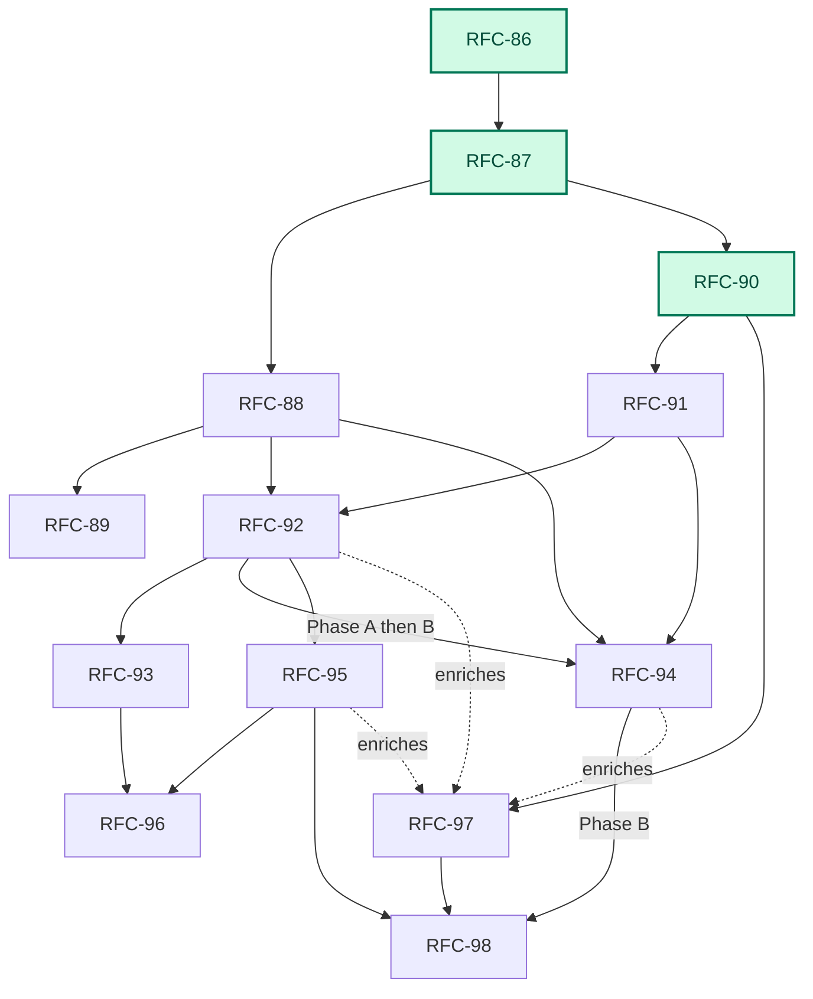
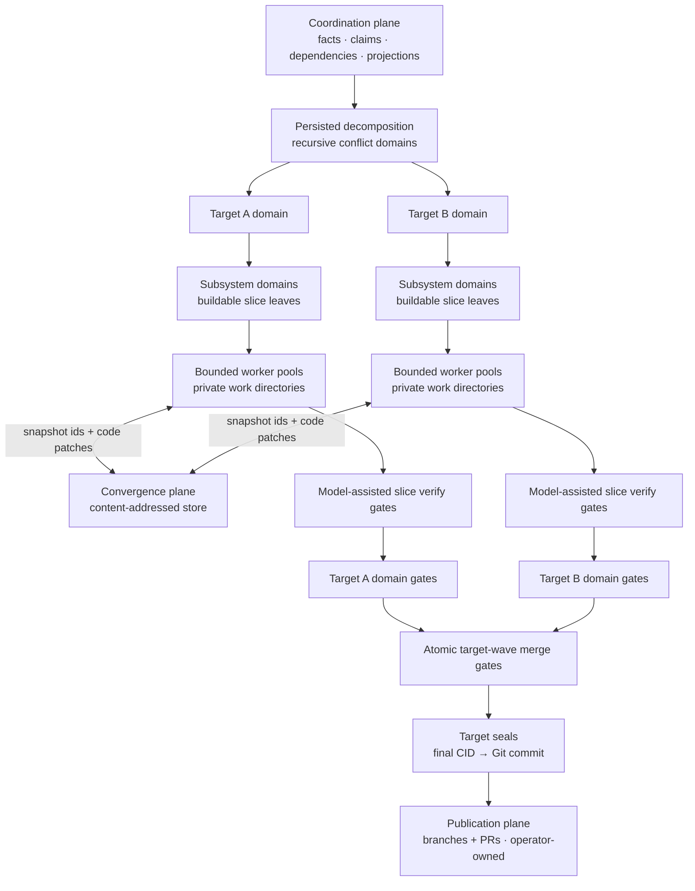

# Next Stage: Platform-Scale Migration

> Status: Planning spine for the RFC-86…RFC-94 platform series and the post-series verification, fleet, learning, and autonomy tracks ([RFC-95](rfc-95-native-verification.md) through [RFC-98](rfc-98-policy-gated-autonomy.md)). Each RFC owns its decisions; this document owns sequence and fit. RFC numbers follow product ownership, while landing follows the dependency braid below.
>
> Audience: contributors starting work on the series; operators evaluating what Emery is becoming

## The vision

Point Emery at a legacy system — a mobile app, a realtime platform, any estate of repositories that together comprise one product — and have it migrate that system: discover the repositories, profile them, survey every source, recursively decompose the result into bounded conflict domains, and execute the buildable leaves with a **swarm of concurrent agents** working across **multiple repositories** on **multiple nodes**, converging on verified, published changes.

Then keep changing that platform the same way, from a disposable change directory — prior context intentionally thin (forge authentication and organisation plus source material). When a change needs a repository that does not yet exist, the operator creates it on the forge with `product:` membership before authoring; Emery discovers and pins it but does not provision it.

Concretely, the exemplar workload is a migration the size of AT's mobile app or AT's realtime platform: tens of repositories, hundreds of slices, weeks of wall-clock — infeasible as today's serial, single-repo, operator-tended loop, and exactly what the series below makes routine.

Operators choose policy rather than another workflow: pause after topology, progressively refine while discovery continues, produce an unattended verified candidate, or authorize a fully policy-gated merge. The work items, artifacts, facts, and lifecycle remain the same.

Across changes, Emery learns from outcomes without mutable agent memory. It aggregates diagnostic and assurance records offline, proposes bounded prompt/policy/model improvements, evaluates them against blind cases, and publishes new pinned versions for future runs. In-flight work never rewrites its own instructions or gates.

And do all of it with one Emery: the same binary, verbs, artifacts, and lifecycle on a single desktop and across a multi-node fleet — the engine guest is location-neutral by construction (a Wasm component whose deployment differences live in providers and the launcher), and [RFC-86](rfc-86-change-facts.md) makes the workflow state location-neutral to match. A desktop is the deployment with one journal writer and no remote, not a separate mode.

Everything Emery already is stays load-bearing: the slice loop (`refine → build → merge`), artifact authority, the journal's closed event taxonomy as the audit trail, adapter seams over WIT, operator-owned publication. The series scales those invariants out; it does not replace them.

## Where we are

RFC-86, RFC-87, and RFC-90 are implemented: per-writer facts, `plan.execute.started`, recorded pins, one-member waves, `BuildRecord`s, private `prepare` / `capture` / `discard` workspaces, and the engine-owned `build → verify ⇄ repair → review ⇄ repair` phase machine with durable reports. The current direct execute path can refine and build without a human specification pause, but it is one serial cursor, cannot stop after complete refinement through a public plan verb, and verifies primarily through model-reported checks. What remains is product detach (RFC-88/89), explicit and progressive refinement (RFC-91/94 Phase A), concurrent candidate execution (RFC-92/94 Phase B), trustworthy verification (RFC-95), and governed learning/autonomy (RFC-97/98).

### Dependency map

Green marks an implemented RFC.



## Target architecture

The architecture makes eight related shifts:

1. **State becomes facts.** A change is a self-contained, version-control-neutral fact tree. Workflow status is projected from those facts, so a hosted service never becomes lifecycle authority.
2. **Trees become values.** Every operation starts from an immutable snapshot in a private workspace and captures another snapshot. A code patch is the relation between the two; no shared working directory crosses an operation.
3. **Location becomes disposable.** Plan authoring can begin in an empty directory, discover the participating repositories, and record their exact revisions. Execution creates private workspaces on demand. Archive leaves only merged baselines and forge history.
4. **Build repair becomes engine-owned.** Generation, model-assisted verification, repair, and review become separate target WIT operations in a bounded engine loop rather than retries hidden in adapter prose. [RFC-95](rfc-95-native-verification.md) follows with deterministic native verification on the trusted host.
5. **Model work becomes explicit.** Plan authoring surveys the pinned source set and recursively partitions it until every terminal scope is a buildable slice. During the singular slice build, `target.decompose` proposes one complete task graph and the engine validates it before dispatch.
6. **Refinement becomes a fenced stage.** [RFC-91](rfc-91-staged-refinement.md) adds serial plan-wide refinement, covers complete reviewable refinement bundles, and moves target-base selection to wave open. [RFC-92](rfc-92-concurrent-execution.md) turns the serial loops into `(slice, phase, input-digest)` work items and concurrent frontiers.
7. **Progress is a policy, not another workflow.** [RFC-94](future/rfc-94-streaming-execution.md) publishes closed branches, progressively refines them, and optionally builds non-authoritative candidate frontiers. Manual review remains available; unattended build uses exact policy admission; accepted-CID mutation remains separate.
8. **Learning is offline and versioned.** [RFC-97](rfc-97-outcome-learning.md) turns retained outcomes into inert proposals and promoted future versions. [RFC-98](rfc-98-policy-gated-autonomy.md) permits unattended merge only under a pinned policy, protected evidence, native verification, exact commit admission, and bounded recovery.

### Scaling invariant

Emery scales by repeating one bounded pattern:

1. start from immutable inputs;
2. partition a scope into children;
3. run independent children concurrently;
4. converge their results before leaving the parent scope.

A **conflict domain** is one such parent scope: child results may interact inside it, so the domain owns their dependency graph, ownership envelope, concurrency bound, and local convergence gate. A domain either partitions again or terminates as one buildable slice. Inside that slice, one target-provided `decompose` operation proposes a complete graph of path-owned agent tasks for engine validation and execution.

This gives Emery recursive planning and graph-shaped build execution without introducing nested workflows:

- **Planning recursion** turns the surveyed estate into conflict domains and buildable slice leaves.
- **Build decomposition** turns one slice into a complete graph of focused agent tasks through one target-provided operation, then converges them into one explicitly gated slice result.

Internal domains and agent tasks have no slice lifecycle, claim, or nested plan. They only describe containment and convergence.

### Evidence and iteration posture

The first cut optimizes for a legible harness, not maximum agent activity. Concurrency, commit count, and model-call count are not success measures by themselves. Evaluation compares the cap-one reference path and concurrent path with the same inputs, models, and time budget, then projects outcome and coordination cost from retained facts and phase events: merged requirements and accepted CIDs, time to first refined leaf, candidate build, and accepted result, model tokens and cost when the backend reports them, speculative discard, re-decomposition, residual findings, amendment proposals, touched-path heat, fan-in pressure, and generated structure size.

Lifecycle verification and harness grading stay separate. RFC-92's protected inputs prevent workers from changing admission-covered tests or fixtures, but material visible to build or verification agents is not held out. Live evaluation therefore keeps a blind acceptance set outside every planning, build, repair, review, and verification context. It grades harness and model changes; it never becomes workflow authority or a hidden production gate.

The shipped policy remains deliberately simple: one project model by default, fixed engine repair budgets, complete-plan publication, and operator-applied amendments. RFC-90 and RFC-92 record enough raw timing, routing, usage, and failure evidence to compare alternatives. RFC-94 adds progressive policy without making activity a verdict. RFC-97 aggregates outcomes and promotes new pinned versions only after blind evaluation; RFC-98 consumes those versions but never changes them during a run. No cost, quality metric, historical success rate, or learned observation changes lifecycle or authority directly.

#### Planning: hierarchy first, executable leaves second

Plan authoring persists the full hierarchy in `decomposition.yaml`. The executable `plan.yaml` is its deterministic leaf projection:

- `slices[]` contains exactly the terminal domains;
- domain dependencies compile into leaf `depends-on` edges;
- `decomposition-digest` binds the flat executable graph to the exact hierarchy.

The engine owns the loop: **partition → validate → recurse → project**. Judgment may propose a typed `split` or `leaf`, but the engine accepts a split only when it preserves source-lead coverage, reduces a deterministic scope measure, stays within depth and node budgets, and resolves sibling interaction through disjoint ownership, an explicit dependency, or a fan-in leaf. Uncertain boundaries remain review findings.

#### Execution: bounded waves, bottom-up convergence

Ready leaves run in private workspaces. Results move upward through their recorded domain ancestry:

- task results compose before passing the slice's engine-owned model-assisted verification gate;
- same-target child patches compose at their nearest domain;
- multi-target domains aggregate target results and dependency health without mixing repository trees;
- every completed gate writes an immutable domain-round record for retry or remote resume.

One target wave consumes one accepted CID and commits the next. Independent, disjoint leaves may share a wave; dependent leaves run in later waves. Shared paths become an explicit dependency or fan-in leaf—never an implicit text merge. One atomic committed fact records the complete member set and final CID, so no partial wave becomes authoritative. The one-member case is the ordinary slice merge.

A progressive candidate batch uses the same bounded same-base antichain and composition kernel but is not a wave. It advances only an inert candidate frontier; serial dependants build in later candidate batches against the preceding result. Waves and accepted `complete` domain rounds appear only when exact manual or RFC-98 policy commit authorization exists.

A failure blocks only its domain and dependants. Runtime overlap produces an inert amendment proposal; by default only an operator-invoked compare-and-set may revise the decomposition and leaf projection. RFC-98 may pre-authorize one narrow scope-preserving amendment kind under the same compare-and-set and a bounded counter. When a target drains, one project seal turns its final CID into a Git commit for operator-owned publication.

#### Authority: grant, claim, and input fence

Six records answer different questions:

- `plan.execute.started` records exact closed-plan authorization;
- `plan.run.started` records a progressive run's scope, bound, and policy;
- member admission records the exact refinement and gap state allowed to build;
- a live claim records which journal writer owns a leaf;
- build and domain facts record the exact inputs and results consumed;
- commit admission records why one closed wave may advance the accepted CID.

RFC-91 keeps `plan.execute.started` as manual closed-plan build-and-commit authorization over exact refinement manifests. RFC-94 adds parent policy grants and per-member admission, but stops unattended runs at `built`; candidate frontiers never mutate accepted state. RFC-98 adds exact policy-gated commit admission after final closure and host/protected verification. No grant may waive a conflict or unknown implicitly. A claim, completed build, historical success rate, or projected `in-progress` status never grants execution or commit authority.



Outcome learning is a side loop, not an execution edge: terminal facts project outcome records; offline analysis and blind evaluation may publish a new adapter, policy, model route, or engine version; only a future run can select that version.


## The series

The tables list each RFC's hard dependencies and what it delivers. Step numbers are a **product-ownership / reading order** (fact substrate → workspace stem → product path, then scale), not a claim about landing chronology and not a single serial queue. [RFC-86](rfc-86-change-facts.md), [RFC-87](rfc-87-working-trees.md), and [RFC-90](rfc-90-build-verification.md) are **implemented**: the fact and workspace stem plus the engine-owned build phase machine. The remaining workspace stand-in is merge-time `apply` (deleted by [RFC-88](rfc-88-detached-changes.md)). RFC-88's recursive authoring contract remains the product branch; RFC-91 adds the serial review boundary and wave-time base, RFC-92 owns concurrent phase scheduling, RFC-94 pipelines closed branches through that scheduler, and RFC-93 optionally distributes it — see [Working in parallel](#working-in-parallel). Every RFC owns an independently testable delivery; later steps extend rather than predeclare its wire contract.

The landed authorization contract follows [RFC-86](rfc-86-change-facts.md) D6 / D17: starting `emery plan execute` appends `plan.execute.started` with typed coverage; there is no separate `approve` verb, no projected `approved` rung, and no silent auto-waive of gaps. RFC-91 preserves that event, replaces spec-only coverage with complete refinement-manifest digests, and removes `refine-under-epoch`; `plan refine` creates no code-work grant. RFC-94 adds progressive run and member admission for unattended candidate work. RFC-98 alone extends policy admission to accepted-CID mutation.

### Product critical path — migrate and change a platform


| Step | RFC                                  | Title              | Delivers                                                                                                                                                                                                                                                                                       | Depends on                                      |
| ---- | ------------------------------------ | ------------------ | ---------------------------------------------------------------------------------------------------------------------------------------------------------------------------------------------------------------------------------------------------------------------------------------------- | ----------------------------------------------- |
| 1    | [RFC-86](rfc-86-change-facts.md)     | Change Facts       | The substrate: the change as a version-control-neutral fact tree, projected status, per-writer event logs, explicit execution-authorization epochs, pinned per-leaf inputs, immutable one-member target-wave commit, merge-finalized requirement identity, desktop as the degenerate deployment | —                                               |
| 2    | [RFC-87](rfc-87-working-trees.md)    | Private Workspaces | Immutable snapshots, disposable private workspaces, `prepare` / `capture` / `discard`, code patches as base/result relations, and separate writable-code/read-only-artifact access                                                                                                             | landed 86 pin/epoch/wave facts; interim `apply` until 88 |
| 3    | [RFC-88](rfc-88-detached-changes.md) | Detached Changes   | Complete single-node migrate/change loop: generated source identities, deterministic selection, an ordinary directory as the disposable change home, GitHub discovery, capability-profile-bound conflict-domain decomposition, refinement feedback through focused child leads, a buildable leaf projection, and operation-local workspaces | completed 86; landed 87                         |
| 4    | [RFC-89](rfc-89-publication-sets.md) | Publication Sets   | Project seal: each final project snapshot becomes one local commit; publication identity binds those commits, branches, and PRs across repositories with ordered landing and archive verification                                                                                              | 88 (member derivation)                          |


### Scale track — staged and concurrent execution


| Step | RFC                                      | Title                | Delivers                                                                                                                                                                                                                                                                                                               | Depends on                   |
| ---- | ---------------------------------------- | -------------------- | ---------------------------------------------------------------------------------------------------------------------------------------------------------------------------------------------------------------------------------------------------------------------------------------------------------------------- | ---------------------------- |
| 5    | [RFC-90](rfc-90-build-verification.md)   | Build Verification   | Engine-owned build loop over separate `build` / `repair` / `verify` / `review` WIT ops; bounded repair policy; durable intermediate reports; final report assembly; deterministic native verification handed to [RFC-95](rfc-95-native-verification.md)                                                                      | completed 87                 |
| 6    | [RFC-91](rfc-91-staged-refinement.md)    | Staged Refinement    | First-class serial plan-wide refinement without code generation; phase-relative refinement readiness; complete reviewable refinement manifests; execute-time manifest coverage; wave-time target bases; no execute-time implicit refinement | completed 86, 87, 90 |
| 7    | [RFC-92](rfc-92-concurrent-execution.md) | Concurrent Execution | Complete single-node engine-orchestrated swarm: `(slice, phase, input-digest)` scheduling, local operation claims, concurrent refinement and leaf frontiers, profile-sized target tasks, engine-owned graph validation and execution, write ownership, deterministic code-patch composition, durable domain rounds, bottom-up convergence, multi-member target waves, and synthesis payload restructuring | completed 86, 87, 88, 90, 91 |
| 8    | [RFC-93](rfc-93-distributed-execution.md) | Distributed Execution | Distribution of the completed RFC-92 model: fact, artifact, and value transport between nodes; operation offers, lease-backed claims, ownership generations, hosted trees, and remote pools — no new scheduling policy, convergence, acceptance, authority, or lifecycle semantics | completed 86, 87, 88, 90, 91, 92 |
| 9    | [RFC-94](future/rfc-94-streaming-execution.md) | Streaming Execution | Phase A: publish and refine closed branches through RFC-92's scheduler while authoring continues, with no code grant. Phase B: policy-admitted unattended candidate build, candidate dependency frontiers, exact invalidation, and deferred commit | Phase A: completed 88, 91, 92A; Phase B: completed 92 (orthogonal to 93) |

### Verification, learning, and autonomy follow-ons

| RFC | Title | Delivers | Depends on |
| --- | --- | --- | --- |
| [RFC-95](rfc-95-native-verification.md) | Native Verification Profiles | Host-attested semantic checks, protected assurance, denied-by-default tool execution, and verification lineage | 87, 90, 92 |
| [RFC-96](rfc-96-platform-readiness.md) | Platform Readiness | Hosted/fleet conformance, tenancy, adapter values and locks, capability-scoped workers, secrets, ingress, and deployment roots | 93 plus worker capabilities including 95 |
| [RFC-97](rfc-97-outcome-learning.md) | Outcome Learning | Outcome records, diagnostic recurrence, bounded observations, inert improvement proposals, blind evaluation, and promoted future versions | implemented 90; enriched by 92, 94, 95 |
| [RFC-98](rfc-98-policy-gated-autonomy.md) | Policy-Gated Autonomy | Unattended merge under promoted policy, exact commit admission, host/protected assurance, bounded recovery, and standing amendment rules | 94B, 95, 97 |


### Sequencing notes

- **Implemented and in-flight RFCs stay frozen.** RFC-86 and RFC-90 are implemented substrates, and RFC-88 is the current implementation contract. RFC-91, RFC-94, RFC-97, and RFC-98 carry their changes as explicit forward patches; they do not revise those predecessor texts.
- **RFC-86 is product-ownership step 1 and is implemented** — the fact substrate every later step consumes (projected status, per-writer logs, `plan.execute.started`, recorded pins, one-member waves, `builds/<digest>.yaml`). It deleted the mechanics later steps would otherwise have synchronized (stored status, the single journal file, synthesis-time identity, unrecorded execute starts) and delivered the shift-left refine / gap-gate flow.
- **RFC-87 is the shared workspace stem and has already landed.** Phase B retired build-time ambient freeze and `build/patch.yaml` against the `SnapshotId` / `prepare` / `capture` / `discard` contract. The remaining interim is merge-time `apply` (RFC-88 deletes it). Do not re-litigate whether workspaces “depend on finished 86.”
- **After the stem, the series is a braid, not two independent pipelines:** RFC-90's engine-owned build verification and repair orchestration is implemented; RFC-88 settles recursive authoring, while RFC-91 follows the 86/87/90 substrate with a serial specs-first stage, complete refinement coverage, and wave-time target bases. RFC-92 joins 88, 90, and 91 in two deliveries: Phase A replaces serial model-work cursors with a bounded scheduler and pool; Phase B adds target task graphs, composition, convergence, and waves. RFC-93 distributes the completed local model. RFC-89 publication and RFC-93 multi-node execution remain orthogonal.
- **RFC-91 is the staged-refinement prerequisite.** It owns the complete-plan review seam and exact manifest contract. It adds no approval state, so an automation may invoke refine and execute back to back over the same artifacts.
- **RFC-92 Phase A is an early reusable substrate.** It owns work-item identity, cancellation, the bounded pool, and concurrent survey/extract/refine before target decomposition or multi-member waves land.
- **RFC-94 is phased.** Phase A combines RFC-88 branch revisions, RFC-91 manifests, and RFC-92A to refine while authoring continues without code authority. Phase B waits for completed RFC-92 and adds policy-admitted candidate build, candidate dependency frontiers, and deferred commit. Neither phase waits on RFC-93.
- **RFC-95 is the native-verification follow-on.** It depends on 87, 90, and 92, may land beside 93/94, and supplies the host-attested assurance RFC-98 requires.
- **RFC-96 is the hosted/fleet readiness spine.** It consumes RFC-93 and worker capabilities including RFC-95; its own phase table remains authoritative.
- **RFC-97 can start from implemented RFC-90.** Outcome projection and diagnostic recurrence need no concurrent or hosted runtime; RFC-92, RFC-94, and RFC-95 enrich the same record as they land.
- **RFC-98 is last on the autonomy path.** It requires progressive candidates, host/protected verification, and promoted policy generations. It extends `plan run` through merge but leaves forge publication to RFC-89 and the operator.

## Working in parallel

Product-ownership edges stay as the tables and diagram above; landing chronology already split the stem. RFC-91 follows implemented 86/87/90. RFC-92A starts when RFC-88's decomposition records and RFC-91's manifest identity are stable; RFC-94A may then land progressive refinement while RFC-92B completes build concurrency. RFC-97 outcome projection can proceed independently from RFC-90 records.

**Staffing after the stem.** RFC-87's workspace contract is already stable enough for the fan-out:


| Track                      | Owner          | Sequence | Notes                                                                                                     |
| -------------------------- | -------------- | -------- | --------------------------------------------------------------------------------------------------------- |
| Location / product         | Team A         | 88 → 89  | Detached change home, recursive decomposition, leaf/member bindings, then project seal / publication sets |
| Verification               | Team B         | 90 → 91  | Engine build phase machine, then serial staged refinement manifests, execute coverage, and wave-time bases; 90 proceeds parallel with RFC-88 |
| Concurrency / distribution | Team C (later) | 92 → 93  | Add the local phase scheduler and operation claims in 92; distribute only that completed local model in 93 |
| Native verification        | Team B (later) | 95 after 90+92 | Parallel with 93/94; joins RFC-96 Phase C — see [Sequencing notes](#sequencing-notes)                      |
| Hosted readiness           | later          | 96 after 93 | Phase A may ride beside late 88/89; Phase C ∥ 95 — phase table lives in RFC-96                             |
| Progressive execution      | Team C         | 94A → 94B | Refine closed branches after 88+91+92A; add unattended candidates after 92B                               |
| Learning / autonomy        | Team D         | 97 → 98  | Outcome records may start from 90; policy-gated merge waits on 94B+95+97                                  |


**RFC-86 ∥ RFC-87 — narrowing the stem.** Landing confirmed the coupling was always narrower than “completed 86 before any 87 work”: 87 shipped first with stand-ins; Phase B then retired freeze-at-build and `patch.yaml`. RFC-86 lives in the state layer: `crates/project/src/journal.rs` (per-writer logs), the projection kernels in `crates/project/src/plan/model/state.rs` and `crates/project/src/slice/lifecycle.rs`, `IdAllocator` in `crates/slice/src/synthesis/project.rs`, and the execute-start / claim surfaces in `crates/change`. RFC-87 lives in the tree/value layer: `prepare` / `capture` / `discard`, private workspaces, and a snapshot store (replacing the former `WorkingTree::live()` dispatch sites). The tracks meet at exactly two seams:

1. **Snapshot and result identity** — RFC-86 records snapshot pins and result facts (`base.yaml`, `builds/<digest>.yaml`, wave digests); RFC-87 consumes the pins and returns `{ base snapshot, result snapshot, touched paths }`.
2. **Pin authorship timing** — source snapshots close at plan authoring or detached discovery. The landed cut currently freezes the product tree into refine-time `base.yaml`; RFC-91 splits that record so refinement pins source/planning/baseline inputs and wave open records the then-current target base before `prepare`. No build consumes an unrecorded ambient tree.

**Within RFC-86**, Phase A–C are landed: Phase A (per-writer logs, projection kernel, claim/retraction facts) in `crates/project`; Phase B (slice-scoped requirement ids, `MODIFIED` base digests, merge-time finalization, recorded pins, `BuildRecord`, one-member waves) in `crates/slice`; Phase C (`plan.execute.started`, gap gate, multi-writer) on top of A. The shared contract is the merge / wave fact that records the identity map. Remaining series stand-ins live outside this stem: flat `.emery/` change home (RFC-88 moves it) and merge-time `apply` (RFC-88 deletes it).

**Slack absorber** — RFC-89's record design remains real work with no ordering constraint on the scale-track edge, though its implementation genuinely needs RFC-88's member bindings. RFC-90 previously occupied the parallel verification branch and is now implemented.

**Collision points** — sequence explicitly, don't parallelize: the merge orchestration (`crates/slice/src/orchestrate/merge/` — wave commit + identity finalization over the landed workspace tree; RFC-88 removes `apply`), and RFC-88 itself — the convergence point needing the fact tree as the change home *and* operation-local workspaces.

## Two operator jobs, four policies, one work graph

**Migrate** and **change** differ only in authoring scope. Migrate criteria fingerprint shallow source trees through RFC-88's exact-one source selector and propose bindings onto discovered targets (new forge repos are operator-created with `product:` membership before authoring). Change criteria survey the organisation for repositories whose `.emery/project.yaml` declares `product:` membership ids. Both feed the same branch records, refinement manifests, phase work items, candidates, and waves.

The ordinary reviewed policy is:

```text
emery plan author     →  initialize the detached home when needed; discover and pin
                         targets/sources; recursively decompose surveyed leads;
                         project buildable leaves into plan.yaml
operator may review   →  inspect and amend topology
emery plan refine     →  serially extract and synthesize every leaf in topological order;
                         persist complete refinement manifests; stop before product code
operator may review   →  read specs and gaps; correct inputs and re-refine as needed
emery plan execute    →  cover the exact refinement manifests;
                         enforce gap/status gates before build (explicit --waive only);
                         prepare private workspaces on demand (RFC-87); execute leaves;
                         commit target waves (RFC-88);
                         converge domains and extend waves across ready leaves (RFC-92);
                         seal each drained target's final CID (RFC-89)
operator publishes    →  push sealed branches; open and merge PRs
emery plan archive    →  verify the publication set (RFC-89); archive
rm -rf <dir>
```

The progressive specs-only policy is:

```text
emery plan run --publication progressive --through refined
  → publish validated closed branches while other surveys continue
  → refine ready leaves through the RFC-92A pool
  → close the final plan and every surviving refinement manifest
  → stop before any product workspace or code grant
```

The unattended candidate policy is:

```text
emery plan run --publication progressive --through built --policy <run-profile>
  → author and refine progressively
  → admit exact clean manifests under the recorded policy
  → build independent and dependent leaves through candidate frontiers
  → verify and repair through engine-owned budgets
  → stop with non-authoritative candidates; accepted CIDs unchanged
```

The policy-gated autonomy follow-on is:

```text
emery plan run --publication progressive --through merged --policy <autonomy-profile>
  → require final closure, no unknowns/conflicts, protected and host assurance
  → write exact commit admission for each wave
  → run bounded recovery or stop
  → merge and seal locally; forge publication remains operator-owned
```

These are orchestration policies, not lifecycle variants. There is no `approved` state. Manual review is optional until a policy requires an operator gesture; unattended policy never pretends review occurred. Claims remain ownership, and learning affects only future pinned policy generations.

The built bound accepts an RFC-94 `run` policy. The merged bound requires an RFC-97-promoted RFC-98 `autonomy` policy; the resolver never upgrades one kind because the same flag name was used.

## Outside the series

Post-series follow-ons — edges and parallelization are in [Sequencing notes](#sequencing-notes); none is a numbered product-ownership or scale-track step:

- **[RFC-95 Native Verification Profiles](rfc-95-native-verification.md)** (future) — deterministic host-tool verification after 90+92; parallel with 93/94; joins [RFC-96](rfc-96-platform-readiness.md) Phase C as a worker capability.
- **[RFC-96 Platform Readiness](rfc-96-platform-readiness.md)** (draft) — hosted/fleet readiness spine after RFC-93: Omnia conformance gates, adapter values and fleet locks, capability-scoped workers, model/secret/ingress host policy, and multi-tenant deployment roots. Does not redefine claims, lifecycle, or convergence.
- **[RFC-97 Outcome Learning](rfc-97-outcome-learning.md)** (draft) — deterministic outcome records, recurrence analysis, bounded advisory observations, inert improvement proposals, blind evaluation, and promoted versions for future runs.
- **[RFC-98 Policy-Gated Autonomy](rfc-98-policy-gated-autonomy.md)** (draft) — unattended accepted-CID mutation under promoted policy, exact commit admission, protected/native assurance, bounded recovery, and narrow standing amendments.

Unchanged and orthogonal — not part of this arc, not blocked by it:

- **[CLI architecture](../docs/contributing/cli-architecture.md)** / [`crates/launcher`](../crates/launcher/) — shipped deployment (embedded engine, fail-closed resolver, pull-on-miss); remaining: persisted resolution record and `deployment show|doctor`.
- **[Release process](../docs/release.md)** — operational policy for releasing Emery itself; its WIT-breaking shape becomes RFC-89's first in-house publication set.
- **[RFC-18 Specialized SLM Code Generation](future/rfc-18-slm.md)** (future) — an optional cost lever behind RFC-92's per-task model-selection hook; a ratchet rung, not a stage.
- **[RFC-46a Web Asset Materialization](future/rfc-46a-web-asset.md)** (future) — content-triggered vectis work, independent of this series.

Known external reference: `augentic/remedium` RFC-81 cites "RFC-82" for what is now RFC-89's publication-set record; update that citation when next touching that repo.

### Evidence-triggered policy

Three agent-swarm learnings now have explicit homes without expanding the implemented 86/87/90 substrate:

- **Semantic decision ownership** — RFC-97 may report recurring split-brain decisions and propose one scoped owner; durable product `decisions/` remain operator-promoted and digest-bind dependants.
- **Bounded shared learning** — RFC-97 owns immutable, line-, scope-, and expiry-bounded observations below artifacts in authority. There is no mutable ambient Field Guide.
- **Earlier partial execution** — RFC-94 Phase A owns progressive refinement after 88+91+92A; Phase B owns policy-admitted candidate build after completed 92. Candidate work never implies commit.