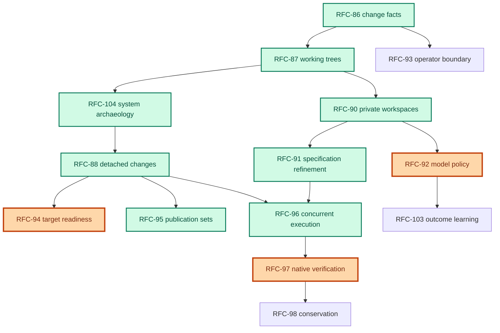

# Services Delivery Programme

> Status: Planning spine for the active RFC-86…RFC-98 / RFC-103 / RFC-104 programme. RFC-88, RFC-95, RFC-96, and RFC-104 are implemented. RFC-99 through RFC-102 are parked and excluded from the active dependency map. RFC-106 is evidence-gated and excluded from the active dependency map. Next gap is RFC-92. Each RFC owns its decisions; this document owns delivery sequence, programme state, and fit.
>
> Business direction: Propellerhead builds and changes critical software without losing the behaviour, knowledge, and trust the organisation depends on.
>
> Audience: contributors choosing what to build next and operators evaluating what Emery is becoming

## Direction

The programme supports one services promise:

> **Establish or recover what a critical system must do, deliver it in bounded, reviewable waves, and preserve the result as the basis for future change.**

Modernization is the commercial wedge. A new system is the simpler evidence case: authoritative intent establishes the baseline instead of archaeology recovering one. Emery is the delivery system behind the promise, not the product strategy. The immediate goal is the smallest single-node system that can recover a bounded estate, deliver one reviewed wave, and leave living behavioural and architectural baselines.

Services expertise supplies architectural and exception judgment; Emery records evidence, decisions, and consequences. Bounded single-node concurrency is in scope. Intra-slice task graphs ([RFC-106](future/rfc-106-task-graphs.md)), streaming, distribution, hosted fleets, and unattended merge are not prerequisites. Multi-node, fat-slice decomposition, and unattended scale activate on measured engagement pull, not architectural completeness.

## Active dependency map

Only hard dependencies appear here. Enrichment relationships belong in prose and outcome schemas, not in the graph. Green = done; orange = near-term critical path; blue = later critical path.



RFC-92 patches the model-capability profile shape owned by implemented RFC-88: routes and usage facts land on the implemented substrate and fold into the profile.

## Where we are

**Implemented:** RFC-86, RFC-87, RFC-88, RFC-90, RFC-91, RFC-95, RFC-96, RFC-104. Fact-based workflow over private workspaces, with an engine-owned build phase machine, a fenced specification-refinement stage, detached multi-target execution over accepted CIDs, publication worktrees with forge-verified archive over the one `emery:vcs` host seam, and the definition loop through `system.wave.reviewed`. Merge-time `apply` is deleted; `plan author --from --wave` consumes a reviewed handoff. RFC-96 adds bounded single-node concurrency: a deterministic ready-set scheduler over a bounded pool, private-workspace composition, multi-member waves, and durable domain-convergence rounds, with cap one as the deterministic reference mode.

A whole-codebase review of that implemented substrate is [architecture-review.md](architecture-review.md) (second pass: [architecture-review-addendum.md](architecture-review-addendum.md)): verdict, findings, and a subtraction-first corrective sequence. It is a review, not an RFC, and it argues for closing those cuts before staffing RFC-92 / RFC-94 / RFC-97. **A remediation programme is now the plan of record** — [remediation-plan.md](remediation-plan.md), gated by the product definition ([product.md](product.md)) and the decision gate ([decisions/](decisions/)); this programme spine is itself audited against product.md and will be re-scoped after the gate (remediation Phase 5). Feature-RFC staffing is frozen until the remediation walking skeleton is green.

**Definition:** implemented. [RFC-104](archive/rfc-104-system-archaeology.md) produces the coverage-accounted inventory, evidence-linked as-is architecture, diagram projections, target and transition architecture, and a migration plan that can finish as a paid deliverable, handing one reviewed wave to RFC-88.

**Delivery gap:** RFC-92 supplies model routes, usage facts, and cost attribution — the measurement that tunes RFC-96 pool sizes and budgets. RFC-96 is implemented — the drains schedule ready work items over a bounded pool, compose multi-member waves, and record domain convergence; cap one remains the deterministic reference. Intra-slice task graphs are RFC-106 and wait on a measured fat Omnia slice.

**Evidence gap** — asserted rather than demonstrated; may proceed beside or after the product cut:


| Gap                                              | Item                                                                                  | Staffing                                 |
| ------------------------------------------------ | ------------------------------------------------------------------------------------- | ---------------------------------------- |
| Model route and spend unrecorded                 | [RFC-92](rfc-92-model-policy.md)                                                      | Startable on the implemented substrate   |
| Client-owned model endpoint unverified           | [RM-26](roadmap.md#rm-26-client-controlled-model-endpoint)                            | Regulated quoting gate                   |
| Actor and admitting grant unrecoverable          | [RFC-93](future/rfc-93-operator-boundary.md)                                                 | Parallel assurance; not the product path |
| Target loop support assessed too late            | [RFC-94](rfc-94-target-readiness.md)                                                  | Follows RFC-88 delivery binding          |
| Recovered behaviour model-reviewed, not replayed | [RFC-97](rfc-97-native-verification.md), [RFC-98](future/rfc-98-behavioural-conservation.md) | After or beside product staffing         |
| One Omnia slice too large for one `target.build` | [RFC-106](future/rfc-106-task-graphs.md)                                                     | Evidence-gated; not default staffing     |


None requires streaming, distribution, a hosted fleet, or autonomous merge.

## Programme states

Every item is in exactly one state:

- **Implemented** — landed contract; retained as history, not active roadmap work.
- **Active** — accepted direction with an observed services need or an immediate evidence gap; eligible for default staffing.
- **Evidence-gated** — accepted architecture whose implementation starts only when its stated measurement or engagement trigger fires; not on the default staffing plan.
- **Parked** — preserved design option, excluded from the active dependency map and staffing plan.

An RFC number is a stable design identity, not a promise that every lower number must be implemented first. Assigned numbers stay put — including the RFC-93 / RFC-103 swap while both were unimplemented. Delivery order is the track plan below. RFC-99 through RFC-102 retain their identities while parked and are never reused. RFC-106 retains its identity while evidence-gated.

## Delivery tracks

Independent tracks proceed in parallel. Staff the critical path first; start parallel work when it does not displace that path. Internal cuts control implementation risk; they are not partial public lifecycle variants, and they are not extra RFCs.

### Critical path — definition then delivery

- [RFC-104](archive/rfc-104-system-archaeology.md) — implemented definition predecessor. Three internal cuts (coverage and Evidence; correlation and as-is; plan, handoff, and review); the accepted loop through `system.wave.reviewed` holds. The definition loop may finish without product execution: that is a paid archaeology or readiness outcome, not a failed attempt to produce slices.
- [RFC-88](archive/rfc-88-detached-changes.md) — implemented delivery contract after that reviewed handoff. Internal cuts: accepted-CID merge and deletion of interim `apply`; detached change home importing one RFC-104 wave; capability-profile-bound decomposition and refinement feedback; deterministic accepted-CID execution. Complete-tree publication stays the reference policy.
- [RFC-95](archive/rfc-95-publication-sets.md) — implemented publication follow-on: publication worktrees, publication identity, ordered landing, and archive verification after RFC-88 member derivation. The operator authors the Git commit and every forge write; [RM-17](roadmap.md#rm-17-forge-publication-providers) starts when manual publication is a measured bottleneck. Host implementation is [rfc-95-host-surface.md](archive/rfc-95-host-surface.md): the `emery:vcs` seam (`trees` / `worktree` / `forge`) with export as one host call, which retired `emery:origins` / `emery:ingest` as its first cut; no `emery:publication` / `emery:forge`, no git-aware blobstore.

### Parallel — measure and quote honestly

- [RFC-92](rfc-92-model-policy.md) — pinned per-operation routes, a minimal closed escalation ladder, usage facts, and cost attribution on implemented RFC-90. Inputs for RFC-96 pool and budget tuning. Prefer offline route promotion via RFC-103; do not grow the ladder into readiness-, spend-, or classifier-driven rerouting.
- [RM-26](roadmap.md#rm-26-client-controlled-model-endpoint) — whether regulated model egress can use a client-owned endpoint. Potential engagement blocker, not a product feature queue.

### Next — target admission and trustworthy outcomes

- [RFC-94](rfc-94-target-readiness.md) — follows RFC-88 target binding. Deterministic-first execution gate: structural criteria and approved host probes produce authority; model judgment cannot grant a band; bands select named policies and never mutate mechanics in flight. Not the paid definition engagement — RFC-104 owns system understanding and migration readiness.
- [RFC-97](rfc-97-native-verification.md) — one RFC, two phases. Phase A: host-attested `slice-attempt` verification on implemented RFC-90; may proceed beside RFC-88. Phase B: attached to RFC-96 (`frontier-domain | complete-domain`, protected-input closure, distributed placement).
- [RFC-98](future/rfc-98-behavioural-conservation.md) — follows RFC-97 Phase A. Protected replay oracle from retained `captures`; execution assurance stays separate from oracle assurance; data-governance contract for regulated capture material.

### Parallel assurance — attribution and operability

- [RFC-93](future/rfc-93-operator-boundary.md) — actor identity and, when an engagement needs it, a deployment-owned operator grant before guest dispatch. Attribution is who acted; grants are whether that caller may request an otherwise legal act. Neither is lifecycle authority; neither displaces RFC-88. Actor class is not a permission bit; a grant cannot waive an engine gate.
- [RM-24](roadmap.md#rm-24-operator-control-surface) — topology, proposals, and typed stops reviewable without in-engine conversation. Start when agent-driven or review friction actually burns time.

### Later — learn from real outcomes

- [RFC-103](future/rfc-103-outcome-learning.md) — follows RFC-92 and the blind current-versus-candidate harness. First useful cut is outcome projection and recurrence analysis. Promotion stays offline, reviewed, versioned, and available only to future runs. RFC-94/97/98 enrich the same record as they land; they are not hard prerequisites for creating it. Private `probe` improvement is ordinary hygiene; a public evaluation asset is [RM-29](roadmap.md#rm-29-governed-model-evaluation-asset) and starts when a lighthouse sale needs published evidence.

### Implemented after RFC-88 — concurrent execution

- [RFC-96](archive/rfc-96-concurrent-execution.md) — implemented single-node concurrency following stable RFC-88/91: work-item scheduling, a bounded shared pool, deterministic composition, domain convergence, and multi-member waves. Landed in phase order: work-item scheduler and read-heavy pool, then `compose` and multi-member waves. Cap one is the deterministic reference; higher caps preserve equivalent ordered outcomes. RFC-92/97 telemetry tunes pools, budgets, and verification placement. RFC-97 Phase B remains attached to RFC-96 domain contexts. Intra-slice task graphs are not this RFC.

### Evidence-gated — fat-slice decomposition

- [RFC-106](future/rfc-106-task-graphs.md) — `target.decompose`, task graphs, exclusive write grants, and task-scoped repair. Accepted architecture; implementation starts when RFC-96 D11 fixtures or an engagement show one Omnia slice is too large for one `target.build`. Depends on RFC-96 Phase B. Not on the default staffing plan and not on the active dependency map.

## Why this sequence

1. **Productize definition before assuming it.** RFC-104 makes archaeology, architecture, and migration planning durable client work.
2. **Finish the engagement-shaped delivery loop.** RFC-88/95 turn one reviewed wave into accepted multi-repository results without fleet infrastructure.
3. **Measure and quote in parallel.** RFC-92 on the implemented substrate; RM-26 before regulated commitment.
4. **Earn the assurance claim.** RFC-94/97/98 turn eligibility and “model-reviewed” into digest-bound admission and host-attested execution against protected evidence.
5. **Attribute when agents drive; do not front-load grants.** RFC-93 and RM-24 sit beside the product path.
6. **Learn only after signal producers exist.** RFC-103 without RFC-92 and blind evaluation cannot promote honestly.
7. **Make required single-node concurrency deterministic before adding deployment modes or intra-slice graphs.** RFC-96 follows the stable delivery contracts; streaming, distribution, hosted fleets, unattended merge, and task graphs stay parked or evidence-gated until separately justified.

## RFC-88 scope discipline

RFC-88 is the programme's largest judgment-heavy product cut. Preserve this fence:

- RFC-104 owns the system boundary, coverage record, system model, target and transition architecture, and migration plan.
- RFC-88 consumes one reviewed wave and owns only its delivery-scoped target/source binding, conflict-domain decomposition, and accepted-CID execution.
- Simple explicit targets and sources still pass through RFC-104's ordinary stages (a degenerate one-wave definition is allowed).
- Complete-tree publication remains the only initial policy.
- Source survey and refinement feedback may propose boundaries; the engine owns recursion, budgets, validation, and projection.
- Inert amendment proposals never apply themselves.
- Practitioners retain architectural and exception judgment; Emery records evidence, decisions, and effects.
- Measure authoring duration, time to first reviewable leaf, amendment rate, and decomposition staleness before reconsidering streaming.

Do not split the implementation cuts into new lifecycle RFCs. Do not pre-implement parked RFC-99 branch publication inside RFC-88.

## Evidence and iteration posture

**Prefer a measurement to an assumption whenever the measurement is cheap.** Every operation is typed, every input is digest-bound, and every result is a durable fact. Internal coherence is not evidence that the design works on a client estate.

- **Concurrency is required; measurement tunes it.** RFC-96 is implemented, with cap one as the deterministic reference. RFC-92/97 timing sets useful pool sizes and budgets: excess concurrency can multiply spend without moving completion.
- **Assurance is claimed on both axes at the level earned.** RFC-97 projects `execution-assurance: model-assisted | host-attested | hybrid`; `oracle-assurance: candidate | protected | mixed` says whether the correctness input was independent of the writer. “Verified” must name the profile and both assurances.
- **A number that looks measured must be measured.** Unknown cost remains `unknown`; thresholds and weights are starting values with an outcome-backed route to revision.
- **Land the smallest thing that produces a useful fact.** Read those facts before introducing another execution mode.

## Reviewed services workflow

Modernization and unfamiliar-system work begins with the definition loop:

```text
emery system survey   → pin the bounded estate; extract system Evidence;
                         write coverage and the as-is architecture model
operator may review   → inspect coverage, identities, dependencies, state,
                         conflicts, and unknowns
emery system plan     → project diagrams and architecture documents;
                         propose target, transitions, migration waves, and handoffs
operator reviews      → decide dispositions, architecture, and first wave
emery system review   → append system.wave.reviewed over the exact handoff
emery plan author     → import that reviewed handoff; pin delivery targets and sources;
                         decompose it into buildable leaves
operator may review   → inspect and amend topology
emery plan refine     → extract and synthesize every leaf;
                         persist complete refinement manifests
operator may review   → inspect specifications, gaps, and conservation inputs
emery plan execute    → cover exact refinements; defer open gaps out of build scope;
                         build, verify/review, and commit target waves
operator publishes    → review each publication worktree; commit, push, open and merge PRs
emery plan archive    → verify publication, project outcome, archive
```

The definition loop and `plan author` onward are implemented today, including RFC-95 publication, with one qualification: verification is model-assisted. RFC-94 adds target execution admission, RFC-97 Phase A adds host-attested verification, and RFC-98 adds protected conservation without changing the delivery stages.

An automation may invoke stages back to back. Inspection is not attestation: only `system review` records wave selection (`system.wave.reviewed` over an exact handoff), and that fact grants no product mutation authority. When RFC-93 lands, it governs whether the caller may request each act; the engine applies identical artifact and result gates whoever called.

## Parked programme

RFC-99 through RFC-102 are preserved design options, not active dependencies or implementation commitments. They do not appear in the active map. RFC-106 is evidence-gated rather than parked: the architecture is accepted, but implementation waits on the stated measurement.


| RFC                                                               | Reopen when                                                                                                                                                                                                                                                            |
| ----------------------------------------------------------------- | ---------------------------------------------------------------------------------------------------------------------------------------------------------------------------------------------------------------------------------------------------------------------- |
| [RFC-99 Streaming Execution](future/rfc-99-streaming-execution.md)       | Complete-plan authoring or refinement latency is a measured engagement bottleneck. Phase B also needs RFC-96 Phase B and a real need for unattended candidate build before final closure.                                                                            |
| [RFC-100 Distributed Execution](future/rfc-100-distributed-execution.md) | One production change must execute across multiple nodes. More client work or another independent machine is not the trigger; RFC-96's one-change workload must exceed a node, or a deployment constraint must require remote placement. RFC-106 is not a prerequisite. |
| [RFC-101 Platform Readiness](future/rfc-101-platform-readiness.md)       | RFC-100 is activated, or a contract needs hosted tenancy, authenticated fleet ingress, or sealed shared audit storage. Small desktop capabilities (for example a read-only OpenTelemetry projection) may ship as roadmap items without activating the fleet programme. |
| [RFC-102 Policy-Gated Autonomy](future/rfc-102-policy-gated-autonomy.md) | RFC-99 Phase B, RFC-97 Phase B, RFC-103 promoted policies, RFC-94, and RFC-93 grants have landed, and a client requires unattended accepted-CID mutation. Reviewed execution and agent-driven operation do not require this RFC.                                       |


Parking means: no active RFC depends on the parked item; no active implementation predeclares its wire shape unless an already-active seam requires an opaque extension point; the document may receive correctness fixes but not roadmap elaboration; reopening requires the stated evidence or contracted need and an explicit programme decision.

## Operator identity: an agent may drive the engine

The engine is a deterministic state machine over a fact log. The operator sits outside it as a caller. Substituting an autonomous driver for a person does not change artifact authority: authority comes from digests, gates, and facts, never from who invoked a command or what they intended.

> **An agent may plan, drive, and propose recovery; only facts and policy authorize progression and accepted-state mutation.**

Lifecycle integrity is not caller authorization. [RFC-93](future/rfc-93-operator-boundary.md) records actor identity and may enforce a separate deployment-owned operator grant before guest dispatch. As the operator becomes an agent, read-only topology, proposal, gap, and stop projections become the human audit surface over that driver. [RM-24](roadmap.md#rm-24-operator-control-surface) is therefore assurance work, not merely ergonomics — and not a substitute for RFC-95 publication.

## Design principles at the call site

These are Emery's own principles, not a competitive backlog:

- **Conversational planning belongs at the call site.** An outer agent may clarify intent and drive typed commands; its context is disposable and never lifecycle authority.
- **Validation is defined before implementation.** RFC-91 refines specifications first; RFC-97/98 add host execution and protected behavioural oracles.
- **Fresh contexts and separated incentives matter.** RFC-87 lends private workspaces; RFC-90 prevents implementers from choosing terminal success.
- **Model specialization is local to operations.** RFC-92 routes survey, extraction, synthesis, build, repair, and review independently under one pinned policy.
- **Validation may discover legitimate new work.** RFC-96 supports concurrent independent leaves; RFC-106 supports bounded graph replacement inside one slice; RFC-88 keeps structural amendments inert and reviewable. Free-form in-context re-planning never gains authority directly.
- **Recovery must be actionable.** Typed stops name the exact next verb, inputs, and proposal diff; re-running the stopped stage remains the resume path.

The commercial interpretation is services-led: Emery supports Propellerhead's accountable delivery practice; it is not an adoption-led software product.

## Deliberately rejected

- **Emery as a product-company platform.** An SDLC-wide automation surface, managed agent cloud, marketplace, and adoption-led roadmap fail the services trace test.
- **An agent as lifecycle authority.** Conversational reasoning may propose actions but cannot replace projectable state, digest-bound authorization, or replay.
- **Loosening determinism for flexibility.** Unrecorded retries, undeclared route changes, silently widened budgets, and hidden scope expansion make coverage an approximation.
- **Scale before measurement.** Concurrency, streaming, distribution, and hosted tenancy are not badges of completeness.
- **Front-loading governance over the product loop.** Operator grants, control-surface polish, and public benchmark programmes do not deliver a modernization wave.
- **A generic repository maturity score.** RFC-94 assesses whether Emery can deliver against this pinned target, not whether the organization follows generic practice.
- **Repository discovery presented as system archaeology.** Repositories are one evidence class; a defensible system model also accounts for runtime components, interfaces, state, environments, operations, ownership, exclusions, and unknowns.
- **Architecture diagrams as model authority.** Diagrams are reviewable projections from evidence-linked architecture, not persuasive substitutes for it.
- **A migration plan as a renamed delivery backlog.** Transition architecture, state movement, coexistence, cutover, rollback, and context-only dependencies must shape the wave before RFC-88 creates slices.

## Outside the programme

Unchanged and orthogonal:

- [CLI architecture](../docs/contributing/cli-architecture.md) and `crates/launcher/`, except [RFC-104](archive/rfc-104-system-archaeology.md)'s `system *` mount projection (`--dir` or CWD as the guest `.`; no `project.yaml` walk).
- [Release process](../docs/release.md).
- [RFC-18 Specialized SLM Code Generation](future/rfc-18-slm.md), an optional cost lever.
- [RFC-46a Web Asset Materialization](future/rfc-46a-web-asset.md), content-triggered Vectis work.
