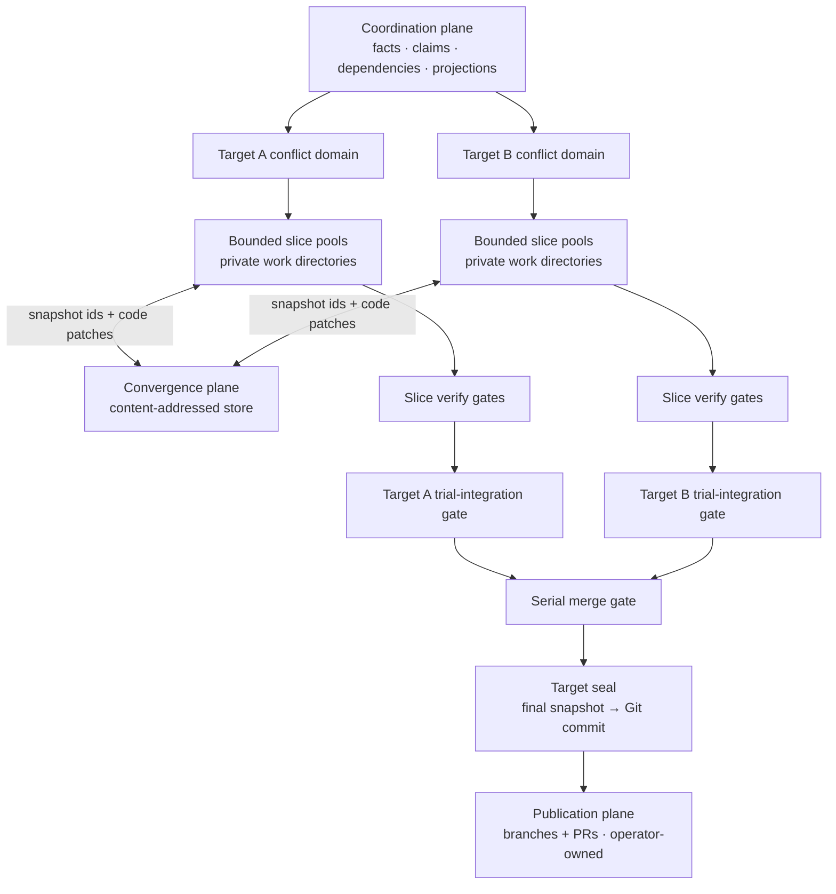

# Next Stage: Platform-Scale Migration

> Status: Planning spine for the RFC-86…RFC-92 series — each RFC owns its own decisions; this document owns the sequence and the fit. RFC numbers follow implementation order.
>
> Audience: contributors starting work on the series; operators evaluating what Emery is becoming

## The vision

Point Emery at a legacy system — a mobile app, a realtime platform, any estate of repositories that together comprise one product — and have it migrate that system: discover the repositories, profile them, author a plan, and execute it with a **swarm of concurrent agents** working across **multiple repositories** on **multiple nodes**, converging on verified, published changes.

Then keep changing that platform the same way, from a disposable change directory — prior context intentionally thin (forge authentication and organisation plus source material), creating member repositories when the change needs ones that do not exist yet.

Concretely, the exemplar workload is a migration the size of AT's mobile app or AT's realtime platform: tens of repositories, hundreds of slices, weeks of wall-clock — infeasible as today's serial, single-repo, operator-tended loop, and exactly what the series below makes routine.

And do all of it with one Emery: the same binary, verbs, artifacts, and lifecycle on a single desktop and across a multi-node fleet — the engine guest is location-neutral by construction (a Wasm component whose deployment differences live in providers and the launcher), and [RFC-86](rfc-86-change-facts.md) makes the workflow state location-neutral to match. A desktop is the deployment with one actor and no remote, not a separate mode.

Everything Emery already is stays load-bearing: the slice loop (`refine → build → merge`), artifact authority, the journal's closed event taxonomy as the audit trail, adapter seams over WIT, operator-owned publication. The series scales those invariants out; it does not replace them.

## Where we are

Today one change runs in one repository (or a hand-tended workspace of them), serially: one judgment leg at a time, one working tree the operator prepared, verify as prompt text inside the agent loop, publication tracked in the operator's head. The measured walls (RFC-78's `wasm-omnia-r9k` runs): a ~30-minute serialized build with an unobservable nested review team, an 11–54 minute synthesis leg, and no way to run two of anything at once.

## The target architecture

Five moves, layered:

1. **State becomes facts.** RFC-86 makes the change a self-contained, version-control-neutral fact tree; all workflow status is a projection over it, and no later move needs a hosted authority.
2. **Trees become values.** RFC-87 materializes an immutable snapshot into a private workspace and captures a result snapshot; the code patch is the relation between them. RFC-91 later composes ordered same-base results; RFC-92 moves snapshot objects between nodes. No shared volume crosses an operation.
3. **Location becomes ephemeral.** Plan authoring in an empty ordinary directory discovers and records member repositories from the forge, execution prepares disposable private workspaces, and archive leaves nothing behind except merged baselines and forge history.
4. **Verification becomes host-owned.** Closed, sandboxed verify profiles replace cargo-commands-in-prompts, producing normalized findings any orchestrator can route.
5. **Judgment becomes a swarm.** Within a slice: focused workers with exclusive write manifests, converging through the verify gate. Across slices: independent plan entries build in parallel in separate private workspaces, with a trial-integration gate measuring joint health continuously. Across nodes: three separated planes (coordination / convergence / publication) move facts, values, and PRs respectively.

### Scaling invariant

Scale is hierarchical, not flat. Emery partitions work into conflict domains: targets at plan level, dependency-ordered slices within each target, and path-owned worker tasks within each slice. Each domain has a bounded worker pool and a local convergence gate. Workers consume immutable snapshots in private work directories, return digest-identified artifacts or code patches, and append coordination facts; no writable tree is shared.

Results converge upward: worker outputs pass through slice verification, slice patches compose into per-target trial integrations, and accepted slice results reach the existing serial merge and publication gates. A logically central scheduler may place work, but it is neither workflow-state authority nor an unbounded convergence bottleneck.

Each convergence wave consumes results derived from one accepted snapshot and emits the next. Disjoint results compose; shared paths become dependencies or a fan-in integration task rather than an implicit text merge. When a project drains, one serial project seal turns its final snapshot into a Git commit for operator-owned publication.



## The series

The tables list each RFC's hard dependencies and what it delivers. Step numbers are a reading order (product path, then scale), not a single serial queue: after the shared 86 → 87 stem the tracks fan out, and RFC-92 joins them — see [Working in parallel](#working-in-parallel). Every RFC still depends only on completed earlier steps, owns one deployable path, and has no acceptance criterion or phase gated on a later RFC.

### Product critical path — migrate and change a platform

| Step | RFC                                  | Title               | Delivers                                                                                                                                                                                                                                                    | Depends on             |
| ---- | ------------------------------------ | ------------------- | ----------------------------------------------------------------------------------------------------------------------------------------------------------------------------------------------------------------------------------------------------------- | ---------------------- |
| 1    | [RFC-86](rfc-86-change-facts.md)     | Change Facts        | The substrate: the change as a version-control-neutral fact tree, projected status, per-actor event logs, pinned judgment inputs, merge-finalized requirement identity, digest-bound `plan.execute.started`, desktop as the degenerate deployment                       | —                      |
| 2    | [RFC-87](rfc-87-working-trees.md)    | Private Workspaces  | Immutable snapshots, disposable private workspaces, `prepare` / `capture` / `discard`, code patches as base/result relations, and separate writable-code/read-only-artifact access                                                                       | completed 86           |
| 3    | [RFC-88](rfc-88-detached-changes.md) | Detached Changes    | Complete single-node migrate/change loop: generated source identities, deterministic selection, an ordinary directory as the disposable change home, GitHub discovery, recorded members, target-topology proposals, and operation-local workspaces | completed 86, 87       |
| 4    | [RFC-89](rfc-89-publication-sets.md) | Publication Sets    | Project seal: each final project snapshot becomes one local commit; publication identity binds those commits, branches, and PRs across repositories with ordered landing and archive verification                                                           | 88 (member derivation) |

### Scale track — concurrency (fans out after 87; joins product at 92)

| Step | RFC                                      | Title                | Delivers                                                                                                                                                                                                                        | Depends on                   |
| ---- | ---------------------------------------- | -------------------- | ------------------------------------------------------------------------------------------------------------------------------------------------------------------------------------------------------------------------------- | ---------------------------- |
| 5    | [RFC-90](rfc-90-verify-profiles.md)      | Verify Profiles      | Complete Omnia/Rust path for closed, sandboxed, host-owned verification with normalized findings and typed unavailability elsewhere                                                                                             | completed 87                 |
| 6    | [RFC-91](rfc-91-concurrent-execution.md) | Concurrent Execution | Complete single-node Omnia swarm: focused workers, write ownership, local pool, per-worker trees, deterministic code-patch composition, convergence, refine/plan fan-outs, and synthesis payload restructuring                  | completed 86, 87, 90         |
| 7    | [RFC-92](rfc-92-node-sync.md)            | Node Sync            | Complete multi-node Omnia path: fact and value transport between nodes, fenced claims, hosted trees, remote pools, concurrent plan entries, and per-target trial integration — no authority cutover, no second lifecycle model | completed 86, 87, 88, 90, 91 |

Sequencing notes:

- **Complete RFC-86 first.** It deletes the mechanics every later step would otherwise have to synchronize (stored status, the single journal file, synthesis-time identity, unrecorded execute starts) and delivers operator value immediately: reviewable, portable pre-build planning artifacts and the shift-left refine flow.
- **Then complete RFC-87** — the shared stem both tracks consume (private workspaces and code patches).
- **After 87, the series is a Y, not two independent pipelines:** product path `88 → 89` and scale path `90 → 91` fan out in parallel; **RFC-92 is the join** (needs completed 88 and 91). RFC-89 (publication) and RFC-92 (multi-node execution) are orthogonal — 92 does not wait on 89. Each step still consumes only settled earlier vocabulary; RFC-92 adds only transport, fencing, hosted trees, and remote pools — the state model does not change when the second node appears.

```text
RFC-86  (shared; complete first)
   │
   ▼
RFC-87  (shared stem — both tracks need it)
   │
   ├─────────────────────┐
   ▼                     ▼
RFC-88 → RFC-89     RFC-90 → RFC-91
   │                     │
   └──────► RFC-92 ◄─────┘
```

## Working in parallel

Completion order for each edge stays as the tables and diagram above: do not staff `87 → 88 → 89` and `90 → 91 → 92` as fully separate from day one. Both need 86; the scale track cannot *complete* RFC-90 until 87 lands. After the shared stem, distribute as two tracks that meet at 92.

**Staffing after the stem.** Once 87 is complete (or close enough that its workspace contract is stable):

| Track | Owner | Sequence | Notes |
| ----- | ----- | -------- | ----- |
| Location / product | Team A | 88 → 89 | Detached change home, discovery, member bindings, then project seal / publication sets |
| Concurrency / scale | Team B | 90 → 91 | Host-owned verify, then single-node swarm; **91 does not depend on 88 or 89** |
| Multi-node join | Team C (later) | 92 | Start only when **both** 88 and 91 are complete |

**RFC-86 ∥ RFC-87 — narrowing the stem.** Before that fan-out, a small team can develop 86 and 87 concurrently: the code coupling is far narrower than "completed 86". RFC-86 lives in the state layer: `crates/project/src/journal.rs` (single file → per-actor logs), the status ladders in `crates/project/src/plan/model/state.rs` and `crates/project/src/slice/lifecycle.rs` (deleted in favour of the projection kernel), `IdAllocator` in `crates/slice/src/synthesis/project.rs`, and the execute-start / claim surfaces in `crates/change`. RFC-87 lives in the tree/value layer: it replaces the three `WorkingTree::live()` dispatch sites with `prepare` / `capture` / `discard`, private workspaces, and a snapshot store. The tracks meet at exactly two seams:

1. **Snapshot and result identity** — RFC-86 records snapshot pins and result facts; RFC-87 consumes the pins and returns `{ base snapshot, result snapshot, touched paths }`.
2. **Pin authorship timing** — source snapshots close at plan authoring or detached discovery; refine adds the baseline digest; build freezes the target base before `prepare`.

**Within RFC-86**, Phase A (per-actor logs, projection kernel, claim/retraction facts) is journal-and-plan territory in `crates/project`; Phase B's identity work (slice-scoped requirement ids, `MODIFIED` base digests, merge-time finalization) is synthesis-and-merge-engine territory in `crates/slice`; the one shared contract is the merge fact that records the identity map. Phase C (`plan.execute.started`, multi-actor) sits on top of A.

**Slack absorbers** — real work with no ordering constraint on the critical edge: RFC-90's profile taxonomy, findings normalization, and Omnia `wasi-model` verify plumbing (buildable against a plain directory before 87's disposable workspaces land; the vertical cut still waits on 87); RFC-86's multi-actor fixtures in `crates/mock` (two actors, disjoint slices, merged change trees, claim-conflict and base-drift injections); RFC-89's record design (its implementation genuinely needs RFC-88's member bindings).

**Collision points** — sequence explicitly, don't parallelize: the merge orchestration (`crates/slice/src/orchestrate/merge/` — RFC-86 adds identity finalization and the merge fact, RFC-87 rewires the tree the merge gates run against; decide who lands first, the second rebases), and RFC-88 itself — the convergence point needing the fact tree as the change home *and* operation-local workspaces, effectively the integration test of the 86∥87 split.

## Two operator jobs, one loop

Both jobs run the same three-command loop once the critical path lands; they differ only in `plan author` scope. **Migrate** criteria fingerprint shallow source trees through RFC-88's exact-one source selector and propose bindings onto discovered targets (new forge repos are operator-created with `product:` so discovery can see them). **Change** criteria survey the organisation for repositories whose `.emery/project.yaml` declares `product:` membership ids (the build set is `platforms:`, not the membership key).

```text
emery plan author     →  initialize the detached home when needed; discover and pin
                         targets/sources; author slices over the recorded topology
emery plan execute    →  append plan.execute.started;
                         prepare private workspaces on demand (RFC-87); execute entries;
                         seal each drained project's final snapshot (RFC-89)
operator publishes    →  push sealed branches; open and merge PRs
emery plan archive    →  verify the publication set (RFC-89); archive
rm -rf <dir>
```

Once the scale track lands, execute gains concurrent workers, concurrent plan entries, and multi-node execution — same loop, higher throughput. Shift-left refinement distributes the same way: separate operators or nodes refine claimed slices against the same pinned bases and exchange facts through RFC-92's coordination plane.

## Outside the series

Unchanged and orthogonal — not part of this arc, not blocked by it:

- **[RFC-71 Self-Assembling Wasm Deployment](rfc-71-deployment.md)** — largely landed; Stage 2 diagnostics remain draft.
- **[RFC-77 Release Process](rfc-77-release-process.md)** — operational policy for releasing Emery itself; its WIT-breaking shape becomes RFC-89's first in-house publication set.
- **[RFC-18 Specialized SLM Code Generation](future/rfc-18-slm.md)** (future) — an optional cost lever behind RFC-91's per-worker model-selection hook; a ratchet rung, not a stage.
- **[RFC-46a Web Asset Materialization](future/rfc-46a-web-asset.md)** (future) — content-triggered vectis work, independent of this series.

Known external reference: `augentic/remedium` RFC-81 cites "RFC-82" for what is now RFC-89's publication-set record; update that citation when next touching that repo.
