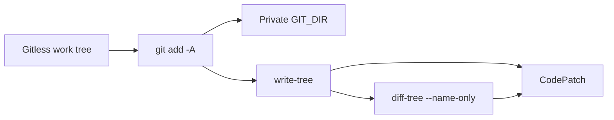

# RFC-105: Git-backed Snapshot Capture

> Status: Draft. Amends the [RFC-87](rfc-87-working-trees.md) snapshot store: membership and tree identity become a host-owned git index, so product `.gitignore` keeps compiler output out of a `CodePatch`. Not yet on the [Services Delivery Programme](platform.md) critical path.
>
> Owns: host-side snapshot / materialize / diff over a private `GIT_DIR` and a gitless work tree; the `emery:trees` WIT import; the kernel exclude list as git `info/exclude`; `SnapshotId` remaining `sha256:<64 hex>` with the digest now a git tree (SHA-256 object format).
>
> Builds on implemented [RFC-87](rfc-87-working-trees.md) (prepare / capture / discard, `CodePatch` as `{ base, result, touched }`) and [RFC-90](rfc-90-build-verification.md) (capture only on terminal success). Distinguishes itself from [RFC-104](rfc-104-system-archaeology.md)'s `emery:origins` (remote fetch, then discard). Does not take [RFC-95](rfc-95-publication-sets.md)'s publication seal, [RFC-88](rfc-88-detached-changes.md)'s retirement of interim `apply`, or [RFC-96](rfc-96-concurrent-execution.md)'s same-base composition.

## Intent

A `CodePatch` is a product-tree identity, not “the workspace after the agent ran.”

RFC-87’s in-guest walk hashes every file under the lent workspace except `.git`, `.emery`, and the three root plan files. Target `verify` writes compiler output into that tree (`cargo check` → `target/`; Omnia’s exemplar clone → `target/omnia-exemplar/`). Those paths enter the result snapshot and `touched`, then merge `apply` writes them onto the operator checkout. `.gitignore` is already product — Omnia and Vectis author `target/` there — but capture does not read it.

This RFC makes git the snapshot engine for freeze, capture, and materialize. `git add -A` is the membership filter. `write-tree` is the identity. `diff-tree` is `touched`. The lent directory stays gitless. The host owns the object store.

The workflow contract does not change: workspaces remain disposable; a failed attempt still discards without capture; re-entry still prepares a new workspace from a newly frozen base.

## Problem

RFC-87 D4 answered “what is change-home state?” It did not answer “what is compiler output?” The walk therefore treats `target/` as a product edit.

That is not hygiene. The result digest is unstable across otherwise identical source edits (incremental rustc / Gradle output). `touched` explodes. The snapshot store retains those objects. Interim `apply` copies them onto the checkout. Freeze of an operator tree that already has a local `target/` pollutes the wave base. RFC-95’s later seal and RFC-96’s same-base composition would inherit the same trees.

Discarding the workspace does not help: capture already stored the objects. A failed build never captures — that path is already correct. The leak is on **success**.

## Terms

- A **gitless work tree** is the directory lent to the adapter: product files only, no `.git` file or directory. The agent cannot reach the operator repo or the snapshot store through git.
- A **private `GIT_DIR`** is a host-owned git object database under `$EMERY_HOME` (durable store plus a throwaway `GIT_INDEX_FILE` per call). It is never the operator’s `.git`.
- **Kernel excludes** are the RFC-87 change-home / VCS names, applied as `info/exclude` in the private `GIT_DIR`: `.git`, `.emery`, and root `change.md` / `discovery.md` / `plan.yaml`. They are not the build-artefact filter.
- **Product ignore** is the work tree’s `.gitignore` (and nested `.gitignore` files). It is the only build-artefact filter. A tree with no `.gitignore` admits every path except kernel excludes — today’s behaviour, so `mock-build/` still lands.
- **`emery:trees`** is the host WIT this RFC adds: `snapshot`, `materialize`, `diff`. It is not `emery:origins`.

## Flow

```text
freeze(product root)     → host snapshot(path)     → SnapshotId          (temporary index; operator .git untouched)
prepare(base)            → host materialize(id)    → gitless ws-* dir
capture(workspace)       → host snapshot(ws root)  → result id
                         → host diff(base, result) → touched
discard(workspace)       → delete the gitless dir  (store refs keep the trees)
```

Capture on the success path only:

1. `git add -A` against the gitless work tree (reads `.gitignore`).
2. `git write-tree` — the result `SnapshotId`.
3. `git diff-tree --name-only -r <base> <result>` — `touched`.

`CodePatch` stays `{ base, result, touched }`. There is no stored unified diff. Rematerialize is `read-tree` + `checkout-index` into a fresh gitless directory.



A terminal build failure still writes the failed report, discards the artifact stage and the product workspace, and does not call `snapshot` / `diff`. Re-running `emery plan execute` freezes a new base, opens a new wave, prepares a new workspace, and allocates a new attempt. Failed work trees and their indexes are not resume state.

## Decisions

### D1 — Git is the snapshot engine

Membership, identity, and `touched` are git’s `add` / `write-tree` / `diff-tree`. The custom DFS walk, canonical Emery manifest, and blobstore-hashed file objects cease to be the product-tree authority.

Oracle-only (`git ls-files`, then SHA-256 the same files into the existing store) is rejected: it double-hashes and keeps a parallel object store. That is the leak with extra steps.

### D2 — `SnapshotId` stays `sha256:<64 hex>`; the digest is a git tree

The durable store is `git init --object-format=sha256`. `write-tree` yields a 64-hex SHA-256. The wire scheme does not change. Existing on-disk records and the workspace golden digest change and must be regenerated; they were hashes of the old manifest.

Facts and `BuildRecord`s still name snapshot identities, never workspace paths. Pin walks (`plan/pins.rs`) must use the same `snapshot` so pin digest equals freeze digest.

### D3 — The work tree is gitless; the host owns git

`prepare` materializes into `$EMERY_HOME/workspaces/ws-*` (guest mount `/emery-workspaces`) with **no** `.git` file. Capture points `--work-tree` at that directory from the host.

Git worktrees of the operator repo are rejected. A worktree’s `.git` file points at `<repo>/.git/worktrees/<name>`. Verify already runs a shell in the lent directory; that pointer is a doorway into the operator repo.

Freeze of the operator checkout uses a **temporary index** (`GIT_INDEX_FILE`) and the private `GIT_DIR`. It never `git add`s in the operator repo. After freeze, `git status` in the checkout is unchanged.

### D4 — Product `.gitignore` is the artefact filter; kernel excludes stay engine-owned

`info/exclude` in the private `GIT_DIR` carries the RFC-87 kernel list. Product `.gitignore` carries `target/`, `.gradle/`, and whatever else the target prelude authors.

Adapter `snapshot-exclude[]` metadata is rejected. The prelude already writes `.gitignore`; a second grant language would drift from it. A missing `.gitignore` on first freeze is the same as today (no `target/` yet). Capture runs after the prelude, so the first successful Omnia/Vectis build already has `target/` ignored.

### D5 — `emery:trees` is a new host import; do not extend `emery:origins`

The workspace kernel runs in-guest today (`wasi:blobstore` + `wasi:filesystem` + `emery:exec-bits`). Git is a host process. The guest still owns *when* to freeze, prepare, and capture (`Workspaces`); the host owns *how* those three verbs hash a tree.

`emery:origins` (`fetch` / `discard`) is the wrong noun. It materializes a **remote coverage locator** for RFC-104 system survey: shallow clone or HTTPS download into `origin-<nonce>/`, then the guest snapshots that tree and the host deletes the fetch. Ambient host credentials, one-shot lifetime, no rematerialize-by-digest, no `.gitignore` contract, no durable object store of product trees.

Overloading `fetch` to mean “index this local product tree and keep the git objects” would mix clone policy, credentials, and snapshot identity. Origins stays fetch-and-discard. This RFC adds `emery:trees`:

| Op | Host git | Guest use |
| --- | --- | --- |
| `snapshot(path) → id` | sterile `add -A` + `write-tree` | `freeze`, `snapshot`, capture result |
| `materialize(id, dest)` | `read-tree` + `checkout-index` into a gitless dir | `prepare` |
| `diff(base, result) → paths` | `diff-tree --name-only -r` | capture `touched` |

`discard` of a workspace directory stays in-guest (or native in-process) as a filesystem delete. Durable objects live in one host store (e.g. `$EMERY_HOME/snapshots.git`) with refs `refs/emery/snap/<digest>` so a result id survives `discard`. `sweep` drops dead refs and `git gc`. Per-call `GIT_INDEX_FILE` is throwaway.

Native `Provider` calls the same kernel in-process, as it does for origins. The WIT exists so the shipped guest and the host agree; it is not a native-only wrapper.

Sterile invocation — do not inherit operator config:

- `--git-dir` / `--work-tree` / `GIT_INDEX_FILE`
- `GIT_CONFIG_NOSYSTEM=1`, `GIT_CONFIG_GLOBAL=/dev/null`
- `-c core.excludesfile=` `-c core.autocrlf=false`

`write-tree` is not a commit; no `user.name` is required.

### D6 — Failure still discards without capture

RFC-87 D5 and RFC-90 stand. A terminal attempt writes a failed report, discards both writable trees, and journals `slice.build.failed`. No `CodePatch`. Re-entry does not reuse the failed directory, its index, or its continuation. Complexity-bounded slices (leaves smaller than a lead) make that retry the intended cost; this RFC does not add workspace resume.

### D7 — Interim `apply` checks out `touched` only

Until RFC-88 deletes merge-time `apply`, `apply` restores only `patch.touched` from the result tree onto the product root. Ignored paths never appear in `touched`, so they cannot be applied.

`wasi:blobstore` and `emery:exec-bits` stay wired. They become unused on the product-tree path (git stores blobs and the executable bit). This RFC does not delete those imports.

## Fixed implementation cut

- Add `emery:trees` (WIT, launcher host, native in-process kernel, guest `Workspaces` client).
- Point `freeze` / `snapshot` / `prepare` / `capture` / `apply` at those ops; keep work trees gitless.
- Carry kernel excludes as private `info/exclude`; do not touch the operator index.
- Regenerate workspace goldens; keep `mock-build/` delivery when no matching ignore exists.
- One sentence in `docs/reference/directory-layout.md` and `docs/reference/adapter-contract.md`: capture membership is `.gitignore` plus the kernel exclude list; private workspaces are not git worktrees.

## Acceptance criteria

1. A workspace that contains `target/foo.o` and a `.gitignore` line `target/` produces a result id and `touched` list that omit that path. The same tree without `.gitignore` includes it.
2. Freeze of an operator checkout that is a git repo does not change `git status` or the index.
3. `prepare` yields a directory with no `.git` file or directory.
4. Kernel excludes (`.git`, `.emery`, root plan files) remain absent from snapshots even when those names are tracked in the operator repo.
5. `mock-build/` without a matching ignore still appears on `BuildRecord.touched` and post-merge apply.
6. A failed build still has no result snapshot; a later execute allocates a new attempt and a new workspace.
7. `CodePatch` remains `{ base, result, touched }` with `SnapshotId` wire form `sha256:<64 hex>`.
8. Native and guest deployments mint the same snapshot id for the same admitted tree.

## Rejected alternatives

- **Honor live `.gitignore` in the in-guest walk** — requires a gitignore matcher in the wasm-clean kernel; freeze and capture can see different files when the prelude rewrites `.gitignore` mid-build. Git’s `add` at each call is the matcher.
- **Closed engine list (`target/`, `node_modules/`)** — adapter fact in the kernel; misses Gradle / Xcode; `build/` is sometimes product.
- **Adapter `snapshot-exclude[]` metadata** — second ignore language beside the `.gitignore` the prelude already writes.
- **`CARGO_TARGET_DIR` outside the workspace** — helps verify performance; does not fix freeze of a dirty checkout, the Omnia exemplar, or Gradle/Xcode.
- **`git ls-files` as a filter, keep the Emery object store** — double-hash; still a custom store.
- **Stored unified diff as the patch** — binaries, modes, empty files, context drift. Two trees already define the delta (RFC-87 D3).
- **Git worktrees of the operator repo** — shared `.git` pointer; agent escape; dirty freeze is not `worktree add HEAD`; source extract still needs another materialization path.
- **Extend `emery:origins`** — origins is remote fetch-and-discard for system survey (RFC-104). Credentials, one-shot lifetime, and “get this locator” are not snapshot identity. See D5.
- **Resume a failed workspace** — RFC-87 D5; the execute loop resumes at the build *phase*, not the dirty tree.
- **Delete blobstore / exec-bits in this RFC** — unused on the new path; removal is a follow-on once nothing else hashes product trees that way.
- **RFC-95 publication seal** — still the later commit; this RFC only makes the trees it would seal product-shaped.
