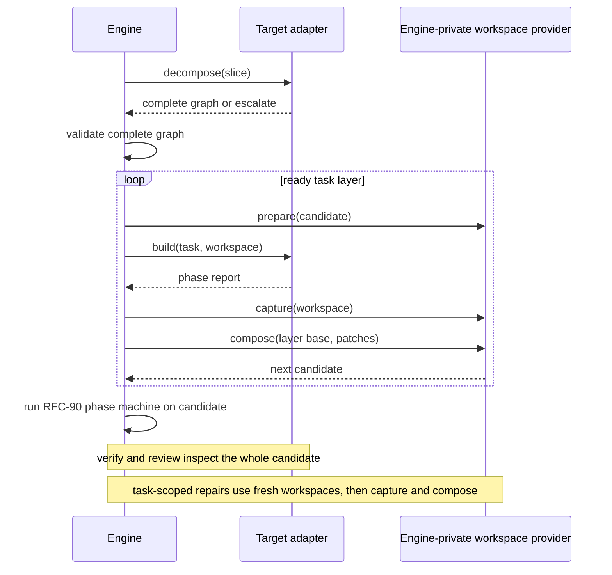

# RFC-106: Target Task Graphs

> Status: **Evidence-gated** in the [Services Delivery Programme](platform.md). Accepted architecture; not on the default staffing plan. Implementation starts when a measured Omnia slice is too large for one RFC-90 `target.build` call (spilled build prompts, wall-clock, or failed cap-one/four economics under [RFC-96](rfc-96-concurrent-execution.md) D11).
>
> Owns: one engine-owned `decompose → validate → execute` phase inside a slice-build attempt; `target.decompose`; exclusive task write grants; protected verification inputs at task granularity; task-scoped repair routing; graph-attributable re-decomposition and `graph | escalate` answers.
>
> Does not own: the work-item scheduler, shared pool, `compose` kernel, domain rounds, or multi-member waves ([RFC-96](rfc-96-concurrent-execution.md)); remote placement ([RFC-100](rfc-100-distributed-execution.md)); publication ([RFC-95](rfc-95-publication-sets.md)).
>
> Builds on RFC-96 Phase B. Amends RFC-90 D1, D2, D5, and D6 (logical candidate rematerialized per task operation; task context on `build` / `repair`). Extends RFC-88 D8 with envelope-escalation proposals. [RFC-18](future/rfc-18-slm.md) may later use the per-task model-selection hook; that hook stays inert here.

## Intent

RFC-96 runs independent **slices** concurrently. Some implementation complexity appears only after refinement: one behavioural slice may require coordinated crate, test, and guest work that is too large for one model request but incoherent as separately accepted slices.

This RFC divides that implementation into **tasks** without changing the slice boundary. Plan authoring already decomposes surveyed leads recursively. RFC-88 refinement can send a leaf back through focused survey when its Evidence reveals separately acceptable child boundaries. A successful refinement still produces one coherent slice — Evidence, `spec.md`, `design.md`, and `tasks.md` — and that slice remains the lifecycle and acceptance unit.

Today, one Omnia generation conversation combines all of this work with an opaque verify-repair loop. Observed builds serialized about 30 minutes of agent time and could then fail inside a hidden review team. Under this RFC, the engine invokes `target.decompose` at most once per slice-build attempt and receives a complete `graph | escalate` answer. Omnia uses a model-assisted prompt; an adapter that needs no decomposition returns a deterministic singleton graph. The engine validates and executes the graph in private workspaces using RFC-96's `compose` kernel, then runs RFC-90's slice-wide verify-repair-review loop. Escalation routes an incoherent slice back to plan authoring.

Do not staff this RFC because concurrency exists. Staff it when RFC-96's harness shows one slice, not the ready set, is the bottleneck.

## Flow and terms



A **slice build** remains one RFC-96 slice-build attempt: one terminal report and one lifecycle outcome.

A **task** is an ephemeral, agent-sized leaf in a target-proposed **task graph**. It carries:

- a thin brief
- path-first inputs
- exact product and artifact write grants
- MCP-lazy references

A **worker** here is one engine-dispatched `target.build` or `target.repair` call, scoped to a validated task and returning a typed phase report. It is subordinate to one RFC-96 `build` work item.

Tasks need not be independently buildable or mergeable. The composed slice candidate is the first result eligible for verification and acceptance. A task graph orders tasks into same-base **task layers**; a later **fan-in task** exclusively owns any shared path.

A **protected verification input** is an exact in-tree file or tree in the admission-covered leaf envelope that no build or repair worker may change. A **protected oracle** is external read-only material identified by a covered logical id and content digest. Either may hold baseline tests, contract fixtures, or behaviour replays. Candidate-authored tests remain ordinary writable product paths.

A singleton graph preserves RFC-90's single-writer shape: one `target.build` before the slice-wide verify-repair-review loop. Task graphs gain records; they do not gain lifecycle status or claims.

## Worked examples

One Omnia slice asks for a Rust library, its integration tests, and a WASI guest. An initial candidate decomposition might be:

```text
crate writer  owns tree crates/payments/src
test writer   owns tree crates/payments/tests
guest writer  owns tree guests/payments
```

The candidate proposes three tasks as agent-sized implementation scopes, not independently acceptable slices. One of them also owns build-level reporting; that designation creates no extra task.

When graph validation finds no shared-path interaction, all three tasks start from `sha256:base`. The engine captures their disjoint patches and composes them through RFC-96 D6 into `sha256:composed`. Only this composed candidate receives slice-wide verification. A finding at `crates/payments/src/client.rs` routes to the crate task, which receives the complete candidate but may change only its grant.

If several writers need to change `crates/payments/src/lib.rs`, the initial candidate is invalid: that file cannot remain under the crate writer's `tree crates/payments/src` grant. A `tree` grant already includes the file, and the closed `file | tree` grammar has no exclusion form. Before preparing any workspace, bounded answer repair returns a complete replacement graph — it does not subtract a path from the tree grant. The replacement uses exact file grants for the parallel layer and assigns `lib.rs` exclusively to a later fan-in task:

```text
layer 1
  crate writer  owns file crates/payments/src/client.rs
  test writer   owns tree crates/payments/tests
  guest writer  owns tree guests/payments
layer 2
  integration task owns file crates/payments/src/lib.rs and build reporting
```

Layer 2 starts from Layer 1's composed candidate. Its integration patch therefore names the intermediate snapshot as its base, not `sha256:base`.

Unexpected overlap rejects the entire layer and fails the attempt before composition. The engine records an ownership finding for every contributor. Those findings become input to the next complete graph proposal. No subset of a failed layer becomes authoritative, and the engine does not use textual auto-merge.

## Decisions

### D1 — The engine owns one slice build and its task-graph phase

RFC-90's single build attempt gains one engine-owned phase before verification:

```text
decompose → validate → execute
```

The engine executes the graph one ready layer at a time. Each layer follows RFC-87, then RFC-96 composition:

```text
prepare → target.build → capture → compose
```

Every task in a layer starts from the same current candidate. The composed result becomes the base for the next layer. These are orchestration steps, not new lifecycle states. `prepare` and `capture` come from RFC-87. `compose` comes from RFC-96 D6. For a singleton graph, composition is the identity.

This amends RFC-90 D5: a build attempt has one **logical candidate** (a code snapshot plus a staged-artifact tree). [RFC-97](rfc-97-native-verification.md) Phase A owns logical-candidate rematerialization (capture before every `verify`; fresh RFC-87 materializations for the verifier and host mechanical repair; continuation bound to the logical candidate, not a workspace id). This RFC only rematerializes per task operation and narrows the writable set to one validated task grant. During initial graph execution, only the report owner receives a writable artifact stage; every other task sees staged artifacts as read-only. The engine carries captured code and the report owner's validated artifact diff forward.

No two operations share a writable directory or artifact-stage handle. Intermediate snapshots and artifact diffs remain inert execution values. The engine records the final code result and promotes staged artifacts through one success gate.

The engine owns graph validation and ordering, workspaces and retries, budgets, report aggregation, verification, the terminal report, and the slice transition. The target adapter owns the decomposition prompt, task-specific build and repair, and candidate-wide verify and review.

Before preparing a writable workspace, the engine validates the graph and binds its digest to the slice revision, target identity, model-capability-profile digest, resolved inputs, and base snapshot.

Each task-scoped `build` or `repair` returns an RFC-90 phase report. The engine persists it under the slice-build attempt with the graph digest and task id; the report's ordinal also emits RFC-90's `slice.build.phase-completed` event. Tasks have no independent terminal report — the engine aggregates their reports into the attempt's one terminal result.

On terminal success, that aggregated result feeds one RFC-86 `BuildRecord` at `builds/<digest>.yaml` for the slice attempt. Tasks never mint their own `BuildRecord`, wave, candidate batch, or merge fact.

The validated graph record is independent of any attempt; its key is the decomposition operation key. Every re-entry creates a new RFC-90 attempt id, new workspaces, and new continuations. The next attempt may reuse the completed graph when its profile digest is unchanged after:

- an abandoned attempt
- an infrastructure or dispatch failure
- an invalid phase report
- an exhausted repair budget where existing task grants cover the findings

The following failures are **graph-attributable**:

- an out-of-grant write
- overlap within a layer
- an unresolved finding that no task grant covers

After a graph-attributable failure, the next attempt calls `decompose` again, supplying the prior graph and findings as planning evidence. The new operation key covers both digests. A deterministic adapter may return the same singleton graph under the new key.

The replacement graph's base depends on the failure point. Overlap and out-of-grant writes happen before composition, so the next attempt restarts from the recorded base. An unowned residual finding happens after the engine has composed and verified a candidate; the replacement graph may then use that immutable candidate as its base snapshot.

A `build` or `repair` continuation may resume only for the same task, attempt, and graph, against the current logical candidate. The candidate-wide `review` continuation is scoped to its attempt and graph. No continuation may encode or depend on a workspace path or live handle.

A task has no slice lifecycle, plan status, claim, independent terminal report, or merge authority. RFC-96's `(slice, build, input-digest)` work item remains the claimed unit.

### D2 — Target decomposition proposes one complete graph

`target.decompose` receives:

- the refined slice, including `tasks.md` and `spec.md`
- target guidance
- path-first target context
- the pinned model-capability profile and task-complexity threshold

After a graph-attributable failure, it also receives the prior graph and relevant findings. If the failure happened after composition, it receives the prior composed candidate as the proposed base. Decomposition never edits the candidate. `target.repair` remains the separate, attempt-scoped writer and may write only within one validated task grant.

Decomposition returns one typed `graph | escalate` answer. A graph contains the complete task set and all dependency edges. The adapter owns its prompt and its interpretation of target architecture. The engine accepts a graph only if:

- every `tasks.md` entry is covered
- every refined `spec.md` requirement id is covered
- the task count is within the fixed budget
- every task carries the closed complexity assessment and fits the profile's task threshold
- dependencies are acyclic
- every grant is inside the slice's authorized ownership envelope
- no grant intersects a protected verification input
- predicted interaction has no ambiguous path ownership

The adapter proposes task complexity dimensions and rationale. The engine computes each score from the pinned profile. Neither the adapter nor the model selects thresholds or broadens the profile. Exceeding one task's threshold is a reason to add or split tasks inside the graph; it is not by itself a reason to create more slices.

An `escalate` answer states that the refined slice is not coherent and includes a typed `boundary | envelope` rationale: `boundary` when the Evidence supports independently acceptable children; `envelope` when no bounded task graph can fit the target's complete build and verification envelope.

For a `boundary` escalation, the engine uses RFC-88's refinement feedback path. Focused source surveys author child leads, affected-domain decomposition authors candidate nodes, and one inert proposal carries those candidate planning revisions. The target answer cannot author leads or slices.

For an `envelope` escalation with no coherent split, the inert proposal records the blocking profile and target envelope and carries no invented child leads. The operator may change the model-capability profile, target, or change scope through a legal amendment.

An envelope escalation may specifically identify an architectural obstruction outside the reviewed slice ownership envelope — a path, API, or design decision that must change before any valid task graph can implement the slice. The answer names the obstruction and nearest affected conflict domain as evidence only. It cannot widen a grant or license an out-of-scope patch; RFC-88's inert proposal and operator amendment boundary decide whether to introduce or reorder prerequisite work.

The engine then fails the attempt with a typed `decomposition-escalated` terminal report, before preparing any writable workspace. Escalation cannot edit the plan, execute product work, or alter a frozen wave; the operator applies or discards the proposal through `emery plan amend --proposal`. Tasks never become slices — a boundary mistake routes up to plan authoring, not down into the task graph.

Re-decomposition has a fixed budget: at most two graph-attributable re-decompositions per slice revision. No adapter or model can reset that engine constant. A third graph-attributable failure parks the slice for the operator. Repeated decomposition failure is evidence of a boundary problem; the engine does not retry it indefinitely.

Each validated task record contains:

- a stable task id
- a role and brief
- covered scope
- the closed complexity assessment and engine-computed score
- path-first inputs
- exact product and artifact grants
- dependencies
- whether the task owns build-level reporting

Exactly one task owns build-level reporting. That designation alone creates no extra layer. The model may propose task values only within the slice's authorized ownership envelope. It cannot dispatch workers, select budgets, create lifecycle state, or broaden the envelope. Invalid answers enter the ordinary bounded answer-repair path before any product write.

SDK helpers provide a deterministic singleton graph whose task owns build-level reporting, so adapters need not decompose work merely because the operation exists. An adapter may also assemble a candidate graph from deterministic target metadata — for Omnia, the Cargo workspace member graph — and let a model call validate and adjust the candidate instead of inventing one.

[RFC-92](rfc-92-model-policy.md)'s closed operation-key set gains `target.decompose` when this RFC lands.

### D3 — Every task has exclusive, enforced write ownership

The engine lowers RFC-88's slice ownership envelope into RFC-90's exact `file | tree` grammar. Task grants contain no globs and must remain within that envelope.

[RFC-97](rfc-97-native-verification.md) Phase A owns the `protected-verification-inputs[]` (`file | tree`) and `protected-oracles[] { id, digest }` grammar on the admission-covered Node, including who writes it and capture-time enforcement. This RFC only narrows the writable set to one validated task grant: `target.decompose` receives those closed sets and cannot add, remove, or widen them, and the engine rejects overlap between any task grant and an in-tree protected input.

Predicted interaction between disjoint grants becomes a dependency. If several writers need the same path, the graph must not leave that path under any parallel writer's grant. A `tree` grant that would cover the shared path is replaced with narrower `file` or `tree` grants that do not cover it; the shared path is assigned exclusively to a fan-in task. A dependency alone does not authorize shared-path writes. Ambiguous ownership fails graph validation.

Only the graph's report owner may write the artifact stage during `build` or a later task-scoped `repair`. Only that task's `build` report may return outputs or a UI-surface declaration; every other `build` report, and every `repair` report, must leave those fields empty, as required by RFC-90. Non-owner reports may still list product-workspace writes, but not artifact writes. When integration work is needed, the report owner may be the terminal fan-in task; otherwise an existing writer can own reporting without adding a task.

The engine aggregates findings from every task report and takes outputs and UI-surface only from the report owner's `build` report. RFC-90's output-existence gate checks the fully composed candidate, not the report owner's private workspace. Captured touched paths are authoritative: an out-of-grant write or layer overlap fails the attempt before composition and invalidates the graph for the next attempt.

A model may propose the task graph, but the admission-covered decomposition already fixes protected inputs. Only engine validation authorizes the graph. Textual merge never resolves ownership.

RFC-96 D8's domain protected-input closure remains the domain-gate contract. This decision only partitions write grants *inside* one slice attempt.

### D4 — RFC-90 verification and review converge the complete slice

Writer and repair workers receive findings, not Cargo commands.

After the complete graph produces one composed candidate, the engine dispatches RFC-90 `verify`.

For one blocking verify report, the engine first applies RFC-90 D4 once to the complete slice report, producing at most 16 globally ordered repair findings. It then groups the located findings in that brief by their unique task owner. It may run pairwise-disjoint repairs concurrently:

```text
target.repair(origin: verification, task, findings, continuation)
```

All repairs caused by one report consume one RFC-90 verification-repair round, regardless of worker count. The cap is per source report, not per worker. Findings omitted from the brief remain in the complete persisted report and may reappear after the next candidate-wide verification; fan-out never multiplies RFC-90's repair-input bound. The engine captures and composes the repair patches through RFC-96 D6, then verifies the next complete candidate.

A task continuation cannot cross task, attempt, or graph identity. Verification is model-assisted evidence, not deterministic proof or a security boundary. A check over candidate-writable tests is self-consistency evidence. A check over protected inputs is stronger only to the extent that the report identifies those inputs and the engine enforced their write exclusion; RFC-97 defines host-attested profile assurance.

Some blocking findings cannot be routed:

- unlocated findings
- located findings on paths that no task grant covers

These remain typed residual failures. The engine does not broaden an arbitrary task's authority. Residual failures invalidate the graph and become planning evidence for the next attempt's decomposition call. Under D1, the follow-up graph may use the composed candidate as its base. Findings already covered by a task grant do not invalidate the graph. The engine never widens a task grant or mutates the graph during an attempt. Repair grants produced by one report must remain pairwise disjoint; captured overlap fails the attempt.

After verification passes, the engine dispatches one `target.review`.

Inside that dispatch, Omnia may run Security, Correctness, and Quality as separate specialist model calls. Each call is observable and has its own timeout. Compiled adapter code joins their results into one review phase report.

Those specialists provide concern-based lenses in the first cut. Live evaluation may compare decorrelated inputs or model classes, but the adapter still returns one bounded review report under RFC-90's single review budget. Another lens graduates only when it finds additional blocking defects at acceptable marginal cost; the runtime does not multiply reviewers or remediation rounds from a model response.

Blocking review findings use the same global RFC-90 repair-brief projection and task-owner routing:

```text
target.repair(origin: review, task, findings, continuation)
```

All repairs caused by one review report consume RFC-90's one review-remediation round. The engine then returns to `verify → review`.

The terminal report contains:

- aggregated task-build findings
- the latest verification findings
- the latest review findings

RFC-90's existing projection rules still apply. Task-repair findings and superseded verify or review rounds remain in attempt-scoped phase records. No task passes independently.

After verification passes, specialist model calls inside one `target.review` may also run concurrently under RFC-96's pool cap.

The first implementation uses the project model for every operation. The per-task model-selection hook remains inert until comparative evaluation shows a stable benefit; RFC-18 or another follow-on may activate it without changing task, ownership, or lifecycle semantics.

### D5 — Singleton graphs keep today's shape

SDK helpers provide a deterministic singleton graph so adapters that need no decomposition do not change behaviour. A singleton graph is one task that owns build-level reporting; composition is identity; RFC-90 D5's one-workspace loop is observationally restored for that attempt.

Adapters other than Omnia are expected to return singleton graphs until they have their own measured fat-slice evidence. Requiring a model-assisted graph from every target is rejected.

## Delivery

This RFC is one implementation slice. It is not split into phases: `target.decompose` is a WIT contract, and the grant grammar is not useful without the graph executor.

Staffing trigger (any one is sufficient, recorded against RFC-96 D11 fixtures or an engagement):

- a single Omnia `target.build` regularly spills prompts above 15 KiB or exceeds the engagement's accepted per-slice wall-clock;
- cap-four RFC-96 runs multiply spend without moving accepted CIDs because one leaf dominates;
- a lighthouse Omnia crate graph cannot land through one generation conversation.

Until that trigger, RFC-96 Phase A/B and a singleton `target.build` remain the product.

## Implementation requirements

- Add `target.decompose` and task context to RFC-90 `build` and `repair`. Extend `wit/emery.wit`, the adapter SDK `Target` trait and export macro, guest and native providers, the mock catalog, and wire DTOs. Add `target.decompose` to RFC-92's closed route-key set.
- Add profile-scored task complexity, digest-bound graph and phase records, admission-covered protected verification inputs and oracle digests, Omnia's model-assisted graph, and the SDK singleton.
- Reuse RFC-96 D6 `compose` for task layers. Do not invent a second composition kernel.
- Implement typed residual failure, escalation (`boundary | envelope`), and graph-attributable re-decomposition. Enforce its two-round budget and candidate-based follow-up graphs.
- Amend RFC-90 D5 so each task operation receives a fresh private materialization of the logical candidate. Continuations must not encode workspace paths.
- Persist validated-content digests, operation keys, and task-scoped phase events. Add no extension map.
- Use the project model by default. Do not activate per-task model choice in this RFC.
- Journal envelope-escalation proposals as inert RFC-88 documents; `plan amend --proposal` remains the apply path. `plan-proposal-kind` continues to refuse applying an envelope document as a topology amendment.

## Acceptance criteria

1. **Omnia decomposition.** A build the size of `at-r9k-position-adapter` produces one complete graph through one model-assisted decomposition operation. Every task fits the pinned profile's task-complexity threshold. Spilled build prompts remain at or below 15 KiB. Exactly one task owns build-level reporting. No task independently passes. RFC-90 retains verification, repair budgets, and observable review specialists.
2. **Invalid graphs and re-entry.** Invalid graphs produce no writable workspace. Escalation creates only its inert proposal and terminal report. Re-entry always creates a fresh attempt. It reuses the graph unless an out-of-grant write, layer overlap, or unowned finding requires new decomposition. That call receives the prior graph and findings under a new operation key. After a post-composition failure, the follow-up graph builds from the composed candidate without rerunning completed tasks. A third graph-attributable failure parks the slice without another decomposition call.
3. **Ownership.** Predicted interaction creates dependencies. Shared paths have one fan-in owner. No task grant overlaps an admission-covered protected verification input, a write to one fails closed, and external oracle material must match its covered digest. Candidate-writable and protected-test results remain distinguishable. Captured overlap rejects the whole layer and attempt, then informs the next graph proposal. No textual merge occurs.
4. **Residual findings.** A located blocking finding on an unowned path fails the attempt as a typed residual failure. The next attempt's complete graph proposal receives it as typed input. No task grant or graph mutates in place.
5. **Private composition.** Every target operation receives a fresh private materialization of the candidate. Targets never receive workspace lifecycle operations. Failure exposes no authoritative workspace or staged-artifact change. Composition is RFC-96 D6.
6. **Concurrent target tasks.** With the RFC-96 pool cap set to four, two target tasks run concurrently in isolated workspaces. Cancellation reaps both. Caps of one and four produce the same ordered composition and one slice-wide result.
7. **Quality gates.** `cargo make ci` passes in every touched repository. The `omnia-r9k` live grade does not regress.
8. **Scheduler preserved.** Task workers remain subordinate to one RFC-96 `build` work item. They gain no slice lifecycle, merge authority, or independent claim.

## Rejected alternatives

- **Staff this RFC as part of RFC-96.** Slice-level concurrency does not need a seventh WIT operation. Bundling them delays the cheaper win and makes cap-one/four equivalence prove too many things at once.
- **Require model-free decomposition.** Fixed role templates are useful as singleton graphs or fast paths. Arbitrary refined tasks and target architecture still require bounded model reasoning. The engine validates and bounds the call instead of treating its output as deterministic.
- **Promote agent tasks to slices.** Crate, test, guest, and integration tasks may share one behavioural contract. They become valid only after composition. Giving them lifecycle or merge authority would duplicate the workflow below its smallest acceptance unit.
- **Keep large generation and review calls, or let an adapter recursively spawn workers.** This preserves opaque nested work. One adapter `decompose` operation returns a complete `graph | escalate` answer. Compiled engine policy owns validation, budgets, dispatch, and termination.
- **Force a mis-scoped slice through task decomposition.** When refinement reveals independently acceptable boundaries, tasks would hide a planning mistake. `escalate` routes the decision to an operator-applied RFC-88 amendment. Complexity above one task's threshold does not qualify by itself because a coherent slice may use several tasks.
- **Always decompose after terminal failure, mutate the graph in place, or retry decomposition without a bound.** Technical failures and covered findings do not invalidate a graph. Repeated graph failure signals a boundary problem.
- **Let adapters own workspaces or loops, share writable trees, or use textual merge.** These choices cross the workflow boundary.
- **Add task phase operations, writer commands, or full repair prompts.** RFC-90 already owns verification and repair.
- **Require task graphs from every target.** Only Omnia has evidence for non-singleton decomposition.
- **Add remote task workers now.** RFC-100 may later offer task operations; the default remote unit remains RFC-96's slice-build attempt until measured otherwise.
