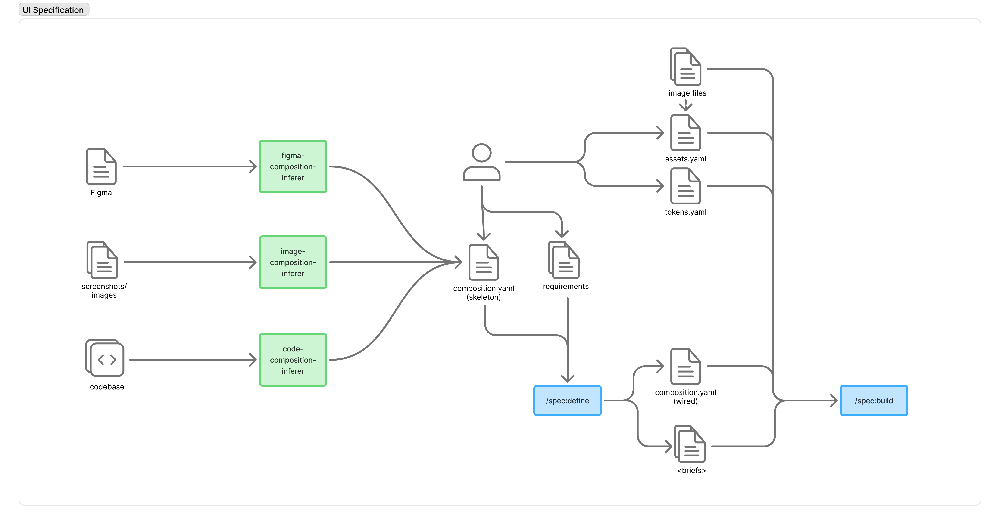

# RFC-11: UI Specification Workflow

> Status: Draft · Depends: [RFC-7](archive/rfc-7-ui.md)

## Abstract

Define the **UI specification workflow** that produces every input the vectis shell writers need to render a Crux application: the layout (`composition.yaml`), the design tokens (`tokens.yaml`), the asset inventory (`assets.yaml` + image files), and the per-screen requirements that flow through `/spec:define` into `/spec:build`. RFC-7 introduced `composition.yaml` as a multi-source artifact and described its skeleton/wired duality, but only the manual-authoring and one Figma-import path were ever fleshed out, and the tokens / assets surface stayed implicit. This RFC scopes:

- **three peer specialist "composition-inferer" skills** — one each for Figma, screenshot/image inputs, and existing source code — that emit a `composition.yaml` skeleton from their respective inputs;
- the **`tokens.yaml` and `assets.yaml`** artifacts that travel alongside the skeleton, with the operator and (where useful) the inferers as joint sources;
- the **`/spec:define`** contract that turns a skeleton + requirements into a wired `composition.yaml` plus the existing vectis define briefs;
- the **`/spec:build`** consumption surface where the shell writers see the wired composition, tokens, assets, and image files as a single coherent input set;
- the **dissolution of `design-system` as a peer "platform"** in proposals and the build phase. The "design system" name is reserved for the *input* artifacts the operator maintains (`composition.yaml`, `tokens.yaml`, `assets.yaml`, and any future component vocabulary). The lower-level reusable components — today the `VectisDesign` Swift Package and `vectis-design` Compose library emitted by `vectis:design-system-writer` — fold into each shell writer. iOS and Android stay the only runtime platforms; nothing parallel to them is generated.

The previous RFC-11 (`screenshots → composition`) is folded into this RFC as the `image-composition-inferer` subsection. The previously-implicit "design-system workflow baked into vectis" — `tokens.yaml` + `vectis:design-system-writer` — is rethought here as one slice of the broader pipeline rather than a standalone surface, and the peer-platform packaging that grew up around it is removed (§L).

## Motivation

### What the diagram captures



The diagram describes the target pipeline at a glance:

1. **Three sources** can drive the skeleton — a Figma file, a set of screenshots/images, or an existing codebase. Each has a dedicated *composition-inferer* skill (green) that produces a `composition.yaml (skeleton)`.
2. **The operator** is a peer source — they can hand-author the skeleton directly, and they always own the `requirements`, `tokens.yaml`, and the raw image files. `assets.yaml` is derived from those image files, with the operator confirming names and per-platform choices.
3. **`/spec:define`** consumes the skeleton plus requirements and emits the wired `composition.yaml` plus the rest of the vectis define briefs.
4. **`/spec:build`** consumes the wired composition along with the asset inventory, the design tokens, and the raw image files.

Everything to the left of `/spec:define` is *UI input material*. Everything from `/spec:define` onward is the existing Specify lifecycle. This RFC scopes the left half and the contract at the seam.

### What ships today

- **Composition.** [RFC-7](archive/rfc-7-ui.md) defined the artifact and the skeleton/wired modes. Two source paths are operational: agent-inferred-from-specs (low fidelity) and hand-authored. The Figma adapter is described but not implemented; the legacy-app and screenshot paths are open.
- **Tokens.** [`vectis:design-system-writer`](../plugins/vectis/skills/design-system-writer/SKILL.md) regenerates iOS Swift Package + Android Compose library from a hand-authored `design-system/tokens.yaml`. There is no JSON Schema for `tokens.yaml`; value shapes (colour / font / scalar) are inferred from the first entry per category.
- **Assets.** No artifact and no skill. Image files end up in shell-specific asset catalogues (`Assets.xcassets`, `res/drawable*/`) by hand or by ad-hoc shell-writer copy steps. The composition vocabulary references icons and images by bare name with no central index.
- **Requirements.** Travel today as the user prompt + the existing vectis specs/proposal briefs. The diagram treats `requirements` as a first-class input to `/spec:define`, peer to the skeleton — making it explicit that the skeleton is *layout intent* and the requirements are *behavioural intent* and they meet at define time.
- **Define / build.** The vectis define pipeline already includes a [composition brief](../schemas/vectis/briefs/composition.md) that reads an existing skeleton when present and otherwise infers one. The build brief hands `composition.yaml`, `app.rs`, `tokens.yaml`, and the spec shell sections to each shell writer. There is no asset hand-off yet.

### What is missing

- **No source-of-truth path for the skeleton beyond Figma-on-paper and hand-authoring.** Real teams arrive with screenshots, a deployed app, or both, and currently have to hand-translate them into composition vocabulary.
- **No shared inferer contract.** Each prospective source (Figma, image, code) faces the same problems — schema grounding, ambiguity reporting, idempotent re-runs, multi-source merging — with no shared scaffolding.
- **No assets pipeline.** Image files have no inventory artifact, no per-platform mapping (`@2x`/`@3x` vs density buckets), no token-style naming, and no resolution check at validate time.
- **No published tokens schema.** Adding a category (motion, elevation, iconography) requires coordinated edits across writer + per-platform templates with no validator.
- **No formal define contract.** What `/spec:define` requires from the skeleton vs. produces in the wired composition is RFC-7 prose; it has never been pinned as an interface that three different inferer skills can target consistently.
- **No build hand-off for assets / tokens beyond ad-hoc.** The shell writers need to know which images and tokens this build expects, but they receive that knowledge by inference rather than as a manifest.
- **`design-system` is wired as a peer "platform" of `ios` and `android`.** The proposal brief lists it alongside the runtime platforms ([`schemas/vectis/briefs/proposal.md`](../schemas/vectis/briefs/proposal.md)), the build brief runs it as the first phase ([`schemas/vectis/briefs/build.md`](../schemas/vectis/briefs/build.md)), the plan-time discovery and propose briefs treat it as a tier ([`schemas/vectis/briefs/plan/discovery.md`](../schemas/vectis/briefs/plan/discovery.md), [`propose.md`](../schemas/vectis/briefs/plan/propose.md)), and `vectis:design-system-writer` ships a Swift Package and a Compose library into `design-system/ios/` and `design-system/android/` that the iOS and Android shells consume as external dependencies. This is an anomaly: nothing is *deployed* to "design-system" — the artifact is a build-time prerequisite for the real runtime targets. Conflating the input surface (the operator-maintained `tokens.yaml`, `composition.yaml`, `assets.yaml`) with the per-platform emit (Swift / Kotlin token files) creates redundant lifecycle scaffolding (its own platforms entry, its own build phase, its own writer skill, its own task ordering) and an unnatural shared-library boundary that each shell would otherwise own internally.

### Non-goals

- **Not a redesign of `composition.yaml` or its schema.** RFC-7 already settled the artifact; this RFC defines the producers and consumers around it.
- **Not a redesign of the Specify lifecycle.** `/spec:define` and `/spec:build` are existing skills; this RFC scopes their *contract* with the new producers, not their internal flow.
- **Not a design tool.** Specify does not replace Figma or any image editor. The inferers ingest existing artefacts; visual editing stays upstream.
- **Not a runtime theming engine.** Output is generated source the shells compile against, same as today; no dynamic theme-swap protocol.
- **Not a hosted service.** All inputs and outputs stay local and reviewable, per the [roadmap directional principles](roadmap.md#directional-principles).
- **No spec generation from screenshots, Figma, or code by these skills.** The inferers produce *composition skeletons only*. Behavioural specs continue to come from `/spec:define`, `/spec:extract`, or hand-authoring.

## Detailed Design

> This section is intentionally a scaffold. Subsections marked **TBD** are the questions that need to be resolved over follow-up sessions; the bullets are the open questions, not the answers.

### A. Composition inferers — shared contract

**TBD.** The three inferer skills share enough surface that the contract should be defined once. Open questions:

- **Inputs and arguments.** What is the common argument shape across inferers (target change-dir, output path, optional baseline `composition.yaml` to update, optional per-screen hints)?
- **Output.** All three produce a `composition.yaml` skeleton conformant with [`schemas/vectis/composition.schema.json`](../schemas/vectis/composition.schema.json) — no `bind`, `event`, `maps_to`, or `*-when`. They MAY emit token references (`color: primary`, `gap: md`) when the source provides enough signal; they MAY emit `# GAP: …` and `# TODO: …` YAML comments per the existing convention.
- **Provenance.** Each inferer stamps `provenance.sources[]` with its `kind` (`figma`, `screenshots`, `legacy`) and a `uri` / `captured_at`. Multi-source merges append rather than overwrite.
- **Idempotence and re-runs.** When a baseline skeleton exists, the inferer adds and refines but does not silently delete operator-edited content. Open question: per-screen "owned by inferer" markers vs. always-additive merge.
- **Verification.** Each inferer's emit step round-trips through schema validation and surfaces the gap report in its terminal output.
- **Skill shape.** A single `vectis-composition-inferer` skill with a required `--source <kind>` flag, or three sibling skills (`vectis-figma-composition-inferer`, `vectis-image-composition-inferer`, `vectis-code-composition-inferer`) sharing a `references/inferer-contract.md`? See §H.

### B. Skill 1 — `figma-composition-inferer`

**TBD.** Open questions:

- **Input.** A Figma file URL + access token, an exported Figma JSON, or both? Does the skill assume a Figma plugin / MCP server or shell out to the Figma REST API directly?
- **Mapping.** RFC-7 §"Figma Import" already lists the Figma Auto Layout → composition vocabulary mapping (frames, layoutMode, itemSpacing, padding, alignment, sizing). This skill operationalises that mapping.
- **Variables.** Figma Variables (colours, numbers, strings) are the natural source for `tokens.yaml` enrichment as well — does this skill emit a `tokens.yaml` skeleton on the side, or is that a separate `figma-tokens-inferer`?
- **Components vs. instances.** How are Figma components surfaced — flattened into composition, or surfaced as a candidate for a future component-primitives layer (see §G)?

### C. Skill 2 — `image-composition-inferer`

**TBD.** This is the previous RFC-11 scope, generalised. Open questions (carried forward; resolve here, do not split into a separate RFC):

- **Inputs.** One or more screenshot files per screen (PNG/JPEG/HEIC). Optional grouping signal — which screenshots represent the same screen in different states (loading/empty/populated/error) vs. distinct screens. Optional platform hint (`ios` / `android` / `web`) so the agent ignores platform chrome.
- **Pipeline.** Triage screenshots into screens/states → infer regions (`header`, `body`, `footer`, `fab`) → infer container tree (groups with `direction`, `gap`, `padding`, `align`, `justify`, sizing, surface decoration) → map visual elements to leaf items.
- **Vision model.** What capability tier does the skill assume on the host runtime? Does it ship reference fixtures (screenshot → expected composition) for regression?
- **Token extraction.** This skill explicitly does **not** attempt to reverse `tokens.yaml` from pixels (token inference is its own quality bar, see §F). It MAY emit raw values where tokens would normally appear and surface a gap report.

### D. Skill 3 — `code-composition-inferer`

**TBD.** Open questions:

- **Input.** A path to an existing application's source tree, plus optional include/exclude globs (mirroring `/spec:extract`). What languages / frameworks are first-class in v1 — SwiftUI, Compose, React/JSX, Vue, Flutter, plain HTML/CSS, all of them?
- **Strategy.** Static analysis (parse view files, recover container hierarchy from declarative UI code) vs. agent-driven reading vs. hybrid. Declarative-UI source (SwiftUI, Compose, JSX) is the realistic v1 target; imperative UI (UIKit, AppKit, Win32) is a follow-up.
- **Relationship to `/spec:extract`.** `/spec:extract` already reverse-engineers specs from source code. Does `code-composition-inferer` become a sibling specialist that `/spec:extract` invokes when a `composition.yaml` skeleton is wanted alongside the specs, or stay independent (operator-invoked only)?
- **Asset capture.** Does this skill harvest image files from the source tree into a candidate `assets/` directory + `assets.yaml` skeleton? See §E.

### E. Assets pipeline — `assets.yaml` + image files

**TBD.** The diagram introduces `assets.yaml` as a first-class artifact derived from the operator-supplied image files. Open questions:

- **Schema.** What does `assets.yaml` look like? Candidate shape:

  ```yaml
  version: 1
  assets:
    onboarding-hero:
      kind: raster
      sources:
        ios:
          1x: assets/onboarding-hero.png
          2x: assets/onboarding-hero@2x.png
          3x: assets/onboarding-hero@3x.png
        android:
          mdpi: assets/android/onboarding-hero-mdpi.png
          xhdpi: assets/android/onboarding-hero-xhdpi.png
          xxhdpi: assets/android/onboarding-hero-xxhdpi.png
      tint: primary           # token ref, optional
      role: illustration       # decorative | icon | illustration | photo
  ```

- **Vector / SVG handling.** Do vector assets get a `kind: vector` shape with per-platform export rules (PDF for iOS, VectorDrawable for Android), or stay raster-only in v1?
- **Iconography.** Icons referenced from composition (`icon: { name: trash }`) — does this skill resolve them against `assets.yaml`, against a curated platform symbol set (SF Symbols, Material Symbols), or both?
- **Authoring vs. inference.** Does an `assets-inferer` skill exist (sibling to the composition inferers) that walks an asset directory and produces a draft `assets.yaml`, or does the operator hand-author?
- **Composition contract.** `composition.yaml` items that reference an asset (`image`, `icon`, decorative `group.background`?) must resolve against `assets.yaml`. Where does the resolution check live (validator vs. inferer vs. shell writer)?
- **Build-time hand-off.** How is `assets.yaml` + the raw image files fed to the iOS / Android writers — copied into the shell asset catalogue at build, or symlinked, or referenced in place?

### F. Tokens artifact — input only

**TBD.** `tokens.yaml` stays an *input* artifact the operator maintains alongside `composition.yaml` and `assets.yaml`. The emit half — Swift / Kotlin token files, Theme scaffolds, the `VectisDesign` Swift Package, the `vectis-design` Compose library — is no longer this surface's responsibility; it folds into the shell writers per §L. Open questions:

- **Schema.** Publish a JSON Schema for `tokens.yaml`. Today value shapes are inferred; declare them per-category. Decide one-file vs. split (`tokens/colour.yaml`, `tokens/typography.yaml`, …).
- **Vocabulary scope.** Beyond colour / typography / spacing / cornerRadius (current): elevation, border, motion, iconography (links to §E), opacity, gradient. Composition's `group.elevation` / `group.border` already reference token names with no backing category — close that gap first.
- **Provenance.** Carry `provenance.sources[]` analogous to composition, supporting `manual`, `figma-variables`, `style-dictionary`, `tokens-studio`, `legacy`.
- **Authoring / import.** Does a `vectis-tokens-inferer` skill (or a Figma-side intent of the figma inferer) import tokens from Figma Variables / Style Dictionary / Tokens Studio JSON / W3C DTCG? Or stays manual?
- **Multi-brand / theming.** No support today beyond light/dark. Skeleton question: does the artifact gain a `themes:` map, or is multi-brand a per-file mechanism?
- **Verification.** Cross-artifact: every token referenced from `composition.yaml` resolves; every token defined is referenced (or marked unused). The check lives once at the input layer; each shell writer trusts the resolved tokens at emit time rather than re-validating.
- **Canonical intermediate.** Open question: declare a canonical intermediate (W3C DTCG) that *each* shell writer consumes, or keep YAML as the contract and let each shell writer parse it directly. This decision is now scoped per §L (intermediate lives at the input surface, not at a separate emit surface).
- **Fallback policy.** The implicit Material 3 / HIG fallback when `tokens.yaml` is absent is currently spread across the shell writers; with §L it stays there by design — each shell writer owns the no-tokens path explicitly. The RFC formalises the contract ("when `tokens.yaml` is absent, the writer SHALL …") rather than relocating it.

### G. Component primitives (deferred decision)

**TBD.** RFC-7 sketched a `design-system/components.yaml` for reusable item compositions (cards, list rows, dialog footers, error states). Per §L, components are no longer a separate emit target; if this artifact lands it is *input* the shell writers consume, not output a peer skill emits. Open questions:

- Does it land in this RFC or wait for its own?
- If it lands: where does it sit on the diagram — between `tokens.yaml` and the wired composition, or as a sibling artifact the inferers can produce?
- Does the figma inferer surface Figma components into this artifact?
- Does the build hand-off change? (Default per §L: each shell writer reads `components.yaml` directly and bakes the platform-specific implementation into its own tree — no shared library.)
- Are there *cross-platform* primitives that would benefit from a shared declarative form, or are component primitives inherently per-platform code that each shell writer maintains as part of its own component library? If the latter, the artifact is a vocabulary the composition references, not a component definition.

### H. `/spec:define` contract

**TBD.** The seam at the centre of the diagram. Open questions:

- **Inputs the brief expects.** The skeleton (when present), the requirements, optional `tokens.yaml` and `assets.yaml`. Today the [composition brief](../schemas/vectis/briefs/composition.md) handles the skeleton + spec inputs; this RFC formalises the rest.
- **Outputs the brief produces.** Wired `composition.yaml` (`bind`, `event`, `maps_to`, `*-when`) plus the existing vectis define briefs (`proposal.md`, `spec.md`, `design.md`, `tasks.md`, `contracts.md`). Does anything new get produced (e.g. a `theme.md` summarising token usage)?
- **Multi-source skeleton handling.** When two inferers have contributed (e.g. Figma for some screens, screenshots for others), how is the merge surfaced — single skeleton, per-screen provenance, or operator-confirmed pre-define merge step?
- **Requirements artifact.** The diagram shows `requirements` as a first-class input. Is this the existing user prompt + spec brief output, or a new artifact (a pre-define `requirements.md`) the operator authors before invoking define?
- **Idempotence.** Re-running define with an updated skeleton MUST update only the wired keys it owns; operator-edited skeletons MUST survive intact.

### I. `/spec:build` contract

**TBD.** The right edge of the diagram. Open questions:

- **Inputs the build brief expects.** Today: wired `composition.yaml`, `app.rs`, `tokens.yaml`, spec shell sections. Add: `assets.yaml` and the raw image files. The [build brief](../schemas/vectis/briefs/build.md) handoff list grows accordingly.
- **Build phase ordering.** Today: design-system → core → shells. With §L: **core → shells**. The shell writers each consume `tokens.yaml` and `assets.yaml` directly and emit Theme / colour-scheme / typography / spacing / asset wiring inside their own tree (`iOS/`, `Android/`). There is no "design-system first" phase, no shared library to build before the shells, and no `:vectis-design` Gradle module / `VectisDesign` Swift Package between the tokens and the views.
- **Per-shell asset wiring.** ios-writer copies / references `assets.yaml` entries into `Assets.xcassets`; android-writer into `res/drawable*/` density buckets. Where does the copy/reference logic live — in each shell writer, or in a shared `vectis-assets-writer` step that runs ahead of the shell writers? Per §L the default answer is **inside each shell writer**, mirroring how tokens emit folds in.
- **Token wiring.** `tokens.yaml` flows directly to each shell writer. Each writer owns the token-emit templates that today live under `plugins/vectis/skills/design-system-writer/references/swift-token-templates.md` and `kotlin-token-templates.md` — those references migrate into the corresponding shell-writer skills.
- **Reviewer surface.** ios-reviewer and android-reviewer gain checks for unresolved asset references (mirroring the existing token-resolution checks). The token-resolution checks themselves stay in the same place; only the emit they validate moves into the shell writer's own tree.

### J. Skill shape, naming, and plugin layout

**TBD.** Following the [skill-authoring conventions](../docs/explanation/skill-authoring.md). Open questions:

- **Composition inferers.** Three skills (`vectis-figma-composition-inferer`, `vectis-image-composition-inferer`, `vectis-code-composition-inferer`) sharing `references/inferer-contract.md`, vs. one skill (`vectis-composition-inferer`) with a required `--source` flag and three sibling pipelines. The diagram's three green boxes lean toward the former; the interfaces plugin pattern leans toward the latter.
- **Tokens / assets surfaces.** Are these skills (`vectis-tokens-inferer`, `vectis-assets-inferer`) under the vectis plugin, or do they justify a sibling plugin (`design`)?
- **Existing skill fate.** `vectis:design-system-writer` is **removed** as a peer skill (per §L). Its emit logic and references (`swift-token-templates.md`, `kotlin-token-templates.md`, the Material 3 / HIG fallback policy in `design-system-integration.md`) migrate into `vectis:ios-writer` and `vectis:android-writer`. Open question: is the slash-command kept as a deprecated alias for one release, or removed outright?
- **Slash-command surface.** `/vectis:figma-composition-inferer <args>` etc., or one command `/vectis:infer-composition --source <kind>`?
- **Plugin home.** All under `plugins/vectis/skills/`, or a new top-level `plugins/ui/` for the source-agnostic surface (composition inferers, assets, tokens) that vectis and any future UI plugin consumes?

### K. Migration

**TBD.** How a project that already has the today-shape upgrades. Open questions:

- **Existing `tokens.yaml`.** Forward-compatible (new categories additive, value-shape inference preserved) or one-shot migration?
- **Existing `composition.yaml`.** No change expected — RFC-7 schema is preserved; the inferers target the same artifact.
- **Existing `vectis:design-system-writer`.** Removed per §L. Existing projects ship a one-shot consolidation: delete `design-system/ios/` and `design-system/android/` from the repo, regenerate the iOS shell with `/vectis:ios-writer` and the Android shell with `/vectis:android-writer` so the token / Theme code is emitted *inside* `iOS/` and `Android/` instead of as an external library, and drop `:vectis-design` from `settings.gradle.kts` plus the `VectisDesign` package reference from XcodeGen `project.yml`. Open question: provide a one-shot `vectis-design-system-dissolve` migration skill, or document the steps and let operators run them by hand?
- **Existing proposals.** Proposals that list `design-system` under `Platforms` need a migration. Either the proposal brief silently treats `design-system` as a no-op (back-compat) or `/spec:define` rewrites it on next regeneration. The proposal brief's `Platforms` enum loses the `design-system` entry; the `## Design System Requirements` spec section is reframed as token / asset requirements that ship with whichever runtime platform they affect.
- **Existing build / plan briefs.** The "design-system first" build phase, the design-system tier in `plan/discovery.md` and `plan/propose.md`, the `vectis:design-system-writer` directive in `tasks.md`, and the design-system tasking heuristics all retire. The plan brief gains an explicit note that token / asset / composition entries are *cross-cutting inputs* that depend on shared-core where appropriate but produce code only via the shell entries that consume them.
- **No `assets.yaml` today.** New projects get one from day one; existing projects need a one-shot inventory pass (manual or via a forthcoming `assets-inferer`).
- **Downstream consumer repos.** Should regenerate cleanly with no manual edits beyond the one-shot consolidation above. The first regeneration after dissolution is a structural change (library removed, code moved into the shell trees) and SHOULD ship as its own change so the diff stays reviewable.

### L. Dissolving the `design-system` peer platform

**TBD.** This subsection scopes the cleanup the user-visible surface needs to absorb. The design-system anomaly is the `What is missing` bullet that has the most cross-cutting blast radius — it touches the proposal vocabulary, the build phase ordering, the plan-time tier model, the vectis plugin's skill set, and the per-shell consumer rules.

The principle:

- **The "design system" name belongs to inputs, not emit.** `composition.yaml`, `tokens.yaml`, `assets.yaml`, and any future component vocabulary (§G) are the *design system* an operator maintains over time. They are the artifacts the inferers produce / refine and that `/spec:define` consumes.
- **There is no peer platform between the inputs and the runtime shells.** iOS and Android (and future web) are the only platforms. Each runtime shell writer reads the input artifacts directly and emits everything it needs — Theme, colour scheme, typography, spacing, corner radius, asset wiring, reusable component primitives — *inside its own tree*.

What this means concretely:

- **Proposal brief.** The `Platforms` enum (`schemas/vectis/briefs/proposal.md`) drops `design-system`. The remaining values are `core`, `ios`, `android`, `web`. The `Platforms` block continues to drive build-phase scope.
- **Specs brief.** The `## Design System Requirements` section in `schemas/vectis/briefs/specs.md` becomes a regular per-platform shell section (or merges into existing iOS / Android sections), since there is no separate platform to host design-system-only requirements.
- **Build brief.** The dependency order in `schemas/vectis/briefs/build.md` becomes **core → shells** (parallel iOS / Android). The "Design system" build subsection retires. The shell writers depend only on core.
- **Plan briefs.** Discovery (`plan/discovery.md`) drops the design-system tier; capabilities that used to surface there reframe as cross-cutting inputs that the per-shell entries consume. Propose (`plan/propose.md`) drops the "design system next" rung; design-token / component entries (when they exist as plan slices at all) become inputs to the per-shell slices that read them.
- **Tasks brief.** The build-phase task ordering in `schemas/vectis/briefs/tasks.md` becomes "core first, shells second" (no design-system tier). The skill table drops `vectis:design-system-writer`.
- **Composition brief.** The token-availability check in `schemas/vectis/briefs/composition.md` continues to reference `tokens.yaml` and is unchanged in behaviour; the trigger phrase ("`design-system` is listed in the proposal's Platforms") simplifies to "`tokens.yaml` exists".
- **Vectis plugin.** `plugins/vectis/skills/design-system-writer/` is removed. Its references — `swift-token-templates.md` and `kotlin-token-templates.md` — migrate to `plugins/vectis/skills/ios-writer/references/` and `plugins/vectis/skills/android-writer/references/` respectively. The Theme.swift / Theme.kt scaffolds, `Package.swift`, and `vectis-design` `build.gradle.kts` templates fold into the corresponding shell-writer scaffolds. The Material 3 / HIG fallback policy that today lives in `design-system-integration.md` becomes a normative section of each shell writer.
- **Generated layout.** The `design-system/` repo-root directory shrinks to only the *input* artifacts: `design-system/composition.yaml`, `design-system/tokens.yaml`, `design-system/assets.yaml`, `design-system/assets/<images>`. The `design-system/ios/` Swift Package and `design-system/android/` Compose library disappear; the equivalent emitted code lives under `iOS/` (e.g. `iOS/<App>/Theme/`) and `Android/` (e.g. `Android/app/src/main/kotlin/.../theme/`).

Open questions specific to §L:

- **Naming.** Is "design system" still the right umbrella for the input artifacts when no library by that name is generated? Candidates: keep `design-system/` as the directory name (operator-facing continuity), rename to something like `ui/` or `design/` (consistency with the §J plugin-home question), or move the artifacts inline under `.specify/` (consistency with other Specify artifacts). Default: keep `design-system/` for the directory; treat the name as a folder convention rather than a generated boundary.
- **Where Theme / scheme code lives in each shell.** Open question for ios-writer / android-writer: is the emitted Theme code one Swift file (e.g. `iOS/<App>/Theme/Theme.swift` containing `VectisColors`, `VectisTypography`, …) or split as today? The answer is per-shell-writer; this RFC only mandates that the code lives *inside* the shell's tree.
- **Per-shell duplication.** With shared emit gone, the colour / font / spacing token tables are read twice (once per shell writer) instead of once. Open question: does that justify a shared parser library, or is the parsing trivial enough that "twice" is fine? Default position: trivial; each writer parses YAML directly.
- **Reviewer impact.** ios-reviewer and android-reviewer continue to enforce token-only colour / font / spacing references in app code. Open question: do they gain a stricter check that the token *definitions* live inside the shell tree (not as an external library reference), or does the absence of `import VectisDesign` / `:vectis-design` already cover that?
- **`vectis:design-system-writer` users.** Operators may have references / scripts pointed at `/vectis:design-system-writer`. Open question: keep the slash-command alive as a thin wrapper that prints "use `/vectis:ios-writer` and `/vectis:android-writer` instead" for one release, or delete it cleanly?
- **Web shell.** Web is listed in the proposal `Platforms` as future. With §L, when web lands it follows the same pattern: it parses tokens / assets directly and emits its own theme code. Confirm this is the intended trajectory rather than re-introducing a shared web design-system library.

## Open Questions

Consolidated for the next iteration session(s):

1. Shared inferer contract — where does it live, what does it pin? (§A)
2. Figma access model — REST + token, plugin/MCP, or exported JSON? Variables → tokens overlap. (§B)
3. Image-inferer pipeline shape — one agent loop vs. staged passes; vision-model assumption. (§C)
4. Code inferer scope — declarative-UI v1, framework coverage, relationship to `/spec:extract`. (§D)
5. `assets.yaml` schema, vector handling, iconography source-of-truth, build-time hand-off. (§E)
6. Tokens schema publication, vocabulary scope, multi-brand, canonical intermediate (W3C DTCG?) given each shell now consumes tokens directly. (§F)
7. Whether the component-primitives layer lands here or waits, and whether component primitives are inherently per-shell or warrant a shared declarative form. (§G)
8. `/spec:define` input/output contract; merge semantics for multi-source skeletons; nature of the `requirements` input. (§H)
9. `/spec:build` asset / token hand-off shape; per-shell vs. shared assets-writer step; build-phase ordering after design-system retires. (§I)
10. Skill decomposition (three vs. one), plugin home (vectis vs. new `ui` plugin), command surface, fate of `vectis:design-system-writer` (deprecated alias vs. clean delete). (§J)
11. Migration story for projects with today's `tokens.yaml`, ad-hoc asset layouts, and the existing `design-system/{ios,android}/` shared libraries. (§K)
12. Dissolving the `design-system` peer platform — directory naming, per-shell duplication of token parsing, reviewer enforcement, web-shell trajectory. (§L)

## Alternatives Considered

**TBD.** Candidates to evaluate when the design firms up:

- **Status quo.** Keep the surface narrow: hand-author skeletons and `tokens.yaml`, no assets artifact. Cheap to maintain; defeats the point for any team starting from a deployed app or a Figma file.
- **One mega-inferer.** A single `vectis-ui-inferer` that takes any of (Figma, screenshots, code) and dispatches internally. Fewer skills to maintain; harder to give each source the depth it needs and obscures the diagram's three-box clarity.
- **Adopt an external token spec wholesale.** Replace `tokens.yaml` with W3C DTCG and outsource authoring to existing tools. Reduces what Specify owns; couples vectis to an external spec's evolution.
- **Fold everything into composition.** Make `composition.yaml` the only source of truth for layout, tokens, and assets. Conceptually simple; loses the ability to evolve tokens / assets independently and conflates concerns RFC-7 deliberately separated.
- **Spin a sibling `ui` plugin.** Move composition / inferers / tokens / assets into a UI plugin that vectis (and future shell plugins) consume. Forward-looking if web / desktop / TV shells arrive; over-engineered if vectis stays the only consumer.
- **Keep `design-system` as a peer platform** (status-quo for §L). Preserve `vectis:design-system-writer` and the shared `VectisDesign` / `vectis-design` libraries between tokens and shells. Pros: emit logic lives once, the shell writers stay smaller, downstream apps can import the libraries directly. Cons: introduces a build artifact that is never deployed on its own, complicates the proposal `Platforms` vocabulary, forces an external-library boundary onto theming code that each shell would otherwise own internally, and leaks platform packaging concerns (Swift Package, Gradle module, version pinning) into a surface whose only legitimate role is *input*. Rejected because the cost of the peer-platform shape exceeds the benefit of single-emit; the duplication §L introduces (each shell writer parses tokens / assets directly) is small and self-contained.

## References

- [RFC-7: View Layout Artifact for UI Generation](archive/rfc-7-ui.md) — the composition artifact and skeleton/wired duality this RFC operationalises
- [`schemas/vectis/composition.schema.json`](../schemas/vectis/composition.schema.json) — the composition schema the inferers must validate against
- [`schemas/vectis/briefs/composition.md`](../schemas/vectis/briefs/composition.md) — the existing composition brief that consumes the skeleton at define time
- [`schemas/vectis/briefs/build.md`](../schemas/vectis/briefs/build.md) — the build brief whose hand-off list grows with `assets.yaml` + image files, and whose phase ordering simplifies once design-system retires (§I, §L)
- [`schemas/vectis/briefs/proposal.md`](../schemas/vectis/briefs/proposal.md) — the proposal brief whose `Platforms` vocabulary loses `design-system` (§L)
- [`schemas/vectis/briefs/specs.md`](../schemas/vectis/briefs/specs.md) — the specs brief whose `## Design System Requirements` section reframes once the peer platform retires (§L)
- [`schemas/vectis/briefs/tasks.md`](../schemas/vectis/briefs/tasks.md) — the tasks brief whose phase ordering and skill table shed the design-system tier (§L)
- [`schemas/vectis/briefs/plan/discovery.md`](../schemas/vectis/briefs/plan/discovery.md) and [`plan/propose.md`](../schemas/vectis/briefs/plan/propose.md) — the plan briefs whose tier model loses the design-system rung (§L)
- [`plugins/vectis/skills/design-system-writer/SKILL.md`](../plugins/vectis/skills/design-system-writer/SKILL.md) — the current emit-only design-system skill that this RFC dissolves (§F, §L); its references migrate into the shell writers
- [`plugins/vectis/skills/ios-writer/references/design-system-integration.md`](../plugins/vectis/skills/ios-writer/references/design-system-integration.md) — current iOS consumer-side rules (token usage, fallback policy)
- [`plugins/vectis/skills/android-writer/references/design-system-integration.md`](../plugins/vectis/skills/android-writer/references/design-system-integration.md) — current Android consumer-side rules and Material 3 fallback policy
- [`plugins/spec/skills/extract/SKILL.md`](../plugins/spec/skills/extract/SKILL.md) — the existing source-code extraction skill that the `code-composition-inferer` may sit alongside (§D)
- [`plugins/interfaces/`](../plugins/interfaces/) — author / import / verify intent pattern relevant to the inferer / skill-shape decisions (§J)
- [Roadmap](roadmap.md) — directional principles (CLI-authoritative, local-and-reviewable, separation of workflow / standards / artifacts) this RFC must respect
- [`rfcs/assets/ui-spec.png`](assets/ui-spec.png) — the high-level diagram this RFC scopes
