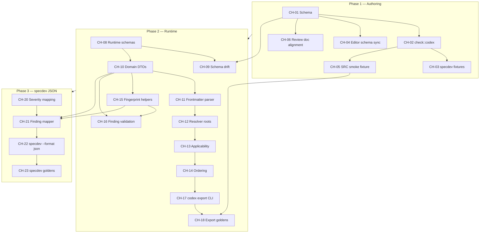

# RFC-28 Implementation Plan

Companion to [RFC-28: Engineering Standards — Codex Contract and Findings](rfc-28-standards-contract.md).

This plan decomposes RFC-28 into **subagent-sized changes** that can be implemented independently where noted. Changes are sequenced so dependencies land first. The RFC targets **one PR** across `augentic/specify` and `augentic/specify-cli`; use this plan to parallelize work on a shared branch.

## Goals

1. Extend the codex **authoring** contract (`specdev check`) for `SRC-*` source overlays and reserved `FRAME-*` / hint kinds.
2. Add **runtime** codex resolution and JSON export (`specrun codex export`).
3. Define the **`ReviewFinding`** wire contract and converge `specdev check --format json` onto it (Phase 3 Option A).

**Out of scope:** `specrun review`, hint execution, WorkspaceModel, declarative `FRAME-*` rules (RFC-32).

## Dependency overview



## Execution waves

| Wave | Changes | Notes |
| --- | --- | --- |
| **W1** | CH-01 | Blocks all other work |
| **W2** | CH-02, CH-04, CH-06 (parallel) | CH-06 splits into four parallel subagents |
| **W3** | CH-03, CH-05 | After CH-02 |
| **W4** | CH-08 | Starts Phase 2; needs CH-01 for drift source |
| **W5** | CH-09, CH-10, CH-15, CH-20 (parallel) | CH-09 needs CH-08; CH-15/CH-20 need CH-10 |
| **W6** | CH-11 | |
| **W7** | CH-12 | |
| **W8** | CH-13, CH-16 (parallel) | CH-16 can start once CH-15 lands |
| **W9** | CH-14 | |
| **W10** | CH-17 | |
| **W11** | CH-18, CH-19 (parallel) | CH-19 is docs-only |
| **W12** | CH-21 | |
| **W13** | CH-22 | |
| **W14** | CH-23, CH-24, CH-25 (parallel) | Editorial pass |
| **Optional** | CH-07 | Separate small PR; not blocking |

---

## Phase 1 — Authoring validation and plugin alignment

### CH-01 — Extend codex authoring schema

| Field | Value |
| --- | --- |
| **Repo** | `augentic/specify-cli` |
| **Primary files** | `crates/authoring/schemas/codex-rule.schema.json` |
| **Depends on** | — |
| **Parallel with** | — (must run first) |
| **Blocks** | CH-02, CH-03, CH-04, CH-05, CH-09 |

**Scope**

1. Add `SRC` and `FRAME` to the closed `ruleId` regex: `^(UNI|SRC|FRAME|RUST|IFACE|SEC|OMNIA|VECTIS|ORG)-[0-9]{3}$`.
2. Extend `deterministic_hints.kind` with RFC-32 reserved kinds (`unique`, `reference-resolves`, `set-coverage`, `cardinality`, `constant-eq`, `set-eq`, `content-digest-eq`, `namespace-owner`) using `"x-rfc32-status": "reserved"` where the schema supports it.
3. Keep hints optional; do not add new required frontmatter fields.

**Acceptance**

- Schema validates existing first-party codex files unchanged.
- Invalid ids (`VECTIS-CORE-001`, `FRAME-001` under adapter trees) remain rejectable at the predicate layer (CH-02), not silently accepted by placement.

**Subagent brief:** Update only the authoring JSON schema per RFC-28 §Namespaces and §Deterministic hints extensibility. Do not touch Rust yet.

---

### CH-02 — Extend `check::codex` predicates

| Field | Value |
| --- | --- |
| **Repo** | `augentic/specify-cli` |
| **Primary files** | `crates/authoring/src/check/codex.rs` |
| **Depends on** | CH-01 |
| **Parallel with** | CH-04, CH-06 |
| **Blocks** | CH-03, CH-05 |

**Scope**

1. Discover every source adapter owner under `adapters/sources/<name>/codex/` and map each to `{"SRC"}` in `CODEX_PROFILE_NAMESPACES` (dynamic discovery, not a hardcoded adapter name).
2. Reject any `FRAME-*` rule file discovered under `adapters/{sources,targets}/<name>/codex/` with `codex.namespace-ownership-violation`.
3. Preserve existing target/shared namespace maps (`UNI`, `OMNIA`, `RUST`, `SEC`, `VECTIS`, `IFACE`).

**Acceptance**

- `cargo make check` green in `specify-cli`.
- A hypothetical `FRAME-001` file under `adapters/targets/omnia/codex/` fails check.
- Source adapter paths accept `SRC-*` only.

**Subagent brief:** Implement namespace ownership and FRAME placement rejection in `codex.rs`. Read `discover_codex_rule_files` and `namespace_owner_for_path` before editing.

---

### CH-03 — specdev codex test fixtures

| Field | Value |
| --- | --- |
| **Repo** | `augentic/specify-cli` |
| **Primary files** | `crates/authoring/tests/check_codex.rs`, fixture trees under `crates/authoring/tests/fixtures/` |
| **Depends on** | CH-01, CH-02 |
| **Parallel with** | CH-05 |
| **Blocks** | — |

**Scope**

1. Fixture: valid `SRC-*` rule under a source adapter codex path passes namespace check.
2. Fixture: `FRAME-*` under adapter codex path fails with ownership violation.
3. Fixture: reserved hint kind validates shape only (no execution).

**Acceptance**

- `cargo test -p specify-authoring check_codex` passes.

---

### CH-04 — Sync editor schema copy

| Field | Value |
| --- | --- |
| **Repo** | `augentic/specify` |
| **Primary files** | `.cursor/schemas/codex-rule.schema.json` |
| **Depends on** | CH-01 |
| **Parallel with** | CH-02, CH-06 |
| **Blocks** | — |

**Scope**

Byte-align `.cursor/schemas/codex-rule.schema.json` with `crates/authoring/schemas/codex-rule.schema.json` from CH-01.

**Acceptance**

- Schemas identical (diff empty).

---

### CH-05 — SRC smoke fixture (plugin repo)

| Field | Value |
| --- | --- |
| **Repo** | `augentic/specify` |
| **Primary files** | `adapters/sources/documentation/codex/` (new rule file) |
| **Depends on** | CH-01, CH-02 |
| **Parallel with** | CH-03 |
| **Blocks** | CH-18 (export golden uses `origin: source`) |

**Scope**

Add one valid `SRC-*` codex rule under `adapters/sources/documentation/codex/` with required frontmatter and `## Rule` body. Pick an unused `SRC-NNN` id.

**Acceptance**

- `make check` passes in `augentic/specify`.
- Rule discoverable by `specdev check`.

---

### CH-06 — Review brief and codex doc alignment

| Field | Value |
| --- | --- |
| **Repo** | `augentic/specify` |
| **Depends on** | CH-01 (severity enum is already in schema; docs must match) |
| **Parallel with** | CH-02, CH-04, and **within CH-06** — split by subagent |

Split into **four parallel subagents**:

#### CH-06a — Omnia review docs

**Files**

- `adapters/targets/omnia/references/review-output-template.md`
- `adapters/targets/omnia/references/review-categories.md`
- `adapters/targets/omnia/references/review-team-protocol.md`
- `adapters/targets/omnia/briefs/build/review.md`

**Changes**

- Severity vocabulary: `CRITICAL → critical`, `HIGH → important`, `MEDIUM → suggestion`, `LOW → optional`.
- Clarify report-local occurrence ids vs codex `rule_id` / `rule-id`.
- Ensure examples use valid codex ids (`OMNIA-NNN`, `RUST-NNN`, `SEC-NNN`, `UNI-NNN`).

#### CH-06b — Vectis review docs

**Files**

- `adapters/targets/vectis/briefs/build/{core,ios,android}/review.md`
- `adapters/targets/vectis/references/review/*.md`

**Changes**

- Same severity mapping as CH-06a.
- Replace invalid placeholders (`VECTIS-CORE-001`, `VECTIS-AND-001`) with valid `VECTIS-NNN` ids.

#### CH-06c — Contracts review docs

**Files**

- `adapters/targets/contracts/briefs/merge.md`
- `adapters/targets/contracts/references/**` (verifier references)

**Changes**

- Severity mapping and structured finding field callouts aligned to RFC-28 finding schema.

#### CH-06d — Shared codex README

**Files**

- `adapters/shared/codex/universal/README.md`

**Changes**

- Document `SRC-*` source overlays.
- Point schema link at `crates/authoring/schemas/codex-rule.schema.json` via `docs/contributing/checks.md`; remove stale `tooling/` paths.

**Acceptance (all CH-06)**

- `make check` passes.
- No stale `tooling/` references in codex contributor paths.

---

### CH-07 — Editor hygiene (optional, separate PR)

| Field | Value |
| --- | --- |
| **Repo** | `augentic/specify` |
| **Files** | `.vscode/settings.json`, `.cursor-plugin/marketplace.json` |
| **Depends on** | — |
| **Parallel with** | Any wave |
| **Blocks** | — |

Retire `tooling/schemas/` pointers; aim at `.cursor/schemas/` or `specify-cli` authoring schemas. RFC-28 explicitly allows this as a separate PR — do not expand scope into deleting the legacy `tooling/` tree.

---

## Phase 2 — Runtime resolution and export

### CH-08 — Runtime JSON schemas

| Field | Value |
| --- | --- |
| **Repo** | `augentic/specify-cli` |
| **Primary files** | `schemas/codex/resolved.schema.json`, `schemas/codex/codex-rule.schema.json`, `schemas/review/finding.schema.json` |
| **Depends on** | — (Phase 2 entry; logically after Phase 1 schema shape is settled) |
| **Parallel with** | — within W4 |
| **Blocks** | CH-09, CH-10, CH-16, CH-18, CH-23 |

**Scope**

1. **`resolved.schema.json`** — export envelope (`version`, `target-adapter`, `source-adapters`, `rules[]`) with kebab-case wire fields, `origin`, `path-root`, `path`, `body`, `deprecated.replaced-by`, ordered severity enum.
2. **`codex-rule.schema.json`** — vendored copy target for authoring schema (initial content from CH-01 output).
3. **`finding.schema.json`** — full `ReviewFinding` contract including evidence `oneOf`, fingerprint pattern, location shape, closed enums.

**Acceptance**

- Schemas validate RFC-28 minimal JSON examples from the RFC body.
- Register in `crates/domain/src/schema.rs` (or equivalent) for runtime validation.

**Subagent brief:** Author schemas only from RFC-28 §Resolved codex export and §Structured review finding schema. No Rust resolver yet.

---

### CH-09 — Schema drift predicate and sync script

| Field | Value |
| --- | --- |
| **Repo** | `augentic/specify-cli` |
| **Primary files** | `crates/authoring/src/check/` (new `codex_schema_drift` or extend `mod.rs`), `scripts/sync-codex-schema.sh` |
| **Depends on** | CH-01, CH-08 |
| **Parallel with** | CH-10, CH-15, CH-20 |
| **Blocks** | CI green for Phase 2 |

**Scope**

1. `codex.schema-drift` check: SHA-256 parity between authoring and vendored runtime codex schemas.
2. `scripts/sync-codex-schema.sh`: deterministic byte-for-byte copy (no reformatting).
3. Wire check into `specdev check` predicate list.

**Acceptance**

- Drift fails with regenerate hint.
- Script produces identical bytes to authoring schema.

---

### CH-10 — Domain DTOs and schema embedding

| Field | Value |
| --- | --- |
| **Repo** | `augentic/specify-cli` |
| **Primary files** | `crates/domain/src/codex/` (new module tree) |
| **Depends on** | CH-08 |
| **Parallel with** | CH-09, CH-15, CH-20 |
| **Blocks** | CH-11, CH-15, CH-16, CH-21 |

**Scope**

Rust types with serde kebab-case at all nesting levels:

- `CodexRule`, `ResolvedCodex`, `ReviewFinding`, `FindingLocation`, `FindingEvidence` (snippet | digest | structured union)
- Severity, origin, path-root, review-mode, source enums
- `include_str!` schema embeds matching `crates/domain/src/schema.rs` patterns

**Acceptance**

- Unit tests: round-trip sample JSON fixtures through types.
- `deprecated.replaced_by` deserializes from wire key `deprecated.replaced-by`.

---

### CH-11 — Frontmatter parser

| Field | Value |
| --- | --- |
| **Repo** | `augentic/specify-cli` |
| **Primary files** | `crates/domain/src/codex/parse.rs` (or inline in module) |
| **Depends on** | CH-10 |
| **Parallel with** | — |
| **Blocks** | CH-12 |

**Scope**

1. Parse codex markdown: YAML frontmatter + verbatim `body` after closing `---`.
2. Validate frontmatter against embedded codex-rule schema.
3. Extract `references`, `deterministic_hints`, `deprecated`, `applicability`.
4. Do **not** compile regex hints.

**Acceptance**

- Parses real rules from `augentic/specify` fixture paths including `body` with `## Rule` and multi-line content.

---

### CH-12 — Resolver: roots and overlay discovery

| Field | Value |
| --- | --- |
| **Repo** | `augentic/specify-cli` |
| **Primary files** | `crates/domain/src/codex/resolve.rs` |
| **Depends on** | CH-11 |
| **Parallel with** | — |
| **Blocks** | CH-13 |

**Scope**

Implement resolution roots per RFC-28 §Resolution roots and §Codex root resolution (v1):

1. Shared universal: `{codex_root}/adapters/shared/codex/universal/`
2. Source overlays: project-local → manifest cache → codex-root fallback
3. Target overlay: same location order
4. Codex root probe: `--codex-root` → `{project_dir}/adapters/shared/codex/universal/` → error `codex-root-required`
5. Load all rules from discovered paths; detect duplicate ids (error)

**Acceptance**

- Unit tests with temp directory layouts for each overlay tier.
- Golden-path test: monorepo layout resolves without `--codex-root`.

---

### CH-13 — Applicability and deprecation filters

| Field | Value |
| --- | --- |
| **Repo** | `augentic/specify-cli` |
| **Primary files** | `crates/domain/src/codex/resolve.rs` (extend) |
| **Depends on** | CH-12 |
| **Parallel with** | CH-16 (once CH-15 done) |
| **Blocks** | CH-14 |

**Scope**

1. **Deprecation:** exclude deprecated rules unless `include_deprecated`; never suppress by overlay id override.
2. **Applicability AND semantics:** adapters, languages, artifacts, paths (glob via `glob` crate).
3. **Unsatisfied caller input:** exclude when dimension populated but caller omitted input, unless `include_unmatched`.
4. **Path globs:** case-sensitive, `*` / `**`, match single `--artifact` path only.

**Acceptance**

- Rules without `applicability` always pass (after root/deprecation filters).
- Fixture rules with applicability dimensions filter correctly.

---

### CH-14 — Stable export ordering

| Field | Value |
| --- | --- |
| **Repo** | `augentic/specify-cli` |
| **Primary files** | `crates/domain/src/codex/resolve.rs` or `sort.rs` |
| **Depends on** | CH-13 |
| **Parallel with** | — |
| **Blocks** | CH-17 |

**Scope**

Sort tuple:

1. non-deprecated before deprecated
2. severity: `critical < important < suggestion < optional`
3. origin: `target`, `source`, `shared`, `organization`
4. `rule-id` lexical

Populate `path` relative to `path-root` (`codex-root` vs `project-dir`).

**Acceptance**

- Ordering tests are deterministic across platforms (no absolute paths in output).

---

### CH-15 — Fingerprint and canonical-json helpers

| Field | Value |
| --- | --- |
| **Repo** | `augentic/specify-cli` |
| **Primary files** | `crates/domain/src/codex/fingerprint.rs` |
| **Depends on** | CH-10 |
| **Parallel with** | CH-09, CH-12–CH-14 |
| **Blocks** | CH-16, CH-21 |

**Scope**

Implement RFC-28 fingerprint algorithm:

```text
sha256("v1\n" + rule-id-or-empty + "\n" + canonical(location) + "\n" + hex(sha256(evidence-payload)))
```

Plus `canonical-json` for structured evidence (`sorted keys`, no insignificant whitespace).

**Acceptance**

- Fixtures: identical inputs → identical fingerprint.
- Changing excluded producer fields (`id`, `title`, `severity`, etc.) → same fingerprint.
- Changing `rule-id`, `location`, or evidence payload → different fingerprint.

---

### CH-16 — ReviewFinding validation helpers

| Field | Value |
| --- | --- |
| **Repo** | `augentic/specify-cli` |
| **Primary files** | `crates/domain/src/codex/finding.rs`, tests |
| **Depends on** | CH-10, CH-15 |
| **Parallel with** | CH-13 (late W8) |
| **Blocks** | CH-18, CH-23 |

**Scope**

1. JSON Schema validation against `finding.schema.json`.
2. Evidence 16 KiB cap enforcement.
3. Fingerprint verification helper.
4. Fixtures: valid finding, missing required fields, invalid severity, oversize evidence, invalid fingerprint, invalid rule id, strict evidence `oneOf`.

**Acceptance**

- `cargo test -p specify-domain` covers positive and negative cases.

---

### CH-17 — `specrun codex export` CLI

| Field | Value |
| --- | --- |
| **Repo** | `augentic/specify-cli` |
| **Primary files** | `src/runtime/commands/codex/` (new), `src/runtime/cli.rs`, `src/runtime/commands.rs` |
| **Depends on** | CH-14 |
| **Parallel with** | — |
| **Blocks** | CH-18 |

**Scope**

```bash
specrun codex export [--codex-root PATH] --target NAME [--source NAME]... \
  [--artifact PATH] [--language TOKEN]... \
  [--include-deprecated] [--include-unmatched] [--format json]
```

1. `--format json` only (default json).
2. Read-only; no `.specify/` required when `--codex-root` + `--target` supplied.
3. Emit `ResolvedCodex` JSON to stdout.
4. Map errors: `codex-root-required`, duplicate rule id, parse failures → appropriate exit codes per `Exit::from`.

**Acceptance**

- Manual smoke: `specrun codex export --codex-root ../specify --target omnia --format json`
- `--help` documents all flags.

---

### CH-18 — Export golden tests

| Field | Value |
| --- | --- |
| **Repo** | `augentic/specify-cli` |
| **Primary files** | `tests/codex_export.rs`, `tests/fixtures/codex-export/` |
| **Depends on** | CH-17, CH-05 |
| **Parallel with** | CH-19 |
| **Blocks** | Phase 3 |

**Scope**

Golden exports for `omnia`, `vectis`, `contracts`:

- Shared `UNI-*` inclusion via `--codex-root`
- Target overlay inclusion
- CH-05 `SRC-*` fixture (`origin: source`)
- Deprecation filtering (`--include-deprecated`)
- Stable ordering
- Agent-consumable assertions: `body` contains `## Rule`, `references` survive, `deprecated.replaced-by` kebab-case, no absolute paths
- Negative: cached consumer without shared tree → `codex-root-required`

**Acceptance**

- `cargo make ci` green.
- `REGENERATE_GOLDENS=1` documented for intentional updates.

---

### CH-19 — Roadmap and RM-10 pointers

| Field | Value |
| --- | --- |
| **Repo** | `augentic/specify` |
| **Primary files** | `roadmap.md` |
| **Depends on** | CH-08 (schema names stable) |
| **Parallel with** | CH-18 |
| **Blocks** | — |

Point RM-10 review/compatibility items at RFC-28 as the rule export and finding-schema source of truth.

---

## Phase 3 — Framework finding export (`specdev`)

### CH-20 — Authoring severity mapping table

| Field | Value |
| --- | --- |
| **Repo** | `augentic/specify-cli` |
| **Primary files** | `src/authoring/` or `crates/authoring/src/` mapper module |
| **Depends on** | CH-10 (target severity enum) |
| **Parallel with** | CH-09, CH-11–CH-14 |
| **Blocks** | CH-21 |

**Scope**

Document and implement mapping from today's authoring finding severities (if any implicit levels exist in messages) to closed RFC-28 enum. Most authoring checks use rule ids only — default to `important` unless check metadata specifies otherwise.

**Acceptance**

- Table in module doc comment.
- Unit tests for each mapped level.

---

### CH-21 — `Finding` → `ReviewFinding` mapper (binary boundary)

| Field | Value |
| --- | --- |
| **Repo** | `augentic/specify-cli` |
| **Primary files** | `src/authoring/map_finding.rs` (or similar) |
| **Depends on** | CH-10, CH-15, CH-20 |
| **Parallel with** | — |
| **Blocks** | CH-22 |

**Scope**

1. Map `specify_authoring::finding::Finding` → `ReviewFinding`.
2. `rule_id` → `rule-id` unchanged (`skill.duplicate-name`, `codex.namespace-owner`, …).
3. `source: deterministic`.
4. Derive `location`, `evidence` (snippet kind from message/path), `impact`/`remediation` from message text.
5. Compute `fingerprint` via CH-15 helper.
6. **Do not** add `specify-authoring` → `specify-domain` dependency; mapper lives in root crate / `specdev` binary layer only.

**Acceptance**

- Mapper unit tests with representative authoring findings.

---

### CH-22 — `specdev check --format json`

| Field | Value |
| --- | --- |
| **Repo** | `augentic/specify-cli` |
| **Primary files** | `src/authoring/commands/check.rs`, `src/authoring/output.rs`, `src/authoring/cli.rs` |
| **Depends on** | CH-21 |
| **Parallel with** | — |
| **Blocks** | CH-23, CH-24 |

**Scope**

1. When `--format json`: emit versioned envelope `{ "version": 1, "summary": {…}, "findings": [ReviewFinding, …] }` to stdout on success **and** on validation failure.
2. Exit code `2` when findings present (existing validation semantics).
3. Default (omit `--format json`): unchanged human text output.
4. Update `specdev --help`.

**Acceptance**

- `specdev check --codex-root .` behavior unchanged without json flag.
- JSON validates against `finding.schema.json` per finding.

---

### CH-23 — specdev JSON golden fixtures

| Field | Value |
| --- | --- |
| **Repo** | `augentic/specify-cli` |
| **Primary files** | `tests/specdev_check_json.rs`, fixtures |
| **Depends on** | CH-22 |
| **Parallel with** | CH-24, CH-25 |
| **Blocks** | — |

**Scope**

At least one integration test: `specdev check --codex-root <fixture> --format json` with stable finding JSON (fingerprints, rule ids, locations). Assert schema validation.

**Acceptance**

- `cargo make ci` green.

---

### CH-24 — Document `specdev check --format json`

| Field | Value |
| --- | --- |
| **Repo** | `augentic/specify` (+ optional `specify-cli` doc pointer) |
| **Primary files** | `docs/contributing/checks.md` |
| **Depends on** | CH-22 |
| **Parallel with** | CH-23, CH-25 |
| **Blocks** | — |

Document JSON export, envelope shape, and when to use it (CI annotations, RM-10 prep).

---

## Cross-document alignment

### CH-25 — Sibling doc editorial pass

| Field | Value |
| --- | --- |
| **Repo** | `augentic/specify` |
| **Primary files** | `rfcs/rfc-32-standards-enforcement.md`, `roadmap.md`, `rfcs/done/rfc-5-tooling.md` (one-line note) |
| **Depends on** | CH-08, CH-17 (command names stable) |
| **Parallel with** | CH-23, CH-24 |
| **Blocks** | — |

**Scope**

- Rename stale `specify codex export` / `tooling check` → `specrun codex export` / `specdev check`.
- Note RFC-28 Phase 3 owns Option A finding export.
- RFC-32 described as consumer-project enforcement over agent-readable codex exports.

Not blocking Phase 2 if implementers treat RFC-28 as canonical.

---

## Parallel execution matrix

Changes safe to run **concurrently** (after their dependencies are merged on the branch):

| Group | Changes | Prerequisite |
| --- | --- | --- |
| **P1-docs** | CH-06a, CH-06b, CH-06c, CH-06d | CH-01 |
| **P1-split** | CH-02, CH-04, CH-06* | CH-01 |
| **P1-tests** | CH-03, CH-05 | CH-02 |
| **P2-schemas** | CH-09, CH-10, CH-20 | CH-08 (+ CH-01 for CH-09) |
| **P2-validation** | CH-16, CH-13 | CH-15 and CH-12 respectively |
| **P2-wrap** | CH-18, CH-19 | CH-17 |
| **P3-wrap** | CH-23, CH-24, CH-25 | CH-22 |
| **Optional** | CH-07 | none |

Do **not** parallelize: CH-11→CH-12→CH-13→CH-14→CH-17 (resolver chain), or CH-21→CH-22 (mapper before JSON CLI).

---

## Verification checklist (full RFC-28)

Run after all changes land:

```bash
# Plugin repo
cd augentic/specify && make check

# CLI repo
cd augentic/specify-cli && cargo make ci

# Smoke — runtime export
specrun codex export --codex-root ../specify --target omnia --format json | jq '.rules | length'

# Smoke — framework JSON findings
specdev check --codex-root ../specify --format json | jq '.findings | length'
```

**Done when (RFC-28 §Implementation Plan):**

- Phase 1: authoring schema and review docs settled; `SRC-*` and FRAME placement enforced; no stale `tooling/` in codex contributor paths.
- Phase 2: `specrun codex export` produces stable golden output usable as reviewing-agent context; `codex.schema-drift` passes.
- Phase 3: `specdev check --format json` emits stable `ReviewFinding` JSON; imperative checks unchanged; no `FRAME-*` rules or hint interpreter shipped.

---

## Suggested subagent prompt template

When dispatching a change to a subagent, include:

1. **Change id and title** (e.g. CH-12).
2. **RFC anchor** — link to [rfc-28-standards-contract.md](rfc-28-standards-contract.md) section.
3. **Repo and file allow-list** — only touch listed paths.
4. **Dependencies merged** — which prior changes must already be on the branch.
5. **Acceptance commands** — from the change's Acceptance section.
6. **Out of scope reminder** — no `specrun review`, no hint execution, no lifecycle mutations.

Example:

> Implement **CH-12 — Resolver: roots and overlay discovery** from `rfcs/rfc-28-implementation-plan.md`. RFC: §Resolution roots. Repo: `augentic/specify-cli`. Files: `crates/domain/src/codex/resolve.rs` only. Requires CH-11 merged. Run `cargo test -p specify-domain` before finishing. Do not add CLI commands or execute deterministic hints.
