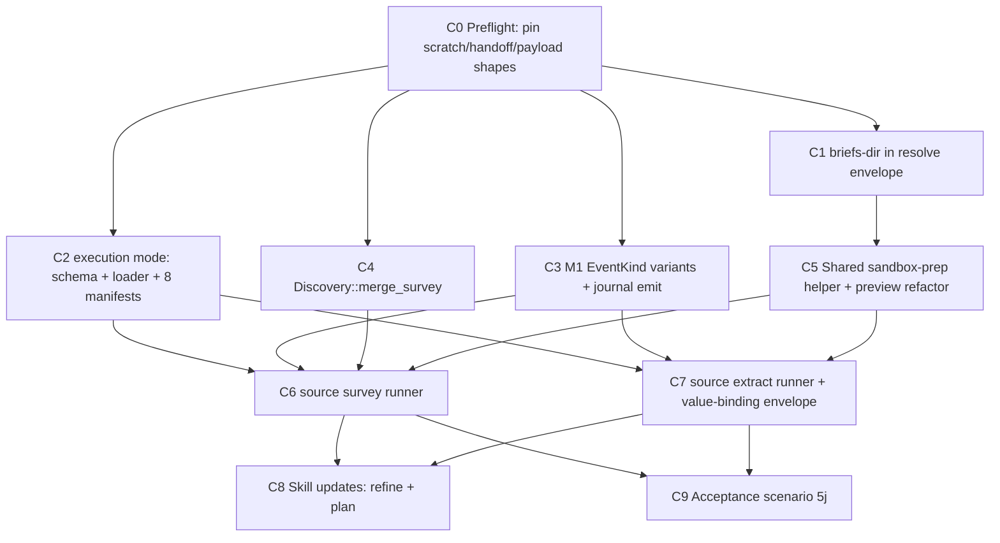

# RFC-29a Implementation Plan — Subagent Work Breakdown

> Companion to [rfc-29a-source.md](rfc-29a-source.md). Decomposes Milestone **M1** ("Executable Source Operations") into subagent-sized changes, sequenced so dependencies land first, with explicit parallelism markers. Each change `C#` is scoped to be implementable by one subagent without over-consuming context.

## Repos in scope

- **`specify-cli`** (`augentic/specify-cli`) — the `specrun` runtime: commands, adapter loader, journal, model crate, schemas.
- **`specify`** (`augentic/specify`) — adapter manifests, skill briefs, docs.

The workflow contract spans both repos. Any change touching `crates/workflow/src/adapter/`, `crates/workflow/src/journal.rs`, `crates/schema/src/`, or the `$CAPABILITY_DIR` env var must run the cross-repo `rg` sweep mandated by the CLI repo's `AGENTS.md` touch rule (rule 5) and update every hit in the same PR.

## Dependency graph

## Execution waves

Each wave is a parallel batch: every change inside a wave may be dispatched to its own subagent simultaneously. A wave starts only after the prior wave's changes have merged.

| Wave | Changes (parallel within wave) | Gate to enter |
| --- | --- | --- |
| **0** | C0 | — |
| **1** | **C1, C2, C3, C4** (all parallel) | C0 merged |
| **2** | **C5** | C1 merged |
| **3** | **C6, C7** (parallel) | C2 + C3 + C4 + C5 merged |
| **4** | **C8, C9** (parallel) | C6 + C7 merged |

Note: C5 only depends on C1, so a subagent may start C5 as soon as C1 lands — in parallel with C2/C3/C4 still finishing. The wave table is the conservative gating; the graph is the true dependency set.

---

## Changes

### C0 — Preflight: pin the M1 contracts (Wave 0)

**Repos:** both · **RFC step:** 0 · **Depends on:** none

Pin the three shapes the rest of the milestone codes against so parallel subagents do not invent divergent forms:

1. **`$SCRATCH_DIR` path shape** — `extract` → `.specify/.cache/extractions/<adapter>/<slice>/scratch/`; `survey` → `.specify/.cache/extractions/<adapter>/survey/scratch/` (disjoint from the fingerprint result cache).
2. **Agent prepare/finalize handoff envelope** — the stdout JSON the `prepare` phase prints: `{ adapter, version, briefs-dir, source-dir, scratch-dir, evidence-dir, leads[], execution: "agent" }`.
3. **M1 journal payload variants** — field sets for `SourceSurveyCacheHit { source-key, adapter, fingerprint }`, `SourceSurveyCacheMiss { source-key, adapter, fingerprint, reason }`, `SourceExecutionAgent { source-key, adapter, operation }`.

Also record the **cache-posture audit** the RFC mandates: enumerate the current `cache:` setting of all five first-party source adapters (`intent`, `documentation`, `code-typescript`, `screenshots`, `captures`); flag any that rely on cache hits today, because `execution: agent` (C2) forces `cache: opt-out` and turns those into guaranteed misses.

**Deliverable:** a short decisions note (in the RFC or `DECISIONS.md`) the C1–C9 subagents read. No production code.

---

### C1 — `briefs-dir` on the resolve envelope (Wave 1)

**Repo:** specify-cli · **RFC step:** 1 · **Depends on:** C0

Add `briefs-dir` (absolute path to the resolved adapter's `briefs/` directory) to the resolve JSON envelope. The field is **not currently present** in `ResolveBody` (`src/runtime/commands.rs:195`) despite RFC-35 D9 marking it done.

- Add `briefs_dir: PathBuf` to `ResolveBody` (kebab → `briefs-dir`) and populate it in `resolve_adapter` for both `Axis::Source` and `Axis::Target` from the resolved adapter location + brief paths.
- Wire-safe (additive; existing parsers ignore unknown fields) — no migration.
- Extend the text renderer (`write_resolve_text`) and the resolve golden/integration tests.

**Why first:** C5's shared helper consumes `briefs-dir` for brief-directory resolution.

---

### C2 — `execution` mode: schema + loader + manifest stamps (Wave 1)

**Repos:** both · **RFC step:** 2 · **Depends on:** C0

The coordinated two-repo migration that lands in **one PR**:

1. Add the closed `execution` enum (`["agent", "tool"]`) to `schemas/source.schema.json` and `schemas/target.schema.json` (initially without `required`).
2. Stamp `execution: agent` on all **eight** first-party manifests — five sources (`adapters/sources/{intent,documentation,code-typescript,screenshots,captures}/adapter.yaml`) and three targets (`adapters/targets/{omnia,vectis,contracts}/adapter.yaml`, `agent` as placeholder until M3).
3. Flip `required` on for `execution` on both schemas.
4. Add the loader rejection `adapter-execution-mode-required` (manifest omits `execution`) and the parse check `adapter-execution-agent-cache-conflict` (`execution: agent` with any `cache:` other than the forced opt-out). Both are `Error::Validation`, exit 2.
5. Add an `Execution` field + closed enum to `SourceAdapter`/`TargetAdapter` in `crates/workflow/src/adapter/core.rs`; enforce that `execution: agent` forces `cache: opt-out`.
6. Add a `suggestion`-severity `adapter-execution-agent` standards finding for first-party adapters (none for third-party).
7. Run the cross-repo `rg` sweep; update every example `adapter.yaml` body in the docs of **both** repos or `specdev lint` / `specrun lint` will flag drift.

**Callout:** apply the C0 cache-posture audit results here — call out, in the PR, any source whose cache behaviour changes under forced opt-out.

**Why parallel-safe:** edits the manifest struct + schemas + manifests; only minor file overlap with C1 (both touch the adapter resolve area). Flag the merge point but the regions are distinct.

---

### C3 — M1 `EventKind` variants + `specrun journal emit` (Wave 1)

**Repo:** specify-cli · **RFC step:** 3 · **Depends on:** C0

- Add three first-class typed variants to `EventKind` in `crates/workflow/src/journal.rs`: `SourceSurveyCacheHit`, `SourceSurveyCacheMiss`, `SourceExecutionAgent` (wire ids `source.survey.cache-hit`, `source.survey.cache-miss`, `source.execution.agent`), with the C0-pinned payloads.
- `reason` on the cache-miss variant reuses the existing `CacheMissReason` enum — **`AdapterOptOut` already exists** (`journal.rs:347`), so the RFC's "add if absent" is a no-op; just reuse it.
- Add the `specrun journal emit <event-id> [--payload <json>] [--format json]` command: a single serde round-trip into `EventKind`. Unknown tag → `journal-emit-unknown-event` (exit 2); required-field failure → `journal-emit-payload-schema` (exit 2). CLI stamps the timestamp and appends one line via `append_batch`.
- Extend the wire-shape tests (`event_wire_shapes_match_contract`, `no_snake_case_leaks_to_wire`) to cover the three new variants.

**Why parallel-safe:** isolated to `journal.rs` + a new command module.

---

### C4 — `Discovery::merge_survey` on the model (Wave 1)

**Repo:** specify-cli · **RFC step:** 5 (extracted) · **Depends on:** C0

Implement `Discovery::merge_survey(source_key, leads)` on `crates/model/src/discovery/document.rs` (which already owns `write_atomic`, `add_alias`, `remove_alias`, `check_alias_collisions`):

- Remove prior blocks whose `id` is in the incoming set for that source, re-render atomically, preserve operator-authored `aliases[]` on surviving ids, keep deterministic ordering.
- Fail the whole merge on any `check_alias_collisions` hit so no partial state lands on disk.
- Cover with tests modelled on `tests/discovery_aliases.rs` §re-survey survival.

**Why parallel-safe:** pure model-crate addition; no command or loader coupling. C6 consumes it.

---

### C5 — Shared sandbox-prep helper + `source preview` refactor (Wave 2)

**Repo:** specify-cli · **RFC step:** 4 · **Depends on:** C1

Factor one internal helper used by `source preview`, `source survey`, and `source extract`:

- Adapter resolution, brief-directory resolution (the C1 `briefs-dir`), the four-root sandbox preopen layout (`$SOURCE_DIR` ro / `$CAPABILITY_DIR` ro / `$SCRATCH_DIR` wo / `$PROJECT_DIR` none), and `evidence/` scaffolding.
- Refactor `src/runtime/commands/source/preview.rs` onto the helper (equivalently, model `preview` as the `--dry-run --out <dir>` mode of the shared runner so dispatch is literally shared).
- Align lead selection spelling across the family (`preview --lead <id>…` vs `extract <lead-id> --slice`).

The genuinely-new machinery (sandbox preopens, `tool` vs `agent` dispatch branch, cache, journal, validate-before-visible, persistence) is **not** added to `preview` — that lands in C6/C7. C5 is the shared prep seam only.

---

### C6 — `specrun source survey` runner (Wave 3)

**Repo:** specify-cli · **RFC step:** 5 · **Depends on:** C2, C3, C4, C5

`specrun source survey <source-key> [--plan <name>] [--format json]`:

- Resolve `<source-key>` against `plan.yaml.sources.<key>`, then resolve the adapter from `SourceBinding.adapter`.
- Branch on `execution` (C2): `tool` = single-phase WASI/Rust dispatch; `agent` = two-phase prepare/finalize (prepare prints the C0 handoff envelope and emits `source.execution.agent`; finalize validates, merges, caches).
- RFC-27 cache fingerprint **without** `lead id`; emit `source.survey.cache-hit` / `source.survey.cache-miss` (C3).
- Validate the lead set against `schemas/discovery/lead.schema.json`, then call `Discovery::merge_survey` (C4) — validate-before-visible.

**Parallel with C7** (separate command module; shared code already landed in C5).

---

### C7 — `specrun source extract` runner + value-binding envelope (Wave 3)

**Repo:** specify-cli · **RFC step:** 6 · **Depends on:** C2, C3, C5

`specrun source extract <source-key> <lead-id> --slice <slice> [--format json]`:

- Same adapter resolution + `execution` branch + prepare/finalize split as C6.
- RFC-27 cache fingerprint **with** `lead id`; reuse the existing extract cache events.
- Validate the Evidence document against `schemas/evidence.schema.json` before the write becomes visible, then persist to `.specify/slices/<slice>/evidence/<source-key>.yaml`. Failure leaves the slice in `refining`.
- **Value-binding envelope:** for value-bound sources (`intent`), `$SOURCE_DIR` is absent; pass a minimal two-field source request — `path:` bindings carry `source-path`, value bindings carry `value-inline: <string>`. Reuse `FingerprintSource::{Path, Value}` (no new cache machinery). Do **not** adopt the full RFC-29d build-request schema.

**Parallel with C6.**

---

### C8 — Skill updates: `refine` + `plan` (Wave 4)

**Repo:** specify · **RFC step:** 7 · **Depends on:** C6, C7

The **last** step — skills must never reference a verb before it exists.

- `refine/SKILL.md` step 3: replace the hand-invoked `extract` brief with `specrun source extract <source-key> <lead-id> --slice <slice>`.
- `plan` skill survey path: call `specrun source survey <source-key>`.
- Under `execution: agent`, the skill runs the brief against the prepared sandbox and the CLI owns validate/persist/journal (the two-phase handoff).

**Parallel with C9.**

---

### C9 — Acceptance scenario `5j` (Wave 4)

**Repos:** both · **RFC step:** 8 · **Depends on:** C6, C7

Add the source-adapter sandbox path-denied acceptance scenario (`5j`): prove that `$PROJECT_DIR` is invisible to the adapter operation and that an out-of-sandbox path access is denied.

**Parallel with C8.**

---

## Parallelism summary

- **Maximum fan-out:** Wave 1 dispatches **four** subagents (C1, C2, C3, C4) at once.
- **Critical path:** C0 → C1 → C5 → {C6 ∥ C7} → {C8 ∥ C9} — six sequential hops, the longest dependency chain.
- **Single-PR coupling:** C2 must land as one PR across both repos (schema flip + manifest stamps + loader checks + doc sweep).
- **Already satisfied:** the RFC's "confirm `CacheMissReason` carries `adapter-opt-out`" is done — `journal.rs` already declares `AdapterOptOut`; C3 reuses it.
