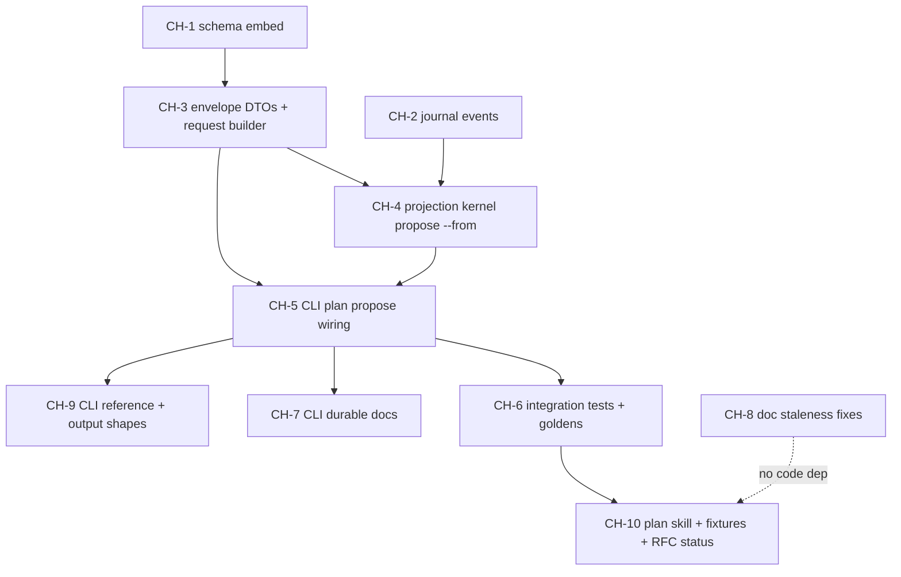

# RFC-29b (M2a) — Implementation Plan: Plan-Time Lead Reconciliation

> Source of truth: [`rfc-29b-reconciliation.md`](rfc-29b-reconciliation.md) (D2) and the shared wire contracts in [`rfc-29-fan-in-fan-out.md`](rfc-29-fan-in-fan-out.md).
> This plan decomposes M2a into subagent-sized changes, sequenced so dependencies land first, with parallel opportunities called out per wave.

## Scope summary

M2a adds the agent-led, CLI-kernelled lead-reconciliation step: `specrun plan propose --dry-run` returns a flat lead catalog + project topology; `specrun plan propose --from <response.json>` validates the agent's grouping, enforces the partition invariants, derives slice names, binds projects, emits journal events, and wholesale-replaces `plan.yaml.slices[]` on a replaceable plan.

**Already shipped — do not reimplement:**

- `specrun plan remove <entry>` (CLI + handler + `Plan::remove` + `plan-remove-*` codes).
- `Plan::is_replaceable()` (`crates/workflow/src/change/plan/core/remove.rs`) — `propose --from` reuses it.
- The draft schema `rfcs/rfc-29/schemas/discovery/proposal.schema.json` (copy it into the CLI; do not re-author).
- `Lead` parsing (`crates/model/src/discovery/`), project/registry resolution, `with_state` atomic plan writer, the `Ctx`/`Out`/`emit` handler shape, and `Error::validation_failed` for kebab codes (no new `Error` enum variant needed — the `plan-reconcile-*` codes are a documented string vocabulary).

**Greenfield:** the `plan propose` clap variant, handler, the reconciliation envelope DTOs, the projection kernel (`Plan::propose_from`), `PROPOSAL_JSON_SCHEMA`, and the `plan.reconcile.*` journal events.

Two repos are in play:

- **`augentic/specify-cli`** — all engineering (changes CH-1 … CH-7).
- **`augentic/specify`** — plugin skill, docs, fixtures (changes CH-8 … CH-10).

## Dependency graph

## Execution waves

| Wave | Changes (parallel within wave) | Gate to next wave |
| --- | --- | --- |
| **0** | **CH-1**, **CH-2**, **CH-8** | CH-1 + CH-2 merged (CH-8 may continue) |
| **1** | **CH-3** | CH-3 merged |
| **2** | **CH-4** | CH-4 merged |
| **3** | **CH-5** | CH-5 merged |
| **4** | **CH-6**, **CH-7**, **CH-9** | CH-6 merged |
| **5** | **CH-10** | — |

Each numbered change is sized for one subagent. CH-1/CH-2/CH-8 are mutually independent and start together. CH-6/CH-7/CH-9 all depend only on CH-5 and run together.

---

## specify-cli changes

### CH-1 — Embed the reconciliation schema (foundation)

**Depends on:** nothing. **Parallel with:** CH-2, CH-8.

- Copy `augentic/specify/rfcs/rfc-29/schemas/discovery/proposal.schema.json` → `specify-cli/schemas/discovery/proposal.schema.json` verbatim.
- `crates/schema/src/constants.rs`: add `pub const PROPOSAL_JSON_SCHEMA: &str = include_str!("../../../schemas/discovery/proposal.schema.json");` next to `PLAN_JSON_SCHEMA` / `LEAD_JSON_SCHEMA`.
- `crates/schema/src/lib.rs`: re-export the constant; `crates/workflow/src/schema.rs`: re-export and add `validate_proposal_json(content) -> Result<()>` folding failures into `Error::Validation { code, detail }` (mirror `validate_plan_yaml`), validating both `kind: request` and `kind: response` instances against the one `oneOf` schema.
- Test: a `crates/schema` (or `tests/`) test that `compile_schema(PROPOSAL_JSON_SCHEMA)` succeeds and the RFC's example request + both example responses (N=1 and multi-source fan-out from `rfc-29b-reconciliation.md`) validate.

**Done when:** `PROPOSAL_JSON_SCHEMA` compiles, the wrapper rejects a malformed envelope with a kebab code, and `cargo make check` passes.

### CH-2 — Add `plan.reconcile.*` journal events (foundation)

**Depends on:** nothing. **Parallel with:** CH-1, CH-8.

- `crates/workflow/src/journal.rs`: add two `EventKind` variants following the existing `#[serde(rename = "...", rename_all = "kebab-case")]` pattern:
  - `PlanReconcileAgent { plan_name: String, scopes: Vec<ReconcileScope>, slice_count: usize }` where `ReconcileScope { scope: String, rationale: Option<String> }` (deduped by scope).
  - `PlanReconcileCompleted { plan_name: String, slice_count: usize, slice_names: Vec<String> }`.
- Wire ids exactly `plan.reconcile.agent` and `plan.reconcile.completed` (normative per RFC-29 §"Journal events").
- Unit test: serialize each variant and assert the kebab JSON wire shape.

**Done when:** both events round-trip through serde with the pinned wire ids and `cargo make check` passes. (No emit site yet — that lands in CH-4/CH-5.)

### CH-3 — Reconciliation envelope DTOs + request/catalog builder (domain core)

**Depends on:** CH-1. **Parallel with:** —.

- New module `crates/workflow/src/change/plan/core/propose.rs` (re-export via `core.rs`). Define serde DTOs (closed, kebab-case) matching `proposal.schema.json`:
  - `ProposalRequest { version, kind, projects: Vec<ProjectRef>, leads: Vec<LeadCatalogEntry> }`
  - `ProjectRef { name, target, description: Option<String> }`
  - `LeadCatalogEntry { source_key, lead_id, summary, aliases: Vec<String> }`
  - `ProposalResponse { version, kind, slices: Vec<ResponseSlice> }`, `ResponseSlice { name: Option, scope, sources: Vec<ResponseMember>, rationale: Option, depends_on: Vec, project: Option }`, `ResponseMember { source_key, lead_id }`.
- `build_request(plan: &Plan, discovery: &Discovery, topology) -> Result<ProposalRequest>`:
  - flat `leads[]` = one row per `Discovery::leads()` lead (`source_key`, `lead_id`, `summary`, `aliases`); `tentative` is **not** surfaced (per RFC §"Cross-Source Matching").
  - `projects[]` from project topology: hub → every `registry.yaml#/projects[]` entry; single regular project → one synthesized entry from `project.yaml` (`name`, resolved `name@vN` via `resolve_target_adapter`, `domain` as description).
  - empty leads → `Error::validation_failed("plan-reconcile-empty-catalog", …)`.
- A reusable `build_catalog(discovery)` helper (the `(source-key, lead-id)` lead set) consumed by both `build_request` and CH-4's `--from` re-read.
- Unit tests: N=1 synthesized-project request, hub multi-project request, empty-catalog error.

**Done when:** `build_request` output validates against `PROPOSAL_JSON_SCHEMA` (`kind: request`) in a unit test for both N=1 and hub topology.

### CH-4 — Projection kernel `Plan::propose_from` (domain core — heaviest)

**Depends on:** CH-2, CH-3. **Parallel with:** —.

In `core/propose.rs`, add `Plan::propose_from(&mut self, response, discovery, topology) -> Result<ProposeOutcome>`. Order of operations:

1. **Replaceable gate** — reuse `self.is_replaceable()`; else `plan-reconcile-plan-not-replaceable`.
2. **Re-read catalog** from current `discovery.md` via CH-3's `build_catalog` (do not trust any dry-run snapshot); validate `response` against `PROPOSAL_JSON_SCHEMA` (`kind: response`).
3. **Invariants** (each → `Error::validation_failed` with the pinned code, exit 2):
   - `plan-reconcile-lead-orphan` — a `(source-key, lead-id)` not in the catalog.
   - `plan-reconcile-partition` — collapsing slices by `scope` must cover every catalog lead exactly once.
   - `plan-reconcile-slice-source-collision` — a scope names two leads from the same `source-key`.
   - `plan-reconcile-fanout-source-mismatch` — slices sharing a `scope` carry differing `sources[]`.
   - `plan-reconcile-project-binding-required` — `project` omitted while >1 project exists.
   - `plan-reconcile-project-orphan` — bound `project` absent from topology.
   - `plan-reconcile-slice-duplicate` — duplicate `(scope, project)` after auto-bind.
   - `plan-reconcile-slice-name-collision` — clashing agent-supplied explicit `name` values only.
   - `plan-reconcile-depends-on-cycle` — cyclic `depends-on` (reuse existing cycle detection).
4. **Project auto-bind** (sole project) + **target derivation** from `projects[].target`.
5. **Name derivation** — explicit `name` → `scope` (1:1) → `<scope>-<project>` (fan-out); validate kebab.
6. **Bulk replace** `self.entries` in response order with `Entry { status: Pending, sources: structured { source-key, lead-id }, project, target, depends_on, … }`; then `Plan::validate(self)`; roll back on error.
7. Return `ProposeOutcome { slice_names, scopes }` for the caller's journal payload.

- Co-located unit tests: one test per invariant code, plus a happy-path multi-source fan-out and the N=1 auto-bind case. This is the test-dense change — keep the subagent focused on the kernel + its tests only (no CLI, no docs).

**Done when:** every `plan-reconcile-*` code has a failing-case test, the happy path produces the expected `entries`, and `cargo make check` passes.

### CH-5 — Wire `specrun plan propose` into the CLI (command surface)

**Depends on:** CH-3, CH-4. **Parallel with:** —.

- `src/runtime/commands/plan/cli.rs`: add `Propose(ProposeArgs)` to `PlanAction`; `ProposeArgs { dry_run: bool, from: Option<PathBuf> }` with `--dry-run`/`--from` `conflicts_with` each other. Neither set → handler raises `plan-propose-mode-required` (`Error::validation_failed`); both set → clap rejects.
- `src/runtime/commands/plan.rs`: `mod propose;` + `PlanAction::Propose(args) => propose::propose(ctx, args)`.
- `src/runtime/commands/plan/propose.rs`: handler (templates: `add.rs`, `remove.rs`, `source/survey.rs`, `workspace/push.rs`):
  - **dry-run**: load `Plan` + `Discovery` + topology, call `build_request` (CH-3), emit via `ctx.write` as the request envelope JSON; **no `with_state`, no journal**.
  - **from**: read + parse response file, run `with_state::<Plan,_,_>(… "plan.yaml", |plan| plan.propose_from(…))`, then one `journal::append_batch` emitting `plan.reconcile.agent` + `plan.reconcile.completed` atomically (after the successful write); `ctx.write` a response/summary DTO.
  - `--format json` flows from `Ctx`.

**Done when:** `specrun plan propose --dry-run --format json` prints a schema-valid request, `--from` writes slices + journal lines on a fixture project, and bad modes exit 2 with the right codes.

### CH-6 — Integration tests + goldens (verification)

**Depends on:** CH-5. **Parallel with:** CH-7, CH-9.

- Extend `tests/plan_orchestrate.rs` (+ goldens under `tests/fixtures/plan/`, regenerate with `REGENERATE_GOLDENS=1`):
  - dry-run request envelope golden (N=1 + hub multi-project).
  - `--from` happy path goldens: N=1 auto-bind, and multi-source fan-out (shared `scope`, two projects, `depends-on`).
  - one exit-2 case per `plan-reconcile-*` code + `plan-propose-mode-required`.
  - journal tail asserts `plan.reconcile.agent` then `plan.reconcile.completed` (pattern from `tests/journal.rs`).
  - re-propose replaces all slices; `--from` on an approved/in-progress plan → `plan-reconcile-plan-not-replaceable`.

**Done when:** `cargo make ci` is green with new goldens checked in.

### CH-7 — CLI durable docs (DECISIONS + workflow contract)

**Depends on:** CH-5. **Parallel with:** CH-6, CH-9.

- `DECISIONS.md`: add §"Lead reconciliation (D2)" — replaceable gate, partition invariants, name derivation, project binding, the `plan-reconcile-*` vocabulary, atomic dual-event journal.
- `docs/standards/workflow.md`: document the `propose --dry-run`/`--from` surface and request/response shapes under the source/target contract sections.
- `AGENTS.md` (specify-cli): per repo rules 4–5, add the new journal symbols / `propose` module to the module-of-note and cross-repo grep checklists.

**Done when:** `rg PROPOSAL_JSON_SCHEMA plan.reconcile propose` across docs has no stale/missing references and the decision entry is reachable from the doc spine.

---

## specify (plugin/docs) changes

### CH-8 — Doc staleness corrections (independent prose)

**Depends on:** nothing (RFC is source of truth). **Parallel with:** all CLI work — start in Wave 0.

These are corrections where docs predate or contradict RFC-29b; none needs CLI output:

- `docs/explanation/decision-log.md` §"Project assignment is a framework concern" — rewrite/supersede: the **agent binds `project` in the propose response**, not a post-propose skill step.
- `docs/reference/change-skills/plan.md` — rewrite behavior step 6 (currently "reconcile leads via `specrun plan add`") to the `propose --dry-run → agent → --from` flow; add `--dry-run` to the delegation table.
- `docs/reference/configuration.md` — fix divergence writer to `plan amend --divergence likely` **after** propose; harmonize binding shape to `source-key`/`lead-id`; add `propose --from` to the `Modified by` list.
- `docs/standards/cli-contract.md` — add `propose` and `remove` to the plan verb tree.
- `docs/explanation/layered-stack.md` — add `discovery/proposal.schema.json` to the Layer 0 schema list; add `propose`/`remove` to the CLI surface line.
- `docs/reference/lifecycle.md` — note `propose --from` is the default slice writer.
- `docs/reference/quick-reference.md` — add the missing `propose --dry-run` line.
- `AGENTS.md` (specify) — tighten lead vocab (`(source-key, lead-id)` identity) if imprecise.

**Done when:** `make lint` passes and no plan-time doc still routes slice authoring through `plan add` as the default.

### CH-9 — New CLI reference + output shapes (depends on final wire shape)

**Depends on:** CH-5. **Parallel with:** CH-6, CH-7.

- `docs/reference/cli/plan.md` — add `### specrun plan propose` (`--dry-run`, `--from`, mode-required, replaceable gate, the validation-code list, envelope summary); add `propose` to the cheat-sheet.
- `docs/reference/cli-output-shapes.md` — add the propose request and from-success envelope shapes per `proposal.schema.json`.

**Done when:** the propose section matches the shipped `--format json` output byte-for-byte on the documented examples; `make lint` passes.

### CH-10 — Plan skill, fixtures, and RFC status (depends on real CLI output)

**Depends on:** CH-6. **Parallel with:** —.

- `plugins/spec/skills/plan/SKILL.md` — verify against shipped CLI; add a note that `plan.reconcile.*` are CLI-emitted (skill does not `journal emit` for D2); link `proposal.schema.json`.
- `plugins/spec/skills/plan/fixtures/*` — add `plan.reconcile.agent`/`plan.reconcile.completed` journal goldens (extend `divergence-journal/` or add a sibling); harmonize `key`/`lead` → `source-key`/`lead-id` across `intent-fix-typo`, `documentation-account-revamp`, `cross-source-identity-revamp`; confirm post-`propose --from` `plan.yaml` shapes (derived `target`, structured bindings); optional deterministic `response.json` golden for replay.
- `plugins/spec/skills/plan/fixtures/README.md` — add the reconcile-journal fixture rows.
- `plugins/spec/references/discovery.md` — minor sync (`tentative` is off the dry-run wire).
- `rfcs/rfc-29/schemas/README.md` — reconcile the embed-constant note with the shipped path; flip `rfc-29b-reconciliation.md` status Draft → shipped and update the RFC-29 readiness/ordering tables.

**Done when:** fixtures replay against the shipped CLI, `make lint` passes, and the RFC family reflects M2a as shipped.

---

## Notes for implementing agents

- `plan.schema.json` needs **no change** — slices already carry `project`, `target`, `sources[]`, `depends-on`, `divergence`. The kernel only replaces rows.
- The `plan-reconcile-*` / `plan-propose-mode-required` codes are raised via `Error::validation_failed` (exit 2); do **not** add `Error` enum arms (per specify-cli `AGENTS.md`).
- `propose --from` re-reads `discovery.md` and rebuilds the catalog every invocation — never trust a prior `--dry-run` snapshot.
- Divergence staging stays out of the kernel: the agent runs `plan amend --divergence likely` after propose (the only writer of that field).
- Cross-repo discipline (specify-cli `AGENTS.md` rule 5): symbols touching `journal.rs`, the adapter loader, or schema constants must be grepped across both repos and updated in the same change-set wave.
