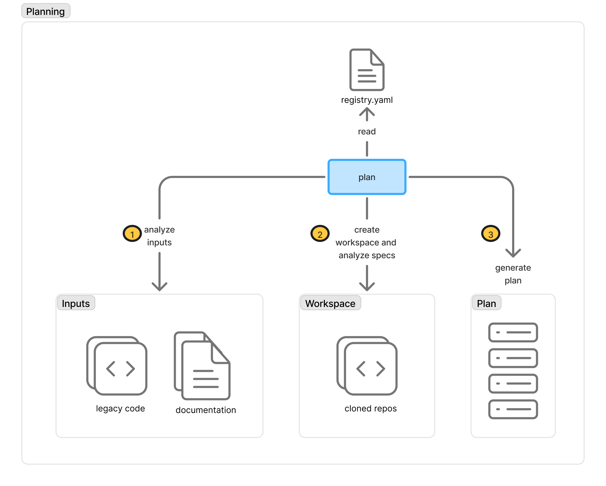

# RFC-3: Multi-Repo Planning

> Status: Draft · Depends: [RFC-1](archive/rfc-1-cli.md), [RFC-2](archive/rfc-2-execution.md)

## Abstract

Introduce a **planning stage** that turns a multi-repo initiative into the artifact RFC-2's `/spec:execute` consumes. Given a `registry.yaml` declaring the projects in scope, plus a set of inputs (legacy code, documentation), the `plan` pipeline (a) analyses inputs, (b) materialises a local **workspace** of cloned repos and inventories their specs, and (c) generates the **Plan** (`plan.yaml`) RFC-2 drains change-by-change.

This reframes RFC-3 from spec federation at execution time to initiative planning across repos. Cross-repo spec references (`@peer:capability`) and contract validation — the earlier draft's federation content — remain useful, but they are an execution-time concern that sits downstream of the planning pipeline introduced here. They are captured as Layer 3 and detailed in a follow-up revision.

## Planning Model Overview



The `plan` pipeline is a three-step process driven by `registry.yaml`:

1. **Analyse inputs.** Read seed material — legacy code, design documents, existing specs — and extract candidate capabilities, constraints, and open questions.
2. **Create workspace and analyse specs.** Clone every project declared in `registry.yaml` into `.specify/.workspace/<project>/` (local, read-only cache), then inventory each repo's existing `.specify/` tree (baseline specs, in-flight plans, schema).
3. **Generate plan.** Combine the input analysis and the workspace inventory into a **Plan**: the ordered, dependency-aware list of changes RFC-2 drains with `specify initiative next`.

The `Plan` box in this diagram is the same `Plan` box on the left of RFC-2's execution diagram. Planning produces it; execution consumes it and amends it back.

Like RFC-2, the diagram is schema-agnostic: the three steps are briefs declared by the active schema's `pipeline.plan`. RFC-3 extends that pipeline to span multiple repos via the registry and workspace; the surrounding structure — pipeline, driver skill, CLI — is invariant.

### Diagram labels → skills and CLI

| Diagram label                        | Skill                             | CLI                                                    |
| ------------------------------------ | --------------------------------- | ------------------------------------------------------ |
| `plan` (centre)                      | `/spec:plan` (extended)           | `specify initiative plan`                              |
| `registry.yaml` (read)               | —                                 | `specify initiative registry {show, validate}`         |
| Step ① — analyse inputs              | brief: `analyse-inputs.md`        | — (brief-driven; reads `registry.yaml:inputs`)         |
| Step ② — create workspace / specs    | brief: `analyse-specs.md`         | `specify initiative workspace sync`                    |
| Step ③ — generate plan               | brief: `generate-plan.md`         | `specify initiative create` / `… amend` / `… lock`     |
| `Inputs` box (legacy code, docs)     | —                                 | — (filesystem paths under `inputs:` in registry)       |
| `Workspace` box (cloned repos)       | —                                 | `.specify/.workspace/<project>/`                       |
| `Plan` box (output)                  | —                                 | `.specify/plan.yaml` (RFC-2 format, unchanged)         |

## Motivation

RFC-2 assumes you already know the changes. For three common cases, you don't:

- **Legacy modernisation.** Changes must be *derived* from legacy code and documentation.
- **Greenfield across multiple repos.** Backend, frontend, and shared-types need coordinated changes, but the per-repo plans don't exist yet.
- **Platform initiatives.** A feature like "add OAuth login" must be decomposed across repos before any per-repo loop can run.

RFC-2's Layer 3 `/spec:plan` skill addresses the first case for a single repo. The multi-repo case has no equivalent — no declared scope of "the repos this initiative spans", no shared workspace for cross-repo analysis, no coordinated output. RFC-3 fills that gap.

## Dependency on RFC-1 and RFC-2

- **RFC-1 (CLI):** registry parsing, clone orchestration, workspace layout, and plan writes all go through `specify` subcommands. No hand-edited files.
- **RFC-2 (Plans):** the Plan format is unchanged. RFC-3 is a *producer* of RFC-2 plans, not a competing format. `/spec:execute` consumes RFC-3-produced plans exactly as it consumes hand-authored or `/spec:plan`-authored ones.

RFC-3 is structured in three layers that mirror RFC-2's layering; each layer is independently useful. **Layer 1** is single-repo planning — a generalisation of `/spec:plan` that runs the three-step pipeline against one project. **Layer 2** adds multi-repo planning with workspace cloning and cross-repo synthesis. **Layer 3** adds federation at execution time (cross-repo spec refs, contract reconciliation) on top of the workspace Layer 2 materialises.

---

## Layer 1: Single-Repo Planning (MVP)

Layer 1 generalises RFC-2's `/spec:plan` into the three-step pipeline shape shown in the diagram, with a `registry.yaml` that declares one project (the current repo) and an optional `inputs` section.

### The Registry

```yaml
# .specify/registry.yaml
name: traffic-modernisation
version: 1

projects:
  - name: traffic
    url: .                # Layer 1: the only project is this repo
    schema: omnia@v1

inputs:
  - path: ./inputs/legacy-traffic/
    kind: legacy-code
  - path: ./inputs/ops-runbook.pdf
    kind: documentation
```

`projects` enumerates the repos in scope. `inputs` enumerates seed material the pipeline analyses. Both are optional in principle, but at least one project (`.` for Layer 1) is required for the pipeline to have something to plan against.

### The `plan` Pipeline

```
analyse-inputs ──▶ analyse-specs ──▶ generate-plan ──▶ plan.yaml
```

Each step is a brief declared by the schema's `pipeline.plan`:

- **Step 1 — analyse-inputs.** Reads `registry.yaml:inputs` and emits a candidate-capabilities artifact (what the initiative plausibly delivers, what's already covered, what's ambiguous).
- **Step 2 — analyse-specs.** Inventories the repo's existing `.specify/` tree — baseline specs, in-flight plans, schema. In Layer 1 there is no cloning to do; the workspace is the current repo.
- **Step 3 — generate-plan.** Synthesises the Plan: per-capability change entries wired into RFC-2's `sources` / `depends-on` / `affects` fields, written via `specify initiative create` / `… amend`.

Layer 1 is effectively today's `/spec:plan` with `registry.yaml` as its declared input surface. The existing skill becomes a Layer 1 specialisation of this pipeline.

---

## Layer 2: Multi-Repo Planning

Layer 2 is the case the diagram describes: `registry.yaml` declares several repos, `specify initiative plan` clones them into a local workspace, and the pipeline synthesises coordinated plans.

### The Registry (multi-project)

```yaml
# .specify/registry.yaml
name: realtime
version: 1

projects:
  - name: traffic
    url: git@github.com:org/traffic.git
    schema: omnia@v1

  - name: command-centre
    url: git@github.com:org/command-centre.git
    schema: omnia@v1

inputs:
  - path: ./inputs/legacy-traffic/
    kind: legacy-code
  - path: ./inputs/ops-runbook.pdf
    kind: documentation
```

### The Workspace

```
.specify/
  registry.yaml
  .workspace/
    traffic/            # git clone of org/traffic (read-only)
    command-centre/     # git clone of org/command-centre
  inputs/
    legacy-traffic/
    ops-runbook.pdf
  plan.yaml             # this repo's plan
  plans/                # per-peer draft plans awaiting distribution
    traffic/plan.yaml
    command-centre/plan.yaml
```

The workspace is a local, read-only cache. It is `.gitignore`d by default and rebuilt by `specify initiative workspace sync`. No writes ever land in peer clones during planning.

### Output: coordinated plans

Layer 2 produces one of two output modes, selected by the active schema's `pipeline.plan`:

1. **A single plan with cross-repo entries.** When one repo initiates the initiative and drives it, `plan.yaml` contains entries whose `sources` or `affects` reference peer projects by registry name. Execution of cross-repo entries requires Layer 3. *(Detail TBD.)*
2. **Per-repo plans linked by a feature manifest.** Each peer gets its own `plan.yaml`, staged under `.specify/plans/<peer>/` in the initiating repo and delivered to the peer out-of-band (PR, push, or manual). A top-level **feature manifest** links them and tracks aggregate status. The feature manifest is the cross-repo coordination artifact; it replaces nothing in RFC-2 and is authored only when an initiative spans repos. *(Detail TBD — manifest format, delivery mechanism, status tracking across peers.)*

### CLI surface additions

| Operation                          | CLI                                                        |
| ---------------------------------- | ---------------------------------------------------------- |
| Clone / refresh workspace          | `specify initiative workspace sync`                        |
| Inspect workspace state            | `specify initiative workspace status`                      |
| Emit per-peer plan drafts          | `specify initiative plan --output per-peer` *(TBD)*        |
| Create / update feature manifest   | `specify initiative manifest {init, amend, status}` *(TBD)*|

---

## Layer 3: Federation at Execution Time

Layer 3 is the smallest possible addition to RFC-2's per-repo execution loop once the workspace exists:

- **Cross-repo spec references.** `@peer:capability` syntax in spec bodies. The CLI resolves against `.specify/.workspace/<peer>/specs/`.
- **Contract reconciliation.** `specify federation validate` compares provider / consumer contracts declared in the feature manifest and flags mismatches across the workspace.
- **Feature-manifest status aggregation.** Read-only roll-up of peer change statuses into the initiating repo's feature manifest.

The original `rfc-3-federation.md` draft is primarily about this layer. Its content is captured in a follow-up revision once Layer 1/2 land; the key move is that Layer 3 operates on the same workspace Layer 2 materialises, so no new cloning, config, or peer discovery is required.

*(Detail TBD — ported from the federation draft.)*

---

## Relation to RFC-2

- RFC-2 Layer 3 (`/spec:plan`) becomes the single-repo specialisation of RFC-3 Layer 1. Its `pipeline.plan` briefs are the same briefs RFC-3 extends.
- RFC-2's Plan format is unchanged. RFC-3's only contribution on the Plan itself is semantic: `sources` and `affects` may reference peer projects by registry name (resolved via `registry.yaml`).
- The `amend` edge in RFC-2's execution diagram — a phase discovering a neighbouring change and calling `specify initiative amend` — continues to work identically on RFC-3-produced plans.

## Alternatives Considered

### Registry repo

A separate dedicated registry repo creates a coordination bottleneck. Every change requires commits to the registry, and the registry becomes a merge-conflict magnet. The chosen model keeps `registry.yaml` in whichever repo initiates the initiative (typically a dedicated platform / coordination repo), with peers autonomous. If you later need a central dashboard or CI check, you can build it on top of RFC-3 artifacts without requiring a separate write path.

### Cross-organisation coordination

If you're coordinating across *organisations* (not just repos), a registry repo makes more sense because you can't assume write access to peer repos. In that case, the registry holds the change manifests and peer spec snapshots, and the CLI treats them as read-only. Start with the in-initiator model for the single-organisation case.

### Plan-per-repo vs single cross-repo plan

*(Detail TBD — tradeoffs, when to pick which, how the feature manifest differs from a "big plan".)*

## References

- [RFC-1: `specify` CLI](archive/rfc-1-cli.md) — CLI surface this RFC extends.
- [RFC-2: Execution](archive/rfc-2-execution.md) — consumer of the Plan this RFC produces.
