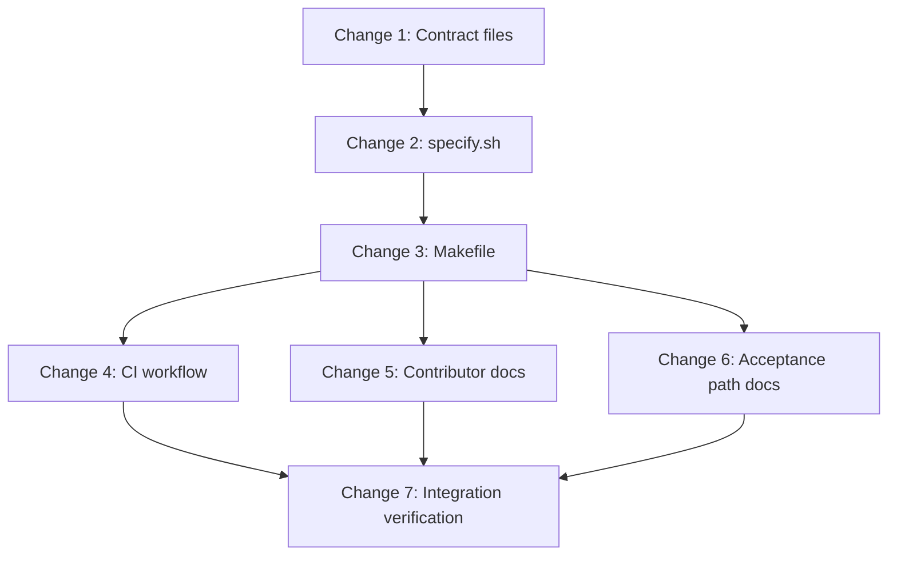

# RFC-41 Implementation Plan: `specify` Version Binding

> Parent: [rfc-41-version-binding.md](./rfc-41-version-binding.md)  
> Scope: `augentic/specify` only — no `specify-cli` behaviour changes  
> Strategy: single landing (RFC migration section); changes below are execution slices for subagents

## Goal

Introduce `SPECIFY_VERSION` (`next | latest | X.Y.Z | system`, default `next`) so `make lint` and CI can bind to either a local `specify-cli` source build or a repo-local published binary in `./.bin`, with `.specify-version` as the reviewable cross-repo compatibility pin.

## Dependency graph




## Parallel execution map


| Wave  | Changes                         | Notes                                                                                    |
| ----- | ------------------------------- | ---------------------------------------------------------------------------------------- |
| **1** | Change 1                        | No dependencies                                                                          |
| **2** | Change 2                        | Needs `.specify-version` + `.gitignore`                                                  |
| **3** | Changes 3, 4, 5 (draft), 6 (draft) | Makefile + CI once script interface is frozen; docs can draft against RFC sketch in parallel |
| **4** | Changes 5 + 6 (finalize)        | Align prose with landed behaviour                                                        |
| **5** | Change 7                        | End-to-end verification                                                                  |


---

## Change 1 — Compatibility contract files

**Repo:** `augentic/specify`  
**Estimate:** ~15 lines  
**Depends on:** nothing  
**Parallel with:** nothing (wave 1)

### Deliverables

1. `**.specify-version`** — single line, no prefix/suffix whitespace, semver `X.Y.Z` matching the newest *published* CLI release the framework currently targets. Initial value: `0.1.0` (per RFC: latest tag `v0.1.0`, source workspace `0.2.0`).
2. `**.gitignore*`* — add `.bin/` entry (repo-local acquired binaries).

### Acceptance criteria

- `cat .specify-version` prints one semver line.
- `git check-ignore -v .bin/specify` resolves after a dummy file is created.

### Subagent prompt seed

> Add `.specify-version` (`0.1.0`) and `.bin/` to `.gitignore` per RFC-41. No other files.

---

## Change 2 — `scripts/specify.sh` (resolver + runner)

**Repo:** `augentic/specify`  
**Estimate:** ~120–180 lines bash  
**Depends on:** Change 1  
**Parallel with:** nothing until complete (blocks wave 3)

### Deliverables

Central script consumed by `Makefile`, contributor shortcuts, and CI. The framework repo is not Cargo-managed; there is no `.cargo/config.toml`. The removed `cargo fcheck` alias is replaced by a `fcheck` shorthand on this script.

#### Public interface (freeze this for downstream changes)

```bash
# Default: resolve, acquire if needed, cd to repo root, exec the resolved binary.
scripts/specify.sh [fcheck | <specify-subcommand> …]

# Shorthand (replaces cargo fcheck):
scripts/specify.sh fcheck
# → lint framework --framework-root .

# Passthrough (any specify subcommand):
scripts/specify.sh lint framework --framework-root .
scripts/specify.sh slice validate my-slice

# Internal modes (no passthrough args):
scripts/specify.sh --mode emit-cmd    # print resolved command prefix (debug / optional Make use)
scripts/specify.sh --mode verify-only # exit 0 when binary exists and --version matches

# Env:
#   SPECIFY_VERSION  next | latest | X.Y.Z | system   (default: next)
#   REPO_ROOT        optional; defaults to git root / script parent

# Resolution (before exec):
#   next + checkout found:  cargo run --release --manifest-path <path> --bin specify --
#   next + no checkout:     ./.bin/specify   (after acquiring .specify-version pin)
#   latest / X.Y.Z:         ./.bin/specify   (after resolve/acquire)
#   system:                 specify
```

#### Behaviour per RFC


| `SPECIFY_VERSION` | Resolution                                                                                                                                                                                                      |
| ----------------- | --------------------------------------------------------------------------------------------------------------------------------------------------------------------------------------------------------------- |
| `next`            | If `specify-cli/Cargo.toml` or `../specify-cli/Cargo.toml` exists → emit `cargo run …` (no version check). Else acquire pin from `.specify-version` into `./.bin`, print one-line fallback notice.              |
| `latest`          | Resolve newest published tag (`gh release view` → GitHub REST `releases/latest`, strip leading `v`). Prefer installed `specify` on `PATH` if `awk '{print $NF}'` version satisfies; else acquire into `./.bin`. |
| `X.Y.Z`           | Same as `latest` but pin is explicit.                                                                                                                                                                           |
| `system`          | Emit `specify`; no acquisition, no version enforcement.                                                                                                                                                         |


#### Acquisition rules

- Target dir: `./.bin` only — never mutate global installs.
- Prefer `curl` installer when Rust toolchain absent: `SPECIFY_INSTALL_DIR=./.bin SPECIFY_VERSION=vX.Y.Z curl -sSfL https://specify.sh/install.sh | sh` (fall back to `raw.githubusercontent.com/augentic/specify-cli/main/install.sh` if needed).
- When `cargo` is available: `cargo install specify --version X.Y.Z --root ./.bin --locked`.
- Post-acquire verify: `./.bin/specify --version | awk '{print $NF}'` equals requested semver.
- One-line notices to stderr naming version + `./.bin` on every acquire/fallback.

#### Helpers to implement

- `find_specify_cli_manifest` — `firstword(wildcard specify-cli/Cargo.toml ../specify-cli/Cargo.toml)`
- `read_pin` — trim `.specify-version`
- `path_specify_version` — `awk '{print $NF}'` on `specify --version`
- `version_satisfies` — semver compare for `latest` (≥ resolved tag) and `X.Y.Z` (==)
- `resolve_latest_tag` — mirror `specify-cli` probe order (`SPECIFY_RELEASE_TAG` → `gh` → REST)

### Acceptance criteria

- With sibling `specify-cli` present and `SPECIFY_VERSION=next`: `./scripts/specify.sh fcheck` runs via `cargo run …` without network.
- With no checkout and `SPECIFY_VERSION=next`: `./scripts/specify.sh fcheck` acquires `.specify-version` into `./.bin`, prints notice, passes lint.
- `SPECIFY_VERSION=0.1.0` with no checkout: idempotent re-run (no redundant install if version matches).
- `SPECIFY_VERSION=system`: uses PATH `specify`, never writes `./.bin`.
- `./scripts/specify.sh fcheck` works from a subdirectory (script resolves repo root and `cd`s before exec).
- Script is `set -euo pipefail`; exits non-zero with actionable stderr on failure.

### Subagent prompt seed

> Implement `scripts/specify.sh` per RFC-41 and the interface above. Include `fcheck` shorthand and passthrough exec. Read `.specify-version`. Do not touch Makefile yet.

---

## Change 3 — Makefile integration

**Repo:** `augentic/specify`  
**Estimate:** ~40 lines  
**Depends on:** Change 2  
**Parallel with:** Change 4, Change 5 (draft), Change 6 (draft)

### Deliverables

Rewrite `Makefile` top and targets:

```makefile
SPECIFY_VERSION ?= next
SPECIFY_MANIFEST := $(firstword $(wildcard specify-cli/Cargo.toml ../specify-cli/Cargo.toml))

lint:
	SPECIFY_VERSION=$(SPECIFY_VERSION) ./scripts/specify.sh fcheck
```

- `**lint**` — delegates to `./scripts/specify.sh fcheck` (no `$(shell …)` / `emit-cmd` indirection).
- `**acceptance**` — keep source-build semantics when `SPECIFY_MANIFEST` is set (build release binary, `make lint`, symlink to `INSTALL_DIR`). When no checkout: fail fast with a message that acceptance requires `specify-cli` (RFC scopes graceful fallback to `lint`; acceptance is co-dev only).
- Remove hard-coded `cargo run --manifest-path $(SPECIFY_MANIFEST)` from `lint`.
- Optional: `fcheck` phony target aliasing `lint` for contributors who muscle-memorized `cargo fcheck`.

### Files touched

- `Makefile`

### Acceptance criteria

- Default `make lint` unchanged when sibling `specify-cli` exists.
- `make lint` succeeds with only `.specify-version` + network (no checkout, no Rust).
- `SPECIFY_VERSION=system make lint` uses PATH binary.
- `SPECIFY_VERSION=0.1.0 make lint` uses `./.bin/specify`.

### Subagent prompt seed

> Wire `Makefile` to `scripts/specify.sh` per RFC-41 sketch. Keep `acceptance` source-build-only; document failure when checkout missing.

---

## Change 4 — CI workflow

**Repo:** `augentic/specify`  
**Estimate:** ~40 lines YAML  
**Depends on:** Change 3  
**Parallel with:** Change 5 (draft), Change 6 (draft)

### Deliverables

Replace the branch-matched `specify-cli` clone+compile in `.github/workflows/ci.yaml` with a single lint job that acquires a published binary and runs `make lint`. Per RFC-41 CI section: deterministic pin, no cross-repo checkout, no Rust build.

#### Remove

- `Choose specify-cli ref` step and second `actions/checkout` of `augentic/specify-cli`
- `dtolnay/rust-toolchain@stable` and `Swatinem/rust-cache@v2`
- Top-level `CARGO_*` / `RUSTUP_*` env vars (no longer used)
- `cargo run --locked --manifest-path specify-cli/Cargo.toml …` in **Verify framework**

#### Keep

- Single `checks` job on `ubuntu-latest`
- Framework repo checkout
- **Verify spec-runtime symlinks resolve** step (unchanged)

#### Add / replace

1. **Resolve `SPECIFY_VERSION`** — workflow-level `env.SPECIFY_VERSION` when set; otherwise read the single-line `.specify-version` at the repo root (trim whitespace). Emit the resolved semver into the job env for downstream steps. CI must pass an explicit `X.Y.Z` pin to `make lint`, not `next`, so the job never silently becomes a source build when a checkout appears on disk.
2. **Cache `./.bin`** — optional `actions/cache` keyed on resolved `SPECIFY_VERSION` + runner OS to skip re-acquire on warm runs.
3. **Verify framework** — `make lint` with `SPECIFY_VERSION` set to the resolved pin (acquisition handled by `scripts/specify.sh`).

#### Target workflow sketch

```yaml
jobs:
  checks:
    name: Checks
    runs-on: ubuntu-latest
    timeout-minutes: 15
    steps:
      - uses: actions/checkout@v6
        with:
          fetch-depth: 1

      - name: Resolve SPECIFY_VERSION
        id: specify-version
        shell: bash
        run: |
          if [ -n "${SPECIFY_VERSION:-}" ]; then
            resolved="${SPECIFY_VERSION}"
          else
            resolved="$(tr -d '[:space:]' < .specify-version)"
          fi
          echo "resolved=$resolved" >> "$GITHUB_OUTPUT"
          echo "SPECIFY_VERSION=$resolved" >> "$GITHUB_ENV"

      - name: Cache acquired binary
        uses: actions/cache@v4
        with:
          path: .bin
          key: specify-${{ runner.os }}-${{ steps.specify-version.outputs.resolved }}

      - name: Verify spec-runtime symlinks resolve
        run: |
          # … unchanged …

      - name: Verify framework
        run: make lint
```

Workflow-level `env.SPECIFY_VERSION` remains unset by default so CI falls back to `.specify-version`; maintainers may override the env var in the workflow file to pin a different published release without bumping the contract file.

### Files touched

- `.github/workflows/ci.yaml`

### Acceptance criteria

- CI job does not clone `specify-cli` or install a Rust toolchain.
- Push to a branch with only framework changes runs `make lint` against the version in `.specify-version` (or workflow override).
- Symlink verification still fails on broken/missing `spec-runtime` links.
- Warm-cache run skips redundant acquire when `./.bin/specify --version` already satisfies the pin.

### Subagent prompt seed

> Rewrite `.github/workflows/ci.yaml` per RFC-41 CI section and Change 4 sketch. Single job; resolve `SPECIFY_VERSION` from workflow env with fallback to `.specify-version`; `make lint` not `cargo run`.

---

## Change 5 — Contributor documentation (lint / checks)

**Repo:** `augentic/specify`  
**Estimate:** ~80 lines prose  
**Depends on:** Change 3 (finalize after behaviour lands)  
**Parallel with:** Change 6

### Deliverables

Update contributor-facing docs for the new binding model:


| File                          | Updates                                                                                                                                                                                                                                                                                         |
| ----------------------------- | ----------------------------------------------------------------------------------------------------------------------------------------------------------------------------------------------------------------------------------------------------------------------------------------------- |
| `docs/contributing/checks.md` | `SPECIFY_VERSION` table; default `next` + fallback; `./.bin`; `.specify-version` contract; CI single-job pin path (`env.SPECIFY_VERSION` override, else file fallback); replace `cargo run --manifest-path ../specify-cli/...` and `cargo fcheck` with `make lint` / `./scripts/specify.sh fcheck`; fix `make ci` wording (Makefile has no `ci` target — say `make lint` or add `ci` phony in Change 3 if desired). |
| `docs/contributing/index.md`  | Prerequisites: markdown-only contributors can `make lint` without `specify-cli`; tooling contributors still use sibling checkout for `cargo make test`.                                                                                                                                         |
| `AGENTS.md`                   | Update `make lint` one-liner under Commands.                                                                                                                                                                                                                                                    |
| `.cursor/rules/project.mdc`   | Update Validation section `make lint` description.                                                                                                                                                                                                                                              |
| `CONTRIBUTING.md`             | Brief note under skills/docs contribution path.                                                                                                                                                                                                                                                 |


### Acceptance criteria

- No doc still claims `specify-cli` checkout is *required* for `make lint`.
- `.specify-version` bump process documented (maintainer cuts CLI release → bump pin in framework PR).
- Link to RFC-41 from checks.md.

### Subagent prompt seed

> Update checks.md, contributing index, AGENTS.md, project.mdc, CONTRIBUTING.md for RFC-41 version binding. Accurate `SPECIFY_VERSION` modes.

---

## Change 6 — Acceptance / sweep documentation

**Repo:** `augentic/specify`  
**Estimate:** ~40 lines prose  
**Depends on:** Change 3  
**Parallel with:** Change 5

### Deliverables

RFC-41 does not add fallback for `make acceptance` (still requires source build). Update sweep docs to avoid contradicting the new lint path:


| File                                | Updates                                                                                                                               |
| ----------------------------------- | ------------------------------------------------------------------------------------------------------------------------------------- |
| `docs/contributing/acceptance.md`   | Distinguish lint (works without checkout) vs acceptance prep (still needs `specify-cli`); agent runbook handback condition unchanged. |
| `acceptance/shared/setup.md`        | Same distinction; keep `../specify-cli/target/release/specify` fallback for sweep.                                                    |
| `acceptance/shared/meta-prompts.md` | Align if it hard-requires sibling layout for lint (not sweep).                                                                        |


**Out of scope:** changing `scripts/use-local-dev.sh` (orthogonal dev bootstrap).

### Acceptance criteria

- Acceptance docs explicitly state `make acceptance` requires `specify-cli` checkout.
- Lint docs and acceptance docs do not contradict each other.

### Subagent prompt seed

> Update acceptance.md, acceptance/shared/setup.md (and meta-prompts if needed) to separate RFC-41 lint fallback from acceptance source-build requirement.

---

## Change 7 — Integration verification

**Repo:** `augentic/specify`  
**Estimate:** manual + optional script  
**Depends on:** Changes 3–6  
**Parallel with:** nothing (final gate)

### Verification matrix


| Scenario                    | Command                                                          | Expected                                             |
| --------------------------- | ---------------------------------------------------------------- | ---------------------------------------------------- |
| Co-dev default              | `make lint` (sibling `specify-cli` present)                      | `cargo run` path, passes                             |
| Docs-only contributor       | Temporarily rename sibling; `make lint`                          | Acquires `0.1.0` to `./.bin`, notice printed, passes |
| Explicit pin                | `SPECIFY_VERSION=0.1.0 make lint`                                | `./.bin/specify`, passes                             |
| System opt-out              | `SPECIFY_VERSION=system make lint`                               | PATH `specify`, no write to `./.bin`                 |
| fcheck shorthand            | `cd adapters && ../../scripts/specify.sh fcheck`                 | Same as lint; works from subdirectory                |
| Pin mode (no checkout)      | `SPECIFY_VERSION=0.1.0 make lint`                                | No Rust required                                     |
| Idempotency                 | Run lint twice in pin mode                                       | Second run skips reinstall                           |
| CI pin path                 | Push branch; observe Actions run                                 | No `specify-cli` checkout; lint uses `.specify-version` |
| CI env override             | Set workflow `env.SPECIFY_VERSION` to another published pin      | Job uses override, not `.specify-version`              |


### Optional automation

Add `scripts/verify-version-binding.sh` smoke test (skipped in CI if too network-dependent; run manually before merge).

### RFC status

- Flip `rfc-41-version-binding.md` status `Draft` → `Accepted` after merge.
- Add `rfcs/rfc-41-implementation-plan.md` to RFC references (optional).

### Subagent prompt seed

> Run the verification matrix for RFC-41. Fix any gaps. Mark RFC accepted if all scenarios pass.

---

## Out of scope (explicit)

- `specify-cli` code, release pipeline, or `install.sh` authorship (consume only).
- `make acceptance` fallback to published binary.
- `scripts/use-local-dev.sh` rewrite.
- Adding `make ci` phony target (optional nice-to-have in Change 3; not required by RFC).

## Suggested PR strategy


| PR       | Changes   | Rationale                                                    |
| -------- | --------- | ------------------------------------------------------------ |
| **PR 1** | 1 + 2 + 3 + 4 | Core binding: script, Makefile, and CI pin path together     |
| **PR 2** | 5 + 6 + 7     | Docs + verification after behaviour is stable                |


Alternatively, **one PR** matches RFC migration ("single, non-staged change") if the team prefers a single review cycle.

## Risk register


| Risk                                                        | Mitigation                                                                                                                   |
| ----------------------------------------------------------- | ---------------------------------------------------------------------------------------------------------------------------- |
| `install.sh` not yet in `specify-cli` tree                  | Fall back to `cargo install` when Rust present; document curl URL from RFC; verify URL in Change 2                           |
| Published `0.1.0` binary lacks framework checks added since | Bump `.specify-version` when cutting next CLI release; pin-mode local lint catches drift before CI is updated                |
| macOS vs Linux acquire paths                                | Manual macOS check in Change 7                                                                                               |


## Subagent handoff checklist

Each subagent should:

1. Read RFC-41 and this change slice only.
2. Touch only the listed files.
3. Not commit unless asked.
4. Report: files changed, commands run, verification outcome.
5. Flag blockers (e.g. install URL 404) for the parent agent.

