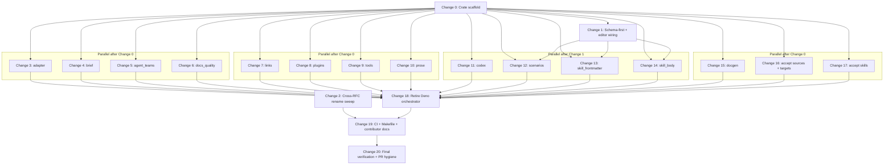

# RFC-5 Implementation Plan

> **Target RFC:** [rfc-5-tooling.md](./rfc-5-tooling.md)  
> **Delivery model:** One atomic PR on a single branch; changes below are sized for independent subagents that land commits in dependency order.  
> **Current Deno surface:** ~3,925 LOC across `scripts/check.ts`, `scripts/checks/*.ts`, `scripts/gen-envelope-doc.ts`, `tests/cross_repo.ts`, and `tests/lib/*.ts`.  
> **Greenfield:** `tooling/` does not exist yet.

## Goals

1. Replace Deno framework validation with a Rust binary at `tooling/` (`tooling check`, `tooling docgen`).
2. Reuse `specify-domain` / `specify-error` via git deps (tag-pinned); no changes to the operator `specify` binary.
3. Schema-first authoring feedback for plain YAML/JSON; Markdown frontmatter enforced by `tooling check`.
4. Port acceptance tests to `tooling/tests/`; retire Deno from `make check`, `make test`, and CI.

## Non-goals (defer)

`--format json`, custom LSP, WASI rule packs, pre-commit hooks, `--changed` scoping, new invariants beyond today's Deno predicates.

---

## Dependency overview



---

## Change inventory

| Change | Title | Depends on | Parallel with |
|--------|-------|------------|---------------|
| **0** | Crate scaffold + check core | — | — |
| **1** | Schema-first pass + editor wiring | 0 | 2 |
| **2** | Cross-RFC rename sweep | — | 1 |
| **3** | Port `check::adapter` | 0 | 4–17 |
| **4** | Port `check::brief` | 0 | 3–17 |
| **5** | Port `check::agent_teams` | 0 | 3–17 |
| **6** | Port `check::docs_quality` | 0 | 3–17 |
| **7** | Port `check::links` | 0 | 3–17 |
| **8** | Port `check::plugins` | 0 | 3–17 |
| **9** | Port `check::tools` | 0 | 3–17 |
| **10** | Port `check::prose` | 0 | 3–17 |
| **11** | Port `check::codex` | 1 | 12–17 |
| **12** | Port `check::scenarios` | 1 | 11, 13–17 |
| **13** | Port `check::skill_frontmatter` | 1 | 11–12, 14–17 |
| **14** | Port `check::skill_body` | 1 | 11–13, 15–17 |
| **15** | Port `tooling docgen` | 0 | 3–14, 16–17 |
| **16** | Port acceptance: `sources` + `targets` | 0 | 3–15, 17 |
| **17** | Port acceptance: `skills_refine` + `skills_loop` | 0 | 3–16 |
| **18** | Retire Deno orchestrator + delete scripts | 3–17 | — |
| **19** | CI, Makefile, contributor docs | 18, 2 | — |
| **20** | Final verification + PR hygiene | 19 | — |

---

## Change 0 — Crate scaffold + check core

**Subagent brief:** Bootstrap `tooling/` with the shared types every check module will use.

### Deliverables

- `tooling/Cargo.toml` — binary crate; git deps on `specify-domain` and `specify-error` pinned to a released tag; commented `[patch]` block for sibling checkout.
- `tooling/Cargo.lock` — committed.
- `tooling/src/main.rs` — clap root with stub `check` and `docgen` subcommands.
- `tooling/src/check.rs` — dispatcher skeleton (empty predicate list initially).
- `tooling/src/check/mod.rs` — module tree.
- `tooling/src/context.rs` — `Context` (framework root resolution, lazy schema cache, optional adapter resolver hook).
- `tooling/src/finding.rs` — `Finding`, `Location`, `Check` trait.
- `tooling/src/lib.rs` or inline shared helpers — frontmatter extraction, repo walk, exit-code mapping (`0` / `2` validation / `1` infrastructure).
- `scripts/bump-specify-cli` — helper to bump the git tag in `tooling/Cargo.toml`.
- `tooling/tests/fixtures_smoke.rs` — one trivial test proving the crate builds and resolves the framework root.

### Acceptance criteria

- `cargo build --manifest-path tooling/Cargo.toml` succeeds.
- `cargo run --manifest-path tooling/Cargo.toml -- check` exits `0` on a clean tree (no predicates yet).
- Framework root resolves to the parent of `tooling/`, never `tooling/` itself.

### Reference sources

- `scripts/checks/_shared.ts` — REPO_ROOT, walk helpers, `SPECIFY_CLI_DIR` semantics.
- RFC-5 §Crate layout, §Cross-repo dependency, §`check` modules.

---

## Change 1 — Schema-first pass + editor wiring

**Subagent brief:** Make JSON Schema the canonical contract for framework-only shapes; wire editor diagnostics for plain YAML/JSON.

**Depends on:** Change 0  
**Parallel with:** Change 2

### Deliverables

- `tooling/schemas/` — authoritative copies (or moves) of framework-only schemas:
  - `skill.schema.json` (strengthened: `pattern`, `maxLength`, `enum` for fields currently checked imperatively in Deno where feasible)
  - `codex-rule.schema.json`
  - `scenario.schema.json`
  - `marketplace.schema.json` (extract from inline validation in `plugins.ts` if absent today)
- `.cursor/schemas/` — symlinks or documented aliases pointing at `tooling/schemas/`.
- Workspace / per-file `$schema` wiring for plain YAML/JSON:
  - `adapters/**/adapter.yaml` → runtime schemas via tooling resolver (document `# yaml-language-server: $schema=` pattern)
  - `.cursor-plugin/marketplace.json` → marketplace schema
  - scenario YAML where present
- `tooling/src/schema.rs` — load and compile schemas from `tooling/schemas/` for reuse by check modules and tests.
- Update `docs/contributing/checks.md` — new § explaining editor-first (YAML/JSON) vs `tooling check` (Markdown frontmatter + cross-file) split.

### Acceptance criteria

- Invalid plain YAML/JSON files show schema violations in Cursor when opened (manual smoke).
- Strengthened skill schema covers at least: description length cap, name pattern, argument-hint token grammar where expressible as JSON Schema.
- `tooling` check modules can call `schema::validate_frontmatter(path, schema_id)`.

### Reference sources

- `.cursor/schemas/*.json`
- `scripts/checks/skill_frontmatter.ts` — identify which predicates move to schema vs stay imperative.
- RFC-5 §Schema-first layer.

---

## Change 2 — Cross-RFC rename sweep

**Subagent brief:** Replace stale `framework-rules`, `framework-check`, `framework-lsp`, and separate `check`/`docgen` binary names with `tooling` / `check::*` vocabulary.

**Depends on:** — (docs-only; no Rust)  
**Parallel with:** Change 1 (and most of Wave A–D)

### Deliverables

Update prose in:

- `rfcs/done/rfc-1-cli.md`
- `rfcs/future/rfc-4-dsl.md`
- `rfcs/done/rfc-10-skills.md`
- `rfcs/done/rfc-13-extensibility.md`
- `rfcs/next/rfc-28-codex-rules.md`
- `rfcs/next/rfc-30-init.md`
- `rfcs/roadmap.md` (RM-16 / RM-07)
- `docs/contributing/checks.md` (if not fully covered in Change 1)

### Acceptance criteria

- `rg 'framework-rules|framework-check|framework-lsp' rfcs/ docs/` returns no stale references (except historical RFC-5 abstract quoting rejected alternatives).
- Module paths in prose use `check::codex`, not `framework-rules::codex`.

---

## Changes 3–14 — Port check modules

Each change follows the same contract:

1. Implement `check::<module>` returning `Vec<Finding>` with stable kebab-case `rule_id`s.
2. Register the module in `tooling/src/check.rs`.
3. Add `tooling/tests/check_<module>.rs` (or inline module tests) with **≥1 positive and ≥1 negative fixture** per rule class.
4. **Do not delete** the matching Deno file yet — dual-run continues until Change 18.
5. Wire the module into a temporary dual Makefile target only if needed for local dev; otherwise rely on `cargo run … -- check`.

### Change 3 — `check::adapter`

| | |
|---|---|
| **Deno source** | `scripts/checks/adapter.ts` (67 LOC) |
| **Depends on** | 0 |
| **Parallel** | 4–17 |

Validate every `adapters/sources/*/adapter.yaml` and `adapters/targets/*/adapter.yaml` via `specify-domain` runtime schemas (`source.schema.json`, `target.schema.json`). Preserve `SPECIFY_CLI_DIR` override.

**Rule ids (suggested):** `adapter.schema-violation`, `adapter.missing-manifest`.

---

### Change 4 — `check::brief`

| | |
|---|---|
| **Deno source** | `scripts/checks/brief_size.ts` (176 LOC) |
| **Depends on** | 0 |
| **Parallel** | 3, 5–17 |

Port brief size limits and no-frontmatter discipline for `adapters/**/briefs/*.md`.

**Rule ids (suggested):** `brief.exceeds-size-limit`, `brief.frontmatter-forbidden`.

---

### Change 5 — `check::agent_teams`

| | |
|---|---|
| **Deno source** | `scripts/checks/agent_teams.ts` (99 LOC) |
| **Depends on** | 0 |
| **Parallel** | 3–4, 6–17 |

Port per-target `agent-teams.md` canonicalisation (symlink to `docs/reference/review-team-protocol.md` or SHA-256 match).

**Rule ids (suggested):** `agent-teams.non-canonical-overlay`.

---

### Change 6 — `check::docs_quality`

| | |
|---|---|
| **Deno source** | `scripts/checks/docs_quality.ts` (181 LOC) |
| **Depends on** | 0 |
| **Parallel** | 3–5, 7–17 |

Port RFC citation hygiene, diagram asset existence, and text-pipeline diagram bans in `docs/explanation/`.

**Rule ids (suggested):** `docs.rfc-citation-in-docs`, `docs.missing-diagram-asset`, `docs.text-pipeline-diagram`.

---

### Change 7 — `check::links`

| | |
|---|---|
| **Deno source** | `scripts/checks/links.ts` (166 LOC) |
| **Depends on** | 0 |
| **Parallel** | 3–6, 8–17 |

Port markdown link resolution, symlink-aware reference checks, and cross-skill directive resolution (`checkReferences`, `checkDirectives`).

**Rule ids (suggested):** `links.unresolved`, `links.broken-reference`, `links.unresolved-directive`.

---

### Change 8 — `check::plugins`

| | |
|---|---|
| **Deno source** | `scripts/checks/plugins.ts` (115 LOC) |
| **Depends on** | 0 (marketplace schema from Change 1 helps but module can compile against stub) |
| **Parallel** | 3–7, 9–17 |

Port symlink integrity under `plugins/` and marketplace ↔ plugin consistency.

**Rule ids (suggested):** `plugins.broken-symlink`, `plugins.marketplace-drift`.

---

### Change 9 — `check::tools`

| | |
|---|---|
| **Deno source** | `scripts/checks/tools.ts` (235 LOC) |
| **Depends on** | 0 |
| **Parallel** | 3–8, 10–17 |

Port first-party tool declaration validation and declared-tool invocation equivalence.

**Rule ids (suggested):** `tools.invalid-declaration`, `tools.invocation-not-equivalent`.

---

### Change 10 — `check::prose`

| | |
|---|---|
| **Deno source** | `scripts/checks/prose.ts` (213 LOC) |
| **Depends on** | 0 |
| **Parallel** | 3–9, 11–17 |

Port invocation positional checks, operational vocabulary allowlist, and skill numeric caps.

**Rule ids (suggested):** `prose.invocation-positional`, `prose.operational-vocabulary`, `prose.numeric-cap-exceeded`.

---

### Change 11 — `check::codex`

| | |
|---|---|
| **Deno source** | `scripts/checks/codex.ts` (216 LOC) |
| **Depends on** | 1 (strengthened codex schema) |
| **Parallel** | 12–17 |

Port codex rule shape validation and RFC-28 namespace ownership (`codex.namespace-ownership-violation` — **stable id from day one**).

**Rule ids:** Must align with RFC-28 reserved namespaces; at minimum `codex.namespace-ownership-violation`, `codex.duplicate-rule-id`, `codex.schema-violation`.

---

### Change 12 — `check::scenarios`

| | |
|---|---|
| **Deno source** | `scripts/checks/scenarios.ts` (466 LOC) |
| **Depends on** | 1 |
| **Parallel** | 11, 13–17 |

Port scenario frontmatter validation and recorded-trace freshness checks. Largest single check module — keep as one subagent scope.

**Rule ids (suggested):** `scenarios.schema-violation`, `scenarios.stale-recorded-trace`.

---

### Change 13 — `check::skill_frontmatter`

| | |
|---|---|
| **Deno source** | `scripts/checks/skill_frontmatter.ts` (567 LOC) |
| **Depends on** | 1 |
| **Parallel** | 11–12, 14–17 |

Port seven frontmatter predicates. Schema-backed checks delegate to `tooling/schemas/skill.schema.json`; imperative checks (name ↔ directory match, allowed-tools set, argument-hint grammar beyond schema, description grammar) stay in Rust.

**Rule ids (suggested):** `skill.name-directory-mismatch`, `skill.description-grammar`, `skill.argument-hint-grammar`, `skill.unknown-tool`, plus schema-backed ids.

---

### Change 14 — `check::skill_body`

| | |
|---|---|
| **Deno source** | `scripts/checks/skill_body.ts` (468 LOC) |
| **Depends on** | 1 |
| **Parallel** | 11–13, 15–17 |

Port twelve body predicates: line counts, critical path, variables, inline JSON blocks, envelope examples ban, frontmatter restatement, step-body duplication, etc.

**Rule ids (suggested):** `skill.body-line-count`, `skill.missing-critical-path`, `skill.variable-coverage`, … (one id per predicate class).

---

## Change 15 — Port `tooling docgen`

| | |
|---|---|
| **Deno source** | `scripts/gen-envelope-doc.ts` (246 LOC) |
| **Depends on** | 0 |
| **Parallel** | 3–14, 16–17 |

### Deliverables

- `tooling/src/docgen.rs` — `docgen envelopes` and `docgen envelopes --check`.
- Preserve `<!-- generated:begin -->` / `<!-- generated:end -->` markers and fixture-to-section mapping table.
- Preserve `SPECIFY_CLI_DIR` sibling-checkout discovery.

### Acceptance criteria

- `cargo run --manifest-path tooling/Cargo.toml -- docgen envelopes` regenerates `docs/reference/cli-output-shapes.md` identically (modulo whitespace policy — document if normalized).
- `--check` exits `2` on drift, `0` when current.

---

## Change 16 — Port acceptance: `sources` + `targets`

| | |
|---|---|
| **Deno sources** | `tests/cross_repo/sources_test.ts` (259 LOC), `tests/cross_repo/targets_test.ts` (186 LOC), shared `tests/lib/{fixtures,validators,specify,spec_provenance,harness,golden}.ts` |
| **Depends on** | 0 |
| **Parallel** | 3–15, 17 |

### Deliverables

- `tooling/tests/sources.rs` — ports `sources_test.ts`.
- `tooling/tests/targets.rs` — ports `targets_test.ts`.
- `tooling/src/test_support/` (or `tests/common/mod.rs`) — shared fixture paths, golden helpers, `REGENERATE_GOLDENS=1` discipline, `SPECIFY_BIN` skip-when-absent.
- Use `specify-domain` for provenance parsing (replaces `tests/lib/spec_provenance.ts`).
- Use same JSON Schema validators as check modules (replaces `tests/lib/validators.ts`).

### Acceptance criteria

- `cargo test --manifest-path tooling/Cargo.toml --test sources` passes.
- `cargo test --manifest-path tooling/Cargo.toml --test targets` passes.
- Tests resolve fixtures from `tests/fixtures/` at framework root.

---

## Change 17 — Port acceptance: `skills_refine` + `skills_loop`

| | |
|---|---|
| **Deno sources** | `tests/cross_repo/skills_refine_test.ts` (91 LOC), `tests/cross_repo/skills_loop_test.ts` (92 LOC) |
| **Depends on** | 0 (shares test_support from Change 16 — **sequence 16 before 17** if same subagent lane; otherwise 17 depends on 16) |
| **Parallel** | 3–15 after 16 lands |

### Deliverables

- `tooling/tests/skills_refine.rs`
- `tooling/tests/skills_loop.rs`

### Acceptance criteria

- Both test binaries pass via `cargo test --manifest-path tooling/Cargo.toml --test skills_refine` and `--test skills_loop`.

---

## Change 18 — Retire Deno orchestrator

**Depends on:** Changes 3–17 all landed  
**Parallel with:** —

### Deliverables

- Wire every check module in `tooling/src/check.rs` (verify none missing vs `scripts/check.ts` import list).
- Delete:
  - `scripts/check.ts`
  - `scripts/checks/` (entire directory)
  - `scripts/gen-envelope-doc.ts`
  - `tests/cross_repo.ts`
  - `tests/cross_repo/`
  - `tests/lib/`
- Update `Makefile`:
  ```makefile
  TOOLING_MANIFEST := tooling/Cargo.toml

  .PHONY: check test ci

  check:
  	cargo run --release --manifest-path $(TOOLING_MANIFEST) -- check

  test:
  	cargo test --manifest-path $(TOOLING_MANIFEST)

  ci: check test
  ```
- Remove `doc-envelopes` Deno target; document `tooling docgen envelopes` instead.

### Acceptance criteria

- `rg 'deno|Deno' Makefile .github/workflows/ci.yaml` — no Deno in primary gates.
- `make check` and `make test` invoke only Cargo.
- Rule coverage parity: every Deno predicate class has a Rust counterpart with fixtures (grep `scripts/checks` vs `tooling/src/check/` before deletion).

---

## Change 19 — CI, Makefile, contributor docs

**Depends on:** 18, 2  
**Parallel with:** —

### Deliverables

- `.github/workflows/ci.yaml`:
  - Add `dtolnay/rust-toolchain@stable` and `Swatinem/rust-cache@v2`.
  - Remove `denoland/setup-deno`.
  - Jobs:
    ```yaml
    - run: cargo test --manifest-path tooling/Cargo.toml
      env:
        SPECIFY_CLI_DIR: specify-cli
    - run: cargo run --release --manifest-path tooling/Cargo.toml -- check
    - run: cargo run --release --manifest-path tooling/Cargo.toml -- docgen envelopes --check
      env:
        SPECIFY_CLI_DIR: specify-cli
    ```
  - Extend `paths:` triggers to include `tooling/**`.
  - Keep specify-cli sparse checkout for schemas.
- `docs/contributing/index.md` — audience split (authors vs tooling contributors); Rust optional for markdown-only edits.
- `docs/contributing/acceptance.md` — replace Deno harness instructions with `cargo test --manifest-path tooling/Cargo.toml`; manual scenario packs unchanged.
- `docs/contributing/checks.md` — final pass aligned with shipped commands.
- `AGENTS.md` / `.cursor/rules/project.mdc` — replace `make check` / Deno references with `tooling` vocabulary.

### Acceptance criteria

- CI green on the implementation branch.
- Contributor docs describe `make check` → `tooling check` with no Deno prerequisite.

---

## Change 20 — Final verification + PR hygiene

**Depends on:** 19  
**Parallel with:** —

### Checklist

- [x] `cargo test --manifest-path tooling/Cargo.toml` — all integration + module tests green (148 tests).
- [x] `cargo run --release --manifest-path tooling/Cargo.toml -- check` — exit `0`.
- [x] `cargo run --release --manifest-path tooling/Cargo.toml -- docgen envelopes --check` — exit `0`.
- [x] `tooling/` LOC — ~6,180 `src/` + ~2,865 `tests/` (~9,045 total vs ~3,925 Deno). Higher than the aspirational cap because Rust is more verbose, every rule carries fixture tests, and shared infrastructure (`context`, `finding`, `schema`, `test_support`) replaces duplicated Deno helpers. Predicate logic itself is not over-factored; revisit only if review surfaces dead code.
- [x] `Cargo.lock` committed; `[patch]` block commented.
- [x] `tooling/target/` in `.gitignore`.
- [ ] RFC-5 status note in PR description; link RM-16 (operator action at PR open).
- [x] No operator CLI (`specify-cli`) changes required.

---

## Parallel execution schedule

Use this when fanning out subagents on one branch (rebase between waves as needed).

| Wave | Changes | Notes |
|------|---------|-------|
| **0** | 0 | Gate — all other work blocked until scaffold merges |
| **1** | 1 ∥ 2 | Schema pass and doc rename sweep are independent |
| **2** | 3, 4, 5, 6, 7, 8, 9, 10, 15, 16 | Up to 10 parallel subagents; 16 before 17 |
| **3** | 11, 12, 13, 14, 17 | Schema-dependent checks + remaining acceptance |
| **4** | 18 | Serial — deletes Deno only after parity proven |
| **5** | 19 | Serial — CI flip |
| **6** | 20 | Serial — final gate |

**Maximum safe parallelism:** 10 subagents in Wave 2 (if CI/staging branch tolerates merge churn); typically 4–6 is more practical.

---

## Subagent prompt template

Each subagent should receive:

```text
Implement RFC-5 Change <N>: <title>

Branch: <shared implementation branch>
Framework root: augentic/specify (parent of tooling/)

Read first:
- rfcs/rfc-5-tooling.md (§ relevant sections)
- rfcs/rfc-5-implementation-plan.md (Change <N>)
- Deno source: scripts/checks/<file>.ts OR tests/cross_repo/<file>.ts

Hard rules:
- Do NOT extend the operator specify binary in specify-cli.
- Do NOT delete Deno files (Change 18 owns deletion).
- Every ported rule: ≥1 positive + ≥1 negative fixture.
- rule_id: stable kebab-case; codex ids fixed per RFC-28.
- Framework root is repo root, not tooling/.
- Register new modules in tooling/src/check/mod.rs.
- Run: cargo test --manifest-path tooling/Cargo.toml

Deliver: implementation + tests + brief commit message focused on why.
```

---

## Implementation notes (post-execution)

Amendments discovered during subagent execution:

1. **`specify-cli` git tag** — tag `v0.1.0` predates the `specify-domain` crate. Until specify-cli retags, pin both deps to a known-good `rev` in `tooling/Cargo.toml` (documented inline). Use `scripts/bump-specify-cli` after the next CLI release.
2. **Module layout** — Rust cannot compile both `src/check.rs` and `src/check/mod.rs`. The dispatcher lives in `check/mod.rs` only; predicate modules are siblings under `check/`.
3. **Schema vs imperative (Change 13)** — description imperative-verb check stays in Rust (verb allow-list too large for JSON Schema); only `Use when` and length caps moved to schema. `license` rejection is schema-only via `additionalProperties: false`.
4. **Parallel subagent churn** — Wave 2/3 subagents landing on one branch occasionally bundled unrelated files in a single commit or left transient `mod.rs` conflicts; serial `cargo test` after each wave is the reliable gate.
5. **Regex lookahead** — Deno patterns using `(?!…)` (links RFC skip, tools `specify-contract`) need manual emulation in Rust `regex` (no lookahead).
6. **LOC target** — total `tooling/` exceeds the ~3,925 Deno surface primarily because of mandatory per-rule fixtures and Rust boilerplate; not a signal to split crates.

**Execution status:** Changes 0–20 landed on branch `rfc-5` (2026-05-25).

---

## Risk notes

| Risk | Mitigation |
|------|------------|
| `specify-domain` API drift | Pin git `rev` until retag; `scripts/bump-specify-cli` for coordinated bumps after CLI releases |
| Schema vs imperative split wrong | Change 1 explicitly lists which Deno predicates stay in Rust; review against `skill_frontmatter.ts` |
| Dual-run drift during migration | Each check change registers in Rust but leaves Deno until Change 18; optional temporary CI job running both until Wave 3 completes |
| Large modules (skill_*, scenarios) | One subagent per module; do not split files mid-module |
| Cross-repo CI without specify-cli checkout | Keep sparse checkout; document `SPECIFY_CLI_DIR` in test_support |

---

## Related documents

- [RFC-5: Framework Developer Tooling](./rfc-5-tooling.md)
- [docs/contributing/checks.md](../docs/contributing/checks.md)
- [docs/contributing/acceptance.md](../docs/contributing/acceptance.md)
- [Specify CLI AGENTS.md](https://github.com/augentic/specify-cli/blob/main/AGENTS.md)
