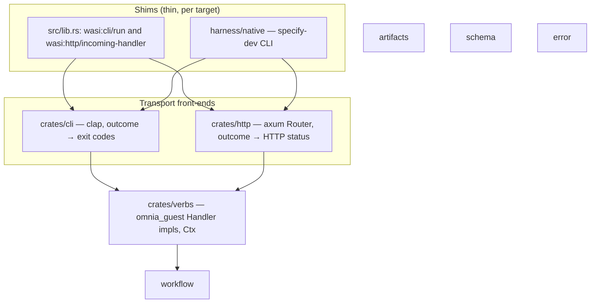

# RFC-61: Transport-Neutral Verbs and the Dual Shims

> **Status: Draft.** One transport-neutral verb layer under two transports (CLI and HTTP) and two execution shims (wasm guest and Rust-native), so the entire codebase — core and adapters — is exercisable for testing and the dev loop without a wasm runtime, and Specify runs equally as a command-line tool or an HTTP server. Modelled on the train repo's dual-shim pattern (`/Users/andrewweston/github.com/wasm-replatform/train`).

## Abstract

Omnia's capability traits are Rust-native connections to omnia-backed resources (model, http, keyvalue, blob, …). On `wasm32` each trait method carries a default body delegating to the WASI host; off `wasm32` the signature is bare and the caller supplies a native implementation. This single design element means an application's core code stays Rust-native and can run without the overhead of a wasm runtime.

This RFC restructures Specify around two orthogonal axes over one command layer:

- **Transport** — every command is reachable from the command line *and* as an HTTP endpoint (GET or POST). The clap grammar and a hand-written axum router become two thin front-ends over the same verb handlers; neither is core code.
- **Execution** — a Rust-native shim sits alongside the wasm guest shim: a `specify-dev` binary that drives the same verbs against a `NativeProvider` (a native `Model` backend plus in-process dispatch to the adapter operation crates). The wasm guest remains the shipped path; the native shim owns testing and the dev loop.

Four combinations fall out of one command layer: CLI-on-wasm (the shipped binary today), HTTP-on-wasm (the guest as a served component), CLI-native and HTTP-native (the dev harness).

## The core idea

The train repo demonstrates the pattern: domain crates generic over capability traits, a wasm guest shim (`#[cfg(target_arch = "wasm32")]`) whose whole job is routing — a customised axum router bridged by the SDK's guest-side HTTP serve — and a native entry point that binds the same capabilities natively. Nothing in the domain layer knows which shim it runs under.

Specify is already structured to exploit this — more so than train was:

- The orchestrators in `workflow::orchestrate` are generic over `&impl Model + SourceSeam + TargetSeam`.
- Adapter describe dispatch is a registered function pointer (`workflow::adapter::describe::DescribeRunner`), not a wasmtime call.
- The adapters in `specify-adapters` are already split into a shim-agnostic `operations.rs` (generic over `P: Model`, built as `rlib`) plus a `#[cfg(wasm32)]` `guest.rs`.
- Scripted mocks already exist natively: `testkit::MockModel`, `workflow::seam::{MockSourceSeam, MockTargetSeam}`.
- `output::emit` already writes to an abstract `&mut dyn Write`; only `Ctx::write` pins stdout.
- `omnia-wasi-http` already carries a guest side that re-exports axum — the same in-guest axum bridge train uses via `qwasr_wasi_http::serve`.

So this is not a re-architecture. It is one crate split (transport-neutral verbs out of `cli`), one new front-end crate (`http`), one native provider, one native entry point — plus reconciling the root manifest with the `src/` layout.

## The reframe: `cli` is a transport, not the core

Today `crates/cli` conflates four separable things:

1. **`commands/*`** — the handlers. These are the real command surface and are already transport-neutral in substance: load `Ctx`, do work, produce a serializable body.
2. **`context.rs`** — `Ctx` (project anchor, clock, format, write). Neutral except for the hard-coded stdout sink and `Format` deriving `clap::ValueEnum`.
3. **`output.rs`** — `emit` is already sink-abstract; `Exit` is the CLI-specific projection of the error taxonomy.
4. **`cli.rs` + `guest.rs`** — the clap grammar and `Route`. The grammar is genuinely CLI-transport-specific; `Route` is shim policy wearing a transport costume (the `unsupported` refusals, the preopen anchoring, the orchestrate fork are all guest decisions, not CLI facts).

The restructure pulls 1–3 down into a transport-neutral crate, makes clap and axum sibling front-end *libraries* over it, and moves routing into the shims — each shim owns its dispatch match.

## What is missing today

1. **The manifest still describes a retired layout.** Root `Cargo.toml` declares `[[test]]` targets at `core/tests/composed*.rs` and `[[bin]] runtime-replay` at `src/replay.rs`, but the guest already lives under `src/` and the composed rig plus replay runtime are dropped in favor of the native harness.
2. **No transport-neutral command layer.** The handlers, `Ctx`, and envelopes live inside the clap-flavoured `cli` crate; there is no HTTP front-end.
3. **`src/verbs.rs` is hard-wired to the WIT `Provider`.** It is the orchestration driver, and apart from the concrete `&Provider` at each call site it is already wasm-clean. Reshaping each match arm into an `omnia_guest::api::Handler<P>` impl makes every verb directly callable by both shims, whichever transport routed it.
4. **No native `Model` implementation with a real backend.** `omnia-cursor::Client` implements the host-side `WasiModelCtx`, not `omnia_guest::Model`. Testkit's `MockModel` covers scripted tests, but the dev loop needs a cursor-agent-backed native `Model`.
5. **No native `SourceSeam` / `TargetSeam` over the real adapters.** In-guest these cross the WIT boundary; natively they should dispatch in-process to the adapter `operations` modules (e.g. `intent::operations::survey(model, ctx)`), which is exactly what the `rlib` crate-type on the adapter crates enables.

## Target structure

### Layering



### Tree

```text
specify/
├── src/                         # the Omnia deployment unit
│   ├── lib.rs                   # wasm guest shim: cli/run + incoming-handler  [wasm32]
│   ├── provider.rs              # WIT-backed Provider — unchanged              [wasm32]
│   ├── runtime.rs               # native omnia::runtime! host                  [native]
│   └── verbs.rs                 # orchestration driver (dissolves into Handler impls in Step 2)
├── crates/
│   ├── verbs/                   # NEW — transport-neutral command layer: omnia Handler impls (split from cli)
│   ├── cli/                     # front-end library: clap grammar, Input conversions, rendering (no routing)
│   ├── http/                    # NEW — axum front-end over verbs (wasm-clean)
│   └── …                        # workflow, artifacts, schema, error, testkit — untouched
└── harness/
    ├── fixtures/                # unchanged
    └── native/                  # NEW — the Rust-native shim (dev-only, not a default-member)
        ├── src/main.rs          # `specify-dev` bin: CLI mode + `serve` mode
        ├── src/provider.rs      # NativeProvider: Model + SourceSeam + TargetSeam + describe
        ├── src/model.rs         # Cursor | Replay | Mock model backends
        ├── src/mcp.rs           # axum routes for /mcp/<name> reference shelves
        └── tests/               # full-loop integration tests, no wasm runtime
```

`harness/native` path-depends on `../specify-adapters/sources/*` and `targets/*` rlibs. That cross-repo dependency is consistent with existing practice — the workspace already patches `omnia` via `../omnia`, and the harness already reaches into the sibling's release build. Keeping it out of `default-members` keeps the shipped binary and `cargo make ci`'s core gate free of the sibling requirement.

## The verb shape — `omnia_guest::api::Handler`

Each verb in `crates/verbs` is a request type implementing omnia's existing `Handler` trait (`omnia-guest/src/api/request.rs`) — the same construct train uses through its SDK. Nothing is defined locally:

```rust
pub trait Handler<P: Provider>: Sized {
    type Input;
    type Output: Body;
    type Error: Error + Send + Sync;

    fn from_input(input: Self::Input) -> Result<Self, Self::Error>;
    fn handle(self, ctx: Context<P>)
        -> impl Future<Output = Result<Reply<Self::Output>, Self::Error>> + Send;
}
```

`Provider` is a blanket trait (`Send + Sync`), so the trait-level `P` costs nothing — each impl states only the capabilities it needs in its own `where` clause. `type Error` is Specify's `error::Error` everywhere; the CLI `Exit` mapping and the HTTP status mapping both derive from it. A deterministic verb implements `Handler<P>` for all `P: Provider` and ignores the provider; an orchestration verb bounds `P` and drives `workflow::orchestrate` directly:

```rust
impl<P> Handler<P> for SliceBuild
where
    P: Model + SourceSeam + TargetSeam,
{
    type Input = SliceBuildArgs;   // flat serde struct — clap flags, path/query
                                   // params, and JSON body share its field names
    type Output = BuildBody;
    type Error = error::Error;

    fn from_input(input: SliceBuildArgs) -> Result<Self, Error> { … }  // parse + validate

    async fn handle(self, ctx: Context<'_, P>) -> Result<Reply<BuildBody>, Error> {
        // today's src/verbs.rs Verb::Build arm, with ctx.provider for &Provider
    }
}
```

Because the provider arrives in `Context<P>` and `handle` returns a typed `Reply` (no sink, no format), there is no orchestration split and no in-handler rendering: the shims differ only in which `&P` they pass (`&Provider` in-guest, `&NativeProvider` in the harness), and the transports own presentation. Tests invoke verbs directly — `SliceBuild::handler(args)?.provider(&mock).owner("").await` — no HTTP, no subprocess.

Specify's conventions on top (the trait does not enforce them): `type Input` is a flat serde struct both transports can produce; `owner` is `""` (no tenancy); every verb is async. `docs/standards/handler-shape.md` is rewritten around this trait.

## The HTTP surface

Exactly train's shape: a hand-written axum `Router` where each route is a small wrapper — merge path/query/body into the verb's `Input`, then `Verb::handler(input)?.provider(&provider).owner("").await`, serializing the `Reply`. No route table, no generation; the parity between transports is structural (both front-ends call the same `Handler` impl), so behavior cannot diverge — the only possible drift is a verb without a route, which surfaces as an immediate 404. Route conventions, as prose guidance for whoever adds a route:

- **GET** for pure reads: `plan status`, `journal show`, `slice provenance`, `slice model show`, registry projections. Args as query params.
- **POST** for anything that writes or drives judgment: transitions, `plan author`, `slice build` / `merge`, `plan execute`. Args as a JSON body mirroring the clap flags; the noun in the path (`POST /slice/{name}/build`).

The wire shapes come nearly free: the typed `Reply` bodies serialize into the same JSON envelopes handlers emit today, and the error envelope with its kebab-case discriminants becomes the error response. The error taxonomy maps to statuses — success → 200, generic failure → 500, validation/argument → 422, version floor → 409 (or 426 Upgrade Required). `Exit` stays in `cli`; `http` maps from the same `error::Error`, not from exit codes.

Because every verb already has the uniform `Handler` shape, a closed verb ↔ route table (a `(verb, method, path)` spec per impl, router built by mounting a generic `dispatch<V: Handler<P>>` over it, framework test asserting every clap verb has a route) becomes a small additive change — potentially a macro in omnia if a second consumer appears. Start hand-written; adopt the table only when the wrapper pile earns it.

## Migration steps

### Step 1 — reconcile the tree

Align `Cargo.toml` with the on-disk `src/` layout: keep `src/{lib.rs, provider.rs, runtime.rs, verbs.rs}`, drop the `runtime-replay` bin and the composed `[[test]]` targets, retire `harness/runtime` as a package, and delete `src/replay.rs` plus `src/tests/`. Zero behavior change to the shipped binary; the manifest stops describing surfaces the native harness replaces.

### Step 2 — split `cli` into `verbs` + `cli`

Extract the transport-neutral command layer into `crates/verbs`, reshaping each verb onto `Handler<P>`: a named `Input` DTO (today's clap arg structs, minus the clap derives), validation in `from_input`, the work in `handle` — each `src/verbs.rs` match arm becomes the corresponding `handle` body, with `ctx.provider` replacing the concrete `&Provider`. The reshaping is mechanical and can land verb-by-verb. Two decouplings ride along:

- **`Ctx` shrinks to project anchor + clock** (essentially `Layout`), constructed inside `handle`. `Ctx::write`, the stdout sink, `emit`, and `Format` (with its `ValueEnum` derive) all move to the front-ends.
- **`cli::guest::{route, Route}` is deleted, not relocated.** Each shim writes its own dispatch match, exhaustive over the closed `Commands` enum — duplication is compiler-checked (a new verb breaks every shim's build until it routes it), and per-shim policy stays local: the guest refuses the provisioning verbs it cannot implement and anchors at the `"."` preopen; `specify-dev` may implement them and anchors at a configured root. A shared `route()` would have to encode both behind flags.

`crates/cli` becomes a pure front-end library with three exports: the clap grammar (`Cli`, `Commands`), the `Cli`-field → `Input` conversions (shared `From` impls so every shim constructs identical inputs), and rendering (`Reply` → JSON/text, the `Exit` mapping). The guest's `run()` is then: register describe runner, `cli::parse(argv)`, dispatch match with `&Provider`, render through `cli`.

### Step 3 — `crates/http` + the guest's HTTP export

- Hand-write the axum router per "The HTTP surface" — one `.route(path, get|post(wrapper))` per verb. The crate stays wasm-clean (axum builds on `wasm32` exactly as train proves).
- `src/lib.rs` gains the `wasi:http/incoming-handler` export alongside `wasi:cli/run`, bridged through `omnia_wasi_http`'s guest side — the specify guest becomes a served component, train's pattern made literal.

### Step 4 — `NativeProvider` in `harness/native`

- **`SourceSeam` / `TargetSeam`**: a dispatch table keyed by adapter id (`source:intent` → `intent::operations::{survey, extract}`, `target:omnia` → `omnia::operations::{guidance, build}`, …) — the native mirror of Omnia's host-mediated dispatch, one match arm per linked adapter crate.
- **`describe_runner`**: calls each adapter's `operations::describe()` directly.
- **`Model`**: an enum of backends — **Cursor** (cursor-agent spawn for the real dev loop), **Replay** (recorded answers, mirroring `ModelDefault`), **Mock** (`testkit::MockModel`) for tests. For the Cursor backend, the cleanest path is a thin adapter over `omnia-cursor`'s `Client::complete` with a minimal local `ToolHost` whose `local_path()` is the project dir — that reuses the entire existing spawn/repair/transcript logic instead of duplicating it. (Worth considering upstreaming as a native `impl omnia_guest::Model` convenience in `omnia-cursor` itself.)
- **`mcp.rs`**: axum routes serving each linked adapter's reference shelf at `/mcp/<name>`, with the grant URLs the `Context` hands to judgment calls rewritten to `http://127.0.0.1:<port>/mcp/<name>` — cursor-agent fetches these over real HTTP regardless of shim. In `serve` mode these routes mount on the same listener as the verb routes.

### Step 5 — `specify-dev` bin + rewire the dev loop

- `main.rs`: tokio main, two modes. CLI mode: same argv contract — `cli::parse(argv)`, then `specify-dev`'s own dispatch match invoking each `Handler` impl against `&NativeProvider`. `serve` mode: the `crates/http` router on a `TcpListener`, same provider.
- Integration tests move down a weight class: full `plan author` → `approve` → `plan execute` loops against real adapter operation code with Replay/Mock models — no component builds, no cranelift JIT, no `wkg` fetches — driven through either transport. The retired composed rig and replay runtime are not replaced one-for-one; the native harness owns the dev loop and the crate-level suites keep the deterministic coverage.
- Makefile: a `cargo make dev` task running `specify-dev`, and the native harness suite joins the on-demand harness tasks (or CI, once the sibling checkout is guaranteed there).
- `evals/drivers/guest-execute-loop.sh` gains a native mode that swaps the guest build + omnia runtime for `specify-dev` — same journal probes, drastically faster iteration.

### Step 6 — adapters repo hygiene

Verify every source/target crate in `specify-adapters` matches intent's shape: `crate-type = ["cdylib", "rlib"]`, all wasm-only deps under `[target.'cfg(target_arch = "wasm32")'.dependencies]`, nothing wasm-flavored reachable from `operations` / `registry`. Optionally have each adapter export a uniform `SourceOps` / `TargetOps` value so the harness dispatch table is declarative rather than a hand-written match.

## HTTP-mode concerns

These do not exist in one-shot CLI and are decided here:

- **Project binding.** A server instance anchors `Ctx` at one project root at startup (matching the guest's `"."` preopen). Multi-project serving is a non-goal initially.
- **Concurrency.** `.specify/` assumes a single writer — atomic writes protect individual files, not workflows. Serialize mutating dispatch behind a mutex initially; GETs stay concurrent.
- **Long-running verbs.** `plan execute` runs for minutes. Start synchronous (fine for the dev harness); a job-style or SSE surface is a later evolution. The `ExecuteOutcome::Stopped` → validation-error typing already gives HTTP a clean 422 for a parked loop.

## Things to watch

- **Project-root anchoring.** `Context<P>` carries owner, provider, and headers — no path. In-guest the `"."` preopen anchors `Ctx`; native `serve` mode needs the configured project root to reach `handle`. The natural home is the provider value itself (`NativeProvider { project_dir, … }`).
- **`lend_workspace` semantics.** In-guest, the `"."` preopen is resolved at the call site by the wasm default body. The native `Model` impl must translate `lend_workspace: true` into handing cursor-agent the actual project directory — this is the main semantic (not just mechanical) bit of the native provider.
- **The `omnia_wasi_http` guest serve API.** The axum re-export is confirmed; the exact serve-bridge signature (train's `qwasr_wasi_http::serve(router, request)` equivalent) needs confirming against `omnia` 0.35 when Step 3 lands.
- **What the native harness cannot prove.** It exercises all judgment, orchestration, artifact, and adapter-operation code, but not the WIT bindings, Omnia's dispatch-by-id, or mount/preopen wiring. That wasm-only surface stays with the shipped guest and targeted adapter tests — state the boundary in `harness/README.md` so the native suite is not mistaken for full WIT conformance coverage.

## Sequencing

Steps 1 and 2 are refactoring with no new behavior and make everything else possible; step 3 adds the HTTP transport; step 4's Cursor model backend is the only genuinely new machinery. Start with step 1, since the manifest still declares the retired replay bin and composed tests.
