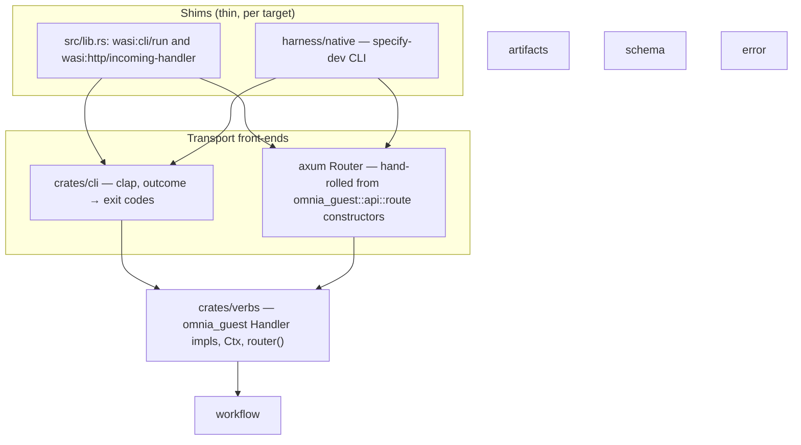

# RFC-61: Transport-Neutral Verbs and the Dual Shims

> **Status: Draft.** One transport-neutral verb layer under two transports (CLI and HTTP) and two execution shims (wasm guest and Rust-native), so the entire codebase — core and adapters — is exercisable for testing and the dev loop without a wasm runtime, and Specify runs equally as a command-line tool or an HTTP server. Modelled on the train repo's dual-shim pattern (`/Users/andrewweston/github.com/wasm-replatform/train`).

## Abstract

Omnia's capability traits are Rust-native connections to omnia-backed resources (model, http, keyvalue, blob, …). On `wasm32` each trait method carries a default body delegating to the WASI host; off `wasm32` the signature is bare and the caller supplies a native implementation. This single design element means an application's core code stays Rust-native and can run without the overhead of a wasm runtime.

This RFC restructures Specify around two orthogonal axes over one command layer:

- **Transport** — every command is reachable from the command line *and* as an HTTP endpoint (GET or POST). The clap grammar and an axum router built from omnia-guest's routing plumbing become two thin front-ends over the same verb handlers; neither is core code.
- **Execution** — a Rust-native shim sits alongside the wasm guest shim: a `specify-dev` binary that drives the same verbs against a `NativeProvider` (a native `Model` backend plus in-process dispatch to the adapter operation crates). The wasm guest remains the shipped path; the native shim owns testing and the dev loop.

Four combinations fall out of one command layer: CLI-on-wasm (the shipped binary today), HTTP-on-wasm (the guest as a served component), CLI-native and HTTP-native (the dev harness).

A small upstream track in omnia rides alongside: the transport plumbing this RFC needs — HTTP routing plumbing as library code usable on and off `wasm32`, a guest-side `wasi:cli/run` trigger, native `Model` backends — is generic omnia-guest machinery with train as a second consumer, and folds back into omnia rather than accreting in Specify: routing plumbing and the cli trigger immediately, the native cursor `Model` and the test doubles incubating locally first and graduating once proven. This is omnia's direction of travel as the everything-wasm runtime: omnia owns all trigger and capability plumbing; an application owns only its verbs.

## The core idea

The train repo demonstrates the pattern: domain crates generic over capability traits, a wasm guest shim (`#[cfg(target_arch = "wasm32")]`) whose whole job is routing — a customised axum router bridged by the SDK's guest-side HTTP serve — and a native entry point that binds the same capabilities natively. Nothing in the domain layer knows which shim it runs under.

Specify is already structured to exploit this — more so than train was:

- The orchestrators in `workflow::orchestrate` are generic over `&impl Model + SourceSeam + TargetSeam`.
- Adapter describe dispatch is a registered function pointer (`workflow::adapter::describe::DescribeRunner`), not a wasmtime call.
- The adapters in `specify-adapters` are already split into a shim-agnostic `operations.rs` (generic over `P: Model`, built as `rlib`) plus a `#[cfg(wasm32)]` `guest.rs`.
- Scripted mocks already exist natively: `testkit::MockModel`, `workflow::seam::{MockSourceSeam, MockTargetSeam}`.
- `output::emit` already writes to an abstract `&mut dyn Write`; only `Ctx::write` pins stdout.
- `omnia-wasi-http` already carries a guest side that re-exports axum — `omnia_wasi_http::serve(router, request)` is the same in-guest axum bridge train uses via `qwasr_wasi_http::serve`.
- `omnia_guest_macros::guest!` already generates the entire HTTP front-end from a declarative `http:` route table: the `LazyLock` router, one wrapper per route calling `Request::handler(input)?.provider(..).owner(..)`, the `wasip3::http::proxy::export!`, and the serve bridge. The wrapper shape this RFC needs exists; what it lacks is library form — the plumbing is inlined into a wasm-gated macro expansion instead of living in `omnia-guest` where a consumer can also hand-roll against it (see the upstream track).
- `omnia_guest::mcp::router` is a target-neutral MCP Streamable-HTTP router over an `McpServer` impl — the native harness's reference shelves need no hand-written MCP transport.

So this is not a re-architecture. It is one crate split (transport-neutral verbs out of `cli`), one router function over omnia-guest's routing plumbing, one native provider, one native entry point — plus a small upstream track in omnia and reconciling the root manifest with the `src/` layout.

## The reframe: `cli` is a transport, not the core

Today `crates/cli` conflates four separable things:

1. **`commands/*`** — the handlers. These are the real command surface and are already transport-neutral in substance: load `Ctx`, do work, produce a serializable body.
2. **`context.rs`** — `Ctx` (project anchor, clock, format, write). Neutral except for the hard-coded stdout sink and `Format` deriving `clap::ValueEnum`.
3. **`output.rs`** — `emit` is already sink-abstract; `Exit` is the CLI-specific projection of the error taxonomy.
4. **`cli.rs` + `guest.rs`** — the clap grammar and `Route`. The grammar is genuinely CLI-transport-specific; `Route` is shim policy wearing a transport costume (the `unsupported` refusals, the preopen anchoring, the orchestrate fork are all guest decisions, not CLI facts).

The restructure pulls 1–3 down into a transport-neutral crate, makes clap a front-end *library* over it with the axum router as its sibling, and moves routing into the shims — each shim owns its dispatch match.

## What is missing today

1. **The manifest still describes a retired layout.** Root `Cargo.toml` declares `[[test]]` targets at `core/tests/composed*.rs` and `[[bin]] runtime-replay` at `src/replay.rs`, but the guest already lives under `src/` and the composed rig plus replay runtime are dropped in favor of the native harness.
2. **No transport-neutral command layer.** The handlers, `Ctx`, and envelopes live inside the clap-flavoured `cli` crate; no HTTP front-end is wired up. The wrapper logic is not missing — `guest!` generates it — but only as a wasm-gated macro expansion that constructs the provider per request via `DefaultProvider::new()`: unusable by a stateful `NativeProvider`, and impossible to hand-roll against because none of it exists as library code.
3. **`src/verbs.rs` is hard-wired to the WIT `Provider`.** It is the orchestration driver, and apart from the concrete `&Provider` at each call site it is already wasm-clean. Reshaping each match arm into an `omnia_guest::api::Handler<P>` impl makes every verb directly callable by both shims, whichever transport routed it.
4. **The `wasi:cli/run` trigger is hand-written.** `src/lib.rs` carries the `CliGuest` struct, the `export!`, the argv fetch, and the exit-code passthrough onto `wasi:cli/exit#exit-with-code` — pure trigger plumbing with no Specify vocabulary in it, exactly parallel to what `guest!` generates for the http and messaging triggers.
5. **No native `Model` implementation with a real backend.** `omnia-cursor::Client` implements the host-side `WasiModelCtx`, not `omnia_guest::Model`. Testkit's `MockModel` covers scripted tests, but the dev loop needs a cursor-agent-backed native `Model`. The eventual home is upstream — `omnia-cursor` already owns the entire spawn/repair/transcript machinery, and the scripted/replay backends are capability-generic testkit material — but both incubate locally first (upstream track items 3 and 4).
6. **No native `SourceSeam` / `TargetSeam` over the real adapters.** In-guest these cross the WIT boundary; natively they should dispatch in-process to the adapter `operations` modules (e.g. `intent::operations::survey(model, ctx)`), which is exactly what the `rlib` crate-type on the adapter crates enables.

## The upstream track — fold the transport plumbing into omnia

The capability traits were deliberately built dual-target (WASI-backed default bodies on `wasm32`, bare signatures off it), but omnia currently ships the wasm half of the transport story and none of the native half, so every consumer of the pattern rebuilds the same pieces. Two folds land with this RFC, each with train as its second consumer; two more are staged deliberately — incubated locally, graduating upstream once proven:

1. **Routing plumbing as library code in `omnia-guest`.** The per-route wrapper the macro inlines is the same function every time, modulo types; it belongs in `omnia-guest` as a routing module (`omnia_guest::api::route`, say) so a consumer can hand-roll a router against the same primitives the macro uses. The shape: generic route constructors — `route::get::<R, P>()` / `route::post::<R, P>()` returning an axum `MethodRouter` — that extract path/query/body into `Handler::Input` via serde (typed extraction, so the flat `Input`-struct convention holds across transports), then run `client.request(R::from_input(input)?)`. The state carrier already exists: `Client<P>` is `Clone`, Arc-backed, and holds exactly owner + provider — a ready-made axum state type that replaces the per-request `DefaultProvider::new()` for stateless and stateful providers alike. Nothing in any of this is wasm-specific (axum, `Handler`, `HttpResult`, `Reply: IntoResponse` all build off `wasm32`); only the `wasip3::http::proxy::export!` and the `omnia_wasi_http::serve` impl stay wasm-gated. `guest!`'s `http:` arm is then reimplemented as thin sugar emitting those library calls plus the wasm export — table-driven and hand-rolled routing become one mechanism, and both compose on one `Router` (bespoke routes — SSE, MCP mounts — `merge` in alongside verb routes).
2. **A `command:` trigger.** Omnia models command-mode deployments host-side (`Mode::Command` in `omnia::runtime`) but offers no guest-side counterpart, so every command-mode guest hand-writes the export/argv/exit dance. The fold: a `command:` arm in `guest!` (or a small `omnia_guest::cli` module) owning the export, the argv fetch, and the exit-code passthrough, calling an app-supplied dispatch entry. The dispatch match itself stays app-side — per-shim policy is the point (see Step 2).
3. **Native cursor `Model`: incubate as a harness-local shim, graduate to `omnia-cursor` once proven.** The backends repo stays untouched for now — `omnia-cursor` is consumed as an ordinary library dependency, and the shim is thin because the cursor backend touches its `ToolHost` for exactly one thing: `local_path()` (cursor-agent does its own filesystem work; `resolve`/`read`/`list`/`write`/`verify` are never called on this backend). The harness shim is a `CursorModel { client: omnia_cursor::Client, root }` implementing `omnia_guest::Model`: map the guest `Request` onto the host-side `omnia_wasi_model::Request` (mechanical — the wasm default body performs the same mapping onto the WIT wire), translate `lend_workspace: true` into a minimal `LocalToolHost` whose `local_path()` is the project root, call `Client::complete`, map the `Answer` back. The trade-off is accepted knowingly: the `lend_workspace` interpretation lives app-side during incubation — the one thing graduation to a feature-gated `impl Model` in `omnia-cursor` later resolves, restoring a single reading of omnia's lend contract next to the host-side one.
4. **Model test doubles: consolidate in Specify first, graduate to `omnia-testkit` once proven.** `MockModel` is already duplicated near-verbatim across specify's and specify-adapters' testkit crates — consolidate on specify's `crates/testkit` and have specify-adapters dev-depend on the sibling path (consistent with its existing `../omnia/*` path deps; `[dev-dependencies]`-only, so nothing reaches a shipped component's graph), retiring the adapters copy (its `mcp_grants` helper moves along). `ReplayModel` is the genuinely new piece: incubate it in `harness/native` — its only consumer — keeping the fixture format aligned with omnia's replay conventions so graduation is a file move, not a format migration. Both move to `omnia-testkit` (nearly empty today: `temp_manifest` + `find_guest`) once the replay fixture shape has stabilised in real harness use — deferred, not dropped.

What stays in Specify: the verb impls, the per-shim dispatch matches, the error projection (`From<error::Error> for omnia_guest::Error` — coherent, since `error::Error` is local), and — until folds 3 and 4 graduate — the cursor `Model` shim and the model test doubles. The workspace already path-patches omnia from the dev sibling, so the two immediate folds carry no release-coordination cost and can run in parallel with the early steps; the backends repo is off the critical path entirely.

## Target structure

### Layering



### Tree

```text
specify/
├── src/                         # the Omnia deployment unit
│   ├── lib.rs                   # wasm guest shim: cli/run + incoming-handler  [wasm32]
│   ├── provider.rs              # WIT-backed Provider — unchanged              [wasm32]
│   ├── runtime.rs               # native omnia::runtime! host                  [native]
│   └── verbs.rs                 # orchestration driver (dissolves into Handler impls in Step 2)
├── crates/
│   ├── verbs/                   # NEW — transport-neutral command layer: omnia Handler impls + router() (split from cli)
│   ├── cli/                     # front-end library: clap grammar, Input conversions, rendering (no routing)
│   └── …                        # workflow, artifacts, schema, error, testkit — untouched
└── harness/
    ├── fixtures/                # unchanged
    └── native/                  # NEW — the Rust-native shim (dev-only, not a default-member)
        ├── src/main.rs          # `specify-dev` bin: CLI mode + `serve` mode
        ├── src/provider.rs      # NativeProvider: Model + SourceSeam + TargetSeam + describe
        ├── src/model.rs         # CursorModel shim + ReplayModel (incubating) | Mock from crates/testkit
        ├── src/mcp.rs           # McpServer per adapter shelf, mounted via omnia_guest::mcp::router
        └── tests/               # full-loop integration tests, no wasm runtime
```

There is no `crates/http`: the HTTP front-end is one `router()` function in `crates/verbs`, assembled from `omnia_guest::api::route`'s generic constructors (see "The HTTP surface").

`harness/native` path-depends on `../specify-adapters/sources/*` and `targets/*` rlibs. That cross-repo dependency is consistent with existing practice — the workspace already patches `omnia` via `../omnia`, and the harness already reaches into the sibling's release build. Keeping it out of `default-members` keeps the shipped binary and `cargo make ci`'s core gate free of the sibling requirement.

## The verb shape — `omnia_guest::api::Handler`

Each verb in `crates/verbs` is a request type implementing omnia's existing `Handler` trait (`omnia-guest/src/api/request.rs`) — the same construct train uses through its SDK. Nothing is defined locally:

```rust
pub trait Handler<P: Provider>: Sized {
    type Input;
    type Output: Body;
    type Error: Error + Send + Sync;

    fn from_input(input: Self::Input) -> Result<Self, Self::Error>;
    fn handle(self, ctx: Context<P>)
        -> impl Future<Output = Result<Reply<Self::Output>, Self::Error>> + Send;
}
```

`Provider` is a blanket trait (`Send + Sync`), so the trait-level `P` costs nothing — each impl states only the capabilities it needs in its own `where` clause. `type Error` is Specify's `error::Error` everywhere; the CLI `Exit` mapping derives from it directly, and one `From<error::Error> for omnia_guest::Error` impl projects it into omnia's `Json` error variant, so the HTTP surface inherits omnia's status and error-body machinery (`HttpError`, `IntoResponse`) instead of carrying a second mapping. A deterministic verb implements `Handler<P>` for all `P: Provider` and ignores the provider; an orchestration verb bounds `P` and drives `workflow::orchestrate` directly:

```rust
impl<P> Handler<P> for SliceBuild
where
    P: Model + SourceSeam + TargetSeam,
{
    type Input = SliceBuildArgs;   // flat serde struct — clap flags, path/query
                                   // params, and JSON body share its field names
    type Output = BuildBody;
    type Error = error::Error;

    fn from_input(input: SliceBuildArgs) -> Result<Self, Error> { … }  // parse + validate

    async fn handle(self, ctx: Context<'_, P>) -> Result<Reply<BuildBody>, Error> {
        // today's src/verbs.rs Verb::Build arm, with ctx.provider for &Provider
    }
}
```

Because the provider arrives in `Context<P>` and `handle` returns a typed `Reply` (no sink, no format), there is no orchestration split and no in-handler rendering: the shims differ only in which `&P` they pass (`&Provider` in-guest, `&NativeProvider` in the harness), and the transports own presentation. Tests invoke verbs directly — `SliceBuild::handler(args)?.provider(&mock).owner("").await` — no HTTP, no subprocess.

Specify's conventions on top (the trait does not enforce them): `type Input` is a flat serde struct both transports can produce; `owner` is `""` (no tenancy); every verb is async. `docs/standards/handler-shape.md` is rewritten around this trait.

## The HTTP surface

Exactly train's shape, built from omnia's routing plumbing rather than hand-written wrappers: the verb ↔ route table in `crates/verbs` is a plain axum `Router` assembled from `omnia_guest::api::route`'s generic constructors, with `Client<P>` as the state carrying owner + provider. Each constructor owns the wrapper the `guest!` macro inlines today — deserialize path/query/body into the verb's `Input`, run the `Handler`, serialize the `Reply`:

```rust
// crates/verbs — the HTTP front-end, hand-rolled against omnia's route plumbing
pub fn router<P>(client: Client<P>) -> Router
where
    P: Model + SourceSeam + TargetSeam + Clone + 'static,
{
    Router::new()
        .route("/plan/status", route::get::<PlanStatus, _>())
        .route("/slice/{name}/build", route::post::<SliceBuild, _>())
        // … one line per verb; bespoke routes (SSE, MCP mounts) merge in freely
        .with_state(client)
}
```

Both shims call this one function with their own `Client` (`Client::new("").provider(Provider)` in-guest, the stateful `NativeProvider` in the harness). The `guest!` macro's `http:` table remains available as sugar over the same constructors for guests that want the declarative form; specify hand-rolls because bespoke routes (the harness's `/mcp/<name>` mounts, a later SSE surface for `plan execute`) live on the same router.

Route conventions:

- **GET** for pure reads: `plan status`, `journal show`, `slice provenance`, `slice model show`, registry projections. Args as query params.
- **POST** for anything that writes or drives judgment: transitions, `plan author`, `slice build` / `merge`, `plan execute`. Args as a JSON body mirroring the clap flags; the noun in the path (`POST /slice/{name}/build`).

The wire shapes come nearly free: the typed `Reply` bodies serialize into the same JSON envelopes handlers emit today, and the error envelope with its kebab-case discriminants travels as the body of omnia's `Error::Json` — the `From<error::Error> for omnia_guest::Error` projection carries the taxonomy → status mapping (success → 200, generic failure → 500, validation/argument → 422, version floor → 409 or 426 Upgrade Required). `Exit` stays in `cli`; there is no second status table to drift.

Parity between transports is definitional, not just structural: both shims consume the *same `router()`* — the guest through the wasm-gated `wasi:http` export, `specify-dev serve` on a `TcpListener` — so behavior cannot diverge. The only possible gap is a verb missing from the table, which a framework test asserting every clap verb has a route keeps closed.

## Migration steps

### Step 0 — the omnia upstream track (parallel)

Land the two immediate folds from "The upstream track" in the omnia sibling: the routing plumbing extracted into `omnia_guest::api::route` (generic route constructors, `Client<P>` as router state, typed extraction; `guest!` reimplemented as sugar over it) and the `command:` trigger. The model pieces stay local for now: consolidate `MockModel` on specify's `crates/testkit` (specify-adapters repoints its dev-dependency to the sibling path and deletes its copy); the cursor `Model` shim and `ReplayModel` are built in Step 4 inside `harness/native`. The workspace path-patches omnia from the sibling, so nothing here waits on a release; Steps 1–2 do not depend on it, and only Step 3 is gated (on the routing plumbing).

### Step 1 — reconcile the tree

Align `Cargo.toml` with the on-disk `src/` layout: keep `src/{lib.rs, provider.rs, runtime.rs, verbs.rs}`, drop the `runtime-replay` bin and the composed `[[test]]` targets, retire `harness/runtime` as a package, and delete `src/replay.rs` plus `src/tests/`. Zero behavior change to the shipped binary; the manifest stops describing surfaces the native harness replaces.

### Step 2 — split `cli` into `verbs` + `cli`

Extract the transport-neutral command layer into `crates/verbs`, reshaping each verb onto `Handler<P>`: a named `Input` DTO (today's clap arg structs, minus the clap derives), validation in `from_input`, the work in `handle` — each `src/verbs.rs` match arm becomes the corresponding `handle` body, with `ctx.provider` replacing the concrete `&Provider`. The reshaping is mechanical and can land verb-by-verb. Two decouplings ride along:

- **`Ctx` shrinks to project anchor + clock** (essentially `Layout`), constructed inside `handle`. `Ctx::write`, the stdout sink, `emit`, and `Format` (with its `ValueEnum` derive) all move to the front-ends.
- **`cli::guest::{route, Route}` is deleted, not relocated.** Each shim writes its own dispatch match, exhaustive over the closed `Commands` enum — duplication is compiler-checked (a new verb breaks every shim's build until it routes it), and per-shim policy stays local: the guest refuses the provisioning verbs it cannot implement and anchors at the `"."` preopen; `specify-dev` refuses exactly the same set and anchors at a configured root. Parity-or-less, never parity-plus: the provisioning verbs' landing site stays in-guest, and a dev-shim-only implementation would fork the operational surface off the wasm path — against the everything-wasm direction of travel. A shared `route()` would have to encode both policies behind flags.

`crates/cli` becomes a pure front-end library with three exports: the clap grammar (`Cli`, `Commands`), the `Cli`-field → `Input` conversions (shared `From` impls so every shim constructs identical inputs), and rendering (`Reply` → JSON/text, the `Exit` mapping). The guest's `run()` — its export, argv fetch, and exit passthrough generated by the upstream `command:` trigger once Step 0 lands — reduces to: register describe runner, `cli::parse(argv)`, dispatch match with `&Provider`, render through `cli`:

```rust
// src/lib.rs (guest) — the dispatch match, one arm per verb
let cli = cli::parse(argv)?;
match cli.command {
    Commands::Plan { action: PlanAction::Status } => {
        render(&cli, PlanStatus::handler(())?.provider(&Provider).owner("").await)
    }
    Commands::Slice { action: SliceAction::Build { name } } => {
        let input = SliceBuildArgs { name };
        render(&cli, SliceBuild::handler(input)?.provider(&Provider).owner("").await)
    }
    Commands::Upgrade(_) => refuse("upgrade"),   // guest policy: no in-guest impl
    // … exhaustive — no `_` arm, so a new verb fails to compile until routed
}
```

(`render` is `cli`'s `Reply` → JSON/text + `Exit`; `specify-dev`'s match is the same shape over `&NativeProvider`.)

### Step 3 — the router + the guest's HTTP export

- Write `router()` in `crates/verbs` per "The HTTP surface" — one `route::get`/`route::post` line per verb over omnia's constructors; the function is target-neutral by construction.
- `src/lib.rs` gains the `wasi:http/incoming-handler` export alongside `wasi:cli/run`, bridging `router()` through `omnia_wasi_http::serve` — the specify guest becomes a served component, train's pattern made literal.

### Step 4 — `NativeProvider` in `harness/native`

- **`SourceSeam` / `TargetSeam`**: a dispatch table keyed by adapter id (`source:intent` → `intent::operations::{survey, extract}`, `target:omnia` → `omnia::operations::{guidance, build}`, …) — the native mirror of Omnia's host-mediated dispatch, one match arm per linked adapter crate.
- **`describe_runner`**: calls each adapter's `operations::describe()` directly.
- **`Model`**: three backends — **Cursor**, the harness-local `CursorModel` shim over `omnia_cursor::Client` + `LocalToolHost` (upstream track item 3; the spawn/repair/transcript machinery is reused from the library, only the request/reply mapping and the `lend_workspace → project-dir` translation live here); **Mock** (specify's `crates/testkit`); **Replay**, a recorded-fixture `Model` incubating here until its fixture shape stabilises, then graduating to `omnia-testkit` (upstream track item 4). The Cursor arm is live-only: exercised by the dev loop and on-demand harness tasks (cursor-agent on `PATH`), never CI — CI coverage stays on Mock/Replay.
- **`mcp.rs`**: an `McpServer` impl per linked adapter's reference shelf (reused from the adapter rlib where the adapter already implements its references export through `omnia_guest::mcp`), mounted with `omnia_guest::mcp::router` at `/mcp/<name>`. The harness owns only the grant-URL rewrite to `http://127.0.0.1:<port>/mcp/<name>` — cursor-agent fetches these over real HTTP regardless of shim. In `serve` mode these routes mount on the same listener as the verb routes.

### Step 5 — `specify-dev` bin + rewire the dev loop

- `main.rs`: tokio main, two modes. CLI mode: same argv contract — `cli::parse(argv)`, then `specify-dev`'s own dispatch match invoking each `Handler` impl against `&NativeProvider`. `serve` mode: `verbs::router()` on a `TcpListener`, same provider.
- Integration tests move down a weight class: full `plan author` → `approve` → `plan execute` loops against real adapter operation code with Replay/Mock models — no component builds, no cranelift JIT, no `wkg` fetches — driven through either transport. The retired composed rig and replay runtime are not replaced one-for-one; the native harness owns the dev loop and the crate-level suites keep the deterministic coverage.
- Makefile: a `cargo make dev` task running `specify-dev`, and the native harness suite joins the on-demand harness tasks (or CI, once the sibling checkout is guaranteed there).
- `evals/drivers/guest-execute-loop.sh` gains a native mode that swaps the guest build + omnia runtime for `specify-dev` — same journal probes, drastically faster iteration.

### Step 6 — adapters repo hygiene

Verify every source/target crate in `specify-adapters` matches intent's shape: `crate-type = ["cdylib", "rlib"]`, all wasm-only deps under `[target.'cfg(target_arch = "wasm32")'.dependencies]`, nothing wasm-flavored reachable from `operations` / `registry`. Optionally have each adapter export a uniform `SourceOps` / `TargetOps` value so the harness dispatch table is declarative rather than a hand-written match.

## HTTP-mode concerns

These do not exist in one-shot CLI and are decided here:

- **Project binding.** A server instance anchors `Ctx` at one project root at startup (matching the guest's `"."` preopen). Multi-project serving is a non-goal initially.
- **Concurrency.** `.specify/` assumes a single writer — atomic writes protect individual files, not workflows. Serialize mutating dispatch behind a mutex initially; GETs stay concurrent.
- **Long-running verbs.** `plan execute` runs for minutes. Start synchronous (fine for the dev harness); a job-style or SSE surface is a later evolution. The `ExecuteOutcome::Stopped` → validation-error typing already gives HTTP a clean 422 for a parked loop.

## Things to watch

- **Project-root anchoring.** `Context<P>` carries owner, provider, and headers — no path. In-guest the `"."` preopen anchors `Ctx`; native `serve` mode needs the configured project root to reach `handle`. The natural home is the provider value itself (`NativeProvider { project_dir, … }`).
- **`lend_workspace` semantics.** In-guest, the `"."` preopen is resolved at the call site by the wasm default body. The native `CursorModel` shim must translate `lend_workspace: true` into handing cursor-agent the actual workspace directory — the main semantic (not just mechanical) bit of the shim, and app-side only during incubation: it is an interpretation of *omnia's own* contract, so it carries a standing drift risk against the host-side reading until fold 3 graduates the impl into `omnia-cursor`. Keep the shim's mapping deliberately minimal so graduation is a relocation, not a redesign.
- **The route-constructor extractor set.** `Client<P>` as axum state settles the provider seam (the macro's per-request `DefaultProvider::new()` retires with the sugar reimplementation), but the constructors' extractor grammar still needs deciding: mixed path-param + query/body routes need either constructor variants (`get_with_path::<R>()`, …) or the convention that path params fold into the deserialized `Input` struct. Whichever lands fixes the `Input`-shape convention every verb impl follows, so decide it when the omnia change lands, not after the verbs exist.
- **What the native harness cannot prove.** It exercises all judgment, orchestration, artifact, and adapter-operation code, but not the WIT bindings, Omnia's dispatch-by-id, or mount/preopen wiring. That wasm-only surface stays with the shipped guest and targeted adapter tests — state the boundary in `harness/README.md` so the native suite is not mistaken for full WIT conformance coverage.

## Sequencing

Steps 1 and 2 are refactoring with no new behavior and make everything else possible; step 0 runs in parallel in the omnia sibling and gates only step 3. Step 3 collapses to one router function once the routing plumbing lands upstream; step 4's native provider stays thin — the seam dispatch table, the `CursorModel` shim, the incubating Replay backend, and the grant-URL rewrite are the only new Specify machinery, and the backends repo is not touched at all. Start with step 1, since the manifest still declares the retired replay bin and composed tests.
