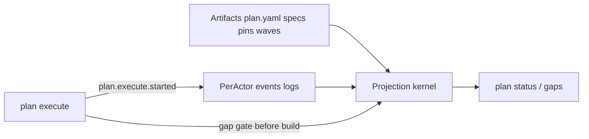

# RFC-86 Change Facts — Multi-Session Implementation Plan

> **Authoritative living plan** for implementing [RFC-86](rfc-86-change-facts.md).
> Later sessions open this file first, work only the single `next` session, then update status / discovery before finishing.
> Product contract: [`rfc-86-change-facts.md`](rfc-86-change-facts.md). Series sequencing: [`platform.md`](platform.md) § RFC-86 ∥ RFC-87.

## Non-negotiable operating rules

1. **Strict sequence.** Never start session *N+1* until session *N* is `done` and the operator has committed (or explicitly waived a commit for a docs-only/no-op).
2. **One session per agent run.** Load that session’s section, status table, Context pack code files, and every RFC subsection the session cites; do not pre-implement later sessions or substitute the digest for cited RFC text.
3. **No automated git staging/commits/pushes.** End every session with a **Commit handoff** block for the operator. Do not run `git add` / `git commit` / `git push`.
4. **Keep CI green per session.** Prefer `cargo make ci` when affordable; at minimum the session’s named gate must pass.
5. **Hard cut, no shims** (RFC D11). Temporary dual-write is allowed only inside a session (or as an explicit bridge removed by the next session). Do not leave “read old status fields forever” code.
6. **Layout stand-in (D1).** Keep today’s flat `.emery/` + root `plan.yaml` / `discovery.md` / `change.md` until RFC-88’s two-root cut. Per-actor logs live under `.emery/events/<actor>.jsonl` in this cut (not `.emery/change/events/` yet).
7. **Do not delete interim `apply`** (D27 / RFC-88). Phase B retires freeze + `build/patch.yaml` authority only.
8. **Single PR at the end** covering the full RFC. No intermediate PRs.

## Status protocol

Statuses: `pending` → `next` (exactly one) → `in_progress` → `done` | `blocked`.

When discovery forces a plan change: edit the affected future session in place, append a discovery-log entry, and keep earlier `done` sessions untouched unless a fixup session is inserted as `Sxx.1`.

### Status table

| ID | Title | Status | Gate | Commit |
| -- | ----- | ------ | ---- | ------ |
| S0 | Materialize living plan | `done` | file exists; S0=done, S1=next | `docs(rfc-86): add multi-session implementation plan` |
| S1 | Per-actor event log I/O | `done` | `cargo nextest run -p emery-project` (journal focus); lint if cheap | `feat(project): per-actor event logs with union read` |
| S2 | Retarget emit + journal show | `done` | journal/show + emit tests; `rg journal\\.jsonl` | `feat(project): route journal emit and show through per-actor logs` |
| S3 | Claim/release/retract + claim kernel | `next` | claim conflict + concurrent different-slice tests | `feat(project): exclusive per-slice claim facts` |
| S4 | In-scope predicate; retire single-active-entry | `pending` | plan validate / advance tests | `refactor(plan): retire single-active-entry; add in-scope predicate` |
| S5 | Fact-based plan status projection | `pending` | `crates/change/tests/plan_status.rs` | `feat(plan): compute plan status from artifacts and facts` |
| S6 | Writers stop mutating stored status ladders | `pending` | full_loop / refine / build / merge tests | `refactor(workflow): express advance and phase progress as facts` |
| S7 | Delete stored status/lifecycle fields | `pending` | `cargo make check` | `refactor!: remove stored plan-entry and slice lifecycle status fields` |
| S8 | Multi-actor claim/union fixtures | `pending` | new mock/change integration tests | `test(mock): multi-actor claim and fact-union fixtures for RFC-86` |
| S9 | Source cid pins at plan author | `pending` | author/reconciliation pin assertions | `feat(change): record source cid pins at plan author` |
| S10 | Refine writes base.yaml | `pending` | refine integration test asserts `base.yaml` | `feat(slice): write refine-time base.yaml pins` |
| S11 | Slice-local REQ ids + MODIFIED digests | `pending` | synthesis local-id + modified-digest tests | `feat(slice): mint slice-local requirement ids until wave commit` |
| S12 | One-member wave manifests + target.wave.opened | `pending` | wave write/load tests | `feat(project): one-member target wave manifests and open fact` |
| S13 | Build from pins; retire freeze + patch.yaml | `pending` | slice build tests + `cargo make check` affected | `feat(slice): build from recorded pins into fact-substrate records` |
| S14 | Wave commit + identity maps; keep apply | `pending` | merge identity + postflight tests | `feat(slice): commit one-member waves with requirement identity maps` |
| S15 | Pin drift diagnostics + Phase B fixtures | `pending` | new fixtures; no `patch.yaml` authority | `test(slice): pin drift and wave-commit fixtures for RFC-86 Phase B` |
| S16 | Gap inventory + shared-lead rollup | `pending` | projection tests incl. multi-homed lead | `feat(plan): typed gap inventory with shared-lead rollup` |
| S17 | Ready/Authorized + status next-actions | `pending` | plan_status + Ready/Authorized fixtures | `feat(plan): project Ready and Authorized milestones` |
| S18 | plan.execute.started + --waive CLI | `pending` | execute-start fact + waive validation | `feat(change): record plan.execute.started authorization epoch` |
| S19 | Execute gap gate before build | `pending` | gap-gate integration tests | `feat(change): enforce gap policy before build under execute epoch` |
| S20 | refine-under-epoch + shift-left fixtures | `pending` | both fixtures; CLI absence assertions | `test(change): shift-left and refine-under-epoch execute fixtures` |
| S21 | Remaining Phase C acceptance fixtures | `pending` | listed fixtures green | `test(change): RFC-86 Phase C acceptance fixtures` |
| S22 | D20 sibling docs + operator prose | `pending` | `cargo make links`; prose checklist | `docs: align operator prose with RFC-86 change facts` |
| S23 | Full cargo make ci + acceptance closeout | `pending` | `cargo make ci` | `chore: RFC-86 implementation acceptance closeout` |
| S24 | Open single full-RFC implementation PR | `pending` | PR URL returned | none (operator-directed) |

### Discovery log (append-only)

```text
### 2026-08-06 — S0
- Finding: Materialized this living plan from the Cursor seed plan; no prior `rfcs/rfc-86-implementation.md` existed.
- Plan change: none (initial write). Status: S0=done, S1=next.

### 2026-08-06 — plan wording
- Finding: Session template + risk controls could be read as forbidding RFC reads, leaving only the living-plan digest — too thin for wire-accurate implementation.
- Plan change: Session template now requires opening every cited D# / Acceptance / appendix subsection; digest marked orientation-only; RFC wins on conflict. Risk controls updated to match.

### 2026-08-06 — S1
- Finding: Primary write path is `.emery/events/<actor>.jsonl` with wire `actor` + 1-based `sequence`; default actor id is `local` when `EMERY_ACTOR` is unset. Existing `journal show` / identity readers still consume the legacy single file, so append dual-writes stamped lines to `.emery/journal.jsonl` as an explicit S1→S2 bridge.
- Plan change: none beyond status (S1=done, S2=next). S2 owns deleting the dual-write, retargeting show/emit/read_recent to `read_union`, and updating tests that open `journal.jsonl`.

### 2026-08-06 — S2
- Finding: Dual-write and legacy `path` / single-file `read` / reverse-tail helpers removed. `show`, `read_recent`, and `scan_recent` now load `read_union`. Emit already went through `append_one` — only the bridge write needed deleting. Remaining `journal.jsonl` mentions in Rust are negative assertions (file must not exist); `docs/reference/*` layout trees still name the old file and are deferred to S22 with the broader operator-prose pass.
- Plan change: none beyond status (S2=done, S3=next).
```

### Session template (copy into each agent prompt)

```text
You are implementing RFC-86 session <ID> only.
1. Read rfcs/rfc-86-implementation.md — Status table + this session’s section + Discovery log.
2. Open every RFC decision / Acceptance item / appendix subsection this session cites
   (e.g. “RFC D3”, “Acceptance #2”, “appendix wire ids”) in rfcs/rfc-86-change-facts.md.
   Read those subsections for normative detail; do not skim-substitute from the living-plan digest alone.
3. Read the Context pack source files listed for this session (code paths). Do not pre-load
   unrelated crates or later sessions.
4. Implement Deliverables to match the cited RFC wording. If the digest and RFC disagree, the RFC wins.
5. Run the named Gate.
6. Update Status table (this session → done; next → next) and Discovery log if needed.
7. Output a Commit handoff (files + suggested message). Do NOT git add/commit/push.
```

## Architecture target (what “done” means)



RFC phases map to sessions:

- **Phase A** — facts + computed status + claims (`crates/project`, then wire-through) — S1–S8
- **Phase B** — pins, waves, REQ identity, retire freeze/`patch.yaml` (`crates/slice` + pin writers) — S9–S15
- **Phase C** — epoch, gap gate, waivers, shift-left fixtures, D20 docs (`crates/change` + prose) — S16–S23

This plan is the **session schedule and progress tracker**, not a substitute product contract. Normative decisions, wire ids, coverage shapes, and acceptance criteria live in [`rfc-86-change-facts.md`](rfc-86-change-facts.md) (D1–D27, Acceptance #1–15, Appendix). Each session’s Context line cites the decisions it owns — open those subsections before coding. The condensed digest at the bottom of this file is orientation only; **RFC wording wins on conflict.**

---

## Sessions

### S0 — Materialize living plan

- **Context:** Cursor seed plan; RFC Delivery + Appendix Implementation notes.
- **Deliverables:** Write this file containing the full status table, discovery log, operating rules, and every session below (verbatim enough that later agents need only that file + the RFC).
- **Gate:** file exists; status shows `S0=done`, `S1=next`.
- **Commit handoff:** add `rfcs/rfc-86-implementation.md`. Message: `docs(rfc-86): add multi-session implementation plan`.

---

### Phase A — Fact substrate and computed status

#### S1 — Per-actor event log I/O

- **Context:** [`crates/project/src/journal.rs`](../crates/project/src/journal.rs), [`journal/append.rs`](../crates/project/src/journal/append.rs), [`journal/event.rs`](../crates/project/src/journal/event.rs), RFC D3 / layout stand-in.
- **Deliverables:**
  - Extend wire `Event` with `actor` + `sequence` (monotonic per actor file).
  - Store at `.emery/events/<actor>.jsonl`; actor id = `EMERY_ACTOR` else a stable local default (document the default in module docs).
  - Union reader (all actor files, ordered by `(timestamp, actor, sequence)`); append writes only the calling actor’s file.
  - Crate integration tests for append + union + sequence.
  - Keep old `journal.jsonl` path compiling only if still referenced; prefer introducing the new API as the primary surface this session.
- **Gate:** `cargo nextest run -p emery-project` (or package name in tree) focused on new journal tests; `cargo make lint` if cheap.
- **Commit:** `feat(project): per-actor event logs with union read`.

#### S2 — Retarget emit + `journal show`

- **Context:** [`journal/emit.rs`](../crates/project/src/journal/emit.rs), [`journal/handlers.rs`](../crates/project/src/journal/handlers.rs), all `journal::emit*` / `append` call sites, transport CLI for `journal show`.
- **Deliverables:** Every write goes to per-actor logs; `emery journal show` merges the union; delete single-file `.emery/journal.jsonl` authority; update tests that open `journal.jsonl`.
- **Gate:** journal/show + emit integration tests green; spot-check `rg journal\\.jsonl`.
- **Commit:** `feat(project): route journal emit and show through per-actor logs`.

#### S3 — Claim / release / retract events + claim kernel

- **Context:** [`journal/event.rs`](../crates/project/src/journal/event.rs), RFC D7 / D23; plan advance/undo surfaces.
- **Deliverables:**
  - New events: slice claim, release, `fact.retracted` (exact wire ids per RFC appendix).
  - Pure claim kernel: at most one live claim per slice; `slice-claim-conflict` on same-slice second actor; different slices may be claimed concurrently.
  - Unit-cheap private matrix OK; public behavior via `crates/project/tests/`.
- **Gate:** claim conflict + concurrent different-slice tests.
- **Commit:** `feat(project): exclusive per-slice claim facts`.

#### S4 — In-scope predicate + retire plan-wide single-active-entry

- **Context:** [`plan/validate.rs`](../crates/project/src/plan/validate.rs) `single_in_progress`, [`plan/advance.rs`](../crates/project/src/plan/advance.rs) `next_eligible`, RFC D23 / D24.
- **Deliverables:** Shared `in_scope(plan, slice_meta) = on plan && not dropped`; remove plan-wide single-active gate from validate/advance; exclusivity is claims only. Update validate diagnostics/tests.
- **Gate:** plan validate / advance tests updated and green.
- **Commit:** `refactor(plan): retire single-active-entry; add in-scope predicate`.

#### S5 — Projection kernel reads facts (stop trusting stored status for status CLI)

- **Context:** [`plan/status/project.rs`](../crates/project/src/plan/status/project.rs), [`plan/execution.rs`](../crates/project/src/plan/execution.rs), RFC D2.
- **Deliverables:** Rewrite `plan status` / `resolve_entry` to compute progress from artifacts + fact union (claims, refine/build/merge facts). May still *write* old status fields for one more session, but projection must not *read* them. Project familiar next-actions where possible.
- **Gate:** [`crates/change/tests/plan_status.rs`](../crates/change/tests/plan_status.rs) green under fact-based projection.
- **Commit:** `feat(plan): compute plan status from artifacts and facts`.

#### S6 — Writers stop mutating stored status ladders

- **Context:** advance/undo handlers, refine/build/merge orchestrations, [`slice/lifecycle.rs`](../crates/project/src/slice/lifecycle.rs).
- **Deliverables:** `plan advance` / `undo` become claim/retract facts; refine/build/merge append phase facts only — no `Entry.status` / `LifecycleStatus` transitions as authority. Bridge: if fields still exist on disk, leave them unused or stop serializing writes.
- **Gate:** full_loop / refine / build / merge integration tests adjusted.
- **Commit:** `refactor(workflow): express advance and phase progress as facts`.

#### S7 — Delete stored status fields (hard cut)

- **Context:** [`plan/model/state.rs`](../crates/project/src/plan/model/state.rs) `Entry.status`, slice `metadata.yaml` lifecycle field, all serde/tests/probe assertions.
- **Deliverables:** Remove stored status / lifecycle-as-authority from types and on-disk shapes; ladders remain projection labels only. Fix compile breaks across workspace. Update goldens/fixtures.
- **Gate:** `cargo make check` (fmt/lint/test/doc subset) green.
- **Commit:** `refactor!: remove stored plan-entry and slice lifecycle status fields`.

#### S8 — Phase A multi-actor fixtures

- **Context:** [`crates/mock`](../crates/mock), RFC Acceptance #2; platform.md slack absorber note.
- **Deliverables:** Two-actor fixtures: disjoint slice claims + refine after fact-tree union; same-slice → `slice-claim-conflict`; no Git metadata required; no plan-wide single-active assumption.
- **Gate:** new mock/change integration tests green.
- **Commit:** `test(mock): multi-actor claim and fact-union fixtures for RFC-86`.

---

### Phase B — Pins, waves, identity, stand-in retirement (D27)

#### S9 — Source `cid` pins at plan author (in-place)

- **Context:** author/survey path, `SourceBinding` / discovery, RFC D4 / D25; [`project::snapshot::SnapshotId`](../crates/project/src/snapshot.rs).
- **Deliverables:** When the in-place source set closes during `plan author`, record per-source tree `cid` (`SnapshotId` on wire as `cid`). Exact YAML home is an implementation detail — prefer plan/discovery-adjacent structured pin data, not ambient paths.
- **Gate:** author/reconciliation tests assert pins present after author.
- **Commit:** `feat(change): record source cid pins at plan author`.

#### S10 — Refine writes `base.yaml`

- **Context:** [`crates/slice/src/orchestrate/refine.rs`](../crates/slice/src/orchestrate/refine.rs), RFC D4 / D25.
- **Deliverables:** Before extract, assemble `base.yaml` from plan source pins + baseline-spec digest. Validate later sessions add drift; this session owns writer + shape tests.
- **Gate:** refine integration test asserts `base.yaml`.
- **Commit:** `feat(slice): write refine-time base.yaml pins`.

#### S11 — Slice-local requirement IDs + MODIFIED digests

- **Context:** [`crates/slice/src/synthesis/project.rs`](../crates/slice/src/synthesis/project.rs) `IdAllocator`, RFC D5.
- **Deliverables:** Mint slice-scoped ids at synthesize; each `MODIFIED` records digest of baseline body changed. No baseline `REQ-NNN` assignment yet (wave commit does that).
- **Gate:** synthesis tests for local ids + modified digests.
- **Commit:** `feat(slice): mint slice-local requirement ids until wave commit`.

#### S12 — One-member target wave types + `target.wave.opened`

- **Context:** RFC D9; new module under `crates/project` or `crates/slice` for wave manifests at `targets/<target>/waves/<digest>.yaml` under the change stand-in root (document path: `.emery/targets/...` for this cut).
- **Deliverables:** Wave manifest schema (one member); write-before-build helper; append `target.wave.opened`. Not yet wired into full build orchestration if S13 owns the wire-up — prefer types + persistence + tests here, wire in S13 if smaller.
- **Gate:** wave write/load tests.
- **Commit:** `feat(project): one-member target wave manifests and open fact`.

#### S13 — Build: recorded pin, no freeze, fact-substrate build records (D27)

- **Context:** [`crates/slice/src/orchestrate/target.rs`](../crates/slice/src/orchestrate/target.rs), Workspaces seam, RFC D27.
- **Deliverables:** Delete build-start `seam.freeze()`; `prepare` from recorded base pin; open one-member wave; persist content-addressed build record (retire `build/patch.yaml` as authority); “built” projects from records + wave facts. Update probe/full_loop assertions that require `patch.yaml`.
- **Gate:** slice build tests + `cargo make check` for affected crates.
- **Commit:** `feat(slice): build from recorded pins into fact-substrate records`.

#### S14 — Merge: wave commit, identity maps, keep interim `apply`

- **Context:** [`crates/slice/src/orchestrate/merge.rs`](../crates/slice/src/orchestrate/merge.rs) (+ merge engine), RFC D5 / D9 / D27.
- **Deliverables:** Revalidate wave; assign baseline `REQ-NNN`; record identity maps on `target.merge.wave-committed`; postflight succeeded / postflight-failed facts; still call interim `apply` from recorded result. Reject drifted `MODIFIED`. Failures before commit fact ⇒ not merged.
- **Gate:** merge identity + postflight tests; no `apply` deletion.
- **Commit:** `feat(slice): commit one-member waves with requirement identity maps`.

#### S15 — Pin drift diagnostics + Phase B acceptance fixtures

- **Context:** validate rules; RFC Acceptance #3–4; appendix pin/build-record fixture.
- **Deliverables:** `slice-base-drifted` / `slice-evidence-stale` (and merge block `merge-base-drifted` as needed); end-to-end pin→build-record→wave-commit fixture; “built”/“merged” never from leftover path checks.
- **Gate:** new fixtures green; `rg build/patch.yaml` only in historical comments/RFC if unavoidable — not as authority.
- **Commit:** `test(slice): pin drift and wave-commit fixtures for RFC-86 Phase B`.

---

### Phase C — Authorization epoch, gaps, shift-left, docs

#### S16 — Gap inventory projection (+ shared-lead rollup)

- **Context:** spec/model requirement statuses; RFC Gaps / D18 / D19 / D24.
- **Deliverables:** Pure projection: in-scope rows `(slice, req, status)` for `unknown|conflict|divergence`; presentation rollup by contributing `(source, lead)` with suggested re-refine selectors. Surface via `plan status` and optional read-only `plan gaps` (ship `plan gaps` if cheap — preferred).
- **Gate:** projection tests including multi-homed lead rollup; dropped slices excluded.
- **Commit:** `feat(plan): typed gap inventory with shared-lead rollup`.

#### S17 — Ready vs Authorized + status next-actions (D22 / D26)

- **Context:** status projector; RFC Progress / D22 / D26.
- **Deliverables:** Project Ready (clean gaps only) and Authorized (covering epoch — none yet until S18); post-author resume stays `plan execute` / `/emery:execute`; next-actions may name `slice refine <slice>` / review-gaps / execute `--waive…`. Never project `approved`.
- **Gate:** [`plan_status.rs`](../crates/change/tests/plan_status.rs) + Ready/Authorized fixtures (Authorized may be deferred assertion until S18 if epoch absent).
- **Commit:** `feat(plan): project Ready and Authorized milestones`.

#### S18 — `plan.execute.started` + `--waive` CLI

- **Context:** [`crates/change/src/orchestrate/execute.rs`](../crates/change/src/orchestrate/execute.rs), transport clap for `plan execute`, RFC D6 / D17.
- **Deliverables:** At execute start, append `plan.execute.started` with `closed-plan` coverage (`plan-digest`, per-leaf `existing{digest}|refine-under-epoch`, optional `unknown-waivers`). CLI: repeatable `--waive <slice>/<req>` + required `--reason`. Errors: `plan-waiver-invalid`, later `plan-epoch-stale`. No `plan approve` / `plan refine` verbs.
- **Gate:** execute-start fact fixture; waive validation tests.
- **Commit:** `feat(change): record plan.execute.started authorization epoch`.

#### S19 — Execute gap gate before build

- **Context:** execute loop; gap projection; RFC D13 / D15–D17.
- **Deliverables:** Before build: block on conflict (never waiveable); block on unknown unless matching waiver on covering epoch; list divergence. Refuse build when epoch stale vs covered artifacts (`plan-epoch-stale`). Print inventory on failure.
- **Gate:** gap-gate integration tests (conflict, unknown, waive, stale).
- **Commit:** `feat(change): enforce gap policy before build under execute epoch`.

#### S20 — `refine-under-epoch` path + shift-left happy path fixture

- **Context:** execute orchestration; RFC D12 / D14; Acceptance #5–6.
- **Deliverables:** Coverage may authorize refine-before-build for unspec’d leaves; preferred-path fixture: author → `slice refine` → gaps → execute (build/merge only). Under-epoch fixture: execute → refine → gap gate → build. Confirm no `plan refine` / `plan approve` subcommands.
- **Gate:** both fixtures green; CLI absence assertions.
- **Commit:** `test(change): shift-left and refine-under-epoch execute fixtures`.

#### S21 — Phase C remaining fixtures (in-scope drop, coverage shape, waves under execute)

- **Context:** RFC Acceptance #8–15; appendix test list leftovers.
- **Deliverables:** Dropped-slice in-scope fixture; coverage payload shape + stale-epoch; wave opened before build under execute; Ready skipped when waiving; post-author resume naming.
- **Gate:** listed fixtures green.
- **Commit:** `test(change): RFC-86 Phase C acceptance fixtures`.

#### S22 — D20 sibling consistency + operator prose

- **Context:** `AGENTS.md`, [`docs/standards/workflow.md`](../docs/standards/workflow.md), CLI help strings, skill wrappers if they claim “nothing is stamped”; skim series RFCs for leftover `plan approve` / `approved` / invented `plan refine`.
- **Deliverables:** Update shipped prose for durable `plan.execute.started`, gap gate, claims, computed status, pins/waves at the depth operators need. Do not cascade-rewrite unrelated RFC-88 design. Bump RFC-86 status line when acceptance is met.
- **Gate:** `cargo make links`; prose review checklist in session output.
- **Commit:** `docs: align operator prose with RFC-86 change facts`.

#### S23 — Full CI + acceptance checklist closeout

- **Context:** living plan acceptance checklist vs RFC Acceptance #1–15.
- **Deliverables:** Run `cargo make ci`; fix stragglers only (no new scope). Mark all sessions done; fill acceptance checklist in living plan; note PR-ready.
- **Gate:** `cargo make ci` green.
- **Commit:** `chore: RFC-86 implementation acceptance closeout` (or fold fixes into focused commits if CI failures span areas — still operator-committed).

#### S24 — Open the implementation PR (operator-directed)

- **Context:** full branch diff vs base; living plan; RFC.
- **Deliverables:** Operator (or agent **only when explicitly asked**) pushes branch and opens one PR: full RFC-86 implementation. PR body maps Phases A/B/C + acceptance checklist. **Still no commits invented by the agent unless the operator asks.**
- **Gate:** PR URL returned.
- **Commit:** none expected unless CI fixups requested.

---

## Acceptance checklist (product-level; fill at S23)

Track against RFC Acceptance #1–15. Leave unchecked until S23 closeout proves each item.

- [ ] #1 Progress is always computed from artifacts and facts — never a stored status field.
- [ ] #2 Multi-slice, multi-actor claims: disjoint refine after fact union; same-slice → `slice-claim-conflict`; no Git metadata; no plan-wide single-active-entry.
- [ ] #3 Two slices merge without REQ-id collision; drifted `MODIFIED` rejected; identity maps on `target.merge.wave-committed`.
- [ ] #4 Pins + build records: `base.yaml`; build from recorded pin (no freeze); fact-substrate build records (no `patch.yaml` authority); pin-drift diagnostics; interim `apply` may remain.
- [ ] #5 Shift-left practice: author does not refine; specs via `slice refine`; no `plan refine` CLI; under-epoch still allowed with gap gate on build.
- [ ] #6 Gap gate: unknown blocks (or waive); conflict never waiveable; divergence listed/allowed; no silent waive.
- [ ] #7 No topology-approve verb; refine not gated on topology approval.
- [ ] #8 Authorization epoch: every execute path appends `plan.execute.started` at start; no `plan approve` / `approvals/` / projected `approved`.
- [ ] #9 Same verbs/artifacts for solo laptop and directory-exchange collaboration.
- [ ] #10 Human prose review outside engine; gap gate is typed statuses only.
- [ ] #11 Shared-lead rollup is presentation only; waivers stay per-req.
- [ ] #12 Ready (clean gaps) vs Authorized (covering epoch); waivers skip Ready; no `approved` milestone.
- [ ] #13 In-scope = on plan and not dropped — shared by gaps / Ready / execute / unrefined next-actions.
- [ ] #14 Post-author resume names `plan execute` / `/emery:execute`; status may suggest `slice refine`.
- [ ] #15 One-member target waves: open before build; wave-committed; postflight non-rollback.

---

## Commit handoff format (required session output)

```markdown
## Commit handoff (operator)
**Do not auto-commit.** Suggested:

git add <paths>
git commit -m "$(cat <<'EOF'
<type>(scope): <why>

EOF
)"

### Files
- …

### Gate results
- …

### Living plan
- Status: Sxx done; Sy next
```

## Risk controls for context limits

- Each session lists a **Context pack** ≤ ~8 code files plus the RFC subsections it cites. **Must** open every cited D# / Acceptance / appendix subsection before implementing. **Must not** re-read the entire RFC every session, invent wire shapes from the digest, or treat Deliverables bullets as complete without the cited RFC text.
- Prefer crate-local `nextest` filters before full `cargo make ci` (S23 owns full CI).
- If a session discovers >1 session of work: stop, split into `Sxx` + `Sxx.1` in the living plan, mark current `blocked` or finish a thin vertical slice, and hand off — do not silently expand scope mid-session.
- Merge orchestration is a collision point with future RFC-88 work — finish S12–S14 before any parallel RFC-88 merge edits.

## Explicit exclusions

- No `emery plan approve` / `emery plan refine` verbs.
- No `.emery/change/` two-root migration (RFC-88).
- No deletion of Workspaces `apply`.
- No adapter Evidence schema changes.
- No automated `git add` / `git commit` / `git push` in Sessions S0–S23.
- No intermediate PRs.

## Implementation notes (RFC appendix — digest for implementers)

Orientation only — condensed from RFC-86 Appendix: Implementation notes. **Not normative.** Before coding a session, open the cited D# / Acceptance / appendix text in [`rfc-86-change-facts.md`](rfc-86-change-facts.md); that document wins on any conflict with this digest or with abbreviated Deliverables bullets.

**Already landed (RFC-87) — consume, do not reinvent**

- Value vocabulary: `project::snapshot::{SnapshotId, CodePatch}` (`sha256:…`; wire name `cid`).
- Workspace capability: `project::seam::Workspaces` — `freeze` / `prepare` / `capture` / `discard` / interim `apply`.
- Build today: freeze ambient tree; write `.emery/slices/<slice>/build/{request,report,patch}.yaml`. Phase B (D27): delete freeze; recorded pin; fact-substrate build records; one-member wave before build.
- Merge today: load `build/patch.yaml`, interim `apply`. Phase B: load from build record / wave; still call interim `apply` until RFC-88 deletes it.

**Layout and writers**

- Projection kernel in `crates/project`: facts + artifacts → status, gaps, Ready, Authorized, claims. Shared in-scope filter (D24). Ready is clean-gap only (D22).
- Replace `.emery/journal.jsonl` with `.emery/events/<actor>.jsonl` (stand-in path this cut); `journal show` merges the union.
- Remove stored plan-entry `status` and slice lifecycle fields; retire plan-wide single-active-entry.
- No `approvals/` tree. `plan.execute.started` carries typed `closed-plan` coverage.

**Pins, waves, and identity**

- Source `cid` pins close at plan author (in-place). Refine assembles `base.yaml` before extract. Build reads recorded pin into `prepare`.
- Waves at `.emery/targets/<target>/waves/<digest>.yaml` this cut; events `target.wave.opened`, `target.merge.wave-committed`, postflight succeeded / postflight-failed.
- Synthesis: slice-local ids until wave commit; `MODIFIED` digests; reject drift at commit.

**Author, refine, and execute**

- No `plan refine` / `plan approve`. Execute records epoch at start; gap gate before build; claims never authorize.
- Diagnostics (exit 2): `plan-gaps-unresolved`, `plan-epoch-stale`, `plan-waiver-invalid`, `slice-claim-conflict`, plus pin/merge drift codes. No topology-approval diagnostics; no “another slice already claimed.”

**Hard cut**

- Pre-1.0: re-init over migration; no shims for old status fields, single journal, plan-wide single-active-entry, global synthesize-time ids, plan `approve`/`refine` verbs, projected `approved`, ambient freeze once pins exist, or `patch.yaml` authority once fact-substrate records exist.
