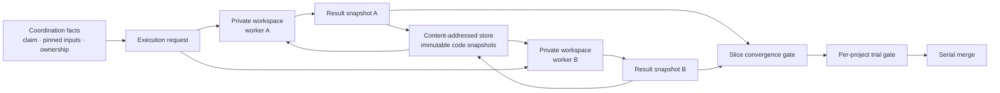

# RFC-87: Private Workspaces

> Status: Implemented foundation of the [Services Delivery Programme](platform.md). [RFC-86](rfc-86-change-facts.md) Phase B retired the interim build-time ambient freeze and slice-local `build/patch.yaml`; recorded `base.yaml` pins and content-addressed `builds/<digest>.yaml` records are the authority. The remaining interim is merge-time `apply` (deleted by [RFC-88](rfc-88-detached-changes.md)). [RFC-104](rfc-104-system-archaeology.md) uses D2's read-only values for location-backed definition sources. RFC-88 consumes those pins and separately amends D4 and acceptance criterion 4 to admit each target repository's durable state into the tree; binding and plan artifacts name the tree identity a **CID** (`SnapshotId` is that value).
>
> Deployment note (post-implementation): the workspace kernel (`project::workspace`) is wasm-clean engine library code, not a host capability. The former five-op `emery:workspaces` WIT import is deleted; the shipped deployment's guest runs the kernel in-guest — tree I/O over its filesystem preopens, snapshot objects through the standard `wasi:blobstore` import (the omnia-backends filesystem backend at the snapshots root), and executable bits through the two-function `emery:exec-bits` capability (`wasi:filesystem` carries no permission bits). The host contract shrank from workflow semantics to blob storage plus exec bits; native deployments call the same kernel in-process. Digest identity is deployment-independent by the canonical manifest encoding. The blobstore backend is filesystem-backed, not in-memory, because snapshot objects must survive across separate CLI invocations — every `emery` run is a fresh process, and a stopped `emery plan execute` resumes in a later process against the pins its refine phase recorded (`base.yaml`, `builds/<digest>.yaml`, plan CIDs); RFC-95/96/100 then consume the same snapshots for publication, distribution, and transport. Snapshot lifetime is scoped to the change: `plan archive` is the collection point that sweeps objects whose GC roots belong only to the archived plan (D2).
>
> Owns: materializing an immutable code snapshot into a private workspace, granting separate read-only artifact access, capturing the resulting code snapshot and touched paths, and discarding the workspace.
>
> Depends on completed [RFC-86](rfc-86-change-facts.md), which records pinned inputs and coordination facts. Later RFCs own verification, composition, transport, and publication.

## Intent

A work directory is disposable execution machinery, never workflow state. Durable code state consists only of immutable snapshots.

Before this RFC, build and merge wrote the operator's checkout. That ambient mutable directory cannot safely support concurrent workers or remote nodes. RFC-87 replaces it with one location-neutral contract:

```text
prepare(repository, base snapshot, access manifest) → private workspace
capture(workspace) → code patch { base snapshot, result snapshot, touched paths }
discard(workspace)
```

The same contract serves one slice on one desktop and many workers across many nodes. Deployment changes where snapshots are stored and where workspaces are prepared; workflow semantics do not change.

## Model



Four nouns are sufficient:

- **Snapshot** — the immutable identity of a complete product-code tree.
- **Workspace** — a private, mutable materialization of one snapshot for one execution.
- **Code patch** — the immutable relation `{ base snapshot, result snapshot, touched paths }`; there is no separately encoded patch blob.
- **Access manifest** — the writable code scope and read-only artifact roots supplied by the caller.

Snapshots are logically complete trees. A store may transfer and retain only missing objects, so physical storage remains incremental without making a diff format part of the workflow contract.

## Decisions

### D1 — Workspaces are private and disposable

Every execution receives a fresh workspace. No two executions share a writable directory. Exclusivity follows from construction, not from a persisted hold, lease, or workflow lock.

`discard` removes the workspace. A deployment may retain a failed workspace briefly for debugging, but retention is local policy: the directory cannot be resumed, reassigned, or referenced as workflow state.

### D2 — Snapshots are the durable code value

`prepare` accepts an exact base snapshot. `capture` records a result snapshot and derives touched paths by comparing the two trees. Facts and build records reference snapshot identities, never workspace paths.

`capture` stores and verifies every object needed to materialize the result before returning `{ base snapshot, result snapshot, touched paths }`. It creates no Git commit, branch, completion fact, or publication event; the caller records completion only after capture succeeds.

A read-only source view is the same preparation with an empty writable scope; it is discarded without capture. There is no second source-copy model. [RFC-88](rfc-88-detached-changes.md) binds every source pin to this path: a source's resolved value is an ordinary CID (this RFC's snapshot identity), and `capture`'s refusal on a read-only workspace is what makes "a source is never captured" structural.

For Git repositories, the local provider may use Git's object database and worktree machinery. That is an implementation and cache strategy, not an authority boundary.

### D3 — A code patch is base plus result

The code patch contains the base snapshot id, result snapshot id, and derived touched paths. Binary files, deletes, modes, and symlinks are properties of the two trees; RFC-87 defines no binary-patch serialization.

[RFC-96](rfc-96-concurrent-execution.md) owns deterministic composition of same-base results. [RFC-100](rfc-100-distributed-execution.md) owns transport of the referenced snapshot objects.

### D4 — Code and change artifacts stay separate

A snapshot is one project repository tree: product code plus the repository's own durable Emery state — `project.yaml`, the `specs/` baseline, and `decisions/`. Change artifacts are what stays out. Plans, slice specs, designs, tasks, Evidence, facts, and build records live in the change home, are granted as explicit read-only inputs, and are never copied into the workspace or captured in its result snapshot.

[RFC-88](rfc-88-detached-changes.md) amends this decision, which originally excluded all of `.emery/`, and fixes the tree boundary as `.git` plus the change home when nested. The exclusion was safe only while every operation ran in the operator's checkout, where the baseline had somewhere else to live; a detached change has no such place, and a sealed commit whose tree omitted the baseline would silently drop every merged spec.

The caller authors the access manifest, but the touched paths derived by `capture` are the authoritative record of what changed. RFC-87 enforces the grants and reports that record; it does not decide how work is partitioned or how an overlap is repaired.

### D5 — Failure retries from immutable inputs

A failed or interrupted execution does not require workspace recovery. Re-entry prepares a new workspace from the recorded base snapshot and reruns the operation. Orphaned directories are garbage-collected.

Completed result snapshots remain available by digest even after their workspace is discarded.

### D6 — Stores and caches are deployment details

The host provides a content-addressed snapshot store and local workspace root. A desktop may back both with local Git objects under `$EMERY_HOME`; a fleet may fetch missing objects from a remote value store. Neither location appears in Emery artifacts or changes the contract.

The operator's checkout is never a workspace, cache, or merge target.

### D7 — Coordination stays outside RFC-87

[RFC-86](rfc-86-change-facts.md) supplies claims, pinned inputs, `plan.execute.started`, and result facts. [RFC-96](rfc-96-concurrent-execution.md) supplies target-proposed task decomposition, write ownership, and convergence. [RFC-100](rfc-100-distributed-execution.md) supplies placement, fencing, and transport. [RFC-95](rfc-95-publication-sets.md) seals each final project snapshot into a commit and supplies branches, pull requests, and publication verification.

RFC-87 consumes an execution request and returns an immutable code result. It owns no scheduler, lifecycle status, branch, or publication operation.

### D8 — Hard cut

`WorkingTree::live()`, operator-checkout writes, persistent holds, tree recovery, dirty-tree lifecycle states, stored patch blobs, and workspace-layer branch commits are removed rather than adapted. Callers use `prepare` / `capture` / `discard`; RFC-95 owns the one final project seal.

The interim `apply`, which writes an accepted patch's touched paths onto an ambient product tree, is a stand-in for that completion. [RFC-88](rfc-88-detached-changes.md) deletes it: once the baseline folds inside a workspace, the accepted project snapshot is the whole result and there is nothing left to write back.

## Fixed implementation cut

- Replace the ambient `WorkingTree::live()` capability with the three-operation workspace capability.
- Capture a snapshot of the complete result tree and derive touched paths against the requested base.
- Give the agent one writable code root plus explicit read-only artifact roots.
- Keep local snapshot objects and workspaces under host-owned storage; persist no workspace path.
- Discard on completion and garbage-collect abandoned workspaces.
- Leave verification, code-patch composition, remote transport, project sealing, and publication to their owning RFCs.

## Acceptance criteria

1. `prepare` materializes the exact requested snapshot into a fresh private workspace without touching the operator's checkout.
2. Two executions over the same base receive different writable directories and can run concurrently.
3. `capture` round-trips additions, edits, deletes, empty files, binaries, modes, and symlinks as a result snapshot and reports the exact touched paths.
4. Change artifacts are readable through separate grants and absent from the captured result, while the project's own durable state — baseline, decisions, `project.yaml` — round-trips inside the snapshot (amended by RFC-88).
5. Discarding or losing a workspace does not lose any completed result and requires no recovery protocol; retry starts from the recorded base.
6. The same snapshot and code-patch identities materialize to byte-identical trees through local and remote store bindings.
7. No operator checkout, persistent hold, patch blob, workspace path, or publication branch is part of the RFC-87 contract.

## Rejected alternatives

- **Shared writable trees or network filesystems** — couple workers through mutable location and locking.
- **Recoverable long-lived workspaces** — turn disposable execution state into a second lifecycle.
- **Binary patch blobs as the durable value** — add an encoding contract when the base and result trees already define the delta.
- **CRDT file synchronization** — solves live co-editing that Emery's round-boundary workflow does not permit.
- **Writing the operator's checkout or publication branch** — crosses the workspace boundary into merge and publication.
