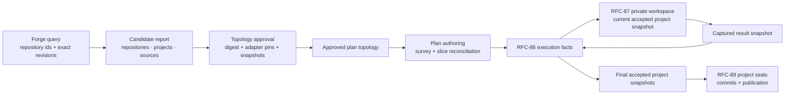

# RFC-88 Architecture Review

> Status: Review notes — recommendations to resolve before rewriting [RFC-88](rfc-88-detached-changes.md) in the concise style of [RFC-87](rfc-87-working-trees.md).
>
> Scope: Architecture and implementation-contract review only. This document is not an RFC and changes no accepted decision by itself.

## Summary

RFC-88's central direction should remain: the change replaces the permanent platform repository as the coordination home; repositories are discovered and pinned before plan authoring; product code is materialized only in disposable RFC-87 workspaces; forge access is a host capability rather than an adapter axis; and greenfield repositories require an explicit approval-gated operation.

The current draft is not ready for a prose-only rewrite. It conflates repositories with target projects, Git revisions with RFC-87 snapshots, topology approval with RFC-86 plan approval, and the initial project base with its evolving accepted result. It also claims a complete publication loop before RFC-89 creates a committable result. The recommendations below separate those contracts.

## Recommendation index

| ID | Priority | Recommendation | Depends on |
| -- | -------- | -------------- | ---------- |
| R1 | Required | Separate repositories, target projects, and source bindings | — |
| R2 | Required | Record forge identity, forge revision, and RFC-87 snapshot separately | R1 |
| R3 | Required | Project the evolving accepted snapshot for each target project | R1, R2 |
| R4 | Required | Introduce an explicit per-project execution context | R1–R3 |
| R5 | Required | Separate topology approval from RFC-86 plan approval | — |
| R6 | Required | Anchor the candidate digest and persist topology judgment artifacts | R5 |
| R7 | Recommended | Move repository discovery under `emery change` | — |
| R8 | Required | Decouple project discovery from source-adapter inference | R1 |
| R9 | Required | Inject a versioned discovery catalog and pin selected adapters | R2 |
| R10 | Required | Specify greenfield creation as a recoverable saga, not an atomic write | R5, R6 |
| R11 | Required | Choose one detached fact-tree layout | — |
| R12 | Required | End RFC-88 at accepted snapshots and leave project sealing to RFC-89 | R3 |
| R13 | Recommended | Centralize generated identities and import detached local sources | R1, R2 |
| R14 | Recommended | Add scalable membership lookup and bounded untrusted-tree reads | R8 |
| R15 | Recommended | Narrow durability and portability claims | R2, R11, R12 |

The minimum coherent architectural set is R1–R6, R8–R12. Omitting one of those leaves either the plan graph, execution base, approval gate, or RFC boundary ambiguous.

## R1 — Separate repositories, projects, and sources

### Problem

The draft's `projects` map contains both target-capable Emery projects and read-only legacy repositories. A source binding then points to `project:`, even when that row is not a project that can own a slice. This makes “member,” “project,” and “repository” context-dependent and forces RFC-89 to infer publication eligibility from optional fields.

It also couples project membership to source-adapter eligibility. A repository with no matching first-party source adapter can still be a valid target project. For example, the absence of a Rust source adapter must not exclude an existing Rust repository from an Omnia change.

### Recommendation

Use three typed maps:

```yaml
repositories:
  legacy-orders:
    forge: github
    repository-id: R_kgDOExample
    locator: github.com/acme/legacy-orders
    forge-revision: 7b6e...
    snapshot: sha256:2da9...

projects:
  orders-api:
    repository: orders-api-repository
    products: [orders]
    target:
      adapter: emery:omnia@1.2.0
      component-digest: sha256:94b1...
      platforms: [core]

sources:
  legacy-orders:
    adapter: emery:typescript@1.1.0
    repository: legacy-orders
    path: .
```

`repositories` is the location and immutable-input layer. `projects` contains only target-capable product members. `sources` may bind any repository or an imported value/tree. Only `projects` may be referenced by `slices[].project`; RFC-89 derives publication members from the target projects actually referenced by slices.

### RFC effect

Replace the current optional-target project row and `SourceBinding.project` with an explicit repository reference. Use **repository** for a forge-hosted tree, **project** for a target-capable Emery product member, and **publication member** for a project referenced by at least one slice.

## R2 — Separate forge identity, forge revision, and snapshot identity

### Problem

RFC-88 uses `revision` for a Git commit while RFC-87 and the WIT workspace capability use revision for a content-addressed complete product tree. The adapter-selection fingerprint is a third identity. These values have different authority and recovery semantics.

A canonical repository locator is also insufficient as durable identity because repositories can be renamed or transferred.

### Recommendation

Record four distinct values:

- **Repository id** — forge-issued immutable identity, authoritative across rename.
- **Locator** — canonical human-readable forge location.
- **Forge revision** — exact Git commit approved as the initial repository base.
- **Snapshot id** — RFC-87 content-addressed product tree used by every Emery operation.

The selection fingerprint, if retained, is discovery-only and never acts as an execution pin. Approval reads the exact forge revision, ingests it through the RFC-87 snapshot policy, and records the resulting snapshot. A moved default branch does not invalidate the approved commit; movement may produce an informational freshness finding, while an unavailable approved commit is an error.

Derive adapter-selection features from the RFC-87 snapshot manifest so discovery and execution share path normalization, symlink policy, and ignored-tree rules.

### RFC effect

Replace every ambiguous `revision` field with `forge-revision` or `snapshot`. Generated repository identities should hash the immutable repository id, not the mutable locator.

## R3 — Project the evolving accepted project snapshot

### Problem

The approved repository snapshot is only the initial base. If several slices target one project, later slices must consume accepted results from earlier slices. Preparing every operation from the approval-time revision would discard or conflict with preceding work.

### Recommendation

Define one project-head projection:

```text
approved initial project snapshot
    + successful slice result facts in dependency/merge order
    → current accepted project snapshot
```

Each build fact records the exact base and result snapshots. Each successful merge advances the projected accepted snapshot for that project. `plan.yaml` remains immutable topology and records only the initial approved snapshot; no mutable project-head field is stored.

### RFC effect

State explicitly that approval pins the initial base, while operation dispatch resolves the current accepted snapshot from RFC-86 facts. RFC-89 seals that final accepted snapshot against the approved forge revision.

## R4 — Introduce a per-project execution context

### Problem

Current orchestration has one project root. In detached mode the invoked root is the change repository, while product code belongs to a selected project snapshot. Without an explicit split, build or merge can freeze or write the coordination tree.

### Recommendation

Resolve every code-touching operation into:

```text
project key
→ repository
→ current accepted snapshot
→ writable RFC-87 product workspace
  + read-only change artifacts
  + read-only pinned project baseline
```

The change root remains the only location for plans, facts, Evidence, specs, designs, tasks, and reports. The product workspace contains product code only. Source survey/extract use the same preparation contract with an empty writable scope.

### RFC effect

Add a short execution-request contract and replace “survey, build, and merge prepare workspaces” with “every operation that reads a repository tree resolves a recorded repository snapshot and receives the access appropriate to that operation.”

## R5 — Separate topology approval from plan approval

### Problem

The draft calls `emery change approve` the only approval surface but later says `plan execute` remains approval of the authored plan. RFC-86 separately defines a recorded plan approval artifact.

These gates approve different subjects:

- Repository membership, source bindings, adapter resolutions, and greenfield side effects.
- Authored slices and optionally refined specs.

### Recommendation

Define two approval facts:

1. **Topology approval** covers the candidate digest and resolved repositories, projects, sources, snapshots, and adapter pins. It is required before plan authoring.
2. **Plan approval** is RFC-86's artifact over the current plan digest and any spec digests in scope. It is required before execution.

Interactive `plan execute` may retain RFC-86's plan auto-approval behavior. It must never approve topology or repository creation.

### RFC effect

Remove “the only approval surface” and “running execute remains approval of the fully authored plan.” Use **topology approval** and **plan approval** consistently.

## R6 — Anchor the candidate digest and persist judgment artifacts

### Problem

Approval cannot detect a semantically valid edit if it merely computes and records the digest of the current `candidate.yaml`. The expected digest must be fixed before approval. The topology judgment also conflicts with RFC-86's rule that judgment outputs are persisted and pinned: the draft retains only `topology-answer-digest`.

### Recommendation

Discovery prints the candidate digest and exact approval command:

```text
emery change approve --digest sha256:...
```

Approval requires the supplied digest to match the canonical typed candidate document. The topology judgment's typed request and raw schema-valid response are persisted as digest-identified discovery artifacts; `candidate.yaml` is the normalized review projection over them.

Canonical digest input must use a versioned normalized representation with sorted maps and unknown fields rejected. It must not depend on YAML presentation.

### RFC effect

Make the digest an approval token rather than a value first introduced by approval. Add topology request/response artifacts to the detached fact tree.

## R7 — Move repository discovery under `emery change`

### Problem

`emery source discover` discovers repositories, product membership, target topology, and greenfield projects. That is change intake, not a source-adapter operation. It also creates a naming collision with the existing `discovery.md` lead inventory produced by source `survey`.

### Recommendation

Use:

```text
emery change open
emery change discover
emery change approve
```

Reserve `emery source` for source adapter resolution, survey, and extraction.

### RFC effect

Rename the command and describe two separate phases: **repository discovery** before topology approval and **lead survey/reconciliation** during plan authoring.

## R8 — Decouple project discovery from source inference

### Problem

The draft effectively assigns one inferred source adapter to a repository and may exclude the repository on no match. Real repositories can contain several source roots, and project membership does not imply source eligibility.

The explicit override suggested by `source-adapter-ambiguous` is also missing for forge-discovered repository paths; the current keyless `--source <adapter>=<path>` form describes local paths.

### Recommendation

Apply the exact-one selector independently to candidate source roots:

- Project membership is resolved without consulting source profiles.
- One repository may supply zero, one, or several source bindings.
- No-match excludes only that inferred source root.
- Ambiguity is reported per root and may be resolved by an explicit repository + subpath + adapter binding.
- Explicit bindings bypass inference but still pass snapshot and read-access gates.

Retain exact-one rather than inventing ranking. Deterministic ranking would silently convert mixed repositories into the wrong specialist input; explicit resolution is safer.

### RFC effect

Give candidate project rows and candidate source rows separate dispositions and reason sets. Add an unambiguous forge-source override grammar.

## R9 — Inject the discovery catalog and pin selected adapters

### Problem

Embedding concrete first-party source and target inventories in the engine violates the engine's adapter-neutral boundary. Persisting bare adapter names also allows re-entry on another machine to select a different component version.

### Recommendation

The shipped deployment injects a versioned, bounded discovery catalog containing:

- Automatically selectable source identities and syntactic profiles.
- Automatically proposable target identities, purposes, and platform constraints.
- A catalog version or digest recorded in the candidate report.

The pure selection and topology-validation kernels remain engine-owned; concrete adapter identities remain deployment policy. Topology approval resolves every selected source and target adapter and records its exact package identity and component digest for the change.

Third-party dynamic discovery remains deferred. Explicitly selected adapters may still use the ordinary resolver, subject to the same approval-time pin.

### RFC effect

Replace “engine-owned inventory” with “provider-carried discovery catalog consumed by engine kernels.” Move concrete profile examples into the fixed implementation cut.

## R10 — Specify greenfield creation as a recoverable saga

### Problem

GitHub repository creation and initial commit creation are not one atomic transaction, and GitHub does not provide the idempotency guarantee assumed by a stable `(change, project)` key. A process can stop after repository creation but before initialization or local fact recording.

### Recommendation

Use an explicit recovery protocol:

```text
provisioning intent fact
→ create/reconcile provider operation
→ provisioning receipt fact
→ atomic resolved-topology write
```

The intent records repository id inputs, visibility, expected initialized tree digest, adapter, platforms, products, and a provisioning token before the side effect. Re-entry queries the requested locator:

- Missing repository: create and initialize it.
- Repository with the exact provisioning marker and expected initial tree: record/reuse the result.
- Unrelated or drifted repository: fail with a typed conflict.
- Ambiguous partial repository: halt for explicit operator resolution rather than claiming false idempotency.

The initialization kernel must render a preservation-safe tree from approved adapter, platform, and product inputs without treating an ambient checkout as authority.

### RFC effect

Replace “idempotent create operation” with “resumable provisioning saga with deterministic reconciliation.” Keep repository creation as the forge provider's only write.

## R11 — Choose one detached fact-tree layout

### Problem

RFC-86 places detached facts at the change repository root, while RFC-88 places `candidate.yaml` under `.emery/`. The current project layout also discovers a root through `.emery/project.yaml`, which a detached coordination repository should not fake.

### Recommendation

Use RFC-86's detached root:

```text
<change>/
  change.md
  plan.yaml
  candidate.yaml
  discovery/
  approvals/
  events/
  slices/
```

In-place mode continues to map the same logical change artifacts through its project layout. Add one logical change-layout abstraction rather than scattering detached-mode path conditions or creating a dummy project configuration.

Emery writes files; ordinary Git commit/push/pull remains operator-owned unless a later RFC explicitly introduces fact transport.

### RFC effect

Move `.emery/candidate.yaml` to the detached root and state that detached change discovery does not depend on `project.yaml`.

## R12 — Preserve RFC-89's publication boundary

### Problem

RFC-88's lifecycle proceeds directly from execute to operator publication, but RFC-89 owns the project seal that converts the final accepted snapshot into a Git commit and local branch. Before that seal there is nothing the operator can push.

### Recommendation

RFC-88 ends with one final accepted snapshot per touched project. RFC-89 then performs:

```text
approved forge revision + final accepted snapshot
→ sealed local commit and change branch
→ operator publication
→ verified finalize
```

Do not claim that RFC-88 alone completes publication or finalize. If a complete publishable loop is mandatory in step 3, move the project seal into RFC-88 and narrow RFC-89 accordingly; leaving the seal absent from both the RFC-88 lifecycle and implementation is not coherent.

### RFC effect

Change the intent from “execute, publish, finalize” to “discover, approve, author, and execute to final accepted project snapshots.” Make RFC-89's seal the explicit next step.

## R13 — Centralize generated identities and import detached local sources

### Problem

Source and project keys use similar but separately described collision rules. Whole-set reallocation can also rename an existing source when a later input introduces a basename collision. Detached local paths and absolute-path-derived hashes are not portable to another clone.

### Recommendation

Use one identity-allocation kernel for repository, project, and source keys:

- Canonical identity bytes are typed and domain-separated.
- Existing persisted canonical bindings retain their keys during re-authoring.
- New collisions use the shortest unique digest prefix with a fixed minimum.
- Duplicate canonical identities are rejected.
- `intent` is a reserved generated key.

In detached mode, import a local tree as an RFC-87 snapshot and persist a logical name plus snapshot identity, not an absolute path. Local value sources remain inline only when their existing disclosure and size posture is acceptable.

### RFC effect

Define incremental stability in addition to argument-order determinism. Replace local path authority with import-time snapshot authority for detached changes.

## R14 — Scale membership lookup and bound untrusted reads

### Problem

`project.yaml.product` is authoritative but not efficiently searchable across a large forge organization. A cap of 100 repositories can reject a large organization before Emery learns that only a few repositories are product members. Reading untrusted repository trees also has no file-count, byte-count, API, or concurrency budget.

### Recommendation

Use a forge-searchable index hint, such as a generic Emery-project topic or provider-equivalent property, to form the candidate set; always verify membership and target facts from the pinned `project.yaml`. Treat the index as an optimization, never authority.

Specify fixed provider budgets:

- Maximum repository candidates after server-side narrowing.
- Maximum files and total bytes inspected per tree.
- Maximum tree/archive size ingested into the snapshot store.
- API pagination and request limits.
- Bounded concurrent reads.
- Read and operation timeouts.
- No hooks, submodule initialization, LFS execution, or symlink traversal outside the tree.

### RFC effect

Retain `discovery-too-broad`, but define where the cap applies and how an operator can narrow a large organization without already knowing every repository name.

## R15 — Narrow durability and portability claims

### Problem

“No Emery state outlives the change” is broader than the actual design: project configuration and baselines are durable Emery state, forge history survives, and host caches may remain. “Clone the change repository to share it” also overstates pre-RFC-92 portability because Git moves facts and artifacts, not unsealed result snapshot objects.

### Recommendation

Use these narrower invariants:

- No **change-coordination state** is required after verified publication and archive.
- Deleting an unpushed change repository loses its facts.
- Before RFC-92, another machine can reproduce approved input snapshots from recorded forge revisions, but unsealed result snapshots remain node-local values.
- RFC-92 transports snapshot values without changing their identities or workflow meaning.
- Retaining or archiving the change repository is optional policy, with the corresponding audit trade-off stated explicitly.

### RFC effect

Replace “nothing of record is lost” with a precise list of durable outcomes: member configuration/baselines, sealed and merged forge history after RFC-89, and any intentionally retained change archive.

## Recommended RFC-88 model

The rewritten RFC can use five nouns:

- **Change home** — the git-backed RFC-86 fact tree containing coordination artifacts.
- **Repository** — a forge identity plus an exact approved revision and its RFC-87 snapshot.
- **Project** — a target-capable product member backed by one repository.
- **Source** — an adapter binding to a repository subpath, imported snapshot, or value.
- **Accepted project snapshot** — the fact-projected current result of successful slice merges for one project.



## Recommended rewrite structure

The RFC-87-style rewrite should target roughly 140–170 lines:

1. **Intent** — replace the permanent platform repository with a disposable change home and produce final accepted snapshots across recorded projects.
2. **Model** — the five nouns and one diagram above.
3. **Decisions**
   - Change home and layout.
   - Repository/project/source topology.
   - Forge revision to snapshot pinning.
   - Topology approval and judgment artifacts.
   - Discovery catalog and source inference.
   - Per-project accepted-snapshot projection and execution context.
   - Recoverable greenfield provisioning.
   - Hard cut from workspace/registry coordination.
4. **Fixed implementation cut** — command surface, provider operations, bounded first-party catalog, validation graph, security budgets, and explicit RFC-89 deferral.
5. **Acceptance criteria** — public integration tests around identity, approval, re-entry, materialization, inference, provisioning recovery, and final accepted snapshots.
6. **Rejected alternatives** — permanent platform repo, mutable registry, ambient checkouts, re-querying membership, adapter-axis forge access, model-ranked source selection, and false atomic cross-repository creation.

Exhaustive candidate reason ids, full CLI flag grammar, and concrete adapter profile tables should remain in the fixed cut only if they are necessary interoperability contracts; otherwise they belong in implementation documentation.
