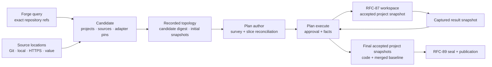

# RFC-88: Detached Changes

> Status: Draft — step 3 of the platform-migration series ([platform.md](platform.md))
>
> Owns: the detached change home and its separation from durable project state; project and generic source discovery in **migrate** and **change** modes; exact project bases; source pins as RFC-87 snapshots; candidate anchoring; generated source identities; discovery-time adapter pins; per-project accepted-snapshot projection and execution context; the narrow forge provider; and execution-authorized greenfield provisioning.
>
> Depends on completed [RFC-86](rfc-86-change-facts.md) (fact tree, pinned judgments, projected status, approval facts) and implemented [RFC-87](rfc-87-working-trees.md) (immutable snapshots and private workspaces). [RFC-89](rfc-89-publication-sets.md) consumes the final accepted project snapshots and seals them for publication; [RFC-92](rfc-92-node-sync.md) later transports the same facts and values between nodes.
>
> Amends RFC-86 D1 (the in-place change home is `.emery/change/`, not all of `.emery/`) and RFC-87 D4 and acceptance criterion 4 (a snapshot carries the project repository's durable state, including its baseline; only change artifacts stay outside), and deletes RFC-87's interim `apply`.

## Intent

Start in an empty directory with forge authentication, an organisation, intent, and optional source material. 

`emery plan author` discovers participating projects and sources before g slices. 

`emery plan execute` records authorization, provisions approved greenfield projects, and executes every slice against disposable private workspaces. The result of this RFC is one final accepted snapshot for each touched project, carrying that project's code and its merged baseline together.

The change replaces the permanent platform repository as the coordination home. Product code never lives in that home, and the operator never tends `workspace/<project>/` slots or a committed registry. Migrate and ongoing change use the same pipeline: migrate criteria locate legacy inputs and propose target topology; change criteria locate initialized product members. Source intake remains independent of project membership in both modes.

This RFC stops before publication. [RFC-89](rfc-89-publication-sets.md) turns each final accepted snapshot into one local commit and change branch, after which the operator pushes and merges and `plan archive` verifies the publication set.

## Model

Four nouns are sufficient:

- **Change home** — the RFC-86 fact tree containing coordination artifacts, never product code and never durable project state.
- **Project** — a participating repository with an exact Git base and an RFC-87 initial snapshot; a project is target-capable only when it carries a target binding.
- **Source** — a stable adapter-bound input whose `location` resolves to one immutable read-only tree identified by its RFC-87 snapshot id, or whose inline `value` is pinned by the plan digest.
- **Accepted project snapshot** — the current project result projected from its initial snapshot and successful slice-merge facts, carrying both product code and the project's merged baseline.




## Decisions

### D1 — The change home is the detached fact tree, separate from durable project state

Detached artifacts live at the change root, with no synthetic project configuration:

```text
<change>/
  change.md
  plan.yaml
  candidate.yaml
  discovery.md
  materials/
  discovery/requests/<digest>.yaml
  discovery/responses/<digest>.yaml
  approvals/
  events/<actor>.jsonl
  slices/
```

`candidate.yaml` is the normalized intake projection; `discovery.md` remains the source-adapter lead inventory. External local and HTTPS source values are imported under `materials/`, which is an ordinary input directory rather than a verified store — D2's snapshot id is the pin.

In-place mode writes the same artifact set to `.emery/change/`, which is the sole in-place change home. Durable project state — `project.yaml`, the `specs/` baseline, and `decisions/` — stays at `.emery/` and belongs to the repository rather than to any change. The two have different lifetimes: a change home is archived and deleted, while durable project state merges forward and ships with the repository. Emery carries the pair as two roots, a project root and a change root, rather than one layout with two mappings; detached mode is the case where they are unrelated directories, and in-place mode is the case where the change root is nested beneath the project root.

That separation yields one tree boundary for both modes: a project snapshot excludes `.git` and the change home when it is nested, and nothing else. Detached root discovery never depends on `.emery/project.yaml` or Git metadata. RFC-92's untracked `.emery/hosted.yaml` may coexist as node-local transport configuration, but it is not a change artifact or project-root marker. Emery writes the files; versioning, copying, backup, and review of the change home are optional operator-owned concerns.

### D2 — Sources are generic immutable location bindings pinned as snapshots

Every persisted source binding has a generated key, an exact adapter pin, a component digest, and exactly one of `location` or `value`. A location may originate as a Git reference, a change-relative file or directory, an external local path, or a bounded HTTPS resource. Intake resolves it once, applies optional `path` (default `.`), stages the resolved value, and records the RFC-87 snapshot id of the staged tree. That id is RFC-86's plan-scope source snapshot pin, copied into each slice's `base.yaml`.

There is one content identity in the system. A source pin is an ordinary RFC-87 snapshot in the ordinary store, not a second digest scheme: the tree manifest already distinguishes a lone file from a two-file tree and the same bytes at one path from another, so no domain-separated preimage rule is required. A file therefore stages as a directory containing that file, which is how every location-backed operation comes to receive one read-only root shape. An inline `value` is not snapshotted at all — it lives in `plan.yaml` and is already pinned by the plan digest, and the operation receives it as a payload rather than a root. When a recorded project also contributes source input, its project snapshot and its source pin are the same id over one store entry.

External local and HTTPS values are copied under `materials/` before persistence; change-relative values are staged in place. Mutable Git refs are normalized to an exact repository revision; mutable URLs and original paths remain provenance only. A source records no revision of its own: the revision rides its `location`, and only a project needs an exact commit (D5), because only a project is sealed onto one. Re-entry resolves the recorded snapshot from the store, whose read path verifies every object, rather than rereading a mutable origin. Snapshot ids recorded in `plan.yaml` are store GC roots for the life of the change.

Source operations receive the source key, a read-only prepared workspace over the pinned snapshot (or the inline payload), and read-only change artifacts explicitly. They do not parse `plan.yaml` or assume the source is the target project. The prepared root reuses the same workspace record target `build` already receives, so the WIT gains an input argument rather than a new root shape, and `capture` already refuses a read-only workspace — "a source is never captured" is enforced by the shipped kernel rather than by prose. The source operation contract is widened accordingly across the WIT, native provider, mocks, and first-party adapters.

### D3 — Discovery is the deterministic first phase of plan authoring

Detached `emery plan author` initializes the change home when needed, then runs two internal phases:

1. **Project discovery and topology recording** — query and read bounded forge candidates, resolve generic source locations, select and pin adapters, persist topology judgment request/response artifacts, write `candidate.yaml`, and atomically anchor its digest with normalized `projects` and `sources` in the plan shell.
2. **Lead survey and slice reconciliation** — survey only the recorded source bindings, write `discovery.md`, and author slices over the recorded topology.

The candidate digest is SHA-256 over a versioned canonical typed representation with sorted maps and rejected unknown fields; YAML presentation is irrelevant. The topology request and raw schema-valid response are retained under their own digests, and the candidate records those digests plus the discovery-catalog digest. `plan author` and `plan execute` both require the plan's anchored digest and copied topology to match the candidate. Re-entry reuses intake artifacts only when every recorded digest still matches; `--force` recreates the complete intake and authored result. There is no open, discover, or topology-approval command.

### D4 — Registry-backed workspace coordination is removed

Detached plans author no `registry.yaml`, topology lock, or workspace slots. `plan.yaml.projects` is the sole recorded project topology, while registry-shaped and project-head views are projections. `emery init --workspace`, workspace routing, slot synchronization, and committed-registry handlers are removed at this hard cut. Regular in-place projects remain.

### D5 — Projects pin both an exact Git base and an initial snapshot

An existing project records `repository: { locator, revision }`, where `revision` is the exact Git commit read during discovery, and separately records `snapshot`, the RFC-87 identity of the ingested repository tree — the whole tree at that revision minus `.git` and any nested change home, so durable project state (`project.yaml`, the `specs/` baseline, `decisions/`) is inside the snapshot rather than beside it. A greenfield row records `action: create`, a canonical locator, create inputs, and its deterministic initial snapshot; it has no repository revision until execution records a provisioning receipt. Git revision and snapshot id are different types and are never accepted through one scalar grammar. Movement of an origin branch is an informational freshness finding; inability to resolve the recorded commit is an error.

In change mode, a provider-side Emery-project marker narrows the candidate set, but pinned `.emery/project.yaml` content is authority: a member declares a non-empty `product:` list, operator-supplied product filters intersect that list, and `platforms:` remains the build set rather than membership. In migrate mode, source criteria and explicit repository criteria form candidates; a schema-gated topology judgment may fill unresolved target needs only from operator-supplied project locators and create specifications. Existing project configuration always wins. A slice may reference only a target-capable project.

Project discovery and source selection are independent. One project may supply several sources, a source may have no project, and a source no-match never removes its project row.

### D6 — Discovery uses an injected catalog and records exact adapter pins

The deployment injects a bounded, versioned discovery catalog: selectable source package identities with syntactic profiles, and proposable target package identities with purpose and platform constraints. Pure fingerprinting, exact-one selection, and topology validation remain engine kernels; concrete adapter identities remain deployment policy.

When a source omits `adapter`, Emery fingerprints its resolved immutable value. Exactly one eligible profile selects that adapter; zero records `source-adapter-no-match` and excludes only that row; more than one records `source-adapter-ambiguous` and requires an explicit adapter. Excluded rows remain in `candidate.yaml` for review but never enter `plan.yaml.sources`. There is no ranking or model fallback. An explicit adapter bypasses inference but not intake, snapshot, read-access, or compatibility gates.

Every selected source and target is resolved during discovery and persisted as an exact package identity plus SHA-256 component digest. A bare local component with no exact package version is not recordable in detached topology. The first catalog covers `typescript`, `documentation`, `screenshots`, and `captures` source inference, explicit `intent`, and the `omnia`, `vectis`, and `contracts` targets. Third-party adapters may be explicit if the ordinary resolver can produce the same exact pin; dynamic third-party discovery is deferred.

Source keys remain identities independent of projects. The allocator derives a base from the normalized location basename, or adapter for a value, reserves `intent`, reuses the previous key for an unchanged canonical binding, and suffixes only new collisions with a stable digest prefix. Simultaneous new collisions are ordered by canonical binding, duplicate canonical inputs are rejected, and downstream leads, Evidence, provenance, and authority overrides use the persisted key without recomputation.

### D7 — Execution projects one accepted snapshot per project

`plan.yaml` records only each project's initial snapshot. Each build fact records its exact base and result snapshots; each successful merge fact advances that project's accepted snapshot. The project-head projection folds the initial snapshot with accepted results in the fact log's per-project merge order — `depends-on` schedules work, it never orders the fold — and rejects a broken base/result chain. Later slices targeting the same project therefore start from prior accepted work, not the repository's initial revision.

Every code-touching request resolves `{ project key, current accepted snapshot }` into a fresh writable RFC-87 workspace, with change artifacts granted separately as a read-only root. The project's baseline is in the workspace because it is in the snapshot; there is no separate baseline grant and no second writable tree. Drift between that baseline and the slice's RFC-86 `base.yaml` pin is reported by the existing staleness diagnostics rather than concealed by materializing the older tree. The change home is never frozen, prepared as product code, or captured. Source survey/extract instead prepare a read-only workspace over their pinned source snapshot — or receive the inline payload with no workspace at all — and never capture anything.

An accepted snapshot carries the whole project result, code and merged baseline together, so the deterministic baseline fold runs inside a workspace rather than against an ambient checkout. `emery slice merge` prepares a writable workspace from the build's result snapshot, runs the target preflight gate, folds the slice's delta spec into that workspace's baseline, and captures; the capture is the project's new accepted snapshot, and the postflight gate reads the merged state instead of the pre-fold state. Folds are serial per project by construction, since they run at the serial merge gate. RFC-87's interim `apply` is deleted here rather than by RFC-89: once both halves of a project result are one snapshot, writing touched paths back onto an ambient product tree has no target in detached mode and no purpose in either.

### D8 — Plan execution is the only authorization surface

Invoking `emery plan execute` verifies the candidate anchor and canonical topology, then records RFC-86's approval fact over the candidate digest, current plan digest, and any spec digests in scope; detached approval extends the RFC-86 artifact with the candidate subject. Only after that fact exists may execution perform greenfield writes or slice work. A changed candidate, plan, or covered spec requires a new execution authorization. No additional operator approval step exists.

Greenfield creation is a recoverable saga, not an atomic or idempotent forge call:

```text
provisioning intent fact
  → create or reconcile provider operation
  → provisioning receipt fact
  → resolved-project projection
```

The intent records locator, visibility, expected initial snapshot, target pin, platforms, products, provisioning token, and deterministic commit marker before any side effect. A preservation-safe initialization kernel renders that tree solely from the recorded adapter, platform, product, and provisioning inputs; the rendered tree carries the new project's durable state (`project.yaml` and an empty baseline) inside the snapshot, exactly as an ingested project does. Re-entry queries the locator: a missing repository is created and initialized; an exact marker and tree records or reuses the receipt; an unrelated or drifted repository is a conflict; an ambiguous partial repository halts for operator resolution. The receipt records the exact initial revision and verifies that its tree is the planned initial snapshot. GitHub repository provisioning is the forge provider's only write in this RFC; push, branch publication, PR, merge, and seal operations are absent.

### D9 — Reads are bounded and durability claims are narrow

Forge access is a host provider capability, not an adapter axis. The shipped GitHub binding uses a server-side marker plus operator repository, product, and topic filters to narrow change-mode membership, caps the post-narrowing candidate set, and verifies every selected row from its exact revision. Exceeding the cap fails with `discovery-too-broad` and reports the supported narrowing filters. A versioned provider policy fixes limits for candidates, API pages and requests, concurrent reads, operation time, inspected files and bytes, imported tree/archive size, redirects, and HTTPS response size; its digest is recorded in the candidate.

Remote source fetches require HTTPS, reject credentials in URLs and local/private network targets, and cap redirects and bodies. Tree reads execute no hooks, submodules, LFS filters, or symlink traversal outside the root. Provider-specific document URLs such as GitHub `blob` pages normalize to raw content.

No change-coordination state is required after RFC-89 has sealed, verified, and archived the change. Project configuration, baselines, created repositories, forge history, and host caches are durable state outside that claim. Deleting the change home before copying or otherwise replicating it loses its facts; retaining the directory after archive is optional policy that preserves more audit history. Before RFC-92, another machine can reconstruct recorded Git inputs and copied materials, but unsealed result snapshots remain node-local values; copying or versioning the change home alone does not move them.

## Fixed implementation cut

- The public workflow remains `emery plan author → emery plan execute → emery plan archive`; this RFC adds no command group, and RFC-89 owns the seal and successful archive gate after execute.
- `Plan` gains closed `projects`, `candidate-digest`, exact source pins, and singular `slices[].project`; `ProjectConfig` gains a unique kebab-case `product` list. Validation treats projects, sources, slices, candidate artifacts, adapter pins, provisioning receipts, and accepted-snapshot chains as one graph.
- Today's single layout gains a second root: operations take a project root and a change root instead of assuming one directory holds both. Detached mode is the case where the two are unrelated; in-place mode is the case where the change root is `<project>/.emery/change/`. There is no mapping trait and no synthetic `project.yaml` for a detached home.
- The snapshot store's ignore policy collapses to `.git` plus the change home when nested. The root-name exclusion list (`change.md`, `discovery.md`, `plan.yaml`, `registry.yaml`) is deleted along with the root placement it compensated for, and `.emery/` is no longer excluded wholesale.
- The workspace capability becomes project-explicit: ingestion accepts an exact repository reference, and preparation accepts the selected project and snapshot rather than an ambient process root. `freeze` leaves the build path entirely — a base is always a recorded pin or the accepted-snapshot projection — and survives only as intake's repository ingestion.
- The merge orchestration takes the project root as an argument and folds the baseline inside the prepared workspace. `Workspaces::apply`, the store's `apply`, its touched-path rewrite and empty-parent pruning, and the code-applied journal event are removed.
- The source WIT gains an input argument carrying the resolved binding: a read-only prepared workspace for a location, or the inline payload for a `value`. It reuses the record target `build` already receives, so no new root shape and no resource handle crosses the seam. Target dispatch keeps receiving an already-prepared workspace and read-only change-artifact roots.
- Snapshot ids recorded in `plan.yaml` are store GC roots for the life of the change; D9's imported-tree limit bounds what intake may stage into the store.
- The resolver exposes the exact package identity and verified component digest it loaded. The provider bundle gains the discovery catalog, generic bounded intake, and narrow forge capabilities.
- Candidate and provisioning DTOs deny unknown fields and use typed canonical digests. Judgment request/response schemas live with the change answer corpus and use the ordinary bounded repair loop.
- Integration coverage uses local forge, HTTP, snapshot-store, and component fixtures; no test widens production APIs solely for reachability.

## Acceptance criteria

1. An empty directory that is not a Git working tree can author a detached change without `.emery/project.yaml`; every artifact lands in the D1 layout, and in-place authoring writes the same artifact set to `.emery/change/` while `project.yaml`, `specs/`, and `decisions/` stay outside the change home and inside the project snapshot.
2. Git, change-relative, external local, HTTPS, file, and tree sources resolve to RFC-87 snapshots in the ordinary store, and an inline value stays in `plan.yaml` under the plan digest. Operations receive only a read-only prepared root or the inline payload and cannot recover or reread a mutable origin. A repository bound as both a project and a source yields one snapshot id over one store entry.
3. Source inference selects exactly one profile or records a source-local no-match/ambiguity without changing project membership. Explicit bindings pass the same intake and access gates.
4. Generated source keys are argument-order deterministic, stable when a later source introduces a basename collision, collision-safe without counters, and duplicate-rejecting.
5. Discovery atomically anchors canonical candidate, catalog-policy, project, source, topology-request, and topology-response digests before survey. Semantic edits, unknown fields, stale revisions, and component changes fail before execution.
6. Two slices targeting one project consume a valid initial → result₁ → result₂ accepted-snapshot chain; every accepted snapshot carries that project's code and its merged baseline; the second slice's workspace shows the first slice's baseline fold; and the change home is never captured. No operation writes an ambient product tree.
7. `plan execute` is the only authorization action. Failure injection before creation, after repository creation, after initial commit, and before receipt recording either reconciles the exact marker/tree or halts without claiming false idempotency.
8. Change-mode marker search narrows candidates but never overrides pinned `project.yaml.product`; all network and tree budgets fail closed, and execution never re-queries membership.
9. Execution ends with one final accepted snapshot per touched project and no commit or branch. RFC-89 can seal each from its recorded initial revision; pre-RFC-92 cloning does not claim to transport unsealed result values.
10. Workspace initialization, registries, slots, ambient target roots, authored source keys, engine-owned adapter inventories, separate discovery/approval verbs, a second content-identity scheme beside RFC-87 snapshots, baseline writes outside a prepared workspace, the interim `apply`, and forge publication writes are absent from the shipped surface.
11. `cargo make ci` is green with crate-level integration coverage for the complete graph, canonical digests, source intake and identity, adapter pinning, bounded discovery, per-project execution, accepted-snapshot projection, authorization, and provisioning recovery.

## Rejected alternatives

- **Permanent platform repository, registry, or durable out-of-tree change store** — makes change-scoped coordination a platform to tend.
- **Origin-specific source schemas or project-bound sources as the only source form** — cannot represent local documents, HTTPS material, inline intent, or several inputs from one project uniformly.
- **Live source reads or ambient checkouts during operations** — make judgments and builds depend on mutable location rather than pinned values.
- **Git revision as an RFC-87 snapshot or a mutable project-head field in `plan.yaml`** — conflates authorities and creates state that facts already project.
- **A source digest scheme separate from RFC-87 snapshots** — a second content identity for the same kind of value, when the tree manifest already distinguishes a file from a tree and one path from another.
- **The baseline as a change-home artifact written into RFC-89's seal tree** — splits one project result across two authorities, makes the seal synthesize tree content no snapshot verified, hides the baseline from agents working inside a workspace, and forces a second composition mechanism beside RFC-91's snapshot composition.
- **Granting the pinned baseline as a separate read-only root** — a workaround for a baseline outside the tree; drift against the `base.yaml` pin is a diagnostic, not a materialization problem.
- **Separate open, discover, or topology-approval commands** — expose internal authoring phases without adding an operator decision boundary.
- **Engine-owned adapter inventories, model-ranked selection, or resolving bare names on every machine** — violate adapter neutrality or make recorded topology non-reproducible.
- **Atomic/idempotent cross-system repository creation** — GitHub offers no such guarantee; intent, reconciliation, and receipt are the honest recovery contract.
- **Forge as a third adapter axis or Emery-owned push/PR/merge** — forge access is host infrastructure, while publication remains operator-owned and RFC-89-defined.

