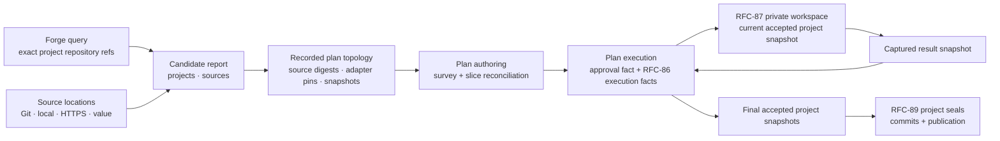

# RFC-88 Architecture Review

> Status: Review notes — recommendations to resolve before rewriting [RFC-88](rfc-88-detached-changes.md) in the concise style of [RFC-87](rfc-87-working-trees.md).
>
> Scope: Architecture and implementation-contract review only. This document is not an RFC and changes no accepted decision by itself.

## Summary

RFC-88's central direction should remain: the change replaces the permanent platform repository as the coordination home; projects are discovered and pinned before plan authoring; product code is materialized only in disposable RFC-87 workspaces; forge access is a host capability rather than an adapter axis; and greenfield projects are provisioned only after `plan execute` records authorization.

The current draft is not ready for a prose-only rewrite. It couples project discovery to source-adapter eligibility, conflates Git revisions with RFC-87 snapshots, adds a redundant topology-approval command, and leaves the initial project base indistinct from its evolving accepted result. It also claims a complete publication loop before RFC-89 creates a committable result. The recommendations below separate those contracts.

## Recommendation index

| ID | Priority | Recommendation | Depends on |
| -- | -------- | -------------- | ---------- |
| R1 | Required | Keep sources as generic immutable location bindings | — |
| R2 | Required | Make repository an exact Git reference distinct from the RFC-87 snapshot | — |
| R3 | Required | Project the evolving accepted snapshot for each target project | R2 |
| R4 | Required | Introduce an explicit per-project execution context | R2, R3 |
| R5 | Required | Use plan execution as the only authorization surface | — |
| R6 | Required | Anchor the candidate digest and persist topology judgment artifacts | — |
| R7 | Required | Fold project discovery into `plan author` | — |
| R8 | Required | Select one source adapter per resolved location | R1 |
| R9 | Required | Inject a versioned discovery catalog and pin selected adapters | R1, R2 |
| R10 | Required | Specify greenfield creation as a recoverable saga, not an atomic write | R5, R6 |
| R11 | Required | Choose one detached fact-tree layout | — |
| R12 | Required | End RFC-88 at accepted snapshots and leave project sealing to RFC-89 | R3 |
| R13 | Required | Keep generated source keys as independent identities | R1 |
| R14 | Recommended | Add scalable membership lookup and bounded untrusted-tree reads | R8 |
| R15 | Recommended | Narrow durability and portability claims | R2, R11, R12 |

The minimum coherent architectural set is R1–R13. Omitting one of those leaves either source resolution, the plan graph, source identity, execution base, authorization, command ownership, or an RFC boundary ambiguous.

## R1 — Keep generic source bindings

### Problem

The existing top-level `sources` map is the right abstraction: a source is an adapter-bound input, not necessarily a project. It may be a Git repository, local file or directory, remote document, or inline intent. The current `path | value` binding does not express this cleanly, import local or remote material, pin the bytes exposed to the adapter, or pass the resolved source root through the operation contract.

### Recommendation

Replace origin-specific binding fields with one generic `location`:

```yaml
sources:
  legacy-code:
    adapter: typescript
    location: https://github.com/owner/repo@tag|branch|revision
    digest: sha256:...
    path: .
  product-brief:
    adapter: documentation
    location: materials/product-brief.pdf
    digest: sha256:...
  design:
    adapter: documentation
    location: design/
    digest: sha256:...
  apis:
    adapter: documentation
    location: https://github.com/augentic/omnia-backends/blob/main/docs/Architecture.md
    digest: sha256:...
  intent:
    adapter: intent
    value: Migrate order processing
```

`location` and `value` are mutually exclusive. A location may be a Git reference, change-relative path, or bounded HTTPS resource. Intake resolves it once, imports an immutable file/tree, applies optional `path` (default `.`), computes `digest` over the exact value exposed to the adapter, and grants that value as a read-only source root. External local paths and remote documents are copied into change-owned material storage; already change-relative locations are read in place and digest-verified. Tags, branches, and mutable HTTP URLs are origins only; the imported value and digest are authority after discovery records them. `digest` is generated by Emery and required only in the resolved persisted binding. File and tree digest encodings are domain-separated.

### RFC effect

Retain `plan.yaml.sources`, stable source keys, and the existing slice/Evidence/provenance references. Replace `SourceBinding.path` with the resolved `{ location, digest, path? }` form while retaining the mutually exclusive `value` form. Stop making adapters reread `plan.yaml` to discover their binding: source operations receive the source key and an already-resolved read-only root/value explicitly. Files are lent as a directory containing that file, so the adapter operation always sees one root shape.

## R2 — Make repository an exact Git reference

### Problem

RFC-88 stores `repository` and `revision` as sibling fields even though together they identify one exact Git input. RFC-87 and the WIT workspace capability separately use revision for a content-addressed complete product tree. These values have different authority and recovery semantics. A project repository is also distinct from R1's generic source binding: even when the same Git tree contributes source input, the project base and source identity serve different contracts.

### Recommendation

Represent the Git pair as one closed repository value, then keep the RFC-87 snapshot separate:

- **`repository.locator`** — canonical forge locator.
- **`repository.revision`** — exact Git commit recorded as the initial repository base.
- **Snapshot id** — RFC-87 content-addressed product tree used by every Emery operation.

An `action: create` candidate carries the locator and deterministic initial snapshot without a revision; execution records approval, then the provisioning saga records the returned revision in the resolved project projection. Discovery reads each existing repository's exact revision, ingests it through the RFC-87 snapshot policy, and records the resulting snapshot. A moved default branch does not invalidate the recorded commit; movement may produce an informational freshness finding, while an unavailable recorded commit is an error.

Project ingestion reuses the RFC-87 snapshot manifest so discovery and execution share path normalization, symlink policy, and ignored-tree rules. When a recorded project also contributes source input, discovery creates an independent R1 source binding over an exact Git location; R1 governs its digest and R8 its adapter selection.

### RFC effect

Use `repository.revision` for the exact Git commit and `snapshot` for the RFC-87 content-addressed product tree. Treat the resolved `repository` object as one typed value at the parse boundary rather than a scalar syntax with an ad hoc separator.

## R3 — Project the evolving accepted project snapshot

### Problem

The recorded project snapshot is only the initial base. If several slices target one project, later slices must consume accepted results from earlier slices. Preparing every operation from the initial repository revision would discard or conflict with preceding work.

### Recommendation

Define one project-head projection:

```text
recorded initial project snapshot
    + successful slice result facts in dependency/merge order
    → current accepted project snapshot
```

Each build fact records the exact base and result snapshots. Each successful merge advances the projected accepted snapshot for that project. `plan.yaml` remains immutable topology and records only the initial snapshot; no mutable project-head field is stored.

### RFC effect

State explicitly that discovery pins the initial base and execution authorizes it, while operation dispatch resolves the current accepted snapshot from RFC-86 facts. RFC-89 seals that final accepted snapshot against the recorded initial repository revision.

## R4 — Introduce a per-project execution context

### Problem

Current orchestration has one project root. In detached mode the invoked root is the change repository, while product code belongs to a selected project snapshot. Without an explicit split, build or merge can freeze or write the coordination tree.

### Recommendation

Resolve every code-touching operation into:

```text
project key
→ current accepted snapshot
→ writable RFC-87 product workspace
  + read-only change artifacts
  + read-only pinned project baseline
```

The change root remains the only location for plans, facts, Evidence, specs, designs, tasks, and reports. The product workspace contains product code only. Source survey/extract resolve their independent location binding into an immutable read-only source workspace; they do not assume the source is the target project.

### RFC effect

Add two short execution-request contracts: target operations resolve a project and its accepted snapshot into a writable RFC-87 workspace; source operations resolve a source location and digest into a read-only source workspace. Both receive change artifacts separately.

## R5 — Use plan execution as the authorization surface

### Problem

The draft adds a standalone topology-approval step before plan authoring even though invoking `plan execute` already authorizes the work. Content-addressing can freeze the candidate and its imported values without an approval command, and a separate gate does not add safety for the single-operator workflow.

### Recommendation

Discovery resolves and persists the candidate digest, projects, sources, source digests, project snapshots, and adapter pins before plan authoring. `plan execute` verifies that candidate binding, records RFC-86's approval fact over the candidate, current plan, and any spec digests in scope, then performs greenfield provisioning before slice work. There is no standalone approval verb.

The approval fact remains useful audit state: it records exactly which immutable inputs authorized execution. It does not require an additional operator action.

### RFC effect

Remove the topology-approval command and make discovery the writer of recorded topology. Keep `plan execute` as the single authorization action and approval-fact producer.

## R6 — Anchor the candidate digest and persist judgment artifacts

### Problem

Execution cannot detect a semantically valid edit if it merely computes the digest of whatever `candidate.yaml` exists at that moment. The expected digest must be fixed when discovery records topology. The topology judgment also conflicts with RFC-86's rule that judgment outputs are persisted and pinned: the draft retains only `topology-answer-digest`.

### Recommendation

Discovery writes the candidate digest into the detached plan shell in the same atomic operation that records the normalized project and source topology. Plan authoring preserves that binding; execution requires it to match the canonical typed candidate document. The topology judgment's typed request and raw schema-valid response are persisted as digest-identified discovery artifacts; `candidate.yaml` is the normalized review projection over them.

Canonical digest input must use a versioned normalized representation with sorted maps and unknown fields rejected. It must not depend on YAML presentation.

### RFC effect

Make the digest a discovery-time topology anchor verified by plan authoring and execution. Add topology request/response artifacts to the detached fact tree.

## R7 — Fold project discovery into plan authoring

### Problem

The draft introduces separate commands to initialize a detached change and discover projects, product membership, target topology, and greenfield projects before invoking `plan author`. After removal of the separate approval gate, these commands expose internal authoring phases without creating an operator decision boundary. The discovery name also collides with the existing `discovery.md` lead inventory produced by source `survey`.

### Recommendation

Make detached initialization and project discovery deterministic pre-synthesis phases of `emery plan author`. The command initializes the change home when needed, persists the candidate and resolved topology, then surveys sources and reconciles slices. Re-entry may reuse persisted intake artifacts when their digests match; `--force` recreates the complete authored result.

Reserve `emery source` for the existing source adapter resolution, survey, and extraction breakout surface. Introduce no additional workflow command group.

### RFC effect

Describe two internal authoring phases: **project discovery and topology recording**, then **lead survey and slice reconciliation**. Keep the public workflow at `plan author → plan execute → plan archive`.

## R8 — Select one adapter per source location

### Problem

Source selection and project discovery are independent. A source location may be a repository tree, local material, or remote document, and multiple source locations may originate from one project. No-match must exclude only that source; it must not remove a discovered target project.

### Recommendation

Resolve the source location into its immutable read-only value, then apply the exact-one selector to that value when the operator omitted `adapter`:

- **One eligible profile** records that adapter on the source binding.
- **Zero eligible profiles** excludes only the source with `source-adapter-no-match`.
- **More than one eligible profile** reports ambiguity for that source and requires an explicit adapter.
- An explicit adapter bypasses inference but not location resolution, digest verification, or read-access gates.

Retain exact-one rather than inventing ranking. Deterministic ranking would silently convert mixed repositories into the wrong specialist input; explicit resolution is safer.

### RFC effect

Candidate source rows carry their normalized location, generated digest, selected adapter, disposition, and reason. Keep one generic keyless intake grammar whose input is `location` or `value`; project discovery may add Git locations through the same kernel. Discovery records selected rows before plan authoring. The persisted plan shape does not distinguish Git, local material, and HTTP origins beyond the normalized `location` string.

## R9 — Inject the discovery catalog and pin selected adapters

### Problem

Embedding concrete first-party source and target inventories in the engine violates the engine's adapter-neutral boundary. Persisting bare adapter names also allows re-entry on another machine to select a different component version.

### Recommendation

The shipped deployment injects a versioned, bounded discovery catalog containing:

- Automatically selectable source identities and syntactic profiles.
- Automatically proposable target identities, purposes, and platform constraints.
- A catalog version or digest recorded in the candidate report.

The pure selection and topology-validation kernels remain engine-owned; concrete adapter identities remain deployment policy. Discovery resolves every selected source and target adapter and records its exact package identity and component digest for the change.

Third-party dynamic discovery remains deferred. Explicitly selected adapters may still use the ordinary resolver, subject to the same discovery-time pin.

### RFC effect

Replace “engine-owned inventory” with “provider-carried discovery catalog consumed by engine kernels.” Move concrete profile examples into the fixed implementation cut.

## R10 — Specify greenfield creation as a recoverable saga

### Problem

GitHub repository creation and initial commit creation are not one atomic transaction, and GitHub does not provide the idempotency guarantee assumed by a stable `(change, project)` key. A process can stop after repository creation but before initialization or local fact recording.

### Recommendation

Use an explicit recovery protocol:

```text
provisioning intent fact
→ create/reconcile provider operation
→ provisioning receipt fact
→ resolved-project projection
```

The intent records the repository locator, visibility, expected initialized tree digest, adapter, platforms, products, and a provisioning token before the side effect. Re-entry queries the requested locator:

- Missing repository: create and initialize it.
- Repository with the exact provisioning marker and expected initial tree: record/reuse the result.
- Unrelated or drifted repository: fail with a typed conflict.
- Ambiguous partial repository: halt for explicit operator resolution rather than claiming false idempotency.

The initialization kernel must render a preservation-safe tree from recorded adapter, platform, and product inputs without treating an ambient checkout as authority. `plan execute` starts the saga only after recording its approval fact.

### RFC effect

Replace “idempotent create operation” with “resumable provisioning saga with deterministic reconciliation.” Keep repository creation as the forge provider's only write.

## R11 — Choose one detached fact-tree layout

### Problem

RFC-86 places detached facts at the change repository root, while RFC-88 places `candidate.yaml` under `.emery/`. The current project layout also discovers a root through `.emery/project.yaml`, which a detached coordination repository should not fake.

### Recommendation

Use RFC-86's detached root:

```text
<change>/
  change.md
  plan.yaml
  candidate.yaml
  materials/                     # imported external local/HTTPS source values
  discovery/
  approvals/
  events/
  slices/
```

In-place mode continues to map the same logical change artifacts through its project layout. Add one logical change-layout abstraction rather than scattering detached-mode path conditions or creating a dummy project configuration.

Emery writes files; ordinary Git commit/push/pull remains operator-owned unless a later RFC explicitly introduces fact transport.

### RFC effect

Move `.emery/candidate.yaml` to the detached root, keep imported external source material under `materials/`, and state that detached change discovery does not depend on `project.yaml`.

## R12 — Preserve RFC-89's publication boundary

### Problem

RFC-88's lifecycle proceeds directly from execute to operator publication, but RFC-89 owns the project seal that converts the final accepted snapshot into a Git commit and local branch. Before that seal there is nothing the operator can push.

### Recommendation

RFC-88 ends with one final accepted snapshot per touched project. RFC-89 then performs:

```text
recorded initial repository revision + final accepted snapshot
→ sealed local commit and change branch
→ operator publication
→ verified archive
```

Do not claim that RFC-88 alone completes publication or archive. If a complete publishable loop is mandatory in step 3, move the project seal into RFC-88 and narrow RFC-89 accordingly; leaving the seal absent from both the RFC-88 lifecycle and implementation is not coherent.

### RFC effect

Change the intent from “execute, publish, archive” to “discover, author, and execute to final accepted project snapshots.” Make RFC-89's seal the explicit next step.

## R13 — Keep independent source identities

### Problem

Sources are independent adapter-bound inputs and therefore need identities distinct from projects. The same project may contribute several locations, while local and HTTP material has no project identity. Whole-set reallocation can nevertheless rename an existing source when a later input introduces a basename collision.

### Recommendation

Keep generated source keys as the stable identity used by leads, `slices[].sources`, Evidence filenames, provenance, and authority overrides. Derive a base from the normalized location basename (or adapter name for a value source), reuse an existing key for an unchanged canonical binding, append a digest prefix only for new collisions, and reject duplicate canonical inputs. Reserve `intent` for the intent value binding.

### RFC effect

Define incremental identity stability in addition to argument-order determinism. Source identity is independent of location mutability: branch/tag/HTTP content resolution updates the resolved digest during discovery, while downstream references use the persisted key and never recompute it.

## R14 — Scale membership lookup and bound untrusted reads

### Problem

`project.yaml.product` is authoritative but not efficiently searchable across a large forge organization. A cap of 100 projects can reject a large organization before Emery learns that only a few projects are product members. Reading untrusted project trees and generic source locations also has no complete file-count, byte-count, network, API, or concurrency budget.

### Recommendation

Use a forge-searchable index hint, such as a generic Emery-project topic or provider-equivalent property, to form the candidate set; always verify membership and target facts from the pinned `project.yaml`. Treat the index as an optimization, never authority.

Specify fixed provider budgets:

- Maximum project candidates after server-side narrowing.
- Maximum files and total bytes inspected per tree.
- Maximum tree/archive size ingested into the snapshot store.
- HTTPS only for remote documents, with redirect and response-size caps.
- Reject localhost, private-network targets, URL-embedded credentials, and unsupported schemes.
- API pagination and request limits.
- Bounded concurrent reads.
- Read and operation timeouts.
- No Git hooks, submodule initialization, LFS execution, or symlink traversal outside the resolved root.
- Host-specific normalization for document pages such as GitHub `blob` links, which must import raw content rather than HTML chrome.

### RFC effect

Retain `discovery-too-broad`, but define where the cap applies and how an operator can narrow a large organization without already knowing every project name.

## R15 — Narrow durability and portability claims

### Problem

“No Emery state outlives the change” is broader than the actual design: project configuration and baselines are durable Emery state, forge history survives, and host caches may remain. “Clone the change repository to share it” also overstates pre-RFC-92 portability because Git moves facts and artifacts, not unsealed result snapshot objects.

### Recommendation

Use these narrower invariants:

- No **change-coordination state** is required after verified publication and archive.
- Deleting an unpushed change repository loses its facts.
- Before RFC-92, another machine can reproduce recorded input snapshots from repository revisions, but unsealed result snapshots remain node-local values.
- RFC-92 transports snapshot values without changing their identities or workflow meaning.
- Retaining or archiving the change repository is optional policy, with the corresponding audit trade-off stated explicitly.

### RFC effect

Replace “nothing of record is lost” with a precise list of durable outcomes: member configuration/baselines, sealed and merged forge history after RFC-89, and any intentionally retained change archive.

## Recommended RFC-88 model

The rewritten RFC can use four nouns:

- **Change home** — the git-backed RFC-86 fact tree containing coordination artifacts.
- **Project** — a repository participating in the change, carrying its exact repository reference and RFC-87 snapshot; target-capable when it carries `target`.
- **Source** — a stable adapter-bound input whose `location` or `value` resolves to one immutable read-only value identified by `digest`.
- **Accepted project snapshot** — the fact-projected current result of successful slice merges for one project.



## Recommended rewrite structure

The RFC-87-style rewrite should target roughly 140–170 lines:

1. **Intent** — replace the permanent platform repository with a disposable change home and produce final accepted snapshots across recorded projects.
2. **Model** — the four nouns and one diagram above.
3. **Decisions**
   - Change home and layout.
   - Project topology and generic source locations.
   - Exact repository reference to snapshot pinning.
   - Candidate anchoring and judgment artifacts.
   - Discovery catalog and source inference.
   - Per-project accepted-snapshot projection and execution context.
   - Recoverable greenfield provisioning.
   - Hard cut from workspace/registry coordination.
4. **Fixed implementation cut** — the unchanged `plan author → plan execute → plan archive` workflow surface, provider operations, bounded first-party catalog, validation graph, security budgets, and explicit RFC-89 deferral.
5. **Acceptance criteria** — public integration tests around identity, execution authorization, re-entry, materialization, inference, provisioning recovery, and final accepted snapshots.
6. **Rejected alternatives** — permanent platform repo, mutable registry, ambient checkouts, live source reads during operations, origin-specific source schemas, re-querying membership, adapter-axis forge access, model-ranked source selection, and false atomic cross-repository creation.

Exhaustive candidate reason ids, full CLI flag grammar, and concrete adapter profile tables should remain in the fixed cut only if they are necessary interoperability contracts; otherwise they belong in implementation documentation.
