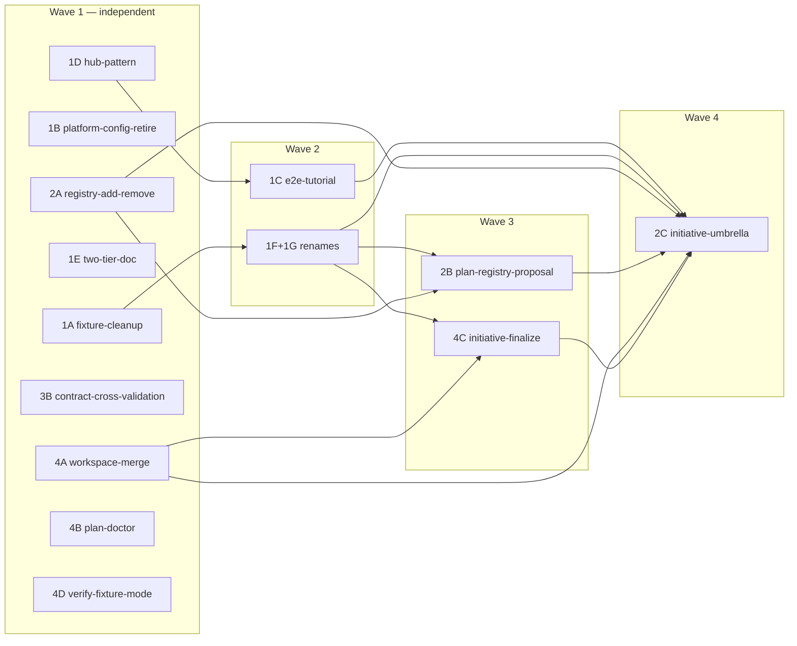

# RFC-9 Implementation Plan

> Source: [rfc-9-platform.md](rfc-9-platform.md)
>
> A sequenced set of changes, each scoped tightly enough to run in a single subagent context. Each change is intended to be driven through `/spec:define <slug> → /spec:build <slug> → /spec:merge <slug>` against this repo. The slugs match the RFC item identifiers so reviewers can cross-reference quickly.

## Summary

- **15 changes** mapping to the 15 RFC items, with **one merger** (1F + 1G ship together per RFC §1G "Why both at once").
- **4 dependency waves.** Within a wave, changes are independent and can run on parallel subagents.
- **Critical path** matches RFC §"Implementation order": `1D → 1C → 1F+1G → 2A → 2B → 4A → 4C → 2C`.
- **Headline parallelism:** Wave 1 contains 9 fully-independent changes; the rest of the work narrows down toward the 2C umbrella skill in Wave 4.

## Conventions

- Change slugs are kebab-case `rfc9-<rfc-id>-<short-name>` so they sort and ripgrep cleanly.
- Schema column points at the Specify schema each change targets. CLI work (`specify-cli/`) uses the `specify-cli` schema; everything else uses `specify`.
- Effort: **S** = 1–2 days, **M** = 3–5 days, **L** = 1–2 weeks (matches the RFC table).
- A change is "subagent-sized" when it can be completed without re-reading more than ~3 large files plus its own brief. Items called out as `splittable` should be split before scheduling if the subagent's context budget is tight.

## Dependency graph



## Wave 1 — independent (start in parallel)

Nine changes, all dependency-free relative to RFC-9. Spin one subagent per change.

| Slug | RFC | Schema | Effort |
| --- | --- | --- | --- |
| `rfc9-1a-fixture-cleanup` | §1A | specify | S |
| `rfc9-1b-platform-config-retire` | §1B | specify-cli | S |
| `rfc9-1d-hub-pattern` | §1D | specify-cli | M |
| `rfc9-1e-two-tier-workspace-doc` | §1E | specify | S |
| `rfc9-2a-registry-add-remove` | §2A | specify-cli | M |
| `rfc9-3b-contract-cross-validation` | §3B | specify | L |
| `rfc9-4a-workspace-merge` | §4A | specify-cli | M |
| `rfc9-4b-plan-doctor` | §4B | specify-cli | M |
| `rfc9-4d-fixture-backed-verify` | §4D | specify | M (design-first) |

> **Sequencing note.** 1A serializes *ahead of* 1F+1G in Wave 2: both touch fixture transcripts and READMEs, so 1A goes first to keep the rename sweep conflict-free. The other Wave 1 changes have no downstream collisions.

## Wave 2 — dependent housekeeping & worked example

Start each as soon as its predecessor merges. Both can run in parallel with each other.

| Slug | RFC | Depends on | Schema | Effort |
| --- | --- | --- | --- | --- |
| `rfc9-1f-1g-rename-init-create` | §1F + §1G | 1A | specify-cli | S |
| `rfc9-1c-e2e-tutorial` | §1C | 1D | specify | M |

## Wave 3 — second-order features

Run in parallel once their predecessors are merged.

| Slug | RFC | Depends on | Schema | Effort |
| --- | --- | --- | --- | --- |
| `rfc9-2b-plan-registry-proposal` | §2B | 2A, 1F+1G | specify + specify-cli | M (splittable) |
| `rfc9-4c-initiative-finalize` | §4C | 4A (logical), 1F+1G | specify-cli | M |

## Wave 4 — terminal umbrella

| Slug | RFC | Depends on | Schema | Effort |
| --- | --- | --- | --- | --- |
| `rfc9-2c-initiative-umbrella` | §2C | 1C, 1F+1G, 2A, 2B, 4A, 4C | specify | M |

---

## Per-change briefs

Each brief is intentionally compact: enough for a subagent to execute without re-reading the full RFC, while still pointing back at the section that owns the design.

### `rfc9-1a-fixture-cleanup` — Wave 1

- **RFC:** §1A. The `affects` field was removed from the plan schema; fixtures still reference it.
- **Goal.** Strip every `affects:` key from execute/plan fixtures and align transcripts/READMEs with the description-driven model. Add a guard to `make checks`.
- **Touch list (audit-then-edit; non-exhaustive):**
  - `plugins/spec/skills/execute/fixtures/{e2e-platform-v2,e2e-platform-v2-with-crash,loop/stuck-on-blocked}/plan.yaml.{before,after,after-crash}`
  - `plugins/spec/skills/execute/fixtures/dry-run/expected-output.md`
  - `plugins/spec/skills/execute/fixtures/{loop/stuck-on-blocked,single-change,e2e-platform-v2}/{transcript.md,README.md}`
  - `plugins/spec/skills/plan/fixtures/{propose,propose-vectis}/transcript.md`
  - `scripts/checks.ts` — flag fixture YAML containing `affects:` as a schema-violation warning.
- **Acceptance.** `rg -n "^\s*affects:" plugins/spec/skills/{execute,plan}/fixtures/` returns zero hits. `make checks` passes and now fails when `affects:` is reintroduced.
- **Subagent recipe.** Audit (`rg`), edit each hit, extend `checks.ts`, run `make checks`.

### `rfc9-1b-platform-config-retire` — Wave 1

- **RFC:** §1B (recommendation: option (a) — remove).
- **Goal.** Delete the `specify-platform` crate and the `PlatformConfig` indirection. The registry is the peer catalogue; no second abstraction is needed.
- **Touch list.**
  - `specify-cli/crates/platform/` — delete directory.
  - `specify-cli/Cargo.toml` — remove workspace member.
  - `specify-cli/src/config.rs` — remove `impl PlatformConfig for ProjectConfig`.
  - `specify-cli/src/lib.rs` — remove `platform` re-export.
  - Any `use specify_platform::*;` imports.
- **Acceptance.** `cargo build`, `cargo test`, `cargo clippy -- -D warnings`, `cargo fmt --check` all clean.

### `rfc9-1d-hub-pattern` — Wave 1

- **RFC:** §1D. Adopt the registry-only hub as canonical.
- **Workstream.**
  1. Add `--hub` flag (or equivalent) to `specify init`. Scaffolds `.specify/registry.yaml { version: 1, projects: [] }`, writes `.specify/initiative.md` template, and writes `project.yaml` with `schema: hub` (sentinel that disables phase pipelines on the hub).
  2. Extend `Registry::validate_shape` with an opt-in `hub-only` mode keyed on `project.yaml:hub: true`. Reject `url: .` entries with `hub-cannot-be-project`.
  3. Add `docs/explanation/platform-repo.md` describing the hub vs platform-as-project topologies and the on-disk shape of each.
  4. Update `/spec:init` SKILL.md to expose the new flag.
- **Acceptance.** New tests cover `validate_shape` hub-mode rejection. `specify init --hub` produces the documented on-disk shape. `make checks` passes (no broken doc links).

### `rfc9-1e-two-tier-workspace-doc` — Wave 1

- **RFC:** §1E. Documentation only.
- **Goal.** Make the legacy-source vs registered-project clone distinction explicit.
- **Touch list.**
  - `docs/explanation/workspace-tiers.md` (new) — table + prose covering location, lifecycle, writability for each tier; commands that affect each.
  - Cross-link from `docs/explanation/three-layer-stack.md`, `plugins/spec/skills/plan/SKILL.md`, `plugins/spec/skills/execute/SKILL.md`.
- **Acceptance.** `make checks` passes.

### `rfc9-2a-registry-add-remove` — Wave 1

- **RFC:** §2A.
- **Surface.**

  ```text
  specify registry add <name> --url <url> --schema <schema> [--description "..."]
  specify registry remove <name>
  ```

- **Behaviour.**
  - `add` validates `name` (kebab-case), `url` (existing `validate_project_url`), `schema` (non-empty); creates `registry.yaml` with `version: 1` if absent; appends entry; runs `validate_shape` after the write.
  - `add` enforces the `description-missing-multi-repo` invariant: if the addition produces a multi-project registry and any existing project lacks a `description`, fail with the diagnostic.
  - `remove` validates shape after the write; warns when plan entries reference the removed project.
- **Touch list.**
  - `src/cli.rs` — new `RegistryAction::{Add, Remove}` variants.
  - `src/commands/registry.rs` — handlers + diagnostics.
  - Tests for each invariant.
- **Acceptance.** Unit tests cover kebab-case, URL classification, description invariant, plan-reference warnings on `remove`, and `Registry::load` round-trip.

### `rfc9-3b-contract-cross-validation` — Wave 1

- **RFC:** §3B. RFC-8 is already landed.
- **Goal.** Post-merge cross-project compatibility check inside the execute driver.
- **Workstream.**
  1. Contracts plugin: extend `contracts:validator` with a cross-project mode that takes a producer's updated contract and a consumer's workspace clone.
  2. Execute SKILL: post-merge step that walks the producer's `produces` list, identifies consumers via `consumes`, and runs the validator against each consumer clone.
  3. Surface incompatibilities as warnings (do not halt the loop). Write each warning to the plan journal via `specify change journal append`.
- **Acceptance.** Fixture exercising a producer-side change that warns a downstream consumer; warnings round-trip via `journal append`; merge transcript contains the warning block.

### `rfc9-4a-workspace-merge` — Wave 1

- **RFC:** §4A.
- **Surface.** `specify workspace merge [<project>...] [--dry-run]`.
- **Behaviour.** For each project with an open PR on `specify/<initiative-name>`, check `gh pr checks`; if all pass, `gh pr merge --squash`. Per-project status output. Guard: only merge PRs whose branch matches the `specify/<initiative-name>` pattern. Never force-merge.
- **Touch list.** `WorkspaceAction::Merge` variant + handler + tests.
- **Acceptance.** Unit tests for branch-pattern matching and dry-run output. Integration test with a mocked `gh`. Cargo lints clean.

### `rfc9-4b-plan-doctor` — Wave 1

- **RFC:** §4B.
- **Goal.** `specify plan doctor` as a superset of `specify plan validate`.
- **New diagnostics.**
  - Cycle detection in `depends-on` graph (`next_eligible` silently skips cycles today).
  - Orphan source keys (declared in top-level `sources`, unreferenced by any entry).
  - Stale workspace clones (registry entry changed since last sync).
  - Unreachable entries (deps blocked by `failed`/`skipped` predecessors).
- **Touch list.** `PlanAction::Doctor` variant + handlers + diagnostic types + tests. Document in execute SKILL guardrails.
- **Acceptance.** Unit tests per diagnostic class. Existing `validate` behaviour preserved.

### `rfc9-4d-fixture-backed-verify` — Wave 1 (design-first)

- **RFC:** §4D.
- **Goal.** Design (and stub) the fixture-replay mode that compares live behaviour against captured fixtures during `/spec:verify`.
- **Deliverable.** A short design note (in this repo, `docs/explanation/verify-fixture-mode.md` or RFC-2 follow-up) plus a stub skill or CLI command that reads a fixture directory and reports a TODO.
- **Splittable.** If implementation grows beyond a single subagent, split into `rfc9-4d1-design` and `rfc9-4d2-impl`; the design must merge before impl.

### `rfc9-1f-1g-rename-init-create` — Wave 2 (depends on 1A)

- **RFC:** §1F + §1G. Per RFC §1G these *must* ship together so operators learn the new surface once.
- **CLI surface changes.**
  - `InitiativeAction::Init { name }` → `InitiativeAction::Create { name }`.
  - `PlanAction::Init { name, sources }` → `PlanAction::Create { name, sources }`.
  - `PlanAction::Create { name, project, description, depends_on, sources, affects }` (entry-append) → `PlanAction::Add { ... }`. Flag shapes and JSON output unchanged.
  - Rename helpers (`run_plan_init` → `run_plan_create`; entry-append helper → `run_plan_add`).
  - Handlers retain behaviour: refuse-if-exists for `create`, append-with-validation for `add`.
- **Documentation sweep.**
  - `docs/explanation/migrating-cli-v1.md` — add three v1.x rename rows (one per renamed verb), tagged as v1.x evolution.
  - `docs/reference/cli/{initiative,plan}.md`, `docs/reference/initiative-skills/plan.md`, `docs/reference/quick-reference.md`, `docs/reference/configuration.md`, `docs/appendices/glossary.md`.
  - `plugins/spec/skills/{plan,execute,merge,define,build,initiative_init_target}/SKILL.md` (anywhere `plan init` / `plan create` / `initiative init` appears).
  - `schemas/{omnia,vectis}/briefs/plan/propose.md`.
  - `plugins/spec/skills/plan/fixtures/{propose,propose/monolith,propose-vectis}/`.
  - `plugins/spec/skills/execute/fixtures/e2e-platform-v2/README.md`.
  - `AGENTS.md`, `README.md`, `.cursor/rules/project.mdc`.
- **Acceptance.** `rg -n "specify (initiative init|plan init|plan create)\b"` returns zero hits outside the v1 migration map. `cargo test` clean. `make checks` clean. Clap-derive output regenerated.
- **Within-RFC check.** RFC-9 §§2A/2B/2C already use the post-rename surface; nothing in the RFC body needs further edits.

### `rfc9-1c-e2e-tutorial` — Wave 2 (depends on 1D)

- **RFC:** §1C.
- **Goal.** Worked example tutorial that exercises plan → execute → push end-to-end across two registered projects (one Omnia backend, one Vectis mobile app).
- **Deliverable.** `docs/tutorials/cross-repo-initiative.md` with command transcripts for each step.
- **Topology.** Must use 1D's hub pattern as the canonical scaffold target.
- **Acceptance.** Tutorial commands run cleanly against the current CLI. Any blocking bug becomes a separate change. Tutorial doubles as the seed for 2C's three-shape acceptance criteria.

### `rfc9-2b-plan-registry-proposal` — Wave 3 (depends on 2A, 1F+1G)

- **RFC:** §2B.
- **Goal.** The plan skill can propose new registry entries; phase skills can emit `registry-amendment-required` for execute-time amendments.
- **Workstream.**
  1. **Outcome variant.** Add `Outcome::RegistryAmendmentRequired { proposed_name, proposed_url, proposed_schema, proposed_description, rationale }` to `crates/change/src/lib.rs`. Bump the change-metadata schema version. Add a back-compat read path for archived metadata. Extend `specify change outcome set` to accept the new shape.
  2. **Plan skill (3d) extension.** Add the registry-proposal sub-step in `plugins/spec/skills/plan/SKILL.md` (operator prompt, URL/schema inference defaults, shell out to `specify registry add` then `specify workspace sync`, continue assignment).
  3. **Greenfield path.** Discovery brief proposes an initial registry topology when none exists.
  4. **Brief updates.** `schemas/{omnia,vectis}/briefs/plan/propose.md`.
  5. **Execute guardrails.** Recovery doc in `plugins/spec/skills/execute/SKILL.md`: classify `registry-amendment-required` as `blocked`, record payload in journal, surface to operator. Document the canonical recovery sequence (`registry add → workspace sync → plan amend --project → plan transition pending`).
- **Acceptance.** Unit tests on the new outcome (round-trip + back-compat). Fixture under `plugins/spec/skills/plan/fixtures/registry-proposal/`. Fixture under `plugins/spec/skills/execute/fixtures/back-compat/` for the metadata-schema bump.
- **Splittable.** If the subagent budget is tight, split into:
  - `rfc9-2b1-outcome-variant` — CLI + crate + back-compat (strict prerequisite).
  - `rfc9-2b2-plan-skill` — skill + briefs + fixtures.

### `rfc9-4c-initiative-finalize` — Wave 3 (depends on 4A logically, 1F+1G)

- **RFC:** §4C.
- **Surface.**

  ```text
  specify initiative finalize [--clean] [--dry-run]
  ```

- **Algorithm.**
  1. Load `.specify/plan.yaml`. Refuse if absent or if any entry is non-terminal (not `done`/`failed`/`dropped`). Diagnostic points at `specify plan status`.
  2. For each registry project with a `specify/<initiative-name>` branch on its remote, query `gh pr view --json state,merged`; surface unmerged/open PRs as per-project blockers. Exit non-zero with the list.
  3. For each workspace clone, refuse if `git status --porcelain` is non-empty.
  4. Run `specify plan archive` to sweep `plan.yaml`, `.specify/initiative.md`, and `.specify/plans/<name>/` into `.specify/archive/plans/<YYYYMMDD>-<name>/`.
  5. Optional `--clean` removes `.specify/workspace/<peer>/` clones. Without `--clean`, clones stay.
- **Output.** Per-project status (`merged`, `unmerged`, `no-branch`, `failed`) plus summary. JSON adds `"initiative": "<name>"` and `"finalized": true|false`.
- **Touch list.** New `InitiativeAction::Finalize { clean, dry_run }` variant + handler + tests.
- **Acceptance.** Unit tests for terminal-state guard, dirty-clone refusal, JSON shape, idempotent re-run after manual merges. Documented as the canonical closure verb.

### `rfc9-2c-initiative-umbrella` — Wave 4 (depends on 1C, 1F+1G, 2A, 2B, 4A, 4C)

- **RFC:** §2C.
- **Goal.** Add a Layer-3-or-4 skill `/spec:initiative` that strings the platform-first loop into one operator action.
- **Skill surface.**

  ```text
  /spec:initiative create <name> \
      [--shape migrate-legacy | new-feature | update-existing] \
      [--from <path>...] \
      [--against <path>] \
      [--source <key>=<path-or-url>...] \
      [--auto-merge] \
      [--dry-run]
  ```

- **Internal sequence (composition only — no new logic).**
  1. **Brief.** If `.specify/initiative.md` is absent, run `specify initiative create` and prompt the operator.
  2. **Registry.** Run `specify registry validate`; enforce the description invariant for multi-project registries; for empty-registry + `new-feature`/`migrate-legacy`, run the 2B greenfield path.
  3. **Plan.** Invoke `/spec:plan <name>` with forwarded `--from`/`--against`/`--source`. Stop after dry-run preview if `--dry-run`.
  4. **Execute.** Invoke `/spec:execute --loop`.
  5. **Push.** Run `specify workspace push`.
  6. **Land.** With `--auto-merge`, run `specify workspace merge` (4A); otherwise list open PRs and stop.
  7. **Finalize.** When all PRs merge, run `specify initiative finalize` (4C).
- **Verb hygiene.** Every shell-out uses post-1F/1G v1 verbs verbatim. Pre-v1 shapes (`specify change phase-outcome`, `specify change journal-append`, `specify initiative brief …`, `specify initiative registry …`) must not appear.
- **Three-shape acceptance criteria.** Extend the 1C tutorial with a transcript per shape: `--source monolith=<git-url>` (migrate-legacy), `--from ./docs/` (new-feature), and neither (update-existing).
- **Open question (decide during this change).** Either rename Layer 3 to "Plan & Drive" + introduce Layer 4 "Initiative Orchestration", or absorb `/spec:initiative` into Layer 3. Update `docs/explanation/three-layer-stack.md` accordingly.
- **Touch list.**
  - `plugins/spec/skills/initiative/SKILL.md` (new).
  - `plugins/spec/skills/initiative/fixtures/{migrate-legacy,new-feature,update-existing}/` (new).
  - `docs/explanation/three-layer-stack.md` — layer-numbering decision.
  - `docs/tutorials/cross-repo-initiative.md` — extend with the three-shape transcripts.
- **Acceptance.** Three-shape fixtures all pass. Manual-fallback path documented for each step (operator can drop down a layer at any step). `make checks` clean.

---

## Risks and mitigations

- **Rename blast radius (1F+1G).** Use ripgrep before and after the sweep; regenerate clap output; run `make checks`. Land 1F+1G as a single change so no interim doc references the wrong verb.
- **Fixture/markdown overlap (1A vs 1F+1G).** 1A merges first; 1F+1G rebases on top. Both must pass `make checks`.
- **Outcome wire-format break (2B).** Bump the change-metadata schema version. Add a back-compat read path for archived `.metadata.yaml`. Pin a fixture with a pre-bump file in `plugins/spec/skills/execute/fixtures/back-compat/`.
- **Tutorial drift (1C, 2C).** Tutorial commands are exercised as part of the change's build phase. Re-run them after every Wave 3 / Wave 4 merge that affects shell-out shapes.
- **2C surface area.** Composition-only discipline (RFC §2C) is the load-bearing constraint. Reject any subagent attempt to put new business logic in `/spec:initiative`; everything must shell out to existing CLI verbs or skills.
- **2B context size.** If the outcome-variant work plus the plan-skill rewrite plus the brief updates exceeds a single subagent's budget, split per the `rfc9-2b1` / `rfc9-2b2` plan above before scheduling.

## Out of scope

- All items listed in RFC-9 §Non-goals (non-GitHub forge support, multi-plan output, auto-creating registry entries, mandatory hub pattern, full behavioural diff, cross-repo `@peer:capability` syntax, …).
- Any RFC-2 §Future entries not explicitly picked up by this RFC (only 4B and 4D are in scope).
- Authoring the Specify `plan.yaml` for this RFC. Once 1F+1G lands the new verbs, this plan can be lifted into `.specify/plan.yaml` via `specify plan create rfc-9` followed by one `specify plan add` per change above.
