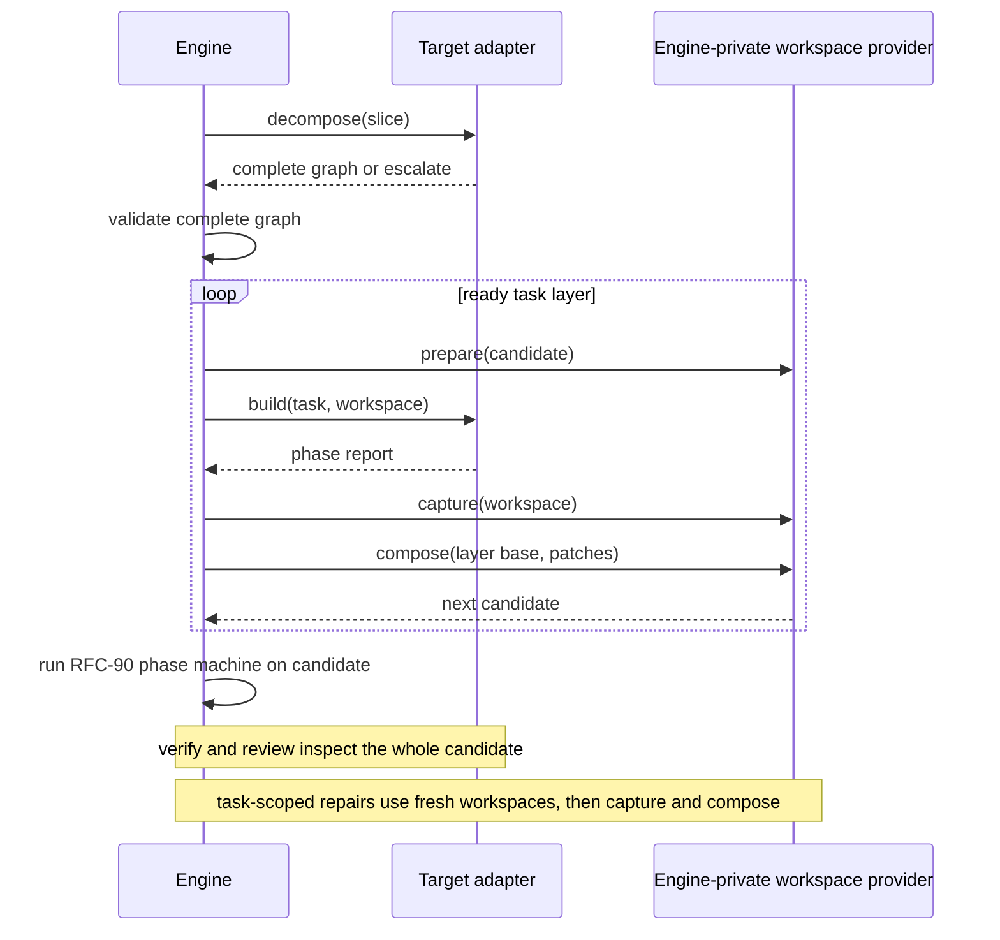
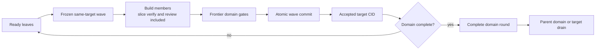

# RFC-91: Concurrent Execution

> Status: Draft — step 6 of the platform-migration series, on the scale track ([platform.md](platform.md))
>
> Owns:
>
> - single-node concurrent execution
> - engine-orchestrated, target-proposed build-task decomposition
> - private workspaces and code-patch composition
> - operator-reviewed protected verification inputs
> - domain convergence and multi-member target waves
> - the shared local pool and its fan-outs
> - the synthesis payload redesign
>
> Builds on completed [RFC-86](rfc-86-change-facts.md), [RFC-87](rfc-87-working-trees.md), [RFC-88](rfc-88-detached-changes.md), and [RFC-90](rfc-90-build-verification.md).
>
> [RFC-78](archive/rfc-78-prompt-budget.md) supplies request budgets, timeout semantics, and sessions. This RFC absorbs [RFC-79](archive/rfc-79-swarm-build.md) and [RFC-80](archive/rfc-80-synthesis-redesign.md).
>
> Amends RFC-90 D1, D2, D5, and D6. The target adds `decompose`, which is model-assisted for Omnia. `build` and `repair` each receive one validated task.
>
> The engine still owns the slice build attempt, repair loop, workspace lifecycle, composition, budgets, and terminal report.
>
> Extends RFC-88 D8. Target decomposition becomes another author of inert amendment proposals alongside ownership recovery and refinement boundary escalation.
>
> [RFC-92](rfc-92-node-sync.md) may place these tasks on remote nodes without changing their requests, ownership, workspaces, or code-patch semantics. [RFC-18](future/rfc-18-slm.md) may later use the per-task model-selection hook.

## Intent

The slice remains Emery's smallest buildable, verifiable, repairable, and mergeable lifecycle unit.

This RFC replaces large, multi-purpose model calls with focused agent tasks. Those tasks converge on one slice result.

Plan authoring already decomposes surveyed leads recursively. RFC-88 refinement can send a leaf back through focused survey when its Evidence reveals separately acceptable child boundaries.

A successful refinement produces one coherent slice with its Evidence, `spec.md`, `design.md`, and `tasks.md`. That slice remains the lifecycle and acceptance unit.

Some implementation complexity appears only after refinement. One behavioural slice may require coordinated crate, test, and guest work. The work may be too large for one model request but incoherent as separately accepted slices. This RFC divides that implementation into tasks without changing the slice boundary.

Today, one Omnia generation conversation combines all of this work with an opaque verify-repair loop. Observed builds serialized about 30 minutes of agent time. They could then fail inside a hidden review team.

Synthesis has taken 11–54 minutes while repeatedly carrying about 50 KB of playbook and artifact bodies. Survey and extract also remain serial.

Under this RFC, the engine invokes `target.decompose` at most once per slice-build attempt. The operation returns a complete `graph | escalate` answer.

Omnia uses a model-assisted prompt. An adapter that needs no decomposition may return a deterministic singleton graph.

The engine validates and executes the graph in private workspaces. It then runs RFC-90's slice-wide verify-repair-review loop.

Escalation routes an incoherent slice back to plan authoring. A later build attempt reuses the persisted graph unless the previous attempt exposed a graph-attributable failure.

One shared pool also runs independent plan leaves, decomposition calls, review specialists, survey, and extract. All concurrent consumers use the same scheduling and cancellation contract.

Synthesis remains one cross-domain model call. It fetches its playbook lazily and writes artifacts through staging.

## Flow and terms



A **slice build** is one `emery slice build` attempt. It has one terminal report and one lifecycle outcome.

A **task** is an ephemeral, agent-sized leaf in a target-proposed **task graph**. It carries:

- a thin brief
- path-first inputs
- exact product and artifact write grants
- MCP-lazy references

A **worker** is one engine-dispatched `target.build` or `target.repair` call. It is scoped to a validated task and returns a typed phase report.

Tasks need not be independently buildable or mergeable. The composed slice candidate is the first result eligible for verification and acceptance.

A task graph orders tasks into same-base **task layers**. A later **fan-in task** exclusively owns any shared path.

A **protected verification input** is an exact in-tree file or tree in the reviewed leaf envelope that no build or repair worker may change. A **protected oracle** is external read-only material identified by a reviewed logical id and content digest. Either may hold baseline tests or contract fixtures. Candidate-authored tests remain ordinary writable product paths and provide self-consistency evidence instead.

A completed writing worker yields an RFC-87 **code patch**:

```text
{ base snapshot, result snapshot, touched paths }
```

A singleton graph preserves RFC-90's single-writer shape. It runs one `target.build` before the slice-wide verify-repair-review loop.

At plan level, a **domain round** records convergence over child slice results.

A **target wave** is RFC-88's frozen same-target leaf set. The set is accepted atomically.

Task graphs and plan domains gain records. They do not gain lifecycle status or claims.

## Worked examples

One Omnia slice asks for a Rust library, its integration tests, and a WASI guest:

```text
crate writer  owns tree crates/payments/src
test writer   owns tree crates/payments/tests
guest writer  owns tree guests/payments
```

The decomposition answer proposes three tasks because they are agent-sized implementation scopes. They are not independently acceptable slices.

One task also owns build-level reporting. This designation does not create another task.

All three tasks start from `sha256:base`. The engine captures their disjoint patches and composes them into `sha256:composed`. Only this composed candidate receives slice-wide verification.

A finding at `crates/payments/src/client.rs` routes to the crate task. That task receives the complete candidate, but may change only its grant.

If every task needs `crates/payments/src/lib.rs`, that file cannot remain under the crate writer's `tree crates/payments/src` grant. A `tree` grant already includes the file, and the closed `file | tree` grammar has no exclusion form. Decomposition therefore replaces the tree with exact file grants for the parallel layer and assigns `lib.rs` exclusively to a later fan-in task:

```text
layer 1
  crate writer  owns file crates/payments/src/client.rs
  test writer   owns tree crates/payments/tests
  guest writer  owns tree guests/payments
layer 2
  integration task owns file crates/payments/src/lib.rs and build reporting
```

Layer 2 starts from Layer 1's composed candidate. Its integration patch therefore names the intermediate snapshot as its base, not `sha256:base`.

Unexpected overlap rejects the entire layer and fails the attempt before composition. The engine records an ownership finding for every contributor.

Those findings become input to the next complete graph proposal. The new proposal can narrow the writers' grants so they no longer cover the shared path and assign that path to the fan-in task.

No subset of a failed layer becomes authoritative. The engine does not use textual auto-merge.

## Decisions

### D1 — The engine owns one slice build and its task-graph phase

RFC-90's single build attempt gains one engine-owned phase before verification:

```text
decompose → validate → execute
```

The engine executes the graph one ready layer at a time. Each layer follows RFC-87:

```text
prepare → target.build → capture → compose
```

Every task in a layer starts from the same current candidate. The composed result becomes the base for the next layer.

These are orchestration steps, not new lifecycle states. `prepare` and `capture` come from RFC-87. For a singleton graph, composition is the identity.

The engine owns:

- graph validation and ordering
- workspaces and retries
- budgets
- report aggregation
- verification
- the terminal report
- the slice transition

The target adapter owns one-pass target behavior:

- the decomposition prompt
- task-specific build and repair
- candidate-wide verify and review

Before preparing a writable workspace, the engine validates the graph. It binds the graph digest to the slice revision, target identity, model-capability-profile digest, resolved inputs, and base snapshot.

Each task-scoped `build` or `repair` returns an RFC-90 phase report. The engine persists it under the slice-build attempt with the graph digest and task id.

The report's ordinal also emits RFC-90's `slice.build.phase-completed` event. Tasks have no independent terminal report. The engine aggregates their reports into the attempt's one terminal result.

On terminal success, that aggregated result feeds one RFC-86 `BuildRecord` at `builds/<digest>.yaml` for the slice attempt — base/result/`touched` of the composed candidate, the open wave digest, and the terminal report. Tasks never mint their own `BuildRecord`, wave, or merge fact.

The validated graph record is independent of any attempt. Its key is the decomposition operation key.

Every re-entry creates a new RFC-90 attempt id, new workspaces, and new continuations. The next attempt may reuse the completed graph when its profile digest is unchanged after:

- an abandoned attempt
- an infrastructure or dispatch failure
- an invalid phase report
- an exhausted repair budget where existing task grants cover the findings

The following failures are **graph-attributable**:

- an out-of-grant write
- overlap within a layer
- an unresolved finding that no task grant covers

After a graph-attributable failure, the next attempt calls `decompose` again. It supplies the prior graph and findings as planning evidence. The new operation key covers both digests.

A deterministic adapter may return the same singleton graph under the new key.

The replacement graph's base depends on the failure point. Overlap and out-of-grant writes happen before composition, so the next attempt restarts from the recorded base.

An unowned residual finding happens after the engine has composed and verified a candidate. In this case, the replacement graph may use that immutable candidate as its base snapshot.

This carries completed work forward. The follow-up graph can often contain one small fan-in task that owns the previously unowned path.

A task has no slice lifecycle, plan status, claim, independent terminal report, or merge authority.

### D2 — Target decomposition proposes one complete graph

`target.decompose` receives:

- the refined slice, including `tasks.md` and `spec.md`
- target guidance
- path-first target context
- the pinned model-capability profile and task-complexity threshold

After a graph-attributable failure, it also receives the prior graph and relevant findings. If the failure happened after composition, it receives the prior composed candidate as the proposed base.

Decomposition never edits the candidate. `target.repair` remains the separate, attempt-scoped writer. It may write only within one validated task grant.

Decomposition returns one typed `graph | escalate` answer. A graph contains the complete task set and all dependency edges.

The adapter owns its prompt and its interpretation of target architecture. The engine accepts a graph only if:

- every `tasks.md` entry is covered
- every refined `spec.md` requirement id is covered
- the task count is within the fixed budget
- every task carries the closed complexity assessment and fits the profile's task threshold
- dependencies are acyclic
- every grant is inside the slice's authorized ownership envelope
- no grant intersects a protected verification input
- predicted interaction has no ambiguous path ownership

The adapter proposes task complexity dimensions and rationale. The engine computes each score from the pinned profile. Neither the adapter nor the model selects thresholds or broadens the profile.

Exceeding one task's threshold is a reason to add or split tasks inside the graph. It is not by itself a reason to create more slices.

An `escalate` answer states that the refined slice is not coherent. It includes a typed `boundary | envelope` rationale. A `boundary` escalation says the Evidence supports independently acceptable children. An `envelope` escalation says no bounded task graph can fit the target's complete build and verification envelope.

For a `boundary` escalation, the engine uses RFC-88's refinement feedback path. Focused source surveys author child leads, affected-domain decomposition authors candidate nodes, and one inert proposal carries those candidate planning revisions. The target answer cannot author leads or slices.

For an `envelope` escalation with no coherent split, the inert proposal records the blocking profile and target envelope. It carries no invented child leads. The operator may change the model-capability profile, target, or change scope through a legal amendment.

The engine then fails the attempt with a typed `decomposition-escalated` terminal report. It does so before preparing any writable workspace.

Escalation cannot edit the plan, execute product work, or alter a frozen wave. The operator applies or discards the proposal through `emery plan amend --proposal`.

Tasks never become slices. A boundary mistake routes up to plan authoring, not down into the task graph.

Re-decomposition has a fixed budget. The engine permits at most two graph-attributable re-decompositions per slice revision. No adapter or model can reset that engine constant.

A third graph-attributable failure parks the slice for the operator. The operator can amend the plan or use the standing escalation path.

Repeated decomposition failure is evidence of a boundary problem. The engine does not retry it indefinitely.

Each validated task record contains:

- a stable task id
- a role and brief
- covered scope
- the closed complexity assessment and engine-computed score
- path-first inputs
- exact product and artifact grants
- dependencies
- whether the task owns build-level reporting

Exactly one task owns build-level reporting. That designation alone creates no extra layer.

The model may propose task values only within the slice's authorized ownership envelope. It cannot dispatch workers, select budgets, create lifecycle state, or broaden the envelope.

Invalid answers enter the ordinary bounded answer-repair path before any product write.

SDK helpers provide a deterministic singleton graph whose task owns build-level reporting. Adapters therefore need not decompose work merely because the operation exists.

An adapter may also assemble a candidate graph from deterministic target metadata. For Omnia, that may be the Cargo workspace member graph. A model call can then validate and adjust the candidate instead of inventing one.

### D3 — Every task has exclusive, enforced write ownership

The engine lowers RFC-88's slice ownership envelope into RFC-90's exact `file | tree` grammar. Task grants contain no globs and must remain within that envelope.

The reviewed leaf may carry `protected-verification-inputs[]` in the same exact `file | tree` grammar and `protected-oracles[] { id, digest }` for external material. Target metadata may nominate target- and platform-specific defaults during plan authoring, but the metadata has no authority by itself: protection becomes effective only through the operator-reviewed RFC-88 decomposition revision covered by `plan.execute.started`. The later `target.decompose` task-graph operation receives those closed sets and cannot add, remove, or widen them. The engine rejects overlap between any build or repair grant and an in-tree protected input. A target cannot freeze a path or introduce an oracle after authorization.

Protected inputs are materialized read-only into every task and candidate-wide verification workspace. Captured writes remain authoritative, and any operation that changes a protected path fails the attempt with a typed ownership finding. Digest-verified oracle material is mounted read-only outside the candidate tree under its reviewed logical id.

Predicted interaction between disjoint grants becomes a dependency.

If several writers need the same path, the graph must not leave that path under any parallel writer's grant. A `tree` grant that would cover the shared path is replaced with narrower `file` or `tree` grants that do not cover it; the shared path is assigned exclusively to a fan-in task. A dependency alone does not authorize shared-path writes.

Ambiguous ownership fails graph validation.

Only the graph's report owner may write the artifact stage during `build` or a later task-scoped `repair`.

Only that task's `build` report may return outputs or a UI-surface declaration. Every other `build` report must leave those fields empty. Every `repair` report must also leave them empty, as required by RFC-90.

Non-owner reports may still list product-workspace writes. They may not list artifact writes.

When integration work is needed, the report owner may be the terminal fan-in task. Otherwise, an existing writer can own reporting without adding a task.

The engine aggregates findings from every task report. It takes outputs and UI-surface only from the report owner's `build` report.

RFC-90's output-existence gate checks the fully composed candidate. It does not check the report owner's private workspace.

Captured touched paths are authoritative. An out-of-grant write or layer overlap fails the attempt before composition. It also invalidates the graph for the next attempt.

A model may propose the task graph, but the reviewed decomposition already fixes protected inputs. Only engine validation authorizes the graph. Textual merge never resolves ownership.

### D4 — Concurrency changes dispatch, not semantics

The engine uses one scheduler and one bounded local pool. The concurrency cap changes dispatch only. It does not select a different orchestration path.

A cap of one provides the serial reference mode. Higher caps run ready same-base writers concurrently. After verification passes, specialist model calls inside one `target.review` may also run concurrently.

The shipped default cap is four. Cap-one/four equivalence is an acceptance gate, not a separate delivery stage. The same task outcomes must produce the same ordered composition and slice result.

Workers never share a writable tree, live handle, MCP state, or prompt state. RFC-92 owns remote placement.

This replaces RFC-90 D5's one physical workspace for the complete loop. A build attempt instead has one logical candidate:

- a code snapshot
- a staged-artifact tree

The engine materializes that candidate into a fresh private workspace for every build, repair, verify, or review operation.

During initial graph execution, only the report owner receives a writable artifact stage. Every other task sees staged artifacts as read-only.

The engine carries captured code and the report owner's validated artifact diff forward. Later operations therefore observe the same logical candidate.

No two operations share a writable directory or artifact-stage handle. Intermediate snapshots and artifact diffs remain inert execution values.

The engine records the final code result and promotes staged artifacts through one success gate.

A `build` or `repair` continuation may resume only for the same task, attempt, and graph. It resumes against the current logical candidate.

The candidate-wide `review` continuation is scoped to its attempt and graph.

No continuation may encode or depend on a workspace path or live handle. Every resumed operation receives a newly materialized workspace.

### D5 — RFC-90 verification and review converge the complete slice

Writer and repair workers receive findings, not Cargo commands.

After the complete graph produces one composed candidate, the engine dispatches RFC-90 `verify`.

For one blocking verify report, the engine first applies RFC-90 D4 once to the complete slice report, producing at most 16 globally ordered repair findings. It then groups the located findings in that brief by their unique task owner. It may run pairwise-disjoint repairs concurrently:

```text
target.repair(origin: verification, task, findings, continuation)
```

All repairs caused by one report consume one RFC-90 verification-repair round, regardless of worker count.

The cap is per source report, not per worker. Findings omitted from the brief remain in the complete persisted report and may reappear after the next candidate-wide verification; fan-out never multiplies RFC-90's repair-input bound.

The engine captures and composes the repair patches. It then verifies the next complete candidate.

A task continuation cannot cross task, attempt, or graph identity. Verification is model-assisted evidence, not deterministic proof or a security boundary. A check over candidate-writable tests is self-consistency evidence. A check over protected inputs is stronger only to the extent that the report identifies those inputs and the engine enforced their write exclusion; RFC-93 defines host-attested profile assurance.

Some blocking findings cannot be routed:

- unlocated findings
- located findings on paths that no task grant covers

These remain typed residual failures. The engine does not broaden an arbitrary task's authority.

Residual failures invalidate the graph. They become planning evidence for the next attempt's decomposition call. Under D1, the follow-up graph may use the composed candidate as its base.

Findings already covered by a task grant do not invalidate the graph.

The engine never widens a task grant or mutates the graph during an attempt.

Repair grants produced by one report must remain pairwise disjoint. Captured overlap fails the attempt.

After verification passes, the engine dispatches one `target.review`.

Inside that dispatch, Omnia may run Security, Correctness, and Quality as separate specialist model calls. Each call is observable and has its own timeout. Compiled adapter code joins their results into one review phase report.

Blocking review findings use the same global RFC-90 repair-brief projection and task-owner routing:

```text
target.repair(origin: review, task, findings, continuation)
```

All repairs caused by one review report consume RFC-90's one review-remediation round. The engine then returns to `verify → review`.

The terminal report contains:

- aggregated task-build findings
- the latest verification findings
- the latest review findings

RFC-90's existing projection rules still apply.

Task-repair findings and superseded verify or review rounds remain in attempt-scoped phase records. No task passes independently.

### D6 — Code-patch composition is one reusable deterministic kernel

The engine-private RFC-87 capability gains `compose(base, patches)`.

The operation requires one base and disjoint touched paths. It copies exact result-tree values in fixed order, captures the candidate, and discards the temporary workspace.

A base mismatch or overlap fails before verification.

The same kernel combines code patches for:

- task layers
- single-target frontier rounds
- final target-wave commit

Domain verdicts and RFC-88's spec fold remain separate operations.

`augentic/backends` owns pooling and cancellation. It does not own composition.

### D7 — The synthesis playbook moves to an engine references shelf

An engine shelf such as `/mcp/engine/synthesis` serves embedded guidance through `list_docs` and `read_doc`.

The prompt keeps `synthesize.md`, its contract, its answer schema, and a measured inline minimum. It fetches the remaining roughly 50 KB only when needed.

Emery owns the shelf and its grants.

### D8 — Synthesis artifacts use a lent staging tree and an outcome-only answer

The host lends synthesis an execution-local staging tree. The answer carries only an outcome.

The deterministic tail validates the whole tree. On success, it promotes the tree atomically. On failure, it returns findings so the same agent can repair the tree in place.

D8 follows D7's live-eval gate. It changes neither synthesis authority nor provenance semantics.

### D9 — Survey and extract fan out through the shared pool

After RFC-88 pins topology, `plan author` runs independent initial and focused source surveys concurrently.

`slice refine` extracts each bound source's Evidence concurrently.

Results merge in canonical order, never completion order. The order is either binding order or `(source, parent lead, child lead)` order.

RFC-88's refinement boundary assessment runs only after all bound Evidence has joined successfully. A failed extract fails refinement through the ordinary path. No partial Evidence set can author a boundary proposal.

A validated boundary escalation promotes no synthesis artifacts and performs no `refined` transition. The engine fans out the requested focused surveys through the same pool, merges child leads canonically, and evaluates independent affected domains concurrently.

All affected leads and candidate domain revisions join into one RFC-88 amendment proposal. Completion order cannot change its content. Cancellation reaps every focused survey and decomposition call if proposal assembly fails.

RFC-88's Discover-topology host reads retain their separate budget.

### D10 — Recursive plan decomposition is bounded engine orchestration

After the initial inventory, one compiled orchestration evaluates independent RFC-88 conflict domains concurrently.

Each bounded model call receives one domain and returns a typed `split | leaf` answer.

The engine owns queueing, budgets, scope reduction, coverage, identity, and ordering.

Each call's operation key covers the relevant model-capability profile digests. A profile change cannot reuse a decomposition result from the previous planning revision.

`decomposition.yaml` and `plan.yaml` publish together only after the complete tree passes.

Partial publication and model-spawned recursion remain deferred.

### D11 — The local scheduler folds ready leaves through domain gates



`plan execute` opens at most one wave per target. It chooses from a bounded antichain where:

- dependencies are accepted
- ownership envelopes share the accepted base

The first implementation scans canonical target and leaf order up to the pool cap. It adds no optimizer or fairness policy.

The immutable wave manifest exists before claims and builds. RFC-86's landed cut enforces `members.len() == 1` (`target-wave-member-count`). This RFC retires that one-member-only gate for the concurrent executor: the same manifest schema, open fact, commit fact, and per-member `BuildRecord` revalidation accept a frozen multi-member set. Merge facts and accepted-CID semantics do not change.

A slice-build failure creates a new slice attempt under D1. It does not change wave membership. Each successful member still writes its own `BuildRecord`; wave commit consumes the complete member set.

Membership stays frozen until atomic commit or operator amendment. An amendment retracts the whole uncommitted wave. It does not shrink the wave.

After member builds, the engine groups results by their nearest frontier domain.

A single-target domain derives one canonical protected-input closure before verification. In-tree protection starts as the exact `file | tree` intersection of every contributing descendant's reviewed protected set. The engine removes an entire protected entry when any contributing patch touches that file or any descendant of that tree; it never invents an exclusion grammar or expands a tree into ambient filesystem entries. External protection is the intersection of identical `(id, digest)` oracle entries. The engine persists the closed lists, hashes them, and includes that digest in the domain operation key. An empty intersection is valid and carries no protected-oracle assurance.

A single-target `frontier` round composes only that domain's same-base child patches. It then dispatches one `target.verify` over the composed candidate.

This domain convergence gate checks interaction above the completed slice-wide verify/review loops. It is not another slice build.

One wave may therefore require several frontier rounds.

Multi-target rounds do not compose trees or dispatch cross-target verification. They aggregate ordered target results and dependency health.

For a single-target domain, a `complete` round runs the same domain-level `target.verify`. It verifies the current accepted tree and committed frontier chain.

The engine runs this round only after every child and dependency is complete. It never recomposes cross-base patches.

A multi-target `complete` round only aggregates ordered child verdicts and dependency health.

A frontier failure blocks the current frozen wave.

A complete-round failure preserves accepted waves. It blocks dependants and drain until an operator-reviewed repair or fan-in leaf advances a new epoch.

### D12 — Domain rounds are durable and target waves accept atomically

Before emitting `domain.convergence.recorded`, the engine atomically writes one closed `frontier | complete` record.

The record contains:

- revisions
- child slice-attempt or domain-record digests
- authorization anchors
- bases
- the patch chain or committed-wave chain
- result CIDs
- protected-input closure digest
- the domain-level `target.verify` report digest, when verification ran
- the verdict

The digest of the validated inputs and accepted frontier is the operation key.

On re-entry, the engine reuses a completed record. It does not rerun composition or the domain gate.

The operation key does not imply deterministic model output. Live records root candidate snapshots.

After all frontier gates pass, RFC-86's target-wave merge revalidates every member and its exact commit authorization.

The engine composes the frozen set and publishes one `target.merge.wave-committed` fact. This fact advances the accepted CID and projects every member as merged.

No prefix of the wave is authoritative.

A target drains only when:

- all leaves have merged
- postflight failures have been acknowledged
- every root domain has a passing `complete` round for the current revision and CID

## Implementation requirements

- **Task execution implements D1–D3 and D5–D6.** Add `target.decompose` and task context to RFC-90 `build` and `repair`. Add profile-scored task complexity, digest-bound graph and phase records, engine-private `compose`, operator-reviewed protected verification inputs and oracle digests, Omnia's model-assisted graph, and the SDK singleton. Implement typed residual failure, escalation, and graph-attributable re-decomposition. Enforce its two-round budget and candidate-based follow-up graphs.
- **One pool implements D4 and D9–D12.** Add one isolated host pool that supports both the cap-one reference mode and the default cap of four. Use the same scheduler path for both. Add initial survey, focused resurvey, extract, affected-domain, review, task, and repair fan-outs. Add canonical bounded-antichain scheduling, domain records, and multi-member target waves (retire `Wave::enforce_one_member` for the concurrent executor only; keep the same manifest and `target.merge.wave-committed` shape). Aggregate each slice attempt into one `BuildRecord`. Cancellation must reap every call.
- **Synthesis implements D7–D8.** Land the engine shelf and pass `omnia-r9k`. Then land staged synthesis and pass `orders-contracts`. Neither final grade may regress.
- Derive closed graph and domain schemas from Rust DTOs. Reject unknown fields.
- Persist validated-content digests, operation keys, task-scoped phase events, canonical protected-input closures, and domain records as specified above. Add no extension map or second domain-state artifact.
- Enforce D4's continuation scopes, logical-candidate scopes, worker inactivity timeouts, and capture-then-discard lifecycle.
- Use the project model by default. Journal compiled budgets, decomposition decisions, ordering, and routing.

## Acceptance criteria

1. **Omnia decomposition.** A build the size of `at-r9k-position-adapter` produces one complete graph through one model-assisted decomposition operation. Every task fits the pinned profile's task-complexity threshold. Spilled build prompts remain at or below 15 KiB. Exactly one task owns build-level reporting. No task independently passes. RFC-90 retains verification, repair budgets, and observable review specialists.
2. **Invalid graphs and re-entry.** Invalid graphs produce no writable workspace. Escalation creates only its inert proposal and terminal report. Re-entry always creates a fresh attempt. It reuses the graph unless an out-of-grant write, layer overlap, or unowned finding requires new decomposition. That call receives the prior graph and findings under a new operation key. After a post-composition failure, the follow-up graph builds from the composed candidate without rerunning completed tasks. A third graph-attributable failure parks the slice without another decomposition call.
3. **Ownership.** Predicted interaction creates dependencies. Shared paths have one fan-in owner. No task grant overlaps an operator-reviewed protected verification input, a write to one fails closed, and external oracle material must match its reviewed digest. Candidate-writable and protected-test results remain distinguishable. Captured overlap rejects the whole layer and attempt, then informs the next graph proposal. No textual merge occurs.
4. **Residual findings.** A located blocking finding on an unowned path fails the attempt as a typed residual failure. The next attempt's complete graph proposal receives it as typed input. No task grant or graph mutates in place.
5. **Private composition.** The engine composes only same-base, disjoint patches. Every target operation receives a fresh private materialization of the candidate. Targets never receive workspace lifecycle operations. Failure exposes no authoritative workspace or staged-artifact change.
6. **Concurrent target tasks.** With the pool cap set to four, two target tasks run concurrently in isolated workspaces. Cancellation reaps both. Caps of one and four produce the same ordered composition and one slice-wide result.
7. **Synthesis staging.** Synthesis loads nonessential playbook prose from the engine shelf. Its answer returns no artifact bodies. The engine promotes its staged tree only after validation.
8. **Concurrent discovery and refinement feedback.** Concurrent survey and extract preserve canonical order. A refinement boundary escalation runs focused surveys and affected-domain decomposition concurrently, then produces one byte-stable inert proposal without promoting slice artifacts. Three-level plan decomposition evaluates independent nodes concurrently and publishes no partial plan.
9. **Domain restart.** Independent leaves pass both same-target domain gates. Each operation key and record bind the canonical protected-input closure. On restart, the engine reuses each digest-bound record and candidate without repeating composition or verification.
10. **Atomic waves.** Two same-base leaves merge under one wave commit only after both complete. Retry preserves membership. Amendment retracts the uncommitted wave. Replay is idempotent. Dependencies use accepted bases. Complete-round failure blocks drain and RFC-89 sealing without rolling back accepted waves.
11. **Quality gates.** `cargo make ci` passes in every touched repository. D8 goldens regenerate. The `omnia-r9k` and `orders-contracts` live grades do not regress.

## Rejected alternatives

- **Require model-free decomposition.** Fixed role templates are useful as singleton graphs or fast paths. Arbitrary refined tasks and target architecture still require bounded model reasoning. The engine validates and bounds the call instead of treating its output as deterministic.
- **Promote agent tasks to slices.** Crate, test, guest, and integration tasks may share one behavioural contract. They become valid only after composition. Giving them lifecycle or merge authority would duplicate the workflow below its smallest acceptance unit.
- **Keep large generation and review calls, or let an adapter recursively spawn workers.** This preserves opaque nested work. One adapter `decompose` operation returns a complete `graph | escalate` answer. Compiled engine policy owns validation, budgets, dispatch, and termination.
- **Force a mis-scoped slice through task decomposition.** When refinement reveals independently acceptable boundaries, tasks would hide a planning mistake. `escalate` routes the decision to an operator-applied RFC-88 amendment. Complexity above one task's threshold does not qualify by itself because a coherent slice may use several tasks.
- **Always decompose after terminal failure, mutate the graph in place, or retry decomposition without a bound.** Technical failures and covered findings do not invalidate a graph. Repeated graph failure signals a boundary problem. A graph-attributable failure triggers a fresh, budgeted proposal for the next attempt. The engine neither widens tasks nor accepts an overlap-free subset.
- **Let adapters own workspaces or loops, share writable trees, or use textual merge.** These choices cross the workflow boundary, hide retries, and make safety depend on timing.
- **Add task phase operations, writer commands, or full repair prompts.** RFC-90 already owns verification and repair. Another loop would duplicate vocabulary and payload.
- **Partition synthesis.** Cross-domain reconciliation is the reason for the model call. D7–D8 reduce payload without changing that call.
- **Require task graphs from every target.** Only Omnia has evidence for non-singleton decomposition.
- **Add remote workers now.** RFC-92 owns placement after the single-node contract settles.
