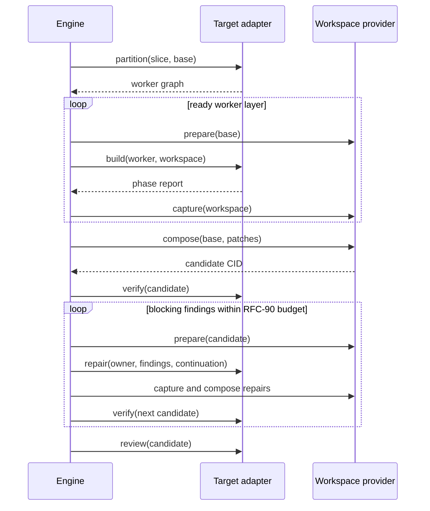
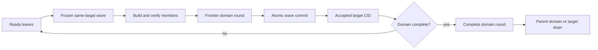

# RFC-91: Concurrent Execution

> Status: Draft — step 6 of the platform-migration series, on the scale track ([platform.md](platform.md))
>
> Owns: single-node concurrent execution — engine-orchestrated target workers, private workspaces and composition, domain convergence and multi-member target waves, the shared local pool and fan-outs, and the synthesis payload redesign.
>
> Builds on completed [RFC-86](rfc-86-change-facts.md), [RFC-87](rfc-87-working-trees.md), [RFC-88](rfc-88-detached-changes.md), and [RFC-90](rfc-90-build-verification.md). [RFC-78](archive/rfc-78-prompt-budget.md) supplies request budgets, timeout semantics, and sessions. This RFC absorbs [RFC-79](archive/rfc-79-swarm-build.md) and [RFC-80](archive/rfc-80-synthesis-redesign.md).
>
> Amends RFC-90 D1, D2, D5, and D6 for partitioned targets: the target adds deterministic `partition` plus worker context on `build` and `repair`; the engine retains the repair loop, workspace lifecycle, composition, budgets, and terminal report.
>
> [RFC-92](rfc-92-node-sync.md) may place these workers on remote nodes without changing their requests, ownership, workspaces, or code-patch semantics. [RFC-18](future/rfc-18-slm.md) may later use the per-worker model-selection hook.

## Intent

Replace large, multi-purpose judgment legs with focused workers that converge on one verified result.

Today one Omnia generation conversation combines crate, test, and guest writing with an opaque verify-repair loop; observed builds serialized about 30 minutes of agent time and failed inside a hidden review team. Synthesis likewise took 11–54 minutes while repeatedly carrying about 50 KB of playbook and artifact bodies. Survey and extract remain serial.

The target now proposes a worker graph; the engine validates and executes it in private workspaces, composes captured patches, and owns RFC-90's bounded verify-repair loop. The same pool runs independent plan leaves, review specialists, survey, extract, and decomposition judgments. Synthesis remains one cross-domain judgment, but fetches its playbook lazily and writes artifacts through staging.

## Flow and terms



A **worker** is one focused judgment request with a thin brief, path-first inputs, an exact write grant, MCP-lazy references, and a typed answer. A target-proposed **worker graph** orders workers into same-base **worker layers**; a later **fan-in task** exclusively owns any shared path. Each worker returns RFC-87's **code patch** `{ base snapshot, result snapshot, touched paths }`.

RFC-91 adds deterministic `partition` and worker context to RFC-90's `build` and `repair`; it adds no second repair, verification, or review operation. At plan level, a **domain round** records convergence over child results, while a **target wave** is RFC-88's frozen same-target leaf set accepted atomically. Internal domains gain records, not lifecycle status or claims.

## Worked examples

One Omnia slice asks for a Rust library, its integration tests, and a WASI guest:

```text
crate writer  owns tree crates/payments/src
test writer   owns tree crates/payments/tests
guest writer  owns tree guests/payments
```

All three start from `sha256:base`; the engine captures their disjoint patches and deterministically composes `sha256:composed`. A verification finding at `crates/payments/src/client.rs` routes to the crate writer, which receives the complete candidate and may change only its grant.

If all workers need `crates/payments/src/lib.rs`, the partitioner removes that path from the parallel layer:

```text
layer 1
  crate writer · test writer · guest writer
layer 2
  integration worker owns crates/payments/src/lib.rs
```

Unexpected overlap rejects the complete layer before composition. The engine routes an ownership finding to every contributor; repaired patches omit the shared path, then the fan-in task integrates it. No subset or textual auto-merge becomes authoritative.

## Decisions

### D1 — The engine owns worker and phase orchestration

RFC-90's phase machine gains `partition → validate → dispatch → capture → compose` before its first `verify`. The engine owns ordering, workspaces, retries, budgets, aggregation, and slice transition. The model-free target `partition` operation returns closed worker records with roles, dependencies, and grants; each `build` or `repair` executes one selected worker. SDK helpers provide a singleton graph, so only Omnia must partition initially.

### D2 — RFC-90's model-assisted `verify` is the convergence gate

Writer and repair workers receive findings, not Cargo commands. The engine dispatches RFC-90 `verify`, maps each located finding to its unique owner, and resumes that worker from the current candidate. Ownership conflicts route to every contributor; unlocated or unowned blocking findings fail the first cut. Same-round repairs must remain disjoint, and a continuation cannot cross worker or attempt identity. Verification is model-assisted evidence, not a deterministic proof or security boundary.

### D3 — Every worker has exclusive, enforced write ownership

Each worker has RFC-90 `file | tree` grants; predicted overlap becomes a dependency or fan-in task, and ambiguous ownership fails partitioning. One terminal worker owns build-level artifacts, outputs, and UI-surface declaration. Captured touched paths are authoritative: out-of-grant writes block, and overlap rejects the whole layer into RFC-90 repair. A model never chooses the partition, and no textual merge resolves ownership.

### D4 — Local concurrency lands as Stage A → Stage B

**Stage A** runs focused Omnia workers, repairs, and review specialists serially, but gives every writing pass a fresh RFC-87 workspace and composes immutable patches before verification. **Stage B** changes only dispatch: a bounded local pool runs same-base writers and read-only specialists concurrently with isolated MCP and prompt state. Workers never share a writable tree or live handle; RFC-92 owns remote placement.

### D5 — Review specialists are host-visible workers

Omnia's Security, Correctness, and Quality specialists become separately observable model calls with typed findings, budgets, and timeouts. The antagonist waits for all outcomes, then compiled adapter code returns one review report. Blocking findings follow RFC-90's engine-owned `repair(origin: review) → verify → review` route.

### D6 — Code-patch composition is one reusable deterministic kernel

The engine-private RFC-87 capability gains pure `compose(base, patches)`: require one base and disjoint touched paths, copy exact result-tree values in fixed order, capture the candidate, and discard the temporary workspace. Base mismatch or overlap fails before verification. Worker layers and single-target domain rounds share this kernel; `augentic/backends` owns pooling and cancellation, not composition.

### D7 — The synthesis playbook moves to an engine references shelf

An engine shelf such as `/mcp/engine/synthesis` serves embedded guidance through `list_docs` / `read_doc`. The prompt keeps `synthesize.md`, its contract, answer schema, and a measured inline minimum; it fetches the remaining roughly 50 KB lazily. Emery owns the shelf and grants.

### D8 — Synthesis artifacts use a lent staging tree and an outcome-only answer

The host lends synthesis an execution-local staging tree; the answer carries only an outcome. The deterministic tail validates the whole tree, promotes it atomically on success, or returns findings so the same agent can repair in place. D8 follows D7's live-eval gate and changes neither synthesis authority nor provenance semantics.

### D9 — Survey and extract fan out through the Stage B pool

After RFC-88 pins topology, Author slices surveys bound sources concurrently and Refine concurrently extracts per-source Evidence. Results merge in canonical binding or `(source, parent lead, child lead)` order, never completion order. RFC-88's Discover-topology host reads retain their separate budget.

### D10 — Recursive plan decomposition is bounded engine orchestration

After the initial inventory, one compiled orchestration evaluates independent RFC-88 conflict domains concurrently. Each bounded judgment receives one domain and returns typed `split | leaf`; the engine owns queueing, budgets, scope reduction, coverage, identity, and ordering. `decomposition.yaml` and `plan.yaml` publish together only after the complete tree passes. Partial publication and model-spawned recursion are deferred.

### D11 — The local scheduler folds ready leaves through domain gates



`plan execute` opens at most one wave per target from a bounded antichain whose dependencies are accepted and whose ownership envelopes share the accepted base. The first cut greedily scans canonical target and leaf order up to the pool cap; it adds no optimizer or fairness policy. The immutable manifest precedes claims and builds. Failure retries the same frozen wave; operator amendment retracts the whole uncommitted wave rather than shrinking it.

A single-target `frontier` round composes only the wave's same-base patches, verifies the candidate, and may gate that wave while dependant children remain. Multi-target rounds aggregate ordered target results without composing trees. A `complete` round verifies the current accepted tree and its committed frontier chain only after every child and dependency is complete; it never recomposes cross-base patches. Failure preserves accepted waves but blocks dependants and drain until an operator-reviewed repair or fan-in leaf advances a new epoch.

### D12 — Domain rounds are durable and target waves accept atomically

Before `domain.convergence.recorded`, the engine atomically writes one closed `frontier | complete` record containing its revisions, child digests, authorization anchors, bases, patch or committed-wave chain, result CIDs, report digests, and verdict. The digest of validated inputs and accepted frontier is its operation key. Re-entry reuses a completed record; the key does not imply deterministic model output. Live records root candidate snapshots.

After all frontier gates pass, RFC-86's target-wave merge revalidates every member and exact commit authorization, composes the frozen set, and publishes one `target.merge.wave-committed` fact that advances the accepted CID and projects every member merged. No prefix is authoritative. A target drains only after all leaves merge, postflight failures are acknowledged, and every root domain has a passing `complete` round for the current revision and CID.

## Implementation requirements

- **Stage A:** add closed worker records, deterministic `partition`, worker context on RFC-90 `build` / `repair`, and engine-private `compose`; implement the serial Omnia worker submachine with private workspaces, RFC-90's existing three verification-repair rounds and one review-remediation round, and typed residual failure.
- **Stage B:** add one isolated host pool (default cap four), concurrent build/review/survey/extract/decomposition calls, canonical bounded-antichain scheduling, closed `frontier | complete` domain records, and multi-member target waves. Pool cancellation reaps every call; provider implementation is chosen from Stage B evidence.
- **Stage C:** land D7's engine shelf, pass `omnia-r9k`, then land D8's staging tree and outcome-only answer and pass `orders-contracts`. Neither final grade may regress from its recorded baseline.
- Derive the closed domain-round schema from its Rust DTO; reject unknown fields and compute record and operation digests only from validated content. Add no extension map or second domain-state artifact.
- Scope continuations to one attempt and worker, use the project model by default, enforce worker inactivity timeouts, and journal compiled budgets, ordering, and routing. Successful workspaces are captured then discarded; RFC-87 garbage-collects abrupt leftovers.
- Emery owns orchestration, workspace lifecycle, records, scheduling, composition, synthesis staging, and fan-outs; adapters own partition proposals and one-pass target behavior; backends own pooling and cancellation. Do not add remote placement, hosted execution, a new model backend, domain-partitioned synthesis, duplicate RFC-90 operations, or mandatory Vectis/Contracts swarms.

## Acceptance criteria

1. An Omnia build the size of `at-r9k-position-adapter` uses focused engine-dispatched workers with spilled prompts no larger than 15 KiB. Cargo commands appear only in RFC-90 `verify`; findings return through `repair`, budget exhaustion preserves residual findings, and review specialists are individually observable.
2. Predicted overlap becomes a dependency or fan-in. Captured overlap rejects the whole layer and routes findings to every contributor; three disjoint writers needing one shared module converge through one later exclusive owner with no textual merge.
3. The engine composes only same-base, disjoint patches. A target never receives `prepare`, `capture`, `compose`, or `discard`; cancellation and failure expose no authoritative workspace or staged-artifact changes.
4. In Stage B, two target workers run concurrently in isolated RFC-87 workspaces and pool cancellation reaps both. Serial and concurrent runs produce the same ordered composition from the same patches.
5. Synthesis loads nonessential playbook prose from the engine shelf, returns no artifact bodies, and promotes its staged tree only after validation.
6. Concurrent survey and extract preserve canonical output order. Three-level decomposition evaluates independent nodes concurrently, publishes no partial plan, and yields the same canonical artifacts from the same answers.
7. Independent leaves pass through two same-target domain gates. Restart after each boundary reuses its digest-bound record and candidate without repeating composition or verification.
8. Two same-base leaves enter one frozen wave and become merged under one commit fact only after both complete. Retry preserves membership; amendment retracts the whole uncommitted wave; replay creates no duplicate acceptance.
9. A producer commits in an earlier frontier wave, its dependant builds from the new accepted CID, and the complete round validates the committed chain without cross-base composition. Complete-round failure blocks drain and RFC-89 sealing without rolling back accepted waves.
10. `cargo make ci` passes in every touched repository, D8 goldens regenerate, and the `omnia-r9k` and `orders-contracts` live grades do not regress.

## Rejected alternatives

- **Keep fat generation/review legs or add a lead agent** — preserves opaque nested work; deterministic engine policy must own partition validation, queueing, budgets, and termination.
- **Adapter-owned workspaces or repair loops** — crosses the workflow boundary and hides retries from RFC-90 phase records.
- **Shared writable trees or textual auto-merge** — makes safety timing-dependent; private trees, exclusive ownership, and immutable patches are the invariant.
- **Compose an overlap-free subset** — exposes partial state from a failed layer; repair the complete layer atomically.
- **Cargo commands in writers or full repair prompts** — recreates the hidden loop and repeats payload; `verify` owns commands and repairs resume with finding deltas.
- **Partition synthesis** — cross-domain reconciliation is the purchased judgment; D7–D8 reduce payload without changing it.
- **New worker repair/verify operations or mandatory target swarms** — RFC-90 already supplies the phase vocabulary, and only Omnia has evidence for partitioning.
- **Remote workers** — RFC-92 owns placement after the single-node contract settles.
