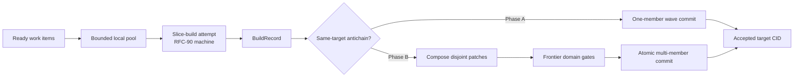

# RFC-96: Concurrent Execution

> Status: Active scheduled work in the [Services Delivery Programme](platform.md). Phase A (work-item scheduler and read-heavy pool) before Phase B (`compose` and multi-member waves); cap one remains the reference mode. Synthesis payload reduction (D9–D10) is an independent delivery slice.
>
> Owns: single-node concurrent execution — phase work items and local claims, a bounded shared pool, host-injected writer identity, private-workspace composition, domain convergence, and multi-member target waves.
>
> Does not own: target task graphs, `target.decompose`, or task-scoped write grants ([RFC-106](rfc-106-task-graphs.md), evidence-gated); remote placement ([RFC-100](rfc-100-distributed-execution.md), parked); publication worktrees ([RFC-95](rfc-95-publication-sets.md)).
>
> Builds on implemented [RFC-91](rfc-91-refinement-stage.md) and [RFC-88](rfc-88-detached-changes.md). Extends RFC-88 D8. Does **not** amend RFC-90 D5: one RFC-87 workspace still spans one slice-build attempt. [RFC-100](rfc-100-distributed-execution.md) may later place the same slice-build attempt remotely; [RFC-18](future/rfc-18-slm.md) is not activated here.

## Intent

The slice remains Emery's smallest buildable, verifiable, repairable, and mergeable lifecycle unit. This RFC replaces the serial execute cursor with a deterministic ready-set scheduler so independent slices, surveys, extracts, and refinements can run concurrently on one node.

Today one `plan execute` process walks entries one-by-one (`change::orchestrate::execute`), `StatusBody.active` is singular, `GuestMarker` (`<change-root>/guest.lock`) is the only execute-run interlock, and `Wave::enforce_one_member` refuses concurrent same-target commit. RFC-86 D23 already allows different slices to be claimed by different writers; the drain cannot use that vocabulary. RFC-87 already allows two private workspaces over one base. The missing piece is orchestration, not a new host WIT and not Git.

A later RFC-106 may divide one fat Omnia implementation into tasks without changing the slice boundary. This RFC does not add a seventh target operation. RFC-90's `build → verify ⇄ repair → review ⇄ repair` machine stays intact inside one slice-build attempt.

Parked RFC-100 may place the same work-item identity on another node. The default remote unit, when that RFC reopens, is the **whole slice-build attempt** — not a phase, not a Git branch, and not a publication worktree. This RFC does not implement distribution.

## Flow and terms



A **phase work item** is keyed by `(slice, phase, input-digest)` for `refine | build | merge`. The input digest fences dispatch against changed planning, refinement, wave, or dependency inputs.

A **slice-build attempt** is one RFC-90 machine run: one terminal report, one lifecycle outcome, one `{ base, result, touched }` captured from one private workspace. It is the unit this scheduler dispatches for `build`, and the unit RFC-100 should transport.

A **worker** in this RFC is one engine-dispatched operation under a work item — a source `survey` / `extract`, an engine refine judgment, or one complete slice-build attempt. It is not an intra-slice task.

A **target wave** remains RFC-88's frozen same-target leaf set, accepted atomically. Phase A keeps `members.len() == 1`. Phase B retires that gate for the concurrent executor only.

A completed writing attempt yields an RFC-87 **code patch**:

```text
{ base snapshot, result snapshot, touched paths }
```

## Worked examples

Two independent leaves, `payments-api` and `mobile-shell`, have no `depends-on` edge. Phase A projects both as ready `build` work items. The pool runs two RFC-90 attempts in isolated workspaces from their recorded bases. Each merge is still a one-member wave. Cross-target parallelism does not wait on `compose`.

Two same-target leaves share `payments-api` and disjoint ownership envelopes. Phase A may build both from the current accepted CID; the first merge advances that CID and the second rebuilds if its base moved. That rebuild tax is accepted. Phase B freezes both into one multi-member wave, builds each in a private workspace from the same base, composes disjoint patches, runs frontier domain `verify`, and publishes one `target.merge.wave-committed`.

A refinement drain with three independent leaves extracts and synthesizes them through the same pool. Canonical merge order is binding order, never completion order. Cap one and cap four produce the same manifests.

## Decisions

### D1 — Concurrency changes dispatch, not semantics

The engine uses one scheduler and one bounded local pool. The concurrency cap changes dispatch only; it does not select a different orchestration path. A cap of one is the serial reference mode and must reproduce today's projections and accepted CIDs. The shipped default cap is four. Cap-one/four equivalence is an acceptance gate: the same recorded patches must produce the same ordered composition and slice results.

The first implementation uses the project model for every operation. Retained telemetry records the effective route and model identity when the backend exposes them. The scheduler does not choose a model from price or labels.

Workers never share a writable tree, live handle, MCP state, or prompt state. RFC-100 owns remote placement.

RFC-90 D5 is unchanged: one disposable workspace and one artifact stage span one slice-build attempt. Per-operation rematerialization is RFC-106, when a slice has more than one writer.

### D2 — The scheduler projects a ready set, not a singular cursor

The scheduler projects deterministic phase work items keyed by `(slice, phase, input-digest)` for `refine | build | merge`.

Readiness remains phase-relative:

- refine requires fresh predecessor refinement manifests;
- build requires an exact admission-covered refinement manifest, a passing gap policy, and accepted predecessors;
- merge requires a successful build record, passing gates, and a current accepted frontier.

RFC-99 progressive candidate mode, if reopened, amends only build readiness: a direct predecessor may be an exact successful `BuildRecord` under the same parent run. Merge readiness is unchanged.

Unlike RFC-91's serial refinement drain and the landed execute cursor, this scheduler may hold multiple entries and phases in progress. Selection is canonical by target, topological layer, plan order, slice, and phase before the pool cap truncates the ready set. Status and selection do not depend on a singular `active` entry.

A local operation claim names the parent work-item identity plus the concrete operation and attempt. It prevents duplicate execution of that operation, not sibling operations, later phases, or changed inputs for the slice. The claim is released on success, terminal failure, cancellation, or retraction.

RFC-100 transports the same work-item identity through durable offers, lease-backed claims, ownership generations, and stale-result rejection. It does not redefine local readiness or selection. When it reopens, the default offer is one slice-build attempt, not a single RFC-90 phase.

`plan execute` remains one supervisor per change home. It no longer walks a single next entry.

### D3 — Claims, not `guest.lock`, fence slice work

`GuestMarker` (`<change-root>/guest.lock`) remains one execute **supervisor** per change home (`guest-marker-held` on a second `plan execute`). It does not serialize slices inside that supervisor. The in-process pool is how one execute run holds several work items.

Across writers, RFC-86 D23 is the exclusivity rule: one writer per slice; a second claim on the same slice fails `slice-claim-conflict`. A second execute process is still refused in this RFC; multi-node supervisors are RFC-100.

Wave **commit** still needs a single writer. Build attempts do not. Compare-and-set on the accepted-CID chain stays at merge.

### D4 — Writer identity is host-injected

Every journal append names a writer. Native `writer_id()` already honours non-empty `EMERY_WRITER`; the wasm32 guest cannot read process environment and today always returns `"local"`.

The launcher injects the writer id into the guest before dispatch. In-guest appends use that identity (or an explicit `append_for`) rather than the wasm32 default. Same-host Phase A may keep one supervisor writer; the plumbing must exist before a second process or RFC-100 is real.

The engine guest does not mint writer ids from the change home, the journal, or adapter metadata.

### D5 — Survey, extract, refine, and plan-author fan out through the shared pool

After RFC-88 pins topology, `plan author` runs independent initial and focused source surveys concurrently. The shared scheduler extracts each selected refinement work item's bound Evidence concurrently. Results merge in canonical order — binding order or `(source, parent lead, child lead)` — never completion order.

RFC-88's refinement boundary assessment runs only after all bound Evidence has joined successfully. A failed extract fails refinement through the ordinary path. No partial Evidence set can author a boundary proposal.

A validated boundary escalation promotes no synthesis artifacts and performs no `refined` transition. The engine fans out the requested focused surveys through the same pool, merges child leads canonically, and evaluates independent affected domains concurrently. All affected leads and candidate domain revisions join into one RFC-88 amendment proposal; completion order cannot change its content. Cancellation reaps every focused survey if proposal assembly fails.

RFC-104's system-discovery reads and RFC-88's exact delivery-binding reads retain their separate budgets.

After the initial inventory, one compiled orchestration evaluates independent RFC-88 conflict domains concurrently. Each bounded model call receives one domain and returns a typed `split | leaf` answer. The engine owns queueing, budgets, scope reduction, coverage, identity, and ordering. `decomposition.yaml` and `plan.yaml` publish together only after the complete tree passes. Partial publication and model-spawned recursion remain deferred.

Each call's operation key covers the relevant model-capability profile digests. A profile change cannot reuse a decomposition result from the previous planning revision.

### D6 — Code-patch composition is one reusable deterministic kernel

The engine-private RFC-87 capability gains `compose(base, patches)`.

The operation requires one base and disjoint touched paths. It copies exact result-tree values in fixed order, captures the candidate, and discards the temporary workspace. A base mismatch or overlap fails before verification. There is no textual merge.

The same kernel combines code patches for single-target frontier rounds and final target-wave commit. Domain verdicts and RFC-88's spec fold remain separate operations. RFC-106, if activated, reuses this kernel for task layers.

Phase A does not require `compose`. Same-target leaves still merge one-by-one through one-member waves.

### D7 — Frozen multi-member waves accept atomically

`plan execute` opens at most one wave per target. It chooses from a bounded antichain where:

- dependencies are accepted
- ownership envelopes share the accepted base

The first implementation scans canonical target and leaf order up to the pool cap. It adds no optimizer or fairness policy.

The immutable wave manifest exists before claims and builds. RFC-86's landed cut enforces `members.len() == 1` (`target-wave-member-count`). Phase B retires that one-member-only gate for the concurrent executor: the same manifest schema, open fact, commit fact, and per-member `BuildRecord` revalidation accept a frozen multi-member set. Merge facts and accepted-CID semantics do not change.

A slice-build failure creates a new slice attempt without changing wave membership. Each successful member still writes its own `BuildRecord`; wave commit consumes the complete member set. Membership stays frozen until atomic commit or operator amendment; an amendment retracts the whole uncommitted wave and does not shrink it.

After all frontier gates pass, RFC-86's target-wave merge revalidates every member and its exact commit authorization. The engine composes the frozen set and publishes one `target.merge.wave-committed` fact, which advances the accepted CID and projects every member as merged. No prefix of the wave is authoritative.

`merge-postflight-failed` stays non-rollback and sticky until `plan.merge-postflight.acknowledged`. Parallelism does not change that path.

### D8 — Domain rounds are durable

Before emitting `domain.convergence.recorded`, the engine atomically writes one closed `frontier | complete` record.

The record contains:

- revisions
- child slice-attempt or domain-record digests
- authorization anchors
- bases
- the patch chain or committed-wave chain
- result CIDs
- protected-input closure digest
- the domain-level `target.verify` report digest, when verification ran
- the verdict

The digest of the validated inputs and accepted frontier is the operation key. On re-entry, the engine reuses a completed record and does not rerun composition or the domain gate. The operation key does not imply deterministic model output; live records root candidate snapshots.

After member builds, the engine groups results by their nearest frontier domain.

A single-target domain derives one canonical protected-input closure before verification. In-tree protection starts as the exact `file | tree` intersection of every contributing descendant's covered protected set. The engine removes an entire protected entry when any contributing patch touches that file or any descendant of that tree; it never invents an exclusion grammar. External protection is the intersection of identical `(id, digest)` oracle entries. The engine persists the closed lists, hashes them, and includes that digest in the domain operation key. An empty intersection is valid and carries no protected-oracle assurance. Task-scoped grants against those paths are RFC-106.

A single-target `frontier` round composes only that domain's same-base child patches, then dispatches one `target.verify` over the composed candidate. This domain convergence gate checks interaction above the completed slice-wide RFC-90 loops; it is not another slice build. One wave may therefore require several frontier rounds. Multi-target rounds do not compose trees or dispatch cross-target verification — they aggregate ordered target results and dependency health.

For a single-target domain, a `complete` round runs the same domain-level `target.verify` over the current accepted tree and committed frontier chain, only after every child and dependency is complete, and never recomposes cross-base patches. A multi-target `complete` round only aggregates ordered child verdicts and dependency health.

A frontier failure blocks the current frozen wave. A complete-round failure preserves accepted waves and blocks dependants and drain until an operator-authorized repair or fan-in leaf advances a new epoch.

A target drains only when:

- all leaves have merged
- postflight failures have been acknowledged
- every root domain has a passing `complete` round for the current revision and CID

### D9 — The synthesis playbook moves to an engine references shelf

An engine shelf such as `/mcp/engine/synthesis` serves embedded guidance through `list_docs` and `read_doc`. The prompt keeps `synthesize.md`, its contract, its answer schema, and a measured inline minimum, and fetches the remaining roughly 50 KB only when needed. Emery owns the shelf and its grants.

This decision does not schedule work. It may land beside Phase A.

### D10 — Synthesis artifacts use a lent staging tree and an outcome-only answer

The host lends synthesis an execution-local staging tree. The answer carries only an outcome. The deterministic tail validates the whole tree: on success it promotes the tree atomically; on failure it returns findings so the same agent can repair the tree in place. D10 follows D9's live-eval gate. It changes neither synthesis authority nor provenance semantics.

### D11 — Harness evaluation measures accepted outcomes and coordination cost

The cap-one reference path and cap-four path run comparative live fixtures with the same source set, model configuration, time budget, and blind acceptance set. Blind inputs remain unavailable to planning, build, repair, verify, and review; they grade the completed attempt outside workflow authority.

The retained facts, build phases, domain records, and available model-backend observations project:

- merged requirements and accepted CIDs per wall-clock hour and per reported model cost
- time to first accepted result
- planner calls and the worker tokens and cost they induce
- touched-path heat and waves per target
- generated code and module growth as coordination signals, not quality verdicts

Missing provider usage remains unknown. Raw model calls, worker count, and generated lines are activity, not success. These projections neither gate lifecycle nor select a model. They establish the evidence needed to tune fixed budgets, or to trigger RFC-106 when one slice's `target.build` is the measured bottleneck.

## Delivery slices

This RFC has two independently useful implementation slices over one scheduler contract, plus an orthogonal synthesis slice.

### Phase A — Work-item scheduler and read-heavy pool

Land `(slice, phase, input-digest)` identity, deterministic ready-set projection, cancellation, local operation claims, host-injected writer identity, and the bounded cap-one/cap-four pool. Move initial survey, focused survey, extract, refinement, and independent plan-author domain judgments onto that pool with canonical result ordering.

Phase A keeps complete-plan publication and one-member target waves. Cross-target leaves build concurrently. Same-target leaves may build concurrently from the current accepted CID but still merge serially; a moved CID rebuilds. It adds no target operation, no `compose`, no domain rounds, and no multi-member commit.

RFC-99 progressive refinement may depend on this phase rather than completed RFC-96.

### Phase B — Composition and multi-member waves

Add engine-private `compose`, domain rounds, and multi-member waves. Retire `Wave::enforce_one_member` for the concurrent executor only. This phase completes the RFC and unlocks RFC-99 progressive build. It does not add `target.decompose`.

Cap one remains the reference path in both phases. Phase B cannot replace Phase A's identities, selection order, cancellation, or claim semantics.

### Synthesis — Playbook shelf and staged artifacts

Land D9 then D10. Pass `omnia-r9k` after the shelf; pass `orders-contracts` after staging. Neither final grade may regress. This slice does not block Phase A or B.

## Implementation requirements

- **One pool implements D1–D5.** Add one isolated host pool that supports both the cap-one reference mode and the default cap of four. Replace the serial entry cursor with deterministic `(slice, phase, input-digest)` work items and operation-scoped local claims; project a ready set, not singular `active`; release every terminal, cancelled, or retracted claim. Keep `guest.lock` as one-supervisor-per-change-home. Inject writer identity from the launcher into the wasm32 guest. Use the same scheduler path for both caps. Add initial survey, focused resurvey, extract, affected-domain, and independent refine/build/merge fan-outs. Cancellation must reap every call.
- **Composition and waves implement D6–D8.** Add engine-private `compose`. Add canonical bounded-antichain scheduling, domain records, and multi-member target waves (retire `Wave::enforce_one_member` for the concurrent executor only; keep the same manifest and `target.merge.wave-committed` shape). Aggregate each slice attempt into one `BuildRecord`. Persist canonical protected-input closures and domain records. Add no extension map or second domain-state artifact.
- **Synthesis implements D9–D10.** Land the engine shelf and pass `omnia-r9k`. Then land staged synthesis and pass `orders-contracts`.
- Derive closed domain schemas from Rust DTOs. Reject unknown fields.
- Use the project model by default. Journal compiled budgets and ordering; correlate them with backend-provided effective routing/model identity when available.
- Extend the live fixtures with D11's same-input cap-one/cap-four comparison and blind acceptance grading. Project metrics from existing facts and phase/backend telemetry rather than writing a score into workflow artifacts.
- Do not add `target.decompose`, task context on `build` / `repair`, or per-operation rematerialization. Those are RFC-106.

## Acceptance criteria

1. **Ready set.** Refine, build, and merge work may be in progress on different slices simultaneously. Status and selection do not depend on a singular active entry. Duplicate local claims on one fenced operation fail; a changed parent input creates a distinct work-item identity; every terminal, cancelled, or retracted operation releases its claim.
2. **Phase-A independence.** Concurrent survey, extract, refinement, cancellation, and cap-one/cap-four equivalence pass while composition, domain rounds, and multi-member waves remain disabled. RFC-99 can publish a closed branch into that scheduler without activating build authority. Cross-target leaves may build concurrently under one-member waves.
3. **Cap equivalence.** Caps of one and four produce the same ordered composition and accepted CIDs given the same recorded patches. Cap one matches the landed serial executor.
4. **Concurrent survey and refinement feedback.** Concurrent RFC-104 system survey/extract and RFC-88 focused delivery survey preserve canonical order within their separate artifacts and budgets. Two independent refinement work items may run concurrently and produce the same canonically ordered manifests and status projection as cap one. A refinement boundary escalation runs focused surveys and affected-domain decomposition concurrently, then produces one byte-stable inert proposal without promoting slice artifacts. Three-level plan decomposition evaluates independent nodes concurrently and publishes no partial plan.
5. **Private composition.** The engine composes only same-base, disjoint patches. Failure exposes no authoritative workspace or staged-artifact change. Unexpected overlap rejects the whole layer before verification. No textual merge occurs.
6. **Domain restart.** Independent leaves pass both same-target domain gates. Each operation key and record bind the canonical protected-input closure. On restart, the engine reuses each digest-bound record and candidate without repeating composition or verification.
7. **Atomic waves.** Two same-base leaves merge under one wave commit only after both complete. Retry preserves membership. Amendment retracts the uncommitted wave. Replay is idempotent. Dependencies use accepted bases. Complete-round failure blocks drain and RFC-95 worktree materialize without rolling back accepted waves.
8. **Synthesis staging.** Synthesis loads nonessential playbook prose from the engine shelf. Its answer returns no artifact bodies. The engine promotes its staged tree only after validation.
9. **Quality gates.** `cargo make ci` passes in every touched repository. D10 goldens regenerate. The `omnia-r9k` and `orders-contracts` live grades do not regress.
10. **Harness economics.** Cap-one and cap-four live fixtures use the same source set, model configuration, time budget, and blind acceptance set. The acceptance set is unavailable to every workflow model call and does not affect lifecycle. Results report D11's accepted-outcome and induced-worker-cost projections when their raw observations exist; missing provider usage stays unknown.
11. **RFC-90 preserved.** One slice-build attempt still uses one workspace and one artifact stage for `build → verify ⇄ repair → review ⇄ repair`. No seventh target operation exists.

## Rejected alternatives

- **Treat RFC-95 host-surface as the parallelism design.** Publication worktrees and git-aware blobstore fetch locators and export accepted CIDs. They do not schedule `plan execute`, drop the serial cursor, or compose same-base patches. Building inside a publication worktree restores shared Git state during execute.
- **Introduce `wasi-vcs` or a GitHub execution backend.** Git SHA is not an accepted CID. Forge APIs are not linearizable claim CAS. Workers must not write the operator publication worktree. Git stays behind locator fetch and RFC-95 publication.
- **Add `target.decompose` in this RFC.** Intra-slice task graphs are a different product: a seventh WIT operation, grant grammar, and graph-attributable re-decomposition. Only Omnia has evidence for non-singleton decomposition. That work is RFC-106 and waits on a measured fat slice.
- **Promote agent tasks to slices.** Out of scope here and rejected in RFC-106: crate, test, and guest writers share one behavioural contract.
- **Add remote workers now.** RFC-100 owns placement after this single-node contract settles. The work-item identity and slice-build attempt are the extension points; this RFC does not predeclare Omnia documentstore or keyvalue wire shapes.
- **Let adapters own workspaces or loops, share writable trees, or use textual merge.** These choices cross the workflow boundary, hide retries, and make safety depend on timing.
- **Partition synthesis.** Cross-domain reconciliation is the reason for the model call. D9–D10 reduce payload without changing that call.
- **Drop `guest.lock` entirely in Phase A.** One supervisor per change home is still the single-node execute interlock. Removing it before RFC-100 invites two processes mutating one change home without distributed fencing.
- **Require `compose` before any parallel build.** Cross-target leaves do not share an accepted-CID chain. Waiting on Phase B delays the common API-plus-UI case.
