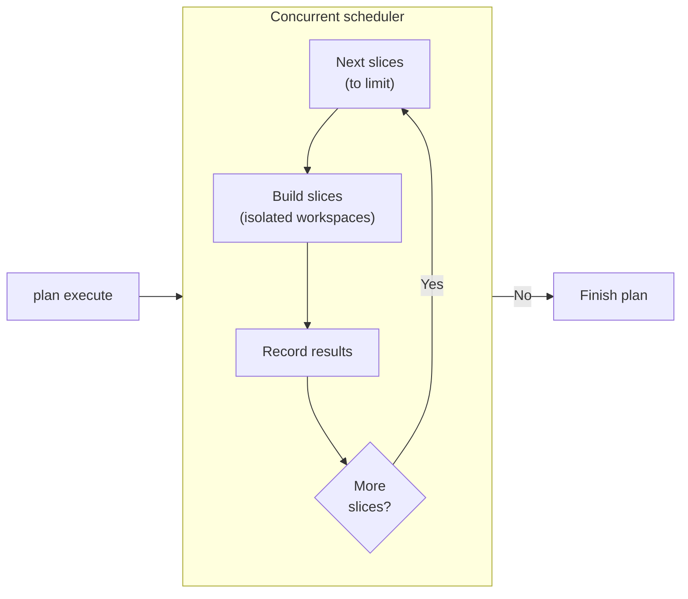

# RFC-96: Concurrent Execution

> Status: Active scheduled work in the [Services Delivery Programme](platform.md). Phase A adds the scheduler and read-heavy pool; Phase B adds composition and multi-member waves. Cap one remains the reference mode. Synthesis payload reduction (D9–D10) is an independent delivery slice.
>
> Owns: single-node concurrent execution — phase work items and local claims, a bounded shared pool, host-injected writer identity, private-workspace composition, domain convergence, and multi-member target waves.
>
> Scope boundary: this RFC does not add intra-slice task graphs, `target.decompose`, task-scoped write grants, remote execution, or publication worktrees.
>
> Preserves: one private workspace and one artifact stage per slice-build attempt, and the existing six-operation build phase machine.

## Intent

Let independent work proceed concurrently without changing Emery's lifecycle semantics. The slice remains the smallest buildable, verifiable, repairable, and mergeable unit; concurrency changes when eligible work runs, not what that work means.

The current drains process one entry at a time despite having slice claims, isolated workspaces, and dependency data. This RFC replaces that serial cursor with a deterministic ready-set scheduler and a bounded single-node pool. Cap one preserves today's serial behaviour as the reference mode.

This is not an intra-slice task system or a distributed executor. A build worker runs one complete `build → verify ⇄ repair → review ⇄ repair` attempt.

## Design at a glance

- A slice is ready when the dependencies for its next step are complete.
- Ready slices can refine, build, or merge concurrently.
- Every build uses its own private workspace.
- Finishing earlier never lets work jump ahead of the plan's authoritative order.

## Examples

**Independent targets.** `payments-api` and `mobile-shell` have no dependency edge. Phase A builds both in isolated workspaces and merges each through a one-member wave. No patch composition is needed.

**Independent slices on one target.** Phase A may build both from the current accepted CID, but merges them one at a time. If the first merge advances the CID, the second build becomes stale and is repeated. Phase B instead freezes both into one wave, composes their disjoint patches, verifies the combined result, and commits one accepted CID.

**Concurrent refinement.** Three independent leaves may extract and synthesize concurrently. Results are persisted in binding order rather than completion order, so caps of one and four produce the same manifests.

## Decisions

### D1 — Concurrency changes dispatch, not semantics

One deterministic scheduler and one bounded in-guest pool serve plan authoring, refinement, and execution. The host only injects writer identity and supports concurrent in-flight model calls; this RFC adds no scheduler WIT or host-side pool.

The launcher supplies the cap as deployment policy, never as change state. The default is four, one is legal, and a compiled maximum limits the value. Every cap follows the same orchestration path. Given the same recorded patches, cap one and cap four must produce the same ordered results and accepted CIDs.

The first implementation uses the project model for every operation. Telemetry records the effective route and model identity when the backend exposes them; the scheduler does not choose models from price or labels.

Workers share no writable tree, live handle, MCP state, or prompt state. A work-item failure stops new admission and lets in-flight siblings reach terminal reports so completed work remains reusable. Operator interruption and proposal-assembly failure cancel siblings because their partial results cannot compose. Cancellation drops the guest future, requests best-effort host abort, releases the claim, and persists no authoritative result. Abort is a spend optimization, never a correctness dependency: the model import exposes no abort surface today, so a dropped operation's host call may run to completion, and that discarded work counts as D11 coordination cost. Each operation has an engine-owned inactivity timeout informed by retained telemetry.

One disposable workspace and one artifact stage still span the entire slice-build attempt.

### D2 — The scheduler projects a ready set

Each work item is keyed by `(slice, phase, input-digest)`. The digest covers the canonical phase inputs:

| Phase    | Covered inputs                                                                                                            |
| -------- | ------------------------------------------------------------------------------------------------------------------------- |
| `refine` | canonical entry, lead, and decomposition projections; predecessor refinement digests; source CIDs; target-guidance digest |
| `build`  | fresh refinement-manifest digest; covering execution epoch; wave base; accepted predecessor identities                    |
| `merge`  | successful `BuildRecord` digest; current accepted-frontier CID                                                            |

Readiness is phase-specific:

- refine requires fresh predecessor refinement manifests
- build requires admission-covered refinement, a passing gap policy, and accepted predecessors
- merge requires a successful build record, passing gates, and a current accepted frontier

If the accepted CID moves, the build input digest changes. The stale record cannot merge; the scheduler emits a new build item and retains the old attempt as immutable audit.

Ready items are ordered by target, topological layer, plan order, slice, and phase before the cap is applied. `StatusBody` gains `in-progress[]` rows containing `slice`, `phase`, and any parked-stop detail. Existing singular fields remain the canonical head of that order, preserving one clear next command. Cap-one equivalence is scoped to the landed fields: every existing singular field reproduces today's value byte-for-byte, while `in-progress[]` is the additive delta and is omitted when empty. The [CLI output reference](../docs/reference/cli-output-shapes.md) updates with the additive field.

An operation claim covers the work-item identity, concrete operation, and attempt. It prevents duplicate execution of that operation without blocking sibling operations, later phases, or work under changed inputs. Every terminal, cancelled, or retracted operation releases its claim.

`plan execute` remains one supervisor per change home, but no longer follows one active entry.

### D3 — Claims fence work; `guest.lock` fences supervisors

`guest.lock` continues to allow one execute supervisor per change home. Inside that supervisor, an in-process registry holds operation claims; it needs no on-disk file, event, or error discriminant.

Existing durable fences remain authoritative: `slice.claimed` prevents different writers from owning the same slice, attempt directories protect build re-entry, wave facts protect merge, and accepted-CID compare-and-set serializes wave commits. Concurrent build attempts need no global commit lock.

### D4 — The host injects writer identity

The launcher exposes `EMERY_WRITER` to the wasm guest through the same environment path as `HTTP_ADDR`. Guest and native `journal::writer_id()` use a non-empty value and otherwise fall back to `local`.

Writer identity is deployment configuration, not a capability. The engine does not derive it from the change home, journal, or adapter metadata, and this RFC adds no WIT import.

### D5 — Read-heavy work uses the shared pool

The pool fans out:

- initial and focused source surveys during plan authoring
- estate surveys and extraction
- per-source extraction during refinement
- independent leaf refinement
- independent conflict-domain judgments during decomposition

Results join in canonical source, binding, lead, or domain order — never completion order. Refinement waits for every bound Evidence result before boundary assessment. Boundary escalation publishes no slice artifacts: focused surveys and affected-domain judgments join into one inert amendment proposal, or all are cancelled if proposal assembly fails.

Plan publication remains atomic. The engine owns decomposition queueing, budgets, scope reduction, identity, and ordering; model calls cannot publish partial recursion. Operation keys include the relevant model-capability profile digests. System-discovery and delivery-binding reads keep their separate budgets.

### D6 — Patch composition is one deterministic kernel

The private-workspace capability gains `compose(base, patches)`. It accepts only patches with the same base and disjoint touched paths, applies exact result-tree values in fixed order, captures the candidate, and discards the temporary workspace. Base mismatch or overlap fails before verification; there is no textual merge.

The same kernel serves frontier rounds and final wave commit. Phase A does not require it.

### D7 — Multi-member waves are frozen and atomic

Phase B may open at most one bounded wave per target: a same-target antichain whose dependencies are accepted and whose ownership envelopes share the accepted base. Membership is fixed before claims and builds. Selection follows canonical target and leaf order up to the pool cap; there is no optimizer.

The existing wave manifest and `target.wave.opened` / `target.merge.wave-committed` facts already carry member lists. Phase B retires `Wave::enforce_one_member` for the concurrent executor without changing those shapes.

A failed build creates another attempt without changing membership. An operator amendment retracts the whole uncommitted wave through the existing compare-and-set path; it cannot shrink the wave. Commit revalidates every member and authorization, composes the frozen set, and advances the accepted CID once. No prefix is authoritative.

Postflight failure remains non-rollback and sticky until acknowledged.

### D8 — Domain convergence is durable

After member builds, the engine groups results by their nearest frontier domain. A single-target frontier round composes same-base child patches and runs one `target.verify` over the combined candidate. A complete round verifies the current accepted tree only after every child and dependency is complete. Multi-target rounds aggregate ordered target verdicts and dependency health without composing trees.

Each round writes one content-addressed `DomainRound` before emitting `domain.convergence.recorded`. The closed record contains:

- `frontier | complete` kind and verdict
- revisions, authorization anchors, and bases
- child attempt or domain-record digests
- patch or committed-wave chain and result CIDs
- protected-input closure digest
- domain-level verification report digest, when verification ran

The operation key binds the validated inputs and accepted frontier, allowing restart to reuse the record and candidate without recomposition or reverification.

For in-tree protection, the closure starts with the exact intersection of every descendant's covered `file | tree` entries and removes an entry if any contributing patch touches it. External protection is the intersection of identical `(id, digest)` oracle entries. Empty and absent sets encode as canonical empty sets. Phase B adds optional protected-input fields to `Node`.

A frontier failure parks the wave as `domain-frontier-failed`. A complete-round failure preserves accepted waves but blocks dependants, drain, and publication materialization as `domain-complete-failed` until an authorized repair or fan-in leaf advances the epoch.

A target drains only when all leaves have merged, postflight failures are acknowledged, and every root domain has a passing complete round for the current revision and CID.

`DomainRound` persists at `.emery/change/targets/<target>/domains/<digest>.yaml` with unknown fields rejected. `EventKind::DomainConvergenceRecorded` names the target, domain, kind, record digest, and verdict. No other journal taxonomy changes.

### D9 — Synthesis references move out of the prompt

The launcher exposes the engine's embedded synthesis corpus at `/mcp/engine/synthesis`, beside adapter reference routes. The synthesis prompt keeps its contract, answer schema, and a measured inline minimum, loading the remaining playbook only when needed.

This reduces payload but does not schedule work. It may land independently of Phases A and B.

### D10 — Synthesis writes through a staged tree

The host lends synthesis a writable private workspace for the change-artifact bundle. The model returns only `{ outcome, findings[] }`; the deterministic tail validates the full tree and promotes it atomically on success. On failure, the same agent may repair the staged tree.

This changes neither synthesis authority nor provenance semantics and proceeds only after D9's live evaluation passes.

### D11 — Evaluation measures outcomes and coordination cost

Cap-one and cap-four fixtures use the same sources, model configuration, time budget, and blind acceptance set. Blind inputs remain unavailable to workflow model calls and grade only completed outcomes.

The harness reports accepted requirements and CIDs over time and reported cost, time to first accepted result, attempts and rebuilds, planner-induced worker usage, touched-path heat, waves per target, and code growth as a coordination signal. Cost appears only when provider usage facts exist; missing usage remains unknown.

These measurements do not affect lifecycle or model selection. They tune fixed budgets and expose coordination costs.

## Delivery

### Phase A — Scheduler and read-heavy pool

The first task is a feasibility spike: drive at least two concurrent in-flight host imports (model calls or source surveys) from the engine guest and confirm wall-clock overlap on the deployed backend. Overlap is a host obligation this RFC assumes rather than adds; if the deployment serializes in-flight calls, the pool seam decision reopens before any scheduler work.

Land work-item identity, ready-set status, stale-base requeue, local claims, host-injected writer identity, cancellation, and the shared cap-one/cap-four pool. Move survey, extract, refinement, decomposition judgments, and independent builds onto it while preserving canonical result order.

Phase A keeps one-member waves and complete-plan publication. Cross-target builds may overlap. Same-target builds may overlap, but merge serially and rebuild when their accepted base moves. It adds no composition, domain rounds, target operation, or build authority to refinement.

### Phase B — Composition and multi-member waves

Add `compose`, durable domain rounds, named domain stops, and atomic multi-member waves. Retire the one-member gate only for the concurrent executor. Cap one remains the reference path.

### Synthesis — References and staged artifacts

Land D9, then D10, using only the wire described above. `omnia-r9k` must pass after the reference shelf and `orders-contracts` after staging, with no final-grade regression. This work does not block either concurrency phase.

## Implementation constraints

- Use one scheduler path and pool for both caps; keep `guest.lock` as the one-supervisor interlock.
- Keep the cap in launcher policy, inject `EMERY_WRITER`, and use the project model by default.
- Derive `DomainRound` schema from its Rust DTO and reject unknown fields.
- Compose only same-base, disjoint patches; add no extension map or second domain-state artifact.
- Project evaluation metrics from facts and telemetry rather than writing scores into workflow artifacts.
- Do not add `target.decompose`, task context, per-operation rematerialization, remote placement, or another target operation.

## Acceptance criteria

1. **Deterministic ready set.** Different slices and phases can be in progress together. Selection, status, and persisted results are canonical; cap one reproduces the serial reference behaviour. Changed coverage creates a new work-item identity, and every terminal path releases its claim.
2. **Phase-A independence.** Survey, extract, decomposition, refinement, and cross-target builds run concurrently without composition or multi-member waves. Failures drain reusable siblings; operator interrupt and failed proposal assembly cancel them.
3. **Cap equivalence.** Given the same recorded patches, caps one and four produce the same manifests, ordered composition, slice outcomes, and accepted CIDs.
4. **Safe composition.** Only same-base, disjoint patches compose. Overlap or base mismatch fails before verification and exposes no authoritative workspace or artifact change.
5. **Durable convergence.** Domain operation keys bind protected-input closure and accepted frontier. Restart reuses completed records and candidates. Frontier and complete failures produce their named stops without rolling back accepted waves.
6. **Atomic waves.** A multi-member wave commits only after every frozen member passes. Retry preserves membership; amendment retracts the whole uncommitted wave; replay is idempotent.
7. **Synthesis staging.** Synthesis loads optional playbook prose from the engine shelf, returns no artifact bodies, and promotes only a validated staged tree.
8. **Evaluation and quality.** `cargo make ci` passes in every touched repository; required goldens regenerate; live grades do not regress; cap comparisons report accepted outcomes and available coordination cost without influencing workflow authority.
9. **Build boundaries remain intact.** One slice-build attempt still uses one workspace and one artifact stage for the existing six-operation phase machine.

## Rejected alternatives

- **Use publication worktrees or Git as execution state.** Publication exports accepted CIDs for operator review; it does not provide scheduling, isolated builds, claim compare-and-set, or deterministic patch composition.
- **Add a host-side scheduler or writer-identity WIT.** Scheduling belongs in the engine, while writer identity is ordinary deployment configuration.
- **Add `target.decompose` or promote agent tasks to slices.** Intra-slice task graphs require a separate operation and grant model.
- **Add remote workers.** Durable placement, leases, and stale-result rejection are outside this single-node design.
- **Share writable trees, let adapters own loops, or use textual merge.** Those choices cross workflow boundaries and make correctness depend on timing.
- **Require composition before any parallel build.** Cross-target builds are independent and deliver useful concurrency in Phase A.
- **Remove `guest.lock`.** One supervisor remains necessary until durable distributed fencing exists.
- **Partition synthesis.** Cross-domain reconciliation is the purpose of the synthesis call; D9–D10 reduce payload without changing its authority.
- **Add a wave-retraction verb.** The existing amendment path already retracts an uncommitted wave.
