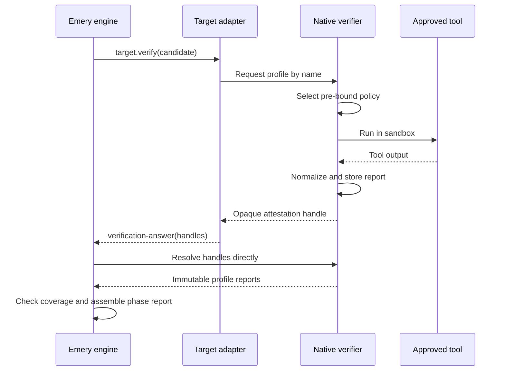
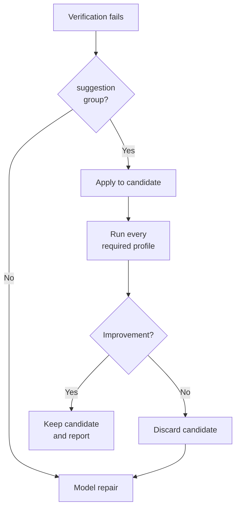

# RFC-97: Native Verification Profiles

> Status: Active — evidence track of the [Services Delivery Programme](platform.md); deterministic native verification delivered first for serial slice attempts (Phase A), then extended to concurrent domain contexts (Phase B)
>
> Owns: closed host verification profiles, native execution and sandbox policy, canonical tool diagnostics, protected-oracle assurance, report comparison primitives, one explicit bounded host-mechanical-repair phase, verification-lineage caches, and per-profile telemetry.
>
> Phase A depends on implemented [RFC-90](archive/rfc-90-build-verification.md) and delivers `slice-attempt` verification for the serial loop. Phase B depends on implemented [RFC-96](archive/rfc-96-concurrent-execution.md) only and extends the same profiles to `frontier-domain | complete-domain` contexts and RFC-96 D8 protected-input closure. [RFC-100](future/rfc-100-distributed-execution.md) and [RFC-106](future/rfc-106-task-graphs.md) material is conditional and never a Phase B completion condition. No standardized WASI execution capability is on the dependency path: the verifier executes tools natively below the component boundary, and the only WIT surface is a custom host-verification capability in its own package `emery:verification` — an Emery-owned host crate on the `wasi-exec` shape, which owns `emery:exec-mode` the same way — whose native implementation enforces this RFC's working-directory, environment, stdio, cancellation, resource, and sandbox contract.
>
> Amends RFC-90 D5 / AC5 (one *logical* candidate; the verifier and D7 mechanical repair each receive a fresh RFC-87 materialization; an accepted mechanical repair advances the logical candidate). Continuation binds to the logical candidate, not a workspace id.
>
> Evidence posture: [platform evaluation](platform.md#evidence-and-iteration-posture).

## Intent

*Have Emery's trusted native runtime run and certify verification without changing its lifecycle, budgets, or model-repair routing.*

RFC-90 uses a model to choose commands, run them, interpret their output, and report the result. A passing result is useful evidence, but Emery cannot independently prove what ran against which code.

With this RFC, target adapters request standard checks such as `build` or `test`. Emery's trusted native runtime chooses the approved tools, runs them in a locked-down environment against an unchanged code snapshot, and records a stable report bound to that exact run.

Protected oracles and host-attested profiles are Emery's form of a validation contract the implementer does not define: correctness criteria are digest-bound and executed outside the candidate's write set, not held in an orchestrator agent's context ([platform.md § Design principles](platform.md#design-principles-at-the-call-site); [RFC-98](future/rfc-98-behavioural-conservation.md) supplies the corpus oracle when the estate has no pre-existing suite).

The adapter only relays an opaque handle to that report. The engine resolves the handle directly, confirms that every required check ran in the expected context, and then applies RFC-90's existing verification and repair policy. A missing or unavailable check fails rather than becoming a false success.

Here **host** means the trusted native runtime outside the engine and adapter Wasm guests. In local execution it runs on the operator's node. If RFC-100 is reopened, it is the verifier provider on the worker that claimed the operation.

## Verification at a glance



The trust boundary has five rules:

- Adapters request profiles by name; they never supply commands, flags, parsers, environment overrides, or protected inputs.
- Deployment policy maps each target, platform, and profile to approved tools and sandbox rules.
- The host runs those tools against one immutable candidate and stores the normalized result before returning.
- Only host records resolved directly by the engine count as tool evidence.
- Missing tools, policies, reports, or required profiles fail closed.

RFC-90 still owns slice phase order, model-repair budgets, finding routing, terminal reports, and lifecycle transitions. RFC-87 supplies the Phase A materialization kernel. RFC-96 later owns domain candidates, composition, and domain verification contexts. RFC-106, if staffed, owns task-grant routing inside a slice attempt.

## Flow

1. Target resolution yields the ordered required profiles for each target and platform.
2. Before model build work begins, the engine preflights every required tool, policy, parser, sandbox feature, protected input, and cache policy. Domain verification repeats preflight for its operation key. Missing capability fails as a closed D3 discriminant.
3. Immediately before every `verify` dispatch the engine captures the attempt's logical candidate (code snapshot plus staged artifacts) and lends a fresh RFC-87 materialization to the verifier. In Phase B, RFC-96 supplies the composed domain candidate; the same per-verify capture and fresh materialization apply.
4. During `target.verify`, deterministic adapter code requests each profile by name. The host selects the pre-bound policy, executes it in the sandbox, normalizes the output, stores the report, and returns an opaque attestation handle. Targets that declare no host profiles skip this step and return today's `phase-report`.
5. The adapter returns the handles and any deterministic in-component findings. The engine resolves the handles through the verifier provider and checks exact profile, context, candidate, and policy coverage before assembling the RFC-90 phase report.
6. One eligible tool-authored fix may enter [D7](#d7--mechanical-repair-is-atomic-bounded-and-verified)'s explicit host-mechanical-repair phase. Any remaining blocking findings follow RFC-90's bounded model-repair route.

## Terms

- A **verification profile** is a closed semantic check: `fmt`, `build`, `clippy`, `test`, `doc`, `vet`, `deny`, or `ci`.
- A **profile policy** is deployment-owned data mapping a target, platform, and profile to exact commands, toolchain, parser, environment, resource limits, network access, protected-input handling, and cache policy. Its digest enters every result.
- A **profile report** is the host's normalized result for one profile against one candidate snapshot. It persists oracle assurance (D4). Execution assurance is never stored on it.
- A **logical candidate** is the attempt's one code snapshot plus staged-artifact tree. Verifier and D7 mechanical-repair dispatches each receive a fresh RFC-87 materialization of it. An accepted mechanical repair advances it through the RFC-87 capture/materialize boundary. Continuation binds to the logical candidate, not a workspace id; `verify` still cannot mutate it.
- **Execution assurance** is `model-assisted | host-attested | hybrid`, *projected* from RFC-90 `phase-source` plus direct resolution of every required host attestation. A `tool` phase with complete valid handles is `host-attested`; a phase combining that set with deterministic in-component findings is `hybrid`. It is never stored on the profile report.
- **Oracle assurance** is `candidate | protected | mixed`. It distinguishes checks over model-writable inputs from checks that consume at least one engine-enforced read-only oracle. It is orthogonal to execution assurance and is persisted on the profile report.
- A **verification context** is initially `slice-attempt`; Phase B adds `frontier-domain | complete-domain`. It identifies the change and exact slice attempt or domain operation.
- A **verification lineage** is the ordered candidate history within one context. A slice attempt may have repair revisions; a domain context normally has one candidate.
- A **profile attestation** is an opaque host-issued handle to an immutable report bound to the verifier, context, candidate, target, platform, profile, policy, and protected inputs. The adapter can relay it but cannot mint or alter it.
- A **mechanical suggestion group** is one host-attested atomic set of path-bounded whole-file replacements. Each edit names its source preimage digest, so stale or partial application fails.

## Decisions

### D1 — Host verification replaces command judgment, not the phase machine

RFC-90's engine still selects slice `verify`, routes findings into `repair`, enforces budgets, persists phase reports, and assembles the terminal report. This RFC amends RFC-90 D5 / AC5: a build attempt has one **logical candidate** (a code snapshot plus a staged-artifact tree). The engine captures that candidate immediately before every `verify` dispatch — not once per attempt — and lends the verifier a fresh RFC-87 materialization. D7 mechanical repair likewise receives a fresh materialization; an accepted mechanical repair advances the logical candidate through the RFC-87 capture/materialize boundary. Continuation survives rematerialization because it binds to the logical candidate, not a workspace id; `verify` still cannot mutate it.

Phase B leaves RFC-96 owning logical domain candidates, fresh operation workspaces, and composition. Task-grant routing is RFC-106, if staffed, and is not a Phase B completion condition.

`target.verify` becomes dual-mode. The closed return is:

```text
verify-result = report(phase-report) | attested(verification-answer)
```

Conceptually, amending RFC-90 D2's `verify` signature (pre-1.0 hard cut of the target world):

```wit
record verification-answer {
  attestations: list<attestation-handle>,
  findings: list<phase-finding>,
}

variant verify-result {
  report(phase-report),
  attested(verification-answer),
}

/// One check pass on the lent workspace.
/// Targets that declare no host profiles return `report` with today's phase-report bytes.
/// A target that declares any required host profile must return `attested`.
verify: async func(
  id: adapter-id,
  workspace: workspace,
) -> result<verify-result, error>;
```

`verification-answer` carries opaque profile-attestation handles plus optional deterministic in-component findings. The adapter contains no model leg and executes no native command itself. The engine resolves the host records and assembles the phase report. A host-only phase reports `phase-source: tool`; a phase combining host records with deterministic in-component findings reports `hybrid`, extending RFC-90's gate without changing the wire enum.

Targets that declare no host profiles keep today's `phase-report` path (`verify-result::report`) byte-unchanged. A target that declares any required host profile may not fall back silently: the engine gates on the discriminant. Incomplete preflight, unresolved/duplicate attestation, context mismatch, or execution failure is typed and fails the attempt.

This is a pre-1.0 hard cut: no silent alias for the old `result<phase-report, error>` signature. A published component declares the floor that includes this cut via `emery-floor`; an older component is not dispatched. Republishing a non-declaring target against the new signature is a type-wrapper change only — the `phase-report` payload stays byte-unchanged.

The native seam is `project::seam::Verifier`, beside `Workspaces`. It exposes the pre-bound execution context, profile run, handle resolution, and the same typed outcomes. `crates/mock` ships a scripted verifier for native tests.

Adapter-supplied `source: tool` findings fail the phase at finding granularity as a sibling of RFC-90's `target-phase-source-tool`. Report-level `tool` is accepted only on an engine-assembled phase whose tool evidence came from resolved host records. Only those records contribute `source: tool`.

Multi-profile assembly: required-profile order, project each normalized report into `phase-finding`, then one RFC-90 D2 canonicalize over the union (fingerprint dedupe across profiles included). Multi-platform: all declared project platforms' required sets run in one verify phase; each attestation is platform-bound. Operator output identifies both execution assurance and oracle assurance; neither is inferred from the other. Execution assurance is projected (never stored on the profile report).

### D2 — Profiles are semantic names; deployment policy owns commands

Target metadata declares the ordered required profile names per supported platform. The host owns the profile registry and exact command mapping. Project files, prompts, models, adapter responses, and source Evidence cannot add flags, substitute binaries, alter environment, select parsers, or redirect the registry.

The initial closed names are:

- `fmt` — formatting conformance without source mutation
- `build` — compile or platform-build viability
- `clippy` — language/platform static analysis
- `test` — target test execution
- `doc` — documentation build and documentation tests
- `vet` — dependency trust policy
- `deny` — dependency and licence policy
- `ci` — the target's complete required local gate

Names are cross-platform semantics, not Cargo commands. A Vectis `build` policy may invoke Xcode or Gradle while an Omnia `build` policy invokes Cargo. Unsupported target/platform/profile tuples fail preflight.

`ci` is an aggregate profile and is mutually exclusive with **every other** profile name in one target/platform requirement set, including names a later RFC adds (RFC-98's `conserve` does not reopen this arithmetic). Metadata that combines them is incoherent and fails resolution as `verification-profiles-incoherent` rather than running the same gate twice.

### D3 — Native execution is a denied-by-default host capability

Package `emery:verification` is owned by a capability crate on the `wasi-exec` shape (`crates/wasi-verification`, following `crates/wasi-exec`), imported by the target and workflow worlds, and linked into the shipped runtime by `omnia::runtime!`. Process execution stays in native deployment code below the component boundary; no exec-shaped interface (`wasi:exec` or otherwise) crosses WIT.

The host import accepts only a declared profile name and an opaque candidate-workspace handle. No argv, policy, target, or protected-input selector crosses WIT. Target identity, platform, verification context, policy digest, and protected-input handles come from the engine-prebound dispatch context.

```wit
package emery:verification@0.1.0;

interface verifier {
  /// Declared profile name + opaque candidate-workspace handle.
  /// Target, platform, context, policy, and protected inputs are engine-prebound.
  run-profile: async func(
    profile: string,
    candidate: workspace-handle,
  ) -> result<attestation-handle, error>;

  resolve: func(handle: attestation-handle) -> result<profile-report, error>;
}
```

Every execution classifies inputs into three closed classes:

1. **Mutable incremental tool state** — lineage-private (D8), cold-confirmed. Writes are limited to declared ephemeral build/cache roots.
2. **Immutable dependency artifacts** — a shared read-only content-addressed store, verify-on-read, exempt from D8 cold-emptying, and permitted under egress denial. The store is pre-populated by a declared, network-granted `fetch` step or by preflight. It is never a writable product tree.
3. **Network during checks** — denied. `fetch` is the only granted path, and it is not a check.

Every execution also enforces:

- candidate workspace as the working tree
- an explicit environment allowlist
- no inherited credentials
- denied network egress unless the profile policy grants an exact destination to the `fetch` step
- bounded wall time, CPU, memory, process count, and stdout/stderr
- cancellation that reaps the complete process tree
- read-only protected inputs

The closed sandbox-feature set is `workdir-bind`, `env-allowlist`, `no-inherited-credentials`, `egress-deny`, `resource-limits`, `process-tree-reap`, `ephemeral-write-roots`, and `protected-input-readonly`. Each platform publishes the minimum subset it can actually enforce. The attestation records the features that were enforced on that run — a weaker platform produces an honest weaker attestation. A required profile whose policy demands an unenforceable feature fails preflight as `verification-sandbox-denied` or `verification-platform-unsupported`.

The first-party Omnia policy — exact commands, granted `fetch` destinations, cache roots, and daemonless toolchain invocation — is a Phase A deliverable in Emery's deployment-provider layer.

Each profile run re-verifies the pinned toolchain identity against the policy digest and fails closed on drift (`verification-tool-missing`). Drift is not a post-hoc detection.

Sandbox setup failure, tool absence, parser absence, limit exhaustion, cancellation, unsupported platform, incoherent profile sets, and attestation persistence failure are the closed discriminants below. None deserialize as a passing report.

| Discriminant | Exit | When |
| --- | --- | --- |
| `verification-profile-unavailable` | 2 | Required profile has no deployment policy for this target/platform |
| `verification-sandbox-denied` | 2 | A required sandbox feature cannot be enforced, or setup failed |
| `verification-tool-missing` | 2 | Approved tool absent, or pinned toolchain identity drifted |
| `verification-parser-missing` | 2 | Policy names a parser the host does not have |
| `verification-limit-exhausted` | 2 | Wall time, CPU, memory, process count, or stdio bound hit |
| `verification-cancelled` | 1 | Host cancelled the process tree |
| `verification-platform-unsupported` | 2 | Target/platform/profile tuple is not in the registry |
| `verification-attestation-mismatch` | 2 | Resolved record fails context, candidate, policy, or digest binding |
| `verification-attestation-duplicate` | 2 | Two handles cover the same required profile/platform |
| `verification-attestation-persist-failed` | 1 | Host could not persist the normalized report before return |
| `verification-profiles-incoherent` | 2 | `ci` combined with any other profile name in one requirement set |

Exit 2 is `EXIT_VALIDATION_FAILED` (`Error::Validation`); exit 1 is `EXIT_GENERIC_FAILURE`. Adapter-supplied `source: tool` findings fail as the `target-phase-source-tool` sibling at finding granularity (D1), not as a row in this table.

A successful call stores its normalized report in the attempt tree beside `phases/` at `build/attempts/<attempt>/attestations/<handle>` (Phase B: beside the domain-round record under `targets/<target>/domains/<digest>/attestations/`) before returning its opaque handle. That attempt- or round-local tree is live location and archives with the attempt or round. A host-global store is not lifecycle authority.

If RFC-100 is reopened, the worker-side verifier provider publishes that digest-bound record through the authenticated value/coordination transport under the fenced verification operation before the handle becomes visible to the engine. The receiving provider verifies producer identity, fence, context, and digest before resolution. Adapter code receives neither publication credentials nor a writable attestation channel. Nothing in this RFC predeclares that wire, and Phase B does not wait on it.

### D4 — Protected inputs are declared on the Node; candidate checks and oracles remain distinguishable

Optional `protected-verification-inputs[]` (`file | tree`, RFC-90 grant grammar) and `protected-oracles[] { id, digest }` live on the admission-covered RFC-88/96 decomposition `Node`. RFC-96 D8 already reserved those optional fields. Target metadata may nominate defaults; they are inert until that exact decomposition revision is admission-covered.

`emery plan author` / `amend` are the only writers. `emery slice validate` / `plan validate` reject orphan paths (outside the slice ownership envelope) and grant/protection overlap.

Enforcement is capture-time rejection: if captured touched paths intersect the protected set, the attempt fails with a typed ownership finding. This RFC does not amend RFC-87 with mount-exclusion.

[RFC-98](future/rfc-98-behavioural-conservation.md) is the first `protected-oracles[]` producer (corpus admission). Phase A may still declare in-tree protected inputs. Absent a host policy that binds a mounted protected input or oracle into the executed command, reports stay `oracle-assurance: candidate`. A declaration alone never upgrades assurance.

Phase B carries the same sets through RFC-96 member admission — those values *are* this Phase A declaration surface — and derives domain closure under RFC-96 D8. Deployment policy controls how an authorized input or oracle is mounted and consumed; it cannot introduce another identity.

Candidate-authored tests remain useful: they demonstrate that the candidate passes its own checks. They do not become an independent oracle merely because the host ran them — the same reason a worker that writes its own tests cannot close a milestone validation contract. Every profile report records:

- `oracle-assurance: candidate | protected | mixed`
- candidate snapshot id
- protected input/oracle digests bound by the executed profile policy
- profile-policy digest

The host, not the model or adapter, derives oracle assurance from the executed profile policy's closed input contract and the digest-matched inputs mounted for that run. Host execution always contributes RFC-90 `phase-source: tool` (or `hybrid` when deterministic in-component findings also contribute); a tool-executed candidate check therefore remains `oracle-assurance: candidate`. Execution assurance is projected from `phase-source` plus handle resolution and is never stored on the profile report.

### D5 — Normalization is canonical before fingerprinting

Each profile policy names one deterministic parser. Structured tool output is preferred. Raw output is a bounded fallback represented by a digest plus a short, secret-filtered tail.

Normalization removes volatile data that does not identify a defect, including durations, process ids, thread ids, temporary workspace roots, and nondeterministic test ordering. It converts paths to candidate-relative `/` form, applies profile-defined cascade suppression, computes fingerprints, deduplicates, and sorts by RFC-90's closed finding key. The complete normalized report remains gate authority; RFC-90 D4 independently projects its bounded repair brief.

The report also carries two host-computable comparisons: `unchanged-failure-set(a, b)` tests equality of blocking fingerprint sets between consecutive revisions, while `regression(candidate, best)` tests lexicographic worsening of `(critical, important, suggestion, optional)` counts.

The first cut records these predicates but does not alter RFC-90's repair budgets. The engine may consume `unchanged-failure-set` as RFC-92's closed route-escalation trigger for the next `target.repair` dispatch when the pinned route policy declares that step; this changes neither the remaining dispatch count nor the report. A later evidence-backed policy may stop on repeat or restore a high-water candidate without changing the report wire shape.

### D6 — Findings shaping has a neutral and a profile-specific layer

Profile normalization may suppress known cascades and assign severities because it understands the tool's structured output. It may not discard an independent blocking root finding to fit a model context.

RFC-90 D2 verifies fingerprints and canonicalizes the complete phase report. D4 selects at most 16 blocking findings for the adapter's repair brief, but terminal success always depends on a later complete verification.

### D7 — Mechanical repair is atomic, bounded, and verified

Host mechanical repair is an explicit engine-selected phase between one failed slice verification and RFC-90's model repair. It is not a target operation, does not occupy a phase ordinal, and is never available to Phase B frontier or complete domain verification, where no writer is authorized.



A failed slice verification may offer at most one group. Every edit must come from one attested report, apply against the exact candidate, stay within the slice write grant, and touch no protected input. A group that applies outside the slice write grant or that touches a protected path is ineligible. If RFC-106 is staffed, the eligible write scope narrows to one validated task owner. Required-profile order and then suggestion-group digest choose among eligible groups.

The edit encoding is a closed group of whole-file replacements, each `{ path, preimage-digest, result-digest }`. A stale preimage fails the apply. The engine rejects a group larger than 16 edits, a file larger than 1 MiB, or a group larger than 4 MiB. These are engine constants, not fields supplied by a model, adapter, or profile policy.

A producing profile's policy declares a suggestion channel (for example a rustfmt diff, or `clippy --fix` dry-run). `fmt` as "conformance without source mutation" still holds for the *check*; suggestions come from the declared channel, not a mutating check.

The engine applies the complete group in a fresh workspace, captures a tentative snapshot, and reruns every required profile. It keeps the patch only when the originating profile's blocking fingerprint set strictly shrinks **and** `regression(candidate, best)` is false for every required profile (D5 vocabulary); otherwise it discards the tentative snapshot and routes the original findings to model repair. The keep/discard decision uses the warm rerun; the kept candidate's next verify phase still applies D8 cold confirmation. In Phase A the tentative snapshot replaces the logical candidate through the same RFC-87 capture/materialize boundary. A clean report advances to review; blocking findings route to model repair. The fix consumes no model-repair dispatch and cannot trigger another mechanical repair before the next model repair.

The engine records the slice grant, patch, source and tentative snapshots, before/after report digests, and decision under the attempt tree beside `phases/` at `build/attempts/<attempt>/mechanical-repairs/<NNNN>.yaml` (zero-padded ordinal; a new file per mechanical-repair decision). The phase emits the closed `EventKind` `slice.build.mechanical-repair-completed` (D9).

### D8 — Incremental caches are private to one verification lineage

A strict snapshot-keyed cache would make every slice repair revision cold. The host may therefore preserve incremental tool state across candidate snapshots within one Phase A slice-attempt verification lineage. In Phase B, a frontier or complete domain operation has a singleton lineage and never reuses cache state from a slice or another domain key.

D3's three input classes apply here: only class 1 (mutable incremental tool state) is lineage-private and cold-confirmed. Class 2 (immutable dependency artifacts) is shared, verify-on-read, and exempt from cold-emptying. Class 3 (network during checks) is denied.

The cache key contains:

- verification-context kind and id
- resolved target name and version
- platform
- profile-policy digest
- toolchain identity
- sandbox/environment-policy digest

The attempt has one logical candidate. RFC-96 still materializes a fresh workspace for every domain operation. The host mounts or copies the private cache into that execution without exposing it as a shared writable product tree. Every profile still executes its command and parser; cached verdicts or reports are forbidden. Cache contents never enter snapshot capture, report fingerprints, lifecycle authority, or another lineage.

Every warm passing required profile is provisional. Before it may contribute to a successful verification phase, the host reruns it once with an empty cache and uses the cold report as authority. When a warm required profile fails and the attempt would terminate (budget exhausted), the host reruns that profile cold once before minting the terminal report. Warm failures may still iterate; no attempt is *terminated* by cache state.

Attempt completion, abandonment, policy change, or verification-lineage garbage collection makes the cache disposable.

### D9 — Telemetry is raw evidence, not authority

RFC-90's phase-completed timing remains the slice-operation envelope. This RFC additionally emits one `target.verify.profile-completed` event per profile with:

- verification-context kind and id
- phase ordinal when slice-scoped
- profile and platform
- run kind (`primary | cold-confirmation`)
- candidate snapshot id
- policy and report digests
- phase source, projected execution assurance, and persisted oracle assurance
- elapsed milliseconds
- finding counts by severity
- cache disposition (`disabled | cold | warm`)
- mechanical-repair disposition (`not-offered | rejected | accepted`)

Events contain raw observations. Distribution, scheduler, and model-economics views are projections over retained events; no metric changes lifecycle state or report success.

The host-mechanical-repair phase emits `slice.build.mechanical-repair-completed` with source/tentative snapshot ids and `rejected | accepted`; profile events do not imply write authority. That name is a closed `EventKind` variant in RFC-86's journal taxonomy.

### D10 — Verification reports are reusable, not an RFC-18 reward contract

Canonical reports and telemetry may feed evaluation, synthetic filtering, or model-selection experiments, but they are not a complete code-quality score. RFC-18 also needs traceability, guardrail, layout, configuration, and migration dimensions. Training needs cannot weaken a verification gate or stabilize fields verification does not otherwise need.

### D11 — Phase B adds domain contexts without changing slice authority

After RFC-96 lands, slice, frontier-domain, and complete-domain calls use the same target/platform profile set, host policy, normalization, and attestation gate. Their verification context and candidate snapshot enter every attestation and telemetry event. Phase A wire shapes already carry the closed context field but accept only `slice-attempt`; Phase B opens the two domain variants.

Only a slice attempt has RFC-90 model-repair budgets and D7 host-mechanical-repair authority. A blocking frontier report fails the frozen wave; a blocking complete report preserves accepted waves and blocks dependants and drain, exactly as RFC-96 specifies. A domain verifier never synthesizes a writer, reuses a slice continuation, opens a repair budget, or carries cache state from its child slices.

RFC-96 D8 derives and persists the domain's canonical protected-input closure by intersecting every contributing descendant's admission-covered sets and subtracting touched paths. Member-admission protected sets are this RFC's Phase A declaration surface (D4). The closure digest enters the domain operation key, verifier context, and attestation. The host may attest domain-level `protected` or `mixed` only from that closure; a path protected by only one child contributes no domain assurance.

## Implementation requirements

- **Phase A:** extend target metadata with ordered platform-specific required profile names, change host-backed `target.verify` to return `verify-result` (`report | attested`), and add the `emery:verification` import to the target and workflow worlds. No argv-, policy-, target-, or protected-input-shaped selector enters that import. Hard-cut the target world; `emery-floor` is the compatibility story for older published components.
- Add `project::seam::Verifier` beside `Workspaces`, with pre-bound execution context, attempt-local attestation storage, opaque handles, and direct engine resolution. Native tests use a scripted verifier in `crates/mock` with the same typed outcomes.
- Define the capability in package `emery:verification`, owned by the capability crate on the `wasi-exec` shape, imported by the target and workflow worlds, and linked into the shipped runtime by `omnia::runtime!`. Process execution stays in native deployment code below the component boundary; no exec-shaped interface (`wasi:exec` or otherwise) crosses WIT.
- Digest parity: attestations bind candidate snapshot ids, so the native verifier must reach the snapshot store through the same omnia-backends filesystem blobstore crate (and the emery `<2 hex>/<62 hex>` sharded-name convention) the engine guest writes through, and must compute ids with the same workspace kernel over its `Objects` seam — a divergent id would unbind every attestation.
- Real executable bits: verification tools execute natively inside guest-prepared workspaces, so `emery:exec-mode` applying genuine `chmod` during materialization is attestation-critical — a script the guest marked executable must actually be executable when the native verifier runs it.
- Ship the first-party Omnia profile-policy registry (commands, granted `fetch` destinations, cache roots, daemonless toolchain), parsers, and per-platform sandbox floor in Emery's deployment-provider layer. Target adapters declare semantic profile names and deterministic in-component checks only; engine crates carry no concrete adapter branch.
- Preflight all required profiles before the first slice build model call and before each domain operation. Reject missing tools, policies, parsers, sandbox features, admission-covered protected inputs, incoherent `ci` overlap, toolchain-identity drift, and unsupported tuples as the closed D3 discriminants.
- Add host-attested profile reports, persisted oracle assurance, projected execution assurance, policy/context/candidate binding, canonical normalization, report comparison predicates, and engine assembly from the exact resolved attestation set (required-profile order, then one RFC-90 D2 canonicalize). Preserve RFC-90 phase source as the report provenance field. Reject adapter-authored `source: tool` findings as the `target-phase-source-tool` sibling.
- Cover Phase A protected inputs and oracles on the admission-covered Node (D4), written only by `plan author` / `amend`. Capture the logical candidate immediately before every `verify` dispatch and materialize a fresh RFC-87 verification workspace with a private lineage cache. Cold-confirm every warm passing required profile; cold-confirm a warm failure once before minting a terminal report.
- Implement D7 as an explicit slice-only host-mechanical-repair phase through RFC-87 prepare/capture/discard and the slice write grant. Persist each decision at `build/attempts/<attempt>/mechanical-repairs/<NNNN>.yaml` and journal `slice.build.mechanical-repair-completed`.
- Persist attestations at `build/attempts/<attempt>/attestations/<handle>` (Phase B: the domain-round tree). Archive with that attempt or round.
- **Phase B:** open the two domain context variants, carry Phase A protected-input values through RFC-96 member admission, and derive RFC-96 D8 protected-input closure. Domain verification has no host or model repair writer. Placement and publishing are not a Phase B requirement.
- Emit D9's context-aware per-profile events and `slice.build.mechanical-repair-completed` while keeping timing and cache data outside report fingerprints and lifecycle projection.

## Acceptance criteria

1. Phase A host-backed Omnia slice verification executes the required profile set without RFC-96, any model call, or adapter-supplied argv. The engine resolves the opaque handles directly, assembles the phase report, and reports `phase-source: tool`. Targets that declare no host profiles keep today's `phase-report` path byte-unchanged.
2. Missing tools, unsupported platforms, sandbox failures, timeouts, cancellation, parser failure, forged/duplicate/tampered/mismatched attestations, incomplete profile sets, and `ci` combined with any other profile name fail closed with the distinct D3 discriminants before false success; slice preflight failures occur before build model spend.
3. Equivalent structured output with different durations, process/thread ids, temporary roots, or result ordering produces byte-identical normalized reports and fingerprints.
4. Consecutive candidate reports compute stable unchanged-set and severity-regression predicates without changing RFC-90's repair budget.
5. Candidate-owned tests report `phase-source: tool`, `execution-assurance: host-attested`, and `oracle-assurance: candidate`. A host policy that binds an admission-covered protected in-tree or external oracle into the executed command reports oracle assurance `protected` or `mixed`; a declaration alone cannot upgrade assurance. No warm passing required profile, of any assurance, can gate without cold confirmation. No attempt is terminated by a warm-only failure: when a warm required profile fails and the attempt would terminate, that profile reruns cold once before the terminal report.
6. One exact-preimage machine-applicable group that applies within the slice write grant and touches no protected path is captured as a tentative snapshot and kept only after the originating profile's blocking fingerprint set strictly shrinks and `regression(candidate, best)` is false for every required profile. Partial, out-of-grant, protected-path, stale-preimage, over-bound, unchanged, and globally regressing groups leave the source candidate unchanged and do not consume a model repair. Domain verification never offers the phase.
7. Successive slice repair candidates in one verification lineage reuse a warm private cache. Another context, target identity, platform, toolchain, or policy cannot observe it; domain operations inherit no slice cache; cache contents never affect captured snapshots or provide a cached verdict.
8. Every Phase A slice profile execution emits the closed D9 telemetry event with `slice-attempt` context. After Phase B, cap-one and cap-four RFC-96 execution produce the same normalized domain reports for the same scripted tool outputs.
9. Phase A native and Wasm integration suites cover direct attestation resolution, profile-set completeness, command-injection refusal, environment and egress denial, resource limits, process-tree cancellation, protected-input write denial, canonical parsing, raw fallback bounds, slice mechanical rollback, cold confirmation for every oracle-assurance class, cache isolation, and telemetry. Phase B adds domain no-repair and closure coverage.
10. Captured touched paths that intersect the admission-covered protected set fail the attempt with a typed ownership finding. `emery slice validate` / `plan validate` reject orphan protected paths and grant/protection overlap. Writers other than `plan author` / `amend` cannot introduce a protected input or oracle.
11. Attempt completion, abandonment, policy change, and verification-lineage garbage collection dispose the lineage cache. A subsequent lineage cannot observe it.
12. `wasm-omnia-r9k` (or its successor) passes under Phase A host verification with no final-grade regression, and reports verification wall-clock and cold-confirmation overhead against the model-assisted baseline from D9 telemetry.

## Rejected alternatives

- **Engine-direct profile dispatch, skipping the adapter `verify` loop.** Rejected so deterministic in-component findings stay on the existing operation and the RFC-90 `verify` shape is preserved. The adapter requests profiles by name and relays handles; it does not choose commands or mint attestations.
- **Target-declared arbitrary profile names.** Eight closed names keep the host registry and parsers finite. A later RFC may add a name (RFC-98's `conserve`) without reopening D2's `ci` exclusivity.
- **Snapshot-keyed caching instead of cold confirmation.** A snapshot-keyed cache would make every slice repair revision cold. Lineage-private warm state plus mandatory cold confirmation (and cold-before-terminal on a failing required profile) preserves iteration without letting cache state certify a gate.
- **A mechanical-repair fix queue.** One atomic group per failed verification, then model repair, keeps write authority and budgets identical to RFC-90. A queue would invent a second repair loop the engine does not own.
