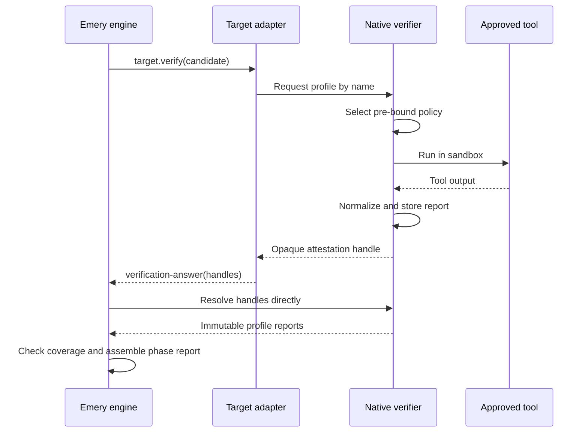
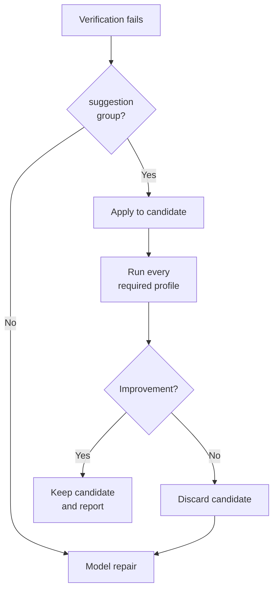

# RFC-97: Native Verification Profiles

> Status: Future draft — deterministic native-verification follow-on outside the platform-migration critical path
>
> Owns: closed host verification profiles, native execution and sandbox policy, canonical tool diagnostics, protected-oracle assurance, report comparison primitives, one explicit bounded host-mechanical-repair phase, verification-lineage caches, and per-profile telemetry.
>
> Depends on [RFC-87](rfc-87-working-trees.md), [RFC-90](rfc-90-build-verification.md), and [RFC-96](rfc-96-concurrent-execution.md). No standardized WASI execution capability is on the dependency path: the verifier executes tools natively below the component boundary, and the only WIT surface is a custom host-verification capability in its own package (e.g. `emery:verification`) — an Emery-owned host crate on the `wasi-exec-bits` shape, which owns `emery:exec-bits` the same way — whose native implementation enforces this RFC's working-directory, environment, stdio, cancellation, resource, and sandbox contract.
>
> Evidence posture: [platform evaluation](platform.md#evidence-and-iteration-posture).

## Intent

*Have Emery's trusted native runtime run and certify verification without changing its lifecycle, budgets, or model-repair routing.*

RFC-90 uses a model to choose commands, run them, interpret their output, and report the result. A passing result is useful evidence, but Emery cannot independently prove what ran against which code.

With this RFC, target adapters request standard checks such as `build` or `test`. Emery's trusted native runtime chooses the approved tools, runs them in a locked-down environment against an unchanged code snapshot, and records a stable report bound to that exact run.

Comparable products write a validation contract before features and inject black-box validators at milestones so the implementer does not define “done.” Protected oracles and host-attested profiles are Emery's stronger form of that contract: correctness criteria are digest-bound and executed outside the candidate's write set, not held in an orchestrator agent's context ([platform.md § Absorbed lessons](platform.md#absorbed-lessons-not-the-opposite-bet); [RFC-98](rfc-98-behavioural-conservation.md) supplies the corpus oracle when the estate has no pre-existing suite).

The adapter only relays an opaque handle to that report. The engine resolves the handle directly, confirms that every required check ran in the expected context, and then applies RFC-90's existing verification and repair policy. A missing or unavailable check fails rather than becoming a false success.

Here **host** means the trusted native runtime outside the engine and adapter Wasm guests. In local execution it runs on the operator's node; under RFC-100 it is the verifier provider on the worker that claimed the operation.

## Verification at a glance

The trust boundary has five rules:

- Adapters request profiles by name; they never supply commands, flags, parsers, environment overrides, or protected inputs.
- Deployment policy maps each target, platform, and profile to approved tools and sandbox rules.
- The host runs those tools against one immutable candidate and stores the normalized result before returning.
- Only host records resolved directly by the engine count as tool evidence.
- Missing tools, policies, reports, or required profiles fail closed.

RFC-90 still owns phase order, model-repair budgets, finding routing, terminal reports, and lifecycle transitions. RFC-96 still owns immutable candidates, private workspaces, task ownership, and composition.

## Flow

1. Target resolution yields the ordered required profiles for each target and platform.
2. Before model build work begins, the engine preflights every required tool, policy, parser, sandbox feature, protected input, and cache policy. Domain verification repeats preflight for its operation key. Missing capability returns typed `unavailable`.
3. RFC-96 composes an immutable candidate and materializes a fresh verification workspace.
4. During `target.verify`, deterministic adapter code requests each profile by name. The host selects the pre-bound policy, executes it in the sandbox, normalizes the output, stores the report, and returns an opaque attestation handle.
5. The adapter returns the handles and any deterministic in-component findings. The engine resolves the handles through the verifier provider and checks exact profile, context, candidate, and policy coverage before assembling the RFC-90 phase report.
6. One eligible tool-authored fix may enter D7's explicit host-mechanical-repair phase. Any remaining blocking findings follow RFC-90's bounded model-repair route.

## Terms

- A **verification profile** is a closed semantic check: `fmt`, `build`, `clippy`, `test`, `doc`, `vet`, `deny`, or `ci`.
- A **profile policy** is deployment-owned data mapping a target, platform, and profile to exact commands, toolchain, parser, environment, resource limits, network access, protected-input handling, and cache policy. Its digest enters every result.
- A **profile report** is the host's normalized result for one profile against one candidate snapshot.
- **Assurance** is `candidate | protected | mixed`. It distinguishes checks over model-writable inputs from checks that consume at least one engine-enforced read-only oracle.
- A **verification context** is `slice-attempt | frontier-domain | complete-domain`. It identifies the change and exact slice attempt or domain operation.
- A **verification lineage** is the ordered candidate history within one context. A slice attempt may have repair revisions; a domain context normally has one candidate.
- A **profile attestation** is an opaque host-issued handle to an immutable report bound to the verifier, context, candidate, target, platform, profile, policy, and protected inputs. The adapter can relay it but cannot mint or alter it.
- A **mechanical suggestion group** is one host-attested atomic set of path-bounded edits. Each edit names its source preimage digest, so stale or partial application fails.

## Decisions

### D1 — Host verification replaces command judgment, not the phase machine

RFC-90's engine still selects `verify`, routes findings into `repair`, enforces budgets, persists phase reports, and assembles the terminal report. RFC-96 still owns logical candidates, fresh operation workspaces, task-grant routing, and composition.

This RFC changes the `target.verify` result from a target-authored phase report to a `verification-answer` carrying opaque profile-attestation handles plus optional deterministic in-component findings. The adapter contains no model leg and executes no native command itself. The engine resolves the host records and assembles the phase report. A host-only phase reports `phase-source: tool`; a phase combining host records with deterministic in-component findings reports `hybrid`, extending RFC-90's gate without changing the wire enum.

Targets that do not declare host profiles may retain RFC-90 model-assisted verification. A target that declares any required host profile may not fall back silently: incomplete preflight, unresolved/duplicate attestation, context mismatch, or execution failure is typed and fails the attempt. Adapter-supplied tool findings are ignored; only resolved host records contribute `source: tool`. Operator output identifies the verification mode and assurance.

### D2 — Profiles are semantic names; deployment policy owns commands

Target metadata declares the ordered required profile names per supported platform. The host owns the profile registry and exact command mapping. Project files, prompts, models, adapter responses, and source Evidence cannot add flags, substitute binaries, alter environment, select parsers, or redirect the registry.

The initial closed names are:

- `fmt` — formatting conformance without source mutation
- `build` — compile or platform-build viability
- `clippy` — language/platform static analysis
- `test` — target test execution
- `doc` — documentation build and documentation tests
- `vet` — dependency trust policy
- `deny` — dependency and licence policy
- `ci` — the target's complete required local gate

Names are cross-platform semantics, not Cargo commands. A Vectis `build` policy may invoke Xcode or Gradle while an Omnia `build` policy invokes Cargo. Unsupported target/platform/profile tuples fail preflight.

`ci` is an aggregate profile and is mutually exclusive with the seven constituent names in one target/platform requirement set. Metadata that combines them is incoherent and fails resolution rather than running the same gate twice.

### D3 — Native execution is a denied-by-default host capability

The adapter target world imports a host-verification capability that accepts only a declared profile name and opaque candidate-workspace handle. The host takes target identity, platform, verification context, policy digest, and protected-input handles from the engine-prebound dispatch context rather than adapter-supplied values. No string command, arbitrary executable, policy selector, or protected-input selector crosses WIT.

Every execution enforces:

- candidate workspace as the working tree
- an explicit environment allowlist
- no inherited credentials
- denied network egress unless the profile policy grants an exact destination
- bounded wall time, CPU, memory, process count, and stdout/stderr
- cancellation that reaps the complete process tree
- writes limited to declared ephemeral build/cache roots
- read-only protected inputs

Sandbox setup failure, tool absence, parser absence, limit exhaustion, cancellation, unsupported platform, and attestation persistence failure are distinct typed outcomes. None deserialize as a passing report. A successful call stores its normalized report in the host verifier's immutable attestation store before returning its opaque handle.

Under RFC-100 placement, the worker-side verifier provider publishes that digest-bound record through the authenticated value/coordination transport under the fenced verification operation before the handle becomes visible to the engine. The receiving provider verifies producer identity, fence, context, and digest before resolution. Adapter code receives neither publication credentials nor a writable attestation channel. Attestation records archive with the slice attempt or domain round that consumes them.

### D4 — Candidate checks and protected oracles remain distinguishable

RFC-96's admission-covered `protected-verification-inputs[]` is the authority for in-tree baseline tests and fixtures that workers cannot change. Digest-bound external material must appear in `protected-oracles[]` before a profile may mount it read-only outside the candidate tree. Deployment policy controls how an authorized input or oracle is mounted and consumed; it cannot introduce another identity.

Candidate-authored tests remain useful: they demonstrate that the candidate passes its own checks. They do not become an independent oracle merely because the host ran them — the same reason a worker that writes its own tests cannot close a milestone validation contract. Every profile report records:

- `assurance: candidate | protected | mixed`
- candidate snapshot id
- protected input/oracle digests bound by the executed profile policy
- profile-policy digest

The host, not the model or adapter, derives assurance from the executed profile policy's closed input contract and the digest-matched inputs mounted for that run. A protected declaration alone does not upgrade the report; only a host policy that binds the protected input into the executed command may attest `protected` or `mixed`.

### D5 — Normalization is canonical before fingerprinting

Each profile policy names one deterministic parser. Structured tool output is preferred. Raw output is a bounded fallback represented by a digest plus a short, secret-filtered tail.

Normalization removes volatile data that does not identify a defect, including durations, process ids, thread ids, temporary workspace roots, and nondeterministic test ordering. It converts paths to candidate-relative `/` form, applies profile-defined cascade suppression, computes fingerprints, deduplicates, and sorts by RFC-90's closed finding key. The complete normalized report remains gate authority; RFC-90 D4 independently projects its bounded repair brief.

The report also carries two host-computable comparisons: `unchanged-failure-set(a, b)` tests equality of blocking fingerprint sets between consecutive revisions, while `regression(candidate, best)` tests lexicographic worsening of `(critical, important, suggestion, optional)` counts.

The first cut records these predicates but does not alter RFC-90's repair budgets. A later evidence-backed policy may stop on repeat or restore a high-water candidate without changing the report wire shape.

### D6 — Findings shaping has a neutral and a profile-specific layer

Profile normalization may suppress known cascades and assign severities because it understands the tool's structured output. It may not discard an independent blocking root finding to fit a model context.

RFC-90 D2 verifies fingerprints and canonicalizes the complete phase report. D4 selects at most 16 blocking findings for the adapter's repair brief, but terminal success always depends on a later complete verification.

### D7 — Mechanical repair is atomic, bounded, and verified

Host mechanical repair is an explicit engine-selected phase between one failed slice verification and RFC-90's model repair. It is not a target operation and is never available to RFC-96 frontier or complete domain verification, where no writer is authorized.

A failed slice verification may offer at most one group. Every edit must come from one attested report, apply against the exact candidate, stay within one validated task owner's paths, and touch no protected input. Required-profile order and then suggestion-group digest choose among eligible groups.

The engine applies the complete group in a fresh workspace, captures a tentative snapshot, and reruns every required profile. It keeps the patch only when the originating profile strictly improves and no profile regresses; otherwise it discards the tentative snapshot and routes the original findings to model repair. On acceptance, the engine composes the patch under the owner's grant and makes the tentative candidate and its report current. A clean report advances to review; blocking findings route to model repair. The fix consumes no model-repair dispatch and cannot trigger another mechanical repair before the next model repair. The engine records the owner, patch, source and tentative snapshots, before/after report digests, and decision.

### D8 — Incremental caches are private to one verification lineage

A strict snapshot-keyed cache would make every slice repair revision cold. The host may therefore preserve incremental tool state across candidate snapshots within one slice-attempt verification lineage. A frontier or complete domain operation has a singleton lineage and never reuses cache state from a slice or another domain key.

The cache key contains:

- verification-context kind and id
- resolved target name and version
- platform
- profile-policy digest
- toolchain identity
- sandbox/environment-policy digest

RFC-96 still materializes a fresh workspace for every operation. The host mounts or copies the private cache into that execution without exposing it as a shared writable product tree. Every profile still executes its command and parser; cached verdicts or reports are forbidden. Cache contents never enter snapshot capture, report fingerprints, lifecycle authority, or another lineage.

Every warm passing required profile is provisional. Before it may contribute to a successful verification phase, the host reruns it once with an empty cache and uses the cold report as authority. This preserves warm failure/repair iteration without letting stale or candidate-poisoned incremental state certify any lifecycle gate. Attempt completion, abandonment, policy change, or verification-lineage garbage collection makes the cache disposable.

### D9 — Telemetry is raw evidence, not authority

RFC-90's phase-completed timing remains the slice-operation envelope. This RFC additionally emits one `target.verify.profile-completed` event per profile with:

- verification-context kind and id
- phase ordinal when slice-scoped
- profile and platform
- run kind (`primary | cold-confirmation`)
- candidate snapshot id
- policy and report digests
- assurance
- elapsed milliseconds
- finding counts by severity
- cache disposition (`disabled | cold | warm`)
- mechanical-repair disposition (`not-offered | rejected | accepted`)

Events contain raw observations. Distribution, scheduler, and model-economics views are projections over retained events; no metric changes lifecycle state or report success.

The host-mechanical-repair phase emits its own completed event with source/tentative snapshot ids and `rejected | accepted`; profile events do not imply write authority.

### D10 — Verification reports are reusable, not an RFC-18 reward contract

Canonical reports and telemetry may feed evaluation, synthetic filtering, or model-selection experiments, but they are not a complete code-quality score. RFC-18 also needs traceability, guardrail, layout, configuration, and migration dimensions. Training needs cannot weaken a verification gate or stabilize fields verification does not otherwise need.

### D11 — Slice and domain verification share profiles, not repair authority

RFC-96's slice, frontier-domain, and complete-domain calls use the same target/platform profile set, host policy, normalization, and attestation gate. Their verification context and candidate snapshot enter every attestation and telemetry event.

Only a slice attempt has task owners, RFC-90 model-repair budgets, and D7 host-mechanical-repair authority. A blocking frontier report fails the frozen wave; a blocking complete report preserves accepted waves and blocks dependants and drain, exactly as RFC-96 specifies. A domain verifier never synthesizes a writer, reuses a slice continuation, opens a repair budget, or carries cache state from its child slices.

RFC-96 D11 derives and persists the domain's canonical protected-input closure by intersecting every contributing descendant's admission-covered sets and subtracting touched paths. Its digest enters the domain operation key, verifier context, and attestation. The host may attest domain-level `protected` or `mixed` only from that closure; a path protected by only one child contributes no domain assurance.

## Implementation requirements

- Extend target metadata with ordered platform-specific required profile names, change host-backed `target.verify` to return `verification-answer`, and add the host-verification import to the target world. No argv-, policy-, target-, or protected-input-shaped selector enters that import.
- Add a deployment-neutral verifier capability to the engine/provider seam with pre-bound execution context, immutable attestation storage, opaque handles, and direct engine resolution. Native tests use a scripted verifier with the same typed outcomes.
- Define the capability in its own WIT package owned by the capability crate (following `emery:exec-bits` / `crates/wasi-exec-bits`), imported by the target and workflow worlds, and linked into the shipped runtime by `omnia::runtime!`. Process execution stays in native deployment code below the component boundary; no exec-shaped interface (`wasi:exec` or otherwise) crosses WIT.
- Digest parity: attestations bind candidate snapshot ids, so the native verifier must reach the snapshot store through the same omnia-backends filesystem blobstore crate (and the emery `<2 hex>/<62 hex>` sharded-name convention) the engine guest writes through, and must compute ids with the same workspace kernel over its `Objects` seam — a divergent id would unbind every attestation.
- Real executable bits: verification tools execute natively inside guest-prepared workspaces, so `emery:exec-bits` applying genuine `chmod` during materialization is attestation-critical — a script the guest marked executable must actually be executable when the native verifier runs it.
- Ship the first-party profile-policy registry, exact command mappings, parsers, and sandbox binding in Emery's deployment-provider layer. Target adapters declare semantic profile names and deterministic in-component checks only; engine crates carry no concrete adapter branch.
- Preflight all required profiles before the first slice build model call and before each domain operation. Reject missing tools, policies, parsers, sandbox features, admission-covered protected inputs, and unsupported tuples as typed `unavailable`.
- Add host-attested profile reports, assurance, policy/context/candidate binding, canonical normalization, report comparison predicates, and engine assembly from the exact resolved attestation set. Ignore adapter-authored tool findings.
- Extend RFC-96 candidate materialization with read-only protected-input handles and private verification-lineage caches without sharing product workspaces. Cold-confirm every warm passing required profile.
- Implement D7 as an explicit slice-only host-mechanical-repair phase through RFC-87 prepare/capture/discard and RFC-96 unique-owner composition. Domain verification has no host or model repair writer.
- Emit D9's context-aware per-profile and mechanical-phase events while keeping timing and cache data outside report fingerprints and lifecycle projection.

## Acceptance criteria

1. A host-backed Omnia verification executes the required profile set without any model call or adapter-supplied argv. The engine resolves the opaque handles directly, assembles the phase report, and reports `phase-source: tool`.
2. Missing tools, unsupported platforms, sandbox failures, timeouts, cancellation, parser failure, forged/duplicate/tampered/mismatched attestations, and incomplete profile sets fail closed with distinct typed outcomes before false success; slice preflight failures occur before build model spend.
3. Equivalent structured output with different durations, process/thread ids, temporary roots, or result ordering produces byte-identical normalized reports and fingerprints.
4. Consecutive candidate reports compute stable unchanged-set and severity-regression predicates without changing RFC-90's repair budget.
5. Candidate-owned tests report `assurance: candidate`. A host policy that binds an admission-covered protected in-tree or external oracle into the executed command reports `protected` or `mixed`; no worker can modify its protected inputs and a declaration alone cannot upgrade assurance. No warm passing required profile, of any assurance, can gate without cold confirmation.
6. One exact-preimage machine-applicable group under one task owner is captured as a tentative snapshot and kept only after strict originating-profile improvement plus no regression across the complete profile set. Partial, cross-owner, protected-path, unowned, unchanged, and globally regressing groups leave the source candidate unchanged and do not consume a model repair. Domain verification never offers the phase.
7. Successive slice repair candidates in one verification lineage reuse a warm private cache. Another context, target identity, platform, toolchain, or policy cannot observe it; domain operations inherit no slice cache; cache contents never affect captured snapshots or provide a cached verdict.
8. Every slice and domain profile execution emits the closed D9 telemetry event with its verification context. Cap-one/four RFC-96 execution and local/remote RFC-100 placement produce the same normalized reports for the same scripted tool outputs.
9. Native and Wasm integration suites cover direct attestation resolution, profile-set completeness, command-injection refusal, environment and egress denial, resource limits, process-tree cancellation, protected-input write denial, canonical parsing, raw fallback bounds, unique-owner mechanical rollback, domain no-repair behavior, cold confirmation for every assurance class, cache isolation, and telemetry.

